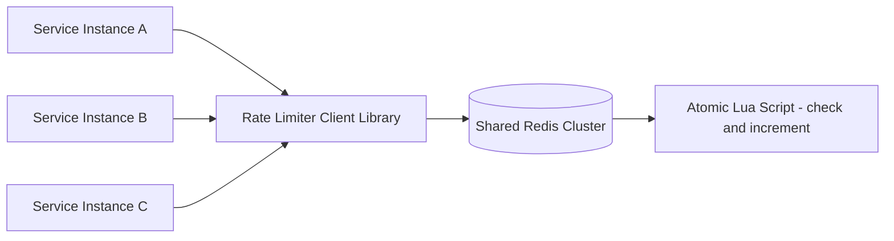

# Design a Distributed Rate Limiter Used Across Microservices

## Blogs and websites

## Medium

## Youtube

## Theory

### Problem Statement

Design a rate limiter that enforces limits (per API key/user/service) consistently across many stateless microservice instances, so the aggregate limit is respected regardless of which instance handles a request.

### Functional Requirements

- Enforce a limit (e.g., N requests per window) per client key, shared across all service instances
- Support multiple algorithms (fixed window, sliding window, token bucket)
- Return remaining quota / retry-after to callers
- Support per-route or per-tier (free/paid) limit overrides

### Non-Functional Requirements

- **Scale**: Tens of thousands of requests/sec across hundreds of service instances
- **Latency**: Rate-limit check must add < 5ms p99 to the request path
- **Consistency**: Limit must hold globally even though checks happen from many instances concurrently
- **Availability**: The limiter must fail open or gracefully degrade if the shared store is unavailable, rather than taking down every service

### High-Level Architecture

### Key Design Points

- Use a shared, low-latency store (Redis) reachable by every service instance, with the check-and-increment logic executed as a single atomic Lua script to avoid race conditions between concurrent requests hitting different instances.
- Sliding-window-log or sliding-window-counter algorithms give smoother enforcement than fixed windows, which allow bursts at window boundaries; token bucket is preferred when short bursts should be tolerated.
- Shard the Redis keyspace by client key (consistent hashing across a Redis cluster) so no single node becomes a hotspot for a high-traffic client.
- On Redis unavailability, fail open (allow requests) with a circuit breaker and alert, rather than rejecting all traffic - protects overall availability at the cost of temporarily unenforced limits.

### Trade-offs

- A shared external store adds a network hop and a new dependency to every request path, but is the only way to get a globally consistent count across independently scaled instances; purely local (in-process) counters are faster but only enforce a per-instance limit, not a global one.
- Token bucket / sliding window counters trade a small amount of memory and precision for much smoother traffic shaping compared to fixed windows.
