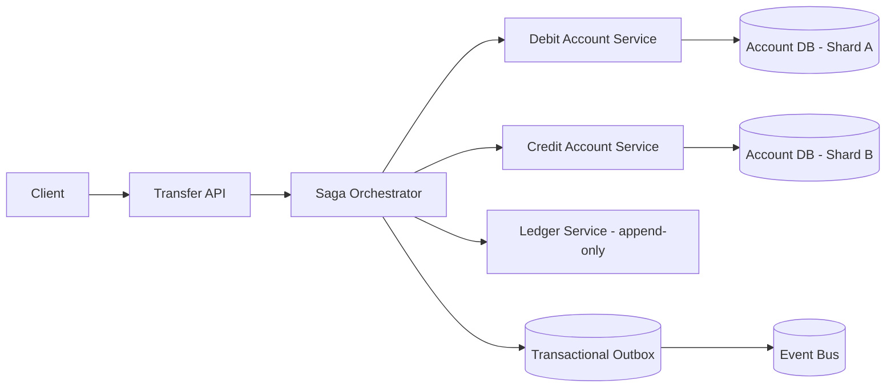

# Design a Distributed Transaction System for a Banking Application

## Blogs and websites

## Medium

## Youtube

## Theory

### Problem Statement

Design a system that executes money-movement transactions (transfers, payments) that may span multiple independently-owned services/databases (accounts service, ledger service, notification service) while guaranteeing that money is never created or destroyed, even under partial failures.

### Functional Requirements

- Transfer funds between two accounts, possibly owned by different services/shards
- Guarantee atomicity: either both the debit and credit apply, or neither does
- Support compensating actions if a later step in a multi-step transaction fails
- Provide a durable, queryable ledger of every transaction and its final state

### Non-Functional Requirements

- **Scale**: Millions of accounts, high transaction volume with strict correctness requirements
- **Consistency**: Strong consistency for the balance-affecting operations; no double-spend or lost updates
- **Durability**: Every transaction outcome must be durably recorded before being reported as final
- **Availability**: The system should not be a single point of failure; individual service outages should not corrupt balances

### High-Level Architecture

### Key Design Points

- Use the Saga pattern (orchestrated) instead of a classic two-phase commit across services: debit the source account, then credit the destination; if the credit step fails, run a compensating transaction to reverse the debit. This avoids holding distributed locks across services for the duration of the transfer.
- Record every step transactionally with the transactional outbox pattern: within the same local DB transaction that changes a balance, write an outbox event; a separate relay process publishes outbox events to the rest of the system, guaranteeing the state change and the event are never inconsistent with each other.
- Make every step idempotent (keyed by a unique transaction ID) so retries after a timeout/crash never double-debit or double-credit.
- Maintain an append-only ledger of debits/credits (double-entry bookkeeping) as the ultimate source of truth; account "balance" is a materialized view that can always be recomputed/reconciled from the ledger.

### Trade-offs

- Sagas trade strict two-phase-commit atomicity (which doesn't scale well and can deadlock across services) for eventual consistency with compensating actions - this means there is a brief window where money has left one account but hasn't yet arrived in the other, which must be handled carefully in what the system reports to the user (e.g., "transfer pending").
- Double-entry ledger plus materialized balances is more storage/compute than storing only a running balance, but makes every historical state auditable and reconciliation possible after any failure.
