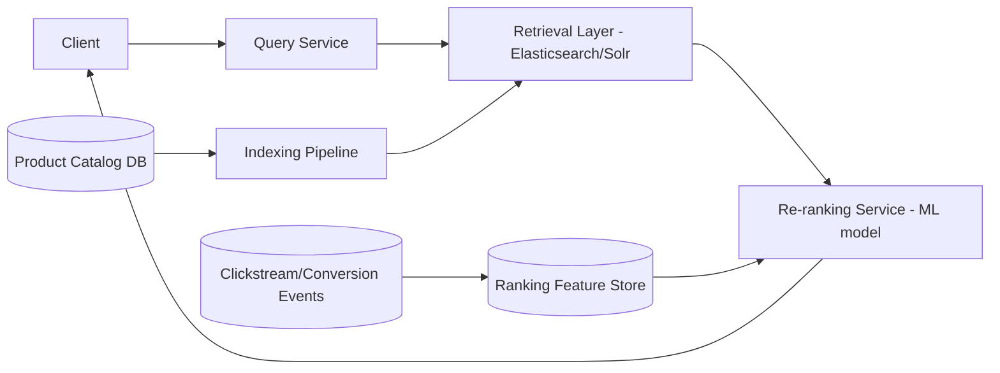

# Design a Search and Ranking System for an E-Commerce Catalog (like Flipkart)

## Blogs and websites

## Medium

## Youtube

## Theory

### Problem Statement

Design a search-and-ranking system for a large e-commerce catalog (hundreds of millions of SKUs) that returns relevant, well-ranked results for free-text queries within a few hundred milliseconds, balancing textual relevance with business signals (popularity, margin, in-stock, sponsored placement).

### Functional Requirements

- Full-text search over product title/description/attributes with typo tolerance and synonyms
- Faceted filtering (brand, price range, category, rating) alongside search
- Rank results using relevance + business signals (CTR/conversion history, stock, price competitiveness, sponsored slots)
- Personalize ranking per user where signal is available (past purchases/browsing)

### Non-Functional Requirements

- **Scale**: Hundreds of millions of products, tens of thousands of search QPS at peak (sales events)
- **Latency**: End-to-end search response < 200ms p99
- **Freshness**: Price/stock changes should reflect in search results within minutes; new products indexed within minutes of creation

### High-Level Architecture

### Key Design Points

- Split search into a fast "retrieval" stage (an inverted-index search engine returning a broad candidate set using textual relevance, typo tolerance, and filters) followed by a "re-ranking" stage that applies a learned model over a much smaller candidate set (hundreds, not millions) to blend relevance with business/personalization signals - this keeps the expensive ML scoring bounded and fast.
- Build the search index via an asynchronous indexing pipeline that consumes catalog change events (new product, price update, stock update) so the index stays close to real time without every catalog write going through the search engine synchronously.
- Maintain a ranking feature store fed by a stream processor over clickstream/conversion events (CTR, add-to-cart rate, recent sales velocity per product) so the re-ranker has fresh behavioral signals, not just static catalog attributes.
- Handle sponsored/promoted listings as a distinct insertion step after organic ranking, so advertising logic stays decoupled from the relevance model.

### Trade-offs

- Two-stage retrieval + re-ranking adds an extra network hop and a second scoring service compared to ranking everything inside the search engine, but it's the only practical way to apply a heavier ML model without blowing the latency budget over hundreds of millions of documents.
- Near-real-time (minutes-level) index freshness is far cheaper to operate than fully synchronous indexing, and is an acceptable trade for a catalog where prices/stock don't need sub-second propagation into search.
