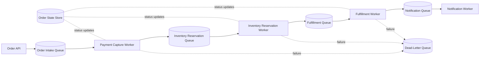

# Design a Fault-Tolerant Queue-Based Order Processing System

## Blogs and websites

## Medium

## Youtube

## Theory

### Problem Statement

Design an order processing system where each order goes through multiple steps (payment capture, inventory reservation, fulfillment, notification) that must complete reliably even if individual workers or downstream services crash, retry, or become temporarily unavailable, without losing orders or processing one twice.

### Functional Requirements

- Accept a new order and enqueue it for processing
- Process an order through an ordered sequence of steps, each performed by a (possibly different) worker/service
- Retry a failed step with backoff, and move permanently-failing orders to a dead-letter queue for manual handling
- Guarantee each step executes effectively-once (no double payment capture, no double inventory decrement) despite at-least-once delivery from the queue
- Provide order status visibility at every stage

### Non-Functional Requirements

- **Scale**: Tens of thousands of orders/minute at peak (e.g., flash sale)
- **Reliability**: No order should be silently lost; every step must be retried until it succeeds or is explicitly failed
- **Consistency**: Steps must not be applied twice (e.g., charging a customer twice) even when the same message is redelivered
- **Observability**: Every order's current stage and failure history must be queryable

### High-Level Architecture

### Key Design Points

- Model the order pipeline as a chain of queues, one per stage, so each stage can be scaled, deployed, and retried independently; a slow/overwhelmed fulfillment stage doesn't block payment capture for new orders.
- Give every order a unique ID and make every stage's handler idempotent, keyed by that ID (e.g., "has this order already been charged?" checked before calling the payment provider), since queue-based delivery is typically at-least-once and messages can be redelivered after a worker crash or a visibility-timeout expiry.
- Track explicit order state (e.g., `CREATED → PAID → RESERVED → FULFILLED → NOTIFIED`, or a `FAILED` terminal state) in a durable store updated by each worker after its step succeeds, so status is always queryable and a crashed worker can determine exactly where to resume.
- Use retry with exponential backoff per stage, and after a configured number of attempts, move the message to a dead-letter queue for manual/automated remediation rather than retrying forever and blocking the queue.
- Use compensating actions for steps that must be undone if a later step fails permanently (e.g., release the inventory reservation and refund the payment if fulfillment ultimately cannot succeed).

### Trade-offs

- A chain of per-stage queues adds more infrastructure (more queues/workers to operate and monitor) than a single monolithic order-processing function, but isolates failures/backpressure per stage and allows independent scaling - essential at flash-sale-level order volume.
- Idempotency keys and durable state tracking add write overhead to every step, but are the only reliable way to get effectively-once processing semantics on top of an at-least-once delivery queue.
