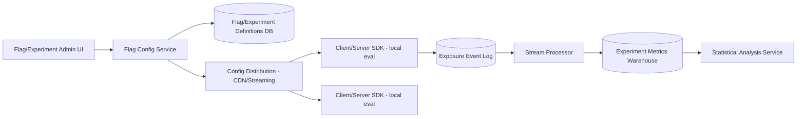

# Design a Scalable Feature Flag and Experimentation Platform

## Blogs and websites

## Medium

## Youtube

## Theory

### Problem Statement

Design a feature flag and A/B experimentation platform that lets engineers toggle features and run experiments (assign users to variants) across a large user base, with flag evaluation happening on nearly every request, and experiment results measurable with statistical rigor.

### Functional Requirements

- Define feature flags with targeting rules (percentage rollout, user attributes, allow/deny lists)
- Define experiments with multiple variants and consistent, sticky user-to-variant assignment
- Evaluate a flag/experiment for a given user with very low latency, from client SDKs or backend services
- Log exposure events (which user saw which variant) for downstream metrics analysis
- Support instant kill-switch (turn off a flag globally) without a deploy

### Non-Functional Requirements

- **Scale**: Flag/experiment evaluation happens on nearly every request across the whole product - must be extremely low latency and high throughput
- **Consistency**: The same user must consistently get the same variant across sessions/requests for the life of an experiment (sticky bucketing)
- **Availability**: Flag evaluation must keep working even if the central flag service is unreachable (fail to a safe default)
- **Freshness**: A flag toggle/kill-switch should propagate to all evaluation points within seconds

### High-Level Architecture

### Key Design Points

- Ship flag/experiment definitions (rules, not per-user decisions) to every SDK instance, and evaluate the targeting rule locally (in-process) using a deterministic hash of `(user_id, flag_id)` to pick a variant - this makes evaluation a microseconds-fast local computation with no network call per request, and guarantees the same user always gets the same variant (sticky bucketing) without needing to store per-user assignments centrally.
- Distribute rule updates via a CDN/streaming push (not a request-time DB call) so a flag change propagates to all instances within seconds, and instances keep functioning off their last-fetched rule set if the config service is temporarily unavailable.
- Log an "exposure" event asynchronously the first time a user is evaluated against an experiment, decoupled from the request's critical path, and stream these events into a metrics warehouse joined against business metrics (conversion, revenue) for analysis.
- Support an instant kill-switch as a special always-off rule that's distributed through the same low-latency propagation path as any other flag change.

### Trade-offs

- Local, hash-based evaluation avoids a network call per flag check (critical since flags are checked extremely often) at the cost of not being able to do arbitrarily complex, stateful targeting that would require a server round-trip; most targeting needs (percentage rollout, attribute rules) fit the hash-based model well.
- Deterministic hashing for bucketing removes the need to store a per-user assignment table, but means changing the hashing scheme or flag ID will typically re-bucket users - a real constraint experimentation platforms must document and avoid doing casually mid-experiment.
