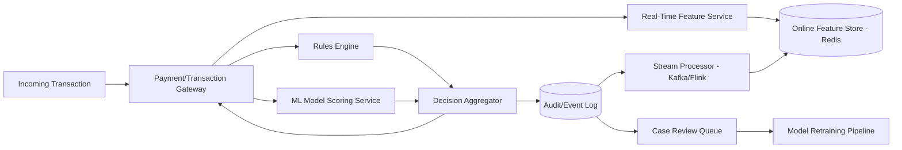

# Design a Fraud Detection Pipeline for Financial Transactions

## Blogs and websites

## Medium

## Youtube

## Theory

### Problem Statement

Design a real-time fraud detection pipeline that evaluates every financial transaction (payment, transfer, withdrawal) against rules and ML models, and decides to allow, flag for review, or block it, within the latency budget of the payment flow.

### Functional Requirements

- Score every transaction in real time using rules (velocity checks, blocklists, geo-mismatch) and an ML risk model
- Allow / challenge (step-up auth) / block a transaction based on the risk score
- Feed labeled outcomes (confirmed fraud / confirmed legitimate) back into model retraining
- Provide an audit trail and a case-review queue for flagged transactions

### Non-Functional Requirements

- **Scale**: Thousands of transactions/sec at peak
- **Latency**: Real-time scoring must complete within tens of milliseconds so it doesn't add noticeable delay to checkout/transfer
- **Consistency**: Velocity/aggregate features (e.g., "transactions from this card in the last 5 minutes") must reflect very recent activity
- **Auditability**: Every decision must be explainable and traceable for compliance

### High-Level Architecture

### Key Design Points

- Maintain an online feature store (Redis or similar) updated by a stream processor consuming the transaction event log, so velocity/aggregate features (counts, sums over rolling windows) are available with sub-second freshness at scoring time.
- Run cheap deterministic rules (blocklist, hard velocity caps) synchronously and in parallel with ML model inference, then combine both into a final decision - rules can short-circuit to an instant block without waiting on the model.
- Keep the synchronous scoring path minimal (feature lookup + model inference) and push everything else (persisting full audit detail, notifying review queues, retraining data collection) to an asynchronous pipeline off the critical path.
- Close the loop: analyst decisions and confirmed chargebacks become labeled training data, feeding a periodic (not real-time) model retraining pipeline.

### Trade-offs

- A hybrid rules + ML approach is more operationally complex than rules-only, but rules alone can't catch novel fraud patterns and ML-only can't guarantee hard business constraints (e.g., "always block known stolen cards") - combining both covers both weaknesses.
- Keeping feature computation online (pre-aggregated) instead of computing it at query time from raw transaction history trades storage/streaming complexity for the low latency required at the point of sale.
