# Key Value Store

> Create a distributed key value store use golang and rust for writing different components and use helm for infrastructure using kubernetes stateful set

## Blogs and websites

## Medium

## Youtube

- [DESIGN A KEY-VALUE STORE | Amazon System Design Interview Quest. | HLD of Key-Value DB & DynamoDB](https://www.youtube.com/watch?v=VKNIhztQnbY)

## Github

- [Key Value Store](https://github.com/oryankibandi/key-value-store?tab=readme-ov-file)


## Theory

### Topics Covered

1. [Introduction to Key-Value Stores](#introduction-to-key-value-stores)
2. [Characteristics](#characteristics)
3. [Pros](#pros)
4. [Cons](#cons)
5. [Use Cases](#use-cases)
6. [Key Components](#key-components)
7. [Architectural Patterns](#architectural-patterns)
8. [Benefits](#benefits)
9. [Challenges](#challenges)
10. [Best Practices](#best-practices)
11. [When to Use a Key-Value Store](#when-to-use-a-key-value-store)
12. [Data Model and API](#data-model-and-api)
13. [Storage Engines](#storage-engines)
14. [Replication Strategies](#replication-strategies)
15. [Partitioning and Sharding](#partitioning-and-sharding)
16. [Consistent Hashing](#consistent-hashing)
17. [Quorum, Read Repair and Anti-Entropy](#quorum-read-repair-and-anti-entropy)
18. [Versioning and Vector Clocks](#versioning-and-vector-clocks)
19. [Hinted Handoff and Sloppy Quorum](#hinted-handoff-and-sloppy-quorum)
20. [Write Path and Read Path](#write-path-and-read-path)
21. [Compaction and Bloom Filters](#compaction-and-bloom-filters)
22. [Failure Detection and Membership](#failure-detection-and-membership)
23. [CAP Theorem and Consistency Trade-offs](#cap-theorem-and-consistency-trade-offs)
24. [Real-World Implementations](#real-world-implementations)
25. [Java and Spring Boot Implementation Guide](#java-and-spring-boot-implementation-guide)

---

### Introduction to Key-Value Stores

A key-value store is a non-relational database that stores data as a collection of key-value pairs. Every record is identified by a unique key, and the value can be a simple string, number, JSON object, binary blob, or any serializable structure. The store exposes a small set of operations, usually `get(key)`, `put(key, value)`, and `delete(key)`.

The mental model is a giant distributed hash map. Unlike relational databases, there is no fixed schema, no joins, and often no multi-row transactions. This simplicity is what allows key-value stores to scale horizontally and serve requests with extremely low latency.

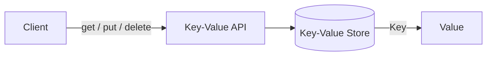

**Why this matters**

- The simple API removes the query planner, join engine, and schema enforcement overhead present in relational databases.
- Because lookups are by key only, the system can use data structures optimized for point lookups.
- Horizontal scaling is easier because data can be partitioned by key.

**Real-life use cases**

- **Session storage**: store a user session token as the key and the session data as the value.
- **Shopping cart**: Redis is often used as a fast cart store where the cart ID is the key.
- **Feature flags**: map a flag name to its configuration.
- **Distributed cache**: cache database query results or rendered pages.
- **Leader election and distributed locks**: etcd and Redis provide key-based primitives.

**Interview questions and answers**

- **Q: What is the difference between a key-value store and a relational database?**
  **A:** A relational database enforces a schema, supports SQL joins and ACID transactions, and is optimized for complex queries. A key-value store has no schema, offers simple key-based access, and is optimized for high-throughput, low-latency point operations and horizontal scalability.

- **Q: Why are key-value stores usually faster than relational databases?**
  **A:** They avoid query parsing, planning, joins, and transaction coordination for most operations. The storage engine can be optimized specifically for point lookups and sequential writes.

- **Q: Give an example where a key-value store is a better fit than SQL.**
  **A:** Caching frequently accessed API responses or session data, where access is always by a known identifier and strong relational constraints are not needed.

---

### Characteristics

Each point is explained in detail below.

- **Simple data model**
  The only relationship is "key maps to value". This removes normalization, foreign keys, and join logic. Applications decide how to structure the value, often by storing JSON or binary data.

- **High performance and low latency**
  Point lookups are usually O(1) or near O(1) through in-memory indexes or optimized on-disk structures. Many implementations keep hot data in memory.

- **Horizontal scalability**
  Data can be distributed across many nodes by hashing or partitioning keys. Adding nodes increases capacity and throughput.

- **High availability**
  Replication and automatic failover allow the system to continue serving reads and writes when individual nodes fail.

- **Schemaless and flexible**
  Different keys can hold different value types and structures. Applications can evolve data without migrations.

- **Tunable consistency**
  Systems such as DynamoDB and Cassandra let you choose between strong consistency, eventual consistency, and quorum-based consistency per operation or per table.

- **Limited query capabilities**
  Most key-value stores do not support arbitrary secondary indexes, joins, or complex `WHERE` clauses. Some add limited secondary index support.

- **Limited transactional support**
  Transactions are usually scoped to a single key or a single partition. Multi-key ACID transactions are rare or expensive.

- **Durability through storage engines**
  Data can be persisted using write-ahead logs, LSM trees, or B-trees, allowing durability and recovery after crashes.

- **TTL support**
  Many stores support time-to-live on keys, which is useful for caches, sessions, and expiring data.

- **Simple API**
  A small API surface makes client libraries easy to implement and reason about.

---

### Pros

- **Fast point reads and writes**
  Since there is no relational overhead, simple operations are measured in sub-millisecond latency in many systems.

- **Easy horizontal scaling**
  Key-based partitioning maps naturally to sharding and consistent hashing.

- **Flexible schema**
  Values can change shape over time, which accelerates development and data evolution.

- **High availability and fault tolerance**
  Replication, hinted handoff, and read repair keep data available during node failures.

- **Low operational complexity for simple workloads**
  The simple data model reduces the need for schema design, migrations, and complex query tuning.

- **Good fit for caching and session workloads**
  Built-in TTL, in-memory storage, and simple access patterns match cache and session use cases exactly.

- **Mature ecosystem**
  Redis, DynamoDB, Cassandra, etcd, RocksDB, and others are widely used, documented, and battle-tested.

- **Predictable performance**
  Point operations avoid the variable performance of multi-table joins and complex SQL.

---

### Cons

- **Weak query capabilities**
  You cannot easily filter, join, aggregate, or perform ad hoc analytical queries.

- **Limited consistency guarantees**
  Many distributed implementations default to eventual consistency, so applications must handle stale reads and conflicts.

- **Data modeling burden moves to the application**
  The application must manage relationships, validation, versioning, and sometimes conflict resolution.

- **Multi-key transactions are difficult**
  Coordinating atomic operations across partitions requires protocols such as two-phase commit or a design that avoids cross-partition transactions.

- **Secondary indexes are limited**
  Supporting indexes often requires additional data structures or separate index components.

- **Storage overhead from replication**
  Replicating data for availability increases storage and network costs.

- **Conflict resolution complexity**
  In leaderless or multi-master systems, concurrent writes can create conflicts that must be resolved with versioning or application logic.

- **Not ideal for complex reporting**
  Analytical workloads with joins and aggregations are better served by SQL or OLAP systems.

---

### Use Cases

Detailed real-world scenarios are described for each use case.

- **Caching**
  Key-value stores cache expensive database queries, API responses, rendered fragments, and computed results. Redis and Memcached are common choices. The cache key is usually derived from the request or query.

- **Session and user profile storage**
  Web applications store session tokens, user preferences, and profile data. The session ID is the key, and the value contains the session state.

- **Shopping carts and e-commerce state**
  A cart can be stored under a cart ID. Values may be JSON serialized. High write throughput and simple retrieval are more important than joins.

- **Feature flags and configuration**
  Feature flag services map a flag key to its rollout rules. Low latency is critical because flag evaluation happens on every request.

- **Rate limiting**
  Counters keyed by client ID or API token can be incremented atomically with TTL windows. Redis `INCR` and `EXPIRE` are commonly used.

- **Leader election and distributed locking**
  Systems such as etcd and Redis provide compare-and-swap, leases, and TTL-based keys to elect leaders and coordinate distributed workers.

- **Metadata and registry services**
  Service discovery systems store service names, endpoints, and health information as key-value records.

- **Real-time counters and leaderboards**
  Sorted sets in Redis and atomic increments enable counters, likes, views, and leaderboards.

- **Event and message deduplication**
  A key based on an event ID can be used with a TTL to detect and drop duplicate events.

- **Graph and recommendation adjacency data**
  Some systems store adjacency lists or precomputed recommendations with entity IDs as keys.

---

### Key Components

A distributed key-value store is composed of several cooperating components.

- **Client library / SDK**
  Provides `get`, `put`, `delete`, and often batching, retries, and timeout handling. It knows how to route requests to the correct nodes.

- **API layer / coordinator**
  Accepts requests, applies consistency policies, and routes operations to storage nodes. In some designs this is embedded in every node; in others it is a separate proxy.

- **Partitioning / routing layer**
  Decides which node owns a key. This can use consistent hashing, a hash modulo scheme, or range partitioning.

- **Replication manager**
  Copies data to multiple nodes and coordinates quorum reads and writes.

- **Membership and gossip module**
  Tracks which nodes are alive and which partitions they own. Gossip protocols such as SWIM and Cassandra's gossip are common.

- **Failure detector**
  Determines whether a node is down, often using heartbeats, gossip suspicion, and phi accrual.

- **Storage engine**
  Persists and indexes data. Common implementations include hash indexes, B-trees, LSM trees, and SSTables.

- **Write-ahead log (WAL)**
  Records writes durably before they are applied to in-memory structures, enabling crash recovery.

- **Compaction engine**
  Merges and removes obsolete or deleted data in LSM trees to reclaim space and keep reads efficient.

- **Cache layer**
  Keeps frequently accessed data in memory to reduce disk reads.

- **Index structures**
  Additional indexes such as secondary indexes, Bloom filters, and sorted structures support lookups and range scans.

- **Consistency and repair services**
  Read repair, anti-entropy, and hinted handoff work in the background to converge replicas.

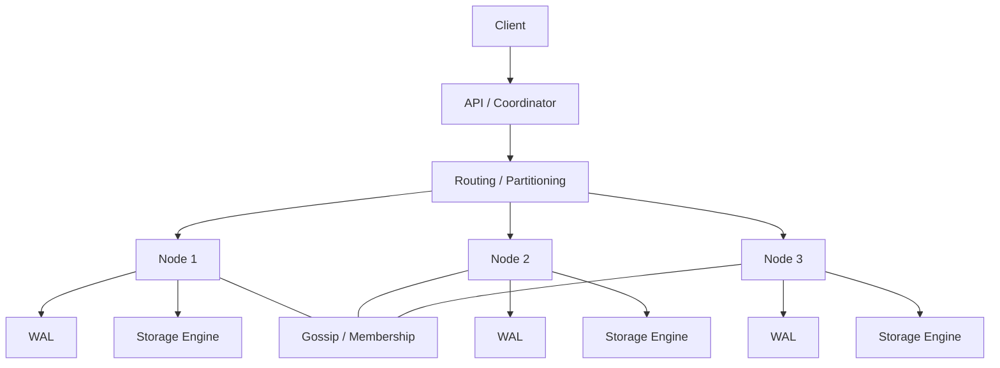

---

### Architectural Patterns

- **Leader-based replication**
  One node accepts writes and replicates them to followers. Reads can be served by followers or only by the leader. This pattern gives strong consistency and simple conflict handling.

- **Leaderless replication**
  Any node can accept writes. Clients write to multiple replicas and read from multiple replicas using quorum rules. DynamoDB and Cassandra use this pattern.

- **Multi-leader replication**
  Multiple nodes accept writes and replicate to each other. This is useful for multi-datacenter setups but introduces conflict resolution challenges.

- **Consistent hashing ring**
  Nodes are placed on a hash ring, and each key maps to the first node clockwise. This minimizes data movement when nodes are added or removed.

- **Quorum-based read and write**
  For N replicas, a write requires W acknowledgements and a read requires R. If `W + R > N`, reads and writes overlap and return the latest value.

- **LSM-tree storage pattern**
  Writes are buffered in memory and flushed to sorted immutable files. Background compaction merges files. This optimizes write throughput.

- **B-tree storage pattern**
  Data is stored in balanced tree pages on disk, supporting efficient range scans and in-place updates.

- **Write-through / write-back cache pattern**
  Caches are integrated with the store to improve latency. Write-through updates the store synchronously, while write-back updates the cache first and persists asynchronously.

- **Read-through / cache-aside pattern**
  The application or cache layer loads a missing key from the backing store and caches it for subsequent reads.

- **Eventual consistency pattern**
  Replicas converge over time through gossip, read repair, and anti-entropy. The system prioritizes availability and partition tolerance.

---

### Benefits

- **Simplicity**
  A small API and data model make the system easier to build, operate, and reason about.

- **Scalability**
  Partitioning by key allows near-linear horizontal scaling.

- **Performance**
  Optimized point operations deliver high throughput and low latency.

- **Flexibility**
  Schemaless values support rapid iteration and varied data shapes.

- **Availability**
  Replication and quorum mechanisms keep the system available during failures.

- **Cost efficiency for simple workloads**
  Simple storage engines and commodity hardware can serve huge workloads without a complex database tier.

- **Operational clarity**
  Fewer query and schema features mean fewer tuning knobs and lower risk of expensive queries.

- **Integration with distributed systems**
  Key-value stores naturally provide primitives for locks, leases, counters, and coordination.

---

### Challenges

- **Consistency vs availability trade-off**
  In a partition, you must choose between returning a possibly stale value or rejecting the request.

- **Conflict resolution**
  Concurrent writes to the same key require vector clocks, last-write-wins, or application-specific merge logic.

- **Hotspots**
  Popular keys can overload a single partition. Mitigations include key splitting, sharding, and caching.

- **Data skew**
  Poor key distribution can make some nodes much larger or busier than others.

- **Limited querying**
  Applications that need ad hoc queries must build secondary indexes or move data to an analytics store.

- **Replication lag**
  Followers or replicas may briefly serve stale data.

- **Storage and compaction overhead**
  LSM trees need background compaction, which competes for I/O and CPU.

- **Operational complexity in large clusters**
  Rebalancing, repairs, and monitoring require careful automation.

- **Security**
  Many key-value stores historically provide minimal built-in authentication and authorization, so network isolation and encryption are important.

---

### Best Practices

- **Design keys for even distribution**
  Use hashed keys or UUIDs rather than monotonically increasing or highly skewed keys.

- **Pick the right consistency level per operation**
  Use strong consistency only where correctness requires it; otherwise use eventual consistency for better performance.

- **Use TTLs for expiring data**
  Sessions, caches, rate-limit counters, and deduplication keys should expire automatically.

- **Version your values**
  Include a schema version or use a format such as JSON/Protobuf so values can evolve safely.

- **Keep values small**
  Large values increase latency, memory pressure, and network cost. Store large blobs in object storage and keep a reference in the key-value store.

- **Replicate for availability**
  Replicate data across at least three nodes or availability zones for production systems.

- **Monitor latency, hit ratio, and partition balance**
  Track hotspot keys, cache hit ratio, node CPU/memory, and read/write latencies.

- **Implement retries with backoff and idempotency**
  Distributed operations can time out; retries should be idempotent.

- **Use compare-and-swap for coordination**
  For locks, counters, and conditional updates, use atomic operations instead of read-modify-write.

- **Test failure modes**
  Simulate node loss, network partitions, and replica lag to verify behavior.

- **Separate hot and cold data**
  Use in-memory stores for hot data and disk-backed stores for durable or less frequently accessed data.

- **Secure the store**
  Enable authentication, TLS, and network policies. Do not expose internal key-value stores publicly.

---

### When to Use a Key-Value Store

- **Use it when** access is always by a known key and you do not need joins or complex queries.
- **Use it when** you need sub-millisecond or single-digit-millisecond latency for point operations.
- **Use it when** you need to scale horizontally to handle high read/write throughput.
- **Use it when** your data model is simple or flexible enough to live without a fixed schema.
- **Use it when** you are building caches, sessions, feature flags, rate limiters, or coordination primitives.
- **Use it when** availability and partition tolerance matter more than strong consistency.

**Avoid it when**

- You need complex joins, aggregations, or ad hoc reporting.
- You need strict multi-record ACID transactions across many entities.
- You have deeply relational data that changes together.
- You need sophisticated secondary indexes and query planners.
- Your workload is analytical rather than operational.

---

### Data Model and API

A key is typically an opaque string or byte array. The value can be a string, number, JSON document, binary blob, list, set, hash, or sorted set depending on the store.

Core operations:

- `get(key)` — return the value or `null`/`not found`.
- `put(key, value)` — insert or overwrite the value.
- `delete(key)` — remove the key.
- `contains(key)` — check existence.
- `putIfAbsent(key, value)` — atomic conditional insert.
- `compareAndSet(key, expected, value)` — atomic compare-and-swap.
- `increment(key, delta)` — atomic counter.
- `expire(key, ttl)` — set a time-to-live.
- `scan(prefix)` — iterate over keys matching a prefix where supported.

**Java example: simple key-value service**

```java
import java.util.Map;
import java.util.Optional;
import java.util.concurrent.ConcurrentHashMap;

public class InMemoryKeyValueStore {

    private final Map<String, String> store = new ConcurrentHashMap<>();

    public Optional<String> get(String key) {
        return Optional.ofNullable(store.get(key));
    }

    public void put(String key, String value) {
        store.put(key, value);
    }

    public Optional<String> delete(String key) {
        return Optional.ofNullable(store.remove(key));
    }

    public boolean putIfAbsent(String key, String value) {
        return store.putIfAbsent(key, value) == null;
    }

    public long increment(String key, long delta) {
        String result = store.merge(key, String.valueOf(delta),
            (oldValue, ignored) -> String.valueOf(Long.parseLong(oldValue) + delta));
        return Long.parseLong(result);
    }
}
```

**Interview questions and answers**

- **Q: What operations does a key-value store usually expose?**
  **A:** `get`, `put`, `delete`, and often conditional writes, TTL, and atomic increments.

- **Q: How do you model a many-to-many relationship in a key-value store?**
  **A:** Use sets or lists keyed by each entity, or denormalize the relationship into both directions of lookup.

- **Q: Why is TTL useful?**
  **A:** It automatically removes expired data, preventing unbounded growth and reducing manual cleanup for caches and sessions.

---

### Storage Engines

A storage engine is the component that persists and retrieves data. Understanding it is key to designing a high-performance key-value store.

#### Hash Index

An in-memory hash map maps each key to its byte offset in an append-only file. Writes append to the file and update the hash map. Reads use the hash map to seek directly to the value.

- **Pros:** simple, fast point reads and writes.
- **Cons:** memory usage grows with the number of keys; range scans are inefficient; the log must be compacted.

**Real-life use:** Bitcask, used by Riak, is a well-known hash index implementation.

#### SSTable and LSM-Tree

An SSTable is a sorted, immutable file of key-value pairs. An LSM tree buffers writes in a memory table, flushes sorted SSTables to disk, and periodically merges them through compaction.

- **Pros:** excellent write throughput, good point reads, efficient range scans.
- **Cons:** background compaction uses I/O and CPU; read may need to check multiple files.

**Real-life use:** RocksDB, LevelDB, Cassandra, and HBase use LSM trees.

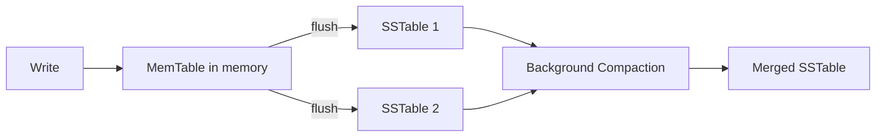

#### B-Tree

A B-tree keeps key-value pairs in balanced tree pages on disk. It supports in-place updates and efficient range scans.

- **Pros:** predictable reads, good for range queries and updates.
- **Cons:** writes can be slower because of random I/O and page splits.

**Real-life use:** InnoDB in MySQL and many embedded databases use B-trees.

#### Write-Ahead Log (WAL)

Before a write is applied to in-memory state, it is appended to a durable log. After a crash, the system replays the WAL to recover committed writes.

**Real-life use:** PostgreSQL, RocksDB, and Redis persistence modes use WAL-like mechanisms.

**Java example: simplified append-only store**

```java
import java.io.*;
import java.nio.charset.StandardCharsets;
import java.util.HashMap;
import java.util.Map;

public class AppendOnlyKeyValueStore implements AutoCloseable {

    private final Map<String, Long> offsets = new HashMap<>();
    private final RandomAccessFile file;

    public AppendOnlyKeyValueStore(String path) throws IOException {
        this.file = new RandomAccessFile(path, "rw");
    }

    public synchronized void put(String key, String value) throws IOException {
        long offset = file.length();
        offsets.put(key, offset);
        byte[] data = (key + "\t" + value + "\n").getBytes(StandardCharsets.UTF_8);
        file.seek(offset);
        file.write(data);
    }

    public synchronized String get(String key) throws IOException {
        Long offset = offsets.get(key);
        if (offset == null) {
            return null;
        }
        file.seek(offset);
        String line = file.readLine();
        if (line == null) {
            return null;
        }
        int separator = line.indexOf('\t');
        return separator >= 0 ? line.substring(separator + 1) : null;
    }

    @Override
    public void close() throws IOException {
        file.close();
    }
}
```

**Interview questions and answers**

- **Q: Compare LSM trees and B-trees.**
  **A:** LSM trees optimize writes by batching and sequential flushing, but reads may check multiple files and compaction consumes background resources. B-trees optimize in-place updates and predictable reads but suffer from random write I/O.

- **Q: What is the purpose of compaction?**
  **A:** Compaction merges SSTables and removes overwritten or deleted values, reducing storage and keeping read paths efficient.

- **Q: Why is a write-ahead log important?**
  **A:** It ensures durability by recording changes before they are applied, allowing recovery from crashes without losing committed writes.

---

### Replication Strategies

Replication keeps copies of data on multiple nodes for availability and durability.

#### Leader-Based Replication

One node is the leader. Writes go to the leader and are replicated to followers. Reads may be served by the leader or followers.

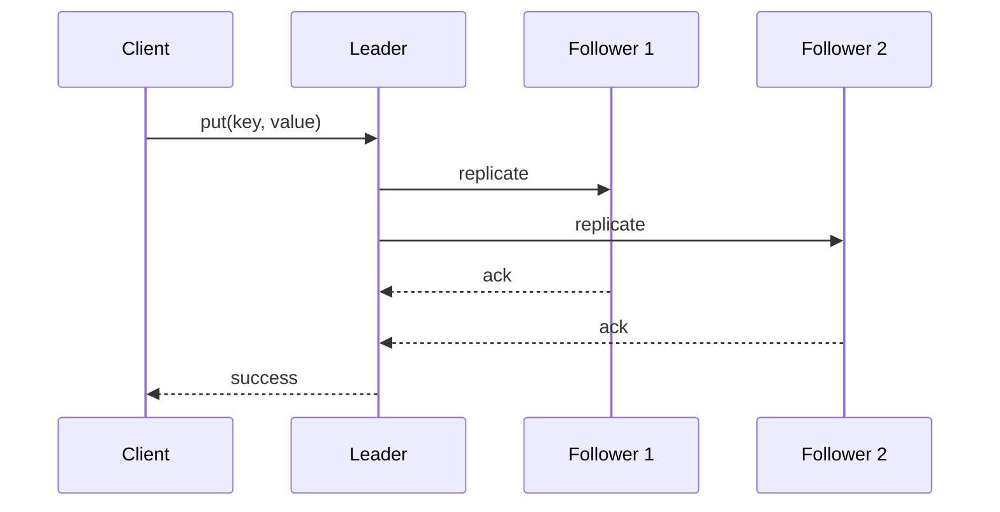

- **Pros:** simple consistency, clear write ordering.
- **Cons:** leader can become a bottleneck or single point of failure; failover is complex.

**Real-life use:** etcd and MongoDB use leader-based replication.

#### Multi-Leader Replication

Multiple nodes accept writes and replicate asynchronously to each other. This is useful for multi-datacenter active-active setups.

- **Pros:** lower write latency locally, survives a whole datacenter failure.
- **Cons:** conflicts between concurrent writes must be resolved.

**Real-life use:** some multi-datacenter databases and collaboration tools.

#### Leaderless Replication

Any replica can accept writes. The client writes to several replicas and reads from several replicas. Quorum rules determine success.

- **Pros:** no leader election, high availability.
- **Cons:** weaker consistency, requires read repair and anti-entropy.

**Real-life use:** DynamoDB, Cassandra, Riak.

**Interview questions and answers**

- **Q: What is a quorum?**
  **A:** For N replicas, a write quorum W is the number of replicas that must acknowledge a write, and a read quorum R is the number that must respond to a read. If `W + R > N`, at least one read replica overlaps with a write replica, so the latest value is visible.

- **Q: Why does leaderless replication need read repair?**
  **A:** Because writes may not reach every replica, reads must detect stale replicas and update them to converge the data.

---

### Partitioning and Sharding

Partitioning divides the keyspace across nodes so no single node holds all data.

- **Hash partitioning:** compute `hash(key) % number_of_nodes`. Simple but causes large data movement when nodes are added or removed.
- **Range partitioning:** assign contiguous key ranges to nodes. Enables efficient range scans but can create hotspots if keys are not evenly distributed.
- **Consistent hashing:** map nodes and keys onto a ring; each key belongs to the next node clockwise. Adding or removing a node moves only a fraction of keys.
- **Virtual nodes:** each physical node owns many points on the ring, improving balance.

**Real-life use:** DynamoDB partitions data using hash keys, Cassandra uses consistent hashing with virtual nodes.

**Interview questions and answers**

- **Q: What is the problem with modulo hashing for sharding?**
  **A:** Changing the number of nodes changes almost every key's mapping, causing massive data movement.

- **Q: How do virtual nodes help consistent hashing?**
  **A:** They distribute each physical node across many ring positions, reducing data skew and allowing proportional capacity assignment.

---

### Consistent Hashing

Consistent hashing maps both nodes and keys to the same hash ring. A key is assigned to the first node whose position is equal to or greater than the key's hash, wrapping around the ring.

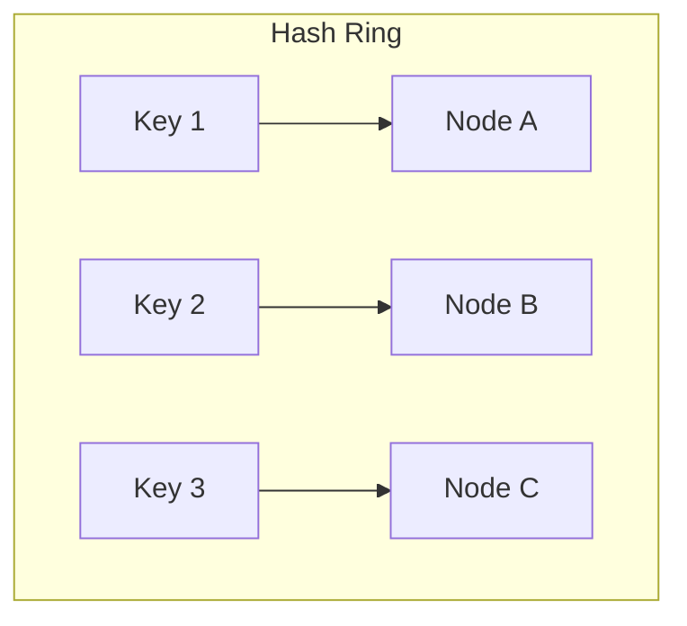

**Java implementation**

```java
import java.util.*;

public class ConsistentHashing {

    private final SortedMap<Integer, String> ring = new TreeMap<>();
    private final int virtualNodes;

    public ConsistentHashing(int virtualNodes, List<String> nodes) {
        this.virtualNodes = virtualNodes;
        for (String node : nodes) {
            addNode(node);
        }
    }

    private int hash(String key) {
        return Math.abs(key.hashCode());
    }

    public void addNode(String node) {
        for (int i = 0; i < virtualNodes; i++) {
            ring.put(hash(node + "#" + i), node);
        }
    }

    public void removeNode(String node) {
        for (int i = 0; i < virtualNodes; i++) {
            ring.remove(hash(node + "#" + i));
        }
    }

    public String getNode(String key) {
        if (ring.isEmpty()) {
            return null;
        }
        int keyHash = hash(key);
        SortedMap<Integer, String> tail = ring.tailMap(keyHash);
        Integer nodeHash = tail.isEmpty() ? ring.firstKey() : tail.firstKey();
        return ring.get(nodeHash);
    }
}
```

**Real-life use:** DynamoDB, Cassandra, Riak, and Akka use consistent hashing for data placement.

**Interview questions and answers**

- **Q: What happens when a node is added to a consistent hash ring?**
  **A:** Only the keys that map to the new node's position are moved from its neighbors; other keys stay on their existing nodes.

- **Q: Why use virtual nodes?**
  **A:** Virtual nodes reduce skew, balance load, and allow nodes with different capacities to own different numbers of virtual nodes.

---

### Quorum, Read Repair and Anti-Entropy

In a replicated store with N replicas, a write is acknowledged after W replicas confirm it, and a read returns after R replicas respond. When `W + R > N`, there is guaranteed overlap.

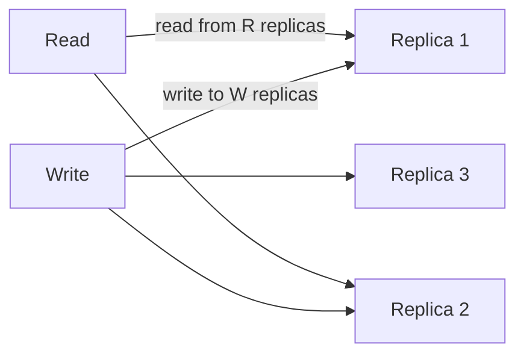

**Read repair:** when a read observes different versions among replicas, it writes the newest version back to stale replicas.

**Anti-entropy:** background processes compare replicas, often using Merkle trees, and synchronize missing or outdated data.

**Real-life use:** DynamoDB uses quorum reads/writes, Cassandra uses read repair and Merkle-tree anti-entropy.

**Interview questions and answers**

- **Q: What is the difference between read repair and anti-entropy?**
  **A:** Read repair happens on the read path when inconsistencies are observed, while anti-entropy runs continuously in the background to synchronize replicas.

- **Q: If N=3, W=2, R=2, can a read see stale data?**
  **A:** No, assuming no clock skew. Since `2 + 2 > 3`, any read set of two replicas overlaps with every write set of two replicas, so the latest write is visible.

---

### Versioning and Vector Clocks

When writes can happen concurrently on different replicas, the system needs to determine causal ordering and detect conflicts.

- **Timestamps** can be used but are unreliable due to clock skew.
- **Version numbers** help detect overwrites.
- **Vector clocks** capture causality by storing a map of `{node -> counter}` for each version.

A vector clock `[A:1, B:2]` means node A has made 1 update and node B has made 2 updates in the observed causal history. Two versions are concurrent if neither vector clock dominates the other.

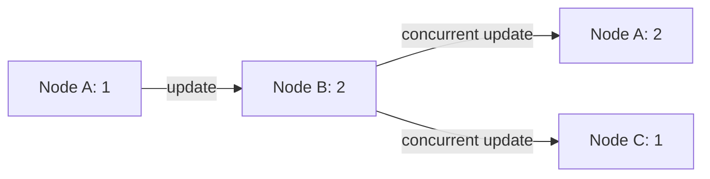

**Real-life use:** Riak uses vector clocks, DynamoDB originally used vector clocks before moving to other conflict-resolution strategies.

**Java example: simplified vector clock**

```java
import java.util.HashMap;
import java.util.Map;

public class VectorClock implements Comparable<VectorClock> {

    private final Map<String, Long> counters = new HashMap<>();

    public void increment(String nodeId) {
        counters.merge(nodeId, 1L, Long::sum);
    }

    public boolean happensBefore(VectorClock other) {
        boolean anyLess = false;
        for (Map.Entry<String, Long> entry : counters.entrySet()) {
            long otherCount = other.counters.getOrDefault(entry.getKey(), 0L);
            if (entry.getValue() > otherCount) {
                return false;
            }
            if (entry.getValue() < otherCount) {
                anyLess = true;
            }
        }
        return anyLess || counters.size() < other.counters.size();
    }

    public boolean isConcurrentWith(VectorClock other) {
        return !happensBefore(other) && !other.happensBefore(this);
    }

    @Override
    public int compareTo(VectorClock other) {
        if (happensBefore(other)) {
            return -1;
        }
        if (other.happensBefore(this)) {
            return 1;
        }
        return 0;
    }
}
```

**Interview questions and answers**

- **Q: Why not use wall-clock timestamps for versioning?**
  **A:** Clocks across nodes can drift, so timestamps cannot reliably order events that happen close together.

- **Q: What does it mean when two vector clocks are concurrent?**
  **A:** Neither version causally precedes the other, meaning the writes happened concurrently and may require conflict resolution.

---

### Hinted Handoff and Sloppy Quorum

If a replica is unavailable, a write can be sent to a different node that is not one of the key's normal replicas. That node stores the write with a "hint" about the intended replica and later forwards it when the original replica recovers.

- **Hinted handoff** improves write availability during temporary failures.
- **Sloppy quorum** counts the temporary node toward the write quorum even though it is not an official replica for that key.

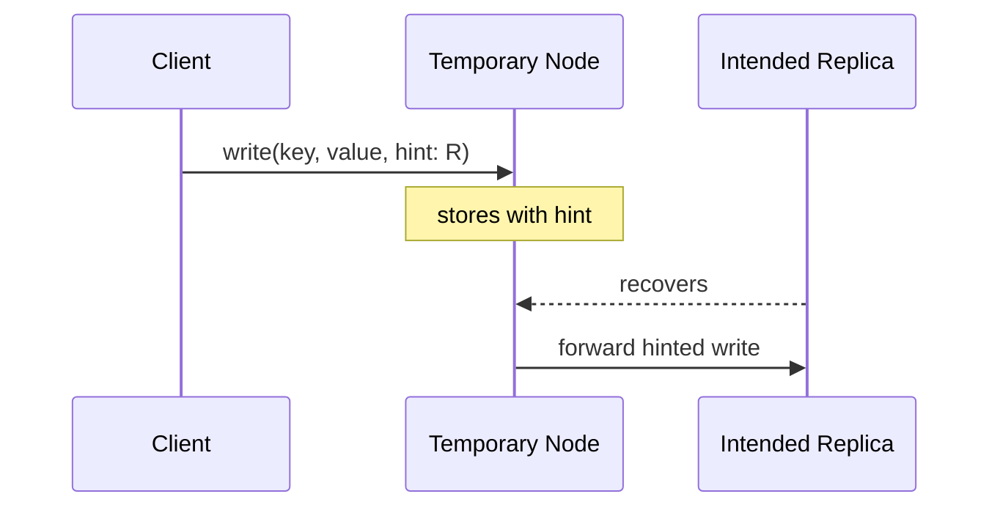

**Real-life use:** DynamoDB and Cassandra use hinted handoff.

**Interview questions and answers**

- **Q: What problem does hinted handoff solve?**
  **A:** It allows writes to succeed even when some replicas are down, improving availability without sacrificing eventual durability.

- **Q: What is the risk of hinted handoff?**
  **A:** If the temporary node fails before forwarding, the write may be lost unless other replicas received it.

---

### Write Path and Read Path

Understanding the read and write paths reveals where latency and durability come from.

#### Write Path

1. Client sends `put(key, value)`.
2. Coordinator hashes the key and selects replicas.
3. Write is appended to the WAL.
4. Value is written to the in-memory table or cache.
5. Replication sends the write to W replicas.
6. Client receives success after W acknowledgements.

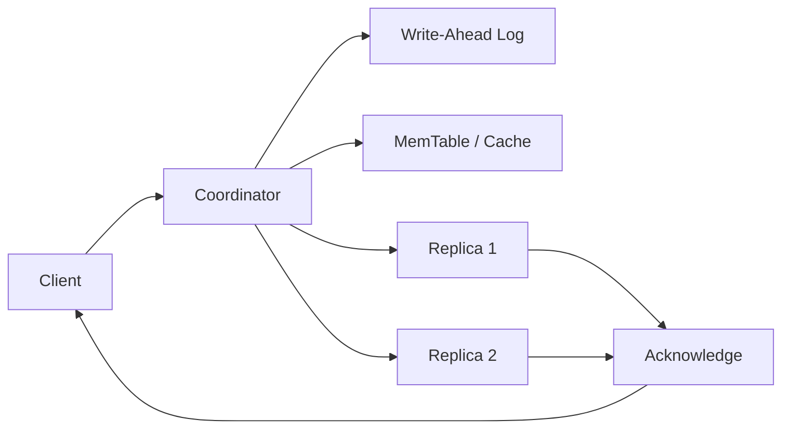

#### Read Path

1. Client sends `get(key)`.
2. Coordinator hashes the key and selects R replicas.
3. Each replica checks its memory table, Bloom filter, and SSTables.
4. Coordinator merges responses and returns the latest version.
5. Read repair may update stale replicas.

**Real-life use:** RocksDB and Cassandra follow similar paths.

**Interview questions and answers**

- **Q: Why is the WAL written before the in-memory table?**
  **A:** To ensure durability; if the node crashes after acknowledging the write, the WAL can replay it during recovery.

- **Q: How does a Bloom filter speed up reads?**
  **A:** It quickly determines whether a key is definitely absent from an SSTable, avoiding unnecessary disk reads.

---

### Compaction and Bloom Filters

**Compaction** merges multiple SSTables into fewer files, discarding obsolete versions and tombstones. It reduces read amplification and reclaims disk space.

Strategies:

- Size-tiered compaction: merge files of similar size.
- Leveled compaction: organize files into levels with bounded overlap.

**Bloom filters** are probabilistic in-memory structures that can quickly answer "key is definitely not here" or "key may be here". They trade a tiny false-positive rate for large memory savings.

**Java example: simple Bloom filter**

```java
import java.util.BitSet;
import java.util.function.ToIntFunction;

public class BloomFilter {

    private final BitSet bits;
    private final int size;
    private final ToIntFunction<String>[] hashes;

    @SafeVarargs
    public BloomFilter(int size, ToIntFunction<String>... hashes) {
        this.bits = new BitSet(size);
        this.size = size;
        this.hashes = hashes;
    }

    public void add(String value) {
        for (ToIntFunction<String> hash : hashes) {
            bits.set(Math.abs(hash.applyAsInt(value)) % size);
        }
    }

    public boolean mightContain(String value) {
        for (ToIntFunction<String> hash : hashes) {
            if (!bits.get(Math.abs(hash.applyAsInt(value)) % size)) {
                return false;
            }
        }
        return true;
    }
}
```

**Real-life use:** RocksDB, Cassandra, and HBase use Bloom filters to reduce disk lookups.

**Interview questions and answers**

- **Q: Can a Bloom filter return false negatives?**
  **A:** No. It never says a present key is absent, but it can return false positives.

- **Q: What happens if compaction removes a key that is still needed?**
  **A:** Correct compaction only removes keys that have been overwritten or explicitly deleted, using tombstones to handle deletes safely.

---

### Failure Detection and Membership

A distributed store must know which nodes are alive and which partitions they own.

- **Heartbeats:** nodes periodically send liveness signals. Missing heartbeats mark a node suspected or failed.
- **Gossip protocol:** nodes exchange membership and state information with random peers. The information spreads through the cluster.
- **Phi accrual failure detector:** computes a suspicion level based on heartbeat arrival times, reducing false positives.
- **SWIM protocol:** a scalable weakly-consistent infection-style membership protocol used by HashiCorp Serf and others.

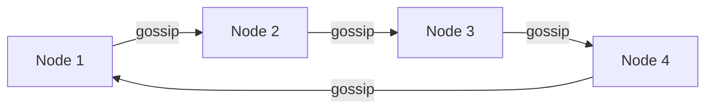

**Real-life use:** Cassandra uses gossip and phi accrual; DynamoDB's internals use gossip-like membership.

**Interview questions and answers**

- **Q: Why is gossip preferred over a central registry in some systems?**
  **A:** It removes a single point of failure and scales well, at the cost of eventual consistency in membership knowledge.

- **Q: What is a false positive in failure detection?**
  **A:** A live node is incorrectly marked dead, which can cause unnecessary data movement or failover.

---

### CAP Theorem and Consistency Trade-offs

The CAP theorem states that during a network partition, a distributed system can provide either consistency or availability, but not both, while still maintaining partition tolerance.

- **Consistency:** every read returns the most recent write.
- **Availability:** every request receives a response, even if some data may be stale.
- **Partition tolerance:** the system continues operating despite network partitions.

Most practical distributed systems choose partition tolerance, then make a trade-off between consistency and availability.

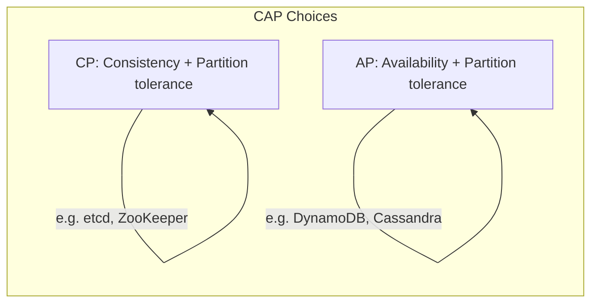

**Real-life mapping**

- **CP systems:** etcd, ZooKeeper, HBase.
- **AP systems:** DynamoDB, Cassandra, Riak.

**Interview questions and answers**

- **Q: Is Redis a CP or AP system?**
  **A:** A single Redis node is neither distributed nor partition-tolerant. Redis Cluster is generally AP in behavior for most configurations, but specific commands and configurations can trade availability for consistency.

- **Q: Can a system be both strongly consistent and highly available during a partition?**
  **A:** No. During a partition, a strongly consistent system must reject some requests to avoid returning stale data, sacrificing availability.

---

### Real-World Implementations

- **Redis**
  In-memory data structure store used for caching, sessions, counters, pub/sub, and leaderboards. Supports persistence, replication, and Redis Cluster.

- **DynamoDB**
  Fully managed, serverless key-value and document store by AWS. Provides single-digit-millisecond latency, automatic partitioning, and tunable consistency.

- **Cassandra**
  Distributed wide-column store with leaderless replication, tunable consistency, and LSM-tree storage. Well suited for high-write workloads.

- **Riak**
  Distributed key-value store inspired by the Dynamo paper. Known for strong operational resilience and vector clock conflict resolution.

- **etcd**
  Strongly consistent key-value store built on Raft. Used for service discovery, configuration, and leader election in Kubernetes.

- **RocksDB**
  Embedded LSM-tree storage engine used by many databases and streaming systems. Not a standalone server but the storage layer inside other products.

- **LevelDB**
  Early embedded LSM-tree store by Google, influential in the design of RocksDB.

- **Memcached**
  Simple, fast in-memory cache without persistence or built-in replication. Used for caching frequently accessed data.

---

### Java and Spring Boot Implementation Guide

This section shows how to build a practical key-value service with Spring Boot.

#### 1. In-memory service

```java
import org.springframework.stereotype.Service;

import java.util.Optional;
import java.util.concurrent.ConcurrentHashMap;

@Service
public class KeyValueService {

    private final ConcurrentHashMap<String, String> store = new ConcurrentHashMap<>();

    public Optional<String> get(String key) {
        return Optional.ofNullable(store.get(key));
    }

    public void put(String key, String value) {
        store.put(key, value);
    }

    public boolean putIfAbsent(String key, String value) {
        return store.putIfAbsent(key, value) == null;
    }

    public Optional<String> delete(String key) {
        return Optional.ofNullable(store.remove(key));
    }

    public long increment(String key, long delta) {
        String result = store.merge(key, String.valueOf(delta),
            (oldValue, ignored) -> String.valueOf(Long.parseLong(oldValue) + delta));
        return Long.parseLong(result);
    }
}
```

#### 2. REST controller

```java
import org.springframework.http.ResponseEntity;
import org.springframework.web.bind.annotation.*;

import java.util.Optional;

@RestController
@RequestMapping("/api/kv")
public class KeyValueController {

    private final KeyValueService service;

    public KeyValueController(KeyValueService service) {
        this.service = service;
    }

    @GetMapping("/{key}")
    public ResponseEntity<String> get(@PathVariable String key) {
        return service.get(key)
            .map(ResponseEntity::ok)
            .orElse(ResponseEntity.notFound().build());
    }

    @PutMapping("/{key}")
    public ResponseEntity<Void> put(@PathVariable String key,
                                    @RequestBody String value) {
        service.put(key, value);
        return ResponseEntity.noContent().build();
    }

    @PostMapping("/{key}/increment")
    public ResponseEntity<Long> increment(@PathVariable String key,
                                          @RequestParam(defaultValue = "1") long delta) {
        return ResponseEntity.ok(service.increment(key, delta));
    }

    @DeleteMapping("/{key}")
    public ResponseEntity<Void> delete(@PathVariable String key) {
        return service.delete(key).isPresent()
            ? ResponseEntity.noContent().build()
            : ResponseEntity.notFound().build();
    }
}
```

#### 3. Redis-backed repository

```java
import org.springframework.data.redis.core.StringRedisTemplate;
import org.springframework.stereotype.Repository;

import java.time.Duration;
import java.util.Optional;

@Repository
public class RedisKeyValueRepository {

    private final StringRedisTemplate redisTemplate;

    public RedisKeyValueRepository(StringRedisTemplate redisTemplate) {
        this.redisTemplate = redisTemplate;
    }

    public Optional<String> get(String key) {
        return Optional.ofNullable(redisTemplate.opsForValue().get(key));
    }

    public void put(String key, String value) {
        redisTemplate.opsForValue().set(key, value);
    }

    public void putWithTtl(String key, String value, Duration ttl) {
        redisTemplate.opsForValue().set(key, value, ttl);
    }

    public void delete(String key) {
        redisTemplate.delete(key);
    }

    public Long increment(String key, long delta) {
        return redisTemplate.opsForValue().increment(key, delta);
    }
}
```

#### 4. Consistent hashing ring used by a router

```java
import java.util.*;

public class KeyValueRouter {

    private final ConsistentHashing ring;

    public KeyValueRouter(List<String> nodes) {
        this.ring = new ConsistentHashing(100, nodes);
    }

    public String route(String key) {
        return ring.getNode(key);
    }
}
```

**Interview questions and answers**

- **Q: How would you add persistence to the in-memory Spring Boot store?**
  **A:** Add a storage engine such as Redis, RocksDB, or a database repository behind the service interface, and optionally write through to disk or use a WAL.

- **Q: How do you make the Spring Boot service horizontally scalable?**
  **A:** Deploy multiple stateless instances behind a load balancer and store data in a distributed key-value backend such as Redis Cluster or DynamoDB, or implement a consistent-hashing router across stateful nodes.

- **Q: What is the benefit of keeping the controller thin and using a service interface?**
  **A:** It separates HTTP concerns from storage logic, making it easy to swap in-memory, Redis, or database implementations and to test each layer independently.

