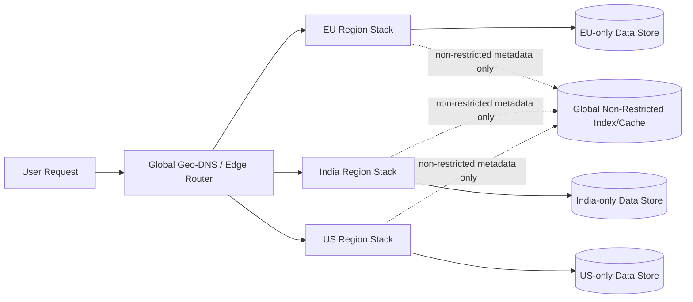

# Design a Multi-Region Deployment System with Data Residency Constraints

## Blogs and websites

## Medium

## Youtube

## Theory

### Problem Statement

Design a system architecture and deployment strategy for a product that must run across multiple geographic regions, where certain users' data must legally remain stored (and often processed) only within their designated region (data residency), while still providing a coherent global product experience.

### Functional Requirements

- Route each user's traffic and data operations to their assigned "home" region based on residency requirements
- Keep region-specific data physically stored only within that region's infrastructure
- Support cross-region features that need to work globally (e.g., a user's public profile visible worldwide) without violating residency for the underlying private data
- Support failover within a region without cross-region data replication of restricted data

### Non-Functional Requirements

- **Scale**: Global user base spanning multiple legal jurisdictions (e.g., EU/GDPR, India, US)
- **Compliance**: Restricted data must never be replicated or transiently stored outside its designated region, including in logs/backups
- **Availability**: Regional outage should degrade only that region, not the whole system
- **Latency**: Users should be served by their nearest/home region for low latency

### High-Level Architecture

### Key Design Points

- Assign every user a "home region" at signup based on residency rules, and route all of their requests (via geo-DNS/edge routing plus an explicit home-region lookup, since IP-geolocation alone isn't reliable/legally sufficient) to that region's fully independent stack: app servers, databases, caches, backups, and logs.
- Keep each region's data store completely isolated for restricted data - no cross-region database replication, and any operational tooling (log aggregation, monitoring, backups) must also respect the regional boundary, since "residency" typically covers backups and logs too, not just primary storage.
- For features that must work globally (e.g., search across public content, cross-region friend suggestions), replicate only the explicitly non-restricted subset of data into a separate global index/cache, keeping a clear, audited boundary between "can leave the region" and "cannot."
- Design failover to stay within the region (multi-AZ within the region) rather than failing over to another region, since failing over to another region would itself violate residency; if a whole region truly cannot serve, the product may need to degrade rather than silently move data.

### Trade-offs

- Full per-region infrastructure isolation multiplies operational cost (N times the stacks to run/monitor) compared to one global deployment, but is often a hard legal requirement rather than an optional trade-off.
- Restricting cross-region replication to an explicitly-vetted non-restricted subset is more restrictive (and requires more careful data classification up front) than replicating everything globally, but is what makes compliance auditable.
