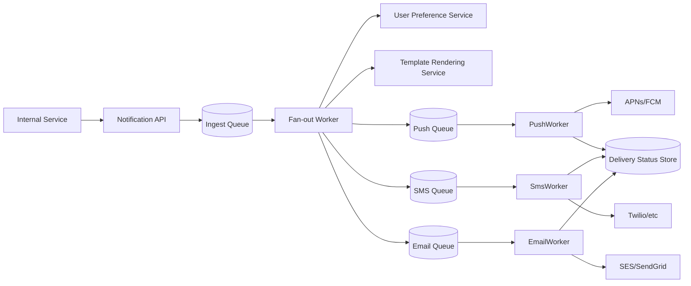

# Design a Notification Service That Fans Out Across Push, SMS, and Email

## Blogs and websites

## Medium

## Youtube

## Theory

### Problem Statement

Design a notification service that accepts a single logical notification request and reliably fans it out across multiple channels (push, SMS, email), respecting user preferences, provider rate limits, and delivery guarantees, at very large scale (e.g., a marketing campaign to tens of millions of users).

### Functional Requirements

- Accept a notification request (template + recipients + channels) from internal services
- Resolve each recipient's channel preferences and contact details
- Render channel-specific content (push payload, SMS text, email HTML) from a shared template
- Deliver via the appropriate third-party provider per channel, with retries on transient failure
- Track delivery status (sent/delivered/failed/bounced) per recipient per channel

### Non-Functional Requirements

- **Scale**: Bursts of tens of millions of notifications for a single campaign, plus a steady stream of transactional (order update, OTP) notifications
- **Latency**: Transactional notifications should be delivered within seconds; bulk/marketing notifications can be delivered over minutes-to-hours
- **Reliability**: At-least-once delivery per channel with idempotent processing (no duplicate charges/SMS due to retries)
- **Extensibility**: New channels/providers can be added without touching the core fan-out logic

### High-Level Architecture

### Key Design Points

- Split "fan-out" (deciding who gets what, on which channels, using which preferences) from per-channel "delivery" (talking to a specific provider's API), each with its own queue and worker pool, so a slow/rate-limited provider (e.g., SMS) doesn't block push or email delivery.
- Give every notification request an idempotency key, and have each channel worker deduplicate against it before calling the provider, so retries after a crash never result in duplicate sends.
- Respect per-user channel preferences and quiet hours at fan-out time, and respect per-provider rate limits at the channel-worker level (token bucket per provider) to avoid getting throttled or banned.
- Use separate, independently scalable queues per channel so a bulk marketing campaign (huge fan-out) doesn't delay urgent transactional notifications - or run transactional and bulk traffic through entirely separate queues/priorities.

### Trade-offs

- Per-channel queues and workers add operational surface area (more queues/services to run) compared to a single monolithic sender, but isolate failure/backpressure per channel and let each channel scale independently to match very different provider throughput limits.
- At-least-once delivery with idempotency keys is simpler to build than exactly-once delivery and is sufficient in practice as long as every downstream provider call is deduplicated.
