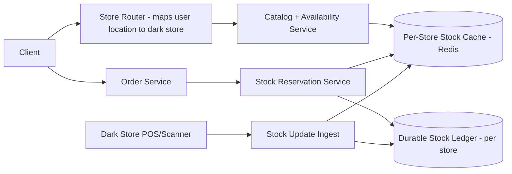

# Design a Real-Time Inventory System for a Quick-Commerce App (like Zepto)

## Blogs and websites

## Medium

## Youtube

## Theory

### Problem Statement

Design a real-time inventory system for a quick-commerce app that promises 10-20 minute deliveries from many small local "dark stores." Stock levels per store must be accurate to the second, since overselling an item that a store doesn't actually have breaks the delivery promise.

### Functional Requirements

- Track per-SKU stock at each dark store, updated in real time as items are received, sold, reserved (in-cart), or damaged
- Show only in-stock (and deliverable-in-time) items to a customer based on their location's serving dark store
- Reserve stock the moment an order is placed (before payment) and release the reservation on cancellation/timeout
- Reconcile stock via periodic physical counts

### Non-Functional Requirements

- **Scale**: Thousands of dark stores, tens of millions of SKU-store combinations, extremely high read QPS (every app view checks availability) with lower write QPS
- **Latency**: Availability check < 50ms; stock decrement/reservation < 100ms
- **Consistency**: Strong consistency for decrement/reservation (no overselling); eventual consistency acceptable for catalog-browse-level "in stock" badges

### High-Level Architecture

### Key Design Points

- Partition stock data by `store_id` (each dark store is an independent shard) so hot SKUs at one store don't contend with unrelated stores, and stock operations for a single store can be served by a single Redis key/hash with atomic `DECR`/Lua scripts.
- Use a short-lived reservation (e.g., hold stock for 5-10 minutes) at "add to cart"/checkout time, backed by a TTL in Redis, so abandoned carts automatically release stock without a manual cleanup job.
- Keep the durable ledger (event log of every stock change: received, sold, reserved, released, damaged) in a per-store append-only store, replaying into the Redis cache; this makes the cache rebuildable and stock changes auditable.
- Push catalog "in-stock" visibility updates to clients via a fast cache read rather than the durable DB, since availability is read on nearly every screen and can tolerate a few seconds of staleness for *display* (not for the actual decrement, which must be atomic).

### Trade-offs

- Strong consistency on the decrement path (Redis atomic ops + durable ledger) versus eventual consistency on the display/browse path trades a small "stock shown but sold out at checkout" risk for far higher read throughput; the decrement itself never oversells because it's checked atomically regardless of what was displayed.
- Sharding by store simplifies scaling almost linearly with store count but requires the location-routing layer to always know the correct store for a request.
