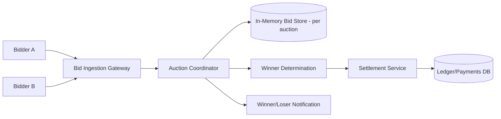

# Design a Real-Time Bidding / Auction System

## Blogs and websites

## Medium

## Youtube

## Theory

### Problem Statement

Design a real-time bidding/auction system (e.g., an online ad exchange or a live item auction) where multiple bidders compete for an item/impression within a strict, very short time window, and the system must determine and settle the winner fairly and quickly.

### Functional Requirements

- Accept bids for an active auction/impression within a fixed time window (milliseconds for ad exchanges, seconds-to-minutes for item auctions)
- Determine the winning bid using the auction's rules (first-price, second-price/Vickrey)
- Notify the winner and settle payment/allocation; notify losers
- Prevent bid manipulation (e.g., a bidder seeing others' bids before the window closes)

### Non-Functional Requirements

- **Scale**: For ad exchanges, tens of thousands of concurrent auctions/sec, each resolved in single-digit milliseconds; for item auctions, thousands of concurrent auctions with many bidders each
- **Latency**: Ad-exchange style auctions must resolve within a strict SLA (often < 100ms end-to-end including network)
- **Consistency**: Exactly one winner per auction; no bid should be lost or double-counted
- **Fairness**: Bids must not be visible to other bidders until the auction closes

### High-Level Architecture

### Key Design Points

- Keep bids for an active auction sealed: bidders submit to a gateway that forwards to a coordinator, but never broadcasts current bids back to other participants until the auction closes, preventing last-look manipulation.
- Use an in-memory, low-latency store keyed by auction ID to accumulate bids during the (often very short) bidding window, and finalize/persist the outcome to durable storage only once the auction closes - this keeps the hot path fast while still guaranteeing durability of the final result.
- For ad-exchange-style auctions, run the entire bid-collect-and-resolve cycle within a single request/response cycle per impression (bidders respond to a bid request with a timeout, the exchange picks the winner as soon as the timeout expires or all bidders respond).
- Make the winner-determination step deterministic and auditable (e.g., log all received bids with timestamps) so outcomes can be verified after the fact in case of disputes.

### Trade-offs

- Keeping the bid window strictly sealed (no visibility into others' bids) is essential for fairness but means bidders can't react to competing bids mid-auction, unlike open-outcry auctions - the trade is intentional for exchanges needing deterministic, gameable-resistant outcomes.
- In-memory bid accumulation is far faster than writing every bid to durable storage synchronously, at the cost of needing careful failure handling (e.g., replication of the in-memory store) so a coordinator crash mid-auction doesn't lose bids.
