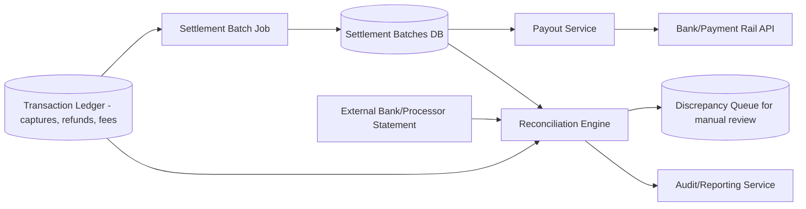

# Design a Settlement and Reconciliation System for Payments

## Blogs and websites

## Medium

## Youtube

## Theory

### Problem Statement

Design a settlement and reconciliation system that periodically aggregates individual payment transactions (captured throughout the day by a payment gateway) into net settlement batches to merchants/banks, and continuously reconciles the platform's internal ledger against external bank/processor statements to detect and resolve discrepancies.

### Functional Requirements

- Aggregate authorized/captured transactions into settlement batches per merchant/payout cycle (e.g., daily, T+2)
- Net out refunds, chargebacks, and fees against gross transaction amounts to compute the payable amount
- Initiate payouts to merchant bank accounts and track payout status
- Reconcile internal ledger records against external bank statements/processor reports, flagging mismatches for manual review
- Provide auditable reports of every settlement and reconciliation outcome

### Non-Functional Requirements

- **Scale**: Millions of transactions per settlement cycle across many merchants
- **Correctness**: Every rupee/cent must be accounted for; discrepancies must be surfaced, never silently dropped
- **Durability & Auditability**: Settlement and reconciliation history must be retained and immutable for compliance/audits
- **Timeliness**: Settlement batches must complete within the committed payout SLA (e.g., T+2 days)

### High-Level Architecture

### Key Design Points

- Treat the transaction ledger as the immutable source of truth (double-entry, append-only) and compute settlement batches as a derived, re-runnable aggregation job over a fixed time window per merchant, so a bug in batching can be fixed and safely re-run without corrupting the underlying ledger.
- Net fees, refunds, and chargebacks against gross captures within the same settlement computation so the payout amount sent to the bank API is always the true net figure, with each component individually itemized in the settlement record for auditability.
- Run reconciliation as a three-way match: internal ledger vs. internal settlement batch vs. external bank/processor statement; any transaction present in one but not the other two is automatically routed to a discrepancy queue rather than being auto-resolved, since financial mismatches should always have a human or a well-tested automated rule confirm the resolution.
- Make settlement batch creation and payout initiation idempotent per `(merchant_id, cycle_date)` so a retried batch job or a duplicate payout API call can never double-pay a merchant.

### Trade-offs

- Making settlement a re-runnable derived computation (rather than mutating the ledger directly) trades some storage/compute (recomputing aggregates) for the much stronger guarantee that the ledger is never touched by a batching bug.
- Routing all statement/ledger mismatches to manual review (rather than auto-resolving them) is slower operationally but is the safer default for money-movement systems, where an incorrect automated "fix" is far more costly than a delayed payout.
