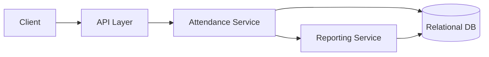

# Design a Simple Attendance Tracking System

## Blogs and websites

## Medium

## Youtube

## Theory

### Problem Statement

Design a simple attendance tracking system for an organization where employees/students check in/out each day, and admins can view attendance reports.

### Functional Requirements

- Check-in and check-out (marks timestamp)
- View own attendance history
- Admin: view attendance for a team/date range, mark manual corrections
- Basic reports: present/absent/late counts

### Non-Functional Requirements

- **Scale**: Thousands of users per organization, one check-in/out event pair per user per day
- **Latency**: Check-in/out write < 200ms
- **Consistency**: A user should not be able to check in twice without checking out first

### API Design

```
POST /attendance/check-in
POST /attendance/check-out
GET  /attendance/me?from=&to=
GET  /attendance/reports?team=&from=&to=
```

### Data Model

```
attendance_records: id (PK), user_id (FK), check_in_at, check_out_at, status, date
```

### High-Level Architecture



### Key Design Points

- Enforce one open (not-yet-checked-out) record per `(user_id, date)` with a unique constraint to prevent duplicate check-ins.
- Precompute daily/weekly aggregates (present/absent/late) in a background job rather than scanning raw records on every report request.
- Use the server's clock (not the client's) for timestamps to prevent manipulation.

### Trade-offs

- Storing raw check-in/check-out events (rather than pre-computed daily status) keeps the system flexible for corrections and audits, at the cost of needing a batch/aggregation step for reports.
