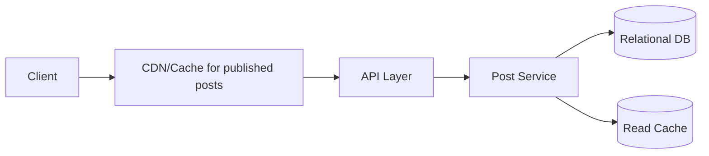

# Design a Basic Blogging Platform

## Blogs and websites

## Medium

## Youtube

## Theory

### Problem Statement

Design a basic blogging platform (like a simple Medium/WordPress) where authors can write and publish posts, and readers can browse, read, and comment on them.

### Functional Requirements

- Author: create/edit/publish/unpublish a post (title, body, tags)
- Reader: browse posts (by author, tag, recency), read a post, comment
- Basic engagement: likes/claps count

### Non-Functional Requirements

- **Scale**: Read-heavy (readers >> authors); moderate write volume
- **Latency**: Read post < 150ms, publish < 300ms
- **Availability**: Reading published content should stay available even if the write path degrades

### API Design

```
POST /posts                    { title, body, tags[] }
POST /posts/{postId}/publish
GET  /posts/{postId}
GET  /posts?tag=&author=
POST /posts/{postId}/comments  { text }
```

### Data Model

```
posts:     id (PK), author_id, title, body, tags[], status, published_at
comments:  id (PK), post_id (FK), user_id, text, created_at
likes:     post_id (FK), user_id, UNIQUE(post_id, user_id)
```

### High-Level Architecture



### Key Design Points

- Cache rendered/published post content aggressively (CDN or read-through cache) since published posts are immutable until edited, and reads vastly outnumber writes.
- Invalidate the cache entry on publish/edit so readers never see stale content after an update.
- Store post body as sanitized HTML/Markdown to prevent stored XSS from user-authored content.

### Trade-offs

- Serving from cache/CDN for published posts trades a small propagation delay after edits for a large reduction in read latency and DB load.
