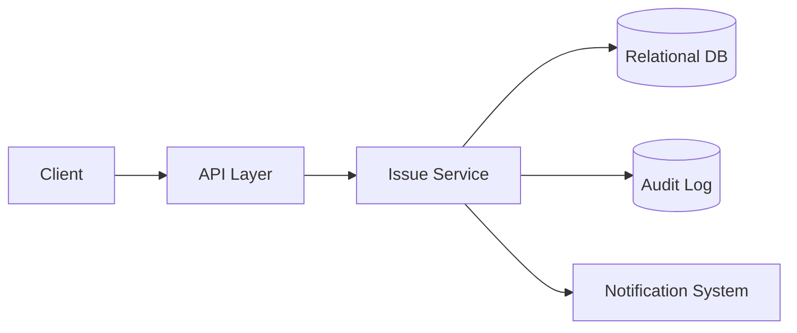

# Design a Simple Bug / Issue Tracker

## Blogs and websites

## Medium

## Youtube

## Theory

### Problem Statement

Design a simple bug/issue tracker (like a lightweight Jira) where users can create issues, assign them, comment, and track status through a workflow.

### Functional Requirements

- Create an issue (title, description, priority, type)
- Assign issue to a user, change status (open/in-progress/resolved/closed)
- Comment on an issue
- Filter/search issues by project, status, assignee

### Non-Functional Requirements

- **Scale**: Small-to-medium teams/projects, tens of thousands of issues per project
- **Latency**: Create/update/comment < 200ms
- **Auditability**: Status changes and comments should be traceable (who/when)

### API Design

```
POST /projects/{projectId}/issues        { title, description, priority, type }
PATCH /issues/{issueId}                  { status, assigneeId, priority }
POST /issues/{issueId}/comments          { text }
GET  /projects/{projectId}/issues?status=&assignee=
```

### Data Model

```
issues:    id (PK), project_id (FK), title, description, status, priority, type, assignee_id, created_at
comments:  id (PK), issue_id (FK), user_id, text, created_at
audit_log: id (PK), issue_id (FK), field, old_value, new_value, changed_by, changed_at
```

### High-Level Architecture



### Key Design Points

- Model issue status as a fixed state machine (open → in-progress → resolved → closed) and validate transitions server-side to prevent invalid states.
- Write every field change to an append-only audit log so history/blame is always reconstructable.
- Notify the assignee/watchers asynchronously on status change or new comment rather than blocking the write.

### Trade-offs

- A fixed workflow (state machine) is simple to reason about but less flexible than a fully configurable workflow engine, which is the right trade for a "basic" tracker.
