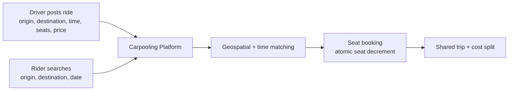
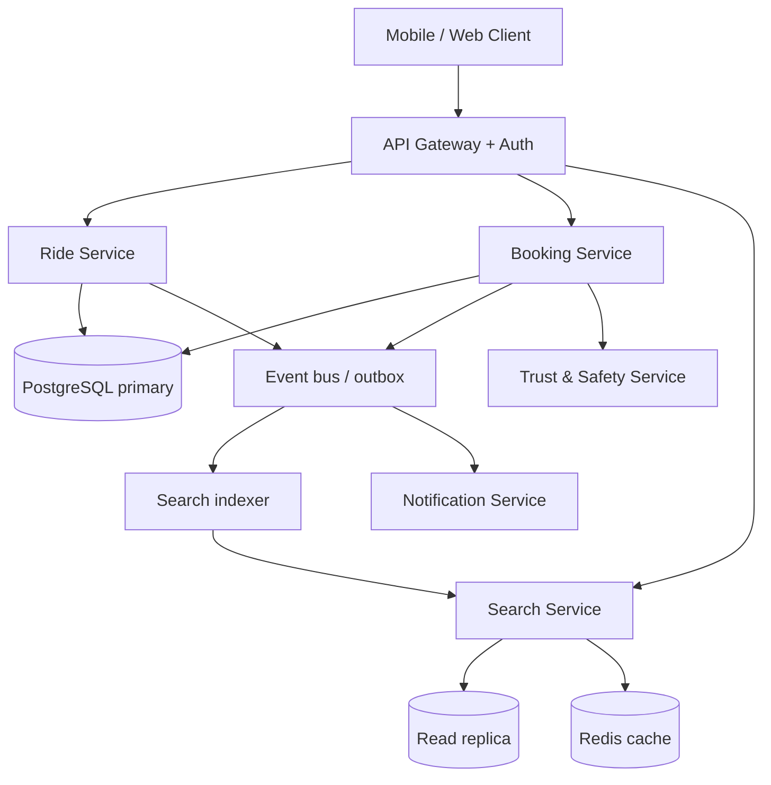
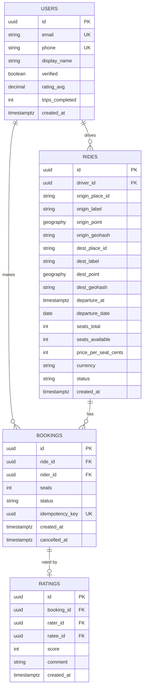
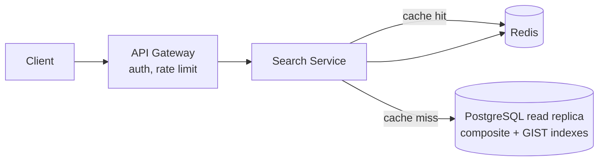

# Design a Simple Carpooling System

## Blogs and websites

## Medium

## Youtube

## Theory

### Topics Covered

1. [Problem Statement](#problem-statement)
2. [Functional Requirements](#functional-requirements)
3. [Non-Functional Requirements](#non-functional-requirements)
4. [Capacity Estimation](#capacity-estimation)
5. [Characteristics](#characteristics)
6. [Components](#components)
7. [Design Patterns](#design-patterns)
8. [Benefits](#benefits)
9. [Pros](#pros)
10. [Cons](#cons)
11. [Challenges](#challenges)
12. [Best Practices](#best-practices)
13. [When to Use / When Not to Use](#when-to-use--when-not-to-use)
14. [Use Cases](#use-cases)
15. [API Design](#api-design)
16. [Data Modeling](#data-modeling)
17. [High-Level Design](#high-level-design)
18. [Deep Dive](#deep-dive)
19. [Java and Spring Boot Implementation Guide](#java-and-spring-boot-implementation-guide)
20. [Interview Questions and Answers](#interview-questions-and-answers)

---

### Problem Statement

Design a simple carpooling system where a driver can offer a ride with a fixed route/time and available seats, and riders can search for and book a seat on a matching ride.

Carpooling (ride-sharing between private individuals, not commercial taxis) solves a concrete economic and environmental problem: most private cars travel with a single occupant, so the marginal cost of adding a passenger on an already-planned trip is near zero. A carpooling platform connects drivers who are already going from A to B with riders who need to make the same trip, letting them share fuel and toll costs. Well-known real-world products in this space include BlaBlaCar (long-distance intercity carpooling), Waze Carpool (commute matching), and Zify or Quick Ride (corporate commute pooling in India).

The core design tension in this system is **matching versus safety of shared mutable state**:

- **Matching** is a geospatial and temporal problem — a rider rarely travels between the exact same two points as the driver, so "matching" really means "the driver's route passes near the rider's origin and destination at roughly the right time."
- **Seat reservation** is a classic concurrency problem — a ride has a small, finite inventory (typically 1–4 seats), and concurrent booking attempts must never drive the available seat count negative.



**Why this is a good interview problem**

- It exercises relational data modeling, concurrency control, and geospatial indexing in one compact system.
- It has a natural scale-up story: an exact-match MVP can evolve into a geohash/PostGIS-based proximity matcher, then into route-segment matching (pick up and drop off anywhere along the route).
- It touches payments-adjacent concerns (price splitting), trust and safety (identity verification, ratings), and operational concerns (cancellations, no-shows).

**Real-life use cases**

- **Intercity carpooling**: a driver going from Berlin to Munich on Friday evening sells 3 spare seats (BlaBlaCar model).
- **Daily commute pooling**: colleagues or neighbors share a car to the same office district every weekday.
- **Event ride-sharing**: attendees of a concert or conference pool rides to the venue.
- **Campus ride boards**: students traveling home for holidays share long drives.

---

### Functional Requirements

The system supports two primary actors — **drivers** (who publish rides) and **riders** (who consume seats) — plus implicit platform services (search indexing, notifications).

1. **Publish a ride** — A driver posts a ride with origin, destination, departure time, number of available seats, and price per seat. The ride becomes searchable immediately (or after light validation).
2. **Search rides** — A rider searches rides by origin, destination, and date. The basic version performs exact city/locality matching; the advanced version matches nearby pickup points along the driver's route.
3. **Book a seat** — A rider books one or more seats on a ride. The available seat count is decremented atomically; the booking is rejected if insufficient seats remain. The rider receives a booking confirmation.
4. **Cancel a booking** — A rider cancels a booking; the reserved seats are returned to the ride's available pool. A driver cancels an entire ride; all active bookings are cancelled and affected riders are notified.
5. **View ride and booking state** — Drivers see who booked their ride; riders see their upcoming and past bookings.
6. **Manage ride lifecycle** — Rides transition through states (`SCHEDULED → IN_PROGRESS → COMPLETED` or `CANCELLED`); bookings transition through `CONFIRMED → COMPLETED` or `CANCELLED` / `NO_SHOW`.
7. **Rate counterparty (optional extension)** — After trip completion, drivers and riders rate each other to build the trust graph.
8. **Notify participants (optional extension)** — Booking confirmations, cancellations, and departure reminders are delivered via push/SMS/email.

Out of scope for the basic version (but discussed in [Deep Dive](#deep-dive)): dynamic pricing, multi-stop route optimization, in-app payments and escrow, real-time location tracking.

---

### Non-Functional Requirements

- **Scale**: Regional/city scale — thousands of rides posted per day, tens of thousands of daily searches. This is deliberately *not* Uber-scale; a single well-indexed relational database can carry the core workload, which is an important point to state in an interview (do not over-engineer).
- **Consistency**: Seat inventory must be strongly consistent — `seats_available` must never go negative under concurrent bookings, and a cancelled booking must reliably return its seats. Booking and seat decrement must be atomic (same transaction).
- **Availability**: Search must be highly available (a rider who cannot search never books); booking can briefly degrade (fail closed rather than overbook). Target ~99.9% for search reads, and correctness over availability for the booking write path (CP behavior on inventory).
- **Latency**: Search p99 < 300 ms; booking p99 < 200 ms. Both are achievable with proper indexing at this scale.
- **Durability**: Confirmed bookings and rides must survive crashes — committed to a transactional database with replication; no acknowledged booking may be lost.
- **Data freshness**: A newly posted ride should appear in search within seconds (near-real-time indexing, not hourly batch).
- **Security & privacy**: User locations, phone numbers, and trip history are PII — protect in transit and at rest, and expose only what counterparties need (e.g., masked contact until booking confirmed).
- **Cost efficiency**: At city scale, the system should run on commodity infrastructure — a primary relational DB with read replicas, a cache, and a lightweight search index; no need for a distributed NoSQL fleet.

---

### Capacity Estimation

Back-of-envelope estimation for a mid-size regional deployment. In interviews, state assumptions explicitly and round aggressively.

**Assumptions**

- Active users: 500,000 registered; ~10% active daily → **50,000 DAU**.
- Rides posted: **5,000 rides/day** (drivers are far fewer than riders — typical rider:driver ratio is 5–10:1).
- Searches: each active rider searches ~3 times before booking → **~150,000 searches/day**.
- Bookings: ~20% of searches convert → **~30,000 booking attempts/day**, ~25,000 successful bookings/day.

**QPS**

- Average search QPS = 150,000 / 86,400 ≈ **2 QPS average**, peak (morning/evening commute, ~4× average) ≈ **8–10 QPS**.
- Booking write QPS = 30,000 / 86,400 ≈ **0.35 QPS average**, peak ≈ **2 QPS**.
- Ride posting QPS ≈ negligible (< 0.1 QPS).

Conclusion: this workload is trivially handled by one application server behind a load balancer (run 2+ for availability) and a single primary database. The design pressure is **correctness and data modeling**, not throughput.

**Storage**

- Ride row: id (8 B) + driver_id (8 B) + origin/destination points (2 × 16 B) + origin/destination labels (~100 B) + timestamps + seats + price + status ≈ **~300 B/row** with indexes ≈ 500 B.
  - 5,000 rides/day × 365 days ≈ 1.8 M rides/year ≈ **~1 GB/year** including indexes.
- Booking row ≈ ~200 B × 25,000/day × 365 ≈ 9 M bookings/year ≈ **~2–3 GB/year**.
- Users, ratings, notifications metadata: another few GB/year.

Total well under 10 GB/year → a single PostgreSQL instance with replication is comfortable for many years; archive rides older than ~1 year to cold storage.

**Bandwidth**

- Search response: 20 rides × 300 B ≈ 6 KB per response → 150,000 × 6 KB ≈ **0.9 GB/day** outbound for search.
- Peak bandwidth ≈ 10 QPS × 6 KB ≈ 60 KB/s — negligible.

**Memory / cache**

- Hot working set: today's and this week's rides ≈ 5,000 × 7 = 35,000 rows × 500 B ≈ **~18 MB** — the entire hot set fits in cache or even in the DB buffer pool; caching search results per (origin, destination, date) for ~30–60 s is cheap and effective.

---

### Characteristics

- **Two-sided marketplace**
  Drivers supply inventory (seats on specific trips); riders consume it. The system must balance both sides: too few rides and riders churn; too few riders and drivers stop posting. This shapes features like instant booking vs. driver approval.
- **Finite, small, perishable inventory**
  Each ride has 1–4 seats, and the inventory *expires* at departure time — an unsold seat at departure is lost forever, like a hotel night or an airline seat. Perishability motivates reminders, waitlists, and last-minute booking support.
- **Strong consistency requirement on a tiny critical section**
  Only one piece of state needs strict serialization: the seat counter of a single ride row. Everything else (profiles, search, ratings) tolerates eventual consistency. Recognizing the *small* size of the consistency boundary is a key senior-level insight.
- **Geospatial and temporal matching**
  "Match" means proximity in space (pickup near rider's origin, drop-off near rider's destination) *and* time (departure within the rider's window). This is fundamentally different from exact-key lookups and drives the indexing design.
- **Trust-mediated transactions**
  Strangers share a car for hours, so identity verification, ratings, and moderation are first-class product concerns, not afterthoughts.
- **Low write volume, read-heavy**
  Searches vastly outnumber bookings and postings (~5:1 search:booking, ~30:1 search:post). The system is read-optimized: denormalized search views, caching, read replicas.
- **Network effects and locality**
  Liquidity is per-corridor (city-pair) and per-time-slot. A great design for Berlin–Munich does nothing for Hamburg–Cologne; sharding and marketing both follow geography.
- **Human-in-the-loop failure modes**
  No-shows, last-minute cancellations, and disputes are common; the system needs state machines and policies for them, not just happy-path CRUD.

---

### Components

- **API Gateway / Load Balancer**
  Terminates TLS, authenticates requests (JWT/OAuth2), applies rate limits, and routes to services. At this scale a managed LB plus a thin gateway layer (Spring Cloud Gateway or an NGINX ingress) is sufficient.
- **Ride Service**
  Owns the ride lifecycle: create ride, update (time/seats/price), cancel, complete. Enforces invariants (seats > 0, departure in future, driver owns the ride). Publishes domain events (`RideCreated`, `RideCancelled`) for the search indexer and notifier.
- **Booking Service**
  Owns seat reservation: book, cancel, list bookings. Executes the atomic seat decrement inside a database transaction and emits `BookingConfirmed` / `BookingCancelled` events. This is the correctness-critical component.
- **Search Service**
  Answers origin/destination/date queries. Reads from either the relational DB with composite + spatial indexes (basic) or a dedicated index (Elasticsearch/OpenSearch or PostGIS-based materialized view) fed by events (scaled). Applies filters (seats needed, price ceiling, departure window) and ranking (departure proximity, driver rating, price).
- **Geospatial Index**
  Stores origin/destination coordinates as geohashes or PostGIS `geography` points so proximity queries (`ST_DWithin`) or geohash-prefix range scans are fast. See [Deep Dive](#deep-dive).
- **Relational Database (primary + read replica)**
  System of record for users, rides, bookings, payments metadata. Primary handles writes and booking-critical reads; replicas serve search and profile reads.
- **Cache (Redis)**
  Caches hot search result pages (keyed by route+date+filters hash, TTL 30–60 s), session tokens, and rate-limit counters. May also hold short-lived seat "holds" if a hold-then-confirm flow is added.
- **Notification Service**
  Consumes domain events and sends push/SMS/email: booking confirmations, driver cancellations, departure reminders. Asynchronous so the booking path never blocks on an SMS gateway.
- **Payment / Cost-Split Service (optional in basic version)**
  Computes each rider's share, collects payment (or records cash-settlement intent), and handles refunds on cancellation.
- **Trust & Safety Service**
  Identity verification (phone OTP, government ID), ratings and reviews, report/block lists. Consulted during booking and when rendering counterparties.
- **Media/Profile Store**
  Object storage (S3) for profile photos and verification documents, fronted by a CDN.



---

### Design Patterns

- **Atomic Inventory Decrement (compare-and-set in SQL)**
  *What:* decrement seats with a guarded update — `UPDATE rides SET seats_available = seats_available - :n WHERE id = :id AND seats_available >= :n` — and check the affected row count.
  *Problem solved:* two concurrent bookings for the last seat must not both succeed.
  *How it works:* the database row lock serializes the updates; exactly one transaction sees `seats_available >= n` true. Zero affected rows → booking rejected.
  *When to use:* whenever inventory is small, hot, and correctness-critical. *When not:* if you need long business transactions spanning services (use sagas/holds instead).
  *Advantages:* simple, fast, no extra infrastructure, correct under crashes. *Disadvantages:* row contention on extremely hot rides; does not compose across databases.
  *Real-world:* airline seat maps, ticket sales, flash-sale stock counters.

- **Transactional Outbox**
  *What:* write domain events to an `outbox` table in the same transaction as the state change; a relay publishes them to the message bus.
  *Problem solved:* "commit DB then publish event" is not atomic — a crash between the two loses the event or publishes an event for a rolled-back change.
  *When to use:* whenever downstream indexers/notifiers must exactly reflect committed state. *When not:* for fire-and-forget telemetry.
  *Advantages:* at-least-once, consistent with DB state. *Disadvantages:* relay complexity; consumers must be idempotent.
  *Real-world:* Debezium-based CDC pipelines feeding search indexes at scale.

- **State Machine (ride and booking lifecycles)**
  *What:* model rides and bookings as explicit state machines with guarded transitions (`CANCELLED` only from `SCHEDULED`/`CONFIRMED`, etc.).
  *Problem solved:* ad-hoc status strings plus scattered `if` checks produce illegal states (e.g., completing a cancelled ride).
  *Advantages:* auditable transitions, easy to attach side effects (refund on cancel). *Disadvantages:* boilerplate for simple domains.
  *Real-world:* order management systems, delivery tracking.

- **CQRS-lite (read/write separation)**
  *What:* writes go to normalized tables; search reads hit a denormalized, index-optimized view fed by events.
  *Problem solved:* the write schema (normalized, integrity-focused) is a poor search schema (flattened, geospatially indexed).
  *Advantages:* each side optimized independently; search can scale/rebuild without touching writes. *Disadvantages:* eventual consistency window between post and searchable.
  *Real-world:* BlaBlaCar-style search backed by Elasticsearch while bookings live in PostgreSQL.

- **Saga / Compensating Transaction (booking + payment)**
  *What:* split book-and-pay into local transactions with compensations (payment failure → release seats; cancellation → refund).
  *Problem solved:* you cannot wrap "our DB" and "payment gateway" in one ACID transaction.
  *Advantages:* no distributed locks, each step retryable. *Disadvantages:* compensation logic, transient inconsistent states visible to users.
  *Real-world:* any marketplace checkout flow.

- **Cache-Aside with short TTL**
  *What:* search checks Redis first; on miss, query DB and populate with 30–60 s TTL; invalidate aggressively on ride events.
  *Problem solved:* repeated identical searches for hot corridors (Friday evening Berlin→Munich) hammer the DB.
  *Advantages:* simple, resilient (cache failure = DB hit). *Disadvantages:* brief staleness; cache stampede on expiry (mitigate with request coalescing).

- **Circuit Breaker (notifications, payments)**
  *What:* wrap external calls (SMS provider, payment gateway) in breakers so their outages do not cascade into the booking path.
  *Advantages:* graceful degradation (booking succeeds, notification queued). *Disadvantages:* needs tuning and fallback semantics.

---

### Benefits

- **Near-zero marginal cost inventory**
  The driver is making the trip anyway, so every booked seat is almost pure margin (fuel/toll share). In production this means the business can run lean — there is no fleet to finance — and the platform's job reduces to matching and trust.
- **Simple, boring infrastructure**
  At city scale the entire system runs on a monolith or a handful of services over one relational database. In production this translates to small on-call surface, easy debugging, and low cloud bills — a genuine engineering benefit, not a compromise.
- **Clear correctness boundary**
  Because only the seat counter needs serialization, the rest of the system can be aggressively cached, eventually consistent, and scaled horizontally. Knowing exactly where ACID is required keeps the design cheap.
- **Environmental and social impact**
  Higher vehicle occupancy reduces congestion and emissions; this matters for partnerships with cities and employers, which are real distribution channels for carpooling products.
- **Natural geographic sharding**
  Liquidity is local, so when scale eventually demands it, sharding by region/corridor is a clean, low-contention split — cross-shard transactions are rare (nobody books Berlin→Munich and Lisbon→Porto in one operation).

---

### Pros

- **Low build complexity for the MVP**
  Exact-match search on `(origin, destination, departure_date)` with a composite B-tree index is a weekend of work, yet fully functional for intercity corridors. This lets the team validate market liquidity before investing in geospatial matching.
- **Strong data consistency is cheap here**
  The hot inventory rows are few and the contention per row is low (a given ride gets a handful of booking attempts over its lifetime), so row-level locking in PostgreSQL delivers strict correctness with no distributed coordination.
- **Predictable, low infrastructure cost**
  Capacity estimation shows single-digit QPS; the system fits comfortably on two app servers and one replicated database — cheap to run, cheap to replicate across an AZ for HA.
- **Straightforward auditability**
  Bookings and seat movements are relational rows with foreign keys and status histories; disputes ("did I book?") are answerable from the database, which matters for a money-adjacent product.
- **Incremental sophistication**
  The architecture admits clean upgrades — geohash bucketing, then PostGIS `ST_DWithin`, then full route-segment matching — each behind the same search API, so the system grows with the business.

---

### Cons

- **Exact matching misses most real demand**
  Riders rarely share the driver's exact endpoints; a pure city-pair matcher silently drops good matches (e.g., rider near the highway exit). This caps conversion until geospatial matching ships — the basic design's biggest product limitation.
- **Cold-start / liquidity problem**
  A two-sided marketplace with no inventory is useless and with no riders is abandoned by drivers. The system design cannot fix this; it requires seeding (corridor-by-corridor launches, employer partnerships), which interviewers appreciate hearing acknowledged.
- **Trust and safety burden**
  The platform brokers strangers into enclosed spaces. Verification, ratings, moderation, and incident handling are operationally heavy and never "done," and a single safety incident can destroy a regional market.
- **Perishable inventory amplifies cancellations**
  A driver cancelling 2 hours before departure strands riders with little recovery time; a rider no-show wastes a seat that cannot be resold. Policies (cancellation windows, penalties, standby lists) add product and code complexity.
- **Price discovery is weak**
  Fixed price-per-seat set by the driver leads to mispriced rides (too high → empty seats; too low → driver regret). Dynamic or suggested pricing helps but adds an ML/problem surface far beyond the basic system.
- **Regulatory gray zones**
  In many jurisdictions, cost-sharing is legal but profit-making ride offers are regulated like taxis; the pricing rules engine may need per-country caps (e.g., price ≤ cost-share threshold), complicating what looks like a simple field.

---

### Challenges

- **Geospatial matching quality vs. latency**
  *Technical:* radius search around origin *and* destination *and* a time window is a 5-dimensional filter; naive scans blow the 300 ms budget. Requires geohash prefix expansion or spatial indexes, plus candidate pruning before ranking.
- **Concurrency on seat inventory**
  *Correctness:* concurrent book/cancel/ride-edit operations interleave (a driver reducing seats while a rider books). The invariant `booked + available = declared seats` must hold under every interleaving — needs transactional guards and careful ordering.
- **Cancellation cascades**
  *Reliability:* a driver cancellation must cancel N bookings, return seats (moot post-cancellation but needed for accounting), trigger refunds, and notify riders — all-or-nothing-ish across services; needs outbox + idempotent consumers, or riders get ghost confirmations.
- **Search freshness vs. cache efficiency**
  *Performance:* a just-posted ride should be searchable within seconds, but search caching improves latency; reconciling the two requires event-driven invalidation or very short TTLs plus stale-while-revalidate.
- **No-show and dispute handling**
  *Operational:* detecting no-shows (driver confirms pickup? GPS check-in?) and mediating disputes is a workflow problem with edge cases (both claim the other no-showed) that pure CRUD cannot express.
- **PII protection**
  *Security:* trip history reveals home/work locations and routines — extremely sensitive. Needs encryption at rest, strict access scoping (counterparty sees masked data until booking confirmed), retention limits, and GDPR-style deletion.
- **Time zone and DST correctness**
  *Maintainability:* rides cross time zones and DST boundaries; storing local times instead of UTC instants causes rides to be missed or mis-searched twice a year. All storage in UTC, rendering in the route's local zone.
- **Abuse and fraud**
  *Security/operational:* fake rides (phishing contact info), fake bookings (denial-of-inventory against a competing driver — yes, it happens in commuter pools), review bombing. Needs rate limits, verification gates, and anomaly detection.

---

### Best Practices

- **Guard the seat counter in SQL, not in application code**
  Doing `SELECT seats_available` then `UPDATE` in two statements races under concurrency. The single guarded `UPDATE ... WHERE seats_available >= :n` makes the database the arbiter — this is why: the row lock serializes contenders, and the affected-row count is the definitive accept/reject signal. Example: two riders race for the last seat; both transactions execute, one updates 1 row (success), the other 0 rows (reject with `409 Conflict`).
- **Put bookings and the seat decrement in one transaction**
  Inserting the booking row and decrementing seats must commit or fail together; otherwise a crash between them yields either lost seats (leak) or phantom bookings. This is exactly what `@Transactional` on the booking service method gives you.
- **Publish state changes through an outbox**
  Search index updates and notifications must reflect *committed* state. Writing `RideCreated` to an outbox table in the same transaction, then relaying asynchronously, avoids the dual-write problem where the DB commits but the Kafka publish fails.
- **Store coordinates, not just city names, from day one**
  Even if the MVP matches on normalized city strings, capture lat/lng at posting time. Retrofitting coordinates onto a large ride corpus is painful; having them from the start makes the geohash/PostGIS upgrade a pure search-layer change.
- **Normalize location labels and index the normalized form**
  Users type "München", "Munich", "Munchen". Resolve to a canonical place ID (via a places gazetteer or Google Places-style autocomplete) at write time, and index the canonical ID — string matching on raw input destroys recall.
- **Make all consumers idempotent**
  The notification service will occasionally receive `BookingConfirmed` twice (at-least-once delivery). Key side effects by booking ID (`ON CONFLICT DO NOTHING` on a `notifications(booking_id, type)` table, or a dedupe store) so retries are harmless.
- **Expire inventory explicitly**
  A scheduled job (or a query-time filter `departure_at > now()`) must retire past rides; otherwise search results fill with departed rides and seat counters for completed trips clutter the hot set. Move completed rides to history tables/partitions.
- **Design cancellation policies as data, not code**
  Refund rules ("full refund > 24 h before departure, 50% within 24 h") change per market and over time. Store policy parameters in configuration or a rules table so a product change is not a deploy.
- **Rate-limit posting and booking per user**
  Prevents denial-of-inventory abuse (fake bookings blocking real riders) and scraping. Token buckets per user ID at the gateway, e.g., 10 bookings/hour, 5 ride posts/day for unverified drivers.
- **Mask counterparty PII until a booking is confirmed**
  Only after a confirmed booking should rider and driver see each other's phone number (ideally via a masked relay number). This limits harassment and data harvesting, and it is a legal expectation in many markets.

---

### When to Use / When Not to Use

**This design (relational core, exact or radius matching, atomic seat decrement) is appropriate when:**

- Inventory is small and perishable (a few seats per trip) and the booking:ride contention ratio is low — relational row locking is the cheapest correct solution.
- Scale is city/regional (single-digit to low-hundreds QPS) — a monolith or few services over PostgreSQL outperforms a microservice fleet in total cost of ownership.
- Correctness requirements are concentrated (seat counter) while the rest tolerates eventual consistency (search, ratings).
- The team is small; operational simplicity has real business value.

**Choose something else when:**

- *You need real-time, continuous matching* (ride-hailing like Uber): this design is batch-request/confirm, not a live dispatch system; ride-hailing needs driver location streaming, ETA engines, and marketplace rebalancing — a fundamentally different architecture.
- *You need complex multi-leg itineraries* (FlixBus-style network routing): requires graph search over scheduled segments, not point matching.
- *Booking contention per inventory item is extreme* (10,000 users racing for 100 concert tickets): row-lock contention becomes the bottleneck; use queue-based serialization (single-writer partitions, Redis/Lua atomic counters, or ticketing-specific fair-queue systems).
- *Cross-region single-deployment requirement*: if one logical marketplace spans continents with local latency requirements, you need a multi-region data strategy (regional shards with cross-region search federation), which this single-primary design does not provide.

**Decision factors:** expected QPS, contention per inventory item, matching sophistication needed at launch, team size, regulatory environment, and whether matching is on-demand (immediate) or planned (days ahead — carpooling is usually planned, which relaxes latency enormously).

---

### Use Cases

**Use Case 1 — Intercity weekend carpooling (BlaBlaCar-style)**

- *Problem:* A driver travels Berlin→Munich every Friday at 17:00 and wants to offset fuel costs; students want cheap Friday-evening travel.
- *Proposed solution:* Driver posts a ride with canonical city endpoints, 3 seats, €25/seat. Riders search (Berlin, Munich, Friday) and book instantly.
- *Why this design fits:* planned (not on-demand) travel means minutes of indexing lag are invisible; exact city-pair matching covers the corridor; low QPS.
- *How it works:* ride posted → outbox event → search index updated → rider search hits composite index `(origin_id, destination_id, departure_date)` → booking transaction decrements seats → confirmation event → notifications to both parties.
- *Trade-offs:* fixed pickup points reduce flexibility (riders must reach the meeting point); pricing is static so peak Fridays may be underpriced.

**Use Case 2 — Corporate commute pooling**

- *Problem:* A company wants employees from the same suburbs to share cars to the office campus, reducing parking demand.
- *Proposed solution:* Recurring rides (driver posts a weekly template: Mon–Fri 08:00, suburb centroid → campus). Riders book seats per day or subscribe to the series.
- *Why this design fits:* the route set is small and stable; recurring templates are just a ride-generation job; verification is simplified (corporate SSO doubles as identity verification — a nice illustration that trust requirements shape architecture).
- *How it works:* a scheduler materializes daily ride instances from templates; booking uses the same atomic decrement; geofenced "campus" destination makes destination matching trivial.
- *Trade-offs:* recurring series add modeling complexity (template vs. instance, skipping holidays); last-minute driver absence cancels many riders at once — needs a standby-driver policy.

**Use Case 3 — Event ride-sharing (concert/conference)**

- *Problem:* 20,000 attendees converge on a venue at the same time; parking and transit are saturated.
- *Proposed solution:* Time-boxed "event ride board": drivers post rides with the venue as a fixed destination; riders search by origin only, sorted by pickup proximity and departure window.
- *Why this design fits:* the destination is a single canonical point, so matching reduces to a 1-point radius search — geohash prefix queries shine; demand is bursty but predictable (event dates known).
- *How it works:* origins indexed by geohash; rider search expands geohash prefix rings around their location until ≥ 20 candidates; results ranked by departure-time fit; booking as usual.
- *Trade-offs:* spiky load (search QPS 100× baseline for hours) argues for aggressive caching keyed by (geohash cell, event); post-event return matching is a second, smaller problem often ignored.

**Use Case 4 — Airport ride pooling**

- *Problem:* Travelers from the same city district heading to the airport within the same 2-hour window could share one car.
- *Proposed solution:* Drivers (or one designated traveler) post rides anchored to a flight date/time window; riders join and split the fare.
- *Why this design fits:* time-window matching on a fixed destination is exactly the corridor pattern with a tighter window; perishability is extreme, which the waitlist/notification extensions handle.
- *Trade-offs:* flight-time changes require ride re-anchoring (events from a flight-status feed); luggage constrains effective seats (a "seat" is not a seat — capacity must model luggage too, an interesting schema nuance).

---

### API Design

REST over HTTPS, JSON payloads, JWT bearer auth (OAuth2). All timestamps are ISO-8601 UTC. Versioned via URL prefix `/v1`. Idempotency-Key header supported on booking creation to make client retries safe.

**Create a ride**

```
POST /v1/rides
Authorization: Bearer <jwt>
Content-Type: application/json

{
  "origin":      { "placeId": "plc_berlin_hbf", "lat": 52.5251, "lng": 13.3694, "label": "Berlin Hauptbahnhof" },
  "destination": { "placeId": "plc_munich_hbf", "lat": 48.1403, "lng": 11.5600, "label": "München Hauptbahnhof" },
  "departureAt": "2026-03-13T16:00:00Z",
  "seats": 3,
  "pricePerSeat": { "amount": 2500, "currency": "EUR" },
  "instantBook": true
}
```

`201 Created`

```json
{
  "rideId": "r_01J4ZXY9E4",
  "status": "SCHEDULED",
  "seatsAvailable": 3,
  "createdAt": "2026-03-10T09:15:00Z"
}
```

Validation (`@Valid` + Bean Validation): `seats` in [1, 8], `departureAt` at least 30 minutes in the future, price non-negative and below the market's cost-share cap, `origin.placeId != destination.placeId`. Violations → `400` with field-level errors; unauthenticated → `401`; posting rate limit exceeded → `429` with `Retry-After`.

**Search rides**

```
GET /v1/rides/search?origin=plc_berlin_hbf&destination=plc_munich_hbf&date=2026-03-13&seats=2&maxPrice=3000&departAfter=2026-03-13T12:00:00Z&sort=departureAt&cursor=eyJsYXN0IjoxfQ&limit=20
```

`200 OK`

```json
{
  "results": [
    {
      "rideId": "r_01J4ZXY9E4",
      "driver": { "userId": "u_88", "displayName": "Jonas", "rating": 4.8, "tripsCompleted": 132 },
      "origin": { "label": "Berlin Hauptbahnhof" },
      "destination": { "label": "München Hauptbahnhof" },
      "departureAt": "2026-03-13T16:00:00Z",
      "seatsAvailable": 3,
      "pricePerSeat": { "amount": 2500, "currency": "EUR" }
    }
  ],
  "nextCursor": "eyJsYXN0Ijoic18yMCJ9"
}
```

Pagination is **cursor-based** (offset pagination degrades and gives inconsistent pages as rides are posted/cancelled mid-scroll). Sorting: `departureAt` (default), `price`, `driverRating`. Filtering: seats needed, price ceiling, departure window, verified-driver-only. Response is cacheable for 30 s keyed by the full query string hash.

**Book seats** (concurrency-critical)

```
POST /v1/rides/r_01J4ZXY9E4/bookings
Authorization: Bearer <jwt>
Idempotency-Key: 9f1c2a78-…-client-generated-uuid

{ "seats": 2, "pickupNote": "Main entrance, blue jacket" }
```

`201 Created`

```json
{ "bookingId": "b_5011", "rideId": "r_01J4ZXY9E4", "seats": 2, "status": "CONFIRMED", "totalPrice": { "amount": 5000, "currency": "EUR" } }
```

Semantics: the server executes the guarded seat decrement + booking insert in one transaction. Responses: `201` confirmed; `409 Conflict` `{"error": "INSUFFICIENT_SEATS", "seatsAvailable": 1}` when seats ran out; `410 Gone` if the ride was cancelled/departed; `422` if seats requested exceed ride capacity. Retrying with the same `Idempotency-Key` returns the original booking instead of double-booking — the key is stored with the booking (unique constraint) so the duplicate insert is detected and the stored response replayed.

**Cancel a booking**

```
POST /v1/bookings/b_5011/cancel
{ "reason": "PLANS_CHANGED" }
```

`200 OK` `{"bookingId": "b_5011", "status": "CANCELLED", "refund": { "amount": 5000, "currency": "EUR" }}` — seats returned to the ride in the same transaction; refund computed from the cancellation policy; `404` if the booking does not belong to the caller.

**Cancel a ride (driver)**

```
POST /v1/rides/r_01J4ZXY9E4/cancel
```

`200 OK` with per-booking outcomes; triggers notification fan-out via outbox events.

**Other endpoints**: `GET /v1/users/me/bookings?status=UPCOMING` (rider history), `GET /v1/rides/r_01J4ZXY9E4/bookings` (driver manifest, requires driver ownership), `POST /v1/rides/{rideId}/ratings` (post-trip, one per booking, validated against completed bookings).

Cross-cutting: rate limiting (per-user token bucket; search 60/min, bookings 10/hour), consistent error envelope `{"error": CODE, "message": "...", "fieldErrors": [...]}`, request IDs propagated for tracing, API version negotiation via the `/v1` prefix (breaking changes → `/v2`, old version maintained ≥ 6 months).

---

### Data Modeling

Core entities: **User**, **Ride**, **Booking**, plus supporting **Rating** and **Outbox**. Normalized to 3NF for the write path; search reads use denormalized projections.



**Keys and constraints**

- PKs: surrogate `uuid` (or `bigint` from a sequence/TSID) — never expose sequential IDs in URLs if scraping matters; here ULID/UUID strings are used in the API.
- FKs: `rides.driver_id → users.id`, `bookings.ride_id → rides.id`, `bookings.rider_id → users.id` — `ON DELETE RESTRICT` (bookings are financial records; users are soft-deleted/anonymized instead).
- Check constraints: `seats_available BETWEEN 0 AND seats_total`, `price_per_seat_cents >= 0`, `departure_at > created_at` (approximate, enforced in app), `bookings.seats > 0`.
- Uniqueness: `bookings.idempotency_key` unique; partial unique index to prevent duplicate active bookings by the same rider on the same ride: `UNIQUE (ride_id, rider_id) WHERE status = 'CONFIRMED'` — a rider cannot hold two active bookings on one ride.
- `departure_date` is a generated/stored column (`departure_at AT TIME ZONE 'UTC'::date`) because corridor searches filter by calendar day; storing it avoids per-row function evaluation and keeps the composite index small and sargable.

**Indexes**

- `rides (origin_place_id, destination_place_id, departure_date)` — the basic corridor search.
- `rides (origin_geohash)` / PostGIS `GIST (origin_point)` and `GIST (dest_point)` — radius matching upgrade.
- `rides (status, departure_at)` — expiry/archival job scans.
- `bookings (rider_id, status)` and `bookings (ride_id, status)` — rider history and driver manifest.
- `users (rating_avg DESC)` is unnecessary; ratings joins go through `booking_id`.

**Normalization vs. denormalization**

Write side stays normalized (users/rides/bookings) to protect integrity. The **search projection** denormalizes: each search document embeds driver display name, rating, ride fields, and place labels so a search page is served with zero joins. The projection is rebuilt from outbox events and is disposable — it can be dropped and backfilled from the relational source of truth.

**Data lifecycle**

- Rides: `SCHEDULED → (IN_PROGRESS) → COMPLETED | CANCELLED`; rows older than ~12 months moved to history tables or cold partitions (partition `rides` and `bookings` by month of `departure_at` once volume justifies it — here, after several years).
- PII: anonymize rider PII in old bookings (keep aggregates for analytics); honor deletion requests by erasing `users` PII while keeping financial records pseudonymized — retention policy is a legal requirement, not an optimization.
- Partitioning strategy at scale: hash-shard by region/corridor is natural because rides and bookings are geographically local and cross-region transactions do not exist.

---

### High-Level Design

**Request flow — search (read path)**



Search is served from Redis when an identical query was recently answered (30–60 s TTL, invalidated early on ride events for the affected corridor), otherwise from the read replica using the corridor index or geohash range scan. The replica lag (< 1 s) is acceptable because rides are planned hours-to-days ahead.

**Request flow — booking (write path)**

```mermaid
sequenceDiagram
    participant R as Rider Client
    participant GW as API Gateway
    participant BS as Booking Service
    participant DB as PostgreSQL Primary
    participant OB as Outbox Relay
    participant NS as Notification Service

    R->>GW: POST /rides/{id}/bookings (Idempotency-Key)
    GW->>BS: authenticated request
    BS->>DB: BEGIN; check idempotency key
    BS->>DB: UPDATE rides SET seats_available = seats_available - n<br/>WHERE id = ? AND seats_available >= n AND status = 'SCHEDULED'
    alt 1 row updated
        BS->>DB: INSERT booking (CONFIRMED) + outbox(BookingConfirmed)
        BS->>DB: COMMIT
        BS-->>R: 201 booking confirmed
        OB->>NS: BookingConfirmed event
        NS-->>R: push/SMS confirmation
    else 0 rows updated
        BS->>DB: ROLLBACK
        BS-->>R: 409 INSUFFICIENT_SEATS
    end
```

The guarded update is the serialization point: PostgreSQL takes a row lock on the ride row for the duration of the transaction, so concurrent booking transactions on the same ride execute sequentially. Events are written to the outbox table in the same transaction, guaranteeing the notification and search-invalidation pipelines see exactly the committed truth.

**Component dependencies and scaling strategy**

- Stateless services (Ride, Booking, Search) scale horizontally behind the LB; at this scale 2–3 instances suffice for availability, not load.
- Database: single primary + 2 read replicas; failover via Patroni/managed RDS. Booking-critical reads (seat counts at confirm time) always hit the primary — replica reads are for search and history only.
- Failure handling: gateway retries only idempotent GETs automatically; booking retries are client-driven with `Idempotency-Key`. If the DB is unavailable, bookings fail closed (503) while search degrades gracefully to cache-only. Notification outages are absorbed by the outbox relay (events queue up; delivery catches up).
- A scheduled expiry worker flips `SCHEDULED` rides past departure to `COMPLETED` (and triggers no-show windows), keeping the hot search set small.

---

### Deep Dive

#### 1. Geospatial Matching — Geohash and PostGIS

Exact place-ID matching is the MVP; real matching is proximity-based. Two mainstream approaches:

**Geohash** encodes a lat/lng into a base-32 string such that shared string prefixes imply shared spatial cells (precision 5 ≈ 4.9 km × 4.9 km cells; precision 6 ≈ 1.2 km × 0.6 km). To find rides with origin within ~X km of the rider: compute the rider's geohash at the precision matching the radius, compute the 8 neighboring cells (to avoid edge effects where nearby points share no prefix), and query `origin_geohash LIKE ANY (prefixes)` on a B-tree index. Filter the candidate set by exact haversine distance and the destination/time predicates.

**PostGIS** stores `geography(Point, 4326)` columns with GiST indexes and answers `ST_DWithin(origin_point, rider_point, 5000)` directly in meters, handling spheroid distance correctly. Query: `WHERE ST_DWithin(r.origin_point, :riderOrigin, :radiusM) AND ST_DWithin(r.dest_point, :riderDest, :radiusM) AND r.departure_at BETWEEN :from AND :to AND r.seats_available >= :seats ORDER BY r.departure_at LIMIT 50`.

Practical guidance: start with PostGIS — one extension, exact distances, no prefix arithmetic. Use geohashes when the search backend is a key-value/document store (Elasticsearch `geo_point` also uses geohash/BKD trees internally). The advanced form — matching pickups *along the driver's route polyline* — stores a route linestring from a routing engine and matches `ST_DWithin(route_line, rider_point, radius)`, which is the BlaBlaCar-style detour-bounded matching. Route storage also enables detour estimation (`extra minutes caused by this pickup`), a strong ranking signal.

Ranking after candidate retrieval: score = w1·(departure time fit) + w2·(driver rating) + w3·(detour minutes, negative) + w4·(price, negative). Keep ranking in application code so weights are tunable without reindexing.

#### 2. Ride Booking and Seat Reservation Concurrency

The invariant: `seats_available` never negative, never exceeding `seats_total`, and every confirmed booking is backed by seats. Threats and defenses:

- **Concurrent bookings for the last seats** → guarded atomic update (`UPDATE ... WHERE seats_available >= :n`) with row-count check; the loser's transaction rolls back and returns `409`.
- **Booking + concurrent ride cancellation** → the guarded update includes `status = 'SCHEDULED'`; cancellation sets `status = 'CANCELLED'` in a transaction that also updates bookings. Because both touch the ride row, the row lock serializes them — a booking either lands before cancellation (and is then cancelled+refunded by the cascade) or fails after it with `410 Gone`.
- **Driver reducing seats below already-booked count** → enforce `seats_available = seats_total - confirmed_seats` via a check at update time; reject reductions below current confirmed bookings (`422`).
- **Duplicate submissions / retries** → idempotency key unique constraint; second request replays the stored booking.
- **Phantom inventory via crashed clients** → if a hold-then-confirm flow is introduced (seats held for 10 minutes while the rider pays), holds are rows with `expires_at`; a sweeper releases expired holds. Redis `SET NX PX` with Lua-checked decrement is an alternative for very hot rides, but DB rows remain the source of truth.

Lock ordering when a transaction touches both the ride row and booking rows: always lock ride first, then insert bookings, to keep a single consistent order and avoid deadlocks between booking and cancellation transactions.

#### 3. Pricing and Cost Splitting

Carpooling pricing is *cost sharing*, not market pricing: the driver recovers fuel + tolls + depreciation, typically capped by regulation (e.g., a per-km cap so the driver cannot profit, keeping the service legal as carpooling rather than unlicensed taxi operation).

- **Computation**: suggested price per seat = (distance_km × per_km_cost + tolls) / (seats_total + 1). Per-km cost is configuration per market (e.g., €0.20–0.30/km). The platform suggests; the driver sets within `[0, cap]`.
- **Splitting among riders**: flat per-seat for point-to-point. For route-segment pickups (rider joins for part of the route), split pro-rata by distance: rider_share = total_trip_cost × (rider_km / trip_km) / occupants_on_shared_segments — the "fair per-segment" model where cost of each road segment is divided by occupants of that segment.
- **Settlement**: cash-on-pickup (simplest, zero payment rails) or platform-collected with escrow: charge rider at booking, pay driver after trip completion minus commission; cancellation triggers policy-based refund. Escrow needs double-entry-ish bookkeeping rows (`ledger_entries` with debit/credit per booking) for auditability.
- **Edge cases**: partial-route riders, driver no-show (full refund + penalty flag), currency per corridor, rounding (allocate remainder cents deterministically, e.g., to the first booking).

#### 4. Safety, Identity Verification and Trust

- **Verification tiers**: phone OTP (baseline), government ID + selfie match (verified badge), corporate email (commute pools). Higher tiers unlock instant-book and higher seat counts for drivers. Verification status is a column consulted by search filters (`verifiedOnly=true`).
- **Ratings**: two-sided, post-completion only (both parties rate blindly, revealed simultaneously to avoid retaliation), tied to a `booking_id` so only real trips generate reviews. Aggregate with time-decay so old bad behavior can be recovered from.
- **Contact privacy**: phone numbers masked behind a relay (Twilio-style proxy numbers) valid only for the trip window; in-app chat as the default channel.
- **Incident handling**: report/block flows; a `trust_flags` table consumed by booking (a blocked pair cannot book each other — enforced in the booking transaction's pre-checks).
- **Operational safety**: SOS button surfacing live trip data to support; trip sharing with a trusted contact (read-only live location link). These are product features but they shape the data model (live location table, sharing tokens) and must be designed deliberately.

---

### Java and Spring Boot Implementation Guide

Spring Boot 3.x, Java 17+. The examples show the booking transaction (the correctness core) and a geohash-based matching service, following constructor injection, Bean Validation, and configuration via `@Value`.

**DTOs and validation**

```java
public record LocationRequest(
        @NotBlank String placeId,
        @NotNull @DecimalMin("-90") @DecimalMax("90") Double lat,
        @NotNull @DecimalMin("-180") @DecimalMax("180") Double lng,
        @NotBlank String label) {}

public record CreateRideRequest(
        @NotNull LocationRequest origin,
        @NotNull LocationRequest destination,
        @NotNull @Future OffsetDateTime departureAt,
        @Min(1) @Max(8) int seats,
        @PositiveOrZero @Max(100_000) long pricePerSeatCents,
        @NotBlank @Size(min = 3, max = 3) String currency) {}

public record BookingRequest(@Min(1) @Max(4) int seats, @Size(max = 500) String pickupNote) {}

public record BookingResponse(String bookingId, String rideId, int seats, String status, long totalPriceCents) {}
```

**JPA entity (excerpt)**

```java
@Entity
@Table(name = "rides",
       indexes = @Index(name = "idx_rides_corridor", columnList = "originPlaceId,destinationPlaceId,departureDate"))
public class Ride {
    @Id private UUID id;
    @Column(nullable = false) private UUID driverId;
    @Column(nullable = false) private String originPlaceId;
    @Column(nullable = false) private String destinationPlaceId;
    @Column(nullable = false) private double originLat;
    @Column(nullable = false) private double originLng;
    @Column(nullable = false, length = 12) private String originGeohash;
    @Column(nullable = false, length = 12) private String destGeohash;
    @Column(nullable = false) private OffsetDateTime departureAt;
    @Column(nullable = false) private LocalDate departureDate; // UTC calendar day, for corridor search
    @Column(nullable = false) private int seatsTotal;
    @Column(nullable = false) private int seatsAvailable;
    @Column(nullable = false) private long pricePerSeatCents;
    @Enumerated(EnumType.STRING) @Column(nullable = false) private RideStatus status;
    // getters/setters omitted
}
```

**The booking service — atomic seat decrement inside one transaction**

```java
@Service
public class BookingService {

    private final RideRepository rideRepository;
    private final BookingRepository bookingRepository;
    private final OutboxRepository outboxRepository;
    private final int maxSeatsPerBooking;

    public BookingService(RideRepository rideRepository,
                          BookingRepository bookingRepository,
                          OutboxRepository outboxRepository,
                          @Value("${carpooling.booking.max-seats-per-booking:4}") int maxSeatsPerBooking) {
        this.rideRepository = rideRepository;
        this.bookingRepository = bookingRepository;
        this.outboxRepository = outboxRepository;
        this.maxSeatsPerBooking = maxSeatsPerBooking;
    }

    @Transactional
    public BookingResponse book(UUID rideId, UUID riderId, BookingRequest request, UUID idempotencyKey) {
        if (request.seats() > maxSeatsPerBooking) {
            throw new BookingValidationException("Too many seats requested");
        }
        // Idempotent replay: a retried request returns the original booking.
        var existing = bookingRepository.findByIdempotencyKey(idempotencyKey);
        if (existing.isPresent()) {
            return BookingResponse.from(existing.get());
        }

        // The guarded update is the serialization point: it takes a row lock on the ride
        // and only succeeds when enough seats remain and the ride is still bookable.
        int updated = rideRepository.decrementSeats(rideId, request.seats());
        if (updated == 0) {
            throw new InsufficientSeatsException(rideId); // mapped to 409
        }

        Booking booking = bookingRepository.save(
                Booking.confirmed(rideId, riderId, request.seats(), idempotencyKey));
        outboxRepository.save(OutboxEvent.of("BookingConfirmed", booking.getId()));
        return BookingResponse.from(booking);
    }
}
```

The guarded update lives in the repository as a modifying query so the database — not the JVM — arbitrates the race:

```java
public interface RideRepository extends JpaRepository<Ride, UUID> {

    @Modifying
    @Query("""
            UPDATE Ride r
               SET r.seatsAvailable = r.seatsAvailable - :seats
             WHERE r.id = :rideId
               AND r.status = com.example.carpooling.RideStatus.SCHEDULED
               AND r.seatsAvailable >= :seats
            """)
    int decrementSeats(@Param("rideId") UUID rideId, @Param("seats") int seats);
}
```

**Geohash-based matching service**

```java
@Service
public class RideMatchingService {

    private final RideSearchRepository searchRepository;
    private final int searchPrecision;   // geohash length: 5 ≈ 5 km cells
    private final int maxResults;

    public RideMatchingService(RideSearchRepository searchRepository,
                               @Value("${carpooling.matching.geohash-precision:5}") int searchPrecision,
                               @Value("${carpooling.matching.max-results:50}") int maxResults) {
        this.searchRepository = searchRepository;
        this.searchPrecision = searchPrecision;
        this.maxResults = maxResults;
    }

    public List<RideMatch> match(double riderLat, double riderLng,
                                 double destLat, double destLng,
                                 LocalDate date, int seatsNeeded) {
        // Expand to the rider's cell plus its 8 neighbors so points near a cell
        // boundary are still found; same for the destination side.
        Set<String> originCells = Geohashes.withNeighbors(riderLat, riderLng, searchPrecision);
        Set<String> destCells = Geohashes.withNeighbors(destLat, destLng, searchPrecision);

        return searchRepository
                .findByGeohashPrefixIn(originCells, destCells, date, seatsNeeded, maxResults)
                .stream()
                .map(ride -> new RideMatch(ride,
                        haversineKm(riderLat, riderLng, ride.getOriginLat(), ride.getOriginLng())))
                .filter(m -> m.distanceFromRiderKm() <= cellRadiusKm(searchPrecision) * 1.5)
                .sorted(Comparator.comparing(RideMatch::distanceFromRiderKm))
                .toList();
    }
}
```

Note the two-phase shape: **candidate retrieval** by cheap geohash-prefix index ranges, then **exact filtering** with haversine distance in application code — the standard pattern when you do not have (or do not want) a full spatial index. `Geohashes.withNeighbors` wraps a small geohash library (e.g., `ch.hsr.geohash`) and is the only non-Spring utility.

**Controller and exception handling**

```java
@RestController
@RequestMapping("/v1/rides")
public class RideController {

    private final BookingService bookingService;
    private final RideService rideService;

    public RideController(BookingService bookingService, RideService rideService) {
        this.bookingService = bookingService;
        this.rideService = rideService;
    }

    @PostMapping
    public ResponseEntity<RideCreatedResponse> create(@Valid @RequestBody CreateRideRequest request,
                                                      @AuthenticationPrincipal JwtPrincipal user) {
        return ResponseEntity.status(HttpStatus.CREATED).body(rideService.create(user.id(), request));
    }

    @PostMapping("/{rideId}/bookings")
    public ResponseEntity<BookingResponse> book(@PathVariable UUID rideId,
                                                @Valid @RequestBody BookingRequest request,
                                                @RequestHeader("Idempotency-Key") UUID idempotencyKey,
                                                @AuthenticationPrincipal JwtPrincipal user) {
        return ResponseEntity.status(HttpStatus.CREATED)
                .body(bookingService.book(rideId, user.id(), request, idempotencyKey));
    }
}

@RestControllerAdvice
public class ApiExceptionHandler {

    @ExceptionHandler(InsufficientSeatsException.class)
    public ResponseEntity<ApiError> insufficientSeats(InsufficientSeatsException ex) {
        return ResponseEntity.status(HttpStatus.CONFLICT)
                .body(new ApiError("INSUFFICIENT_SEATS", "Not enough seats available on ride " + ex.rideId()));
    }

    @ExceptionHandler(MethodArgumentNotValidException.class)
    public ResponseEntity<ApiError> validation(MethodArgumentNotValidException ex) {
        var fields = ex.getBindingResult().getFieldErrors().stream()
                .map(f -> new FieldError(f.getField(), f.getDefaultMessage())).toList();
        return ResponseEntity.badRequest().body(new ApiError("VALIDATION_FAILED", "Invalid request", fields));
    }
}
```

Why this shape: the controller stays thin (auth, validation, status codes); all concurrency logic sits behind one `@Transactional` boundary; configuration (`max-seats-per-booking`, geohash precision, result caps) is externalized via `@Value` so behavior is tunable per environment without code changes; and errors map to the exact status codes the API contract promises (`409` for seat races, `400` with field errors for validation).

---

### Interview Questions and Answers

**Beginner**

- **Q: What are the core entities and their relationships?**
  **A:** `User` 1—N `Ride` (a user drives many rides), `Ride` 1—N `Booking` (a ride has many bookings), `User` 1—N `Booking` (a rider makes many bookings). Bookings is the join entity carrying `seats`, `status`, and the idempotency key. Expected discussion: why bookings is its own table (it has a lifecycle, a price, and financial meaning) rather than a counter on the ride.

- **Q: How do you prevent two riders from booking the last seat at the same time?**
  **A:** A single guarded SQL statement — `UPDATE rides SET seats_available = seats_available - :n WHERE id = :id AND seats_available >= :n` — executed inside the booking transaction. The database row lock serializes concurrent attempts; the affected-row count (1 vs 0) is the accept/reject decision. Common mistake: read-then-write in application code (`SELECT seats`, check in Java, `UPDATE`) which races under any concurrency.

- **Q: Why store a separate `seats_available` counter instead of counting bookings?**
  **A:** `COUNT(bookings WHERE status='CONFIRMED')` per search row is an N+1 aggregation under the search hot path and still requires a locking read (`SELECT ... FOR UPDATE`) at booking time to be safe. A maintained counter gives O(1) reads for search display and a single-row serialization point for writes. Trade-off to mention: the counter can drift from the bookings sum, so reconciliation jobs (or deriving the counter periodically) are worth discussing.

- **Q: How would a rider find rides? Which index do you need?**
  **A:** Query by canonical origin place, destination place, and UTC departure date; backed by a composite B-tree index `(origin_place_id, destination_place_id, departure_date)`. Follow-up: why a canonical place ID instead of raw strings — user input varies ("Munich"/"München"), so normalize through a places gazetteer at write time.

**Intermediate**

- **Q: Exact city matching is too strict. How do you match riders near the route?**
  **A:** Two stages. (1) Radius matching: store lat/lng at posting; use PostGIS `ST_DWithin` on GiST-indexed geography columns, or geohash prefix ranges (cell + 8 neighbors) on B-tree indexes; filter candidates by exact haversine distance, then apply seats/time predicates. (2) Route matching: store the driver's planned route polyline from a routing engine and match rider points against the line (`ST_DWithin(route, point, radius)`), which bounds detours rather than endpoints. Discussion points: cell-size choice per precision level, edge-effect of geohash cells, why ranking (time fit, rating, detour minutes) happens in application code.

- **Q: Walk me through what happens when a driver cancels a ride with 5 confirmed bookings.**
  **A:** One transaction: set ride `status = CANCELLED`, update all confirmed bookings to `CANCELLED`, write one outbox event per booking (or one fanned-out event). The outbox relay publishes; the notification service informs riders; the payment service issues policy-based refunds (full refund for driver cancellation). Because the booking transaction and cancellation both lock the ride row, a concurrent booking attempt is serialized — it either confirms just before cancellation (and gets cancelled+refunded) or fails after with `410 Gone`. Consumers must be idempotent because delivery is at-least-once.

- **Q: How do you make the booking endpoint safe to retry?**
  **A:** Client generates an `Idempotency-Key` (UUID) per booking intent; the server stores it on the booking row with a unique constraint. First request commits normally; a retry finds the existing row by key and replays the stored response (HTTP 201 with the same booking ID) instead of inserting a second booking. Without this, any network timeout after commit produces duplicate bookings when the client retries. Follow-up: expiry of keys (keep them for ≥ 24 h or the booking's lifetime), and why this beats client-side "disable the button" (retries happen at proxies and browsers too).

- **Q: Search returns stale seat counts from the cache. Is that acceptable?**
  **A:** Yes, as display data — the booking transaction re-validates against the primary, so staleness costs at worst a `409` that the UI translates into "someone just took the last seat." The invariant is: *reads may be stale, writes must be exact*. Mitigations: 30–60 s TTLs, event-driven invalidation on booking/cancellation for the affected corridor. Common mistake: trying to make search strongly consistent, which couples the hot read path to the write database for zero correctness benefit.

- **Q: How do you model recurring commute rides?**
  **A:** A `ride_templates` table (driver, route, weekly schedule, seats, price) plus a scheduler job that materializes concrete `rides` rows N days ahead. Riders book instances, not templates; cancellations can target one instance or the series. Discussion: instance-vs-template edits ("change Friday only"), holidays, and why you materialize ahead instead of generating at search time (search stays a plain indexed query).

**Advanced**

- **Q: Contention on a single ride's row becomes hot (a popular commute train-replacement pool with thousands of riders). What breaks and what do you do?**
  **A:** The row lock serializes all bookings for that ride; throughput per ride caps at ~1/(lock hold time). Keep transactions short (no external calls inside the booking transaction) so the cap stays high — realistically hundreds of bookings/sec/row, which is far above carpooling needs. If truly exceeded: partition inventory (split a 500-seat pool into 10 sub-rides of 50 seats — "inventory sharding"), or move the counter to Redis with a Lua-atomic decrement and async durable write-back, accepting a small reconciliation window. State clearly: for classic carpooling (≤ 4 seats, handful of attempts) this is a non-problem — the answer demonstrates knowing *when* the simple solution stops working.

- **Q: How do you design fair cost splitting when riders join for different segments of the route?**
  **A:** Model the trip as ordered segments between pickup/drop-off points; compute per-segment cost (distance × per-km rate + tolls on that segment); each segment's cost is divided among its occupants (driver counts as an occupant). A rider pays the sum over the segments they occupied. Discuss rounding (deterministic remainder allocation), the regulatory cap (driver revenue ≤ cost, to stay a legal carpool), and settlement timing (escrow: collect at booking, release on completion).

- **Q: How would you detect and prevent denial-of-inventory abuse (fake bookings to block a ride)?**
  **A:** Layers: (1) per-user rate limits and a cap on concurrent active bookings; (2) verification gates — only phone/ID-verified users can book instantly; (3) economic friction — charge a small booking fee or hold a card authorization at booking time, refunded on completion, so fake bookings cost money; (4) anomaly detection — same device/IP booking across many accounts, or repeated book-then-cancel patterns feeding a trust score consumed by the booking pre-check. Interview angle: every mitigation trades conversion friction against abuse resistance.

- **Q: Design the notification pipeline so no rider misses a driver cancellation, even if the SMS provider is down.**
  **A:** Booking/ride state changes write outbox rows in the same transaction; a relay publishes to a durable topic; the notification service consumes with idempotent handlers keyed by `(bookingId, eventType)`. Provider failure → circuit breaker opens, messages retry with exponential backoff and land in a DLQ after N attempts; multi-channel fallback (push → SMS → email) for critical events like cancellations. At-least-once delivery + idempotency gives effectively-once effects. The key property: the *committed* cancellation is never lost because it never depended on the SMS call succeeding in-request.

**Senior / System Design**

- **Q: The product expands from one region to a whole continent. Walk me through the scaling path.**
  **A:** Phase 1 (current): monolith/modular services, one PostgreSQL primary + replicas, Redis cache — good to hundreds of QPS. Phase 2: split search out — outbox-fed Elasticsearch/OpenSearch with `geo_point` fields; DB serves only booking-critical reads. Phase 3: partition by geography — regional cells with local primaries (liquidity is local; cross-region bookings are rare), global user directory service, cross-region search federation (query the destination region). Phase 4: archive cold partitions, analytics via CDC into a warehouse. Emphasize the driver of each step: search read volume (Phase 2), then write latency/regional autonomy (Phase 3) — not fashion.

- **Q: Where does this system sit on the CAP spectrum, component by component?**
  **A:** Inventory/booking: CP — on a DB failover, booking pauses rather than risk overbooking (fail closed). Search: AP with eventual consistency — replicas and cache keep serving stale-but-useful results during partitions; a stale result costs one rejected booking attempt at confirm time. Notifications: AP, queued. Ratings/profiles: AP. The senior insight is that "high consistency" in the NFRs applies to a one-row-wide critical section, and stating that boundary precisely is what separates a senior answer from a junior "make everything strongly consistent."
