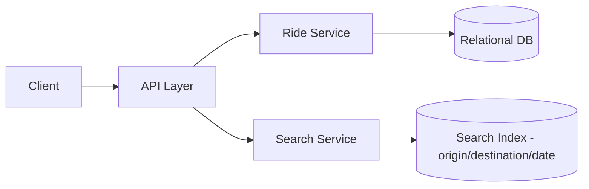

# Design a Simple Carpooling System

## Blogs and websites

## Medium

## Youtube

## Theory

### Problem Statement

Design a simple carpooling system where a driver can offer a ride with a fixed route/time and available seats, and riders can search for and book a seat on a matching ride.

### Functional Requirements

- Driver posts a ride (origin, destination, departure time, seats available, price/seat)
- Rider searches rides by origin/destination/date
- Rider books a seat (decrements available seats)
- Driver/rider can cancel a booking/ride

### Non-Functional Requirements

- **Scale**: Regional/city scale, thousands of rides posted per day
- **Consistency**: Seat count must not go negative under concurrent bookings
- **Latency**: Search < 300ms, book < 200ms

### API Design

```
POST /rides                  { origin, destination, departureAt, seats, pricePerSeat }
GET  /rides?origin=&destination=&date=
POST /rides/{rideId}/book     { seats }
POST /rides/{rideId}/cancel
```

### Data Model

```
rides:     id (PK), driver_id, origin, destination, departure_at, seats_available, price_per_seat
bookings:  id (PK), ride_id (FK), rider_id, seats_booked, status, created_at
```

### High-Level Architecture



### Key Design Points

- Decrement `seats_available` atomically (`UPDATE rides SET seats_available = seats_available - :n WHERE seats_available >= :n`) inside the booking transaction to prevent overbooking.
- Index rides by `(origin, destination, departure_date)` for fast search; a simple bounding-box/geohash on origin/destination helps match nearby-but-not-exact locations.
- Roll back the seat decrement if a booking is cancelled.

### Trade-offs

- Exact origin/destination matching is simple to build first; approximate/geo-radius matching (geohash or PostGIS) is a natural upgrade but adds complexity, so it's kept out of the basic version.
