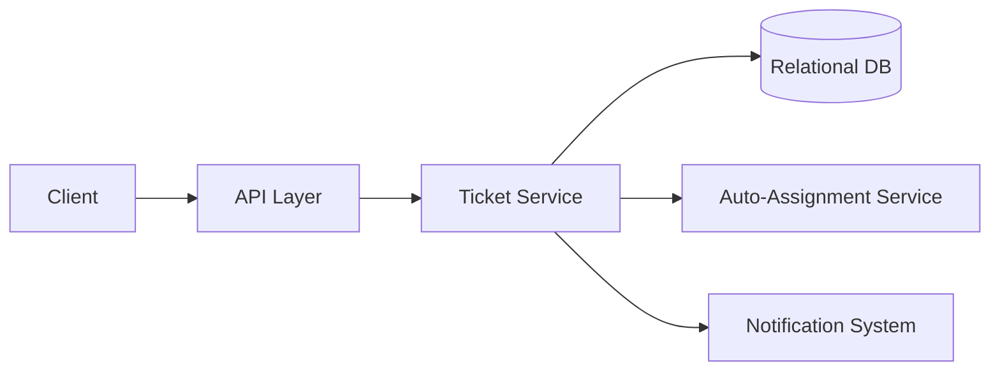

# Design a Basic Customer Support Ticketing System

## Blogs and websites

## Medium

## Youtube

## Theory

### Problem Statement

Design a basic customer support ticketing system where customers can raise support tickets, agents can respond and resolve them, and both parties can track ticket status.

### Functional Requirements

- Customer creates a ticket (subject, description, category, attachments)
- Agent replies to a ticket, changes status (open/pending/resolved/closed)
- Assign a ticket to an agent (manually or auto-assign by category/load)
- Customer/agent view ticket history and thread

### Non-Functional Requirements

- **Scale**: Small-to-medium support team, tens of thousands of tickets
- **Latency**: Create/reply < 300ms
- **Auditability**: Full conversation thread and status history retained

### API Design

```
POST /tickets                 { subject, description, category }
POST /tickets/{ticketId}/reply { text, attachments[] }
PATCH /tickets/{ticketId}      { status, assigneeId }
GET  /tickets?status=&assignee=
```

### Data Model

```
tickets:  id (PK), customer_id, subject, category, status, assignee_id, created_at
messages: id (PK), ticket_id (FK), sender_id, text, created_at
```

### High-Level Architecture



### Key Design Points

- Model the ticket thread as an append-only `messages` list tied to the ticket, so the full conversation is always reconstructable in order.
- Auto-assign new tickets to the least-loaded available agent for the ticket's category, falling back to a manual queue if no agent is available.
- Notify the customer asynchronously on agent reply, and notify the assigned agent on new customer messages.

### Trade-offs

- Simple round-robin/least-loaded auto-assignment is easy to reason about but doesn't account for agent skill/priority; acceptable for a basic system, with smarter routing left to a more advanced design.
