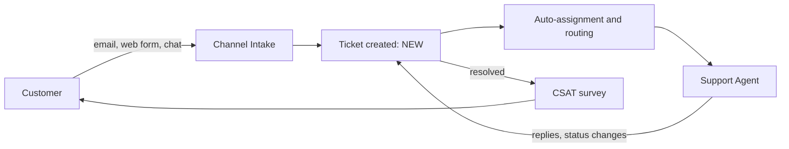
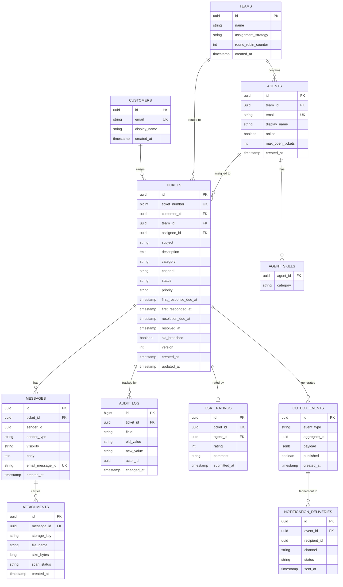
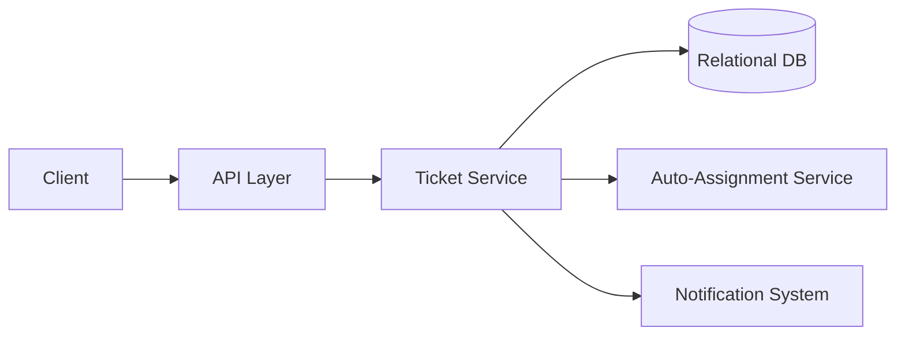
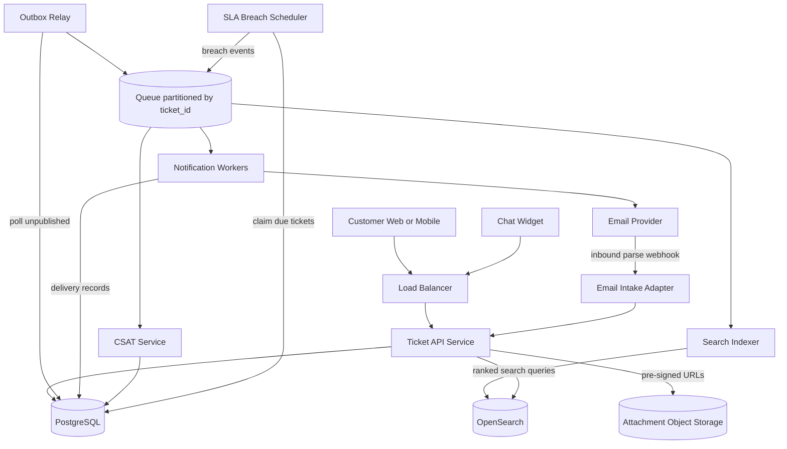
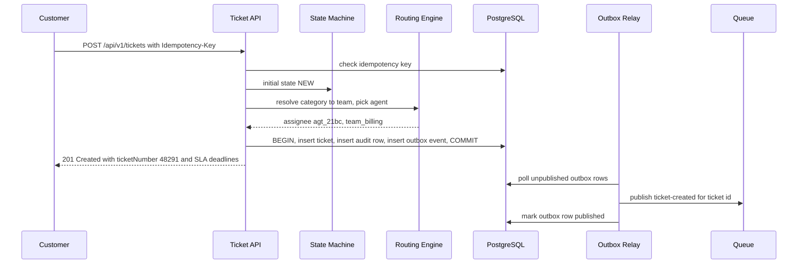
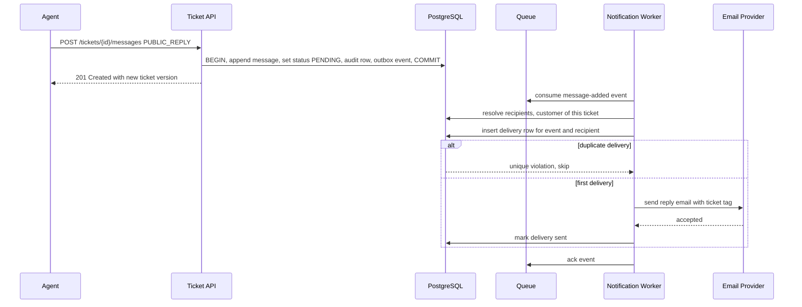
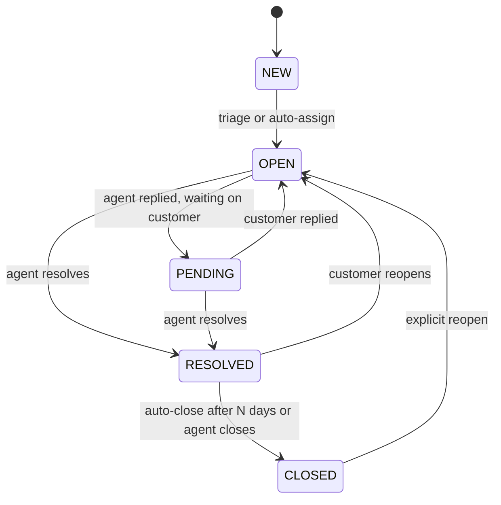

# Design a Basic Customer Support Ticketing System

## Blogs and websites

## Medium

## Youtube

## Theory

### Topics Covered

1. [Introduction and Problem Statement](#introduction-and-problem-statement)
2. [Functional Requirements](#functional-requirements)
3. [Non-Functional Requirements](#non-functional-requirements)
4. [Capacity Estimation](#capacity-estimation)
5. [Characteristics](#characteristics)
6. [Components](#components)
7. [Design Patterns](#design-patterns)
8. [Benefits](#benefits)
9. [Pros](#pros)
10. [Cons](#cons)
11. [Challenges](#challenges)
12. [Best Practices](#best-practices)
13. [When to Use and When Not to Use](#when-to-use-and-when-not-to-use)
14. [Use Cases](#use-cases)
15. [API Design and Contract](#api-design-and-contract)
16. [Data Modeling](#data-modeling)
17. [High-Level Design](#high-level-design)
18. [Deep Dive](#deep-dive)
19. [Java and Spring Boot Implementation Guide](#java-and-spring-boot-implementation-guide)
20. [Interview Questions and Answers](#interview-questions-and-answers)

---

### Introduction and Problem Statement

**Original problem statement (preserved)**

Design a basic customer support ticketing system where customers can raise support tickets, agents can respond and resolve them, and both parties can track ticket status.

**Elaborated introduction**

A customer support ticketing system converts every inbound customer request — an email, a web form submission, a chat message — into a durable, addressable work item called a **ticket**. Each ticket owns a conversation thread, a status in a fixed lifecycle, a priority, an assignee, and SLA deadlines. Agents work tickets from queues; the system tracks who said what, when, and guarantees nothing is silently lost or answered twice.

The core problem the system solves is **accountability at scale**: without tickets, support requests live in a shared inbox where requests are dropped, double-answered, or answered out of order, and there is no way to measure responsiveness. A ticket gives every request an ID, an owner, a deadline, and an audit trail, which turns support from an ad-hoc activity into a measurable workflow with SLAs, routing rules, and customer satisfaction (CSAT) feedback.



**Why ticketing systems matter**

- They guarantee every customer request has exactly one canonical record and one owner at any moment.
- They make responsiveness measurable: first-response time, resolution time, SLA breach rate.
- They preserve the full conversation so any agent can pick up context mid-thread.
- They decouple intake channels (email, form, chat) from the work model, so new channels do not change how agents work.

**Real-life use cases**

- **SaaS product support**: customers email `support@acme.com`; each email becomes a ticket routed by product area.
- **IT help desk**: employees file tickets for laptop, access, and VPN issues; SLAs differ by priority.
- **E-commerce post-purchase support**: order problems arrive via web form with the order ID attached; routing keys on category.
- **Banking dispute intake**: regulated conversations require the full audit thread and retention guarantees a ticketing model provides.

---

### Functional Requirements

**Original requirements (preserved)**

- Customer creates a ticket (subject, description, category, attachments)
- Agent replies to a ticket, changes status (open/pending/resolved/closed)
- Assign a ticket to an agent (manually or auto-assign by category/load)
- Customer/agent view ticket history and thread

**Extended requirements**

- Customers reply to a ticket; a customer reply on a `PENDING` ticket flips it back to `OPEN` and re-notifies the assignee.
- Tickets follow a fixed lifecycle state machine: `NEW → OPEN → PENDING → RESOLVED → CLOSED`, with reopen (`RESOLVED → OPEN`, `CLOSED → OPEN`) as an explicit action.
- Priorities (`LOW|MEDIUM|HIGH|URGENT`) drive SLA deadlines computed at creation time.
- Auto-assignment strategies: round-robin, skill-based (category → team → agent), and load-based (fewest open tickets); manual reassignment always allowed.
- Omnichannel intake: inbound email is parsed into tickets/replies; web form and chat widgets create tickets through the same API.
- Full-text search over subjects, descriptions, and message bodies for agents.
- Agents add internal notes visible only to agents, never to the customer.
- On resolution, the customer receives a CSAT survey (1–5 rating + optional comment); ratings are stored per ticket and aggregated per agent/team.
- SLA tracking: first-response and resolution deadlines per priority; breach triggers escalation (re-queue to a senior queue, notify a lead).
- Every change (status, assignee, priority) is audit-logged with actor and timestamp.

**Out of scope (deliberate cuts)**

- Real-time agent-customer live chat sessions (chat is intake only, not a synchronous session product).
- A configurable per-team workflow engine (fixed five-state lifecycle is sufficient for a basic system).
- Multi-brand / multi-tenant white-labeling.

---

### Non-Functional Requirements

**Original requirements (preserved)**

- **Scale**: Small-to-medium support team, tens of thousands of tickets
- **Latency**: Create/reply < 300ms
- **Auditability**: Full conversation thread and status history retained

**Extended requirements with numbers**

- **Scale**: 500k customers, 200 agents, 5,000 new tickets/day, 25,000 messages/day, 50M messages retained over 5 years.
- **Latency**: create ticket / post reply p99 < 300 ms; ticket detail read p99 < 200 ms; filtered list p99 < 300 ms; search p99 < 800 ms (eventual consistency tolerated).
- **Availability**: 99.9% for the write path (ticket intake must not drop customer requests); async side effects (notifications, search indexing) may lag but must not lose events.
- **Durability**: no acknowledged ticket or message is ever lost (RPO = 0 on the write path); attachments in object storage with 11-nines class durability.
- **Auditability**: 100% of status/assignee/priority changes recorded transactionally; audit retained 7 years for regulated customers.
- **Security/tenancy**: customers see only their own tickets; agents see tickets per team permissions; PII encrypted at rest; internal notes never exposed on customer-facing endpoints.
- **Consistency**: ticket detail and thread are strongly consistent (read-your-writes for the actor); search and CSAT aggregates are eventually consistent (seconds).

---

### Capacity Estimation

Step-by-step math from the NFR assumptions.

**1. Write throughput**

- Tickets: 5,000/day ≈ 0.06/s average; inbound replies/messages: 25,000/day ≈ 0.3/s average.
- Peak factor 10× for business-hours concentration and incident spikes: **~3 writes/s average, ~30 writes/s peak** — trivial for one PostgreSQL primary.
- Notifications fan-out: 25,000 messages/day × ~2 recipients ≈ 50,000 deliveries/day ≈ 0.6/s average — queue-based, so bursts are absorbed.

**2. Read throughput**

- Agent list views: 200 agents × 20 list loads/hour × 8 h ≈ 32,000/day.
- Ticket detail reads: assume 10 detail reads per message ≈ 250,000/day ≈ 3/s average, ~30/s peak.
- Search: 200 agents × 30 searches/day ≈ 6,000/day — well within one small OpenSearch node.

**3. Storage**

- Ticket row ≈ 1 KB; message row ≈ 2 KB (text); audit row ≈ 300 B; ~4 field changes per ticket.
- Per ticket: 1 KB + 5 messages × 2 KB + 4 × 0.3 KB ≈ **12 KB** → 5,000 tickets/day × 12 KB ≈ **60 MB/day ≈ 22 GB/year** of relational data. Over 5 years ≈ **110 GB** — comfortably single-primary PostgreSQL with room for indexes.
- Attachments: 20% of messages carry a 1 MB average attachment → 5,000/day × 1 MB ≈ **5 GB/day ≈ 1.8 TB/year** → object storage (S3), not the relational DB.

**4. Index and cache sizing**

- Hot working set (open + pending tickets): ~30 days × 5,000 = 150k tickets ≈ 2 GB with indexes — fits in buffer cache; list queries stay in memory.
- Agent presence/assignment counters (open-ticket counts per agent): 200 rows in Redis or a DB counter table — negligible.

**Conclusion**: this is a *data-modest, correctness-heavy* system. The design pressure is not throughput; it is transactional integrity (thread + audit + outbox), routing correctness, and SLA timeliness. That justifies a boring, strong-consistency core with async edges.

---

### Characteristics

Each characteristic is explained in detail.

- **Ticket-centric data model**
  Everything hangs off the ticket: messages, internal notes, attachments, audits, SLA state, CSAT rating. The ticket ID is the unit of authorization, routing, and reporting.

- **Append-only conversation thread**
  Messages are never edited or deleted (only redacted for compliance). The thread is the system of record for "what the customer was told," which is what makes handoffs between agents safe.

- **Fixed lifecycle state machine**
  Status changes are validated server-side against a transition table. Invalid transitions (`NEW → RESOLVED`) are rejected with the legal alternatives, so no client, bot, or import can corrupt the workflow.

- **SLA-driven urgency**
  Every ticket materializes `first_response_due_at` and `resolution_due_at` at creation from a priority matrix. Breach detection is then a cheap time-based scan, not a computation.

- **Asynchronous side effects**
  Notifications, search indexing, and CSAT survey dispatch happen off the write path via an outbox + queue. The customer-facing write latency never depends on an email provider.

- **Single-owner invariant**
  A ticket has at most one assignee at any time. This eliminates the "two agents answer differently" failure and makes accountability and workload counting exact.

- **Omnichannel intake, unified work model**
  Email, web form, and chat all normalize into the same ticket/message model. Agents never learn per-channel tools; channels are just ingestion adapters.

- **Agent-only internal notes**
  The message model distinguishes `PUBLIC_REPLY` from `INTERNAL_NOTE` with visibility enforced at the repository/DTO layer, so a template bug cannot leak internal discussion to customers.

- **Auditable by construction**
  Audit rows are written in the same transaction as the change they describe. The activity feed, SLA compliance reports, and dispute forensics all read the same table.

- **Feedback loop (CSAT)**
  Resolution triggers a survey; ratings roll up per agent and per team, closing the loop between workflow metrics (speed) and quality metrics (satisfaction).

- **Moderate scale, high correctness bar**
  Throughput is low (tens of writes/s peak) but every write is multi-entity (ticket + message + audit + outbox), so transactional discipline matters more than sharding.

---

### Components

Each component lists its purpose, responsibilities, how it works, relationships, and a real-world example.

**1. Channel intake adapters (email, web form, chat)**

- **Purpose**: convert every inbound customer contact into a ticket or a message on an existing ticket.
- **Responsibilities**: receive raw channel payloads, authenticate the sender, thread-match (is this a new ticket or a reply?), normalize into the internal model, strip/scan attachments.
- **How it works**: the email adapter polls or receives webhooks from the mail provider (SES/Sendgrid inbound parse), extracts the `In-Reply-To`/`References` headers and a ticket tag in the subject (`[Ticket #48291]`), and maps to `ticket_id`; the web form and chat widget call the public API directly. All adapters call one internal `IntakeService` so threading rules live in exactly one place.
- **Relationships**: upstream of the Ticket Service; writes through it, never to the DB directly; pushes attachments to object storage first and stores only references.
- **Real-world example**: Zendesk ingests `support@` email, web widgets, and social messages into one ticket model; Freshdesk does the same with its email-to-ticket gateway.

**2. Ticket Service (core API)**

- **Purpose**: the only writer of tickets, messages, notes, and audits.
- **Responsibilities**: CRUD, state-machine validation, SLA deadline computation, idempotent creates, optimistic concurrency, outbox writes, filtered list queries, thread reads.
- **How it works**: stateless Spring Boot nodes behind a load balancer; every mutating endpoint runs one transaction that updates the ticket/message, inserts audit rows, and inserts an outbox event, then commits. No side-effect call (email, search) happens inside this transaction.
- **Relationships**: owns PostgreSQL; publishes indirectly via the outbox relay; read-through to Redis only for hot aggregates (open counts).
- **Real-world example**: the monolithic core of early Zendesk/Jira Service Management — one well-structured service owning the ticket write path.

**3. Assignment / Routing Engine**

- **Purpose**: put each new ticket in front of the right agent quickly.
- **Responsibilities**: team routing by category, agent selection by strategy (round-robin, skill-based, load-based), reassignment on SLA breach escalation, fallback to a triage queue.
- **How it works**: on `ticket-created` (synchronously inside create, or via a consumer for heavier strategies) it resolves category → team, filters eligible agents (online, skill match, not at capacity cap), picks one per strategy, and writes `assignee_id` + audit row. Load-based picks `MIN(open_count)` among eligible agents inside the same transaction to avoid double-assigning under concurrency.
- **Relationships**: called by Ticket Service; reads agent roster, skills, and presence; writes through Ticket Service so audit/outbox stay uniform.
- **Real-world example**: Zendesk's skills-based routing and omnichannel routing; Salesforce Service Cloud's assignment rules.

**4. SLA Engine (scheduler)**

- **Purpose**: detect and escalate deadline breaches.
- **Responsibilities**: scan for tickets past `first_response_due_at` or `resolution_due_at`, mark breach, emit escalation events, recompute deadlines only on documented triggers (priority change).
- **How it works**: a `@Scheduled` job every 30 s claims a batch of due rows with `SELECT ... FOR UPDATE SKIP LOCKED`, marks `sla_breached = true`, writes audit + outbox events (`sla-breached`), and commits per batch. Multiple replicas share work via `SKIP LOCKED`; the time-based predicate makes reruns idempotent.
- **Relationships**: reads/writes PostgreSQL; emits events consumed by Notification workers (notify lead) and the Routing Engine (re-queue to senior queue).
- **Real-world example**: every ITSM tool (ServiceNow, Jira SM) runs a background SLA breach processor exactly like this.

**5. Notification Workers**

- **Purpose**: tell the right human that something changed, without slowing the write path.
- **Responsibilities**: consume ticket/message/SLA events, resolve recipients (assignee, customer, team lead), apply preferences and digest rules, dedupe, deliver via email/chat, record deliveries.
- **How it works**: consumers on the queue; per event, load recipients, insert a `(event_id, recipient_id)` delivery row — a unique violation means "already handled, skip" — then call the provider and mark sent with backoff + DLQ on provider errors.
- **Relationships**: downstream of the queue; writes delivery records to PostgreSQL; calls external providers (SES, Slack).
- **Real-world example**: Zendesk triggers/automations firing email notifications on ticket updates.

**6. Search Service (indexer + OpenSearch)**

- **Purpose**: give agents fast full-text search over subjects, descriptions, and message bodies.
- **Responsibilities**: consume ticket/message events, maintain denormalized documents, serve ranked queries with team/visibility filters.
- **How it works**: an indexer consumes the event topic (partitioned by `ticket_id` so per-ticket ordering holds), upserts documents keyed by `ticket_id`/`message_id` with a `version` guard to drop out-of-order updates; the query path enforces team authorization *before* hitting the index, and filters `INTERNAL_NOTE` content out of customer-facing search entirely.
- **Relationships**: downstream of the queue; serves the Ticket Service's search endpoint; PostgreSQL remains the source of truth (the index is rebuildable).
- **Real-world example**: Zendesk/Intercom search backed by Elasticsearch clusters fed from the primary database's change stream.

**7. CSAT Service**

- **Purpose**: measure customer satisfaction per resolved ticket and roll it up per agent/team.
- **Responsibilities**: dispatch the survey on `ticket-resolved`, accept and validate one rating per ticket, prevent ballot stuffing, maintain aggregates.
- **How it works**: a consumer on `ticket-resolved` sends a signed one-click survey link (HMAC token embedding `ticket_id`, expiring in 14 days); the submit endpoint is idempotent on `ticket_id` (first rating wins, updates allowed within 24 h), then a rollup job updates per-agent daily aggregates.
- **Relationships**: downstream of the queue; owns `csat_ratings` and aggregate tables; read by reporting endpoints.
- **Real-world example**: Zendesk's satisfaction ratings (good/bad + comment) with per-agent dashboards; Intercom's conversation ratings.

**8. Attachment Store**

- **Purpose**: store potentially large, potentially hostile customer files safely.
- **Responsibilities**: accept uploads via pre-signed URLs, virus-scan, enforce size/type limits, serve downloads with authorization.
- **How it works**: the API returns a pre-signed S3 PUT URL; the client uploads directly (no proxying through app nodes); an event from the bucket triggers an async scan, and only `clean` attachments become downloadable. Downloads are short-lived pre-signed GETs issued only after a ticket-visibility check.
- **Relationships**: referenced by messages; scanned by an async AV worker; served via CDN/S3.
- **Real-world example**: every modern help desk offloads binary payloads to object storage exactly this way.

**9. Outbox Relay + Queue**

- **Purpose**: make event publication atomic with the business write and absorb downstream bursts.
- **Responsibilities**: durably carry `ticket-created`, `message-added`, `status-changed`, `sla-breached`, `ticket-resolved` events to all consumers.
- **How it works**: writers insert an outbox row in the same transaction as the change; a relay polls unpublished rows (`FOR UPDATE SKIP LOCKED`), publishes to the queue (partitioned by `ticket_id`), and marks them published. Consumers are idempotent by event ID.
- **Relationships**: bridge between PostgreSQL and all async consumers (indexer, notification, CSAT).
- **Real-world example**: the transactional outbox pattern as implemented by Debezium/Debezium-style CDC relays in countless event-driven services.

**10. Audit Log**

- **Purpose**: the authoritative, queryable history of every field-level change.
- **Responsibilities**: record `(ticket_id, field, old_value, new_value, actor_id, changed_at)` for status, assignee, priority, and SLA-relevant edits; power the activity feed and compliance exports.
- **How it works**: the service layer writes audit rows inside the mutation transaction; reads hit a `(ticket_id, changed_at)` index; old partitions are detached to cold storage after the retention window.
- **Relationships**: written by Ticket/Routing/SLA services; read by the activity-feed endpoint and reporting.
- **Real-world example**: Jira's issue history tab and ServiceNow's audit trail.

---

### Design Patterns

Each pattern lists what it is, the problem it solves here, how it is applied, when to use it, when not to, advantages, and disadvantages.

**1. Transactional Outbox**

- **What**: write domain change + event row in one DB transaction; a relay publishes the event asynchronously.
- **Problem**: "save ticket, then publish to the queue" is two writes to two systems — a crash between them either loses the notification (publish skipped) or announces a phantom change (publish before commit).
- **How applied**: every mutation inserts into `outbox_events` in the same transaction; the relay polls and publishes to topics partitioned by `ticket_id`.
- **When to use**: whenever a write must reliably trigger async work and you cannot use distributed transactions (i.e., almost always with a queue).
- **When not to use**: when the side effect must be synchronous (e.g., a fraud check that must block the response) or when the system genuinely has no async consumers.
- **Advantages**: atomicity with the business write; at-least-once delivery; consumers survive broker downtime via backfill.
- **Disadvantages**: at-least-once means consumers must dedupe; adds relay lag (typically < 1 s); one more table to maintain.

**2. State Machine (ticket lifecycle)**

- **What**: an explicit map from each status to its legal transitions, validated on every status write.
- **Problem**: without it, any code path (API, importer, admin tool) can set nonsense states (`NEW → CLOSED` skipping triage), breaking SLA math, metrics, and customer trust.
- **How applied**: a `TicketStateMachine` bean maps `NEW → {OPEN}`, `OPEN → {PENDING, RESOLVED}`, `PENDING → {OPEN, RESOLVED}`, `RESOLVED → {OPEN, CLOSED}`, `CLOSED → {OPEN}`; violations return `422` with allowed transitions.
- **When to use**: any entity with a lifecycle whose transitions carry business meaning (SLA clocks start/stop on specific transitions).
- **When not to use**: for truly free-form tagging fields, or when the business genuinely needs per-team configurable flows (then use a data-driven workflow table, at real complexity cost).
- **Advantages**: one authoritative place for lifecycle rules; trivially testable; illegal states become unrepresentable.
- **Disadvantages**: adding a state touches code and migrations; a hardcoded machine cannot express per-team variations.

**3. Strategy (assignment/routing)**

- **What**: interchangeable algorithms behind one interface (`AssignmentStrategy.pick(ticket, candidates)`).
- **Problem**: round-robin, skill-based, and load-based assignment are different algorithms that the business wants to switch per team without if/else sprawl.
- **How applied**: `RoundRobinAssignment`, `SkillBasedAssignment`, `LoadBasedAssignment` beans; a per-team config names the strategy; the router injects a `Map<String, AssignmentStrategy>` and selects by name.
- **When to use**: three or more interchangeable algorithms selected at runtime by configuration.
- **When not to use**: a single stable algorithm — the interface is then ceremony.
- **Advantages**: new strategies are additive (open/closed); per-team A/B of routing quality becomes config-only.
- **Disadvantages**: indirection; strategy bugs are per-team config bugs, which are harder to spot in code review.

**4. Priority Queue (work ordering)**

- **What**: agent/team queues order tickets by urgency, not arrival.
- **Problem**: FIFO ordering lets a low-priority ticket ahead of an urgent one breach the urgent one's SLA even when agents have spare capacity.
- **How applied**: the queue view sorts by a computed rank — `ORDER BY sla_breached DESC, resolution_due_at ASC` (deadline is already priority-derived), over a partial index on open tickets; effectively the database performs the priority queue. (An in-memory heap is unnecessary at this scale and would be a second source of truth.)
- **When to use**: whenever work items have heterogeneous deadlines/urgency and consumers pull "most urgent next."
- **When not to use**: when ordering must be strictly fair FIFO (e.g., some regulatory first-come-first-served queues).
- **Advantages**: urgent work is always served first; breach rate drops without adding agents.
- **Disadvantages**: low-priority tickets can starve; needs aging/escalation rules (e.g., auto-bump priority after N days) to bound starvation.

**5. Idempotent Receiver / Idempotency-Key**

- **What**: mutating endpoints accept a client-supplied key; replays return the original result without re-executing.
- **Problem**: mobile clients retry on flaky networks; email gateways redeliver; without idempotency every retry is a duplicate ticket or a duplicate reply.
- **How applied**: `Idempotency-Key` header stored per user with the response for 24 h; email threading keys (`Message-ID`) get a unique constraint so gateway redelivery is a no-op.
- **When to use**: any non-idempotent-by-nature endpoint (POST create/reply) reachable by unreliable clients.
- **When not to use**: naturally idempotent operations (PUT by full replacement, GETs).
- **Advantages**: retries become safe; duplicate-rate drops to ~0 without client cooperation beyond one header.
- **Disadvantages**: storage for keys/responses; edge cases around key reuse with a *different* payload (answer: `422`).

**6. CQRS-lite (read models)**

- **What**: writes go to the normalized relational model; heavy reads (search, CSAT dashboards) hit derived read models.
- **Problem**: full-text ranking and per-agent aggregates would force expensive scans/joins on the write model, putting read load on the primary that serves writes.
- **How applied**: OpenSearch documents for search; nightly/incremental rollups for CSAT; both fed from the event topic and rebuildable from PostgreSQL.
- **When to use**: when a read workload's shape (ranking, aggregation) is hostile to the write model, and staleness of seconds is acceptable.
- **When not to use**: when all reads fit the primary comfortably — added moving parts for no latency win (this is why ticket detail/thread reads stay on the relational model here).
- **Advantages**: each read model is optimized for its query; write path is insulated from read spikes.
- **Disadvantages**: eventual consistency to explain to users; every read model needs a rebuild/reconcile story.

---

### Benefits

- **Nothing gets dropped**: every inbound request becomes a durable ticket with an owner and a deadline, so the "lost in the inbox" failure class disappears.
- **Measurable support**: first-response time, resolution time, breach rate, and CSAT are all computable from the data model — support becomes manageable by numbers.
- **Safe handoffs**: the append-only thread plus audit log means any agent can pick up any ticket with full context in seconds.
- **Faster ramp for new agents**: queues, canned routing, and searchable history let a new agent be productive without tribal knowledge.
- **Customer trust**: customers get a ticket ID, proactive notifications, and a satisfaction channel — the experience feels tracked rather than shouted into a void.
- **Compliance-ready**: the transactional audit trail and retention model satisfy dispute-resolution and regulatory evidence needs without a separate system.

---

### Pros

- **Simple, strong core**: one relational primary handles the entire write workload at this scale — no sharding, no distributed consensus, easy local development.
- **Predictable write latency**: side effects are async, so p99 on create/reply is bounded by one transaction, not by email providers or search clusters.
- **Fixed lifecycle = fewer bugs**: five states with explicit transitions are fully testable; there is no workflow-config surface for customers to break.
- **Routing is pluggable**: the strategy interface lets per-team routing improve (round-robin → skill-based) without touching the core.
- **Search and reporting scale independently**: read models consume events and scale on their own resources and timelines.
- **Idempotency everywhere it matters**: client retries and email-gateway redeliveries are absorbed by keys and unique constraints.
- **Cheap to operate**: at ~60 MB/day of relational growth, backups, replicas, and restores are all fast and boring.

---

### Cons

- **Fixed lifecycle limits flexibility**: a team wanting `WAITING_ON_VENDOR` needs a code change and a migration, not a settings toggle.
- **Single-writer bottleneck (by choice)**: all mutations funnel through one primary; at 100× the scale this becomes the ceiling to re-architect around.
- **Eventual consistency surfaces**: search may lag a few seconds; agents occasionally "just replied but search doesn't show it."
- **Email threading is never perfect**: subject-tag stripping, forwarded threads, and vacation auto-replies all create edge cases that need ongoing heuristics.
- **SLA scheduler is coarse**: breach detection granularity is the poll interval (30 s); finer granularity buys nothing the business can act on but still must be explained.
- **Starvation risk**: strict priority ordering can park low-priority tickets indefinitely unless aging rules bump them.
- **Operational surface grows with channels**: each intake adapter (email, chat, social) is its own integration to monitor and keep credentialed.

---

### Challenges

- **Technical**: email-to-ticket threading across providers with munged subjects and stripped headers; attachment malware scanning without delaying clean uploads; enforcing the internal-note/customer-reply visibility boundary in every read path including search.
- **Scalability**: the notification fan-out on a hot ticket (hundreds of watchers-equivalent recipients per reply); audit table growing ~4× the ticket table; keeping list queries fast as closed-ticket history accumulates (partial indexes on open statuses, partition by month).
- **Performance**: `MIN(open_count)` load-based assignment can hot-spot under bursts — mitigate with `SKIP LOCKED` claiming or advisory locks; search ranking quality (BM25 tuning) is an ongoing performance-of-relevance problem, not just latency.
- **Reliability**: email provider webhooks are at-least-once and unordered; the queue can redeliver after consumer crashes — every consumer must be idempotent by event ID; SLA scheduler downtime must self-heal (time-based predicates make the next run catch up).
- **Maintainability**: threading heuristics, routing rules, and SLA matrices accrete business exceptions; keep them data-driven (tables, config) rather than branching code, and version the SLA matrix so deadline changes don't retroactively rewrite history.
- **Operational**: on-call needs dashboards for queue depth, relay lag, breach-scan lag, provider error rates, and dedupe-hit rates; a stuck outbox relay silently delays all notifications, so lag alerting matters more than error alerting.
- **Security**: attachments are an attack vector (scan, quarantine, content-type sniffing); ticket IDs must be unguessable (UUIDs, not sequences) for customer-facing URLs; PII in threads requires encryption at rest, field-level redaction tooling for GDPR erasure, and strict team-scoped authorization on every query.

---

### Best Practices

- **Materialize SLA deadlines at write time.** Computing "breached?" on the fly means every scan recomputes calendars and priorities; a stored `resolution_due_at` timestamp turns breach detection into a one-index range scan and keeps historical deadlines stable even when the SLA matrix changes later.
- **Never call a provider inside the write transaction.** Email and search calls have unbounded latency and their own failure modes; the outbox keeps customer-facing p99 attached only to one local commit.
- **Enforce the state machine in the service layer, not the controller.** Admin tools, importers, and future APIs must all hit the same validation — putting it in the controller invites bypass; putting it in the DB alone gives terrible error messages.
- **Make every consumer idempotent by event ID.** Queues deliver at-least-once; an idempotency table turns redelivery from "duplicate emails to customers" into a no-op. This is the difference between a queue you trust and one you babysit.
- **Use `SKIP LOCKED` for multi-replica batch jobs.** The SLA scanner and outbox relay run on several nodes; `FOR UPDATE SKIP LOCKED` gives natural work-sharing with no leader election and no double-processing.
- **Keep ticket detail reads on the primary.** Read-your-writes for the actor avoids the "I replied and my reply vanished" support ticket about your support tool; replicas serve only lag-tolerant list/reporting reads.
- **Version the SLA matrix and record which version set each deadline.** Auditors and customers will ask "why was this due at 9:00?" — the answer must be reproducible from data, not from whatever the code happens to say today.
- **Aging rules for low-priority tickets.** Priority queues starve; a nightly job that bumps `LOW` tickets idle > N days guarantees every ticket is eventually served — a bound on starvation is a feature, not an admission of failure.
- **One intake normalizer, many adapters.** Thread-matching and dedupe rules must live in a single `IntakeService`; if each channel implements its own, the rules drift and duplicates appear only on the least-tested channel.

---

### When to Use and When Not to Use

**When to use this design**

- A small-to-medium support org (tens to low hundreds of agents) with email/form/chat intake and SLA obligations.
- Teams that need auditability and accountability more than they need workflow customization.
- Products where support quality is measured (CSAT, first-response time) and must be reportable from day one.
- Regulated contexts (fintech, health) where the conversation record is evidence.

**When not to use this design**

- **Real-time conversational support as the product** (live chat with presence, typing indicators, sub-second delivery): that is a chat/messaging system with a different core; ticketing can sit beside it, not be it.
- **Massive multi-brand enterprise scale** (thousands of agents, per-brand workflows): you need per-team configurable workflow engines and sharded tenancy — buy or build ITSM-class tooling instead.
- **Bug tracking for engineers**: use an issue tracker; support tickets optimize for customer communication and SLAs, not for code-linked workflows and releases.
- **Fully automated resolution pipelines** (no humans, straight-through processing): the ticket abstraction adds overhead when there is no agent to route to.

---

### Use Cases

**1. Customer files a ticket via web form**

Customer authenticates, posts subject/description/category plus a pre-signed attachment upload; the system creates the ticket in `NEW`, computes SLA deadlines from priority, auto-assigns via the team's strategy, writes audit + outbox rows, and returns `201` with the ticket number. Notification and indexing happen asynchronously within ~1 s.

**2. Customer emails `support@acme.com`**

The provider's inbound-parse webhook delivers the MIME message; the email adapter extracts threading headers, finds no existing ticket, normalizes to the internal model, strips quoted history, and calls the same intake path as the web form. The customer receives an acknowledgment email containing the ticket tag for future threading.

**3. Agent replies; customer is notified**

The agent posts a `PUBLIC_REPLY`; the ticket moves `PENDING` (waiting on customer) automatically per team policy, the reply is appended, and the customer gets an email containing the reply text and a reply-to address that threads back into the ticket.

**4. Customer replies; ticket reopens for work**

A customer reply on a `PENDING` ticket flips it to `OPEN`, clears `first_response` bookkeeping only if already satisfied, and notifies the current assignee. The assignee's queue re-ranks the ticket by its resolution deadline.

**5. SLA breach escalates to a lead**

The 30-second scanner finds a ticket past `resolution_due_at`, marks the breach, emits `sla-breached`; the notification worker pings the team lead in Slack and the routing engine re-queues the ticket to the senior queue with priority bumped.

**6. Agent searches for similar past tickets**

The agent searches "refund gift card 500"; the search service returns ranked tickets (respecting team visibility and excluding internal notes from customer-visible views), letting the agent reuse a proven resolution and link it in an internal note.

**7. Resolution triggers CSAT**

On `RESOLVED`, the CSAT service sends a one-click 1–5 survey; the customer's rating is stored idempotently and rolled into the agent's weekly dashboard; a low rating auto-opens a follow-up ticket for the team lead.

**8. Triage of an unassignable ticket**

At 3 a.m. no agent with the required skill is online; routing falls back to the team triage queue, the ticket keeps its deadlines, and the morning shift's queue view surfaces it first because its deadline is nearest.

---

### API Design and Contract

REST, JSON, versioned under `/api/v1`. All timestamps are ISO-8601 UTC. Customer endpoints require a customer JWT; agent endpoints require an agent JWT with team claims; the caller's identity comes from the token, never from the body.

**Original API sketch (preserved and extended)**

```
POST /tickets                 { subject, description, category }
POST /tickets/{ticketId}/reply { text, attachments[] }
PATCH /tickets/{ticketId}      { status, assigneeId }
GET  /tickets?status=&assignee=
```

**Full endpoint map**

```
POST   /api/v1/tickets                              create a ticket (customer)
GET    /api/v1/tickets/{ticketId}                   ticket detail with thread (owner or authorized agent)
POST   /api/v1/tickets/{ticketId}/messages          reply (customer) or reply/note (agent)
PATCH  /api/v1/tickets/{ticketId}                   status, priority, assigneeId (agent)
GET    /api/v1/tickets?status=&assigneeId=&teamId=&priority=&q-free-filters   filtered list (agent)
GET    /api/v1/customers/me/tickets                 caller's tickets (customer)
GET    /api/v1/tickets/search?q=&status=&teamId=    full-text search (agent)
GET    /api/v1/tickets/{ticketId}/activity          audit history (agent)
POST   /api/v1/attachments                          request a pre-signed upload URL
POST   /api/v1/csat/{token}                         submit CSAT rating (signed one-click link)
GET    /api/v1/reports/csat?teamId=&from=&to=       CSAT aggregates (team lead)
POST   /api/v1/webhooks/email-inbound               provider webhook for inbound email (signature-verified)
```

**Create a ticket**

`POST /api/v1/tickets` — headers: `Authorization: Bearer <JWT>`, `Idempotency-Key: 9f2c1e...`

```json
{
  "subject": "Refund not received for order #A-99120",
  "description": "I returned the item two weeks ago (tracking 1Z999...) and still have no refund.",
  "category": "BILLING",
  "priority": "HIGH",
  "attachmentIds": ["att_01J8X..."],
  "channel": "WEB_FORM"
}
```

Validation: `subject` required, 1–200 chars; `description` required, ≤ 32 KB; `category` one of the configured categories; `priority` defaults to `MEDIUM` (customers may not self-set `URGENT`); `attachmentIds` must reference completed, virus-scan-clean uploads owned by the caller.

Response `201 Created` (`Location: /api/v1/tickets/tkt_01J91...`):

```json
{
  "id": "tkt_01J91QZ8K0M2T4N6V8XA",
  "ticketNumber": 48291,
  "subject": "Refund not received for order #A-99120",
  "category": "BILLING",
  "status": "NEW",
  "priority": "HIGH",
  "channel": "WEB_FORM",
  "customerId": "cus_88fa...",
  "assigneeId": "agt_21bc...",
  "teamId": "team_billing",
  "firstResponseDueAt": "2026-06-11T09:00:00Z",
  "resolutionDueAt": "2026-06-13T17:00:00Z",
  "slaBreached": false,
  "version": 1,
  "createdAt": "2026-06-10T14:30:00Z"
}
```

**Reply / add a message**

`POST /api/v1/tickets/{ticketId}/messages`

```json
{
  "body": "Your refund was issued today; it may take 3-5 business days to appear.",
  "visibility": "PUBLIC_REPLY",
  "attachmentIds": []
}
```

Agents may send `PUBLIC_REPLY` or `INTERNAL_NOTE`; customers may only send `PUBLIC_REPLY` (sending `INTERNAL_NOTE` returns `403`). A customer reply on a `PENDING` ticket transitions it to `OPEN` automatically. Replying on a `CLOSED` ticket returns `422` with a hint to reopen explicitly. Response `201` with the message; the ticket's `version` bumps.

**Update status / assignee / priority**

`PATCH /api/v1/tickets/{ticketId}` — partial update with optimistic concurrency.

Request headers: `If-Match: "3"`. Body: `{ "status": "RESOLVED", "assigneeId": "agt_21bc...", "priority": "HIGH" }` (any subset). Illegal transitions return `422` with the legal targets:

```json
{
  "type": "https://api.acme.com/problems/invalid-transition",
  "title": "Invalid status transition",
  "status": 422,
  "detail": "NEW -> RESOLVED is not allowed",
  "allowedTransitions": ["OPEN"]
}
```

A stale `If-Match` returns `409 Conflict`; the client must re-fetch and merge. Every accepted change writes audit rows in the same transaction.

**Filtered list with pagination and sorting**

`GET /api/v1/tickets?status=OPEN&teamId=team_billing&priority=HIGH&sort=resolutionDueAt,asc&cursor=eyJj...&limit=50`

Cursor-based (keyset) pagination so concurrent creates do not duplicate or skip rows; the response carries `nextCursor` when more pages exist. Sorting is restricted to indexed columns (`createdAt`, `updatedAt`, `resolutionDueAt`, `priority`) to keep lists inside the 300 ms budget. The queue view is this endpoint with `sort=resolutionDueAt,asc` over a partial index on open statuses.

**Full-text search**

`GET /api/v1/tickets/search?q=refund+gift+card&status=RESOLVED&teamId=team_billing`

Ranked by relevance (BM25), then re-authorized against the caller's team scope; documents include highlight fragments. The contract documents that results may lag a few seconds behind writes; internal-note content is excluded unless the caller is an agent of the owning team.

**Submit CSAT**

`POST /api/v1/csat/{token}` — the token is an HMAC-signed payload embedding `ticketId` and expiry, so the endpoint is unauthenticated but unforgeable:

```json
{ "rating": 5, "comment": "Refund explained clearly, very fast." }
```

First submission returns `201`; a corrected rating within 24 h returns `200` (update); an expired token returns `410 Gone`; a rating for a ticket that is not `RESOLVED`/`CLOSED` returns `409`.

**Error responses and status codes**

Consistent RFC 7807 problem-details shape (`type`, `title`, `status`, `detail`, plus extension fields). Codes: `400` validation failure (field errors listed), `401` unauthenticated, `403` wrong tenant/team or customer writing an internal note, `404` unknown ticket, `409` version conflict or CSAT-on-open-ticket, `410` expired CSAT token, `413` attachment too large, `422` invalid state transition or idempotency-key reuse with a different payload, `429` rate limited (with `Retry-After`).

**Cross-cutting concerns**

- **Idempotency**: `POST /tickets` and `POST /messages` honor `Idempotency-Key` (stored per user for 24 h; replay returns the original `201` body). Email intake dedupes on the provider `Message-ID` unique constraint.
- **Optimistic concurrency**: `PATCH` requires `If-Match` carrying the ticket `version`; concurrent edits get `409` and merge client-side.
- **Rate limiting**: per-principal token bucket — customers 30 writes/min, agents 120 writes/min, reads 600/min; `429` includes `Retry-After` and remaining-quota headers (`RateLimit-Remaining`).
- **Versioning**: URI version `v1`; additive fields ship freely; breaking changes ship as `v2` with `v1` supported for one release cycle.
- **AuthN/AuthZ**: JWT bearer tokens; customers access only `customerId = self` rows, agents only their teams' rows (enforced in repository queries, not just controllers); the email webhook verifies the provider's HMAC signature and allows no other auth.
- **Headers**: `X-Request-Id` accepted and echoed for trace correlation; responses include `ETag` carrying the entity version for `If-Match` round-trips.

---

### Data Modeling

**Original data model sketch (preserved and extended)**

```
tickets:  id (PK), customer_id, subject, category, status, assignee_id, created_at
messages: id (PK), ticket_id (FK), sender_id, text, created_at
```

**Entities and relationships**

Customers raise tickets; agents (grouped into teams with skills) are assigned to tickets; a ticket has an ordered thread of messages (public replies and internal notes), attachments, field-level audit entries, SLA deadline fields, and at most one CSAT rating. Teams own categories and an assignment-strategy config; events fan out through the outbox to notification deliveries.



**Key modeling decisions**

- `messages.email_message_id` has a unique constraint (nulls allowed) so email-gateway redelivery is a database-enforced no-op — threading dedupe cannot be bypassed by a code bug.
- `messages.visibility` (`PUBLIC_REPLY|INTERNAL_NOTE`) plus `sender_type` (`CUSTOMER|AGENT|SYSTEM`) makes the security boundary a data property enforced in queries and DTO mapping.
- SLA fields are materialized timestamps, not computed expressions: `first_response_due_at`, `first_responded_at` (set once), `resolution_due_at`, `resolved_at`, `sla_breached` — breach scanning is a range scan over a partial index on open, unbreached tickets.
- `tickets.version` is the optimistic-lock token echoed as the HTTP `ETag`.
- `ticket_number` is a human-friendly per-system sequence (`#48291`) used in email subject tags; the UUID `id` is the API identifier so customer-facing URLs are unguessable.
- `audit_log` is append-only and monthly-partitioned; it is the source for the activity feed and "time in status" analytics.
- `csat_ratings.ticket_id` is unique — one rating per ticket by construction, not by application convention.
- Index plan: `(team_id, status, resolution_due_at)` for queue views; `(assignee_id, status)` for agent workloads; partial index `WHERE status IN ('NEW','OPEN','PENDING') AND NOT sla_breached` on `(resolution_due_at)` for the SLA scan; `(ticket_id, created_at)` on messages for thread reads; `(customer_id, created_at)` for the customer's own list.

---

### High-Level Design

**Original simplified architecture (preserved)**



This sketch captures the essential write path: one service, one relational store, auto-assignment, and a notification side effect. The full design below makes side effects asynchronous (outbox + queue), adds the search read path, the SLA scheduler, channel intake adapters, and the CSAT loop.

**Full architecture**



The write path touches only the API and PostgreSQL (plus object storage for binaries), which is what keeps create/reply p99 under 300 ms regardless of notification, search, or CSAT load. Everything right of the queue consumes independently, scales with queue depth, and can be rebuilt from PostgreSQL.

**Write flow — customer creates a ticket**



Idempotency check, routing decision, ticket insert, audit row, and outbox event all live in one transaction: there is no interleaving where the ticket exists but its assignment, audit trail, or creation event is missing. If the client retries with the same `Idempotency-Key`, the stored `201` body is replayed and no second ticket exists.

**Read/notify flow — agent replies, customer is notified**



The agent's write returns after one local commit — email latency and provider outages never touch the reply path. The `(event_id, recipient_id)` unique constraint bounds the duplicate window to one provider call per crashed worker, and the deliveries table makes every send observable and re-drivable.

---

### Deep Dive

#### 1. Ticket lifecycle state machine

The original design's key point, preserved and hardened: model the thread as an append-only list and the status as a **fixed state machine validated server-side** so no client can create invalid states.



Semantics that carry business weight:

- **SLA clocks ride the transitions**: `first_responded_at` is set on the first `PUBLIC_REPLY` by an agent (NEW/OPEN → any); `resolved_at` is set entering `RESOLVED`; reopening clears `resolved_at` and recomputes `resolution_due_at` from the current priority.
- **Auto-close**: a nightly job closes `RESOLVED` tickets idle for 7 days — customers are told this in the resolution email, which keeps `RESOLVED` from becoming a second, messier `CLOSED`.
- **Reopen is explicit**: commenting on a `CLOSED` ticket is rejected (`422`); reopen is a deliberate `PATCH` that re-arms SLA deadlines. This prevents silent resurrection of aged tickets via stray emails... except that email replies to a closed thread create a *new linked ticket* referencing the old one, preserving the thread without corrupting lifecycle metrics.
- **Every transition writes an audit row** in the same transaction, so "time in each status" analytics are derivable by diffing consecutive audit timestamps.

#### 2. SLA tracking and breach escalation

- **Deadline computation at write time**: a versioned priority matrix maps `(priority, calendar) → (firstResponseHours, resolutionHours)`, e.g. `URGENT: 1h/8h`, `HIGH: 4h/24h`, `MEDIUM: 8h/48h`, `LOW: 24h/120h`. Business-hours calendars (per team) convert durations to concrete instants once, at creation; the stored timestamps never change unless priority changes (then recompute and audit).
- **Breach detection**: a `@Scheduled(fixedDelay = 30_000)` job runs `SELECT ... WHERE resolution_due_at <= now() AND status IN ('NEW','OPEN','PENDING') AND NOT sla_breached ORDER BY resolution_due_at LIMIT 200 FOR UPDATE SKIP LOCKED`, marks each row breached, writes an audit row and an `sla-breached` outbox event, and commits per batch. First-response breaches use the same scan on `first_response_due_at WHERE first_responded_at IS NULL`.
- **Why `SKIP LOCKED`**: several scheduler replicas run for availability; instead of leader election, each claims different rows — throughput scales with replicas and a crashed replica's batch is retried by the next tick.
- **Why time-based predicates are self-healing**: if the scheduler is down for an hour, the next run simply finds everything overdue; there is no missed-event state to reconstruct.
- **Escalation**: the `sla-breached` event fans out to (a) the notification workers — Slack/email the team lead, and (b) the routing engine — move the ticket to the senior queue and bump priority one level. Both are policies in config, not code branches.
- **Metrics**: breach scan lag (`now - min(resolution_due_at)` of unprocessed rows), breaches/hour by team, and false-breach rate (should be zero) are dashboard staples.

#### 3. Assignment and routing strategies

All strategies implement `AssignmentStrategy.pick(ticket, candidates)`; per-team config selects one.

- **Round-robin**: the team's `round_robin_counter` increments inside the create transaction (`UPDATE teams SET round_robin_counter = round_robin_counter + 1 ... RETURNING`), and the agent list is indexed modulo counter. Simple and fair by count, blind to ticket size and agent skill. Best default for homogeneous teams.
- **Skill-based**: category → required skill; candidates filtered by `agent_skills` before any other ordering. Solves "billing questions reach billing agents" but can overload the one agent holding a rare skill — always pair with a capacity cap and a triage-queue fallback.
- **Load-based**: pick `MIN(open_count)` among eligible agents, where `open_count` counts `NEW/OPEN/PENDING` tickets. Fairest by *work*, but under a burst of simultaneous creates the same agent can win repeatedly (read-modify-write race); fix by claiming inside the update (`UPDATE agents ... WHERE id = (SELECT ... FOR UPDATE SKIP LOCKED)`) or by accepting the race at this scale (200 agents, ~3 creates/s peak — collisions are rare and self-correcting).
- **Hybrid used in practice**: skill filter → capacity cap (`max_open_tickets`) → load-based pick → round-robin tie-break. This is what the sample implementation below does.
- **Fallback invariant**: if no candidate exists (offline, capped, no skill), the ticket goes to the team triage queue unassigned — never dropped, never force-assigned to an absent agent. The morning queue view surfaces it by nearest deadline.

#### 4. Priority queues and starvation control

- The agent/team queue is the list endpoint sorted `sla_breached DESC, resolution_due_at ASC` over the partial open-ticket index: the most endangered ticket is always next. Because deadlines already encode priority (URGENT deadlines are sooner), a single sort key expresses both breach state and priority — no separate priority field in the sort.
- **Starvation control**: a nightly aging job bumps `LOW` tickets idle > 5 days to `MEDIUM` (and recomputes deadlines), guaranteeing eventual service; a per-team WIP cap prevents agents from cherry-picking while the queue view is ordered for them.
- **Why not an in-memory heap**: at 150k open tickets the database index *is* the priority queue — an in-memory structure would be a second source of truth that dies on restart and diverges under concurrent updates.

#### 5. Agent workload balancing

- **Capacity caps**: `agents.max_open_tickets` (default 20) makes overload impossible by construction; the assignment query filters `open_count < max_open_tickets`.
- **Presence**: agents flip `online` on login/heartbeat; only online agents receive new auto-assignments. Offline agents keep their existing load — their deadlines keep ticking, which is the honest behavior (the alternative, mass reassignment on logout, churns context).
- **Imbalance detection**: a report compares `open_count` percentiles per team hourly; sustained p90/p50 > 2 triggers a lead alert — usually a skill bottleneck or an agent drowning in hard tickets, both staffing problems the data should surface rather than hide.
- **Rebalancing**: explicit, agent-initiated or lead-initiated `PATCH` reassignment with audit; automatic silent rebalancing is deliberately not built — it reassigns context away from humans mid-conversation.

#### 6. Omnichannel intake

- **Email → ticket**: the provider (SES/Sendgrid inbound parse) POSTs the parsed MIME to `/api/v1/webhooks/email-inbound`, verified by HMAC signature. Threading resolution order: (1) `In-Reply-To`/`References` headers matching a known `email_message_id`; (2) subject tag `[Ticket #48291]`; (3) same-sender-same-subject heuristic within 7 days; otherwise a new ticket. Body processing strips quoted history (`On ... wrote:` blocks) and signatures; auto-responder headers (`Auto-Submitted`, `Precedence: bulk`) are detected to avoid ticket loops from vacation replies — a loop guard also caps messages per thread per hour.
- **Web form**: authenticated `POST /tickets` with pre-validated category and optional order context; richest structured intake, the least heuristics.
- **Chat widget**: unauthenticated or lightly authenticated visitors get a short-lived session token; the "chat" is asynchronous messaging over the same `messages` model (no websockets needed at this scale — 5 s polling or SSE for new messages). When the visitor leaves, the transcript is the thread; follow-ups arrive by email.
- **Unification rule**: all three adapters end at one `IntakeService.ingest(normalizedMessage)`; threading, dedupe, auto-responder filtering, and ticket creation exist exactly once.

#### 7. Full-text search

- **Tier 1 (good enough to start)**: PostgreSQL `tsvector` over subject (weight A) and description/latest messages (weight B) with a GIN index, combined with team/status filters — zero new infrastructure, sub-300 ms at this scale.
- **Tier 2 (when ranking matters)**: OpenSearch fed by the event topic; documents per ticket with nested message texts (public only for customer-scope queries), `ticket_id` routing so one team's queries hit one shard, `version`-guarded upserts to drop out-of-order events.
- **Correctness posture**: PostgreSQL is the source of truth; the index is a derived, rebuildable read model. A nightly reconciler compares per-team counts and `max(updated_at)` and reindexes drift. Authorization is applied before the query (team filter injected server-side) — search can never leak across teams even with a crafted query.
- **UX honesty**: the contract documents seconds of lag; agents get direct lookup by ticket number/ID that bypasses the index entirely.

#### 8. CSAT collection

- **Trigger**: `ticket-resolved` event → CSAT worker sends a one-click survey email with an HMAC-signed token (`ticketId`, expiry 14 days). One-click ratings land directly from email clients; the comment is optional on a follow-up page.
- **Integrity**: `csat_ratings.ticket_id` unique → one rating per ticket; token binds rating to ticket so links cannot be transplanted; agents cannot rate their own tickets; ratings correlate to the *resolving* agent (last agent to send a public reply before resolution) for fair attribution.
- **Correction window**: a changed rating within 24 h updates the row (audited); after that it is immutable so dashboards are stable.
- **Closing the loop**: ratings ≤ 2 auto-create a follow-up ticket to the team lead queue — bad experiences get a human response, which is the entire point of collecting the number.
- **Reporting**: daily rollups per agent/team (avg rating, response count, distribution) feed the team dashboard; per-ticket raw rows stay available for drill-down.

---

### Java and Spring Boot Implementation Guide

Production shape: thin controllers, business logic in `@Service` beans, state transitions guarded by the entity, SLA checks in a `@Scheduled` job, all tunables externalized via `@Value`.

#### Ticket Entity with State Machine Guards

```java
@Entity
@Table(name = "tickets")
public class Ticket {

    @Id
    private UUID id;

    @Column(name = "ticket_number", nullable = false, unique = true)
    private Long ticketNumber;

    @Column(name = "customer_id", nullable = false)
    private UUID customerId;

    @Column(name = "team_id", nullable = false)
    private UUID teamId;

    @Column(name = "assignee_id")
    private UUID assigneeId;

    @Column(nullable = false)
    private String subject;

    @Enumerated(EnumType.STRING)
    @Column(nullable = false)
    private TicketStatus status;          // NEW, OPEN, PENDING, RESOLVED, CLOSED

    @Enumerated(EnumType.STRING)
    @Column(nullable = false)
    private TicketPriority priority;      // LOW, MEDIUM, HIGH, URGENT

    @Column(name = "sla_first_response_due")
    private Instant slaFirstResponseDue;

    @Column(name = "sla_resolution_due")
    private Instant slaResolutionDue;

    @Version
    private long version;                 // optimistic lock for concurrent agent actions

    protected Ticket() {}                 // JPA

    public void transitionTo(TicketStatus target) {
        if (!status.canTransitionTo(target)) {
            throw new IllegalTicketTransitionException(status, target);
        }
        this.status = target;
    }

    public void assignTo(UUID agentId) {
        if (status == TicketStatus.RESOLVED || status == TicketStatus.CLOSED) {
            throw new IllegalTicketTransitionException(status, TicketStatus.OPEN);
        }
        this.assigneeId = agentId;
        if (status == TicketStatus.NEW) {
            this.status = TicketStatus.OPEN;
        }
    }
    // getters omitted
}
```

The legal transitions live in one place (`TicketStatus.canTransitionTo`), so a controller, an automation rule, and an email-reply handler can never move a ticket into an impossible state — the state machine is enforced at the domain boundary, not by convention in each caller.

```java
public enum TicketStatus {
    NEW, OPEN, PENDING, RESOLVED, CLOSED;

    private static final Map<TicketStatus, Set<TicketStatus>> LEGAL = Map.of(
            NEW, Set.of(OPEN, CLOSED),
            OPEN, Set.of(PENDING, RESOLVED, CLOSED),
            PENDING, Set.of(OPEN, RESOLVED, CLOSED),
            RESOLVED, Set.of(OPEN, CLOSED),
            CLOSED, Set.of(OPEN));        // reopen

    public boolean canTransitionTo(TicketStatus target) {
        return LEGAL.getOrDefault(this, Set.of()).contains(target);
    }
}
```

#### SLA Escalation Job

```java
@Component
public class SlaEscalationJob {

    private final TicketRepository tickets;
    private final EscalationService escalationService;
    private final int batchSize;

    public SlaEscalationJob(TicketRepository tickets,
                            EscalationService escalationService,
                            @Value("${app.sla.batch-size:200}") int batchSize) {
        this.tickets = tickets;
        this.escalationService = escalationService;
        this.batchSize = batchSize;
    }

    @Scheduled(fixedDelayString = "${app.sla.check-interval:PT1M}")
    @Transactional
    public void escalateBreachedTickets() {
        Instant now = Instant.now();
        List<UUID> breached = tickets.findSlaBreachedIds(now, batchSize);  // FOR UPDATE SKIP LOCKED
        for (UUID ticketId : breached) {
            escalationService.escalate(ticketId, now);   // bump priority, notify lead, audit entry
        }
    }
}
```

`FOR UPDATE SKIP LOCKED` lets multiple app instances run the same job without processing the same ticket twice — the standard pattern for horizontally scaled pollers. First-response and resolution breaches are checked in the same query (`(first_response_at IS NULL AND sla_first_response_due < :now) OR (resolved_at IS NULL AND sla_resolution_due < :now)`), and a partial index on open tickets keeps the sweep cheap.

#### Assignment Service

```java
@Service
public class AssignmentService {

    private final AgentRepository agents;
    private final TeamRepository teams;

    public AssignmentService(AgentRepository agents, TeamRepository teams) {
        this.agents = agents;
        this.teams = teams;
    }

    @Transactional
    public UUID assign(Ticket ticket) {
        Team team = teams.findById(ticket.getTeamId()).orElseThrow();
        return switch (team.getAssignmentStrategy()) {
            case ROUND_ROBIN -> assignRoundRobin(team, ticket);
            case SKILL_BASED -> assignBySkill(ticket);
            case LOAD_BALANCED -> assignByLoad(ticket);
        };
    }

    private UUID assignRoundRobin(Team team, Ticket ticket) {
        List<UUID> online = agents.findOnlineAgentIds(team.getId());
        if (online.isEmpty()) {
            throw new NoAgentAvailableException(team.getId());
        }
        int next = teams.incrementRoundRobinCounter(team.getId());   // atomic UPDATE ... RETURNING
        UUID agentId = online.get(next % online.size());
        ticket.assignTo(agentId);
        return agentId;
    }

    private UUID assignBySkill(Ticket ticket) {
        UUID agentId = agents
                .findOnlineBySkillWithCapacity(ticket.getTeamId(), ticket.getCategory())
                .orElseThrow(() -> new NoAgentAvailableException(ticket.getTeamId()));
        ticket.assignTo(agentId);
        return agentId;
    }

    private UUID assignByLoad(Ticket ticket) {
        UUID agentId = agents
                .findOnlineWithMostCapacity(ticket.getTeamId())
                .orElseThrow(() -> new NoAgentAvailableException(ticket.getTeamId()));
        ticket.assignTo(agentId);
        return agentId;
    }
}
```

The round-robin counter is incremented with an atomic `UPDATE teams SET round_robin_counter = round_robin_counter + 1 ... RETURNING` so two concurrent assignments never land on the same agent slot. Skill-based filters by `AGENT_SKILLS` and `max_open_tickets` capacity; load-based picks the online agent with the fewest open tickets — all three share the same capacity guard.

#### Ticket Controller, Validation, and Error Handling

```java
@RestController
@RequestMapping("/api/v1/tickets")
@Validated
public class TicketController {

    private final TicketService ticketService;

    public TicketController(TicketService ticketService) {
        this.ticketService = ticketService;
    }

    @PostMapping
    public ResponseEntity<TicketView> create(
            @RequestAttribute("customerId") UUID customerId,
            @RequestHeader("Idempotency-Key") String idempotencyKey,
            @Valid @RequestBody CreateTicketRequest request) {
        TicketView created = ticketService.create(customerId, idempotencyKey, request);
        return ResponseEntity.status(HttpStatus.CREATED).body(created);
    }

    @PatchMapping("/{ticketId}/status")
    public TicketView changeStatus(@PathVariable UUID ticketId,
                                   @RequestAttribute("agentId") UUID agentId,
                                   @Valid @RequestBody ChangeStatusRequest request) {
        return ticketService.changeStatus(ticketId, agentId, request.status());
    }

    @PostMapping("/{ticketId}/messages")
    public ResponseEntity<MessageView> reply(@PathVariable UUID ticketId,
                                             @RequestAttribute("senderId") UUID senderId,
                                             @Valid @RequestBody CreateMessageRequest request) {
        MessageView message = ticketService.addMessage(ticketId, senderId, request);
        return ResponseEntity.status(HttpStatus.CREATED).body(message);
    }
}

public record CreateTicketRequest(
        @NotBlank @Size(max = 200) String subject,
        @NotBlank @Size(max = 10_000) String description,
        @NotNull TicketCategory category) {}

public record ChangeStatusRequest(@NotNull TicketStatus status) {}

public record CreateMessageRequest(
        @NotBlank @Size(max = 10_000) String body,
        boolean internalNote) {}
```

```java
@RestControllerAdvice
public class ApiExceptionHandler {

    @ExceptionHandler(IllegalTicketTransitionException.class)
    public ResponseEntity<ApiError> illegalTransition(IllegalTicketTransitionException ex) {
        return ResponseEntity.status(HttpStatus.CONFLICT)
                .body(new ApiError("ILLEGAL_TRANSITION", ex.getMessage(), List.of()));
    }

    @ExceptionHandler(ObjectOptimisticLockingFailureException.class)
    public ResponseEntity<ApiError> concurrentModification(ObjectOptimisticLockingFailureException ex) {
        return ResponseEntity.status(HttpStatus.CONFLICT)
                .body(new ApiError("CONCURRENT_MODIFICATION",
                        "The ticket was modified by someone else; reload and retry", List.of()));
    }

    @ExceptionHandler(NoAgentAvailableException.class)
    public ResponseEntity<ApiError> noAgent(NoAgentAvailableException ex) {
        return ResponseEntity.status(HttpStatus.SERVICE_UNAVAILABLE)
                .body(new ApiError("NO_AGENT_AVAILABLE",
                        "No online agent with capacity; ticket queued for assignment", List.of()));
    }
}
```

Two concurrent agents grabbing the same ticket is resolved by the `@Version` optimistic lock: the loser gets `409 CONCURRENT_MODIFICATION` and reloads. The client always gets a machine-actionable `code` — never a bare 500.

---

### Interview Questions and Answers

**Beginner**

- **Q: What states can a support ticket be in?**
  **A:** A minimal lifecycle is `NEW → OPEN → PENDING → RESOLVED → CLOSED` (with reopen from CLOSED back to OPEN). Each transition has a business reason: NEW means "queued for assignment", OPEN means "actively being worked", PENDING means "waiting on customer", RESOLVED means "problem addressed", and CLOSED means "post-resolution wrap-up complete and verifiable". Expected follow-up: *why not just OPEN/CLOSED?* — because "pending on customer" and "resolved but open for reopen" are distinct, important states for SLA and dashboard semantics.

- **Q: How do you enforce one-vote-per-user / one-vote-per-customer for CSAT?**
  **A:** A unique constraint on `csat_ratings(ticket_id)` (one rating per ticket) plus a signed, single-use token bound to the ticket id sent to the customer. The signature prevents fabrication; single-use prevents multiple submissions. The agent side is blocked by a rule: ratings correlate to the resolving agent and self-ratings are rejected. Common mistake: using a bare "has this customer rated ticket X" flag without the token — trivially bypassed by URL manipulation.

- **Q: How is assignment typically done?**
  **A:** Round-robin (cycle through online agents), skill-based (route to an agent whose skills match the ticket category), load-balanced (assign to the agent with the fewest open tickets), or a hybrid. The team owns a strategy config so routing is editable without code changes.

**Intermediate**

- **Q: How do you enforce SLAs at scale?**
  **A:** Each ticket stores `sla_first_response_due` and `sla_resolution_due`. A scheduled job polls for breached open tickets (`FOR UPDATE SKIP LOCKED` so multiple instances don't double-process), escalates priority, notifies team leads, and logs an audit entry. SLAs are defined per team/category/priority (e.g. URGENT = 15 min first response) stored in config, computed at creation time so the deadline is fixed and auditable. Expected discussion: why poll instead of a timer per ticket — timers per ticket don't survive restarts and don't scale; a single sweep job is simple, durable, and horizontally safe with SKIP LOCKED.

- **Q: What happens when two agents try to assign the same round-robin ticket concurrently?**
  **A:** The `round_robin_counter` is bumped with an atomic `UPDATE teams SET round_robin_counter = round_robin_counter + 1 ... RETURNING` inside the transaction, and the ticket row carries a `@Version` for optimistic locking. Two concurrent assigns pick different counter values (one wins the atomic bump) and the second transaction either assigns a different agent or aborts with `409 CONCURRENT_MODIFICATION` and the caller retries. The key: the counter increment is atomic, not read-then-write.

- **Q: How do you keep ticket state transitions legal?**
  **A:** A state machine encoded in the entity (`TicketStatus.canTransitionTo(...)`) — the only legal transitions are explicitly listed. Every transition goes through `ticket.transitionTo(status)`, which throws `IllegalTicketTransitionException` for illegal moves. Why: if the rules live in controllers or automation scripts, one buggy caller puts a ticket in an impossible state. Centralizing them in the domain model makes the rules unbreakable and testable.

- **Q: How do agents reply by email and have it show up as a reply to the ticket?**
  **A:** Each outbound notification includes a per-message inbound address (e.g. `ticket-123.abc@inbound.example.com`) with an HMAC of the ticket + message id. The inbound mail handler verifies the signature, looks up the ticket, and creates a public message (or private note depending on convention). The signature prevents email forgery; the unique address gives correct threading. Common mistake: using the ticket id alone in the address — trivially forgeable.

**Advanced**

- **Q: How would you handle 100K tickets/day at sub-second assignment?**
  **A:** Batch the sweep and assignment: the scheduled job pulls a batch of `NEW` tickets with `FOR UPDATE SKIP LOCKED`, assigns each using the atomic round-robin counter, and updates state in bulk — minimizing per-ticket round trips. Assignment can be fully automated (no human picks up NEW tickets) or queued to a dedicated assignment service behind a queue. Expected discussion: why not assign at ticket-creation time — because assignment may depend on agent skills/availability that changes between creation and pickup, and because batching decouples creation throughput from assignment throughput.

- **Q: Describe the trade-off between email-threading-by-token and threading-by-subject.**
  **A:** Subject threading is simpler to implement (match on `Re: [TICKET-123]`) but fragile (subjects change, get truncated, contain non-ASCII, or are localized). Token threading (per-message signed addresses) is robust and spoof-resistant but requires an inbound email subsystem and per-message address generation. For a product where email is a primary channel, token wins; for a secondary channel, subject threading with a fallback is acceptable.

- **Q: How do you make CSAT data useful for management without being gamed?**
  **A:** Bind ratings to the resolving agent with a signed single-use token, reject self-ratings, auto-create follow-up tickets for ratings ≤ 2 (closing the feedback loop), and publish dashboards only on *daily rollups* not individual agent scores (individual scores invite gaming and retaliation). Also enforce a correction window (edits audited) so scores can be fixed without destabilizing dashboards.

- **Q: How does the outbox pattern prevent lost notifications?**
  **A:** The business event (e.g. ticket created) and the `outbox_event` row are written in the same transaction as the business data. A relay process reads committed outbox rows and publishes them to the message broker; on failure it retries the same row — no event is published without the triggering state change, and no state change loses its event. Contrast with sending notifications directly inside the request transaction: a broker blip either fails the user's request (bad) or loses the notification (also bad).

**Senior / System Design**

- **Q: Design the assignment system for a global support team across time zones and languages.**
  **A:** Teams become time-zone-aware: each team has a `business_hours` window and an `online` flag driven by presence. Routing prefers an online, in-hours agent with matching language skills; outside hours, eligible tickets either queue to the next business day (customer accepts) or escalate to an on-call rotation with a different SLA tier. The assignment service consults a per-team skill matrix (`AGENT_SKILLS`) and a capacity counter (`open_ticket_count < max_open_tickets`). Expected discussion: hard handoff vs follow-the-sun escalation, and why language must be a routing attribute, not an afterthought.

- **Q: How do you keep the inbox from becoming an unbounded hot spot?**
  **A:** Several controls combined. (1) Per-customer and per-IP rate limiting on ticket creation (prevent spam floods). (2) Auto-triage: a classifier pre-categorizes and scores spam/off-topic tickets, routing obvious spam to a discard queue. (3) The inbox query is a materialized view (or search index) of `status=NEW` tickets ordered by priority+age, refreshed on write via the outbox — never a live `ORDER BY created_at` scan of the tickets table. (4) Tiered queues by priority so high-severity tickets float to the top regardless of arrival order.

- **Q: What are the most common mistakes candidates make on this problem?**
  **A:** (1) Forgetting to model the ticket *state machine* — leading to impossible states (assigned + pending, resolved + assigned). (2) Assigning by read-then-write on a counter (race condition). (3) Storing SLA deadlines as durations computed at query time instead of fixed timestamps (clock skew, non-reproducible). (4) Sending notifications inside the ticket transaction (lost notifications on broker failure). (5) No `FOR UPDATE SKIP LOCKED` on the escalation sweep (double-processing). (6) CSAT without anti-forgery tokens. (7) OFFSET pagination on the activity thread under live updates.

---
