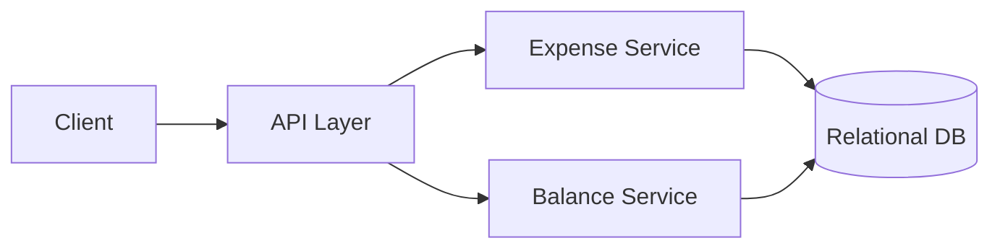

# Design a Simple Expense-Splitting App (Splitwise-like)

## Blogs and websites

## Medium

## Youtube

## Theory

### Problem Statement

Design a simple expense-splitting app where a group of users can log shared expenses, split them (equally or by custom shares), and see who owes whom, with a way to settle up.

### Functional Requirements

- Create groups and add members
- Add an expense with an amount, payer, and split rule (equal / exact / percentage)
- Compute simplified balances (who owes whom, minimized number of transactions)
- Record settlements between users

### Non-Functional Requirements

- **Scale**: Small groups (friends/roommates/trips), thousands of groups
- **Consistency**: Balance calculations must be accurate; settlement history must not be lost
- **Latency**: Add expense / view balances < 200ms

### API Design

```
POST /groups                          { name, memberIds[] }
POST /groups/{groupId}/expenses        { amount, paidBy, splitType, splits[] }
GET  /groups/{groupId}/balances
POST /groups/{groupId}/settlements     { fromUser, toUser, amount }
```

### Data Model

```
groups:       id (PK), name
group_members: group_id (FK), user_id (FK)
expenses:     id (PK), group_id (FK), amount, paid_by, split_type, created_at
expense_splits: expense_id (FK), user_id (FK), share_amount
settlements:  id (PK), group_id (FK), from_user, to_user, amount, created_at
```

### High-Level Architecture



### Key Design Points

- Store every expense as ledger entries (`expense_splits`) rather than pre-aggregated balances, then compute net balances per pair of users on read (or incrementally maintain a `balances` table updated in the same transaction as the expense insert).
- Use a debt-simplification algorithm (greedy min-cash-flow) to reduce the number of settlement transactions shown to users.
- Wrap expense + split creation in a single DB transaction to avoid partial writes leaving balances inconsistent.

### Trade-offs

- Computing balances on-the-fly from the ledger is simple and always correct but gets slower as history grows; maintaining a denormalized `balances` table trades some write complexity for fast reads.
