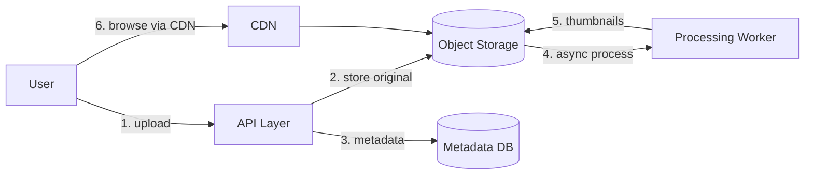
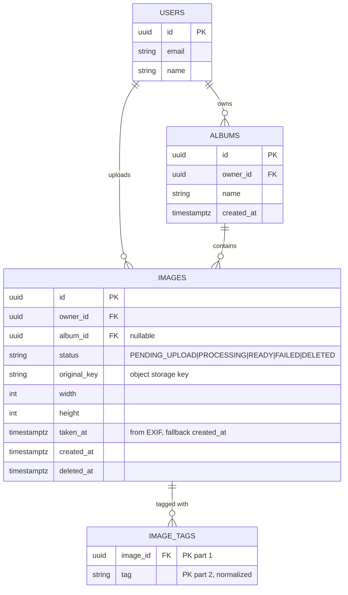
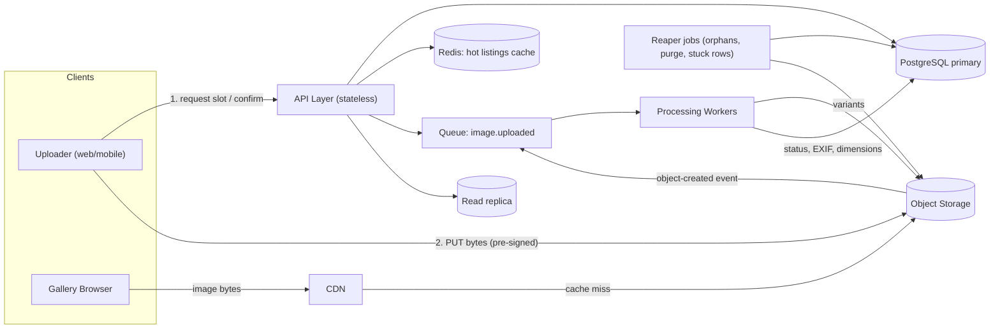

# Design a Simple Image Gallery with Tagging

## Blogs and websites

## Medium

## Youtube

## Theory

### Topics Covered

1. [Introduction and Problem Statement](#introduction-and-problem-statement)
2. [Functional Requirements](#functional-requirements)
3. [Non-Functional Requirements](#non-functional-requirements)
4. [Capacity Estimation](#capacity-estimation)
5. [Characteristics](#characteristics)
6. [Components](#components)
7. [Patterns](#patterns)
8. [Benefits](#benefits)
9. [Pros](#pros)
10. [Cons](#cons)
11. [Challenges](#challenges)
12. [Best Practices](#best-practices)
13. [When to Use and When Not to Use](#when-to-use-and-when-not-to-use)
14. [Use Cases](#use-cases)
15. [API Design and Contract](#api-design-and-contract)
16. [Data Modeling](#data-modeling)
17. [High-Level Design](#high-level-design)
18. [Deep Dive](#deep-dive)
19. [Java and Spring Boot Implementation Guide](#java-and-spring-boot-implementation-guide)
20. [Interview Questions and Answers](#interview-questions-and-answers)

---

### Introduction and Problem Statement

Design an image gallery application — think a simplified Google Photos, Flickr, or Imgur — where users can upload images, organize them into albums, tag them with keywords, and browse or search images by tag or album.

**What problem does it solve?** Personal and shared photo organization. Raw uploads become findable only when they carry metadata; tags and albums are the two complementary organization axes (albums are exclusive containers, tags are non-exclusive labels).

**Why is it an interesting system design problem?** It combines three distinct engineering concerns that each have their own canonical solution:

1. **Binary payload handling** — images are megabytes; they do not belong in your API servers' request pipeline or your relational database.
2. **Async media processing** — thumbnails, responsive sizes, and metadata extraction are CPU-bound work that must not block the upload response.
3. **Flexible metadata search** — tag-based retrieval is an inverted-index problem hiding inside a CRUD app.



The diagram shows the two paths every media system separates: the **write path** (upload → object storage → async processing) and the **read path** (CDN → object storage), which never touches the application servers for the bytes themselves.

**Real-life use cases**

- **Personal photo libraries**: Google Photos, iCloud Photos — upload, auto-organize, search.
- **Stock/asset libraries**: team asset managers, design systems with tagged illustrations.
- **E-commerce catalogs**: product images tagged by category, color, feature.
- **Community galleries**: Imgur-style public image sharing with tag discovery.
- **Journalism/research archives**: tagged photo archives searchable by subject, location, event.

---

### Functional Requirements

1. **Upload an image** with optional album assignment and initial tags; support common formats (JPEG, PNG, WebP, GIF) with a size cap (e.g. 25 MB).
2. **Add/remove tags** on an existing image; tags are lowercase, deduplicated, free-form keywords.
3. **Create/delete albums** and move images between albums.
4. **Browse images by album** with pagination (newest first).
5. **Search images by tag** — single tag and multi-tag (AND) queries.
6. **View an image** — original plus generated thumbnail/responsive variants.
7. **Delete an image** — removes metadata and (asynchronously) the stored bytes.
8. **Optional**: private vs public galleries, share links, basic image metadata display (dimensions, EXIF date taken).

Out of scope for the basic design: face recognition, ML auto-tagging, collaborative albums with fine-grained permissions, video.

---

### Non-Functional Requirements

- **Scale**: hundreds of thousands of images baseline, with a design that survives tens of millions; read-heavy browsing (reads ≫ uploads, roughly 100:1).
- **Latency**: upload acknowledgment < 500 ms (processing continues asynchronously); browse/search < 200 ms p95; image bytes served from CDN edge, < 100 ms for cached content.
- **Durability**: an acknowledged upload must never be lost — object storage with 99.999999999% (11 nines) durability class; metadata in a replicated relational DB.
- **Availability**: browsing must stay up during processing backlogs or upload spikes; uploads may degrade (queue) before reads do.
- **Consistency**: metadata writes are strongly consistent; thumbnail availability is eventually consistent (an image may briefly show a placeholder while processing).

---

### Capacity Estimation

Back-of-envelope for a mid-size deployment:

**Uploads and storage**

- 10K uploads/day, average 3 MB per original → **30 GB/day ≈ 11 TB/year** of originals.
- Generated variants: thumbnail (~50 KB) + two responsive sizes (~800 KB total) ≈ +30% → **~14 TB/year total**.
- Object storage cost at ~$0.023/GB-month: year-one storage ≈ $320/month — cheap; **egress is the real cost** (see bandwidth).

**Request rates**

- Uploads: 10K/day ≈ 0.12/sec average, 1–2/sec peak — trivial for the API tier; the constraint is payload size, not rate.
- Metadata reads (browse/search): 1M/day ≈ 12/sec average, ~100/sec peak.
- Image byte reads: 100M requests/day (thumbnails dominate) ≈ **1,200 req/sec average** — this is why a CDN is non-negotiable; the origin should see < 5% of it.

**Metadata DB size**

- Image row ≈ 500 bytes; tag row ≈ 60 bytes × 5 tags/image.
- 3.65M images/year → ~2 GB of image rows + ~1 GB of tag rows per year. **Metadata fits comfortably in a single relational instance for years**; the bytes are the scaling problem, and they live in object storage.

**Bandwidth**

- 100M image requests/day × 200 KB average served size ≈ 20 TB/day egress — served from CDN, not origin. Origin egress after 95% CDN hit rate ≈ 1 TB/day.

**Key takeaway for interviews**: separate the two resources explicitly — *bytes* (object storage + CDN, scales with storage and egress) and *metadata* (relational DB, scales with rows and query rate). Candidates who put images in the database or stream uploads through the app server fail this question.

---

### Characteristics

- **Separation of bytes and metadata**
  What it means: image binaries live in object storage; the relational DB stores only rows describing them (owner, album, tags, storage keys). Why it matters: databases are expensive, slow storage for large blobs — backups balloon, buffer pools thrash, and replication lags. How it works: the DB row stores a storage key like `originals/{ownerId}/{imageId}.jpg`; the bytes are fetched from object storage (via CDN) using that key.

- **Asynchronous processing**
  What it means: thumbnail generation, format conversion, and EXIF extraction happen after the upload is acknowledged. Why it matters: image processing is 100–1000× slower than the upload acknowledgment the user is waiting for; blocking on it would destroy upload latency and couple API availability to worker availability. How it works: upload writes a `PENDING` row and enqueues a job; workers process and flip the row to `READY`.

- **Read-heavy, cache-friendly content**
  What it means: images are immutable once processed and read far more often than written. Why it matters: immutable content is the ideal CDN workload — cache forever, never invalidate. How it works: content-addressed or versioned URLs (`/v1/thumbs/{imageId}.webp`) with `Cache-Control: immutable, max-age=31536000`.

- **Two organization axes**
  What it means: albums (exclusive — an image is in one album) and tags (non-exclusive — an image has many tags). Why it matters: they map to different data models — a foreign key vs a many-to-many join table — and different query shapes. Conflating them (e.g. "albums as tags") creates awkward semantics later.

- **User-generated, untrusted content**
  What it means: uploaded files are hostile input — polyglot files, embedded scripts, oversized decompression bombs, illegal content. Why it matters: the processing pipeline must validate and re-encode, never trust, and serving must use a separate domain or content-disposition rules to prevent XSS via image payloads.

---

### Components

- **API Layer (stateless service)**
  Purpose: handle metadata CRUD and orchestrate uploads. Responsibilities: auth, validation, issuing pre-signed upload URLs, tag/album management, search queries. How it works: horizontally scaled; never proxies image bytes. Relationship: front door for everything except the bytes themselves. Real-world example: a Spring Boot service behind an ALB.

- **Upload Service (or upload endpoints within the API)**
  Purpose: get bytes from client to object storage without streaming through app servers. Responsibilities: generate pre-signed PUT URLs, validate content-type/size declarations, create the `PENDING` image row, enqueue the processing job. How it works: client uploads directly to S3 with the signed URL; S3 event (or explicit client callback) triggers processing. Real-world example: S3 pre-signed URLs — the same mechanism behind every "direct upload" flow (Slack, GitHub avatars).

- **Object Storage**
  Purpose: durable, cheap storage of originals and generated variants. Responsibilities: durability (11 nines), versioning, lifecycle policies (old originals to colder tiers). How it works: key scheme `originals/{ownerId}/{imageId}`, `variants/{imageId}/{size}.webp`. Real-world example: S3, GCS, or MinIO for self-hosted.

- **Processing Worker**
  Purpose: async media pipeline. Responsibilities: validate the file is really an image (magic bytes, decode test), strip/re-encode (removes embedded payloads), generate thumbnails and responsive sizes, extract EXIF (date taken, dimensions, camera), compute perceptual hash for duplicate detection. How it works: consumes from a queue; idempotent — reprocessing the same image produces the same variants. Real-world example: a pool of workers running libvips/sharp, scaled on queue depth.

- **Metadata DB (relational)**
  Purpose: source of truth for images, albums, tags. Responsibilities: enforce ownership and referential integrity, serve browse/search queries via indexes. Real-world example: PostgreSQL; the tag index is the query hot path.

- **CDN**
  Purpose: serve image bytes from the edge. Responsibilities: cache immutable variant URLs, offload origin egress, terminate TLS close to users. Relationship: sits in front of object storage only — never in front of the API. Real-world example: CloudFront, Cloudflare, Fastly.

- **Search/Tag Index**
  Purpose: fast tag-based retrieval. Responsibilities: answer "all images with tag X" and "images with tags X AND Y" in milliseconds. How it works: at this scale, a btree index on `image_tags(tag, image_id)` is sufficient; at larger scale or with full-text needs, an inverted index (Elasticsearch/OpenSearch) fed by events. Real-world example: Flickr's tag search backed by a search cluster.

---

### Patterns

- **Pre-Signed URL Direct Upload**
  What it is: the server signs a time-limited URL authorizing the client to PUT one object directly to storage. Problem it solves: streaming multi-megabyte uploads through app servers wastes their connections and memory and couples upload bandwidth to app-tier capacity. How it works: client asks for an upload slot → server returns `{uploadUrl, imageId}` → client PUTs to storage → server confirms and enqueues processing. When to use: any user-generated file upload beyond trivial sizes. When not: tiny payloads (< 100 KB) where a direct POST is simpler. Advantages: app tier never touches bytes; storage-level retry/resume support. Disadvantages: two-step flow, orphaned uploads need a reaper (client never completes). Real-world example: S3 pre-signed POST/PUT used by Slack, Airbnb, GitHub.

- **Queue-Based Async Processing**
  What it is: upload acknowledgment and heavy processing are decoupled by a queue. Problem it solves: processing latency and failure must not affect upload availability. How it works: `image.uploaded` message → worker processes → updates row to `READY`. When to use: any CPU/IO-heavy post-processing. When not: when the result is needed synchronously in the response. Advantages: burst absorption, independent scaling, retry/DLQ semantics. Disadvantages: eventual consistency (placeholder state), operational surface of a queue. Real-world example: every photo service's thumbnail pipeline.

- **Cache-Aside for Metadata, CDN for Bytes**
  What it is: two caching layers with different substrates — application cache (Redis) for hot metadata (album listings), CDN for immutable bytes. Problem it solves: DB query load and origin egress respectively. Advantages: each layer matches its content's mutability. Disadvantages: metadata cache needs invalidation on tag/album changes (version-stamped keys solve it).

- **Inverted Index for Tags**
  What it is: map tag → set of image ids instead of scanning images → tags. Problem it solves: "find by tag" is O(images) with a naive schema, O(results) with an index. How it works: the `image_tags(tag, image_id)` table *is* a relational inverted index; Elasticsearch is the same idea at larger scale. When to use: always, for any find-by-attribute workload. When not: — (there is no reasonable alternative for search). Advantages: fast lookups, simple. Disadvantages: write amplification (one row per tag), tag cardinality management.

- **Content-Addressed / Versioned Asset URLs**
  What it is: variant URLs embed a version or content hash. Problem it solves: cache invalidation for immutable content — there is none; a changed image gets a new URL. Advantages: infinite cache TTLs, zero invalidation bugs. Disadvantages: URL management, storage of superseded variants (lifecycle policy cleans up).

---

### Benefits

- **Uploads never block on processing**
  The user gets an acknowledgment in < 500 ms regardless of how heavy the media pipeline is. In production this decoupling is what lets you scale workers independently, deploy pipeline changes without touching the API, and survive worker outages without rejecting uploads.

- **Near-zero marginal read cost**
  Immutable variant URLs cached at the CDN edge mean popular images are served from a PoP near the user; the origin sees single-digit percentages of real traffic. This is the difference between an egress bill that scales with success and one that doesn't.

- **Findability without a search engine (at first)**
  The relational tag index handles tag search well into the millions of images. You defer operating a search cluster until query complexity (full-text, fuzzy, ranked) actually demands it — a concrete example of scaling the architecture with the problem.

- **Durability by substrate**
  Object storage's 11-nines durability plus a replicated metadata DB means "lost my photos" is not a failure mode this design has. Backups protect metadata; the bytes are protected by the storage layer itself.

- **Safe handling of hostile input**
  Mandatory re-encoding in the pipeline strips embedded payloads and normalizes formats, so the gallery never serves attacker-controlled bytes verbatim — a security property baked into the architecture rather than bolted on.

---

### Pros

- **App tier stays thin and stateless.** Because bytes flow client→storage and storage→CDN directly, application servers handle only small JSON requests. Consequence: cheap horizontal scaling, fast deploys, and no memory pressure from multi-megabyte request bodies.
- **The data model matches the query patterns.** Album browse is an indexed FK lookup; tag search is an indexed join-table lookup. No query requires a scan, so read latency stays flat as data grows.
- **Async pipeline absorbs bursts gracefully.** A bulk import of 50K images is a queue-depth problem, not an availability problem — workers drain the queue at their own pace while users get instant acknowledgments.
- **Immutable content simplifies caching completely.** No invalidation logic for image bytes, ever. The hardest problem in caching is designed away by versioned URLs.
- **Tags compose with other features for free.** Because tags are a clean many-to-many relation, features like "tag autocomplete", "related tags", and "trending tags" are aggregations over the same table — no schema changes needed.

### Cons

- **Eventual consistency on processing is user-visible.** A freshly uploaded image shows a placeholder until the worker finishes. Under backlog this stretches from seconds to minutes, and users interpret it as "upload broken". Mitigations (progress states, WebSocket/polling status) add product complexity.
- **Two systems to keep consistent.** The DB row and the stored objects can drift: orphaned uploads (signed URL issued, client vanished), orphaned bytes (row deleted, object delete failed), failed processing stuck in `PENDING`. Each needs a reaper/reconciliation job — real operational code that must exist from day one.
- **Tag quality is a product problem with technical costs.** Free-form tags produce `nyc`, `NYC`, `new-york`, `newyork`. Normalization (lowercase, alias tables) helps, but tag sprawl degrades search recall and inflates the index. Curated tag vocabularies fix this at the cost of flexibility.
- **Egress costs scale with success.** CDN egress is the dominant cost line and grows linearly with usage. Unlike compute, you cannot autoscale your way out of a bandwidth bill — cost modeling belongs in the design doc.
- **Content moderation is unavoidable.** Any system storing user images will be used for CSAM, piracy, and harassment content. Hash-matching (PhotoDNA), reporting flows, and takedown tooling are legal/operational requirements, not optional features — and they add pipeline stages and storage for moderation state.

---

### Challenges

- **Technical: validating that an upload is really an image.** Content-type headers and file extensions are client claims and mean nothing. The pipeline must check magic bytes, fully decode the file (catching truncated/corrupt/polyglot files), enforce pixel-count limits (decompression bombs — a 50 KB PNG can decode to gigapixels), and re-encode before serving.
- **Scalability: hot tags and celebrity albums.** A tag like `sunset` or a viral public album concentrates reads on one index range and one listing query. Cursor pagination, covering indexes, and Redis-cached first pages absorb it; the failure mode is offset pagination (`OFFSET 500000`) scanning and dying.
- **Performance: thumbnail latency budget.** Generating three variants with libvips takes ~100–300 ms per image; a worker pool of N processes handles ~10N images/sec. Sizing the pool for peak upload rate plus backlog drain time is a queueing calculation, not a guess.
- **Reliability: exactly-once-ish processing.** Workers crash mid-processing; queues deliver at-least-once. Processing must be idempotent (same image → same variant keys, overwrite is safe) and the row state machine (`PENDING → PROCESSING → READY | FAILED`) must recover stuck rows via a sweeper.
- **Maintainability: variant format evolution.** WebP today, AVIF tomorrow. Variant sets change over the product's life; the design must support regenerating variants for existing images (backfill jobs over the originals) without schema migrations — originals are the immutable source, variants are disposable.
- **Operational: storage lifecycle management.** Originals accumulate forever unless you define tiers: hot (recent), infrequent access (> 90 days), archive (deleted-account retention window). Lifecycle policies are cheap to configure and expensive to retrofit.
- **Security: serving user content safely.** Serve images from a separate domain (or with `Content-Disposition`/`X-Content-Type-Options: nosniff` and a strict CSP) so a maliciously crafted file cannot execute script in the gallery's origin. Signed URLs with short expiry protect private galleries; the CDN must be configured to forward/validate signatures.

---

### Best Practices

- **Never stream uploads through the API tier.** Use pre-signed URLs so bytes go client→storage directly. Why: app servers are your most expensive, least elastic resource; tying one up for a 25 MB upload on a slow connection is capacity theft. The API issues permission, not bandwidth.
- **Re-encode every image in the pipeline; never serve the original upload to other users.** Why: re-encoding strips embedded scripts, malformed chunks, and metadata leaks (GPS coordinates in EXIF are a privacy issue — strip location by default). The original is retained for the owner only, or re-derived variants are all anyone sees.
- **Make processing idempotent and the state machine explicit.** `PENDING → PROCESSING → READY | FAILED` with a sweeper for stuck rows. Why: at-least-once delivery and worker crashes are certainties; idempotency makes retries safe, and the sweeper makes recovery automatic instead of a pager event.
- **Use cursor (keyset) pagination for all listings.** `WHERE created_at < :cursor ORDER BY created_at DESC LIMIT 50` uses the index; `OFFSET 10000` scans and discards 10K rows. Why: galleries are infinite-scroll UIs — deep pages are the norm, not the edge case.
- **Normalize tags at write time.** Lowercase, trim, collapse separators, map aliases (`nyc` → `new-york-city` if you maintain an alias table). Why: search recall dies by a thousand tag variants; fixing it later requires migrating the entire tag corpus.
- **Version variant URLs and cache them immutably.** `Cache-Control: public, max-age=31536000, immutable` on `/variants/{imageId}/{size}-{version}.webp`. Why: maximum CDN hit rate with zero invalidation logic.
- **Set queue depth alarms, not just error alarms.** Why: in an async pipeline, the failure mode users feel is *latency* (placeholders for minutes), which shows up as queue depth long before it shows up as errors.
- **Plan deletion as a two-phase operation.** Row marked `DELETED` immediately (disappears from UI), bytes purged by an async job after a grace period. Why: undo support, protection against purge-job bugs deleting live content, and clean handling of CDN cache (short TTL on deleted content or a purge API call).

---

### When to Use and When Not to Use

**This design is appropriate when:**

- The product stores and serves user images at any scale beyond a prototype.
- Uploads must feel instant and browsing must be fast and cheap.
- Organization needs are tags + simple containers (albums), not complex hierarchies.
- Content is immutable after upload (the common case for photos).

**This design is not appropriate when:**

- **Real-time collaborative editing of media** (e.g. Figma-style) — you need CRDTs/OT and a live session layer, not an async pipeline.
- **Video-heavy products** — video needs transcoding ladders (HLS/DASH), much larger storage/egress budgets, and streaming-specific CDNs; the pattern generalizes but the numbers and pipeline change qualitatively.
- **Documents requiring text search inside content** — you need OCR/extraction pipelines and a full-text index from day one.
- **Strongly consistent global metadata** (e.g. a shared asset library with cross-region simultaneous edits) — this design assumes single-region metadata with read replicas.

**Alternatives to consider:** a managed media service (Cloudinary, imgix, ImageKit) when media is not your core differentiator — they solve processing, variants, and delivery for a per-image price; a headless DAM (digital asset management) for enterprise asset workflows.

**Decision factors:** upload volume and payload sizes, read:write ratio, whether media processing is core IP or commodity, moderation obligations, and egress cost tolerance.

---

### Use Cases

#### Use Case 1: Personal photo backup and browsing (Google Photos-style, simplified)

- **Problem**: users upload thousands of personal photos from mobile, often on flaky connections, and expect instant upload feedback and fast timeline browsing.
- **Proposed solution**: pre-signed URL uploads with client-side resume, async variant generation, timeline browse via cursor-paginated `created_at` (or EXIF `taken_at`) index, CDN-delivered thumbnails.
- **Why suitable**: the bytes/metadata split and async pipeline are exactly the shape of personal media at scale; mobile upload resilience comes from direct-to-storage uploads with resumable sessions.
- **How it works**: the app requests upload slots in batches, PUTs directly to storage, and shows local thumbnails immediately while the server pipeline catches up; the timeline reads metadata only.
- **Trade-offs**: EXIF-based ordering requires trusting client-provided files' metadata (extracted server-side during processing, so the timeline can briefly misorder fresh uploads); storage cost grows forever — lifecycle tiering is mandatory.

#### Use Case 2: E-commerce product image library

- **Problem**: a catalog team manages product images tagged by SKU attributes (color, category, season); the storefront needs fast, filtered image retrieval and multiple sizes for responsive pages.
- **Proposed solution**: tags as structured attributes (`color:blue`, `category:shoes`) over the same tag table, responsive variant generation in the pipeline, CDN with long TTLs, admin-only write path with review workflow.
- **Why suitable**: tag search maps directly to faceted filtering; immutable product images are the ideal CDN workload; the variant pipeline produces exactly the sizes the storefront needs.
- **How it works**: merchandisers upload and tag; the storefront queries `tag:category:shoes AND tag:color:blue` via the indexed join table; pages render variant URLs by size.
- **Trade-offs**: structured tags need vocabulary governance (enforced via an alias/validation table); storefront cache purging on image replacement is handled by versioned URLs rather than CDN purges.

#### Use Case 3: Public community gallery with tag discovery (Imgur-style)

- **Problem**: public uploads, heavy anonymous read traffic, tag pages as the discovery surface, and significant abuse/moderation pressure.
- **Proposed solution**: public read path fully CDN-cached including tag listing pages (short TTL), upload rate limits per IP/account, pipeline-integrated moderation (hash matching + report queue before public visibility), trending-tags aggregation job.
- **Why suitable**: the read path is already designed for extreme cache hit rates; the async pipeline is the natural insertion point for moderation stages.
- **How it works**: uploads land in `PENDING`, pass automated checks, become `READY` (public); tag pages are cached aggregates; reports flip images to `QUARANTINED` pending human review.
- **Trade-offs**: pre-publication moderation adds latency to visibility (acceptable for safety); public tag pages are hot keys needing the same cache-coalescing treatment as any viral resource.

---

### API Design and Contract

Base path `/api/v1`, `Authorization: Bearer <token>` on all mutating endpoints, one error envelope everywhere: `{ "code": "STRING_CODE", "message": "human readable", "details": [] }`.

**Request an upload slot** (step 1 of upload — the API never receives the bytes)

```
POST /api/v1/images/uploads
Idempotency-Key: 4d2c...
{ "fileName": "beach.jpg", "contentType": "image/jpeg", "sizeBytes": 4200000,
  "albumId": "a_123", "tags": ["beach", "summer"] }
```

`201 Created`:

```json
{
  "imageId": "img_01J9...",
  "uploadUrl": "https://uploads.storage.example.com/originals/u_42/img_01J9...?signature=...",
  "expiresAt": "2026-08-20T15:05:00Z",
  "status": "PENDING_UPLOAD"
}
```

Validation: `contentType` must be in the allowlist (`image/jpeg`, `image/png`, `image/webp`, `image/gif`), `sizeBytes` ≤ 25 MB, album must belong to the caller, ≤ 20 tags. Errors: `400 VALIDATION_FAILED`, `404 ALBUM_NOT_FOUND`, `429 RATE_LIMITED` (uploads per user per hour are capped).

**Confirm the upload** (step 2 — after the client PUTs to `uploadUrl`)

```
POST /api/v1/images/{imageId}/confirm
{ "etag": "\"9be2...\"" }
```

The server verifies the object exists with the declared size/type in storage, flips the row to `PENDING_PROCESSING`, and enqueues the processing job. Alternative trigger: an S3 event notification instead of a client callback (more reliable — no dependence on the client calling back). `200 OK` returns the image with `status: PROCESSING`.

**Manage tags**

```
PATCH /api/v1/images/{imageId}/tags
{ "addTags": ["sunset"], "removeTags": ["summer"] }
```

Tags are normalized server-side (lowercase, trimmed). `200 OK` returns the full current tag set — the operation is naturally idempotent (adding an existing tag is a no-op). `403 FORBIDDEN` if the caller doesn't own the image.

**Browse an album**

```
GET /api/v1/albums/{albumId}/images?cursor=eyJj...&limit=50
```

`200 OK`: `{ "images": [...], "nextCursor": "eyJj..." }`. Keyset pagination on `(created_at, id)`; each image entry includes `thumbnailUrl`, `variants`, `tags`, `status`, `takenAt`. Never offset pagination — deep scrolling is the norm.

**Search by tag**

```
GET /api/v1/images?tags=beach,sunset&match=all&cursor=...&limit=50
```

`match=all` (AND) is the default; `match=any` (OR) is supported. Response shape matches the album listing.

**Delete an image**

```
DELETE /api/v1/images/{imageId}
```

`202 Accepted` — the row is marked `DELETED` immediately (vanishes from listings), bytes are purged asynchronously after the grace period. `204`/`200` on repeat delete (idempotent).

**Contract-wide decisions**

- **Idempotency**: `Idempotency-Key` on upload-slot creation (a retry returns the same slot); tag PATCH and DELETE are naturally idempotent; `confirm` is idempotent (re-confirm returns current status).
- **Headers**: variant/image responses carry `Cache-Control: public, max-age=31536000, immutable` and an `ETag`; private images are served via short-lived signed URLs with `Cache-Control: private`.
- **Status codes**: `201` creations, `202` accepted-async (delete, reprocess), `409` for state conflicts (e.g. confirming an already-`READY` image is fine, but uploading to an expired slot is `409 UPLOAD_EXPIRED`), `413 PAYLOAD_TOO_LARGE` when declared size exceeds the cap.
- **Versioning**: path-based `/v1`; the upload flow is versioned as a unit since client and server must agree on the two-step dance.

---

### Data Modeling

```
images:      id (PK), owner_id (FK), album_id (FK, nullable), status,
             original_key, width, height, taken_at, created_at, deleted_at
albums:      id (PK), owner_id (FK), name, created_at
image_tags:  image_id (FK), tag, PRIMARY KEY(image_id, tag), INDEX(tag, image_id)
```



**Design decisions**

- **`image_tags` composite PK `(image_id, tag)`** prevents duplicate tags naturally and makes "tags of image" lookups direct; the additional `(tag, image_id)` index makes "images with tag" lookups direct. Both directions indexed, no scans either way.
- **Multi-tag AND search** is a grouped self-join: `SELECT image_id FROM image_tags WHERE tag IN ('beach','sunset') GROUP BY image_id HAVING COUNT(DISTINCT tag) = 2` — one indexed range scan per tag, no full scans.
- **`status` is a real state machine column**, not a boolean — `PENDING_UPLOAD`, `PROCESSING`, `READY`, `FAILED`, `DELETED`. Listings always filter `status = 'READY'` (partial index), so unprocessed or deleted images never leak into browse results.
- **Variant URLs are computed, not stored per row**: the key scheme `variants/{imageId}/{size}.webp` plus a `variants_version` column means the read path constructs URLs without a variants table; a new variant generation bumps `variants_version`, changing URLs and refreshing CDN caches for free.
- **Indexes**: `images(album_id, created_at DESC, id)` for album browse (supports keyset pagination), `images(owner_id, created_at DESC)` for the user's library, partial `images(status) WHERE status != 'READY'` for reaper/sweeper jobs.
- **Lifecycle**: `deleted_at` soft-delete with an async purger; originals move to colder storage tiers after 90 days via object-storage lifecycle policies; the metadata rows are small enough to keep indefinitely.
- **Consistency considerations**: metadata is strongly consistent (single primary); the read model users see (listings + variant availability) is eventually consistent with processing completion — by design, and surfaced honestly via the `status` field.

---

### High-Level Design



**Component responsibilities and communication**

- **API Layer**: all metadata CRUD, upload-slot issuance, search. Reads hot listings from Redis, falls back to the read replica; writes go to the primary.
- **Object Storage**: originals and variants; emits object-created events into the processing queue (belt-and-braces alongside the client confirm call).
- **Processing Workers**: queue consumers; validate, re-encode, generate variants, extract EXIF, update the row. Scaled on queue depth.
- **CDN**: serves all image bytes; origin is object storage. API responses are *not* CDN-cached except public tag pages (short TTL).
- **Reaper jobs**: scheduled sweeps for orphaned uploads (slot issued, never confirmed), stuck `PROCESSING` rows, and post-grace-period byte purges.

**Request flow — upload**

```mermaid
sequenceDiagram
    participant C as Client
    participant API as API Layer
    participant S3 as Object Storage
    participant Q as Queue
    participant W as Worker
    participant DB as PostgreSQL

    C->>API: POST /images/uploads (metadata)
    API->>DB: INSERT image row (PENDING_UPLOAD)
    API-->>C: imageId + pre-signed uploadUrl
    C->>S3: PUT image bytes
    C->>API: POST /images/{id}/confirm
    API->>S3: HEAD object (verify size/type)
    API->>DB: status = PROCESSING
    API->>Q: enqueue image.uploaded
    API-->>C: 200 OK (status: PROCESSING)
    Q->>W: deliver job
    W->>S3: GET original, PUT variants
    W->>DB: status = READY, dimensions, taken_at
    Note over C,DB: Client polls status or receives a push; image appears in listings once READY
```

The critical property: the API's involvement ends at issuing permission and recording metadata. The heavy bytes flow client→storage and storage→worker→storage, so upload bandwidth never touches the app tier.

**Scaling strategy**

- API tier: horizontal, autoscaled on request rate (JSON-only traffic, cheap).
- Workers: horizontal, autoscaled on queue depth with a max-in-flight cap to protect downstream CPU.
- PostgreSQL: single primary + read replicas; metadata volume stays small for years (see capacity math).
- Object storage and CDN: managed services scale inherently; the design work is key layout and cache headers, not capacity.

**Failure handling**

- Worker crash mid-processing: queue redelivers; processing is idempotent (same variant keys, overwrite-safe); a sweeper requeues rows stuck in `PROCESSING` beyond a timeout.
- Client never confirms: reaper deletes `PENDING_UPLOAD` rows older than 24h and the orphaned object (if any).
- Queue down: uploads still confirm (row goes to `PROCESSING`); a sweeper enqueues rows that have been `PROCESSING` without an event — the queue is an accelerator, not a correctness dependency.
- CDN failure: clients fall back to direct object-storage URLs (signed); metadata API unaffected.
- DB primary failure: reads continue on replicas (browsing stays up); uploads pause — the correct priority order for a read-heavy product.

---

### Deep Dive

#### The Upload Pipeline in Detail

The two-step upload (slot → direct PUT → confirm) has three subtleties worth knowing:

1. **Why confirm at all?** The pre-signed URL authorizes *an* upload, not *the* upload — the client could PUT a 25 MB declared JPEG that is actually a 2 GB executable. Confirm performs server-side verification (HEAD the object, check size/content-type against the declared values) before the row becomes visible to the pipeline. Skipping confirm means your workers process whatever landed.
2. **S3 events vs client confirm.** Object-created events are more reliable (no dependence on the client), but arrive with at-least-once, out-of-order semantics and add latency. Production systems use both: client confirm for the fast path, storage events as the backstop, idempotent processing to make double-triggers harmless.
3. **Multipart for large files.** Above ~100 MB, pre-signed *multipart* uploads give per-part retries and parallelism. The slot API returns an upload id plus part URLs; confirm completes the multipart session. For a basic gallery (≤ 25 MB cap) single PUT is right; the multipart path matters when the product grows to video.

#### Tag Indexing: Relational vs Search Engine

The `image_tags(tag, image_id)` table is a relational inverted index and answers the core queries well into the millions of images:

- Single tag: one index range scan.
- Multi-tag AND: grouped scan with `HAVING COUNT(DISTINCT tag) = n`.
- Tag autocomplete: `WHERE tag LIKE 'sun%' LIMIT 10` on a `tag` btree (or a separate `tags` dictionary table with usage counts).

Move to Elasticsearch/OpenSearch when you need: full-text over captions/descriptions, fuzzy/typo-tolerant matching, relevance ranking, or aggregations at a scale where SQL `GROUP BY` over hundreds of millions of tag rows gets slow. The migration path is an event stream (`image.tagged`/`image.untagged`) feeding the search cluster — the relational table remains the source of truth. Do not start with a search cluster for a tag-only feature; it is operational weight without payoff at this scale.

#### Duplicate Detection with Perceptual Hashing

Cryptographic hashes (SHA-256) catch *byte-identical* duplicates only. A perceptual hash (pHash/aHash/dHash) produces a small fingerprint (e.g. 64 bits) that survives resizing, recompression, and minor edits; duplicates are found by Hamming distance ≤ threshold. In the pipeline: compute pHash during processing, store it on the row, and query candidates via an index on hash prefixes (exact index on the full hash catches the common case; nearest-neighbor search over 64-bit hashes is feasible with BK-trees or pgvector-style indexes at scale). Uses: dedupe on upload ("you already uploaded this"), grouping near-duplicates, and moderation hash-matching against known-bad content databases.

#### EXIF Extraction and Privacy

EXIF metadata is both a feature and a liability. Extract `taken_at` (timeline ordering), dimensions, and orientation (apply rotation during re-encoding — the classic "sideways thumbnail" bug is unapplied EXIF orientation). **Strip GPS coordinates and device serials from served variants by default** — a photo shared publicly with intact EXIF leaks the owner's home location. Keep the original (with EXIF) accessible only to the owner. This is a privacy control implemented in the pipeline, not a UI setting.

---

### Java and Spring Boot Implementation Guide

Production shape: thin controllers, `@Service` beans for business logic, async processing via a queue listener, all external configuration via `@Value`.

#### JPA Entities

```java
@Entity
@Table(name = "images")
public class Image {

    @Id
    private UUID id;

    @Column(name = "owner_id", nullable = false)
    private UUID ownerId;

    @Column(name = "album_id")
    private UUID albumId;                 // nullable: unfiled images

    @Enumerated(EnumType.STRING)
    @Column(nullable = false)
    private ImageStatus status;           // PENDING_UPLOAD, PROCESSING, READY, FAILED, DELETED

    @Column(name = "original_key", nullable = false)
    private String originalKey;           // e.g. originals/{ownerId}/{id}

    private Integer width;
    private Integer height;

    @Column(name = "taken_at")
    private Instant takenAt;              // from EXIF, fallback createdAt

    @Column(name = "created_at", nullable = false)
    private Instant createdAt;

    @Column(name = "deleted_at")
    private Instant deletedAt;

    @ElementCollection
    @CollectionTable(name = "image_tags", joinColumns = @JoinColumn(name = "image_id"))
    @Column(name = "tag")
    private Set<String> tags = new HashSet<>();

    protected Image() {}                  // JPA
    // getters/factory omitted
}
```

`@ElementCollection` maps the tag join table directly; the composite uniqueness comes from the DDL (`PRIMARY KEY(image_id, tag)`), and the `(tag, image_id)` index is created in the migration, not the entity.

#### Upload Slot Service

```java
@Service
public class UploadService {

    private final ImageRepository images;
    private final S3Presigner presigner;
    private final ApplicationEventPublisher events;
    private final Duration slotTtl;
    private final long maxSizeBytes;
    private final Set<String> allowedTypes;

    public UploadService(ImageRepository images,
                         S3Presigner presigner,
                         ApplicationEventPublisher events,
                         @Value("${app.uploads.slot-ttl:PT15M}") Duration slotTtl,
                         @Value("${app.uploads.max-size-bytes:26214400}") long maxSizeBytes,
                         @Value("${app.uploads.allowed-types:image/jpeg,image/png,image/webp,image/gif}")
                         Set<String> allowedTypes) {
        this.images = images;
        this.presigner = presigner;
        this.events = events;
        this.slotTtl = slotTtl;
        this.maxSizeBytes = maxSizeBytes;
        this.allowedTypes = allowedTypes;
    }

    @Transactional
    public UploadSlot createSlot(UUID ownerId, CreateUploadRequest req) {
        if (!allowedTypes.contains(req.contentType())) {
            throw new UnsupportedMediaTypeException(req.contentType());
        }
        if (req.sizeBytes() > maxSizeBytes) {
            throw new PayloadTooLargeException(maxSizeBytes);
        }
        Image image = images.save(Image.pending(ownerId, req));
        String key = image.getOriginalKey();
        PresignedPutObjectRequest put = presigner.presignPutObject(p -> p
                .signatureDuration(slotTtl)
                .putObjectRequest(r -> r.bucket(bucket()).key(key)
                        .contentType(req.contentType())
                        .contentLength(req.sizeBytes())));
        return new UploadSlot(image.getId(), put.url().toString(), Instant.now().plus(slotTtl));
    }

    @Transactional
    public ImageView confirm(UUID ownerId, UUID imageId) {
        Image image = images.findByIdAndOwnerId(imageId, ownerId)
                .orElseThrow(() -> new ImageNotFoundException(imageId));
        image.markProcessing();                       // state machine guard inside the entity
        events.publishEvent(new ImageUploadedEvent(imageId));   // transactional outbox
        return ImageView.of(image);
    }
}
```

The presigner's `contentLength` + `contentType` constraints mean storage itself rejects a mismatched upload — the confirm step is the second verification layer, not the only one.

#### Async Processing Worker

```java
@Component
public class ImageProcessingWorker {

    private final ImageRepository images;
    private final S3Client s3;
    private final ThumbnailGenerator thumbnails;
    private final ExifExtractor exif;
    private final List<Integer> variantWidths;

    public ImageProcessingWorker(ImageRepository images,
                                 S3Client s3,
                                 ThumbnailGenerator thumbnails,
                                 ExifExtractor exif,
                                 @Value("${app.media.variant-widths:320,800,1600}") List<Integer> variantWidths) {
        this.images = images;
        this.s3 = s3;
        this.thumbnails = thumbnails;
        this.exif = exif;
        this.variantWidths = variantWidths;
    }

    @TransactionalEventListener(phase = TransactionPhase.AFTER_COMMIT)
    @Async
    public void on(ImageUploadedEvent event) {
        process(event.imageId());   // in production: SQS/RabbitMQ listener instead of in-JVM @Async
    }

    public void process(UUID imageId) {
        Image image = images.findById(imageId).orElseThrow();
        byte[] original = s3.getObject(b -> b.bucket(bucket()).key(image.getOriginalKey()),
                ResponseTransformer.toBytes()).asByteArray();

        BufferedImage decoded = thumbnails.decodeAndValidate(original);  // magic bytes + decode test + pixel cap
        ExifData meta = exif.extract(original);

        for (int width : variantWidths) {
            byte[] variant = thumbnails.resize(decoded, width, meta.orientation());
            s3.putObject(b -> b.bucket(bucket()).key(variantKey(imageId, width))
                    .contentType("image/webp"), RequestBody.fromBytes(variant));
        }
        image.markReady(meta.width(), meta.height(), meta.takenAt());
        images.save(image);
    }
}
```

Idempotency falls out of the design: variant keys are deterministic, so reprocessing overwrites the same objects; `markReady` on an already-`READY` row is a no-op. The comment marks where the in-JVM `@Async` is swapped for a real queue listener in production — the processing logic is unchanged.

#### Tag Search (Repository)

```java
public interface ImageRepository extends JpaRepository<Image, UUID> {

    Optional<Image> findByIdAndOwnerId(UUID id, UUID ownerId);

    @Query(value = """
            SELECT i.* FROM images i
            JOIN image_tags t ON t.image_id = i.id
            WHERE i.owner_id = :ownerId AND i.status = 'READY'
              AND t.tag IN (:tags)
              AND (i.created_at, i.id) < (:cursorCreatedAt, :cursorId)
            GROUP BY i.id
            HAVING COUNT(DISTINCT t.tag) = :tagCount
            ORDER BY i.created_at DESC, i.id DESC
            LIMIT :limit
            """, nativeQuery = true)
    List<Image> searchByAllTags(UUID ownerId, List<String> tags, int tagCount,
                                Instant cursorCreatedAt, UUID cursorId, int limit);
}
```

One indexed range scan per tag, keyset pagination via the `(created_at, id)` tuple — no `OFFSET` anywhere.

#### Controller and Error Handling

```java
@RestController
@RequestMapping("/api/v1/images")
@Validated
public class ImageController {

    private final UploadService uploadService;
    private final TagService tagService;

    public ImageController(UploadService uploadService, TagService tagService) {
        this.uploadService = uploadService;
        this.tagService = tagService;
    }

    @PostMapping("/uploads")
    public ResponseEntity<UploadSlotResponse> createUpload(
            @RequestAttribute("userId") UUID userId,
            @Valid @RequestBody CreateUploadRequest request) {
        UploadSlot slot = uploadService.createSlot(userId, request);
        return ResponseEntity.status(HttpStatus.CREATED).body(UploadSlotResponse.from(slot));
    }

    @PatchMapping("/{imageId}/tags")
    public ImageView updateTags(@PathVariable UUID imageId,
                                @RequestAttribute("userId") UUID userId,
                                @Valid @RequestBody UpdateTagsRequest request) {
        return tagService.updateTags(userId, imageId, request.addTags(), request.removeTags());
    }
}

public record CreateUploadRequest(
        @NotBlank String fileName,
        @NotBlank String contentType,
        @Positive @Max(26_214_400) long sizeBytes,
        UUID albumId,
        @Size(max = 20) List<@NotBlank @Size(max = 40) String> tags) {}

public record UpdateTagsRequest(
        List<@NotBlank @Size(max = 40) String> addTags,
        List<@NotBlank @Size(max = 40) String> removeTags) {}
```

```java
@RestControllerAdvice
public class ApiExceptionHandler {

    @ExceptionHandler(PayloadTooLargeException.class)
    public ResponseEntity<ApiError> tooLarge(PayloadTooLargeException ex) {
        return ResponseEntity.status(HttpStatus.PAYLOAD_TOO_LARGE)
                .body(new ApiError("PAYLOAD_TOO_LARGE", ex.getMessage(), List.of()));
    }

    @ExceptionHandler(ImageNotFoundException.class)
    public ResponseEntity<ApiError> notFound(ImageNotFoundException ex) {
        return ResponseEntity.status(HttpStatus.NOT_FOUND)
                .body(new ApiError("IMAGE_NOT_FOUND", ex.getMessage(), List.of()));
    }
}
```

---

### Interview Questions and Answers

**Beginner**

- **Q: Where do you store the images — database or filesystem?**
  **A:** Neither — object storage (S3/GCS). The database stores only metadata and the storage key. Databases make blob storage expensive (backups, replication, buffer-pool pollution); filesystems don't scale or replicate. Object storage gives 11-nines durability, cheap capacity, and native CDN integration. Follow-up: *what goes in the DB row?* — owner, album, status, storage key, dimensions, tags (via join table), timestamps.

- **Q: How does tag search work?**
  **A:** A join table `image_tags(image_id, tag)` with the composite PK for image→tags and an index on `(tag, image_id)` for tag→images — a relational inverted index. Multi-tag AND is a grouped query with `HAVING COUNT(DISTINCT tag) = n`. No scans, both directions indexed.

- **Q: Why generate thumbnails asynchronously?**
  **A:** Image processing takes 100–1000× longer than the upload acknowledgment the user waits for. Blocking the response on it destroys upload latency and couples API availability to worker health. The trade-off — a brief placeholder state — is worth it, and it's why the `status` column exists.

**Intermediate**

- **Q: Walk me through the upload flow without streaming bytes through your servers.**
  **A:** Client requests an upload slot with declared metadata → server validates, creates a `PENDING_UPLOAD` row, returns a pre-signed PUT URL constrained by content-type and length → client PUTs directly to object storage → client confirms (or a storage event fires) → server verifies the object, flips to `PROCESSING`, enqueues the job → workers validate/re-encode/variant → `READY`. Expected follow-up: *why the confirm step?* — the signed URL authorizes an upload, not the upload; confirm verifies what actually landed.

- **Q: How do you keep the DB and object storage consistent?**
  **A:** You accept eventual consistency and build reconciliation: reapers for orphaned slots (row without object), orphaned bytes (object without row), and stuck `PROCESSING` rows. Two-phase delete (soft-delete row, async purge bytes) prevents the purge job from deleting live content. The state machine column makes every drift detectable with a cheap query.

- **Q: How do you paginate the gallery?**
  **A:** Keyset pagination on `(created_at, id)` — `WHERE (created_at, id) < (:cursor) ORDER BY created_at DESC, id DESC LIMIT n`. Offset pagination scans and discards rows and skips/duplicates items under concurrent inserts; galleries are infinite-scroll UIs where deep pages are normal. Common mistake: `OFFSET` because "it's simpler" — it is, until page 500.

**Advanced**

- **Q: A user uploads a 50 KB PNG that decodes to 4 gigapixels. What happens in your system?**
  **A:** Nothing bad — if the pipeline is built correctly. The worker enforces a pixel-count cap *before* full decode (read dimensions from headers first), enforces memory limits per decode, and rejects decompression bombs with `FAILED` status. This is why "validate by decoding with limits" is a pipeline stage, and why you never serve the original upload to other users — only re-encoded variants. Discussion points: polyglot files (valid JPEG + valid HTML), magic-byte checks, and serving from a separate domain with `nosniff`.

- **Q: When do you move tag search from PostgreSQL to Elasticsearch?**
  **A:** When you need what the relational index can't do: full-text over captions, fuzzy/typo tolerance, relevance ranking, or aggregations over hundreds of millions of tag rows. The migration path is an event stream feeding the search cluster with the relational table as source of truth. The wrong answer is "Elasticsearch from day one" — operational weight without payoff — and the equally wrong answer is "never" — faceted, ranked discovery at scale genuinely needs it.

- **Q: How do you handle EXIF data?**
  **A:** Extract `taken_at` for timeline ordering, dimensions, and orientation (apply rotation during re-encoding — the sideways-thumbnail bug). Strip GPS and device identifiers from all served variants; keep the original owner-only. It's a privacy control implemented in the pipeline. Follow-up: *why not strip everything?* — `taken_at` powers the core timeline UX; the answer is selective extraction, not blanket stripping or blanket keeping.

**Senior / System Design**

- **Q: Design this for 100M users and 10 billion images. What changes?**
  **A:** The architecture's shape survives; the substrates change. Metadata: shard by `owner_id` (a user's library is the locality unit), tag search moves to a search cluster fed by events, hot listings served from Redis. Storage: multi-region object storage with CDN, lifecycle tiering becomes a major cost lever. Pipeline: worker fleets per region, queue partitioning by owner for ordering. Moderation becomes a first-class pipeline stage with hash-matching and human review queues. The invariants — bytes/metadata split, async idempotent processing, immutable variant URLs — are what make the scaling path incremental rather than a rewrite.

- **Q: How would you add ML auto-tagging later?**
  **A:** As another pipeline stage after variant generation: the worker (or a downstream consumer of `image.processed`) runs inference, writes suggested tags with a confidence score and a `source: AUTO` marker, and only auto-applies above a threshold — the rest surface as suggestions in the UI. Key design points: keep auto and user tags distinguishable (users trust their own tags differently), make the stage independently scalable (GPU workers vs CPU workers), and version the model so re-tagging backfills are possible.

- **Q: What are the most common mistakes candidates make on this problem?**
  **A:** (1) Storing images in the database or streaming uploads through the API tier. (2) Synchronous thumbnail generation in the request path. (3) Offset pagination on listings. (4) Trusting client-declared content types. (5) No reconciliation jobs between DB and storage. (6) Serving original uploads (EXIF GPS leak, XSS via crafted files). (7) Forgetting moderation exists. Each maps to a real production failure mode.

---
