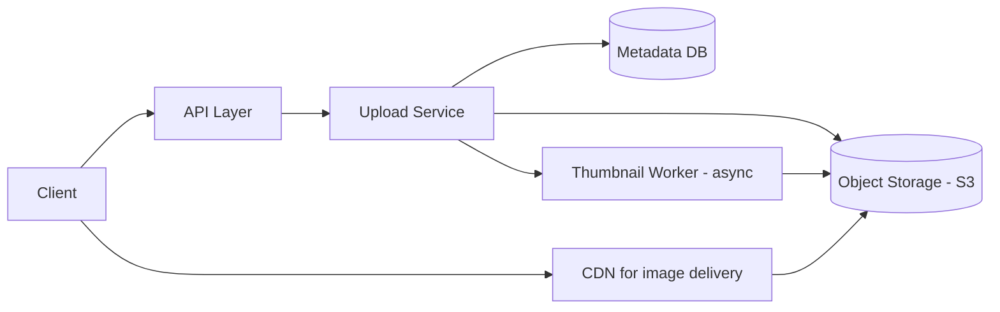

# Design a Simple Image Gallery with Tagging

## Blogs and websites

## Medium

## Youtube

## Theory

### Problem Statement

Design a simple image gallery where users can upload images, tag them with keywords, and browse/search images by tag or album.

### Functional Requirements

- Upload an image (with optional album and tags)
- Add/remove tags on an existing image
- Browse images by album
- Search images by tag

### Non-Functional Requirements

- **Scale**: Hundreds of thousands of images, read-heavy browsing
- **Latency**: Upload ack < 500ms (processing can continue async), browse/search < 200ms
- **Durability**: Uploaded images must not be lost

### API Design

```
POST /images                 (multipart upload)  { albumId, tags[] }
PATCH /images/{imageId}/tags { addTags[], removeTags[] }
GET  /albums/{albumId}/images
GET  /images?tag=
```

### Data Model

```
images:      id (PK), owner_id, album_id (FK), storage_url, thumbnail_url, created_at
albums:      id (PK), owner_id, name
image_tags:  image_id (FK), tag, INDEX(tag)
```

### High-Level Architecture



### Key Design Points

- Store the original image in object storage and only keep metadata (owner, album, tags, URLs) in the relational DB.
- Generate thumbnails/resized variants asynchronously after upload so the upload response isn't blocked on image processing.
- Index `image_tags` by tag so tag-based search is a simple indexed lookup rather than scanning all images.
- Serve images through a CDN rather than directly from the app servers.

### Trade-offs

- Async thumbnail generation means the freshly uploaded image may briefly show only the original (or a placeholder) until processing completes, in exchange for much faster upload responses.
