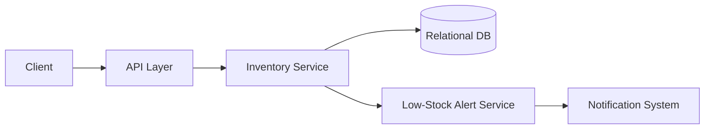

# Design a Basic Inventory Management System

## Blogs and websites

## Medium

## Youtube

## Theory

### Problem Statement

Design a basic inventory management system for a single warehouse/store that tracks stock levels for products, supports stock in/out operations, and alerts when items run low.

### Functional Requirements

- Add/update product catalog (SKU, name, price, category)
- Increase stock (receiving/restock) and decrease stock (sale/dispatch)
- View current stock level per SKU
- Low-stock threshold alerts
- Basic reporting: stock movement history

### Non-Functional Requirements

- **Scale**: Single store/warehouse, up to tens of thousands of SKUs
- **Consistency**: Stock count must be strongly consistent (no overselling)
- **Latency**: Stock update/read < 200ms
- **Auditability**: Every stock change must be traceable to a reason/order

### API Design

```
POST /products                       { sku, name, price, category }
POST /inventory/{sku}/stock-in       { quantity, reason }
POST /inventory/{sku}/stock-out      { quantity, reason }
GET  /inventory/{sku}
GET  /inventory/low-stock
```

### Data Model

```
products:        sku (PK), name, price, category, low_stock_threshold
inventory:       sku (FK), quantity, updated_at
stock_movements:  id (PK), sku (FK), delta, reason, created_at
```

### High-Level Architecture



### Key Design Points

- Use a single atomic `UPDATE inventory SET quantity = quantity - :qty WHERE sku = :sku AND quantity >= :qty` to prevent negative stock/overselling under concurrent stock-out requests.
- Append every change to `stock_movements` (event log) so the current quantity can always be reconciled/audited.
- Trigger low-stock alerts asynchronously so the write path (stock-out) is never blocked on notification delivery.

### Trade-offs

- A single relational DB with row-level locking is simple and strongly consistent but limits horizontal write scale; sharding by warehouse/SKU range helps once inventory spans many locations (see the advanced real-time/quick-commerce variant for that).
