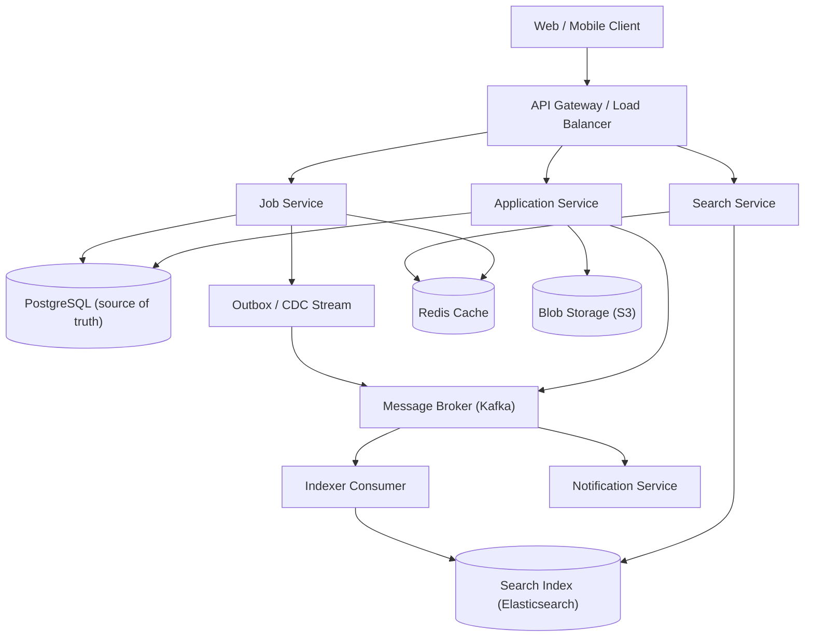
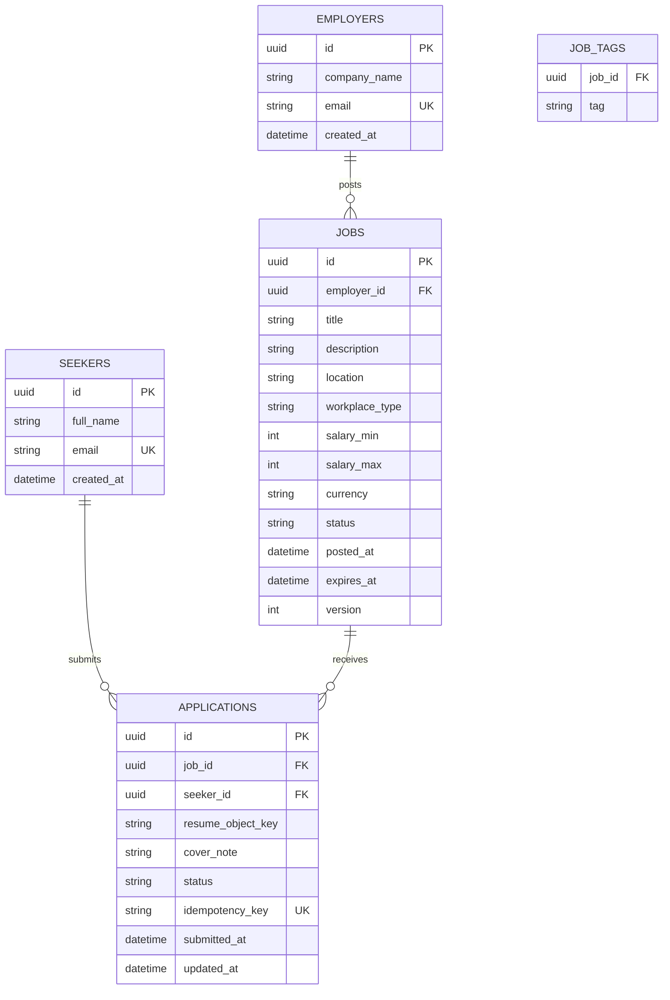
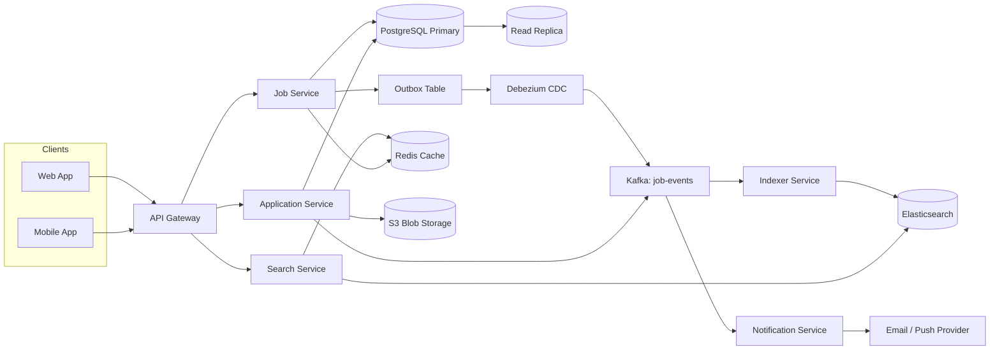
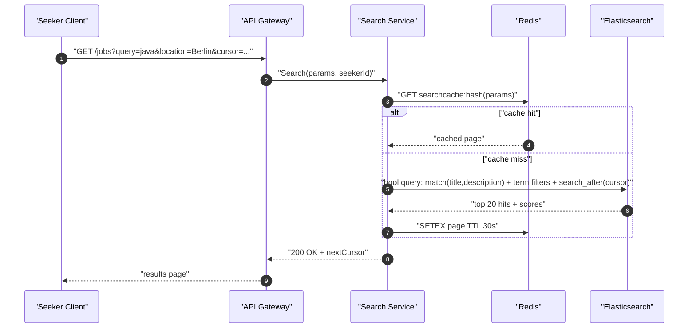
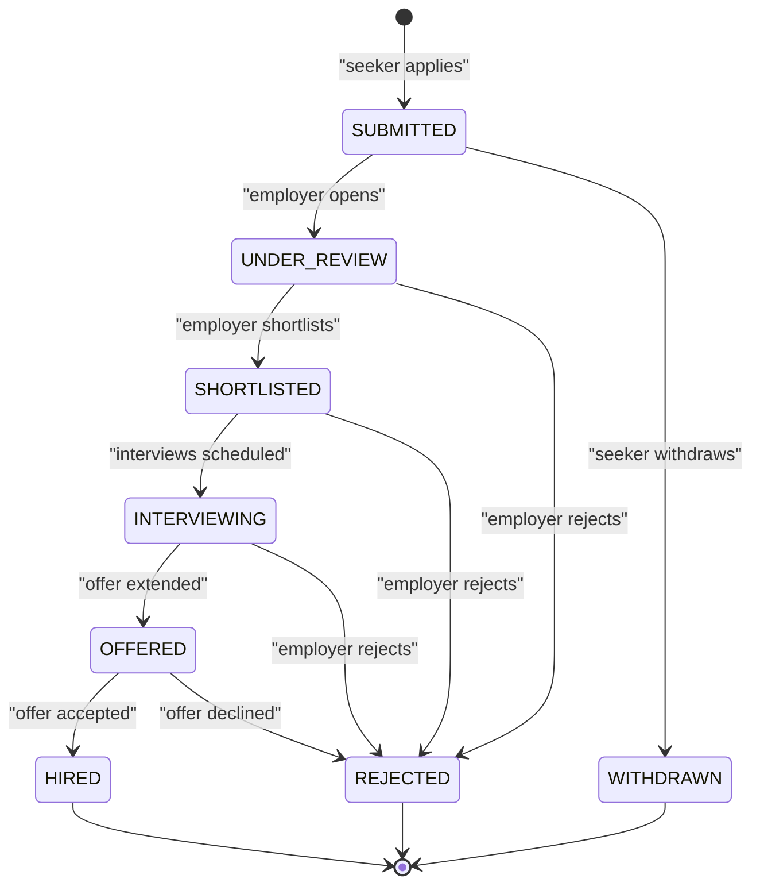

# Design a Basic Job Board

## Blogs and websites

## Medium

## Youtube

## Theory

### Topics Covered

1. [Introduction and Problem Statement](#introduction-and-problem-statement)
2. [Functional Requirements](#functional-requirements)
3. [Non-Functional Requirements](#non-functional-requirements)
4. [Capacity Estimation](#capacity-estimation-back-of-envelope)
5. [Characteristics](#characteristics)
6. [Components](#components)
7. [Patterns](#patterns)
8. [Benefits](#benefits)
9. [Pros](#pros)
10. [Cons](#cons)
11. [Challenges](#challenges)
12. [Best Practices](#best-practices)
13. [When to Use / When Not to Use](#when-to-use--when-not-to-use)
14. [Use Cases](#use-cases)
15. [API Design / API Contract](#api-design--api-contract)
16. [Data Modeling](#data-modeling)
17. [High-Level Design](#high-level-design)
18. [Deep Dive: Search, Matching and Application Workflow](#deep-dive-search-matching-and-application-workflow)
19. [Trade-offs and Key Design Decisions](#trade-offs-and-key-design-decisions)
20. [Java and Spring Boot Implementation Guide](#java-and-spring-boot-implementation-guide)
21. [Interview Questions and Answers](#interview-questions-and-answers)

---

### Introduction and Problem Statement

**What it is:** A job board is a two-sided marketplace platform where employers publish job openings and job seekers discover, filter, and apply to those openings. Well-known examples include Indeed, LinkedIn Jobs, Glassdoor, Monster, and niche boards such as Stack Overflow Jobs or We Work Remotely.

**Problem statement:** Design a basic job board where employers can post job listings and job seekers can search/filter listings and apply.

**Why it exists:** Hiring is fundamentally an information-discovery and matching problem. Employers have open positions and need qualified candidates; job seekers have skills and need suitable openings. Without a centralized platform, both sides rely on word of mouth, newspaper ads, or recruiting agencies, which are slow, expensive, and low-reach. A job board solves the discovery problem by aggregating postings in one searchable catalog, and solves the workflow problem by standardizing the application pipeline (apply → review → interview → offer).

**The core problems the design must solve:**

1. **Searchable catalog at scale.** Tens of thousands of postings must be searchable by keyword, location, and tags with sub-second latency. Relational `LIKE '%java%'` queries do not scale or rank well — a dedicated search index is required.
2. **Two distinct user roles with different write patterns.** Employers write (post, edit, close) and read applicant lists; seekers mostly read (search, browse) and occasionally write (apply). The system is read-heavy overall.
3. **Application lifecycle management.** An application moves through states (submitted → under review → shortlisted → interview → offer/rejected), and both sides need visibility into the current state.
4. **Duplicate and spam control.** The same seeker should not apply twice to the same job; employers should not be flooded with low-quality spam applications.

**Real-life use cases:**

- **General-purpose boards (Indeed, LinkedIn Jobs):** millions of postings, heavy keyword search, recommendation-driven matching.
- **Niche boards (We Work Remotely, Stack Overflow Jobs):** curated, tag-focused listings for a single industry.
- **Internal mobility portals:** large companies expose internal openings to employees before external candidates.
- **Campus recruiting platforms:** universities host boards where approved employers post internships for enrolled students.


---

### Functional Requirements

Numbered and detailed; each requirement includes the actor, the operation, and the expected behavior.

1. **Employer job posting creation.** An employer creates a posting with title, description, location, salary range, and a list of tags (e.g., `java`, `spring`, `remote`). The posting starts in `DRAFT` or `OPEN` status and receives a unique identifier.
2. **Employer job editing.** An employer edits any field of their own posting while it is open. Edits are versioned (or at least timestamped) so an audit trail exists.
3. **Employer job closing.** An employer closes a posting when the role is filled or withdrawn. Closed postings stop appearing in search results but remain accessible for existing applicants.
4. **Job seeker search and filter.** A seeker searches postings by free-text keyword (matched against title and description), location, and tags, and can combine filters (e.g., "backend engineer" + "Berlin" + tag `remote`).
5. **Pagination of results.** Search results are paginated; cursor-based pagination keeps deep pages fast as the catalog grows.
6. **View job details.** A seeker views a single posting's full description, company info, salary range, and posting date.
7. **Apply to a posting.** A seeker applies with a resume (file upload stored in blob storage, referenced by URL) and an optional cover note. Applying twice to the same job with the same account is rejected.
8. **Employer applicant management.** An employer views the list of applicants for each of their postings and can advance an application's status (review → shortlist → interview → offer/reject).
9. **Seeker application tracking.** A seeker views the list and current status of their own applications.
10. **Expiry of postings.** Postings auto-expire after a configurable period (e.g., 30 days) unless the employer renews them.

**Out of scope (state this in an interview to show prioritization):** recommendations/ML matching, messaging between parties, interview scheduling, payments for promoted listings, multi-tenant ATS integrations.

---

### Non-Functional Requirements

Each requirement includes a concrete target number so the design can be evaluated.

1. **Scale:**
   - Tens of thousands of active postings (~50,000 open postings at any time).
   - ~5 million registered job seekers, ~20,000 employer accounts.
   - Moderate search traffic: ~2,000 search QPS at peak; ~50 write QPS (post/edit/close); ~100 apply QPS at peak.
2. **Latency:**
   - Search p95 < 300 ms end-to-end (index query + hydration).
   - Apply p95 < 200 ms (excluding resume upload, which is a separate large-object operation).
   - Job detail read p95 < 100 ms (cacheable).
3. **Availability:**
   - Read path (search/browse) must be highly available: 99.95% — it is the revenue-generating surface and should stay up even during write spikes.
   - Write path (posting, applying) can tolerate slightly lower availability: 99.9%.
4. **Consistency:**
   - Posting writes are strongly consistent in the relational source of truth.
   - Search index is eventually consistent (lag target < 5 seconds from DB commit to searchable).
   - An application, once submitted, must never be lost (durability) and must be visible to the employer within seconds.
5. **Durability:** Applications and resumes have a durability target of 99.999999999% (eleven nines) — resume files in blob storage with replication, application records in the relational DB with backups and WAL archiving.
6. **Security & privacy:** Resumes contain PII; access to applicant data is restricted to the owning employer. All traffic over TLS. Resume URLs must be pre-signed and short-lived, never public.

---

### Capacity Estimation (back-of-envelope)

Step-by-step estimation, using the NFR numbers above.

**Users and traffic**

- 5M registered seekers; assume 10% daily active → **500,000 DAU**.
- Each DAU performs ~8 searches/day → 4M searches/day → ~46 QPS average; peak factor ~40x (job hunting is bursty, mornings and Mondays) → **~2,000 search QPS peak**.
- 1 application per 20 searches → **~100 apply QPS peak**.
- 50,000 active postings; ~2% churn daily → ~1,000 new + ~1,000 edited/closed per day → writes average well under 1 QPS, bursts to **~50 write QPS**.

**Storage**

- Job posting row: title (100 B) + description (~4 KB) + metadata/tags (~0.5 KB) ≈ **~5 KB per posting**.
- Total postings over 3 years (500K postings/year, kept 3 years): 1.5M × 5 KB ≈ **~7.5 GB** — trivially small; a single relational instance handles it easily.
- Applications: 200K applications/day × 1 KB metadata ≈ **200 MB/day → ~73 GB/year** of application rows.
- Resumes: 200K/day × 300 KB average PDF ≈ **60 GB/day → ~22 TB/year** in blob storage (S3-class). This dominates storage and confirms resumes belong in blob storage, never in the relational DB.

**Bandwidth**

- Search response page: 20 results × 2 KB JSON ≈ 40 KB → 2,000 QPS × 40 KB ≈ **80 MB/s egress** at peak.
- Resume uploads: 100 QPS × 300 KB ≈ **30 MB/s ingress** at peak — offload via pre-signed direct-to-blob upload URLs so this traffic never passes through the API servers.

**Search index size**

- Indexed fields (title, description tokens, tags, location) ≈ ~30-40% of raw document size after analysis/posting lists → 1.5M docs × ~2 KB ≈ **~3 GB** — fits in a single small Elasticsearch/OpenSearch shard; one primary + one replica is enough for the "basic" design, with headroom to shard by geography later.

**Key takeaways from the math:** the system is read-heavy (20:1 search-to-write), storage-light except for resume blobs, and search-QPS-dominated — which is exactly why the design centers on a search index plus a relational source of truth, with blob storage for files.

---

### Characteristics

Each characteristic: what it means, why it matters, how it works, and a practical example.

- **Two-sided marketplace**
  *What:* Two participant roles (employer, seeker) with asymmetric needs. *Why it matters:* permissions, read/write patterns, and even data retention differ per role, so the API and authorization model must be role-aware. *How:* role-based access control; employers write postings and read applicants, seekers read postings and write applications. *Example:* a seeker calling `GET /jobs/{id}/applicants` receives `403 Forbidden`.

- **Read-heavy workload**
  *What:* searches vastly outnumber writes (~20:1). *Why:* the read path must be optimized first — caching, search index, CDN for static assets. *How:* Elasticsearch serves search; Redis caches hot job detail pages. *Example:* a viral remote job gets 50K views but only 500 applications.

- **Search-centric domain**
  *What:* the primary access pattern is filtered full-text search, not key-value lookup. *Why:* dictates an inverted-index engine rather than relying on SQL `LIKE`. *How:* postings are denormalized into search documents with analyzed text fields and keyword/facet fields. *Example:* query "senior java developer" + location "Berlin" + tag "remote" returns ranked results in < 300 ms.

- **Eventual consistency between DB and search index**
  *What:* the relational DB is the source of truth; the search index lags slightly. *Why:* synchronous dual-writes couple availability of posting to search-engine health. *How:* outbox/CDC pipeline publishes change events; indexer applies them. *Example:* a newly posted job appears in search within ~2 seconds.

- **Stateful application lifecycle**
  *What:* every application has a well-defined state machine. *Why:* prevents illegal transitions (e.g., offering a rejected candidate) and enables status notifications. *How:* a status enum with guarded transitions in the service layer. *Example:* `SUBMITTED → UNDER_REVIEW → SHORTLISTED → OFFER`.

- **Large immutable binary attachments**
  *What:* resumes are write-once, read-rarely, and large relative to rows. *Why:* they would bloat the DB and saturate API bandwidth. *How:* direct-to-blob upload via pre-signed URLs; DB stores only a reference key. *Example:* 22 TB/year of PDFs lives in S3, not Postgres.

- **Soft-delete and expiry semantics**
  *What:* postings close/expire rather than disappear. *Why:* existing applicants and analytics still reference them. *How:* status flag + TTL-based expiry job. *Example:* a posting auto-closes 30 days after publication.

---

### Components

Each component: purpose, responsibilities, how it works, relationships, and a real-world example.

- **API Gateway / Load Balancer**
  *Purpose:* single entry point for all clients. *Responsibilities:* TLS termination, authentication token verification, rate limiting, routing. *How it works:* terminates HTTP/2, validates JWTs, applies per-IP and per-user token buckets, forwards to services. *Relationships:* fronts every other component. *Real-world example:* AWS ALB + Amazon API Gateway, or an Nginx/Envoy ingress in Kubernetes.

- **Job Service**
  *Purpose:* owns the posting lifecycle. *Responsibilities:* create/edit/close/expire postings, enforce ownership (only the owning employer edits a posting), emit change events for indexing. *How it works:* transactional writes to Postgres; writes an outbox row in the same transaction. *Relationships:* called by API layer; publishes to the message broker; read by Search Service indirectly via the indexer. *Example:* a Spring Boot microservice with a `JobController` and `JobService`.

- **Search Service**
  *Purpose:* serve keyword/filter queries. *Responsibilities:* translate query parameters into engine queries (bool + match + filter clauses), apply pagination and sorting, return lightweight results. *How it works:* queries Elasticsearch; hydrates top-N results from cache/DB if fresh fields (e.g., current applicant count) are needed. *Relationships:* read-only consumer of the search index; calls Job Service/Cache for hydration. *Example:* OpenSearch behind a thin Spring Boot query service, the pattern used by Indeed-style architectures.

- **Application Service**
  *Purpose:* owns the apply workflow. *Responsibilities:* enforce one-application-per-seeker-per-job, generate pre-signed resume upload URLs, persist applications, drive the status state machine, notify both sides. *How it works:* unique constraint `(job_id, applicant_id)` plus idempotency keys; state transitions in guarded service methods. *Relationships:* writes to Postgres, publishes notification events, coordinates with Blob Storage. *Example:* the apply service of an ATS such as Greenhouse.

- **Relational Database (source of truth)**
  *Purpose:* durable, strongly consistent storage for postings, applications, users. *Responsibilities:* ACID transactions, uniqueness constraints, referential integrity. *How it works:* Postgres with primary/replica; writes to primary, reads can offload to replicas. *Relationships:* written by Job and Application Services; streamed to the indexer via CDC. *Example:* Amazon RDS PostgreSQL with a read replica.

- **Search Index (Elasticsearch/OpenSearch)**
  *Purpose:* fast full-text + structured filtering. *Responsibilities:* tokenized text indexing, geo/keyword filters, relevance ranking. *How it works:* inverted index over analyzed fields; bool queries combine `match` (relevance) with `term` filters (location, tags, status). *Relationships:* populated by the Indexer; queried by Search Service. *Example:* a 3-node OpenSearch cluster with one primary shard and one replica.

- **Indexer / CDC pipeline**
  *Purpose:* keep the search index in sync. *Responsibilities:* consume change events, transform rows into search documents, bulk-index them. *How it works:* Debezium-style CDC on the outbox table → Kafka → indexer consumer; idempotent document upserts keyed by job ID. *Relationships:* reads DB outbox, writes search index. *Real-world example:* LinkedIn's Brooklin/Espresso pipeline, Debezium + Kafka Connect Elasticsearch sink.

- **Blob Storage**
  *Purpose:* store resume files. *Responsibilities:* durable object storage, pre-signed URL generation, lifecycle policies. *How it works:* clients upload directly with a pre-signed PUT URL; the DB stores `s3://bucket/key`. *Relationships:* used by Application Service. *Example:* Amazon S3 with SSE-KMS encryption and a 90-day non-current-version expiry.

- **Notification Service**
  *Purpose:* deliver status updates. *Responsibilities:* email/push on application received, shortlisted, rejected; employer alerts on new applicants. *How it works:* consumes domain events from the broker; renders templates; retries with backoff. *Relationships:* downstream of Application Service. *Example:* Amazon SES/SNS or SendGrid behind an internal notifications service.

- **Cache (Redis)**
  *Purpose:* absorb hot read traffic. *Responsibilities:* cache job detail pages and popular search pages; store rate-limit counters. *How it works:* cache-aside with short TTLs (30-120 s) keyed by job ID / query hash. *Relationships:* consulted by Job/Search Services before DB/index. *Example:* ElastiCache Redis in cluster mode.



---

### Patterns

Each pattern: what it is, the problem it solves, how it works, when to use / not use, advantages, disadvantages, and a real-world example.

- **CQRS (Command Query Responsibility Segregation, light variant)**
  *What:* separate write model (relational rows) from read model (search documents). *Problem solved:* the relational schema that enforces integrity is poor at full-text relevance queries, and vice versa. *How:* commands mutate Postgres; a projection pipeline builds denormalized read documents in Elasticsearch. *When to use:* when read and write shapes diverge strongly, as here. *When not:* when simple SQL queries suffice — CQRS adds a whole second data store to operate. *Advantages:* each side optimized independently; search scales separately. *Disadvantages:* eventual consistency; operational complexity. *Example:* LinkedIn Jobs and Indeed both keep transactional stores separate from search clusters.

- **Transactional Outbox**
  *What:* write domain row + outbox event row in one DB transaction; a relay publishes events to the broker. *Problem solved:* dual-write problem — writing to the DB and then to Kafka is not atomic; a crash between them loses the index update. *How:* outbox table polled by Debezium/CDC and streamed to Kafka. *When to use:* whenever downstream systems must reflect DB changes reliably. *When not:* when a lag of seconds is unacceptable even under failure (rare here). *Advantages:* at-least-once, ordered-ish delivery with zero data loss. *Disadvantages:* extra table and relay to operate. *Example:* Debezium Postgres connector → Kafka.

- **Cache-Aside (Lazy Loading)**
  *What:* read path checks cache, falls back to source, then populates cache. *Problem solved:* hot job postings (viral listings) would hammer the DB/index. *How:* `GET /jobs/{id}` → Redis GET → miss → DB/index → SET with TTL. *When to use:* read-heavy data tolerant of short staleness. *When not:* data that must always be strongly fresh (applicant counts shown to employers mid-review). *Advantages:* simple, resilient (cache failure degrades to DB). *Disadvantages:* first-hit latency; stampede risk on hot-key expiry (mitigate with request coalescing). *Example:* job detail pages cached 60 s.

- **Cursor-Based Pagination**
  *What:* paginate by an opaque cursor encoding the sort key of the last seen item instead of `OFFSET`. *Problem solved:* `OFFSET 100000` forces the engine to scan and discard 100K hits; results also shift as new postings arrive. *How:* sort by `(posted_at desc, id)`; cursor = base64 of the last item's key; engine uses `search_after`. *When to use:* deep, frequently paginated result sets. *When not:* tiny result sets where offset is simpler. *Advantages:* O(1) page cost, stable under inserts. *Disadvantages:* no random page jumps. *Example:* Elasticsearch `search_after`, used by most production search APIs.

- **Idempotency Keys**
  *What:* client supplies a unique key per logical operation; server dedupes retries. *Problem solved:* a mobile user taps "Apply" twice on a flaky network and must not create two applications. *How:* store `idempotency_key` with a unique index; on conflict return the original response. *When to use:* all mutating client-facing endpoints. *When not:* naturally idempotent operations (PUT with full state). *Advantages:* safe retries. *Disadvantages:* key storage and cleanup. *Example:* Stripe-style `Idempotency-Key` header.

- **Pre-signed URL Upload (Claim-Check for files)**
  *What:* API returns a short-lived signed URL; the client uploads the file directly to blob storage. *Problem solved:* proxying 300 KB-10 MB uploads through API servers wastes bandwidth and connections. *How:* `POST /applications` returns `uploadUrl`; client PUTs the PDF; client confirms; server verifies object existence. *When to use:* large binary payloads. *When not:* small payloads where direct JSON is simpler. *Advantages:* API tier stays stateless and cheap. *Disadvantages:* two-step flow; orphaned uploads need a cleanup job. *Example:* S3 pre-signed PUT URLs.

- **State Machine (for application lifecycle)**
  *What:* explicit states with guarded transitions. *Problem solved:* ad-hoc status string updates allow illegal jumps and make notification logic fragile. *How:* a transition table (`UNDER_REVIEW → {SHORTLISTED, REJECTED}`) enforced in the service layer. *When to use:* any workflow with more than 3 states. *When not:* trivial two-state flags. *Advantages:* auditable, testable, safe. *Disadvantages:* slight rigidity — new states require code changes unless the machine is data-driven. *Example:* every ATS (Greenhouse, Lever) models candidate stages this way.

---

### Benefits

- **Fast, relevant search drives the core value loop.**
  Seekers who find relevant jobs quickly apply more; employers who receive qualified applicants renew their postings. The inverted-index design directly serves this: relevance-ranked results in < 300 ms versus multi-second `LIKE` scans. In production, search latency correlates with conversion — a 100 ms improvement measurably raises application rates, which is the metric employers pay for.

- **Read/write path independence improves availability.**
  Because search is served from a separate index, a failure or slowdown in the write path (posting service, outbox relay) does not take down the revenue-critical read path. Seekers keep searching against a slightly stale index — a graceful degradation rather than an outage.

- **Horizontal scalability where it matters.**
  Search QPS scales by adding index replicas; API servers are stateless and scale behind the load balancer; the only hard-to-scale component (the relational primary) carries modest write load (≈50 QPS), so a single primary suffices for years of growth.

- **Durable, auditable application pipeline.**
  Applications are money-adjacent data: losing one means a candidate silently ignored. Unique constraints, idempotency keys, and an explicit state machine give an auditable trail that survives retries, crashes, and duplicate submissions.

- **Cheap large-file handling.**
  Pre-signed uploads keep ~30 MB/s of resume ingress off the API tier, letting a small fleet serve the whole product. Storage cost lands in the cheapest tier (blob storage) instead of the most expensive (database pages).

- **Clear ownership boundaries enable team scaling.**
  Job, Search, and Application services can be owned by separate teams with separate deploy cadences — the classic organizational benefit of domain-aligned service boundaries.

---

### Pros

- **Excellent search quality and speed.**
  An inverted index with analyzers (stemming, synonyms, stop words) understands "developer" ≈ "engineer" ≈ "programmer" and ranks by TF-IDF/BM25 relevance, something SQL cannot do without painful extensions. Combined with structured filters (location, tags, salary), it delivers the exact UX seekers expect.

- **Strong integrity for the transactional core.**
  Foreign keys, unique constraints, and ACID transactions in Postgres guarantee invariants that would be painful in a NoSQL design: no duplicate applications, no orphaned applications pointing at deleted postings, atomic posting edits.

- **Graceful degradation built in.**
  If the indexer lags, search is stale but functional; if the cache dies, the DB absorbs traffic briefly; if notifications back up, applications are still recorded. Each dependency failure degrades one feature instead of cascading.

- **Cost-efficient at this scale.**
  The capacity math shows ~7.5 GB of postings and ~3 GB of index: the entire hot dataset fits in RAM on modest instances. Spend concentrates on resume blob storage, which costs pennies per GB-month.

- **Straightforward evolution path.**
  The outbox/CDC spine means new consumers (recommendation engine, analytics warehouse, fraud detector) attach as additional Kafka consumers without touching the write path — the design grows into a full hiring platform.

---

### Cons

- **Two data systems to keep consistent.**
  The DB ↔ Elasticsearch sync is the classic source of production bugs: mapping changes, reindexing after analyzer updates, poison-pill events blocking a consumer. Running a periodic reconciliation job (compare DB vs. index document counts and checksums) becomes mandatory operational overhead.

- **Eventual consistency surprises users.**
  An employer edits a salary and immediately searches — the old value appears for a second or two. Support tickets and confused demos follow. Mitigations (read-your-writes via forced refresh, UI hinting) add complexity.

- **Search infrastructure is operationally heavy.**
  Elasticsearch clusters need heap tuning, shard management, version upgrades, and index lifecycle policies. For a small team this is the single largest operational burden in the design — a managed offering (Elastic Cloud, OpenSearch Service) mitigates but costs more.

- **Pre-signed upload flow adds UX and cleanup complexity.**
  Two-step uploads can be abandoned, leaving orphaned blobs; clients must handle URL expiry mid-upload. A lifecycle rule plus an orphan-sweep job is required, and the frontend flow is harder than a single multipart POST.

- **Cursor pagination limits UX.**
  "Jump to page 47" is impossible with cursors; infinite scroll fits, but traditional pagers don't. Product teams sometimes push back.

- **Spam and abuse remain unsolved by the base design.**
  Keyword-stuffed postings, fake jobs harvesting resumes, and bot applications need heuristics/ML and human review queues — explicitly out of scope but unavoidable in production.

---

### Challenges

- **Search relevance tuning.**
  Getting BM25 weights, field boosts (title matches worth more than description), synonyms, and typo tolerance right is iterative, data-driven work. A wrong synonym table can flood results with irrelevant jobs and tank apply rates.

- **Keeping the index fresh under write bursts.**
  A bulk employer import of 50K postings creates a CDC backlog; search lag spikes from 2 s to minutes. Backpressure-aware consumers, bulk indexing (500-doc batches), and lag monitoring are required.

- **Duplicate application prevention under retries.**
  Network retries, browser double-clicks, and queue redeliveries all re-present the same apply request. The unique `(job_id, applicant_id)` constraint plus idempotency keys must work together, and error mapping must turn constraint violations into friendly "already applied" responses.

- **PII protection at scale.**
  Resumes contain names, phones, addresses, work history. Challenges: encrypting blobs at rest, short-lived pre-signed URLs, access logging on every resume read (compliance), GDPR erasure propagating to DB, index, *and* blob storage.

- **Hot-key and celebrity-posting effects.**
  A posting shared on social media can draw 100K views/hour. Without caching and CDN-fronted static assets, the DB/index melts. Cache stampedes on expiry need request coalescing or jittered TTLs.

- **Exactly-once illusion in notifications.**
  At-least-once event delivery means a seeker could get two "shortlisted" emails. The notification service must dedupe on event ID, which requires its own state store.

- **Operational toil of schema evolution.**
  Adding a field (e.g., `workplace_type: remote|hybrid|onsite`) touches the DB migration, the outbox payload, the indexer transform, the search mapping, and the API contract — five coordinated changes for one business field.

---

### Best Practices

1. **Keep the relational DB as the single source of truth.**
   Every mutation commits to Postgres first; the index is a disposable projection. *Why:* if the index corrupts, you rebuild it from the DB in minutes; if the DB corrupts while the index was treated as truth, you have lost data. *Example:* after an Elasticsearch mapping change, run a full reindex job from Postgres into a new index alias.

2. **Never dual-write from the application; use outbox + CDC.**
   *Why:* "write DB then publish to Kafka" fails silently when the process crashes between the two calls, producing permanently missing search documents that only surface as user complaints. The outbox pattern makes the event part of the same transaction.

3. **Use pre-signed URLs for resume upload and download.**
   *Why:* keeps heavy traffic off the API tier and enforces access control cryptographically (a 5-minute URL signed for one object, one operation). *Example:* employer opening a resume triggers `GET /applications/{id}/resume` → 302 redirect to a 60-second S3 pre-signed GET.

4. **Make every mutating endpoint idempotent.**
   *Why:* clients retry; queues redeliver; humans double-click. Idempotency keys plus unique constraints turn duplicates into safe no-ops. *Example:* `POST /jobs/{id}/apply` with header `Idempotency-Key: 9f1c…` returns the same application ID on retry.

5. **Index only what you search; store only what you show.**
   The search document should contain analyzed search fields and the small display payload (title, company, location, salary, posted date) so the index can render result cards without a DB round trip. *Why:* hydration joins at 2,000 QPS add latency and a failure mode; but indexing the full 4 KB description for display bloats the index 10x. Balance: index full text for matching, store trimmed fields for display.

6. **Paginate with cursors and cap page size.**
   *Why:* unbounded `size=10000` requests are a denial-of-wallet vector; deep offsets burn CPU. Cap `limit` at 50, require cursors beyond page 1.

7. **Enforce authorization at the service layer, not just the gateway.**
   *Why:* defense in depth — a misrouted request or an internal caller must still not read another employer's applicant list. Every query is scoped by the authenticated principal's employer ID.

8. **Monitor index lag as a first-class SLO.**
   Track `now() - max(indexed_document.updated_at)`. *Why:* staleness is invisible to health checks but very visible to users; alert at 30 s, page at 5 min.

9. **Soft-delete and expire rather than hard-delete.**
   *Why:* applications reference postings; analytics needs history; GDPR erasure is a scheduled purge on top of soft-deleted rows, not a cascade of foreign-key deletes.

10. **Version the API from day one (`/api/v1/...`).**
    *Why:* mobile clients ship old versions for months; search query semantics evolve. Versioning avoids breaking changes landing on deployed clients.

---

### When to Use / When Not to Use

**This architecture is appropriate when:**

- The product is search-first: the dominant query is filtered full-text over tens of thousands to millions of documents.
- The write rate is modest (hundreds of QPS or less), so a single relational primary suffices.
- Teams can operate (or pay for managed) search infrastructure.
- A few seconds of search staleness is acceptable.

**This architecture is overkill / inappropriate when:**

- **Tiny scale:** an internal board with 200 postings — a single Postgres with `pg_trgm` or full-text `tsvector` search handles it with zero extra infrastructure.
- **Hyper-local consistency requirements:** if search results must reflect a posting edit in the same request (they never really do), the eventual-consistency model fights you.
- **Real-time matching push products:** if the core value is push-based matching ("notify me the instant a matching job posts"), invert the design around percolator queries (Elasticsearch percolator) or stream processing instead of pull search.

**Alternatives and decision factors:**

| Alternative | When to prefer | What you give up |
|---|---|---|
| Postgres full-text search only | < 100K docs, small team | Relevance quality, faceting at scale, typo tolerance |
| Managed search (Algolia, Typesense Cloud) | Speed to market, no ops team | Per-record/query pricing, less control over ranking |
| NoSQL + search (DynamoDB + OpenSearch) | Extreme write scale | Relational integrity for applications becomes application-code work |
| Monolith with embedded index (Lucene) | Single-node deployment, prototype | Independent scaling, rolling upgrades |

---

### Use Cases

**Use case 1 — Niche remote-work board (We Work Remotely style)**

- *Problem:* a small team wants a curated, tag-driven board for remote jobs only; 5K active postings, heavy browse-by-tag traffic.
- *Proposed solution:* the exact architecture above, but with a single-node OpenSearch and aggressive tag-facet caching.
- *Why suitable:* the workload is 95% reads by tag; the search index makes facet counts (`remote` + `backend` + `senior`) instant; the relational core is nearly idle.
- *How it works:* postings are tagged at creation; seekers filter by tag combinations; cursor pagination feeds an infinite-scroll UI.
- *Trade-offs:* a single search node is a SPOF for search (acceptable — degradation is "browse latest by date" from Postgres); paying for a managed search cluster would double infra cost for marginal benefit at this scale.

**Use case 2 — University campus recruiting portal**

- *Problem:* 200 approved employers post internships; 30K students apply in a 3-week burst each semester (extreme seasonal write spike on applications).
- *Proposed solution:* standard design plus queue-based application intake during peak weeks and strict idempotency (students hammer "Apply" on flaky campus Wi-Fi).
- *Why suitable:* idempotency keys + unique constraints tame the retry storm; the outbox pattern absorbs the write burst into Kafka instead of synchronous fan-out (emails, employer webhooks).
- *How it works:* `POST /apply` validates and commits the row in < 200 ms; all downstream work (confirmation email, employer notification, index update for "already applied" badges) happens asynchronously from the event stream.
- *Trade-offs:* during peaks, email delivery lags minutes — acceptable; the alternative (synchronous fan-out) would blow the apply latency budget.

**Use case 3 — Internal mobility portal at a 10K-employee company**

- *Problem:* HR wants internal openings visible to employees 2 weeks before external publication, with confidential applications (current manager not notified).
- *Proposed solution:* same platform with a `visibility` field (`INTERNAL`, `PUBLIC`) as a mandatory search filter derived from the caller's identity, and a confidentiality flag suppressing manager notifications.
- *Why suitable:* the filter is enforced in every search query (`term: visibility=PUBLIC` for anonymous traffic); the state machine keeps applications hidden from employer-side viewers until the candidate releases them.
- *Trade-offs:* filter-enforced security is only as strong as the query builder — one missing filter leaks internal-only jobs; mitigate with a single query-construction choke point and security tests.

---

### API Design / API Contract

Base path: `/api/v1`. All requests and responses are JSON. Authentication is via `Authorization: Bearer <JWT>`; the JWT carries `sub` (user ID) and `role` (`EMPLOYER` | `SEEKER` | `ADMIN`). Rate limiting: 100 req/min per user for search, 20 req/min for writes; exceeded requests receive `429 Too Many Requests` with a `Retry-After` header. All mutating endpoints accept an `Idempotency-Key` header.

**Create a job posting**

```http
POST /api/v1/jobs
Authorization: Bearer eyJhbGciOi...
Idempotency-Key: 8f3d2c1a-...
Content-Type: application/json
```

```json
{
  "title": "Senior Backend Engineer",
  "description": "Build payment services in Java 17 and Spring Boot 3...",
  "location": "Berlin, DE",
  "workplaceType": "HYBRID",
  "salaryMin": 85000,
  "salaryMax": 110000,
  "currency": "EUR",
  "tags": ["java", "spring-boot", "payments"]
}
```

`201 Created`

```json
{
  "id": "job_01HZY...",
  "status": "OPEN",
  "createdAt": "2026-01-15T09:30:00Z",
  "searchable": false
}
```

`searchable: false` honestly signals eventual consistency — the document reaches the index within seconds. Validation failures return `400`:

```json
{
  "error": "VALIDATION_FAILED",
  "message": "Request contains invalid fields",
  "fieldErrors": [
    { "field": "salaryMax", "reason": "must be greater than or equal to salaryMin" },
    { "field": "tags", "reason": "at most 10 tags allowed" }
  ]
}
```

**Search postings**

```http
GET /api/v1/jobs?query=senior%20java&location=Berlin&tags=remote,spring&salaryMin=80000&limit=20&cursor=eyJwb3N0ZWRBdCI6...
```

`200 OK`

```json
{
  "results": [
    {
      "id": "job_01HZY...",
      "title": "Senior Backend Engineer",
      "company": "Acme GmbH",
      "location": "Berlin, DE",
      "salaryMin": 85000,
      "salaryMax": 110000,
      "currency": "EUR",
      "tags": ["java", "spring-boot", "payments"],
      "postedAt": "2026-01-15T09:30:00Z"
    }
  ],
  "nextCursor": "eyJsYXN0SWQiOi...",
  "hasMore": true
}
```

Sorting defaults to relevance (`_score`) when `query` is present, otherwise `postedAt desc`. Unknown fields or malformed cursors return `400 INVALID_CURSOR`.

**Apply to a posting**

```http
POST /api/v1/jobs/job_01HZY.../applications
Authorization: Bearer eyJhbGciOi...
Idempotency-Key: seeker-42-job-01HZY
```

```json
{
  "resumeObjectKey": "uploads/tmp/7f3a.../resume.pdf",
  "coverNote": "I have 8 years of Java payments experience..."
}
```

`201 Created`

```json
{
  "applicationId": "app_01J0A...",
  "status": "SUBMITTED",
  "submittedAt": "2026-01-15T10:02:11Z"
}
```

Duplicate application → `409 Conflict`:

```json
{ "error": "ALREADY_APPLIED", "message": "You have already applied to this job.", "applicationId": "app_01J0A..." }
```

Closed posting → `410 Gone` (`JOB_CLOSED`). Seeker attempting employer-only endpoints → `403 FORBIDDEN_ROLE`. Unauthenticated → `401 UNAUTHENTICATED`.

**List applicants (employer only)**

```http
GET /api/v1/jobs/job_01HZY.../applications?status=SHORTLISTED&limit=20&cursor=...
```

Supports filtering by status, sorting by `submittedAt`, cursor pagination. Only the owning employer's requests succeed; others receive `403 NOT_JOB_OWNER`.

**Advance application status**

```http
PATCH /api/v1/applications/app_01J0A.../status
```

```json
{ "toStatus": "SHORTLISTED", "note": "Strong payments background" }
```

Illegal transition (e.g., `REJECTED → OFFER`) → `422 INVALID_TRANSITION` with the list of allowed target states.

**Resume upload initiation**

```http
POST /api/v1/uploads/resume
```

```json
{ "fileName": "resume.pdf", "contentType": "application/pdf", "sizeBytes": 284512 }
```

`200 OK` → `{ "objectKey": "uploads/tmp/7f3a.../resume.pdf", "uploadUrl": "https://s3.amazonaws.com/...?X-Amz-Signature=...", "expiresInSeconds": 300 }`. Maximum size 10 MB; larger requests get `413 PAYLOAD_TOO_LARGE`.

**Other endpoints**

- `GET /api/v1/jobs/{id}` — full posting detail (`404 JOB_NOT_FOUND`, `410` for closed jobs unless the caller is the owner or an applicant).
- `PATCH /api/v1/jobs/{id}` — owner-only edit; optimistic concurrency via required `If-Match: <etag>` header; stale version → `412 PRECONDITION_FAILED`.
- `POST /api/v1/jobs/{id}/close` — owner-only; idempotent.
- `GET /api/v1/me/applications` — seeker's own applications with statuses.

---

### Data Modeling

**Entities and relationships:** an `employers` account owns many `jobs`; a `job` receives many `applications`; a `seekers` account submits many `applications`. The `applications` table carries the unique rule `(job_id, seeker_id)` — one application per seeker per job.



**Key modeling decisions:**

- **Primary keys:** UUIDs (or ULIDs) rather than auto-increment bigints — they are unguessable (a security property for public IDs) and allow distributed ID generation later.
- **Indexes:**
  - `jobs(status, posted_at DESC)` — feeds the "latest jobs" page and expiry scans.
  - `jobs(employer_id, status)` — employer dashboard listing.
  - `applications(job_id, status, submitted_at)` — applicant lists filtered by status.
  - `applications(seeker_id, submitted_at DESC)` — "my applications" page.
  - `UNIQUE(job_id, seeker_id)` on applications — the duplicate-apply guarantee enforced by the database, not just application code.
  - `job_tags(tag, job_id)` — tag filtering joins when not using the search engine.
- **Constraints:** `CHECK (salary_max >= salary_min)`, `CHECK (status IN (...))`, FK `ON DELETE RESTRICT` from jobs to applications (close, don't delete).
- **Normalization vs. denormalization:** the relational model is normalized (3NF — tags factored into `JOB_TAGS`). The search document is deliberately denormalized: one document contains title, description, tags array, location, company name, and a display payload, because search-time joins do not exist in inverted indexes. This dual representation is the CQRS pattern made concrete.
- **Tags representation:** a join table in SQL (queryable, normalized) flattened to a `keyword` array in Elasticsearch (filterable, aggregatable for facets).
- **Optimistic concurrency:** `jobs.version` increments on each edit; the API exposes it as an ETag so concurrent employer edits fail fast with `412` instead of last-write-wins.
- **Data lifecycle:** postings transition `OPEN → CLOSED/EXPIRED`; expired postings are excluded from the index (deleted document) but retained in SQL for 3 years for applicant history, then archived to cold storage. Resumes have a retention policy (deleted on GDPR request within 30 days, including blob objects).
- **Partitioning:** at basic scale, unnecessary. The growth path is range-partitioning `applications` by month (200 MB/day → fast archival drops) and, much later, sharding jobs by geography.

---

### High-Level Design

**Architecture overview:**



*Explanation:* the write path (left) commits to PostgreSQL and records an outbox event in the same transaction. Debezium streams outbox rows to Kafka; the indexer consumes them and upserts search documents. The read path (right) serves filtered keyword queries from Elasticsearch and hot detail pages from Redis, so read traffic never touches the primary database. Applications are committed synchronously (they are money-adjacent and must not be lost) while notifications and indexing trail asynchronously.

**Posting request flow (write):**

```mermaid
sequenceDiagram
    autonumber
    participant E as "Employer Client"
    participant GW as "API Gateway"
    participant JS as "Job Service"
    participant DB as "PostgreSQL"
    participant K as "Kafka"
    participant IX as "Indexer"
    participant ES as "Elasticsearch"

    E->>GW: "POST /api/v1/jobs (JWT, Idempotency-Key)"
    GW->>GW: "Validate JWT, rate limit"
    GW->>JS: "CreateJob(request, employerId)"
    JS->>DB: "BEGIN; INSERT jobs; INSERT outbox; COMMIT"
    DB-->>JS: "jobId, version=1"
    JS-->>GW: "201 Created"
    GW-->>E: "201 Created (searchable=false)"
    Note over DB,ES: Asynchronous projection (target lag under 5 s)
    DB->>K: "CDC: outbox row JOB_CREATED"
    K->>IX: "deliver event"
    IX->>ES: "upsert document (id = jobId)"
```

*Explanation:* steps 1–6 are the synchronous path the employer waits on — it is fast because it does no fan-out. The shaded asynchronous region guarantees the posting becomes searchable without coupling the write latency to Elasticsearch health.

**Search request flow (read):**



*Explanation:* identical query pages (common for trending keywords) are served from Redis; misses execute one Elasticsearch bool query using `search_after` for cursor pagination. Result cards are rendered from stored fields in the search documents, so no database join happens on the hot path.

**Scaling strategy:** stateless API services scale horizontally behind the gateway; Elasticsearch scales by adding replicas (read) and shards (write/volume); PostgreSQL scales vertically plus read replicas; Kafka partitions by `jobId` preserve per-job ordering. **Failure handling:** if Elasticsearch is down, search degrades to a Postgres fallback with limited filters; if the indexer lags, a lag alarm fires and a reconciliation job heals missed documents; if Redis is down, requests fall through to Elasticsearch transparently.

---

### Deep Dive: Search, Matching and Application Workflow

#### 1. Search indexing with an inverted index / Elasticsearch

**The problem.** "Find postings matching keywords AND structured filters, ranked by relevance, in < 300 ms" is impossible with B-tree indexes: B-trees answer "rows equal to / greater than X", not "documents whose text contains these tokens, best first".

**How an inverted index works.** At index time, each document's text fields pass through an *analyzer* (tokenizer → lowercase filter → stop-word filter → stemmer). "Senior Java Developer" becomes tokens `[senior, java, develop]`. The engine maintains a mapping token → posting list (sorted list of document IDs plus positions):

```text
"java"    → [doc1, doc7, doc42, doc108, ...]
"develop" → [doc1, doc3, doc42, ...]
"senior"  → [doc1, doc42, ...]
```

A query for `java AND senior` intersects posting lists — a merge join over sorted integer arrays, which is why keyword search is millisecond-fast even over millions of documents. Filters (`location = Berlin`, `tags = remote`) are executed as bitset operations over compact per-field bitsets, then ANDed with the text matches.

**Ranking with BM25.** Each matching document is scored:

```text
score(D, Q) = Σ over terms t in Q:  IDF(t) · (f(t,D) · (k1 + 1)) / (f(t,D) + k1 · (1 − b + b · |D| / avgdl))
```

where `f(t,D)` is term frequency in the document, `|D|` its length, `IDF(t)` rewards rare terms ("kubernetes" beats "the"), and `k1`, `b` tune saturation and length normalization. A job whose title repeats "Java" once ranks above one whose 5,000-word description mentions it ten times — length normalization prevents keyword stuffing in long descriptions from winning.

**The Elasticsearch query for our search endpoint:**

```json
GET jobs/_search
{
  "query": {
    "bool": {
      "must": [
        { "multi_match": { "query": "senior java", "fields": ["title^3", "description"], "type": "best_fields" } }
      ],
      "filter": [
        { "term":  { "status": "OPEN" } },
        { "term":  { "location.keyword": "Berlin, DE" } },
        { "terms": { "tags": ["remote", "spring"] } },
        { "range": { "salary_max": { "gte": 80000 } } }
      ]
    }
  },
  "sort": [{ "_score": "desc" }, { "posted_at": "desc" }],
  "search_after": ["...", "..."],
  "size": 20
}
```

`must` clauses contribute to relevance; `filter` clauses are cached bitsets and do not affect scoring — putting structured criteria in `filter` is the single most important Elasticsearch performance habit. `title^3` boosts title matches 3x over description matches.

**Mapping sketch:**

```json
{
  "mappings": {
    "properties": {
      "title":       { "type": "text", "analyzer": "english", "fields": { "keyword": { "type": "keyword" } } },
      "description": { "type": "text", "analyzer": "english" },
      "tags":        { "type": "keyword" },
      "location":    { "type": "text", "fields": { "keyword": { "type": "keyword" } } },
      "salary_max":  { "type": "integer" },
      "status":      { "type": "keyword" },
      "posted_at":   { "type": "date" }
    }
  }
}
```

`text` fields are analyzed (for full-text); `keyword` sub-fields are exact-value (for filters, sorts, aggregations). Choosing the wrong type per field is the most common beginner Elasticsearch mistake.

**Synonyms and typo tolerance.** A synonym graph token filter maps `developer, engineer, programmer` so seekers do not need to guess the employer's vocabulary. Fuzziness (`"fuzziness": "AUTO"`) tolerates 1–2 character typos. Both are applied at *query* time (not index time) so the synonym list can be updated without reindexing.

#### 2. Matching and ranking beyond raw BM25

Pure text relevance is necessary but not sufficient — a great job board also boosts fresh, complete, well-paying postings. Practical ranking is a *function score* blend:

```text
final_score = BM25_text_score
            × freshness_decay(posted_at, half_life = 14 days)
            × completeness_boost(has_salary ? 1.2 : 1.0)
            × employer_quality_boost
```

- **Freshness decay:** a Gaussian or exponential decay on `posted_at` keeps week-old postings from dominating — seekers strongly prefer fresh listings.
- **Field completeness:** postings with salary ranges receive measurably more applications; boosting them incentivizes employer behavior the marketplace wants.
- **Personalization (interview "scale-up" answer):** per-seeker features (past applies, clicked tags) re-rank the top-100 candidates with a learned model — mention this as the evolution from heuristic blending to ML ranking (learning-to-rank, LambdaMART), but keep the basic design heuristic.

**Candidate-side matching (reverse search).** Employers asking "show me seekers matching this job" is the same problem inverted: index seeker profiles and run the job description as a *More Like This* query, or register the job as an Elasticsearch *percolator* query so new matching profiles alert the employer. Mentioning percolator queries in an interview signals deep search knowledge.

#### 3. Application workflow state machine

**The problem.** Applications have a lifecycle; unstructured status strings allow nonsense transitions (`REJECTED → OFFER`), make notification triggers unreliable, and turn analytics into string-parsing.

**The state machine:**



**Enforcement.** The transition table is code, not convention:

```text
SUBMITTED     → {UNDER_REVIEW, WITHDRAWN}
UNDER_REVIEW  → {SHORTLISTED, REJECTED}
SHORTLISTED   → {INTERVIEWING, REJECTED}
INTERVIEWING  → {OFFERED, REJECTED}
OFFERED       → {HIRED, REJECTED}
```

The service loads the application inside a transaction, validates `toStatus ∈ allowed(fromStatus)`, updates status + `updated_at`, emits an `APPLICATION_STATUS_CHANGED` event (notification fan-out), and commits. Concurrent employer/seeker actions are serialized by a `SELECT ... FOR UPDATE` row lock — a short critical section at this write volume (~100 QPS peak).

**Why events per transition:** the seeker wants an email on `SHORTLISTED`, the employer wants an audit log, analytics wants every transition. Emitting one event per committed transition decouples all three consumers; the state machine stays the single writer of truth.

#### 4. Resume storage and virus scanning (supporting deep dive)

Resumes flow: pre-signed PUT to a *quarantine* prefix → object-created event triggers a scanner (ClamAV Lambda/ECS task) → clean objects are promoted to the serving prefix, infected ones are deleted and the application rejected with `RESUME_REJECTED`. *Why quarantine:* serving un-scanned user files to employers is a malware distribution vector — a serious production incident waiting to happen; interviews reward candidates who surface this unprompted.

---

### Trade-offs and Key Design Decisions

These consolidate the original key design points with the reasoning behind them.

- **Relational source of truth + asynchronous search index.**
  Keep the source of truth for job postings in a relational DB, and asynchronously index new/updated postings into a search engine for fast keyword/tag/location filtering. *Trade-off:* a dedicated search index adds operational complexity but is far faster and more flexible for filtered/keyword search than relational `LIKE` queries at scale. `LIKE '%java%'` cannot use a B-tree index (leading wildcard), cannot rank, cannot tokenize, and table-scans grow linearly with catalog size; the inverted index answers the same query in milliseconds with relevance ranking. The price paid is the outbox/CDC/indexer pipeline and eventual consistency.

- **Cursor-based pagination.**
  Paginate search results with cursor-based pagination to keep listing pages fast as the catalog grows. *Trade-off:* random page jumps are sacrificed for O(1) page cost and stability under concurrent inserts.

- **Blob storage for resumes with reference URLs in the DB.**
  Store resumes/attachments in blob storage (S3-like) and only keep a reference URL in the DB. *Trade-off:* a two-step upload flow and an orphan-cleanup job, in exchange for keeping terabytes of binary traffic and storage out of the database tier.

- **Synchronous apply, asynchronous everything else.**
  The apply commit is synchronous (durability and immediate feedback) while indexing, notifications, and employer alerts trail via events. *Trade-off:* slight downstream delay for a fast, reliable write path.

- **Heuristic ranking before ML ranking.**
  BM25 × freshness × completeness needs no training data and is explainable in a demo. *Trade-off:* personalization quality lags a learned model; the design keeps a clean insertion point (re-rank top-100) for later ML.

---

### Java and Spring Boot Implementation Guide

Production-oriented Spring Boot 3.x / Java 17 implementation of the core write path and search query path. All beans use constructor injection; external configuration comes from `@Value` / `@ConfigurationProperties`; DTOs are records with Bean Validation; JPA entities model the data layer.

#### 1. JPA entities

```java
import jakarta.persistence.*;
import java.time.Instant;
import java.util.List;
import java.util.UUID;

@Entity
@Table(name = "jobs")
public class JobEntity {

    @Id
    private UUID id;

    @Column(nullable = false)
    private UUID employerId;

    @Column(nullable = false, length = 200)
    private String title;

    @Column(nullable = false, columnDefinition = "text")
    private String description;

    @Column(nullable = false)
    private String location;

    @Enumerated(EnumType.STRING)
    @Column(nullable = false, length = 16)
    private WorkplaceType workplaceType;

    private Integer salaryMin;
    private Integer salaryMax;

    @Column(length = 3)
    private String currency;

    @ElementCollection(fetch = FetchType.LAZY)
    @CollectionTable(name = "job_tags", joinColumns = @JoinColumn(name = "job_id"))
    @Column(name = "tag")
    private List<String> tags;

    @Enumerated(EnumType.STRING)
    @Column(nullable = false, length = 16)
    private JobStatus status;

    @Column(nullable = false)
    private Instant postedAt;

    private Instant expiresAt;

    @Version
    private long version;          // optimistic locking: concurrent edits fail fast

    protected JobEntity() { }      // JPA requires a no-arg constructor

    // getters and factory omitted for brevity
}
```

`@Version` implements optimistic locking: Hibernate appends `AND version = ?` to updates, so two concurrent employer edits cannot silently overwrite each other — the loser gets `ObjectOptimisticLockingFailureException`, mapped to `412 Precondition Failed`. This realizes the `If-Match`/ETag contract from the API section.

```java
import jakarta.persistence.*;
import java.time.Instant;
import java.util.UUID;

@Entity
@Table(name = "applications",
       uniqueConstraints = @UniqueConstraint(columnNames = {"jobId", "seekerId"}))
public class ApplicationEntity {

    @Id
    private UUID id;

    @Column(nullable = false)
    private UUID jobId;

    @Column(nullable = false)
    private UUID seekerId;

    @Column(nullable = false)
    private String resumeObjectKey;

    @Column(length = 4000)
    private String coverNote;

    @Enumerated(EnumType.STRING)
    @Column(nullable = false, length = 16)
    private ApplicationStatus status;

    @Column(nullable = false, unique = true)
    private String idempotencyKey;

    @Column(nullable = false)
    private Instant submittedAt;

    protected ApplicationEntity() { }
    // getters omitted
}
```

The `uniqueConstraints` declaration is the duplicate-application guarantee — the *database* enforces what application code can only attempt under concurrency.

#### 2. DTOs and validation

```java
import jakarta.validation.constraints.*;
import java.util.List;

public record CreateJobRequest(

        @NotBlank @Size(max = 200)
        String title,

        @NotBlank @Size(max = 20000)
        String description,

        @NotBlank
        String location,

        @NotNull
        WorkplaceType workplaceType,

        @PositiveOrZero
        Integer salaryMin,

        @PositiveOrZero
        Integer salaryMax,

        @Pattern(regexp = "^[A-Z]{3}$", message = "ISO 4217 currency code")
        String currency,

        @Size(max = 10, message = "at most 10 tags allowed")
        List<@NotBlank @Size(max = 40) String> tags
) {
    @AssertTrue(message = "salaryMax must be greater than or equal to salaryMin")
    public boolean isSalaryRangeValid() {
        return salaryMin == null || salaryMax == null || salaryMax >= salaryMin;
    }
}
```

Records give immutability and compact syntax; Bean Validation annotations keep the controller thin. The cross-field rule (`salaryMax >= salaryMin`) is an `@AssertTrue` method on the record — matching the `400 VALIDATION_FAILED` contract exactly.

#### 3. Service layer with constructor injection and @Value configuration

```java
import org.springframework.beans.factory.annotation.Value;
import org.springframework.context.ApplicationEventPublisher;
import org.springframework.dao.DataIntegrityViolationException;
import org.springframework.stereotype.Service;
import org.springframework.transaction.annotation.Transactional;

import java.time.Duration;
import java.time.Instant;
import java.util.UUID;

@Service
public class JobPostingService {

    private final JobRepository jobRepository;
    private final OutboxRepository outboxRepository;
    private final Duration postingTtl;

    public JobPostingService(JobRepository jobRepository,
                             OutboxRepository outboxRepository,
                             @Value("${jobboard.posting-ttl:PT720H}") Duration postingTtl) {
        this.jobRepository = jobRepository;
        this.outboxRepository = outboxRepository;
        this.postingTtl = postingTtl;      // default 30 days, overridden in application.yml
    }

    @Transactional
    public JobEntity createJob(UUID employerId, CreateJobRequest request) {
        JobEntity job = JobEntity.open(employerId, request, Instant.now().plus(postingTtl));
        jobRepository.save(job);
        // Same transaction: the outbox row guarantees the search index learns
        // about this posting even if the process crashes right after commit.
        outboxRepository.save(OutboxEvent.jobCreated(job));
        return job;
    }

    @Transactional
    public void closeJob(UUID jobId, UUID employerId) {
        JobEntity job = jobRepository.findById(jobId)
                .orElseThrow(() -> new JobNotFoundException(jobId));
        if (!job.getEmployerId().equals(employerId)) {
            throw new NotJobOwnerException(jobId);
        }
        job.close();                        // guarded transition inside the entity
        outboxRepository.save(OutboxEvent.jobClosed(job));
    }
}
```

Why the outbox save sits inside `@Transactional`: both rows commit or neither does — this is the transactional outbox pattern from the Patterns section, implemented in four lines. `@Value("${jobboard.posting-ttl:PT720H}")` injects the expiry policy (ISO-8601 duration) from configuration so ops can tune it without a redeploy.

#### 4. Application service with idempotent apply

```java
import org.springframework.dao.DataIntegrityViolationException;
import org.springframework.stereotype.Service;
import org.springframework.transaction.annotation.Transactional;

import java.util.UUID;

@Service
public class ApplicationService {

    private final ApplicationRepository applicationRepository;
    private final JobRepository jobRepository;
    private final ApplicationEventPublisher events;

    public ApplicationService(ApplicationRepository applicationRepository,
                              JobRepository jobRepository,
                              ApplicationEventPublisher events) {
        this.applicationRepository = applicationRepository;
        this.jobRepository = jobRepository;
        this.events = events;
    }

    @Transactional
    public ApplicationEntity apply(UUID jobId, UUID seekerId, ApplyCommand command) {
        JobEntity job = jobRepository.findById(jobId)
                .orElseThrow(() -> new JobNotFoundException(jobId));
        if (!job.isOpen()) {
            throw new JobClosedException(jobId);
        }
        try {
            ApplicationEntity application = ApplicationEntity.submitted(
                    jobId, seekerId, command.resumeObjectKey(),
                    command.coverNote(), command.idempotencyKey());
            applicationRepository.saveAndFlush(application);   // flush to surface the constraint now
            events.publishEvent(new ApplicationSubmittedEvent(application.getId(), jobId));
            return application;
        } catch (DataIntegrityViolationException duplicate) {
            // Unique (job_id, seeker_id) or idempotency_key violated: translate to 409.
            throw new AlreadyAppliedException(jobId, seekerId);
        }
    }

    @Transactional
    public ApplicationEntity transition(UUID applicationId, UUID employerId, ApplicationStatus target) {
        ApplicationEntity application = applicationRepository
                .findByIdForUpdate(applicationId)              // SELECT ... FOR UPDATE
                .orElseThrow(() -> new ApplicationNotFoundException(applicationId));
        assertOwnership(application.getJobId(), employerId);
        application.transitionTo(target);                      // throws InvalidTransitionException
        events.publishEvent(new ApplicationStatusChangedEvent(applicationId, target));
        return application;
    }
}
```

`findByIdForUpdate` is a repository method annotated `@Lock(LockModeType.PESSIMISTIC_WRITE)` — it serializes concurrent transitions on the same application row, so an employer shortlisting while the seeker withdraws cannot produce a corrupt state. Publishing `ApplicationEventPublisher` events inside the transaction (consumed via `@TransactionalEventListener(phase = AFTER_COMMIT)`) ensures notifications never fire for rolled-back transactions.

#### 5. REST controller

```java
import jakarta.validation.Valid;
import org.springframework.http.HttpStatus;
import org.springframework.http.ResponseEntity;
import org.springframework.security.core.annotation.AuthenticationPrincipal;
import org.springframework.web.bind.annotation.*;

import java.util.UUID;

@RestController
@RequestMapping("/api/v1/jobs")
public class JobController {

    private final JobPostingService jobPostingService;
    private final ApplicationService applicationService;
    private final SearchQueryService searchQueryService;

    public JobController(JobPostingService jobPostingService,
                         ApplicationService applicationService,
                         SearchQueryService searchQueryService) {
        this.jobPostingService = jobPostingService;
        this.applicationService = applicationService;
        this.searchQueryService = searchQueryService;
    }

    @PostMapping
    public ResponseEntity<JobCreatedResponse> createJob(
            @AuthenticationPrincipal AuthUser user,
            @Valid @RequestBody CreateJobRequest request,
            @RequestHeader("Idempotency-Key") String idempotencyKey) {
        JobEntity job = jobPostingService.createJob(user.id(), request);
        return ResponseEntity.status(HttpStatus.CREATED).body(JobCreatedResponse.from(job));
    }

    @GetMapping
    public SearchPageResponse search(@ModelAttribute @Valid SearchCriteria criteria) {
        return searchQueryService.search(criteria);   // cursor pagination inside
    }

    @PostMapping("/{jobId}/applications")
    public ResponseEntity<ApplicationCreatedResponse> apply(
            @PathVariable UUID jobId,
            @AuthenticationPrincipal AuthUser user,
            @Valid @RequestBody ApplyRequest request,
            @RequestHeader("Idempotency-Key") String idempotencyKey) {
        ApplicationEntity application = applicationService.apply(
                jobId, user.id(), request.toCommand(idempotencyKey));
        return ResponseEntity.status(HttpStatus.CREATED).body(ApplicationCreatedResponse.from(application));
    }
}
```

#### 6. Global exception handling

```java
import org.springframework.http.HttpStatus;
import org.springframework.http.ProblemDetail;
import org.springframework.web.bind.MethodArgumentNotValidException;
import org.springframework.web.bind.annotation.ExceptionHandler;
import org.springframework.web.bind.annotation.RestControllerAdvice;

import java.util.List;

@RestControllerAdvice
public class GlobalExceptionHandler {

    @ExceptionHandler(MethodArgumentNotValidException.class)
    ProblemDetail onValidation(MethodArgumentNotValidException ex) {
        ProblemDetail problem = ProblemDetail.forStatus(HttpStatus.BAD_REQUEST);
        problem.setTitle("VALIDATION_FAILED");
        List<FieldErrorDto> errors = ex.getBindingResult().getFieldErrors().stream()
                .map(f -> new FieldErrorDto(f.getField(), f.getDefaultMessage()))
                .toList();
        problem.setProperty("fieldErrors", errors);
        return problem;
    }

    @ExceptionHandler(AlreadyAppliedException.class)
    ProblemDetail onDuplicate(AlreadyAppliedException ex) {
        ProblemDetail problem = ProblemDetail.forStatus(HttpStatus.CONFLICT);
        problem.setTitle("ALREADY_APPLIED");
        problem.setDetail("You have already applied to this job.");
        return problem;
    }

    @ExceptionHandler(JobNotFoundException.class)
    ProblemDetail onNotFound(JobNotFoundException ex) {
        return ProblemDetail.forStatusAndDetail(HttpStatus.NOT_FOUND, "Job not found: " + ex.jobId());
    }

    @ExceptionHandler(InvalidTransitionException.class)
    ProblemDetail onInvalidTransition(InvalidTransitionException ex) {
        ProblemDetail problem = ProblemDetail.forStatus(HttpStatus.UNPROCESSABLE_ENTITY);
        problem.setTitle("INVALID_TRANSITION");
        problem.setProperty("allowedTransitions", ex.allowedTargets());
        return problem;
    }
}
```

Using RFC 7807 `ProblemDetail` (built into Spring 6 / Boot 3) gives a standard error shape for free. Centralizing mapping keeps controllers free of try/catch noise.

#### 7. Configuration

```yaml
# application.yml
jobboard:
  posting-ttl: PT720H          # 30 days; overridden per environment
  search:
    page-size-max: 50
    cache-ttl: PT30S
spring:
  jpa:
    properties:
      hibernate:
        jdbc:
          batch_size: 50
```

Each piece above exists to answer an interview follow-up: optimistic locking (concurrent edits), unique constraint + flush (duplicate apply under races), outbox-in-transaction (crash safety), `PESSIMISTIC_WRITE` on transitions (state-machine integrity), `ProblemDetail` (contract stability), `@Value` injection (12-factor configuration).

---

### Interview Questions and Answers

**Beginner level**

1. **Q: Why not just use SQL `LIKE` for job search?**
   **A:** `LIKE '%java%'` has a leading wildcard, so it cannot use a B-tree index and degenerates to a full table scan on every query. It also cannot rank results, handle stemming ("developer" vs "develop"), synonyms, or typos. An inverted index (Elasticsearch/OpenSearch) answers the same query via posting-list intersections in milliseconds and ranks by BM25 relevance. *Follow-up:* when is `LIKE` acceptable? — tiny catalogs (< 10K rows), prefix-only searches (`LIKE 'java%'` can use an index).

2. **Q: Which is the source of truth in this design, the database or the search index?**
   **A:** The relational database. The search index is a derived, disposable projection. If the index is lost or corrupted, it is rebuilt from the database. Treating derived stores as truth is a classic design error because they lack transactional guarantees and point-in-time recovery.

3. **Q: How do you prevent a job seeker from applying twice to the same job?**
   **A:** Defense in depth: (1) a database `UNIQUE(job_id, seeker_id)` constraint — the only layer that is race-proof; (2) an idempotency key on the apply endpoint so retries return the original response instead of erroring; (3) UI disabling the button. Application-level checks alone ("SELECT then INSERT") race under concurrent requests. *Common mistake:* relying on the SELECT-then-INSERT check in code.

4. **Q: Where do resumes get stored and why not in the database?**
   **A:** In blob storage (S3-class) with the database holding only the object key. Blob storage is an order of magnitude cheaper per GB, scales to terabytes without affecting database backup/restore times, and supports pre-signed URLs so upload/download traffic bypasses the API servers entirely.

**Intermediate level**

5. **Q: How does a newly posted job become searchable, and what can go wrong?**
   **A:** The job service commits the posting row plus an outbox event row in one transaction; Debezium streams the outbox to Kafka; an indexer consumes and upserts the Elasticsearch document (target lag < 5 s). Failure modes: poison-pill events blocking the consumer (fix: dead-letter topic + alerting), mapping changes requiring reindex (fix: index aliases + blue-green reindex), lag spikes under bulk imports (fix: bulk indexing, consumer autoscaling, lag SLO dashboards).

6. **Q: Design the pagination for search results. Why not OFFSET?**
   **A:** Cursor-based: sort by `(posted_at desc, id)`, return an opaque cursor encoding the last item's sort key, and pass it via `search_after` to Elasticsearch. `OFFSET 100000` makes the engine collect and discard 100K hits per request — cost grows linearly with page depth — and results shift when new postings arrive mid-browse. *Trade-off to mention:* no random page jumps.

7. **Q: How do you handle two employers editing the same posting simultaneously?**
   **A:** Optimistic locking: a `version` column (`@Version` in JPA) incremented per update with `UPDATE ... WHERE id = ? AND version = ?`. The loser receives a conflict (HTTP 412) and re-reads. Pessimistic locking is wrong here — edits are rare and long user think-times would hold row locks.

8. **Q: How is the one-application rule enforced at the API level when a mobile client retries?**
   **A:** The client sends an `Idempotency-Key` header (or the server derives one from `(jobId, seekerId)`). The server stores the key with a unique index; a retry that violates the unique constraint is caught and returns the originally created application with `200`/`201` semantics rather than an error. This makes retries safe and invisible to the user.

9. **Q: Search must filter by tags and rank by keywords — how do you structure the Elasticsearch query?**
   **A:** A `bool` query with `must` clauses (`multi_match` over `title^3` and `description`) for relevance and `filter` clauses (`term` on status/location, `terms` on tags, `range` on salary) for structured criteria. Filters are cached bitsets and skip scoring — putting filters in `must` is the classic performance mistake.

**Advanced level**

10. **Q: The employer bulk-imports 100K postings and search lag spikes to 10 minutes. Walk me through your response.**
    **A:** Immediate: observe the lag metric (`now − max(indexed doc timestamp)`) and consumer lag in Kafka; scale indexer consumers up to partition count; ensure bulk indexing (500–1000 docs/request) instead of single-document puts. Root cause options: throttle bulk imports at ingress, give imports a lower-priority topic/partition set so interactive posting edits are not queued behind them. Prevention: lag SLO alerts (30 s warn / 5 min page) and load tests with import-shaped traffic.

11. **Q: How do you implement "employer sees applicants only for their own jobs" so it cannot be bypassed?**
    **A:** Authorization at three layers: gateway validates the JWT and role; the service derives `employerId` from the token (never from a request parameter — that would be an IDOR vulnerability); every repository query includes `WHERE employer_id = :principal`. The critical rule: *identity comes from the token, not the URL or body*. Add integration tests that attempt cross-tenant access for every endpoint.

12. **Q: Design the GDPR "right to erasure" flow for a job seeker.**
    **A:** Erasure must propagate through four stores: (1) Postgres — anonymize the seeker row (keep the application row for employer analytics with a tombstoned seeker reference, or delete per policy); (2) Elasticsearch — delete documents by `seeker_id`; (3) S3 — delete resume objects (versioned buckets need delete markers plus lifecycle purge); (4) backups — erasure on restore is handled by re-applying a tombstone log after any restore. Implement as a single `ErasureRequested` event consumed by each store's handler, with a completion ledger. *Discussion point:* keeping an auditable record that erasure happened without keeping the erased data.

13. **Q: Your PM wants "jobs near me" sorted by distance. What changes?**
    **A:** Add a `geo_point` field to the search document (lat/lon geocoded from the location string at index time). Query with a `geo_distance` filter and sort by `_geo_distance` ascending. Capacity: geo queries use the same bitset machinery; no relational change beyond storing coordinates. Edge cases: jobs with `workplace_type = REMOTE` should be distance-exempt; geocoding failures need a fallback (postcode centroid).

**Senior / system-design level**

14. **Q: Scale this design from 50K to 50M postings. What breaks first, in what order?**
    **A:** Order of failure: (1) single Elasticsearch shard — Lucene segment merge cost and heap pressure degrade around tens of millions of docs per shard; fix by sharding (e.g., 10–20 primaries, by geography or hashed on job ID) and adding replicas for query QPS. (2) The indexer single-thread throughput — fix with more partitions/consumers. (3) PostgreSQL read replicas' replication lag under heavier writes — fix with more replicas and query routing. (4) The DB primary's write ceiling — but at 50:1 read/write this is surprisingly late; when it hits, shard by employer or region. Storage stays cheap throughout: 50M × 5 KB ≈ 250 GB.

15. **Q: How would you evolve the state machine when the business adds a "take-home test" stage used only by some employers?**
    **A:** Options: (a) extend the global enum — simple but forces the stage on everyone; (b) per-employer configurable pipelines — store the stage list per employer, validate transitions against it; (c) fully data-driven state machine (transitions table). For a basic system, (a) with the stage skippable is right; mention (b)/(c) as the enterprise-ATS evolution and the cost (transition validation moves from compile-time enum checks to data-driven checks, harder to reason about, needs migration tooling when employers edit pipelines mid-flight).

16. **Q: What consistency guarantees does the seeker experience, and where would you strengthen them?**
    **A:** Seekers experience eventual consistency in search (a posting may appear seconds late) and strong consistency in their own actions (apply commits synchronously and is immediately listed under "my applications" — served from the DB, not the index, precisely to preserve read-your-writes for the writer). Employers editing a posting and immediately searching see stale data; if that matters, route the owner's own dashboard reads to the DB (owner reads are low-QPS) while public search stays on the index. *This "owner reads go to the primary" trick is a well-known pattern worth naming in interviews.*

17. **Q: Compare running your own Elasticsearch cluster versus Algolia/Elastic Cloud for this system.**
    **A:** Self-managed: full control over analyzers, ranking, cost at large scale; pays with real operational burden (upgrades, shard rebalancing, 3 a.m. heap issues). Managed search SaaS (Algolia): fastest time-to-market, excellent relevance tooling, priced per record/query — at 50M postings and 2,000 QPS it becomes a significant recurring cost and data leaves your perimeter (compliance review needed for EU resumes). Elastic Cloud/OpenSearch Service is the middle path. Decision factors: team size, compliance perimeter, query volume economics, and how central ranking-tuning control is to the product.

---
