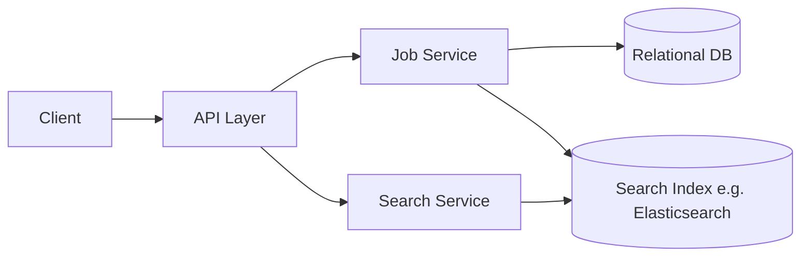

# Design a Basic Job Board

## Blogs and websites

## Medium

## Youtube

## Theory

### Problem Statement

Design a basic job board where employers can post job listings and job seekers can search/filter listings and apply.

### Functional Requirements

- Employers create/edit/close job postings (title, description, location, salary range, tags)
- Job seekers search/filter postings (keyword, location, tags)
- Job seekers apply to a posting (resume + cover note)
- Employers view applicants for their postings

### Non-Functional Requirements

- **Scale**: Tens of thousands of active postings, moderate search traffic
- **Latency**: Search < 300ms, apply < 200ms
- **Availability**: Read (search/browse) heavy, should stay available even during write spikes

### API Design

```
POST /jobs                       { title, description, location, tags[], salaryRange }
GET  /jobs?query=&location=&tags=
POST /jobs/{jobId}/apply         { resumeUrl, note }
GET  /jobs/{jobId}/applicants
```

### Data Model

```
jobs:        id (PK), employer_id, title, description, location, tags[], status, created_at
applications: id (PK), job_id (FK), applicant_id, resume_url, note, created_at
```

### High-Level Architecture



### Key Design Points

- Keep the source of truth for job postings in a relational DB, and asynchronously index new/updated postings into a search engine for fast keyword/tag/location filtering.
- Paginate search results with cursor-based pagination to keep listing pages fast as the catalog grows.
- Store resumes/attachments in blob storage (S3-like) and only keep a reference URL in the DB.

### Trade-offs

- A dedicated search index adds operational complexity but is far faster and more flexible for filtered/keyword search than relational `LIKE` queries at scale.
