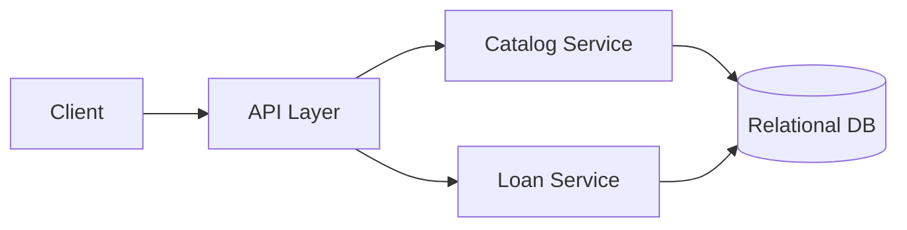

# Design a Basic Library Management System

## Blogs and websites

## Medium

## Youtube

## Theory

### Problem Statement

Design a basic library management system that tracks books, members, and book borrow/return operations, including due dates and overdue fines.

### Functional Requirements

- Catalog management (add/remove books, track copies)
- Member registration
- Borrow a book (checks availability, sets due date)
- Return a book (computes overdue fine if late)
- Search catalog by title/author/ISBN

### Non-Functional Requirements

- **Scale**: A single library or small chain, tens of thousands of books/copies
- **Consistency**: A copy must not be borrowed by two members at once
- **Latency**: Borrow/return < 200ms

### API Design

```
POST /books                     { isbn, title, author, copies }
GET  /books?query=
POST /books/{isbn}/borrow       { memberId }
POST /books/{isbn}/return       { memberId }
GET  /members/{memberId}/loans
```

### Data Model

```
books:       isbn (PK), title, author, total_copies, available_copies
loans:       id (PK), isbn (FK), member_id (FK), borrowed_at, due_at, returned_at, fine_amount
members:     id (PK), name, email
```

### High-Level Architecture



### Key Design Points

- Decrement `available_copies` atomically (`UPDATE ... WHERE available_copies > 0`) inside the same transaction that creates the loan record, to prevent over-borrowing.
- Compute overdue fines at return time based on `due_at` vs. actual return timestamp, rather than running a scheduled job to accrue fines daily (simpler for a basic system).
- Index the catalog by title/author/ISBN for fast search.

### Trade-offs

- Keeping fine calculation lazy (computed at return time) is simpler than accruing daily, but means a member's outstanding balance isn't visible until they return the book (acceptable for a basic system; an advanced version could run a daily accrual job).
