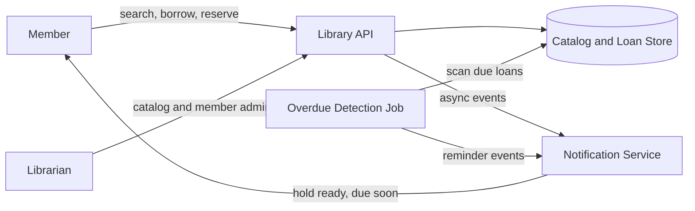
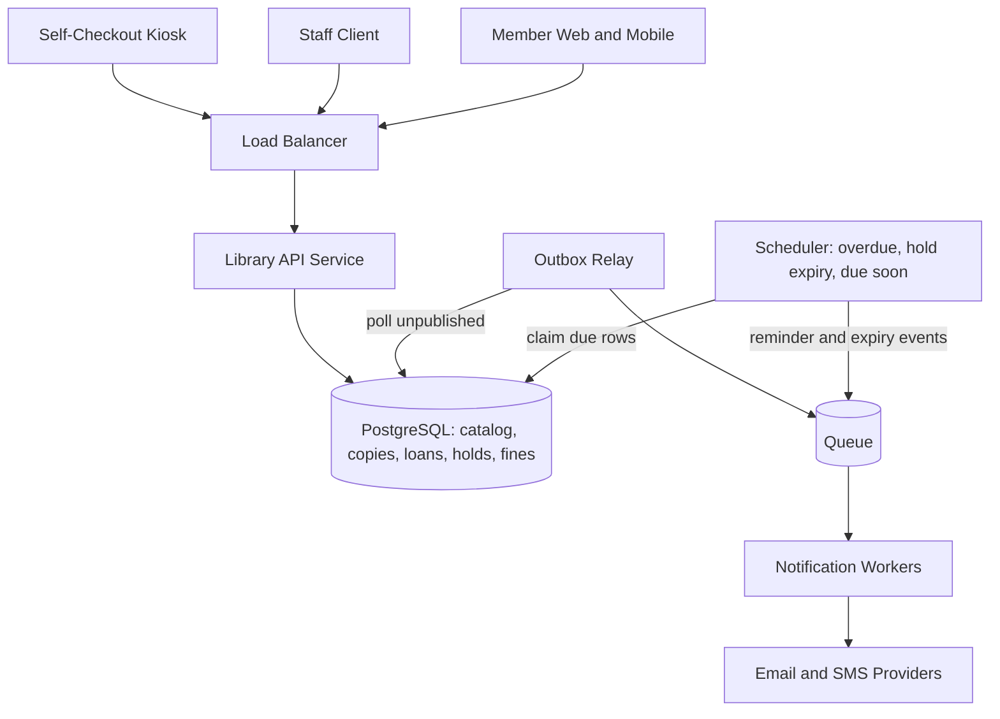
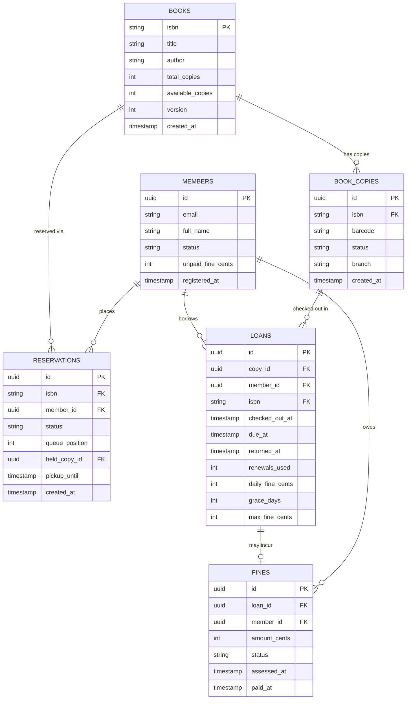
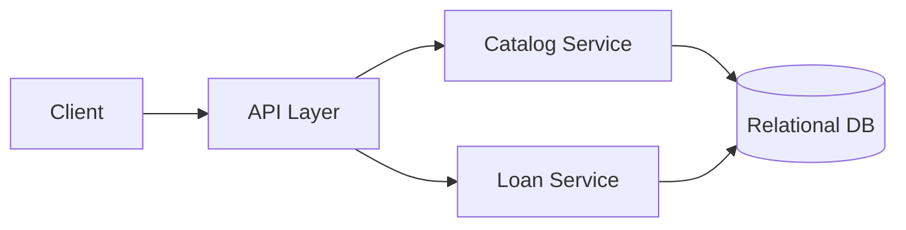
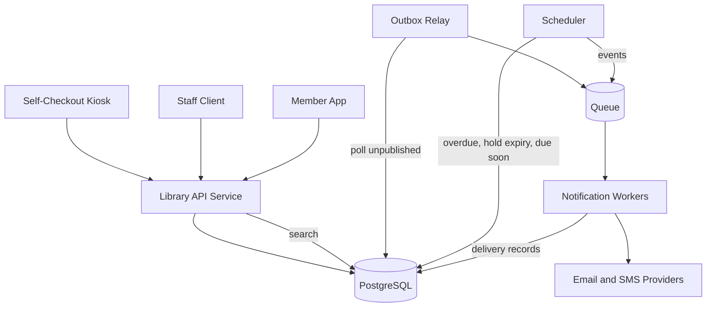
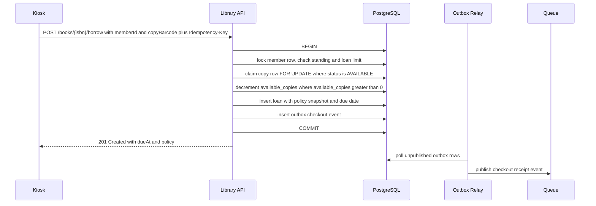
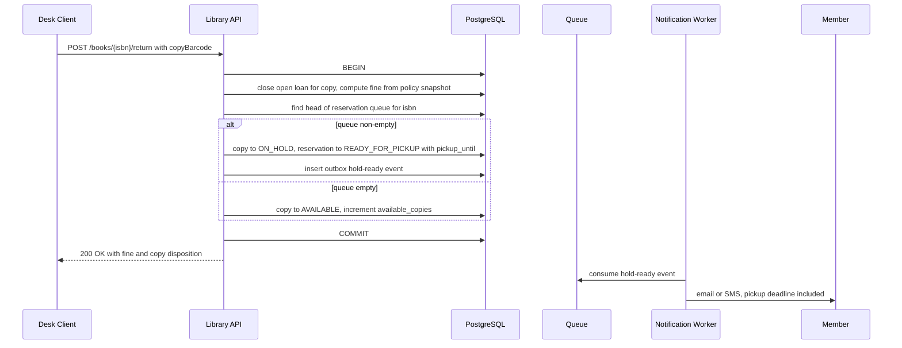
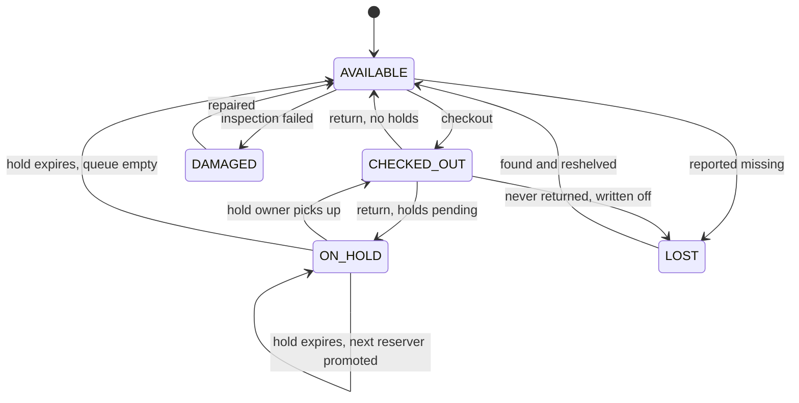

# Design a Basic Library Management System

## Blogs and websites

## Medium

## Youtube

## Theory

### Topics Covered

1. [Problem Statement](#problem-statement)
2. [Functional Requirements](#functional-requirements)
3. [Non-Functional Requirements](#non-functional-requirements)
4. [Capacity Estimation](#capacity-estimation)
5. [Characteristics](#characteristics)
6. [Components](#components)
7. [Design Patterns](#design-patterns)
8. [Benefits](#benefits)
9. [Pros](#pros)
10. [Cons](#cons)
11. [Challenges](#challenges)
12. [Best Practices](#best-practices)
13. [When to Use and When Not to Use](#when-to-use-and-when-not-to-use)
14. [Use Cases](#use-cases)
15. [API Design](#api-design)
16. [Data Modeling](#data-modeling)
17. [High-Level Design](#high-level-design)
18. [Deep Dive](#deep-dive)
19. [Java and Spring Boot Implementation Guide](#java-and-spring-boot-implementation-guide)
20. [Interview Questions and Answers](#interview-questions-and-answers)

---

### Problem Statement

Design a basic library management system that tracks books, members, and book borrow/return operations, including due dates and overdue fines.

A library system is the canonical "inventory + lending" problem. The data volumes are small and the CRUD is easy; the design value lives in three places: (1) **concurrency on a scarce resource** — a physical copy must never be lent to two members at once, even under simultaneous checkouts at multiple kiosks; (2) **time-driven behavior** — due dates, overdue detection, hold expirations, and fine computation all happen without a user request; and (3) **fair queuing** — when ten members want three copies of a new bestseller, the reservation queue decides who gets the next returned copy and must do so defensibly.

**Why this problem exists**

- Physical inventory is finite and shared; without a system of record, copies walk away and nobody knows who has what.
- Lending is a contract: due dates and fines only work if the system is the single arbiter of "who had what, when".
- Demand exceeds supply for popular titles; a reservation queue converts chaos into a fair, explainable ordering.
- Members need discovery: a catalog that cannot be searched by title/author/ISBN is a room full of boxes.

**Real-life use cases**

- **Public libraries and branch chains**: Koha, Evergreen, SirsiDynix — the open-source ILS (Integrated Library System) products are exactly this design scaled up.
- **University libraries**: semester demand spikes, course reserves with short loan periods, recall policies.
- **Corporate and school lending**: laptops, tools, lab equipment — the same model with the ISBN replaced by an asset type.
- **Digital lending**: OverDrive/lendable ebooks reuse the checkout/return/reservation model with a "concurrent copies" license instead of physical copies.



The diagram shows the three actors on the system: interactive users (members, librarians) on a synchronous API, the database as the source of truth, and a time-driven job that finds overdue loans and drives reminders without any user traffic.

---

### Functional Requirements

1. **Catalog management**
   - Add/remove books (title, author, ISBN) and track physical copies per book, each with a unique barcode.
   - Track per-book `total_copies` and `available_copies`; copies move through `AVAILABLE → CHECKED_OUT → ON_HOLD`, plus `LOST`/`DAMAGED` end states.
2. **Member registration**
   - Register members with contact details; suspend members (unpaid fines, lost items); enforce a maximum concurrent loan count.
3. **Borrow (checkout)**
   - Checks availability, member standing, and loan limits; sets a due date (default 21 days); decrements availability atomically — a copy must never be lent twice.
   - If reservations exist for the book, a returned copy can only be checked out by the member holding the earliest active hold.
4. **Return**
   - Records the return timestamp, recomputes availability, and computes an overdue fine if late; if reservations are pending, the copy goes `ON_HOLD` for the next reserver instead of back to the shelf.
5. **Reservations**
   - Members reserve a book (not a specific copy) when no copy is available; one active reservation per member per book; the queue is FIFO; holds expire after a pickup window (default 48 hours).
6. **Renewals**
   - Extend the due date (up to a limit, default 2 renewals) only if no other member has an active reservation on the book.
7. **Search**
   - Search the catalog by title, author, or ISBN, with availability shown per book.
8. **Fines**
   - Overdue fines accrue at a configurable daily rate with a grace period and a cap; members can pay or librarians can waive; checkout is blocked above an unpaid-fine threshold.

---

### Non-Functional Requirements

- **Scale**: A single library or small chain — tens of thousands of books/copies; tens of thousands of members; thousands of active loans. All data fits comfortably on one relational primary.
- **Consistency**: A copy must not be borrowed by two members at once — this is the hard requirement; availability decrements, loan creation, and reservation handoffs are atomic. Catalog search may be eventually consistent by seconds.
- **Latency**: Borrow/return under 200 ms at p99 (kiosk and desk interactions are latency-sensitive); catalog search under 300 ms at p99.
- **Reliability**: The overdue-detection and hold-expiry jobs must catch up correctly after downtime (time-based scans are naturally re-runnable); no acknowledged checkout or return is ever lost.
- **Availability**: 99.9% for checkout/return during opening hours; notification delivery may lag but must be at-least-once with deduplication.
- **Auditability and privacy**: loan history is retained for operations and disputes, but reading history is a privacy-sensitive asset — returned-loan history should be anonymizable per member policy (many real libraries purge it on return by default).
- **Security**: role-based access (member vs librarian vs admin); member PII protected; rate limiting on public search endpoints.

---

### Capacity Estimation

Back-of-envelope math for a 10-branch public library chain. The point of the exercise here is to show *how small* the numbers are — which licenses choosing correctness and simplicity over distributed-systems machinery.

**Inventory and members**

- Branches: 10. Titles: 50,000. Copies: 3 per title average → **150,000 copies**.
- Members: 40,000 registered; 15% monthly active → **6,000 monthly active members**.
- Active loans at any time: ~8,000 (average loan 21 days, ~400 checkouts/day across the chain).

**QPS**

- Checkouts: 400/day chain-wide, concentrated in opening hours (~10 h) → average **0.011 checkouts/second**, peak ~10× at Saturday noon ≈ **0.1/second**. Returns similar.
- Catalog searches: the dominant load. 6,000 active members × ~5 searches per visit × 4 visits/month ≈ 120k searches/month ≈ **0.05/second average**, peak **~1/second**. Staff terminals add ~2×.
- Total API load peaks around **5–10 QPS**. A single modest application node and one PostgreSQL primary have 100× headroom.

**Storage**

- Book row: ISBN (~13 B) + title (~80 B) + author (~50 B) + counters (~16 B) + index overhead → **~500 B per title** → 50,000 × 500 B ≈ **25 MB**.
- Copies: 150,000 × ~200 B ≈ **30 MB**. Members: 40,000 × ~500 B ≈ **20 MB**.
- Loans (retained 3 years): 400/day × 365 × 3 ≈ 440k rows × ~300 B ≈ **130 MB**. Reservations and fines: single-digit MB.
- **Total: well under 1 GB.** The entire hot dataset fits in memory; backups are seconds; there is no sharding conversation to have.

**The real capacity problems**

- **Contention, not throughput**: a new bestseller with 10 copies and 500 interested members concentrates all demand on one book row — the reservation queue (not raw QPS) is the scaling answer.
- **Job throughput**: the overdue scan touches ~8,000 active loans nightly — a single indexed query; even 100× growth keeps it trivial.
- **Search relevance**: as the catalog grows to hundreds of thousands of titles, `LIKE` scans still work (the table is tiny), but ranking quality — not performance — becomes the reason to adopt full-text search.

**Key takeaways for the interview**

- State early that scale is modest and the design budget goes to **correctness** (no double-lending), **fairness** (reservation order), and **time-driven jobs** (overdue, hold expiry).
- Quantify anyway — interviewers want to see the method even when the answer is "one node is plenty".

---

### Characteristics

- **Scarce-asset inventory with exclusive allocation**
  What it means: a copy is a physical unit that exactly one member can hold; the system must guarantee mutual exclusion over rows.
  Why it matters: the entire trust model collapses if two members believe they hold the same copy.
  How it works: atomic conditional updates (`UPDATE ... SET available = available - 1 WHERE available > 0`) and a partial unique index guaranteeing one active loan per copy.
  Example: two kiosks scan the last copy at the same second; one transaction wins, the other gets a clean `409`, not a double loan.

- **Time-driven lifecycle**
  Due dates, hold pickup windows, and fine accrual all advance with the clock, not with user actions. A scheduler must exist even on days nobody opens the app.

- **Small data, high correctness bar**
  The dataset fits in memory, so every durability and consistency choice is cheap — there is no excuse for losing a checkout or double-lending a copy.

- **Queue semantics on hot titles**
  Demand for popular books permanently exceeds supply; the reservation FIFO is the fairness mechanism, and its ordering must be explainable to a member at the desk.

- **Policy-heavy domain**
  Loan periods, renewal limits, fine rates, grace periods, and hold windows vary by library and change over time — policy belongs in configuration, not code.

- **Privacy-sensitive history**
  What a person reads is sensitive; the system should be able to forget (anonymize returned loans) while keeping operational aggregates.

- **Human-in-the-loop overrides**
  Librarians override rules daily (waive a fine, extend a loan, mark a lost copy found). Overrides are first-class audited actions, not hacks.

- **Multi-branch transfer potential**
  Even a "basic" chain implies copies moving between branches; the model should not hardcode a single location.

---

### Components

- **API layer (REST service)**
  Purpose: exposes catalog search, checkout, return, renewal, reservation, and member administration.
  Responsibilities: authentication, role-based authorization (member self-service vs librarian actions), validation, and orchestrating the atomic lending transactions.
  How it works: stateless Spring Boot service; all lending invariants enforced in the service + database, never in the client.
  Relationship: the only writer of catalog/loan state; emits events via the outbox.
  Real-world example: the self-service kiosk and staff client of an ILS like Koha both talk to one backend with this shape.

- **Catalog and loan store (relational database)**
  Purpose: durable source of truth for books, copies, members, loans, reservations, fines, and the outbox.
  Responsibilities: transactional guarantees for lending operations; constraint enforcement (one active loan per copy, non-negative availability).
  Relationship: read by the API, scanned by the scheduled jobs.
  Real-world example: PostgreSQL; the entire Koha/Evergreen ecosystem runs on relational stores.

- **Checkout/return engine (service module)**
  Purpose: the transactional core — borrow and return invariants in one place.
  Responsibilities: member standing checks, atomic availability decrement/increment, due-date computation from policy, fine computation at return, reservation handoff on return.
  Relationship: called by the API; writes loans, audit, and outbox events in single transactions.
  Real-world example: the circulation module of any ILS — "circ" is its own subsystem precisely because the invariants live here.

- **Reservation queue manager**
  Purpose: FIFO ordering of holds per book and the handoff protocol when copies free up.
  Responsibilities: enqueue with position, promote the next reserver on return (copy → `ON_HOLD`, pickup deadline, notification), expire unclaimed holds and re-promote.
  Relationship: reads/writes reservations and copies; triggered by the return path and by the hold-expiry job.
  Real-world example: the "holds" subsystem in Evergreen, including the hold-shelf expiry workflow.

- **Fine calculator**
  Purpose: deterministic computation of overdue fines from policy (rate, grace, cap).
  Responsibilities: compute at return (lazy accrual); expose estimates on demand; record payments and waivers.
  Relationship: invoked by the return engine; writes fine rows inside the return transaction.
  Real-world example: library fine schedules (for example, $0.25/day, 3-day grace, capped at replacement cost).

- **Scheduled jobs (overdue detection, hold expiry, due-soon reminders)**
  Purpose: time-driven state changes with no user traffic.
  Responsibilities: flag overdue loans and emit reminder events; expire `ON_HOLD` copies past their pickup window and promote the next reserver; send due-soon notices.
  How it works: batched pollers using `FOR UPDATE SKIP LOCKED` on time-based predicates — naturally idempotent and self-healing after downtime.
  Real-world example: the nightly cron suite every ILS runs; here, a clustered Spring scheduler instead of cron.

- **Notification service (outbox → queue → workers)**
  Purpose: hold-ready, due-soon, and overdue notices via email/SMS.
  Responsibilities: decouple delivery from the lending transactions; dedupe; retry providers.
  Relationship: downstream of every lending event; never on the synchronous path.
  Real-world example: SES/SendGrid for email, Twilio for SMS.

- **Catalog search**
  Purpose: title/author/ISBN lookup with availability.
  Responsibilities: ranked text matching (trigram similarity and/or `tsvector`), availability projection per book.
  Relationship: reads the database (the catalog is small enough that a separate search engine is optional, not required).
  Real-world example: PostgreSQL `pg_trgm` + `tsvector`; an OpenSearch tier only when discovery features (facets, fuzzy ranking) justify it.



At this scale every box except PostgreSQL can be one process; the architecture is drawn distributed so the *growth* story (more branches, digital lending, an events feed) requires no redesign — only deployment changes.

---

### Design Patterns

- **Atomic conditional update (database compare-and-set)**
  What it is: `UPDATE books SET available_copies = available_copies - 1 WHERE isbn = ? AND available_copies > 0`, then check the affected-row count.
  Problem it solves: two concurrent checkouts of the last copy must not both succeed; read-modify-write in application code has a check-then-act race.
  How it works: the predicate is evaluated under the row lock inside the update itself; exactly one of two racing updates can observe `available_copies > 0` for the final copy.
  When to use: counters and capacity columns under concurrency. When not: when you need the *identity* of the unit allocated (then claim a copy row with `FOR UPDATE SKIP LOCKED` — this design does both: claim a copy row, then decrement the counter, in one transaction).
  Advantages: no pessimistic locking across think-time, no distributed locks. Disadvantages: all contention funnels onto one row — fine at library scale.
  Real-world example: ticket inventory and stock decrement systems use the same primitive.

- **Partial unique index as an invariant backstop**
  What it is: `CREATE UNIQUE INDEX ... ON loans (copy_id) WHERE returned_at IS NULL`.
  Problem it solves: application bugs, retries, and race windows must never produce two open loans for one physical copy — make the bad state unrepresentable, not just unlikely.
  Advantages: the database enforces the rule under all code paths, including manual SQL fixes and future services. Disadvantages: PostgreSQL-specific partial-index syntax; must be migration-managed.
  Real-world example: the same trick enforces "one active reservation per member per book".

- **FIFO queue with promotion (reservation holds)**
  What it is: reservations per book ordered by creation time; a returned copy is allocated to the head of the queue, not to the shelf.
  Problem it solves: fairness and explainability for scarce popular items; "first come, first served" is the only policy a member at the desk accepts without argument.
  How it works: on return, if the queue is non-empty, the copy goes `ON_HOLD` for the head reserver with a pickup deadline; expiry promotes the next in line.
  When to use: any scarce shared resource with more demand than supply. When not: when allocation should be priority-based (a professor's course reserve jumps the queue — that is a policy flag on the reservation, not a different pattern).
  Advantages: simple, auditable, fair. Disadvantages: head-of-line blocking when the head reserver never picks up — mitigated by the expiry job.
  Real-world example: library hold shelves; the same shape as restaurant waitlists.

- **Transactional Outbox**
  What it is: the lending transaction and a "send notification" event row commit together; a relay publishes to the queue.
  Problem it solves: the dual-write problem — a checkout that commits but whose hold-ready email never publishes (or publishes for a rolled-back checkout).
  Advantages: atomicity without distributed transactions. Disadvantages: at-least-once delivery, so consumers must dedupe.
  Real-world example: Debezium CDC streaming an outbox table to Kafka.

- **Polling Publisher with row claiming (scheduled jobs)**
  What it is: `SELECT ... WHERE due_at < now() AND returned_at IS NULL ... FOR UPDATE SKIP LOCKED LIMIT N` on a schedule.
  Problem it solves: overdue detection and hold expiry must run with no user traffic and survive restarts.
  Advantages: self-healing (time-based predicates make reruns idempotent), horizontally scalable without a lock service. Disadvantages: detection granularity equals the poll interval — irrelevant for day-scale library policies.
  Real-world example: replaces the classic ILS nightly cron with a clustered scheduler.

- **State Machine (copy and loan lifecycle)**
  What it is: copies move `AVAILABLE → CHECKED_OUT → ON_HOLD → AVAILABLE` (plus `LOST`/`DAMAGED`); loans are `ACTIVE → RETURNED` with overdue as a derived flag.
  Problem it solves: prevents nonsense states (checking out an `ON_HOLD` copy reserved for someone else) by validating transitions server-side.
  Real-world example: `stateDiagram` below in Deep Dive 1; ILS circ modules are built around exactly these transitions.

- **Idempotent Consumer**
  What it is: notification workers record `(event_id, recipient)` deliveries under a unique constraint and skip duplicates.
  Problem it solves: at-least-once queues plus retries must not spam a member with three identical "hold ready" emails.
  Advantages: exactly-once effect from at-least-once transport. Disadvantages: an extra write per delivery; a bounded residual duplicate window on worker crash (named and accepted).

---

### Benefits

- **Trustworthy inventory**: the combination of atomic decrements and the partial unique index means the system *cannot* double-lend a copy — staff can trust the screen over the shelf.
- **Fair access to scarce titles**: the reservation FIFO converts "who grabbed it first at the shelf" into an explainable, auditable queue, which is a public-institution requirement, not a nicety.
- **Revenue and accountability**: automated fine computation and overdue detection recover replacement costs and return rates without librarian bookkeeping.
- **Member self-service**: search, renewal, and reservation online shrink desk queues; staff time moves to exceptions (waivers, lost items) where human judgment matters.
- **Operational visibility**: active loans, overdue counts, hold-queue depth, and fine balances are all simple queries — the data model doubles as the reporting model at this scale.
- **Policy agility**: loan periods, fine rates, and hold windows are configuration; a policy change is a deploy-free config edit, not a code change.

---

### Pros

- **Correctness is cheap at this scale**: the whole dataset fits on one PostgreSQL primary, so every invariant (one active loan per copy, non-negative availability, FIFO handoff) is enforced with transactions and constraints — no distributed coordination anywhere.
- **Simple failure story**: jobs are time-based scans that self-heal after downtime; notifications ride an outbox; there is no component whose failure loses acknowledged work.
- **Small operational footprint**: one application service, one database, one scheduler, one notification worker — a two-person team can run it.
- **Explainable to non-engineers**: FIFO holds and deterministic fines are policies a librarian can defend to a member at the desk; the system's behavior is never mysterious.
- **Extensible shape**: digital lending, inter-branch transfer, and equipment lending are the same entities with new policy values — the model generalizes without re-architecture.
- **Interview-friendly scope**: the design demonstrates transactional rigor while honestly admitting the scale is small — a strength, not an apology.

---

### Cons

- **The hot-title row**: `available_copies` on a bestseller is a contention point; at library scale it is a non-issue, but the same shape at ticket-sale scale would need per-copy claiming only (which this design also does) plus queue-first allocation.
- **Lazy fines hide balances**: computing fines at return means a member's accruing balance is invisible until return day; an on-demand estimate endpoint mitigates but does not eliminate the surprise.
- **Head-of-line blocking in the hold queue**: the next reserver has the pickup window to claim the copy; a no-show stalls one copy for up to 48 hours — the expiry job bounds it but cannot remove it.
- **Fixed policy shapes**: per-branch or per-member-type policies (students vs faculty) require a policy-resolution layer the basic design only sketches via configuration keys.
- **Single-database ceiling**: fine for a chain, but a national consortium (thousands of branches, union catalog) would need federation or sharding by branch — acknowledged as out of scope.
- **Privacy/utility tension**: anonymizing returned-loan history protects members but destroys the data that recommendation and demand-planning features want; the basic design chooses privacy by default.
- **Offline kiosks are hard**: self-checkout hardware with intermittent connectivity cannot run the online invariants; the honest basic answer is "kiosk queues intents and syncs", which accepts a small double-lend risk window — flagged, not solved.

---

### Challenges

- **Technical**: keeping the four-write checkout transaction (claim copy row + decrement counter + insert loan + outbox event) atomic and fast; ensuring the reservation handoff on return cannot be bypassed by a direct checkout of an `ON_HOLD` copy.
- **Scalability**: not request volume but *contention shape* — bestseller demand spikes concentrate on one book row and one hold queue; the design must keep checkout latency flat when 300 members reserve the same title in a week.
- **Performance**: catalog search quality/perf as the catalog grows (`ILIKE '%term%'` scans; trigram indexes fix prefix-free substring search; `tsvector` adds stemming and ranking); the overdue scan and hold-expiry scan must stay index-only via partial indexes as loan history accumulates.
- **Reliability**: scheduler downtime (a long weekend outage) must not miss or double-process overdue loans — time-based predicates give rerun safety; provider outages must not block returns.
- **Maintainability**: policy sprawl (rates, periods, windows per branch and item type) must be configuration-driven, or every policy tweak becomes a release; the copy state machine must stay the single validator as new flows (transfers, repairs) are added.
- **Operational**: kiosk hardware and network flakiness at branches; barcode-scanner double-scans requiring idempotent checkout; printer/RFID integration quirks at the desk.
- **Security and privacy**: member PII and reading history are sensitive (in some jurisdictions, library records have special legal protection); role-based access so members never see others' loans; anonymization jobs must be verifiable.

---

### Best Practices

- **Enforce "one active loan per copy" in the database, not the code** — a partial unique index makes the catastrophic state unrepresentable, so retries, bugs, future services, and manual SQL cannot violate it. Application checks alone always have a race window.
- **Claim the specific copy and decrement the counter in one transaction** — the counter drives fast availability display; the copy row drives truth. Splitting them across transactions creates a window where the catalog says "1 available" but no copy can be claimed (or the reverse).
- **Make every scheduled job a time-based scan** — `due_at < now()` and `pickup_until < now()` predicates are idempotent by nature: rerun after downtime and the job catches up exactly once in effect. State-machine-driven jobs with "processed" flags accumulate drift and missed rows.
- **Compute money deterministically from stored inputs** — fines derive from `due_at`, `returned_at`, and a versioned policy snapshot stored on the loan (rate at checkout time). Recomputing with *today's* rate against *last year's* loan is a dispute generator; storing the policy snapshot makes every fine explainable cent by cent.
- **Put policy in configuration, versioned** — loan period, renewal cap, fine rate, grace, hold window: members and staff will ask for exceptions weekly; config (with an audit trail of changes) turns those into operations, not engineering.
- **Route all side effects through the outbox** — hold-ready emails, due-soon reminders: if it is not in the same transaction as the state change, it will eventually be lost or duplicated in a way a member notices.
- **Validate the copy state machine server-side on every transition** — desk scanners, kiosks, the public API, and future batch imports all mutate copies; one shared validator is the only way the states stay meaningful.
- **Anonymize reading history by default, keep aggregates** — retain per-copy circulation counts (needed for purchasing decisions) while breaking the member-to-title link on returned loans; privacy by default is cheaper than a retrofitted anonymization project after a records request.
- **Return `409` with a reason code, not a silent failure, on lost races** — the second kiosk to scan the last copy should say "no longer available" immediately; silent retries in a lending system create double-lending by accident.

---

### When to Use and When Not to Use

**Use this design when**

- A single library, school, or small chain needs catalog + circulation + holds + fines with strong correctness and a small team to run it.
- The "exclusive allocation of a scarce physical asset" shape fits: equipment rooms, tool libraries, lab gear, loaner laptops.
- Policy variability matters more than scale: the configuration-driven policy layer is the product.
- Auditability and privacy are both required — the model supports a complete operational history with privacy-preserving anonymization of member-linked history.

**Do not use this design when**

- The asset is not exclusive — streaming, open-access digital content, or unlimited-seat licenses have no scarcity; the entire checkout/reservation apparatus is overhead.
- Allocation must be priority- or auction-based rather than FIFO (emergency equipment triage, priced reservations) — the queue becomes a different data structure with different invariants.
- Scale is marketplace-class (millions of concurrent users reserving millions of units with sub-second contention) — the single-row counter pattern needs per-unit claiming and partitioned queues from the start.
- Offline-first operation is the norm (field equipment with no connectivity for weeks) — online invariants cannot be enforced, and the design must shift to intent-logging with reconciliation, which is a different system.

**Trade-offs (preserved from the original design)**

- Keeping fine calculation lazy (computed at return time) is simpler than accruing daily, but means a member's outstanding balance isn't visible until they return the book (acceptable for a basic system; an advanced version could run a daily accrual job).

---

### Use Cases

**1. Public library branch chain (the base case)**

- Problem: ten branches share one collection; members place holds online and pick up at their branch; staff need one source of truth for "where is every copy".
- Solution: exactly this design — one catalog, per-copy barcodes with branch location, FIFO holds with 48-hour pickup windows, automated overdue and due-soon notices.
- Why suitable: scale is squarely in the single-primary comfort zone; the correctness story (no double-lending, explainable hold order) is what a public institution is judged on.
- How it works: returns at any branch trigger the hold handoff (or shelf restock); a later inter-branch transfer flow moves `ON_HOLD` copies to the pickup branch with the same state machine.
- Trade-offs: no union catalog with neighboring systems (inter-library loan is manual); accepted for scope.

**2. University library with course reserves**

- Problem: semester starts produce 10× demand spikes on 200 assigned-reading titles; fairness complaints follow; faculty need guaranteed short-loan copies.
- Solution: the same model with policy profiles — course-reserve copies get a 3-hour loan period, no renewals, and a priority flag that lets faculty holds jump the FIFO.
- Why suitable: the policy-as-configuration layer absorbs the special rules without new code; the state machine unchanged; the hot-title contention story is directly exercised.
- How it works: at checkout, the loan copies the policy snapshot (3-hour period, no renewal); the reservation matcher respects the priority flag before FIFO order.
- Trade-offs: priority jumps make the queue not purely FIFO — explainability suffers slightly, so priority usage is audited; fines accrue hourly for reserves, exercising the configurable rate path.

**3. Corporate equipment lending (laptops, cameras, lab tools)**

- Problem: a 2,000-person company loses track of loaner equipment; IT spreadsheets are always wrong; nobody knows who has the last MacBook charger.
- Solution: the book becomes an asset type, the copy becomes an asset tag, the member becomes an employee; loans have no fines but an escalation ladder (overdue → manager notification → payroll flag per policy).
- Why suitable: identical invariants (exclusive allocation, due dates, reservations for scarce gear); privacy defaults are even more valued (no reading history, but checkout history is needed for asset recovery).
- How it works: badge-scan checkout at a kiosk; the overdue job escalates instead of fining; reservations queue for high-demand items (VR headsets before demos).
- Trade-offs: integration with the HR directory replaces member registration; fine machinery is configured to zero-rate — kept in the model because deposit-fee use cases exist.

**4. School library with class-set bulk checkout**

- Problem: a teacher checks out 30 copies of the same novel for a class in one action; desk-by-desk scanning is too slow; returns come back in batches with a few missing.
- Solution: a bulk-checkout endpoint that claims N available copies of one title in a single transaction (all-or-nothing), creates 30 loans to the class account, and prints one due date.
- Why suitable: the atomic-claim primitive (`FOR UPDATE SKIP LOCKED LIMIT 30`) is exactly the per-copy claiming the design already uses; all-or-nothing semantics prevent partial class sets.
- How it works: the endpoint claims 30 copy rows, decrements the counter by 30, and inserts 30 loans in one transaction; returns are processed per copy, and the missing-copy report is a query on unreturned loans by class account.
- Trade-offs: a class account (not a person) holds loans — member standing rules are adjusted by policy; the bulk transaction holds up to 30 row locks, which is fine at this scale and would be the first thing to revisit at 100×.

---

### API Design

REST, JSON, versioned under `/api/v1`. Timestamps are ISO-8601 UTC. `Authorization: Bearer <JWT>` on everything except public catalog search; roles (`MEMBER`, `LIBRARIAN`, `ADMIN`) gate mutations.

**Core endpoints (preserved from the original design, extended)**

```
POST   /api/v1/books                        catalog a title (librarian)
GET    /api/v1/books?query=                 search by title/author/ISBN
POST   /api/v1/books/{isbn}/borrow          checkout { memberId } (desk/kiosk)
POST   /api/v1/books/{isbn}/return          return { memberId, copyBarcode }
GET    /api/v1/members/{memberId}/loans     a member's loans (self or staff)
POST   /api/v1/books/{isbn}/reservations    place a hold (member)
DELETE /api/v1/reservations/{id}            cancel a hold
POST   /api/v1/loans/{loanId}/renew         renew if eligible
GET    /api/v1/members/{memberId}/fines     outstanding fines
POST   /api/v1/fines/{fineId}/pay           record a payment (desk)
POST   /api/v1/fines/{fineId}/waive         waive with reason (librarian, audited)
```

**Checkout**

`POST /api/v1/books/{isbn}/borrow`

```json
{ "memberId": "m-7712", "copyBarcode": "COPY-0042-9917" }
```

Validation: member exists, is not suspended, has fewer than `max-loans` active loans, and unpaid fines below the block threshold; the copy is `AVAILABLE` and — if holds exist — the member holds the earliest active `READY_FOR_PICKUP` hold for this title. The transaction claims the copy row, decrements `available_copies`, inserts the loan with the policy snapshot, and writes the outbox event.

Response `201 Created`:

```json
{
  "loanId": "ln-8f3a1c2e",
  "isbn": "9780132350884",
  "copyBarcode": "COPY-0042-9917",
  "memberId": "m-7712",
  "checkedOutAt": "2026-06-10T14:30:00Z",
  "dueAt": "2026-07-01T23:59:59Z",
  "renewalsRemaining": 2,
  "policy": { "loanDays": 21, "dailyFineCents": 25, "graceDays": 3, "maxFineCents": 4500 }
}
```

**Return**

`POST /api/v1/books/{isbn}/return` with `{ "memberId": "m-7712", "copyBarcode": "COPY-0042-9917" }` — closes the open loan for that copy, computes the fine from the stored policy snapshot, then either restocks the copy or places it `ON_HOLD` for the head of the reservation queue.

Response `200 OK`:

```json
{
  "loanId": "ln-8f3a1c2e",
  "returnedAt": "2026-07-06T10:05:00Z",
  "daysOverdue": 4,
  "fine": { "fineId": "fn-22aa", "amountCents": 25, "currency": "USD", "reason": "1 billable day beyond 3-day grace at 25 cents" },
  "copyDisposition": "ON_HOLD",
  "heldFor": { "reservationId": "rs-99bc", "pickupUntil": "2026-07-08T10:05:00Z" }
}
```

**Search**

`GET /api/v1/books?query=clean+code&cursor=...&limit=25` — ranked title/author matches plus exact ISBN match short-circuit; each result embeds `totalCopies`, `availableCopies`, and `activeHolds` so a member sees "0 available, 12 holds" before bothering to reserve. Cursor pagination (keyset on `(title, isbn)`) — offset pagination duplicates rows when a librarian catalogs during a search session.

**Errors and status codes**

RFC 7807 problem details. `400` validation; `401`/`403` auth and role failures (a member cannot waive a fine); `404` unknown ISBN/member/loan; `409` lost race (`COPY_NOT_AVAILABLE`, `MEMBER_LIMIT_EXCEEDED`, `UNPAID_FINES_BLOCKED`) with a machine-readable `code` so kiosks render the right message; `422` invalid state (`RENEWAL_BLOCKED_BY_HOLDS`); `429` rate limited with `Retry-After`.

```json
{
  "type": "https://api.example.org/problems/copy-not-available",
  "title": "Copy not available",
  "status": 409,
  "code": "COPY_NOT_AVAILABLE",
  "detail": "Copy COPY-0042-9917 is ON_HOLD for another member until 2026-07-08T10:05:00Z"
}
```

**Cross-cutting concerns**

- **Idempotency**: checkout and return accept `Idempotency-Key`; kiosk scanners double-fire constantly, so a duplicate scan within the key's 24-hour window replays the original response instead of erroring or double-processing.
- **Optimistic concurrency**: librarian edits to catalog records send `If-Match` with the entity version; mismatches get `409`.
- **Rate limiting**: generous on search (public), strict on mutations; per-member and per-terminal buckets.
- **Versioning**: URI `v1`; additive fields ship freely; breaking changes get `v2` with overlap support.
- **Auth**: JWT with role claims; member-scoped endpoints (`/members/{id}/...`) check that the token's member ID matches the path unless the role is staff.

---

### Data Modeling

**Entities and relationships**

A book (title) has many physical copies; a member has many loans and reservations; a copy participates in at most one *active* loan; a loan may produce one fine; a reservation references a book and a member, never a specific copy (any copy satisfies the hold).



**Original minimal schema (preserved)**

```
books:       isbn (PK), title, author, total_copies, available_copies
loans:       id (PK), isbn (FK), member_id (FK), borrowed_at, due_at, returned_at, fine_amount
members:     id (PK), name, email
```

The enhanced model keeps these three tables and adds what the requirements imply: physical `book_copies` (a title with 3 copies cannot be tracked on the title row alone), `reservations` (functional requirement 5), a normalized `fines` table (a fine has its own lifecycle — assessed, paid, waived — that a loan column cannot express), and the **policy snapshot columns** on `loans` (`daily_fine_cents`, `grace_days`, `max_fine_cents`) so a fine computed next year uses the rate in force at checkout.

**Keys, constraints, indexes**

- PKs: natural key `isbn` for books (stable, universally meaningful); surrogate UUIDs elsewhere.
- `UNIQUE (barcode)` on copies — a barcode is a physical identity; duplicates are data errors.
- Check constraints: `available_copies BETWEEN 0 AND total_copies`; copy `status IN ('AVAILABLE','CHECKED_OUT','ON_HOLD','LOST','DAMAGED')`; reservation `status IN ('ACTIVE','READY_FOR_PICKUP','FULFILLED','CANCELLED','EXPIRED')`.
- **Partial unique indexes (the invariants)**:
  - `UNIQUE (copy_id) ON loans WHERE returned_at IS NULL` — one active loan per physical copy, enforced under every code path.
  - `UNIQUE (isbn, member_id) ON reservations WHERE status IN ('ACTIVE','READY_FOR_PICKUP')` — one live hold per member per book.
- Indexes:
  - `loans (member_id, returned_at)` — member loan views, current and history.
  - `loans (due_at) WHERE returned_at IS NULL` — the overdue scan (partial: closed loans never bloat it).
  - `reservations (isbn, queue_position) WHERE status = 'ACTIVE'` — head-of-queue lookup on return.
  - `reservations (pickup_until) WHERE status = 'READY_FOR_PICKUP'` — the hold-expiry scan.
  - `book_copies (isbn, status)` — "claim an available copy of this title".
  - Search: `pg_trgm` GIN on `title` and `author` for substring matching; `tsvector` GIN for ranked full text once catalog size justifies it.

**Normalization**

The model is 3NF with two deliberate denormalizations, both maintained transactionally:

1. `books.available_copies` — derivable as `count(copies WHERE status = 'AVAILABLE')`, but stored so availability display and the atomic decrement are single-row operations. The invariant (`available_copies` equals the count) is maintained inside every checkout/return transaction and verified by a nightly reconciliation job.
2. The loan's **policy snapshot** columns — copied from policy config at checkout. Technically redundant with the config, deliberately so: fines must be computed against the policy the member agreed to, not whatever the policy is edited to later.

**Data lifecycle**

- Returned loans: retained 3 years for operations; then anonymized (member link broken, per-copy circulation counts kept) per the privacy-by-default stance — configurable per jurisdiction.
- Fines: retained while unpaid + statutory retention after payment; waivers are audited with the librarian's identity and reason.
- Reservations: fulfilled/cancelled/expired rows retained 1 year for fairness disputes.
- Members: deletion anonymizes PII; unpaid-fine rows survive anonymization as obligations.

**Scaling notes**

No partitioning is *needed* at this scale; the growth order is: read replicas for search traffic → move search to OpenSearch when discovery features demand it → if a consortium ever forms, federate per-branch catalogs with a union search layer rather than sharding loans (loans are branch-local by nature).

---

### High-Level Design

**Original simplified architecture (preserved)**



This sketch captures the two service concerns — catalog and circulation — over one relational store. The full design adds the reservation/hold machinery, the scheduled jobs, and asynchronous notifications, while keeping the single-database core.

**Major components and responsibilities**

1. Clients — member web/mobile, staff desk client, self-checkout kiosk.
2. Library API service — catalog, checkout/return, renewals, reservations, fines; enforces all lending invariants.
3. PostgreSQL — source of truth; constraints enforce the non-negotiables.
4. Outbox relay + queue — async side effects (hold-ready, due-soon, overdue notices).
5. Notification workers — render and deliver via email/SMS with dedup.
6. Scheduler — overdue scan, hold-expiry scan, due-soon reminders, nightly availability reconciliation.
7. Search — PostgreSQL trigram/tsvector at this scale, with an OpenSearch upgrade path.

**Full architecture**



Reads and writes share one primary at this scale — the 100× headroom from the capacity section is why no replica or cache is drawn; they are named as the first two growth levers, not pre-installed.

**Checkout flow**



Every guard (member standing, copy status, counter predicate) is evaluated inside one transaction; a `409` at any step rolls back cleanly with a machine-readable reason. The kiosk never retries blindly — it replays the idempotency key.

**Return flow with reservation handoff**



The handoff decision (hold vs shelf) is made in the same transaction that closes the loan — there is no window in which a returned copy is both on the shelf and promised to a reserver. The `ON_HOLD` copy cannot be checked out by anyone except the hold owner; the state machine rejects it.

**Scaling strategy**

Vertical first (the dataset is sub-gigabyte), then read replicas for search-heavy traffic, then OpenSearch for discovery features. The scheduler and notification workers scale by replica count with `SKIP LOCKED` work-sharing. Nothing in the design requires distribution at the target scale; every scaling lever is additive.

**Failure handling**

- API crash mid-checkout: transaction rolls back; no loan, no phantom counter change, no event.
- Kiosk double-scan: idempotency key replays the original `201`; the partial unique index is the absolute backstop.
- Scheduler down for a weekend: overdue and hold-expiry scans are time-predicated, so Monday's run catches everything exactly once in effect.
- Notification provider outage: queue backs up; workers retry with backoff; lending operations are unaffected because they never call providers inline.
- Reconciliation drift (counter vs copy rows): the nightly job recomputes `available_copies` from copy rows and alerts on mismatch — the counter is a cache of an invariant, not the truth.

---

### Deep Dive

#### 1. Checkout/return transactions and concurrency on book copies

The original design's key point, preserved: decrement `available_copies` atomically (`UPDATE ... WHERE available_copies > 0`) inside the same transaction that creates the loan record, to prevent over-borrowing.

The full concurrency story has three layers, and an interview answer should name all three:

- **Layer 1 — claim the physical copy**: `SELECT ... FROM book_copies WHERE isbn = ? AND status = 'AVAILABLE' ORDER BY barcode LIMIT 1 FOR UPDATE SKIP LOCKED`. This locks one specific copy row and skips rows other transactions hold, so two kiosks never claim the same copy and never block each other on different copies of the same title.
- **Layer 2 — decrement the display counter**: the conditional `UPDATE books ... WHERE available_copies > 0` keeps the fast availability number honest; affected-row-count zero means roll back with `409`.
- **Layer 3 — the database backstop**: the partial unique index `UNIQUE(copy_id) WHERE returned_at IS NULL` makes double-lending unrepresentable even if a future code path forgets layers 1 and 2 (a batch importer, a manual SQL fix).

Why not just `SELECT FOR UPDATE` the book row and serialize everything on it? Because that funnels *all* checkouts of a hot title through one row lock — the exact bestseller case. Claiming copy rows spreads lock contention across the copies; the counter update is the only shared lock and it is held for microseconds inside the transaction.

Copy lifecycle, validated server-side everywhere:



Two transitions deserve note: `ON_HOLD → CHECKED_OUT` is allowed *only* for the member owning the ready hold (enforced in the checkout service, not just the state machine), and `LOST → AVAILABLE` exists because libraries find "lost" books constantly — never model lost as terminal.

#### 2. Reservation queues

- **Reserve the title, not the copy**: members cannot pick copy #3 vs copy #7; any returned copy satisfies the head hold. This is what keeps the model simple and the queue fair — per-copy queues would fragment demand and strand copies.
- **Queue position**: stored as an integer per book (gaps tolerated, order is what matters); "you are 4th of 12" is a count query on `reservations WHERE isbn = ? AND status = 'ACTIVE' AND queue_position < mine` — cheap because of the partial index.
- **The handoff protocol**: on return, head reserver gets the copy as `ON_HOLD` with `pickup_until = now + hold window` and a notification; if the window lapses, the expiry job marks the reservation `EXPIRED` and re-runs the handoff for the next reserver (or restocks the copy if the queue drained).
- **Checkout gating**: a copy of a title with active holds is never shelf-available — the return path already routed it. The subtle case is a copy that *becomes* available while a hold exists (hold placed after the copy was shelved): a periodic matcher (same scheduler, minute-scale) sweeps `AVAILABLE` copies against active queues and converts them to holds. Name this sweep in an interview; it is the fix for the "shelved but reserved" inconsistency.
- **Fairness levers**: one live hold per member per book (partial unique index) prevents squatting; cancellation is free (encourages releasing unwanted holds); priority flags (faculty course reserve) are audited exceptions layered on FIFO, not a replacement for it.
- **Why not a broker queue for holds?** The queue is queryable business state ("what position am I?", "how many holds on this title?") — it belongs in the database. The message queue only carries the *notifications about* hold state changes.

#### 3. Fine calculation

The original trade-off, preserved and extended: compute fines at return time (lazy) rather than accruing daily via a scheduled job — simpler, but balances are invisible until return.

- **The formula**: `billable_days = max(0, calendar_days_overdue - grace_days)`; `fine = min(billable_days × daily_rate, max_fine)`. Computed from the **policy snapshot stored on the loan at checkout** — never from current config — so a rate change cannot retroactively reprice existing loans.
- **Why lazy is right here**: fine *accrual* is a write-amplifying daily job (thousands of rows updated nightly to track pennies) whose only benefit is balance visibility. The cheaper answer to visibility is an **estimate endpoint**: `GET /members/{id}/loans` computes `as-of-now` fines on the fly for active loans (same deterministic function, no persistence). Members see accruing balances; the database stays append-mostly.
- **When the accrual job is actually needed**: when unpaid-fine thresholds must block checkout *before* return (a member 60 days overdue on five books should be blocked today, not at return). The basic design approximates this by counting overdue days at checkout-time validation; the accrual job is the named upgrade.
- **Payments and waivers**: fines are their own entity with `ASSESSED → PAID | WAIVED`; waivers require a librarian and a reason, and are audited — fine revenue is a real budget line and waiving is exactly where abuse hides.
- **Edge cases**: closed days (holidays) — a per-branch calendar table subtracts closed days from `calendar_days_overdue`; returned-but-damaged is a separate damage fee, not an overdue fine; `max_fine` is typically capped at replacement cost, after which the copy transitions to `LOST` and the fine converts to a replacement charge.

#### 4. Overdue detection job

- **The scan**: `SELECT ... FROM loans WHERE returned_at IS NULL AND due_at < now() ORDER BY due_at LIMIT :batch FOR UPDATE SKIP LOCKED`, run every few minutes (or nightly — policy granularity is days, so frequency is cheap to choose). The partial index on `(due_at) WHERE returned_at IS NULL` makes this an index-only scan over exactly the overdue set.
- **What it does per loan**: writes a reminder/escalation event to the outbox (day 1 overdue: gentle email; day 7: second notice; day 30: final notice and convert toward replacement charge) — escalation stage tracked on the loan so reruns are idempotent per stage.
- **Why time-based predicates beat processed flags**: a flag-based job that crashes after flagging-but-before-notifying has lost work; a time-based job re-derives the target set from the calendar every run and catches up exactly once in effect, with the escalation stage column preventing duplicate notices for the same threshold.
- **Due-soon reminders** are the same job with the predicate inverted (`due_at BETWEEN now() AND now() + 3 days` and a `due_soon_notified` flag — a flag is fine here because a *missed* reminder is harmless, unlike a missed escalation).
- **Member standing**: the job also refreshes a denormalized `has_overdue` on members so checkout validation is a column check, not a join over loans — this is a deliberate denormalization with the job as its reconciler.

#### 5. Renewal rules and the race with reservations

- **The rule**: renewal extends `due_at` by one loan period, up to `renewals_remaining`, **only if no other member holds an active reservation** on the title. The reservation check must be inside the renewal transaction — check-then-renew in two steps has a race (a hold placed between check and update would be silently violated).
- **Implementation**: `UPDATE loans SET due_at = due_at + interval '21 days', renewals_used = renewals_used + 1 WHERE id = ? AND returned_at IS NULL AND renewals_used < :cap AND NOT EXISTS (SELECT 1 FROM reservations WHERE isbn = loans.isbn AND status IN ('ACTIVE','READY_FOR_PICKUP'))` — one statement, zero races, affected-row zero maps to `422 RENEWAL_BLOCKED_BY_HOLDS`.
- **Why extend from `due_at`, not from `now()`**: renewing early should not penalize the member (renewal from `now()` would shorten the total borrow time for early renewals); extend from the existing due date and cap total duration by the renewal count.
- **The lost-race case**: a hold arrives one millisecond after a renewal commits — fine, the hold waits for the new due date; that is the documented semantics. What must never happen is the reverse interleaving (renewal commits despite a committed hold), which the single-statement form makes impossible.

---

### Java and Spring Boot Implementation Guide

Production-oriented skeleton: Spring Boot 3.x, Java 17+, Spring Data JPA, Bean Validation. Beans use constructor injection; policy is externalized via `@Value`/`@ConfigurationProperties`; DTOs are records; Flyway owns the schema (`ddl-auto: validate`), including the partial indexes Hibernate cannot express.

#### 1. JPA entities

```java
import jakarta.persistence.*;
import java.time.Instant;
import java.util.UUID;

@Entity
@Table(name = "loans", indexes = {
    @Index(name = "idx_loans_member", columnList = "member_id, returned_at")
})
public class LoanEntity {

    @Id
    private UUID id;

    @Column(name = "copy_id", nullable = false)
    private UUID copyId;

    @Column(name = "member_id", nullable = false)
    private UUID memberId;

    @Column(name = "isbn", nullable = false, length = 13)
    private String isbn;

    @Column(name = "checked_out_at", nullable = false)
    private Instant checkedOutAt = Instant.now();

    @Column(name = "due_at", nullable = false)
    private Instant dueAt;

    @Column(name = "returned_at")
    private Instant returnedAt;

    @Column(name = "renewals_used", nullable = false)
    private int renewalsUsed = 0;

    // policy snapshot captured at checkout — fines are computed from these, never from live config
    @Column(name = "daily_fine_cents", nullable = false)
    private int dailyFineCents;

    @Column(name = "grace_days", nullable = false)
    private int graceDays;

    @Column(name = "max_fine_cents", nullable = false)
    private int maxFineCents;

    @Column(name = "escalation_stage", nullable = false)
    private int escalationStage = 0;

    protected LoanEntity() {
        // for JPA
    }

    public LoanEntity(UUID copyId, UUID memberId, String isbn, Instant dueAt,
                      int dailyFineCents, int graceDays, int maxFineCents) {
        this.id = UUID.randomUUID();
        this.copyId = copyId;
        this.memberId = memberId;
        this.isbn = isbn;
        this.dueAt = dueAt;
        this.dailyFineCents = dailyFineCents;
        this.graceDays = graceDays;
        this.maxFineCents = maxFineCents;
    }

    public boolean isOpen() {
        return returnedAt == null;
    }

    public void close(Instant returnedAt) {
        this.returnedAt = returnedAt;
    }

    // getters omitted for brevity
}

enum CopyStatus { AVAILABLE, CHECKED_OUT, ON_HOLD, LOST, DAMAGED }
enum ReservationStatus { ACTIVE, READY_FOR_PICKUP, FULFILLED, CANCELLED, EXPIRED }
enum FineStatus { ASSESSED, PAID, WAIVED }
```

The two partial unique indexes that carry the invariants are migration artifacts, because Hibernate cannot express them:

```sql
CREATE UNIQUE INDEX uq_one_open_loan_per_copy
    ON loans (copy_id) WHERE returned_at IS NULL;

CREATE UNIQUE INDEX uq_one_live_hold_per_member_book
    ON reservations (isbn, member_id)
    WHERE status IN ('ACTIVE', 'READY_FOR_PICKUP');

CREATE INDEX idx_loans_overdue_scan
    ON loans (due_at) WHERE returned_at IS NULL;
```

#### 2. DTOs and validation

```java
import jakarta.validation.constraints.NotBlank;
import jakarta.validation.constraints.NotNull;
import jakarta.validation.constraints.Pattern;
import jakarta.validation.constraints.Size;
import java.time.Instant;
import java.util.UUID;

public record CheckoutRequest(
    @NotNull UUID memberId,
    @NotBlank @Size(max = 40) String copyBarcode
) {}

public record ReturnRequest(
    @NotNull UUID memberId,
    @NotBlank @Size(max = 40) String copyBarcode
) {}

public record CatalogBookRequest(
    @NotBlank @Pattern(regexp = "\\d{13}") String isbn,
    @NotBlank @Size(max = 300) String title,
    @NotBlank @Size(max = 200) String author,
    @Size(max = 40) List<String> copyBarcodes
) {}

public record LoanResponse(
    UUID loanId,
    String isbn,
    String copyBarcode,
    Instant checkedOutAt,
    Instant dueAt,
    int renewalsRemaining
) {}

public record ReturnResponse(
    UUID loanId,
    Instant returnedAt,
    long daysOverdue,
    Integer fineAmountCents,
    String copyDisposition
) {}
```

Records give immutable, compact JSON mapping; `@Pattern` enforces ISBN-13 shape at the edge before the service is ever invoked.

#### 3. Controller

```java
import jakarta.validation.Valid;
import org.springframework.http.HttpStatus;
import org.springframework.http.ResponseEntity;
import org.springframework.web.bind.annotation.*;

@RestController
@RequestMapping("/api/v1")
public class CirculationController {

    private final CirculationService circulationService;
    private final ReservationService reservationService;

    public CirculationController(CirculationService circulationService,
                                 ReservationService reservationService) {
        this.circulationService = circulationService;
        this.reservationService = reservationService;
    }

    @PostMapping("/books/{isbn}/borrow")
    public ResponseEntity<LoanResponse> checkout(
            @PathVariable String isbn,
            @Valid @RequestBody CheckoutRequest request,
            @RequestHeader(value = "Idempotency-Key", required = false) String idempotencyKey) {
        var loan = circulationService.checkout(isbn, request, idempotencyKey);
        return ResponseEntity.status(HttpStatus.CREATED).body(loan);
    }

    @PostMapping("/books/{isbn}/return")
    public ReturnResponse returnBook(
            @PathVariable String isbn,
            @Valid @RequestBody ReturnRequest request) {
        return circulationService.returnBook(isbn, request);
    }

    @PostMapping("/books/{isbn}/reservations")
    public ResponseEntity<ReservationResponse> reserve(
            @PathVariable String isbn,
            @RequestHeader("X-Member-Id") UUID memberId) {
        var reservation = reservationService.placeHold(isbn, memberId);
        return ResponseEntity.status(HttpStatus.CREATED).body(reservation);
    }

    @PostMapping("/loans/{loanId}/renew")
    public LoanResponse renew(@PathVariable UUID loanId,
                              @RequestHeader("X-Member-Id") UUID memberId) {
        return circulationService.renew(loanId, memberId);
    }
}
```

`X-Member-Id` is populated by the authentication filter from the validated JWT; desk operations (checkout/return) are staff-authorized and carry the member explicitly in the body.

#### 4. Checkout service

```java
import org.springframework.beans.factory.annotation.Value;
import org.springframework.stereotype.Service;
import org.springframework.transaction.annotation.Transactional;
import java.time.Instant;
import java.time.temporal.ChronoUnit;

@Service
public class CirculationService {

    private final BookRepository bookRepository;
    private final CopyRepository copyRepository;
    private final MemberRepository memberRepository;
    private final LoanRepository loanRepository;
    private final ReservationRepository reservationRepository;
    private final OutboxRepository outboxRepository;
    private final FineCalculator fineCalculator;
    private final int loanDays;
    private final int maxLoansPerMember;
    private final int dailyFineCents;
    private final int graceDays;
    private final int maxFineCents;
    private final int holdPickupHours;

    public CirculationService(
            BookRepository bookRepository,
            CopyRepository copyRepository,
            MemberRepository memberRepository,
            LoanRepository loanRepository,
            ReservationRepository reservationRepository,
            OutboxRepository outboxRepository,
            FineCalculator fineCalculator,
            @Value("${library.policy.loan-days:21}") int loanDays,
            @Value("${library.policy.max-loans-per-member:10}") int maxLoansPerMember,
            @Value("${library.policy.daily-fine-cents:25}") int dailyFineCents,
            @Value("${library.policy.grace-days:3}") int graceDays,
            @Value("${library.policy.max-fine-cents:4500}") int maxFineCents,
            @Value("${library.policy.hold-pickup-hours:48}") int holdPickupHours) {
        this.bookRepository = bookRepository;
        this.copyRepository = copyRepository;
        this.memberRepository = memberRepository;
        this.loanRepository = loanRepository;
        this.reservationRepository = reservationRepository;
        this.outboxRepository = outboxRepository;
        this.fineCalculator = fineCalculator;
        this.loanDays = loanDays;
        this.maxLoansPerMember = maxLoansPerMember;
        this.dailyFineCents = dailyFineCents;
        this.graceDays = graceDays;
        this.maxFineCents = maxFineCents;
        this.holdPickupHours = holdPickupHours;
    }

    @Transactional
    public LoanResponse checkout(String isbn, CheckoutRequest request, String idempotencyKey) {
        var member = memberRepository.findByIdForUpdate(request.memberId())
            .orElseThrow(() -> new ResourceNotFoundException("member", request.memberId()));
        if (!member.canBorrow(maxLoansPerMember)) {
            throw new CheckoutBlockedException("MEMBER_LIMIT_EXCEEDED");
        }

        var copy = copyRepository.claimAvailableCopy(isbn, request.copyBarcode())
            .orElseThrow(() -> new CheckoutBlockedException("COPY_NOT_AVAILABLE"));

        // if holds exist, only the member with a ready hold may take the copy
        var readyHold = reservationRepository.findReadyHoldForCopy(isbn, copy.getId());
        if (readyHold.isPresent() && !readyHold.get().getMemberId().equals(member.getId())) {
            throw new CheckoutBlockedException("COPY_RESERVED_FOR_ANOTHER_MEMBER");
        }

        int updated = bookRepository.decrementAvailable(isbn);
        if (updated == 0) {
            throw new CheckoutBlockedException("NO_COPIES_AVAILABLE");
        }

        copy.markCheckedOut();
        var dueAt = Instant.now().plus(loanDays, ChronoUnit.DAYS);
        var loan = new LoanEntity(copy.getId(), member.getId(), isbn, dueAt,
            dailyFineCents, graceDays, maxFineCents);
        loanRepository.save(loan);

        readyHold.ifPresent(reservationRepository::markFulfilled);
        outboxRepository.save(OutboxEvent.checkoutCompleted(loan.getId(), member.getId()));
        return LoanResponse.from(loan, copy.getBarcode());
    }
}
```

The claiming repository method (native, because JPA cannot express `SKIP LOCKED`):

```java
@Query(value = """
    SELECT * FROM book_copies
    WHERE isbn = :isbn AND barcode = :barcode AND status = 'AVAILABLE'
    FOR UPDATE SKIP LOCKED
    """, nativeQuery = true)
Optional<BookCopyEntity> claimAvailableCopy(@Param("isbn") String isbn, @Param("barcode") String barcode);

@Modifying
@Query(value = """
    UPDATE books SET available_copies = available_copies - 1
    WHERE isbn = :isbn AND available_copies > 0
    """, nativeQuery = true)
int decrementAvailable(@Param("isbn") String isbn);
```

Every guard lives in one transaction: member standing, copy claim, counter predicate, hold ownership. Any failure rolls back with a reason code the kiosk can render.

#### 5. Return service with fine computation and hold handoff

```java
import org.springframework.stereotype.Service;
import org.springframework.transaction.annotation.Transactional;
import java.time.Instant;
import java.time.temporal.ChronoUnit;

@Service
public class ReturnService {

    // repositories and policy injected via constructor, as in CirculationService

    @Transactional
    public ReturnResponse returnBook(String isbn, ReturnRequest request) {
        var loan = loanRepository.findOpenLoanByCopyBarcode(request.copyBarcode())
            .orElseThrow(() -> new ResourceNotFoundException("open loan", request.copyBarcode()));

        var now = Instant.now();
        loan.close(now);

        Integer fineCents = fineCalculator.computeOverdueFine(loan, now);
        if (fineCents != null) {
            fineRepository.save(new FineEntity(loan.getId(), loan.getMemberId(), fineCents, now));
        }

        var copy = copyRepository.findByIdForUpdate(loan.getCopyId()).orElseThrow();
        var head = reservationRepository.findQueueHead(isbn);
        String disposition;
        if (head.isPresent()) {
            copy.markOnHold();
            head.get().markReadyForPickup(copy.getId(), now.plus(holdPickupHours, ChronoUnit.HOURS));
            outboxRepository.save(OutboxEvent.holdReady(head.get().getId(), copy.getBarcode()));
            disposition = "ON_HOLD";
        } else {
            copy.markAvailable();
            bookRepository.incrementAvailable(isbn);
            disposition = "AVAILABLE";
        }
        outboxRepository.save(OutboxEvent.returnCompleted(loan.getId()));
        return new ReturnResponse(loan.getId(), now, daysOverdue(loan, now), fineCents, disposition);
    }
}
```

And the deterministic calculator — pure function of the loan's policy snapshot, unit-testable without Spring:

```java
import org.springframework.stereotype.Component;
import java.time.Instant;
import java.time.temporal.ChronoUnit;

@Component
public class FineCalculator {

    /** Returns null when no fine is due; otherwise the capped amount in cents. */
    public Integer computeOverdueFine(LoanEntity loan, Instant returnedAt) {
        long daysLate = ChronoUnit.DAYS.between(loan.getDueAt(), returnedAt);
        long billableDays = Math.max(0, daysLate - loan.getGraceDays());
        if (billableDays == 0) {
            return null;
        }
        long raw = billableDays * loan.getDailyFineCents();
        return (int) Math.min(raw, loan.getMaxFineCents());
    }
}
```

The handoff (hold vs shelf) commits in the same transaction as the loan close — a returned copy is never simultaneously shelved and promised.

#### 6. Overdue detection and hold-expiry scheduler

```java
import org.springframework.beans.factory.annotation.Value;
import org.springframework.scheduling.annotation.Scheduled;
import org.springframework.stereotype.Component;
import org.springframework.transaction.annotation.Transactional;
import java.time.Instant;

@Component
public class LibraryJobs {

    private final LoanRepository loanRepository;
    private final ReservationRepository reservationRepository;
    private final OutboxRepository outboxRepository;
    private final int batchSize;

    public LibraryJobs(LoanRepository loanRepository,
                       ReservationRepository reservationRepository,
                       OutboxRepository outboxRepository,
                       @Value("${library.jobs.batch-size:500}") int batchSize) {
        this.loanRepository = loanRepository;
        this.reservationRepository = reservationRepository;
        this.outboxRepository = outboxRepository;
        this.batchSize = batchSize;
    }

    @Scheduled(fixedDelayString = "${library.jobs.overdue-scan-ms:300000}")
    @Transactional
    public void escalateOverdueLoans() {
        var overdue = loanRepository.claimOverdueLoans(Instant.now(), batchSize);
        for (var loan : overdue) {
            int stage = loan.getEscalationStage() + 1;
            loan.setEscalationStage(stage);
            outboxRepository.save(OutboxEvent.overdueNotice(loan.getId(), stage));
        }
        // commit releases SKIP LOCKED rows; time-based predicate makes reruns safe
    }

    @Scheduled(fixedDelayString = "${library.jobs.hold-expiry-ms:60000}")
    @Transactional
    public void expireUnclaimedHolds() {
        var expired = reservationRepository.claimExpiredHolds(Instant.now(), batchSize);
        for (var hold : expired) {
            hold.markExpired();
            outboxRepository.save(OutboxEvent.holdExpired(hold.getId()));
            // the next reserver is promoted by re-running the return-path handoff
            reservationRepository.promoteNextReserver(hold.getIsbn());
        }
    }
}
```

Two scheduler replicas can run both methods concurrently — `SKIP LOCKED` partitions the batches, and the stage counter / expiry status make repeats idempotent. A weekend of downtime is a non-event: Monday's scan sees the same time-based predicates.

#### 7. Global exception handling

```java
import org.springframework.http.HttpStatus;
import org.springframework.http.ProblemDetail;
import org.springframework.web.bind.MethodArgumentNotValidException;
import org.springframework.web.bind.annotation.ControllerAdvice;
import org.springframework.web.bind.annotation.ExceptionHandler;

@ControllerAdvice
public class GlobalExceptionHandler {

    @ExceptionHandler(CheckoutBlockedException.class)
    public ProblemDetail checkoutBlocked(CheckoutBlockedException ex) {
        var problem = ProblemDetail.forStatusAndDetail(HttpStatus.CONFLICT, ex.getMessage());
        problem.setTitle("Checkout blocked");
        problem.setProperty("code", ex.getReasonCode()); // e.g. COPY_NOT_AVAILABLE
        return problem;
    }

    @ExceptionHandler(ResourceNotFoundException.class)
    public ProblemDetail notFound(ResourceNotFoundException ex) {
        var problem = ProblemDetail.forStatusAndDetail(HttpStatus.NOT_FOUND, ex.getMessage());
        problem.setTitle("Resource not found");
        return problem;
    }

    @ExceptionHandler(MethodArgumentNotValidException.class)
    public ProblemDetail validation(MethodArgumentNotValidException ex) {
        var problem = ProblemDetail.forStatusAndDetail(HttpStatus.BAD_REQUEST, "Request validation failed");
        problem.setTitle("Validation failed");
        problem.setProperty("errors", ex.getBindingResult().getFieldErrors().stream()
            .map(e -> e.getField() + ": " + e.getDefaultMessage())
            .toList());
        return problem;
    }
}
```

`409` plus a machine-readable `code` lets kiosk and desk clients render precise messages ("this copy is held for another member") instead of generic failures — checkout blocking reasons are user-facing policy communication, not errors.

#### 8. Configuration

```yaml
library:
  policy:
    loan-days: 21
    max-loans-per-member: 10
    daily-fine-cents: 25
    grace-days: 3
    max-fine-cents: 4500
    hold-pickup-hours: 48
    renewal-cap: 2
  jobs:
    overdue-scan-ms: 300000
    hold-expiry-ms: 60000
    batch-size: 500
spring:
  datasource:
    url: jdbc:postgresql://db:5432/library
  jpa:
    hibernate:
      ddl-auto: validate   # Flyway owns schema, including partial indexes
```

Policy lives in configuration because libraries change rates and windows constantly; the loan's snapshot columns freeze the policy in force at checkout so configuration edits never retroactively reprice existing loans.

---

### Interview Questions and Answers

**Beginner**

- **Q: How would you model a library system?**
  **A:** Four core entities: books (the title, keyed by ISBN, with `total_copies`/`available_copies` counters), book copies (physical units with unique barcodes and a status state machine), members, and loans (copy + member + due date + return timestamp + a policy snapshot). Reservations are a FIFO queue per book; fines are their own entity with an assessed/paid/waived lifecycle. The crucial constraints live in the database: one open loan per copy via a partial unique index, and `available_copies` kept between 0 and `total_copies`.
  *Follow-up: why separate books from copies?* A title with three physical copies is one catalog row and three lendable units; conflating them makes per-copy state (lost, damaged, at another branch) unrepresentable.

- **Q: Which database would you choose and why?**
  **A:** PostgreSQL. The domain is relational, the dataset is under a gigabyte for a whole chain, and the design's backbone is transactional invariants (atomic decrement, one-open-loan-per-copy) that a relational store gives for free. NoSQL buys nothing here and costs the constraints.
  *Common mistake:* reaching for microservices or NoSQL "for scale" in a domain whose entire dataset fits in memory — the interesting difficulty is concurrency correctness, not throughput.

- **Q: Walk through a checkout.**
  **A:** One transaction: lock the member row and verify standing (not suspended, under loan cap, fines below threshold); claim the specific copy `FOR UPDATE` in `AVAILABLE` status; verify no ready hold belongs to someone else; decrement `available_copies` with the conditional update; insert the loan with the policy snapshot and due date; write the outbox event. Any failure rolls back with a machine-readable `409`.

- **Q: How do you guarantee a copy is never lent to two members at once?**
  **A:** Three layers: claim the copy row with `FOR UPDATE SKIP LOCKED` so concurrent transactions take different copies; the conditional counter decrement as a second check; and the partial unique index `UNIQUE(copy_id) WHERE returned_at IS NULL` as the unbypassable backstop that makes double-lending unrepresentable, even for future code paths and manual SQL.

**Intermediate**

- **Q: Lazy fine calculation at return versus a daily accrual job — which and why?**
  **A:** Lazy at return for a basic system: fines are a deterministic function of `due_at`, `returned_at`, and the loan's policy snapshot, so there is nothing to persist until return. Accrual writes thousands of rows nightly to track pennies and is only needed when unpaid balances must block checkout *before* return day. The middle path: compute as-of-now estimates on the fly in the loans endpoint for balance visibility, with zero persistence.
  *Follow-up: why the policy snapshot on the loan?* So a rate change never retroactively reprices an open loan — every fine is explainable against the policy in force at checkout.

- **Q: Design the reservation queue. What happens when a reserved copy is returned?**
  **A:** Reservations are per book (never per copy), FIFO by queue position, one live hold per member per book (partial unique index). On return, in the same transaction: the copy goes `ON_HOLD`, the head reservation becomes `READY_FOR_PICKUP` with `pickup_until = now + 48h`, and a hold-ready event goes to the outbox. A scheduler expires unclaimed holds and promotes the next reserver, or restocks the copy if the queue drained. A periodic matcher sweeps shelf-available copies against active queues to fix the "shelved but reserved" case.
  *Expected discussion:* head-of-line blocking — bounded by the pickup window, and why that bound is acceptable at day-scale library policies.

- **Q: When can a member renew, and how do you implement the rule safely?**
  **A:** Up to the renewal cap, and only while no other member holds an active reservation on the title. Implemented as a single conditional `UPDATE ... WHERE returned_at IS NULL AND renewals_used < cap AND NOT EXISTS (active holds)` so the hold check and the extension are one statement — a separate check-then-update has a race where a hold lands between the two. Zero affected rows maps to `422 RENEWAL_BLOCKED_BY_HOLDS`. Extend from the existing `due_at`, not from now, so early renewal is not penalized.

- **Q: How does the overdue detection job work, and what if it is down for a weekend?**
  **A:** A `@Scheduled` batch poller runs `WHERE returned_at IS NULL AND due_at < now()` against a partial index, claiming rows `FOR UPDATE SKIP LOCKED`, bumping each loan's escalation stage and emitting reminder events. Because the predicate is time-based, the target set is re-derived from the calendar every run: after a weekend down, Monday's run simply finds the same overdue loans and escalates them — nothing missed, nothing double-sent, because the stage column records what was already notified.

- **Q: `available_copies` is derivable from the copies table. Why store it?**
  **A:** Deliberate denormalization: the catalog list shows availability on every row, and the atomic checkout decrement needs a single-row conditional update. The invariant (`available_copies` = count of `AVAILABLE` copies) is maintained inside every checkout/return transaction, and a nightly reconciliation job recomputes from copy rows and alerts on drift. Treat the counter as a cache of an invariant, never as the truth.

**Advanced**

- **Q: A new bestseller arrives: 10 copies, 500 members want it. What happens in your system?**
  **A:** The first 10 checkouts contend only briefly on the book row's counter (microsecond locks); the other 490 members get `409 NO_COPIES_AVAILABLE` and place holds — the queue is the load-shedding mechanism. Checkout latency stays flat because per-copy claiming spreads locks across copy rows. The stress points become notification fan-out when copies cycle (10 copies × rapid turnover × one email each — trivial) and queue-position queries (covered by the partial index). The answer should explicitly contrast this with ticket-sale scale, where the same shape needs queue-first allocation and no direct checkout path at all.
  *Common mistake:* proposing to serialize on the book row with pessimistic locking — that turns the hot title into a convoy; claim copies, decrement counters, let the hold queue absorb demand.

- **Q: A member walks to the desk with an `ON_HOLD` copy that is reserved for someone else. What does checkout do?**
  **A:** Rejects with `409 COPY_RESERVED_FOR_ANOTHER_MEMBER`. The checkout service checks for a ready hold on that copy/title and only allows the hold owner to proceed (which also fulfills the reservation). The copy state machine independently rejects `ON_HOLD → CHECKED_OUT` without hold ownership. Two layers, because desk overrides and future batch flows will eventually bypass one of them.

- **Q: The hold-expiry job and a pickup race: the reserver checks out at 47:59 while the expiry job wakes at 48:00.**
  **A:** Both paths take the copy row lock: checkout claims the copy `FOR UPDATE` and verifies the hold is still `READY_FOR_PICKUP` with `pickup_until > now()`; the expiry job claims the *reservation* row `FOR UPDATE SKIP LOCKED` and verifies `pickup_until <= now()`. Whichever commits first wins; the loser's predicate is false and it no-ops. The member's checkout and the expiry can never both succeed because each re-checks the other's condition under lock.
  *Follow-up: why not make the window generous instead of solving the race?* Both — the window is policy (48h), but the race exists at any window size; predicates re-checked under row locks are the correct primitive.

**Senior / system design**

- **Q: Walk through every failure mode between "kiosk scans a book" and "member's due-date receipt email".**
  **A:** API crash mid-transaction → full rollback; no loan, no counter drift, no event. Commit succeeds, relay down → outbox rows accumulate and backfill. Broker loss → outbox is the durable log. Worker crash after send before delivery-record commit → redelivery deduped by the `(event_id, recipient)` unique constraint; the residual one-duplicate window is named and accepted. Provider 5xx → backoff with jitter, DLQ after N attempts, re-drive on recovery. Kiosk double-scan → idempotency key replays the original `201`. Counter drift from a historic bug → nightly reconciliation recomputes from copy rows and alerts. Every mode names its mechanism; deliveries and outbox tables make each observable.

- **Q: Libraries treat reading history as legally sensitive. How does the design honor that without losing operations data?**
  **A:** Split the data by purpose: per-copy circulation counts (needed for purchasing and weeding decisions) contain no member identity and are retained; the member-to-title link in returned loans is anonymized on a schedule per policy (replace `member_id` with a tombstone, keep aggregates). Fines and open loans retain identity while legally operative. The anonymization job is itself audited, because "we delete by policy" must be provable. The trade-off to name: recommendations and per-member demand analytics become impossible by design — that is the point, and the product decision should be explicit.
  *Trade-off discussion:* some jurisdictions have statutory retention for fine records that conflicts with purge-by-default; policy configuration per branch resolves it.

- **Q: Scale this to a national consortium: 5,000 branches, one union catalog, inter-branch lending. What changes?**
  **A:** Federation, not centralization: loans stay branch-local (their contention domain), catalogs unify via a search tier (OpenSearch over replicated catalog rows from all branches), and inter-branch transfer becomes a copy-level state (`IN_TRANSIT`) added to the state machine with branch-to-branch handoff events. The single primary becomes per-region primaries with the union catalog read-only; the invariants (one open loan per copy) remain enforceable because a copy is always home-owned by one branch's database. The honest cost: cross-branch availability is eventually consistent by seconds, and holds on remote copies are requests, not reservations, until the copy arrives.

- **Q: What would you deliberately not build, and why?**
  **A:** (1) Not a distributed microservices fleet — one modular monolith owns all invariants; the dataset and team size make distribution pure cost. (2) Not a separate search engine on day one — PostgreSQL trigram/tsvector covers the catalog size; OpenSearch arrives with discovery features, not before. (3) Not daily fine accrual — lazy computation plus on-the-fly estimates covers visibility without write amplification. (4) Not offline kiosk support — intent-queueing with reconciliation is a real feature with real double-lend risk windows; it is named as the accepted gap with a stated trigger (branch connectivity data) for revisiting it.

- **Q: Digital lending (licensed ebooks) on the same platform — what carries over and what breaks?**
  **A:** Carries over: the entire model — "concurrent copies" is the license seat count, checkout is seat claiming, expiry-based returns replace physical returns (loans auto-close at `due_at`, so the overdue job becomes an auto-return job and fines vanish). Breaks: the partial-unique-index-per-copy trick needs per-seat rows or a counter-only model with strict conditional updates; DRM file delivery is a new post-checkout step (signed URLs, license servers); and the privacy stance tightens because the platform now knows *when you read*, not just what you borrowed — retention policy must cover reading telemetry, not just loan history.
