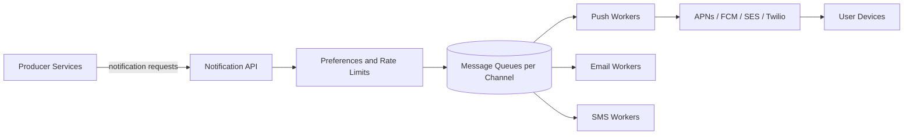
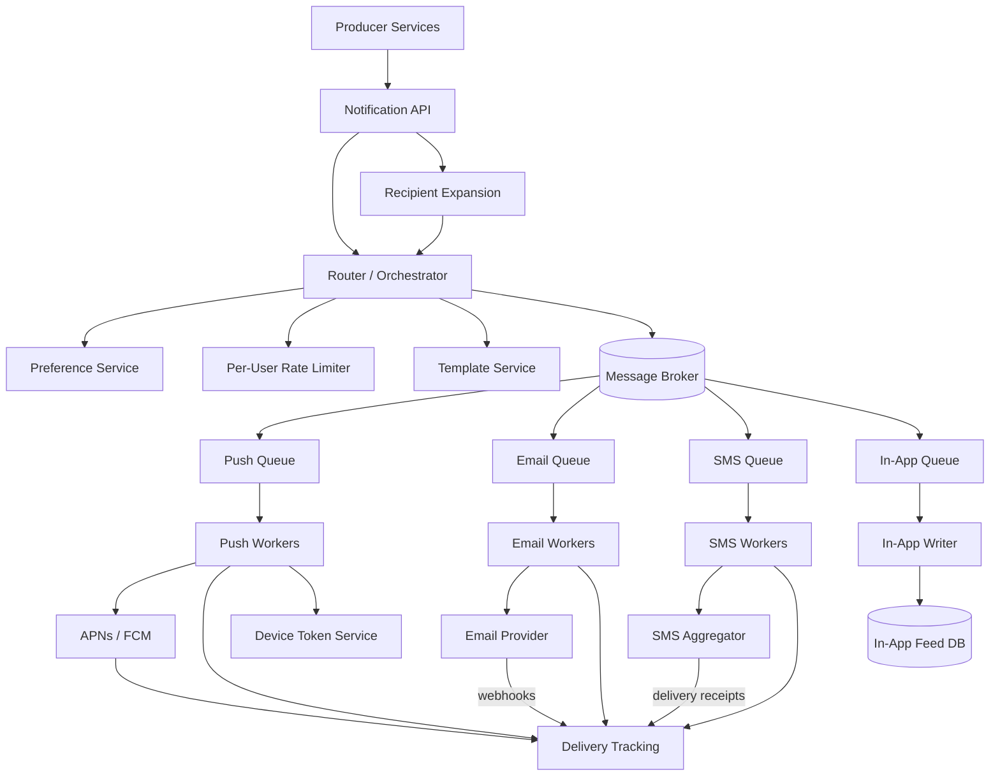
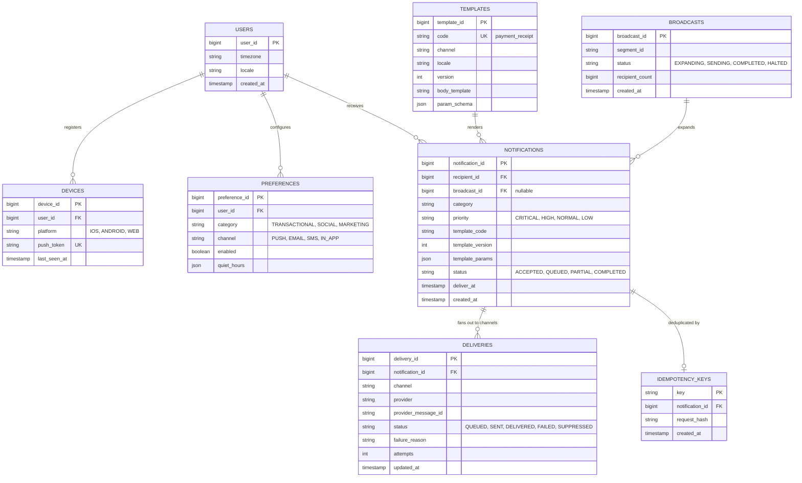
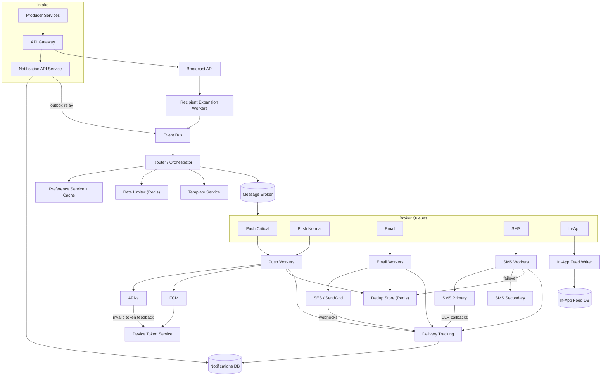
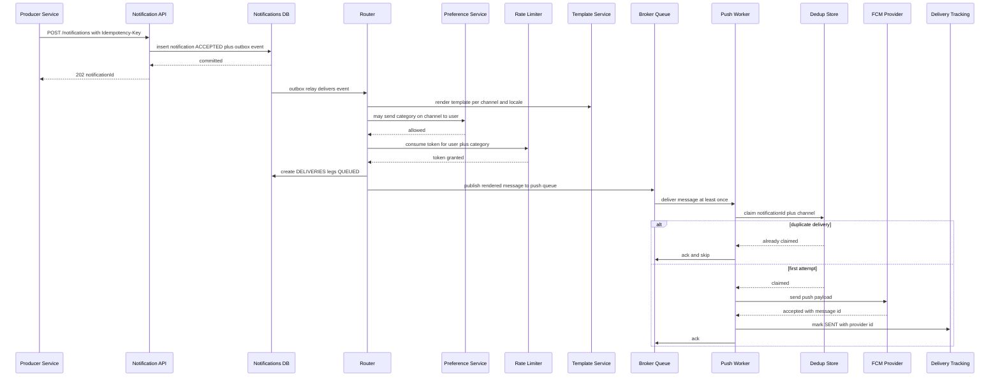

# Design Notification System

## Blogs and websites

- [Notification System](https://www.techprep.app/system-design/high-level-design/notification-system/solution)

## Medium

## Youtube

- [Scalable Notification System Design | Designing Scalable Systems](https://www.youtube.com/watch?v=C6HHmH6wwMs)
- [Design Notifications System Design](https://www.youtube.com/watch?v=e8cX9pQdu7Y)

## Theory

### Topics Covered

1. [Introduction and Problem Statement](#introduction-and-problem-statement)
2. [Functional Requirements](#functional-requirements)
3. [Non-Functional Requirements](#non-functional-requirements)
4. [Capacity Estimation (back-of-envelope)](#capacity-estimation-back-of-envelope)
5. [Characteristics](#characteristics)
6. [Components](#components)
7. [Notification System Design Patterns](#notification-system-design-patterns)
8. [Benefits](#benefits)
9. [Pros](#pros)
10. [Cons](#cons)
11. [Challenges](#challenges)
12. [Best Practices](#best-practices)
13. [When to Use and When Not to Use](#when-to-use-and-when-not-to-use)
14. [Use Cases](#use-cases)
15. [API Design](#api-design)
16. [Data Modeling](#data-modeling)
17. [High-Level Design](#high-level-design)
18. [Deep Dive: Fan-Out, Channel Workers, Preferences and Delivery Guarantees](#deep-dive-fan-out-channel-workers-preferences-and-delivery-guarantees)
19. [Java and Spring Boot Implementation Guide](#java-and-spring-boot-implementation-guide)
20. [Interview Questions and Answers](#interview-questions-and-answers)

---

### Introduction and Problem Statement

A notification system takes events from many producer services (a new follower, a payment receipt, a security alert, a marketing campaign) and delivers them to users over multiple channels: push (APNs for iOS, FCM for Android), email, SMS, and in-app. It is the connective tissue between every product in a company and its users — which is exactly what makes it dangerous: a badly designed notification platform can spam users into uninstalling, blow the SMS budget in an hour, or delay a one-time password behind a million marketing messages.

The problem this solves is **reliable, respectful, massive fan-out**. Reliable: an OTP or fraud alert must arrive in seconds even during a traffic spike. Respectful: user preferences, opt-outs, quiet hours, legal consent, and per-user rate limits must be enforced for every single message, not as an afterthought. Massive: one product event can fan out to millions of recipients, and hundreds of producer services generate events concurrently — far beyond what synchronous sending could absorb.

Design a notification system (like the platforms inside Uber, Airbnb, or Meta) that accepts notification requests from internal services and delivers them over push, email, SMS, and in-app channels, honoring user preferences, with retries, prioritization, and delivery tracking.



**Why notification systems matter**

- They are the highest-volume user-facing system in most companies — billions of messages a day — and the one users experience as the product's "voice."
- They sit at the intersection of reliability engineering (retries, dedup, backpressure), product discipline (fatigue, preferences), and law (GDPR, CAN-SPAM, TCPA consent).
- They are a favorite interview topic because the naive design (one service that "just sends") fails in a dozen visible ways: thundering herds, lost OTPs, duplicate sends, queue head-of-line blocking, and provider outages cascading inward.

**Real-life use cases**

- **Transactional**: OTPs, payment receipts, security alerts — low volume, zero tolerance for delay or loss.
- **Product/social**: likes, comments, ride updates, order status — high volume, user-tunable.
- **Marketing/promotional**: campaigns to millions — highest volume, lowest priority, strictly consented.
- **In-app**: badges and notification centers — stored, not pushed; survives all other channel failures.

---

### Functional Requirements

1. **Send notification API.** Internal services submit a notification: recipient(s), channel(s) or "auto", template id + parameters, priority, and an idempotency key.
2. **Multi-channel delivery.** Push via APNs (iOS) and FCM (Android), email via an ESP (SES/SendGrid), SMS via an aggregator (Twilio-class), and in-app via a persisted notification feed.
3. **Template management.** Parameterized, versioned templates per channel and locale ("Your order {{orderId}} shipped"); rendering happens centrally so producers send data, not prose.
4. **User preferences and opt-outs.** Per-user, per-category, per-channel toggles; global unsubscribes; legally required opt-outs (marketing consent); quiet hours with timezone awareness.
5. **Per-user rate limiting.** Fatigue caps (e.g., max 5 push/day for social category) enforced before send; bypass list for transactional/security categories.
6. **Prioritization.** Critical messages (OTP, fraud) must overtake bulk marketing traffic in the queues — no head-of-line blocking.
7. **Retry with backoff.** Transient provider failures retry with exponential backoff and jitter; permanent failures (invalid token, hard bounce) do not retry; poison messages go to a dead-letter queue.
8. **Deduplication.** Retried producer requests and at-least-once queue delivery must not produce duplicate user-visible sends.
9. **Broadcast/fan-out.** One request can target millions of users (campaign or "all followers of X"); the system expands recipients asynchronously.
10. **Delivery tracking.** Per-notification state machine (`ACCEPTED → QUEUED → SENT → DELIVERED / FAILED / SUPPRESSED`), queryable, with provider callbacks (SMS delivery receipts, email webhooks) where available.
11. **Device token management.** Register/refresh push tokens per device; prune invalid tokens from provider feedback.
12. **Scheduled sends.** Deliver-at timestamps (campaign launches, digest emails).

---

### Non-Functional Requirements

| Requirement | Target | Rationale |
|-------------|--------|-----------|
| Throughput | Sustained ~12K notifications/s, burst 120K/s | Billions/day aggregate across channels |
| Latency (transactional) | p99 < 5 s from API call to provider handoff | OTPs and fraud alerts are time-critical |
| Latency (marketing) | minutes-to-hours acceptable | Batch campaigns are throughput work, not latency work |
| Availability | 99.95% for the accept API; degraded-send mode tolerates worker/provider outages | Producers must always be able to hand off; delivery can catch up |
| Durability | No accepted notification lost (persistent queues, RPO ≈ 0) | A lost security alert is an incident |
| Delivery semantics | At-least-once to providers + dedup at send boundary | Exactly-once across external networks is impossible; dedup is the answer |
| Preference compliance | 100% of sends checked against opt-outs | Legal exposure (TCPA fines per SMS), not a UX nicety |
| Cost efficiency | Prefer cheaper channels when equivalent (push ≈ free, SMS ≈ $0.01+/msg) | At 1B msgs/day, channel mix is a top-line cost driver |
| Observability | Per-channel delivery rates, queue depths, provider health in real time | Provider outages and abuse are detected here first |

**Interview note:** state the priority order explicitly — compliance (opt-outs) and durability > latency for transactional > throughput > cost. A notification platform that sends fast but ignores an unsubscribe is a lawsuit; one that is briefly slow on marketing mail is invisible.

---

### Capacity Estimation (back-of-envelope)

Assumptions: 100M registered users, 30M DAU, 1B notification sends/day across all channels, fan-out factor of ~5 (200M producer events/day become 1B sends), channel mix 50% push / 25% email / 15% in-app / 10% SMS.

**1. Send throughput**

```
Sends/day        = 1B
Average rate     = 1B / 86,400            ≈ 11,600 sends/s
Peak rate        = 10× average (campaigns, breaking news) ≈ 116,000 sends/s
Per channel peak = push ≈ 58K/s, email ≈ 29K/s, in-app ≈ 17K/s, SMS ≈ 12K/s
```

Queue-based architecture is forced by this math: producer APIs can accept at wire speed, but provider throughput (especially SMS aggregators with per-sender TPS caps) is the real governor — queues decouple the two.

**2. Provider-side constraints**

```
SMS: aggregator cap often 10–100 msg/s per sender number
     → 12K/s peak needs ~1,200 sender numbers or provider pooling — a contractual,
       not just technical, limit. This is why SMS is the channel of last resort.
Email: ESP per-domain reputation throttles; ramp new IPs over weeks.
Push: APNs/FCM sustain very high rates; the limit is connection management
      (persistent HTTP/2 connections, multiplexed streams).
```

**3. Storage**

```
Notification records/day = 1B × ~500 bytes ≈ 500 GB/day
90-day retention with in-app history → ~45 TB hot, archive beyond
Device tokens: 100M users × 1.5 devices × 200 bytes ≈ 30 GB
Preferences: 100M users × ~20 categories × small row ≈ tens of GB
```

Notification records are the biggest relational cost; they are write-once/read-rarely (except in-app feeds) → partition by day, TTL-expire non-in-app rows, keep in-app feed rows longer.

**4. Inbound API**

```
Producer events/day = 200M → avg ≈ 2,300 req/s, peak ≈ 23K req/s
Payload ~1 KB → peak ingress ≈ 23 MB/s — trivial; the hard part is fan-out, not intake.
```

**5. Preference/rate-limit checks**

Every candidate send requires a preference check + rate-limit check → ~116K lookups/s at peak. This forces cached preference snapshots (Redis) with write-through invalidation; hitting the relational DB per send is impossible.

**Summary table**

| Metric | Value |
|--------|-------|
| Peak send rate | ~116,000/s |
| Peak API intake | ~23,000 req/s |
| Peak preference checks | ~116,000/s (cache-served) |
| Record storage growth | ~500 GB/day |
| SMS sender pool | ~1,200 numbers for 12K/s peak |

---

### Characteristics

Each characteristic: what it means, why it matters, and a practical example.

- **Fan-out is the core operation**
  One logical event becomes many sends (one per recipient × selected channels). *Example:* a creator posts → 2M followers → preference-filtered → 800K push + 300K email + 1.5M in-app rows. Recipient expansion is asynchronous batch work, never done in the request path.

- **At-least-once everything**
  Queues redeliver, providers time out ambiguously, producers retry. Duplicates are guaranteed; the design question is where dedup lives. *Example:* an SMS provider ACK is lost after send — the worker retries and the provider may send twice unless dedup or provider-side idempotency keys intervene.

- **Heterogeneous channel semantics**
  Push has no delivery confirmation (fire-and-forget to APNs), SMS has delayed delivery receipts, email has rich webhooks (delivered/opened/bounced), in-app is a database write. "Delivered" means four different things. *Example:* delivery tracking must model per-channel confidence, not a single boolean.

- **Sharp priority classes**
  An OTP and a "weekend sale!" email share infrastructure but nothing else: latency SLOs, retry policies, rate-limit exemptions, and queue placement all differ. *Example:* during a 5M-recipient campaign, OTPs must still hand off to providers in under 5 s.

- **Fatigue is a system property**
  Users experience the *sum* of all producers' messages. A per-service design cannot see it; only a central platform with per-user rate limits can. *Example:* ten services each "reasonably" sending 2 pushes/day = 20 pushes/day = uninstall.

- **Legal compliance is in the data path**
  Marketing SMS/email without consent is statutory damages per message. Consent state is consulted per send, not per campaign launch. *Example:* a user texts STOP → the suppression list blocks all marketing SMS within seconds, across every producer.

- **Provider dependency and failability**
  APNs/FCM/ESP/aggregators are external, rate-limited, and occasionally down. The platform degrades around them (circuit breakers, provider failover, queue accumulation) rather than failing with them.

- **Write-heavy, read-light storage**
  Notification records are written once per send and read mostly by the in-app feed. *Example:* partitioning and TTL expiration matter more than read indexing beyond `user_id`.

---

### Components

A production notification platform consists of these components, with purpose, responsibilities, mechanics, relationships, and real-world grounding.

- **Notification API service**
  *Purpose:* the front door for producer services. *Responsibilities:* authenticate producers (mTLS/service tokens), validate requests, enforce producer rate limits, record idempotency keys, persist the notification as `ACCEPTED`, publish to the routing exchange. *How it works:* stateless, horizontally scaled; does no recipient expansion beyond a threshold and no provider calls. *Example:* Stripe-style internal "notify" endpoint every service can call.

- **Recipient expansion (fan-out) service**
  *Purpose:* turn "all followers of X" into concrete user ids. *Responsibilities:* resolve audience queries (followers, segments, uploaded lists), batch recipient sets into chunks (e.g., 1,000 users per chunk message), publish chunk messages. *Relationship:* consumes broadcast requests; emits per-chunk work so a 5M-user campaign is 5,000 queue messages, not one 5-hour handler. *Example:* campaign sends expand through a segment store fed by the data warehouse.

- **Preference service**
  *Purpose:* the compliance gate. *Responsibilities:* store per-user per-category per-channel settings, global suppressions (STOP, hard bounces, unsubscribes), quiet hours + timezone; answer "may we send category C on channel H to user U at time T?" *How it works:* relational source of truth with a Redis read snapshot, write-through invalidation; consulted per candidate send. *Real-world:* every ESP's suppression-list concept, generalized across channels.

- **Per-user rate limiter**
  *Purpose:* fatigue prevention. *Responsibilities:* token-bucket per (user, category, channel) — e.g., social: 5 push/day; transactional: unlimited. *How it works:* Redis-backed counters/buckets with atomic Lua checks; a `SUPPRESSED_RATE_LIMITED` outcome is recorded for observability, not silently dropped.

- **Router/orchestrator**
  *Purpose:* decide channels per notification. *Responsibilities:* apply channel strategy (explicit channel list, or auto: push → in-app fallback; transactional: multi-channel); render templates per channel+locale; stamp priority; publish to per-channel exchanges. *Relationship:* single writer into the channel queues; consumes preference/rate-limit verdicts.

- **Message broker (queues)**
  *Purpose:* decouple intake from delivery, absorb bursts, prioritize. *Responsibilities:* durable per-channel queues (push/email/sms/in-app), priority support, delayed-retry queues with TTL, dead-letter queues. *How it works:* RabbitMQ (or SQS/Kafka variant — trade-offs in Patterns); messages carry fully-rendered payloads + metadata so workers are dumb. *Example:* the campaign blast accumulates in the email queue while OTP messages in the high-priority push queue drain in seconds.

- **Channel workers (per-channel consumer fleets)**
  *Purpose:* the only components that talk to providers. *Responsibilities:* consume messages, dedup-check, call the provider SDK (APNs/FCM HTTP/2, SES API, Twilio API), map provider responses to the delivery state machine, honor provider rate limits, classify errors transient vs permanent. *How it works:* independently scaled fleets per channel (push workers ≠ SMS workers), concurrency tuned to provider limits. *Relationship:* publish delivery outcomes to the tracking pipeline.

- **Provider adapters**
  *Purpose:* isolate provider specifics behind one interface. *Responsibilities:* connection pooling (persistent HTTP/2 for APNs/FCM), authentication (JWT for APNs, OAuth for FCM, API keys for ESP/SMS), response/error taxonomy normalization, provider failover (primary/secondary SMS aggregator). *Why:* Twilio vs. Vonage vs. SNS differ in idempotency support, receipt formats, and error codes — workers must not know.

- **Template service**
  *Purpose:* central content. *Responsibilities:* store versioned, localized templates per channel; render with parameters; preview/validation at authoring time. *How it works:* templates in DB with a cached compiled form; renders are pure functions of (templateId, locale, params). *Example:* producers send `templateId="order_shipped", params={orderId: "…"}` — never raw text — so copy changes don't require producer deploys.

- **Delivery tracking service**
  *Purpose:* answer "what happened to notification N?" *Responsibilities:* maintain the per-notification state machine; ingest provider callbacks (SMS DLRs, email webhooks); power per-channel dashboards and alerting. *Relationship:* pure consumer of worker outcomes and provider webhooks; never in the send path.

- **Device token service**
  *Purpose:* the push address book. *Responsibilities:* register/refresh tokens per (user, device, platform), prune on provider feedback (APNs 410, FCM `NotRegistered`), map user → active tokens at send time. *Example:* tokens rotate; a send to a stale token must trigger cleanup, not a retry storm.

- **Scheduler service**
  *Purpose:* time-shifted sends. *Responsibilities:* store deliver-at jobs, publish them when due (delayed queues or a polling scheduler), handle campaign launch times across timezones.



---

### Notification System Design Patterns

Each pattern: what it is, the problem it solves, how it works, when to use or avoid it, trade-offs, and a real-world example.

- **Queue-based fan-out with per-channel workers**
  *What:* the API enqueues; independent worker fleets per channel dequeue and send. *Problem solved:* provider throughput and latency differ by orders of magnitude (push ~free and fast, SMS capped and pricey); synchronous sending couples the API's fate to the slowest provider and turns every campaign into an outage. *How:* durable per-channel queues; workers scaled to provider limits; fully-rendered messages so workers stay dumb. *When to use:* always, beyond toy volume. *Advantages:* backpressure isolation, independent scaling/retry per channel, burst absorption. *Disadvantages:* end-to-end latency includes queue time; operational broker expertise. *Example:* the architecture used by essentially every scaled notification platform (Uber, LinkedIn) and embodied by AWS SNS→SQS fan-out.

- **Priority queuing / lane separation**
  *What:* transactional traffic travels in a high-priority lane that bulk traffic cannot block. *Problem solved:* head-of-line blocking — 5M marketing emails ahead of an OTP. *How:* either broker priorities (`x-max-priority` in RabbitMQ) or, more robustly, separate queues per (channel × priority class) with dedicated worker pools; critical lanes have reserved capacity. *Advantages:* OTP latency holds during campaigns. *Disadvantages:* lane sprawl if over-classified; starvation of low lanes needs fairness monitoring. *Example:* transactional vs. marketing streams at every ESP (separate IPs too, for reputation).

- **Retry with exponential backoff + jitter, DLQ terminal**
  *What:* transient failures requeue with growing delays; permanent failures and expired retries land in a dead-letter queue. *Problem solved:* provider hiccups are common and self-healing; naively retrying in a tight loop amplifies outages (retry storm); silently dropping loses compliance-critical messages. *How:* RabbitMQ delayed-retry pattern — rejected messages dead-letter into TTL queues (1m, 5m, 30m) that re-publish to the main queue; attempts counted in a header; cap → DLQ. *Advantages:* self-healing, bounded blast radius, human triage point (DLQ) for poison messages. *Disadvantages:* delayed retries reorder messages; DLQs need alerting or they become message graveyards. *Example:* standard RabbitMQ/SQS redrive policy everywhere.

- **Deduplication at the send boundary**
  *What:* before calling a provider, the worker claims `(notificationId, channel, recipient)` in Redis (`SET NX` with TTL); a duplicate claim means "already sent — skip and ack." *Problem solved:* at-least-once delivery guarantees duplicates exist; users must never see two OTPs (well, two marketing emails is bad enough). *How:* claim commits before provider call; on ambiguous provider timeout, prefer re-claim check + provider idempotency key (Twilio/SES support idempotency tokens) over blind resend. *Advantages:* exact-once-ish UX on at-least-once infrastructure. *Disadvantages:* a claimed-but-crashed worker suppresses a legit resend — TTL and reconciliation jobs close the gap. *Example:* the same pattern as payment idempotency, adapted to fire-and-forget channels.

- **Suppression-list pattern (compliance gate)**
  *What:* a globally consulted list of "never send" verdicts: opt-outs, STOP replies, hard bounces, complaints. *Problem solved:* legal compliance must survive producer bugs — even if a buggy service requests sends to opted-out users, the platform refuses. *How:* suppression checked per candidate send from a cached snapshot; suppression writes propagate in seconds. *Advantages:* defense in depth; audit trail of every suppression decision. *Disadvantages:* snapshot staleness window must be tight (seconds, not minutes). *Example:* ESP suppression lists (SES account-level suppression), TCPA-mandated SMS STOP handling.

- **Token bucket rate limiting per user/category**
  *What:* each (user, category, channel) has a bucket with capacity = fatigue cap; a send consumes a token. *Problem solved:* aggregate fatigue is invisible to individual producers. *How:* Redis Lua script atomically checks-and-decrements; transactional categories have unlimited buckets (bypass). *Advantages:* cheap (one Redis op), centrally tunable. *Disadvantages:* counters reset semantics (fixed window vs sliding) trade precision for simplicity. *Example:* LinkedIn/Instagram-style "communication fatigue" guardrails.

- **Template indirection (data, not prose)**
  *What:* producers reference `templateId + params`; rendering is centralized. *Problem solved:* copy changes, localization, and per-channel formatting (push has ~178-char limits, email is HTML) cannot live in dozens of producer codebases. *Advantages:* consistent voice, A/B testing hooks, locale expansion without producer work. *Disadvantages:* template sprawl needs governance; param contracts are an API surface. *Example:* every mature platform converges here after the "each service hardcodes strings" phase.

- **Circuit breaker + provider failover**
  *What:* per-provider health tracking; open circuit → shed load, fail over to secondary provider or accumulate in queue. *Problem solved:* a down SMS aggregator must not consume the worker fleet in timeouts while the queue backs up into memory alarms. *Advantages:* graceful degradation; cost-aware failover (secondary SMS only during primary outage). *Disadvantages:* failover between SMS providers can change sender identity (regulatory sender-id registration per country). *Example:* dual-aggregator SMS setups are standard for exactly this reason.

---

### Benefits

- **Producers stay simple and safe.** One API call; the platform owns preferences, compliance, retries, channels, and tracking. Product teams ship notifications without becoming deliverability experts.
- **Bursts become boring.** Queues absorb 10× spikes; worker fleets drain at provider-safe rates; OTPs never wait behind campaigns because lanes are separated.
- **Compliance is enforced centrally.** Opt-outs, quiet hours, and fatigue caps apply to every message from every producer — the legal and UX surface has one choke point instead of fifty codebases.
- **Provider outages degrade, not destroy.** Circuit breakers and failover keep the platform accepting and queueing while a provider recovers; catch-up is a drain-rate problem, not a data-loss event.
- **Cost is a tunable.** Channel strategy (push-first, SMS last-resort) and provider failover are configuration; at 1B msgs/day, shifting 5% of SMS to push is a measurable budget line.

---

### Pros

- **Clean separation of concerns.** Intake, routing, compliance, delivery, and tracking are independent services with independent scaling and failure domains.
- **Per-channel autonomy.** Push workers scale to zero-cost throughput while SMS workers respect per-sender TPS caps; neither knows the other exists.
- **Durable by construction.** Persistent queues + accepted-state records mean a worker crash mid-send is a redelivery, not a loss.
- **Observable end to end.** The delivery state machine plus per-channel metrics make "did it send?" a query, not a guess — critical for support ("I never got my receipt").
- **Extensible.** A new channel (WhatsApp, voice) is a new queue + worker fleet + adapter; the platform core is untouched.

---

### Cons

- **Operational weight.** A broker cluster, four worker fleets, provider accounts (with reputation/IP warmup), suppression infrastructure, and a tracking pipeline — a notification platform is a product, not a weekend project.
- **End-to-end latency is probabilistic.** Queue depth × drain rate determines delay; latency SLOs require capacity math and lane isolation, not just fast code.
- **Duplicates leak at the edges.** Dedup windows, provider-side idempotency gaps (APNs has none), and ambiguous timeouts mean "exactly once to the user's screen" is asymptotically approached, never guaranteed.
- **Push is unverifiable.** APNs/FCM give no delivery receipt; "delivered" for push means "the provider accepted it," which marketing dashboards must not overclaim.
- **Template governance.** Centralized content needs review workflows, locale coverage, and param-contract versioning, or the template store becomes the new mess.
- **Cost concentration.** One misconfigured campaign (wrong segment, retry loop) can spend a month's SMS budget in an afternoon — spend-rate circuit breakers are a real feature.

---

### Challenges

- **Technical: dedup across an ambiguous boundary.** Provider timeout after the send succeeded is indistinguishable from timeout before it. Mitigation: provider idempotency keys where supported (SES, Twilio), pre-send dedup claims with TTLs, and reconciliation comparing our SENT records against provider logs. You minimize, you never eliminate.
- **Scalability: million-recipient fan-out.** Expanding 5M recipients synchronously blocks the API for minutes. Mitigation: chunked expansion (1,000-user chunks as queue messages), parallel chunk workers, campaign throttles spread over a send window, and per-campaign rate caps so one blast can't starve transactional lanes.
- **Performance: preference checks at 116K/s.** Solved by cache-served snapshots with write-through invalidation; the trap is stale suppression reads — a user who just texted STOP must be blocked within seconds, so suppression writes bypass the normal cache TTL and invalidate actively.
- **Reliability: provider degradation without backlog explosion.** APNs at 10% throughput for an hour = millions queued. Mitigations: circuit breakers to fail fast (cheap) instead of timing out (expensive), TTL on messages whose value decays (a 2-hour-late "your ride is arriving" is spam — expire it), and load-shedding policies per priority class.
- **Maintainability: provider adapter drift.** Providers change APIs, auth schemes, and error taxonomies; the adapter layer plus a shared contract-test suite per provider keeps channel workers stable. Sender-id/registration rules differ per country for SMS — configuration, not code.
- **Operational: IP/domain reputation for email.** New IPs start untrusted; ESPs throttle or junk-folder you. Reputation is an operational asset: warm up IPs over weeks, separate transactional and marketing streams onto different IPs/domains, monitor complaint rates per campaign.
- **Security: notification content is a phishing vector.** A compromised producer or template can push millions of malicious links. Mitigations: producer authn/authz scoped per template category, template review for external-facing changes, link-domain allowlists, and anomaly detection on send patterns per producer.
- **Privacy: payloads contain PII.** Notification payloads (receipts, health info) flow through queues and providers. Mitigations: minimize payload PII (render at send time from a reference, not a payload blob), encrypt queues, and treat provider data-sharing agreements as part of the architecture.

---

### Best Practices

- **Persist `ACCEPTED` before queueing, and queue before returning.** *Why:* the API's promise to producers is "we won't lose it." Writing the record and the queue message via a transactional outbox means a crash between accept and publish cannot strand the notification — the relay republishes from the DB.
- **Check preferences and rate limits at send time, not just at intake.** *Why:* a message can sit in a queue for hours during a campaign; the user's state at *send* time is what the law and respect demand. Intake-time checks are an optimization for early rejection; send-time checks are the guarantee.
- **Classify every provider error as transient or permanent — never retry blindly.** *Why:* retrying a permanent failure (invalid token, hard bounce, opted-out number) burns money and provider reputation; not retrying a transient one loses messages. The taxonomy lives in the adapter, because only the provider knows which is which (APNs 410 = permanent; 429/500 = transient).
- **Expire messages whose value decays.** *Why:* queue TTLs matching message half-life ("ride arriving" = minutes, "receipt" = days) prevent stale spam after a backlog drain — the worst outcome of an outage is delivering a pile of obsolete messages at once.
- **Separate transactional and marketing into different lanes, IPs, and sender identities.** *Why:* marketing engagement is poor by nature; if it shares email IPs or SMS sender ids with OTPs, its reputation drags deliverability of the messages that must arrive. *Example:* `mail.example.com` vs `alerts.example.com` subdomains with separate IP pools.
- **Make workers stateless and messages self-contained.** *Why:* a crashed worker's redelivered message must be sendable by any other worker without local context — fully-rendered payload + metadata in the message, state in Redis/DB.
- **Instrument the state machine, not just the sends.** *Why:* `SUPPRESSED` and `FAILED` are product outcomes — dashboards showing only sends hide fatigue suppression spikes and silent provider failures. Every terminal state transition emits a metric and an audit row.
- **Cap spend as well as rate.** *Why:* rate limits protect providers; spend limits protect the budget. A per-producer daily SMS cost cap with alerting catches the classic "retry loop × paid channel" incident before finance does.
- **Prune device tokens aggressively from provider feedback.** *Why:* sending to dead tokens wastes rate budget, skews delivery metrics, and — at APNs — repeated sends to expired tokens can throttle your connection. Treat provider feedback as a cleanup event stream, not noise.
- **Version templates and record the version sent.** *Why:* "what did we tell the user?" must be answerable for support and disputes; the notification record stores `templateId + version + params`, so content is reconstructible even after the template is edited.

---

### When to Use and When Not to Use

**Use this architecture (API + router + queues + per-channel workers + tracking) when:**

- You send on 2+ channels at non-trivial volume, or one channel with burst patterns (campaigns).
- Multiple producer teams/services need to notify users — centralization is the point.
- Compliance (opt-outs, consent, quiet hours) and fatigue limits are obligations, not features.
- Delivery guarantees and audit ("did the user get the receipt?") matter.

**Consider alternatives when:**

- **One channel, low volume, one producer** (a side project sending welcome emails): call the ESP API directly with a retry library; the platform's operational cost dwarfs the benefit.
- **Real-time, sub-second, in-session messaging** (chat, live collaboration): that's a WebSocket/presence system, not a notification pipeline — different delivery semantics (ephemeral, connected clients only).
- **Pure marketing email at small scale:** a managed ESP (Mailchimp-class) with its own lists and suppression beats building.
- **Extremely latency-critical transactional only** (an OTP service): a thin, single-channel service with a dedicated provider connection may beat a shared platform on tail latency — but you re-inherit compliance and tracking soon after.

**Decision factors:** number of channels, number of producers, burst profile, legal exposure (SMS/email marketing laws), delivery-audit requirements, and team capacity to run a broker. The senior interview answer: the platform exists to centralize *judgment* (compliance, fatigue, channel choice) — if you have no judgment to centralize, you don't need the platform.

---

### Use Cases

**Use case 1: Ride-hailing trip notifications**

- *Problem:* ride updates ("driver assigned", "arriving now", receipt) are latency-critical, high-volume at rush hour, and worthless when late; receipts are durable records.
- *Proposed solution:* transactional priority lane with push-primary strategy and in-app fallback; message TTLs on time-decayed updates ("arriving now" expires in 5 min); receipt via push + email (durable channel) + in-app record.
- *Suitability:* ideal fit — sharp priority classes and per-message TTL are exactly what the platform provides.
- *How it works:* trip service emits events → router classifies priority + TTL → push lane (reserved worker pool) → APNs/FCM; receipt also renders the email template and enters the email queue at normal priority.
- *Trade-offs:* reserved transactional capacity is idle off-peak (cost of the SLO); TTL'd messages risk non-delivery if the user is offline — mitigated by in-app fallback.

**Use case 2: E-commerce marketing campaign (5M recipients)**

- *Problem:* a sale announcement to 5M users must respect marketing consent, fatigue caps, send-time optimization (user timezone mornings), and email IP reputation.
- *Proposed solution:* chunked recipient expansion, scheduled publish spread over hours, preference + rate-limit enforcement at send time, marketing lane with dedicated email IPs, spend caps on any SMS leg.
- *Suitability:* the platform's burst absorption and compliance choke point are the entire requirement.
- *How it works:* campaign service submits one broadcast request → expansion chunks the segment → scheduler spreads chunks across the send window → per-user checks suppress opted-out/capped users → email workers drain at reputation-safe rates.
- *Trade-offs:* spreading over hours reduces "everyone at 9:00" impact; send-timezone targeting requires stored user timezones and tolerates drift.

**Use case 3: Banking security alerts and OTPs**

- *Problem:* OTPs and fraud alerts have zero tolerance for delay or loss, strict audit requirements, and regulatory delivery evidence; SMS is often mandated despite cost.
- *Proposed solution:* dedicated critical lane with multi-channel strategy (SMS + push simultaneously), aggressive retry with provider failover (dual SMS aggregators), full state-machine audit retained for years, rate-limit bypass.
- *Suitability:* the platform's audit trail and failover machinery are regulatory requirements here, not niceties.
- *How it works:* auth service submits OTP with `priority=CRITICAL` → router renders SMS + push → both queues (critical lane) → workers send via primary aggregator; circuit breaker fails over on provider errors; delivery receipts (SMS DLR) recorded.
- *Trade-offs:* multi-channel simultaneous send costs more per OTP and risks "same code twice" UX — accepted, because arrival probability dominates.

**Use case 4: Social app activity notifications**

- *Problem:* likes/comments/follows generate enormous volume with high fan-out (a celebrity post → millions of follower notifications); most are low-value and drive fatigue-driven uninstalls.
- *Proposed solution:* aggregation at the router ("A and 84 others liked your post" — collapse within a time window), strict per-user fatigue caps, in-app-first strategy with push only for high-signal events, in-app feed as the durable record.
- *Suitability:* demonstrates the platform's judgment layer: aggregation and fatigue logic that no individual producer could implement.
- *Trade-offs:* aggregation delays first notification slightly (windowing); collapse logic complicates templates (count-parameterized copy).

---

### API Design

Base path: `/api/v1`. Producer authentication via mTLS + service tokens with per-service scopes (which categories/templates a producer may use). All mutations require `Idempotency-Key`. Versioning via path. Scheduled sends carry `deliverAt` in UTC.

**1. Send a notification (single recipient or small list)**

```
POST /api/v1/notifications
Idempotency-Key: 9d3f…
{
  "recipientIds": ["usr_8811"],
  "category": "TRANSACTIONAL",
  "templateId": "payment_receipt",
  "templateParams": { "amount": "25.50", "merchant": "Cafe Nero" },
  "channels": ["PUSH", "EMAIL"],
  "priority": "HIGH",
  "deliverAt": null
}
→ 202 Accepted
{ "notificationId": "ntf_55cc", "status": "ACCEPTED", "suppressedEstimate": 0 }
```

202 because delivery is asynchronous. Validation: `templateId` exists and producer is scoped to it; `templateParams` satisfy the template's declared schema (422 `TEMPLATE_PARAM_MISMATCH`); `category` from the enum; channels subset of allowed for the category. Idempotency: same key + same payload returns the original record; same key + different payload → 409.

**2. Broadcast (fan-out to an audience)**

```
POST /api/v1/broadcasts
Idempotency-Key: 71aa…
{
  "audience": { "segmentId": "seg_us_active_30d" },
  "category": "MARKETING",
  "templateId": "spring_sale",
  "templateParams": { "discount": "20" },
  "channels": ["EMAIL"],
  "sendWindow": { "startAt": "2026-04-26T14:00:00Z", "spreadHours": 6 }
}
→ 202 Accepted
{ "broadcastId": "brd_10cc", "estimatedRecipients": 4800000, "status": "EXPANDING" }
```

Audience by segment id or follower reference; the response estimate lets producers sanity-check before expansion commits. Broadcasts over a size threshold require an approval workflow (403 `APPROVAL_REQUIRED`).

**3. Query delivery status**

```
GET /api/v1/notifications/ntf_55cc
→ 200 OK
{
  "notificationId": "ntf_55cc",
  "deliveries": [
    { "channel": "PUSH", "status": "SENT", "provider": "FCM", "updatedAt": "…" },
    { "channel": "EMAIL", "status": "DELIVERED", "provider": "SES", "updatedAt": "…" }
  ]
}
```

Per-channel legs are first-class — "sent the push, email bounced" is the normal case, not an edge case.

**4. Preferences (user-facing)**

```
GET /api/v1/users/usr_8811/notification-preferences
→ 200 OK
{ "channels": { "PUSH": true, "EMAIL": true, "SMS": false },
  "categories": { "SOCIAL": { "PUSH": true, "EMAIL": false }, "MARKETING": { "EMAIL": true } },
  "quietHours": { "start": "22:00", "end": "08:00", "timezone": "America/New_York" } }

PUT /api/v1/users/usr_8811/notification-preferences
{ "categories": { "MARKETING": { "EMAIL": false } } }
→ 200 OK
```

Writes propagate to the send-path cache within seconds; marketing opt-outs are honored regardless of producer requests.

**5. Register a device token**

```
POST /api/v1/users/usr_8811/devices
Idempotency-Key: 22bb…
{ "platform": "ANDROID", "pushToken": "fcm_token_xyz", "appVersion": "7.3.1" }
→ 201 Created
{ "deviceId": "dvc_4421", "registeredAt": "…" }
```

Upsert semantics on `(platform, pushToken)`; re-registration refreshes `updatedAt`. Provider feedback (APNs 410 / FCM `NotRegistered`) deletes tokens asynchronously.

**6. List in-app notifications (pagination, filtering)**

```
GET /api/v1/users/usr_8811/in-app-notifications?status=UNREAD&limit=25&cursor=eyJpZCI6MTIzfQ
→ 200 OK
{
  "items": [ { "id": "iap_9911", "templateId": "new_follower", "title": "…", "body": "…",
               "status": "UNREAD", "createdAt": "…" } ],
  "nextCursor": "eyJpZCI6MTI0fQ",
  "limit": 25
}
```

Cursor pagination (the feed is append-heavy; offset pagination is unstable and forces deep scans). `POST /in-app-notifications/iap_9911:read` marks read, idempotently.

**Status codes and error responses**

| Code | Meaning |
|------|---------|
| 200/201/202 | Success / created / accepted (async delivery) |
| 400 | Validation failure — `{ "error": "VALIDATION_FAILED", "details": [{ "field": "channels", "message": "SMS not allowed for category SOCIAL" }] }` |
| 401/403 | Unauthenticated producer / template scope violation / broadcast approval required |
| 404 | Notification, broadcast, or template not found |
| 409 | Idempotency-Key reused with a different payload |
| 422 | Business rule violation — `TEMPLATE_PARAM_MISMATCH`, `AUDIENCE_TOO_LARGE`, `QUIET_HOURS_VIOLATION` (for non-deferrable categories) |
| 429 | Producer rate limited; `Retry-After` header |
| 503 | Broker unavailable; producers retry with the same idempotency key safely |

Rate limiting: per-producer request limits (e.g., 1,000 req/s) plus per-producer daily paid-channel budgets; user-facing preference/device endpoints limited per session. Idempotency records retained 7 days.

---

### Data Modeling



**Design notes**

- **PKs/FKs and constraints:** `DEVICES.push_token` unique (a token belongs to exactly one user — re-registration moves it); `PREFERENCES(user_id, category, channel)` unique — one row per knob; `DELIVERIES(notification_id, channel)` unique — one leg per channel per notification; `DELIVERIES.attempts` and timestamps support the audit story. `TEMPLATES(code, channel, locale, version)` unique — content is versioned and immutable after use.
- **Indexes:** `DELIVERIES(notification_id)` for status queries; `NOTIFICATIONS(recipient_id, created_at DESC)` backing the in-app feed; `DELIVERIES(status, updated_at)` for the stuck-delivery reaper (SENT without a receipt past threshold); `DEVICES(user_id, platform)` for token resolution at send time.
- **Suppression list as its own table:** `SUPPRESSIONS(user_id/channel-or-address, scope, reason, created_at)` with a unique key on the suppressed address — written by STOP replies, bounces, complaints, and user toggles; mirrored into the fast cache with active invalidation. Separate from `PREFERENCES` because suppressions are legal records (keep forever), while preferences are product state.
- **Partitioning and TTL:** `NOTIFICATIONS` and `DELIVERIES` are range-partitioned by day; non-in-app rows expire after 90 days (dropped partitions, not deletes); in-app feed rows persist per product policy. At 500 GB/day, deletion-by-partition-drop is the only viable expiration mechanism.
- **Denormalization:** `NOTIFICATIONS` stores rendered `template_params` plus `template_version` so historical content is reconstructible; `DELIVERIES.provider_message_id` denormalizes the provider's handle for receipt correlation — no join to provider-specific tables.

---

### High-Level Design



**End-to-end send flow:**



Explanation: the API's durability promise is made with a DB commit plus an outbox row in one transaction — a crash after commit can never lose the request. All send-path judgment (preferences, rate limits) happens at the router, close to send time, so messages that sat in a queue are still checked against fresh state. The worker's dedup claim before the provider call is what converts the broker's at-least-once delivery into at-most-once user-visible sends in the normal case; the tracking service consumes outcomes from every worker and provider callback so "what happened" is a query over the delivery legs.

**Failure handling and scaling**

- *Scaling:* API and router are stateless (scale on CPU); worker fleets scale independently per channel against provider rate budgets; the broker is the burst buffer and is sized for hours of campaign backlog; Redis (dedup, rate limits, preference cache) is clustered with replicas.
- *Producer-side failure:* API down → producers retry with the same idempotency key; DB down → API refuses (fail-closed) rather than accepting into memory.
- *Broker failure:* persistent mirrored queues; outbox relay republishes anything committed but never queued.
- *Worker crash mid-send:* message redelivers; dedup claim prevents a user-visible duplicate unless the crash landed between provider send and claim extension — the residual duplicate window is bounded by claim TTL and closed by provider idempotency keys where supported.
- *Provider outage:* circuit breaker opens → messages requeue with backoff or route to the failover provider (SMS); queues accumulate; TTLs expire messages whose value has decayed; the drain catches up at provider-safe rates.
- *Poison messages:* retries capped; terminal failures land in the DLQ with alerting and a re-drive tool after the underlying bug is fixed.

---

### Deep Dive: Fan-Out, Channel Workers, Preferences and Delivery Guarantees

**1. Multi-channel delivery semantics (push, email, SMS, in-app)**

- *Push (APNs/FCM):* fire-and-forget over persistent HTTP/2 connections. APNs authenticates with a provider JWT (`.p8` key), responds with status codes (`200` accepted, `410` token gone — prune it, `429/500` retry with backoff). FCM (HTTP v1) uses OAuth2 service-account auth; `NotRegistered` = prune. **No delivery receipt exists** — SENT is the terminal knowable state; client-side analytics pings approximate delivered/opened. Connection management matters: a few multiplexed HTTP/2 connections per worker, not a connection per message.
- *Email:* rich lifecycle via ESP webhooks — delivered, opened, clicked, bounced (hard = suppress address; soft = retry), complained (= suppress + reputation damage). Deliverability is reputation-gated: dedicated IPs, domain authentication (SPF/DKIM/DMARC), transactional/marketing stream separation, complaint-rate monitoring (< 0.1%).
- *SMS:* capped throughput per sender identity; delivery receipts (DLRs) arrive asynchronously and are carrier-best-effort (handset off = delayed receipt). Concatenated SMS (>160 GSM-7 chars) bills per segment — template length is a cost feature. Country rules differ (sender id registration, DLT registration in India, time-of-day restrictions) — per-country config in the adapter, not in workers.
- *In-app:* a database write to the feed plus an unread-badge counter (Redis). No provider, no failure mode beyond the DB — it is the fallback channel that always works, which is why every notification strategy includes it.

**2. Queue-based fan-out with per-channel workers**

The router publishes to a topic exchange; per-channel bindings route rendered messages to durable queues; each worker fleet consumes its own queues.

- *Why per-channel queues, not one queue with channel filtering:* consumer lag, retry cadence, and concurrency limits are per-channel (SMS drains at 100/s/sender; push at tens of thousands/s). One mixed queue makes the slowest channel everyone's latency.
- *Priority:* two mechanisms, used together: broker-level priority (`x-max-priority: 10`, CRITICAL messages jump the queue) and lane separation (dedicated `push.critical` queue + reserved worker pool) — broker priority alone starves under sustained bulk load because prefetch buffers fill with normal messages; lane separation reserves *capacity*, not just order.
- *Recipient expansion:* broadcast requests are expanded by a separate fleet into chunk messages (`{chunkId, userIds[1000], templateRef}`); the router processes chunks like single notifications but evaluates preferences in batch (one cache mget per chunk, not per user) — batching the checks is what makes 5M-recipient campaigns affordable.

**3. User preferences and opt-outs**

- *Model:* `(user, category, channel) → enabled`, layered over global suppressions and quiet hours. Categories are fixed and coarse (TRANSACTIONAL, SECURITY, SOCIAL, MARKETING) — fine-grained toggles multiply into an unmaintainable matrix.
- *Evaluation order:* (1) global suppression (STOP, bounce, complaint) — absolute; (2) category legality (marketing requires consent; transactional cannot be fully opted out — account-security messages are exempt by law in most jurisdictions); (3) user toggles; (4) quiet hours — defer (re-queue with `deliverAt`) rather than drop, except CRITICAL which sends anyway; (5) rate-limit bucket.
- *Freshness:* suppression writes invalidate the cache actively (pub/sub or write-through), target propagation < 5 s; everything else tolerates a short TTL. The compliance risk asymmetry (sending after STOP) is what justifies the invalidation machinery.

**4. Per-user rate limiting and fatigue**

Token bucket per `(user, category, channel)`: capacity and refill from config (`social:push = 5/day`, `marketing:email = 3/week`); transactional categories bypass. Atomic check-and-consume via Redis Lua (no check-then-act race between concurrent workers). Suppressed sends are recorded as `SUPPRESSED_RATE_LIMITED` with the bucket state — fatigue tuning is impossible without seeing what was suppressed. Product feedback loop: fatigue caps are tuned against uninstall/unsubscribe correlation, which is why suppression analytics is a first-class output.

**5. Retry with backoff, dedup, and priority — the guarantee stack**

- *Retry taxonomy:* transient (network, 429, 5xx, provider throttle) → backoff retry; permanent (invalid token, hard bounce, opted-out) → fail fast + cleanup action (prune token, suppress address); unknown (ambiguous timeout) → retry *with* provider idempotency key where supported, else retry accepting the dedup-bounded duplicate risk.
- *Backoff mechanics:* exponential with full jitter (`delay = random(0, min(cap, base × 2^attempt))`), implemented as delayed-retry queues (TTL → dead-letter back to main queue) so workers never sleep holding a prefetch slot; attempt count carried in a header; cap (e.g., 5 attempts / ~30 min for transactional, TTL-bounded for decayable) → DLQ + alert.
- *Dedup:* claim key `(notificationId, channel)` in Redis before the provider call, TTL ~24 h. The crash window (provider called, claim lost, redelivery) is closed in two layers: provider idempotency keys (Twilio/SES) make the provider itself dedup; where unsupported (APNs), reconciliation compares SENT legs against provider export logs. Honest statement for interviews: duplicates are bounded and rare, never impossible — which is why user-facing copy should tolerate an occasional repeat.
- *Ordering:* per-user ordering is not guaranteed across retries and parallel workers; where it matters (ride status), sequence numbers + client-side "latest wins" or collapsing updates (FCM collapse keys, APNs `apns-collapse-id`) make stale messages replace rather than queue up.

**6. Template management**

Templates are versioned, immutable-after-publish documents per `(code, channel, locale)` with a declared parameter schema (validated at intake — a missing `{{orderId}}` fails fast at the API, not in the worker). Rendering is centralized; producers send structured data. Governance: external-facing template changes require review; rollback = repoint `code` to a prior version; the notification record stores the version rendered, so content is reconstructible for disputes. Localization resolution: user's locale → fallback chain (`fr-CA → fr → en`).

**7. Delivery tracking**

Per-notification, per-channel legs with the state machine `QUEUED → SENT → DELIVERED / FAILED / SUPPRESSED`. Confidence differs per channel: SMS DLR (high, delayed), email webhook (high, near-real-time), push (SENT is the ceiling), in-app (DB commit + client read receipt = true DELIVERED). A reaper job flags legs stuck in SENT past the channel's receipt window for investigation (lost receipts indicate provider webhook outages). Tracking feeds the deliverability dashboards (per-channel, per-provider, per-template rates) that detect provider degradation before users do.

---

### Java and Spring Boot Implementation Guide

Production-oriented Spring Boot 3.x / Java 17 implementation of the queue-based fan-out: RabbitMQ topology with priority and delayed-retry queues, the router with preference/rate-limit enforcement, per-channel `@RabbitListener` workers with dedup, and the intake API with idempotency. Constructor injection, records for DTOs, Bean Validation, `@Value` externalized config, `@ControllerAdvice` error mapping.

**1. Messaging topology (queues, priority, retry, DLQ)**

```java
import org.springframework.amqp.core.*;
import org.springframework.context.annotation.Bean;
import org.springframework.context.annotation.Configuration;

@Configuration
public class NotificationMessagingConfig {

    public static final String EXCHANGE = "notifications.exchange";
    public static final String DLX = "notifications.dlx";
    public static final String PUSH_QUEUE = "notifications.push";
    public static final String PUSH_RETRY_QUEUE = "notifications.push.retry";
    public static final String PUSH_DLQ = "notifications.push.dlq";

    @Bean
    public TopicExchange notificationExchange() {
        return new TopicExchange(EXCHANGE, true, false);
    }

    @Bean
    public DirectExchange deadLetterExchange() {
        return new DirectExchange(DLX, true, false);
    }

    /**
     * Push queue: broker priority (0-10) so CRITICAL messages jump the line,
     * and rejected messages dead-letter into the retry queue.
     */
    @Bean
    public Queue pushQueue() {
        return QueueBuilder.durable(PUSH_QUEUE)
                .withArgument("x-max-priority", 10)
                .withArgument("x-dead-letter-exchange", DLX)
                .withArgument("x-dead-letter-routing-key", "push.retry")
                .build();
    }

    /**
     * Delayed-retry queue: messages sit here for the TTL, then dead-letter
     * BACK to the main queue. Workers never sleep holding a prefetch slot.
     */
    @Bean
    public Queue pushRetryQueue() {
        return QueueBuilder.durable(PUSH_RETRY_QUEUE)
                .withArgument("x-message-ttl", 60_000)   // 1 min backoff step
                .withArgument("x-dead-letter-exchange", EXCHANGE)
                .withArgument("x-dead-letter-routing-key", "notification.push")
                .build();
    }

    /** Terminal state for poison messages: capped retries end here, with alerting. */
    @Bean
    public Queue pushDlq() {
        return QueueBuilder.durable(PUSH_DLQ).build();
    }

    @Bean
    public Binding pushBinding() {
        return BindingBuilder.bind(pushQueue()).to(notificationExchange()).with("notification.push");
    }

    @Bean
    public Binding pushRetryBinding() {
        return BindingBuilder.bind(pushRetryQueue()).to(deadLetterExchange()).with("push.retry");
    }

    @Bean
    public Binding pushDlqBinding() {
        return BindingBuilder.bind(pushDlq()).to(deadLetterExchange()).with("push.dlq");
    }
}
```

**2. Intake API — idempotent accept, outbox-backed**

```java
import jakarta.validation.Valid;
import jakarta.validation.constraints.NotBlank;
import jakarta.validation.constraints.NotEmpty;
import jakarta.validation.constraints.NotNull;
import jakarta.validation.constraints.Size;
import org.springframework.http.ResponseEntity;
import org.springframework.web.bind.annotation.*;

import java.util.List;
import java.util.Map;

public record SendNotificationRequest(
        @NotEmpty List<@NotBlank String> recipientIds,
        @NotBlank String category,
        @NotBlank String templateId,
        @NotNull Map<String, String> templateParams,
        @NotEmpty List<@NotBlank String> channels,
        @NotBlank String priority) {}

public record SendNotificationResponse(String notificationId, String status) {}

@RestController
@RequestMapping("/api/v1/notifications")
public class NotificationController {

    private final NotificationIntakeService intake;

    public NotificationController(NotificationIntakeService intake) {
        this.intake = intake;
    }

    @PostMapping
    public ResponseEntity<SendNotificationResponse> send(
            @RequestHeader("Idempotency-Key") String idempotencyKey,
            @Valid @RequestBody SendNotificationRequest request) {
        return ResponseEntity.accepted().body(intake.accept(idempotencyKey, request));
    }
}
```

```java
import org.springframework.dao.DataIntegrityViolationException;
import org.springframework.stereotype.Service;
import org.springframework.transaction.annotation.Transactional;

@Service
public class NotificationIntakeService {

    private final NotificationRepository notifications;
    private final IdempotencyKeyRepository idempotency;
    private final OutboxRepository outbox;
    private final TemplateService templates;

    public NotificationIntakeService(NotificationRepository notifications,
                                     IdempotencyKeyRepository idempotency,
                                     OutboxRepository outbox,
                                     TemplateService templates) {
        this.notifications = notifications;
        this.idempotency = idempotency;
        this.outbox = outbox;
        this.templates = templates;
    }

    /**
     * One transaction: idempotency claim, notification rows, delivery legs,
     * outbox event. A replay returns the stored response; a crash loses nothing.
     */
    @Transactional
    public SendNotificationResponse accept(String key, SendNotificationRequest request) {
        templates.validateParams(request.templateId(), request.templateParams());  // 422 on mismatch
        try {
            idempotency.saveAndFlush(new IdempotencyRecord(key));
        } catch (DataIntegrityViolationException duplicate) {
            return idempotency.findById(key)
                    .map(IdempotencyRecord::response)
                    .orElseThrow(() -> new IllegalStateException("Idempotency record vanished"));
        }
        NotificationBatch batch = notifications.saveAll(
                NotificationBatch.from(request));   // one ACCEPTED row per recipient + QUEUED legs
        outbox.save(new OutboxEvent("notification.accepted", batch.id()));
        return new SendNotificationResponse(batch.id().toString(), "ACCEPTED");
    }
}
```

**3. Router — preference, rate-limit, render, enqueue**

```java
import org.springframework.stereotype.Service;

@Service
public class NotificationRouter {

    private final PreferenceService preferences;
    private final RateLimiterService rateLimiter;
    private final TemplateService templates;
    private final RabbitTemplatePublisher publisher;

    public NotificationRouter(PreferenceService preferences,
                              RateLimiterService rateLimiter,
                              TemplateService templates,
                              RabbitTemplatePublisher publisher) {
        this.preferences = preferences;
        this.rateLimiter = rateLimiter;
        this.templates = templates;
        this.publisher = publisher;
    }

    /**
     * Send-time judgment: preferences and fatigue are checked HERE, close to the
     * provider call, not only at intake — queued messages respect fresh opt-outs.
     */
    public void route(Notification notification) {
        for (Channel channel : notification.channels()) {
            if (preferences.isSuppressed(notification.recipientId(), channel)) {
                notification.markLegSuppressed(channel, "GLOBAL_SUPPRESSION");
                continue;
            }
            if (!preferences.isEnabled(notification.recipientId(), notification.category(), channel)) {
                notification.markLegSuppressed(channel, "USER_OPT_OUT");
                continue;
            }
            if (!rateLimiter.tryConsume(notification.recipientId(), notification.category(), channel)) {
                notification.markLegSuppressed(channel, "RATE_LIMITED");
                continue;
            }
            RenderedMessage rendered = templates.render(
                    notification.templateCode(), notification.locale(), channel,
                    notification.templateParams());
            publisher.publish(channel, notification.priority(), rendered);
        }
    }
}
```

**4. Per-channel worker — dedup, send, classify, track**

```java
import org.springframework.amqp.rabbit.annotation.RabbitListener;
import org.springframework.amqp.support.AmqpHeaders;
import org.springframework.beans.factory.annotation.Value;
import org.springframework.messaging.handler.annotation.Header;
import org.springframework.stereotype.Component;

@Component
public class PushNotificationWorker {

    private final PushProviderGateway pushGateway;      // APNs/FCM adapter
    private final DeduplicationService dedup;
    private final DeliveryTrackingService tracking;
    private final int maxAttempts;

    public PushNotificationWorker(PushProviderGateway pushGateway,
                                  DeduplicationService dedup,
                                  DeliveryTrackingService tracking,
                                  @Value("${notifications.push.max-attempts:5}") int maxAttempts) {
        this.pushGateway = pushGateway;
        this.dedup = dedup;
        this.tracking = tracking;
        this.maxAttempts = maxAttempts;
    }

    @RabbitListener(queues = NotificationMessagingConfig.PUSH_QUEUE)
    public void onMessage(RenderedMessage message,
                          @Header(name = "x-attempt", required = false) Integer attemptHeader) {
        int attempt = attemptHeader == null ? 1 : attemptHeader;

        // Dedup at the send boundary: at-least-once queue -> at-most-once user-visible send.
        if (!dedup.claim(message.notificationId(), "PUSH")) {
            return;   // duplicate delivery: acknowledge by returning, send nothing
        }

        try {
            ProviderReceipt receipt = pushGateway.send(message);
            tracking.markSent(message.notificationId(), "PUSH", receipt.providerMessageId());
        } catch (PermanentProviderException ex) {          // e.g. invalid token (APNs 410)
            tracking.markFailed(message.notificationId(), "PUSH", ex.getMessage());
            pushGateway.pruneToken(message.deviceToken());
            // no rethrow: returning acks the message; permanent failures never retry
        } catch (TransientProviderException ex) {          // 429/5xx/network
            if (attempt >= maxAttempts) {
                tracking.markFailed(message.notificationId(), "PUSH", "MAX_ATTEMPTS");
                throw new DeadLetterException(ex);         // broker routes to the DLQ
            }
            throw new RetryableMessageException(ex);       // rejected -> delayed retry queue
        }
    }
}
```

The email and SMS workers are structurally identical, differing only in the adapter (`EmailProviderGateway`, `SmsProviderGateway`), queue names, and concurrency tuning (`@RabbitListener(concurrency = "4-16")` sized to provider rate budgets — SMS lowest). Failover lives in the adapter: `SmsProviderGateway` wraps primary/secondary aggregators behind a circuit breaker.

**5. Dedup and rate limiting (Redis)**

```java
import org.springframework.beans.factory.annotation.Value;
import org.springframework.data.redis.core.StringRedisTemplate;
import org.springframework.stereotype.Service;

import java.time.Duration;

@Service
public class DeduplicationService {

    private final StringRedisTemplate redis;
    private final Duration claimTtl;

    public DeduplicationService(StringRedisTemplate redis,
            @Value("${notifications.dedup.claim-ttl:PT24H}") Duration claimTtl) {
        this.redis = redis;
        this.claimTtl = claimTtl;
    }

    /** First claimant wins; a false return means this delivery is a duplicate. */
    public boolean claim(String notificationId, String channel) {
        Boolean first = redis.opsForValue()
                .setIfAbsent("dedup:" + notificationId + ":" + channel, "1", claimTtl);
        return Boolean.TRUE.equals(first);
    }
}
```

```java
import org.springframework.beans.factory.annotation.Value;
import org.springframework.data.redis.core.StringRedisTemplate;
import org.springframework.stereotype.Service;

@Service
public class RateLimiterService {

    private final StringRedisTemplate redis;
    private final int socialPushDailyCap;

    public RateLimiterService(StringRedisTemplate redis,
            @Value("${notifications.fatigue.social-push-daily-cap:5}") int socialPushDailyCap) {
        this.redis = redis;
        this.socialPushDailyCap = socialPushDailyCap;
    }

    /**
     * Fixed-window counter per user/category/channel/day. Transactional categories
     * bypass at the caller. Atomic INCR-then-compare; first increment sets expiry.
     * (Production systems use a Lua script for sliding windows; the race here only
     * ever allows one extra message, which fatigue caps tolerate.)
     */
    public boolean tryConsume(String userId, String category, String channel) {
        if ("TRANSACTIONAL".equals(category) || "SECURITY".equals(category)) {
            return true;
        }
        String key = "fatigue:" + userId + ":" + category + ":" + channel + ":" + todayBucket();
        Long count = redis.opsForValue().increment(key);
        if (count != null && count == 1L) {
            redis.expire(key, java.time.Duration.ofDays(2));
        }
        return count != null && count <= capFor(category, channel);
    }

    private int capFor(String category, String channel) {
        if ("SOCIAL".equals(category) && "PUSH".equals(channel)) {
            return socialPushDailyCap;
        }
        return Integer.MAX_VALUE;   // other category/channel caps from config
    }

    private String todayBucket() {
        return java.time.LocalDate.now(java.time.ZoneOffset.UTC).toString();
    }
}
```

**6. JPA entity and exception handling**

```java
import jakarta.persistence.*;
import java.time.Instant;

@Entity
@Table(name = "deliveries", uniqueConstraints =
        @UniqueConstraint(columnNames = {"notification_id", "channel"}))
public class Delivery {

    @Id
    @GeneratedValue(strategy = GenerationType.IDENTITY)
    private Long deliveryId;

    @Column(name = "notification_id", nullable = false)
    private Long notificationId;

    @Enumerated(EnumType.STRING)
    @Column(nullable = false)
    private Channel channel;

    @Enumerated(EnumType.STRING)
    @Column(nullable = false)
    private DeliveryStatus status = DeliveryStatus.QUEUED;

    @Column(length = 128)
    private String providerMessageId;

    @Column(nullable = false)
    private int attempts = 0;

    @Column(nullable = false)
    private Instant updatedAt = Instant.now();

    protected Delivery() {}

    public Delivery(Long notificationId, Channel channel) {
        this.notificationId = notificationId;
        this.channel = channel;
    }

    public void markSent(String providerMessageId) {
        this.status = DeliveryStatus.SENT;
        this.providerMessageId = providerMessageId;
        this.attempts++;
        this.updatedAt = Instant.now();
    }
}

enum Channel { PUSH, EMAIL, SMS, IN_APP }
enum DeliveryStatus { QUEUED, SENT, DELIVERED, FAILED, SUPPRESSED }
```

```java
import org.springframework.http.HttpStatus;
import org.springframework.http.ResponseEntity;
import org.springframework.web.bind.MethodArgumentNotValidException;
import org.springframework.web.bind.annotation.ExceptionHandler;
import org.springframework.web.bind.annotation.RestControllerAdvice;

import java.util.List;
import java.util.Map;

@RestControllerAdvice
public class NotificationExceptionHandler {

    @ExceptionHandler(TemplateParamMismatchException.class)
    public ResponseEntity<Map<String, Object>> templateMismatch(TemplateParamMismatchException ex) {
        return ResponseEntity.status(HttpStatus.UNPROCESSABLE_ENTITY)
                .body(Map.of("error", "TEMPLATE_PARAM_MISMATCH", "message", ex.getMessage()));
    }

    @ExceptionHandler(TemplateNotFoundException.class)
    public ResponseEntity<Map<String, Object>> templateNotFound(TemplateNotFoundException ex) {
        return ResponseEntity.status(HttpStatus.NOT_FOUND)
                .body(Map.of("error", "TEMPLATE_NOT_FOUND", "message", ex.getMessage()));
    }

    @ExceptionHandler(MethodArgumentNotValidException.class)
    public ResponseEntity<Map<String, Object>> validation(MethodArgumentNotValidException ex) {
        List<Map<String, String>> details = ex.getBindingResult().getFieldErrors().stream()
                .map(f -> Map.of("field", f.getField(), "message", String.valueOf(f.getDefaultMessage())))
                .toList();
        return ResponseEntity.badRequest()
                .body(Map.of("error", "VALIDATION_FAILED", "details", details));
    }
}
```

Configuration via `application.yml`: `notifications.push.max-attempts`, `notifications.dedup.claim-ttl`, `notifications.fatigue.social-push-daily-cap` (operational knobs — fatigue tuning without redeploys), `spring.rabbitmq` connection with publisher confirms enabled, listener prefetch sized to worker throughput (prefetch 1 × many consumers for SMS; higher for push). Interview point: the retry taxonomy is encoded in exception types (`Transient` vs `Permanent`), so the *adapter* — the only component that knows the provider's error semantics — decides retryability, and workers stay provider-agnostic.

---

### Interview Questions and Answers

**Beginner**

- **Q: Why can't producers just call APNs/Twilio directly and synchronously?**
  **A:** Three reasons. (1) Fan-out: one event may become millions of sends — no request path survives that. (2) Coupling: provider latency/outages would propagate into every producer service; a slow SMS aggregator would hold API threads across the company. (3) Judgment: preferences, opt-outs, fatigue caps, and channel strategy must be enforced centrally — fifty producer codebases will not each get TCPA compliance right. Queues decouple intake from delivery; the platform centralizes judgment. *Common mistake:* treating the queue as optional "for scale" — it is also the compliance and reliability boundary.

- **Q: Compare push, email, SMS, and in-app as channels.**
  **A:** Push: free, fast, high engagement, but no delivery receipt and requires an installed app + valid token. Email: cheap, rich content, durable, but slow and deliverability/reputation-gated. SMS: near-universal reach and high open rates, but per-message cost, per-sender throughput caps, and strict consent law (TCPA). In-app: free, fully reliable (a DB write), but only seen when the user opens the app. Real systems blend them: transactional = push + SMS (or multi-channel critical), receipts = email + in-app, marketing = email/push with consent.

- **Q: What delivery guarantee can you actually give for a notification?**
  **A:** At-least-once to the provider, at-most-once user-visible in the normal case via dedup — and "delivered to the human" is unknowable on push (no receipts), probabilistic on SMS (carrier DLRs), and strong only in-app (client read receipt). The honest answer names the per-channel ceiling instead of claiming exactly-once.

- **Q: Walk through a notification from producer call to the user's screen.**
  **A:** Producer POSTs with an idempotency key → API validates against the template schema, persists ACCEPTED + outbox in one transaction → router consumes, checks suppression/preferences/rate limits, renders per channel+locale → publishes to the per-channel queue at the message's priority → channel worker claims dedup, calls the provider via its adapter → receipt recorded in delivery tracking → provider callbacks (email webhooks, SMS DLRs) update DELIVERED; failures retry with backoff or dead-letter.

**Intermediate**

- **Q: How do you prevent duplicate sends when the broker delivers at-least-once?**
  **A:** Dedup at the send boundary: the worker claims `(notificationId, channel)` in Redis (`SET NX` + TTL) before calling the provider; a lost claim means redelivery → skip and ack. Residual windows (crash between provider send and ack) are closed with provider-side idempotency keys where supported (Twilio, SES) and reconciliation jobs elsewhere. *Follow-up:* why not rely on broker exactly-once? — because the duplicate risk is at the worker/provider boundary too, not just the broker; and true exactly-once across an external network call doesn't exist.

- **Q: Design the retry strategy. How do transient and permanent failures differ?**
  **A:** Transient (429, 5xx, network) → exponential backoff with full jitter, implemented as delayed-retry queues (TTL + dead-letter back) so workers never sleep holding resources; attempts capped, then DLQ + alert. Permanent (invalid token, hard bounce, opted-out address) → no retry; the failure triggers cleanup (prune token, add suppression). Unknown (ambiguous timeout) → retry with provider idempotency key. The classification lives in the provider adapter, because only the provider's error taxonomy knows which is which. *Common mistake:* a single "retry 3 times" policy — it both wastes money retrying dead addresses and loses messages to transient outages.

- **Q: A 5M-recipient marketing blast must not delay OTPs. How?**
  **A:** Lane separation plus broker priority. Separate queues per channel × priority class (push.critical vs push.normal) with a reserved worker pool for critical lanes — reserved *capacity*, not just ordering, because prefetch buffers otherwise fill with bulk messages. Broker priority (`x-max-priority`) as the second layer. Marketing is additionally spread over a send window by the scheduler and chunked during expansion, so the blast is a smooth elevated rate, not a wall. Verify with per-lane lag metrics: OTP p99 stays under 5 s while the campaign drains over hours.

- **Q: How are user preferences and opt-outs enforced?**
  **A:** A preference service holds `(user, category, channel)` toggles plus a separate suppression list (STOP replies, hard bounces, complaints — legal records kept forever). Checked at *send time* from a Redis snapshot with active invalidation for suppressions (< 5 s propagation), because a queued message must respect an opt-out that happened after intake. Quiet hours defer (re-queue with deliverAt) rather than drop; CRITICAL category bypasses quiet hours and caps by design. Every suppression decision is recorded as a terminal delivery state for audit.

**Advanced**

- **Q: Your SMS aggregator is down for an hour during peak. Describe the system's behavior.**
  **A:** Workers' calls start failing transiently → circuit breaker opens in the adapter → fail fast instead of burning timeouts; failover routes to the secondary aggregator (pre-registered sender identities per country) for CRITICAL traffic; bulk SMS requeues with backoff and accumulates. Messages with decayed value (ride ETAs) hit queue TTL and expire instead of spamming users an hour late. Queue-depth and drain-rate alerts fire; when the provider recovers, the backlog drains at the provider-safe rate (per-sender TPS caps), critical-first via lane separation. Nothing is lost; some things are deliberately discarded as stale; everything is visible.

- **Q: How do you track "delivered" across channels with such different semantics?**
  **A:** Per-channel delivery legs with a state machine and per-channel confidence: in-app = DB commit + client read receipt (true delivered); email = ESP webhooks (delivered/bounced/complained, near-real-time); SMS = asynchronous carrier DLRs (delayed, best-effort — handset off means hours); push = SENT is the ceiling (no receipt exists; client analytics pings approximate). A reaper flags legs stuck in SENT past the channel's receipt window — a stuck-leg spike usually means the provider's webhook system is down, which tracking detects before the provider's status page admits it.

- **Q: How do you keep preference checks from becoming the bottleneck at 116K checks/s?**
  **A:** Cache-served evaluation: the relational DB is the source of truth, but send-path checks hit a Redis snapshot (user → packed preference structure, one GET per user, channels evaluated locally); batch chunk processing uses one MGET per 1,000-user chunk. Writes invalidate actively (write-through + pub/sub), tightest for suppressions. The check is designed to degrade safely: cache miss → DB read and re-populate; Redis down → route via DB with shed-load on bulk categories while protecting critical lanes.

- **Q: Design token management for push. What breaks if you ignore it?**
  **A:** Tokens rotate (app reinstall, OS refresh, token expiry): devices register on launch; `(platform, pushToken)` unique-upsert keeps one current row per device; sends resolve user → active tokens at send time. Provider feedback is a cleanup stream: APNs `410` and FCM `NotRegistered` delete tokens immediately. Ignoring it: sends to dead tokens burn provider rate budget, inflate failure metrics, and — at APNs — repeated sends to expired tokens on a connection can get your connection throttled. Token freshness also feeds deliverability analytics (active-device denominators).

**Senior / system design**

- **Q: Design channel selection strategy. When do you send push vs SMS vs email for the same event?**
  **A:** Optimize arrival probability × cost × respect. Strategy classes: (1) explicit (producer mandates channels — rare, regulated use); (2) cascade (push → in-app fallback; email for durable records) — default for product notifications; (3) simultaneous multi-channel for CRITICAL (OTP: SMS + push at once — arrival dominates cost and duplicate-UX concerns); (4) cost-optimized (never SMS when push will do — at $0.01+/msg × 1B msgs/day, channel mix is a budget line). The decision is config per category, not code, because it changes with product, country (SMS reliability varies wildly), and regulation. *Trade-off named:* simultaneous sends cost duplicates; cascades cost latency per hop.

- **Q: How would you make this platform multi-tenant for 200 internal product teams without them spamming users?**
  **A:** Per-producer scopes (which categories/templates they may use), per-producer rate and spend budgets with circuit breakers, template governance (external-facing copy requires review), and — the real answer — fatigue caps are per *user across all producers*, enforced centrally, so no team's "reasonable" volume composes into 20 pushes/day. Analytics close the loop: per-producer unsubscribe/uninstall attribution makes spam visible to the team causing it, which is more durable than any throttle.

- **Q: The CEO forwards a complaint: "I got the same promo push three times." Walk the failure analysis.**
  **A:** Candidate causes in order of probability: (1) producer retried without a stable idempotency key (three ACCEPTED notifications — visible in the DB, fix is producer-side); (2) redelivery past the dedup claim — crash between provider send and ack, claim TTL expired, or a Redis failover losing claims (bounded by design, but real); (3) worker bug sending before claiming (ordering matters: claim → send, never send → claim); (4) APNs itself redelivering (rare, outside our control; collapse-ids mitigate). Each maps to a metric that would have caught it; the senior answer demonstrates the debugging path AND states the honest ceiling: push has no provider idempotency, so the residual duplicate rate is engineered small, not zero.

- **Q: Regulations change: a country now requires all marketing SMS to carry registered sender ids and time-of-day restrictions. What changes?**
  **A:** The adapter layer absorbs it: per-country config (registered sender id, allowed send windows) evaluated at send time — messages outside the window are deferred (deliverAt re-queue), unregistered sender ids fail fast at intake validation for that country's traffic. This validates the architecture's bet: jurisdiction is configuration in the adapter + scheduler, not producer code, because the platform — not 200 teams — owns compliance. The failure mode to avoid: workers hardcoding country rules, which is how you get fined at scale before the deploy ships.

- **Q: When would you replace RabbitMQ with Kafka or SQS here, and what do you trade?**
  **A:** SQS: managed durability and zero broker ops, per-queue scaling without partition thinking; trade away broker-side priorities (emulate with separate queues) and gain per-message delay limits (15 min) that complicate long backoff ladders. Kafka: replayable log — the notification pipeline becomes reprocessable (rebuild tracking, re-drive a corrupted channel fleet from the log) and fan-out is natural via consumer groups; trade away per-message redrive granularity (poison messages need explicit skip/DLQ topics), message TTL is per-topic not per-message, and priority is queue-separation only. RabbitMQ keeps the finest per-message control (priority, TTL, delayed retry via DLX) at the cost of running a broker. The senior answer: choose on retry/priority granularity vs replayability vs ops appetite — all three are defensible at this scale; the architecture (lanes, dedup, adapters) survives any of them.
