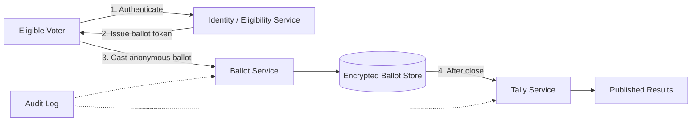
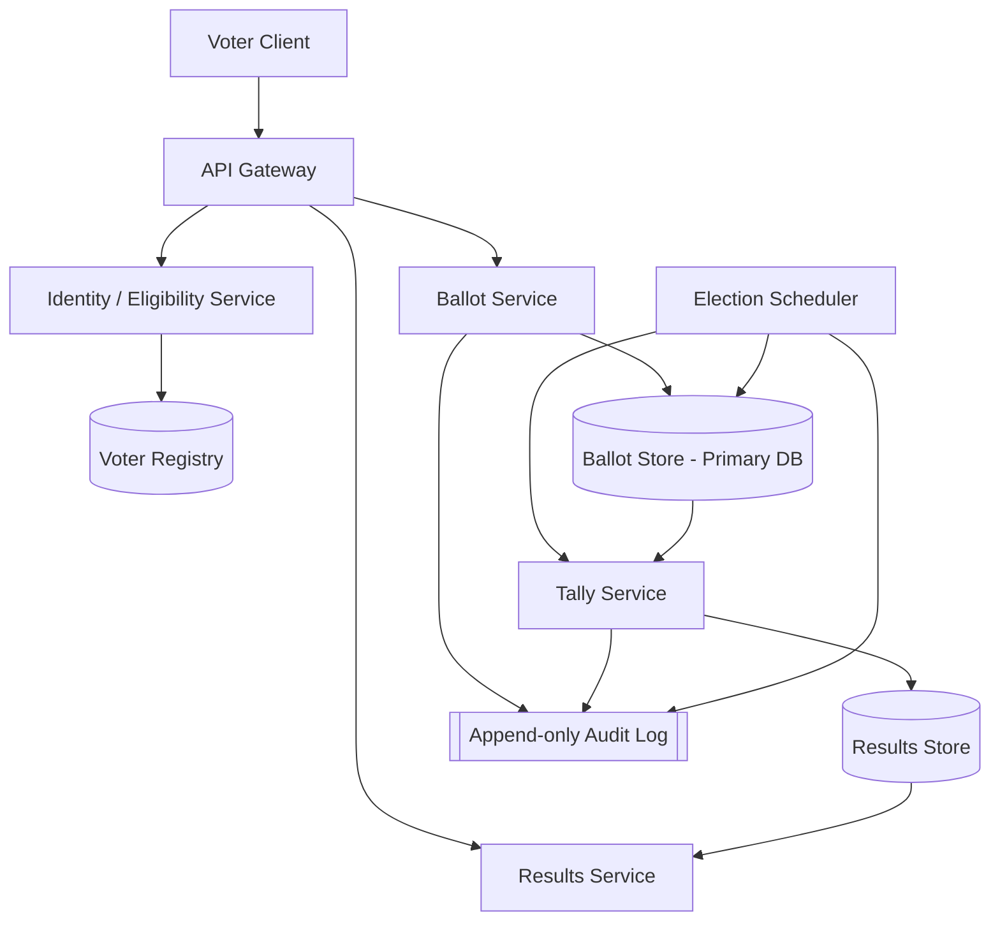
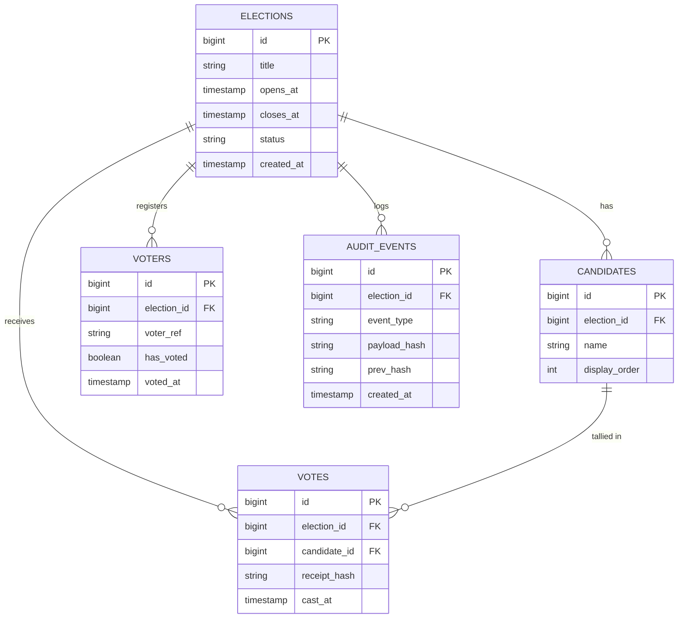
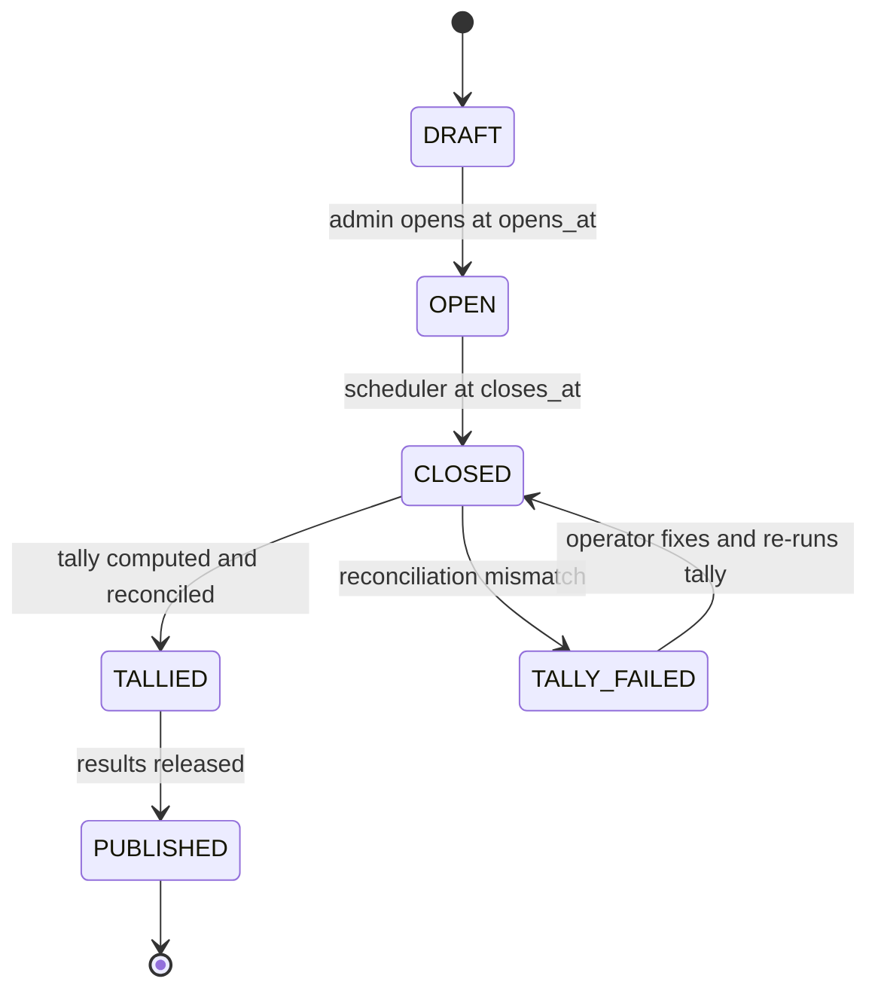

# Design a Basic Online Voting System

## Blogs and websites

## Medium

## Youtube

## Theory

### Topics Covered

1. [Introduction](#introduction)
2. [Functional Requirements](#functional-requirements)
3. [Non-Functional Requirements](#non-functional-requirements)
4. [Capacity Estimation](#capacity-estimation)
5. [Characteristics](#characteristics)
6. [Components](#components)
7. [Patterns](#patterns)
8. [Benefits](#benefits)
9. [Pros](#pros)
10. [Cons](#cons)
11. [Challenges](#challenges)
12. [Best Practices](#best-practices)
13. [When to Use and When Not to Use](#when-to-use-and-when-not-to-use)
14. [Use Cases](#use-cases)
15. [API Design](#api-design)
16. [Data Modeling](#data-modeling)
17. [High-Level Design](#high-level-design)
18. [Deep Dive](#deep-dive)
19. [Java and Spring Boot Implementation Guide](#java-and-spring-boot-implementation-guide)
20. [Interview Questions and Answers](#interview-questions-and-answers)

---

### Introduction

**Problem statement.** Design a basic online voting system for a single election/ballot where verified users can cast exactly one vote for a candidate/option, and results are tallied after the voting window closes.

An online voting system is software that lets eligible voters cast ballots over a network instead of at a physical polling station. It exists because in-person voting is expensive to organize, slow to tally, and hard to scale for geographically distributed electorates such as diaspora voters, distributed company shareholders, university student bodies, and online communities. The system replaces physical ballot papers, ballot boxes, and manual counting with authenticated digital ballot submission and automated tallying.

The problem it solves sounds simple — collect one choice per eligible person and count — but the requirements conflict with each other in ways that make this a classic system design interview topic:

- **Secrecy vs. integrity.** Every vote must be counted exactly once, yet no one (not even the operator) should be able to learn how a specific voter voted. Proving a vote was counted without revealing its content is the central tension.
- **Anonymity vs. eligibility.** Only verified, eligible voters may vote, but the verification record must not be linkable to the ballot that was cast.
- **Availability vs. accuracy.** Traffic is extremely bursty around deadlines, so the system must stay up under spikes while never losing, duplicating, or altering a vote.



The diagram shows the core idea: authentication and ballot casting are deliberately separated so the identity check and the stored vote travel on different paths and are never joined.

**Real-life use cases**

- **National and municipal elections** (Estonia's i-Voting, Swiss cantonal pilots) — the highest-stakes variant, requiring end-to-end verifiability and legal audit trails.
- **Corporate governance** — shareholder proxy voting and board elections run by platforms such as Broadridge.
- **University and student-body elections** — medium scale, strong secrecy, moderate adversarial pressure.
- **Union and association ballots** — ratification votes, strike ballots, officer elections.
- **Awards and community governance** — open-source project steering committees, HOA decisions.

For this design we scope to the *basic* variant stated in the problem statement: a single election, verified voters, one vote each, tally after close. The deep-dive section discusses how the design extends toward verifiable, national-grade elections.

---

### Functional Requirements

1. **Voter registration and verification.** An administrator (or an upstream identity provider) registers the set of eligible voters for an election. The system must be able to verify that a request to vote comes from a registered, eligible voter.
2. **Election lifecycle management.** An election is created with a title, a candidate list, an opening time (`opens_at`), and a closing time (`closes_at`). It moves through states: `DRAFT → OPEN → CLOSED → TALLIED/PUBLISHED`.
3. **Ballot casting within the window.** A verified voter can cast exactly one vote for one candidate, only while the election is open. Votes submitted before `opens_at` or after `closes_at` are rejected.
4. **Double-vote prevention.** The system guarantees at most one counted vote per voter, even under concurrent duplicate requests, retries, or deliberate replay.
5. **Ballot secrecy.** The stored ballot must not contain the voter's identity; the public tally must not be linkable back to any individual voter.
6. **Vote immutability.** Once cast, a vote cannot be altered or deleted by the voter or by ordinary operators. (In the basic design the voter also cannot change their vote; advanced variants allow re-voting with only the last ballot counting.)
7. **Voting receipt.** The voter receives an opaque receipt confirming their ballot was accepted, without revealing its content to anyone else.
8. **Tally and publication after close.** After `closes_at`, the system tallies votes per candidate and exposes the results. Partial tallies must not be visible while voting is open, because leaking them can influence turnout and strategic voting.
9. **Audit trail.** Every significant event (election opened, vote accepted, election closed, tally computed, results published) is recorded in an append-only audit log.
10. **Election status query.** Anyone (or any authenticated voter, per policy) can check whether the election is open, closed, or published.

---

### Non-Functional Requirements

- **Scale.** Up to a few million eligible voters per election (assume 5 million for capacity estimation). Traffic is extremely bursty near voting deadlines — a large fraction of votes arrive in the final hours.
- **Integrity.** Exactly one vote counted per eligible voter; votes must not be alterable after submission. The tally must be reproducible: re-running the tally over the stored ballots must give the same result.
- **Availability.** Voting must stay available under peak load near the deadline — target 99.95% availability during the voting window. A missed vote due to downtime is not recoverable (the voter may not come back), so availability during the window matters more than average availability.
- **Latency.** Vote submission acknowledged in under 300 ms at p99; status reads under 100 ms. Tally computation may be offline (minutes) and is not latency-sensitive.
- **Durability.** Once a vote is acknowledged, it must survive any single-node failure — committed to durable storage with replication (synchronous replica or quorum write) before the success response is returned. Zero acknowledged-vote loss (RPO = 0 for cast ballots).
- **Privacy / secrecy.** Individual vote choice must not be linkable back to the voter in the public tally, in database dumps, or in logs.
- **Auditability.** End-to-end traceability of system behavior (not of individual choices) so an independent auditor can verify that only eligible voters voted, each voted at most once, and all cast ballots were tallied unmodified.
- **Consistency.** The has-voted flag and the stored ballot must be consistent (no state where a voter is marked as voted but no ballot exists, or vice versa). Results may be eventually consistent for read replicas, but the tally itself is computed from the strongly consistent primary store.

---

### Capacity Estimation

Back-of-envelope estimation with explicit assumptions.

**Assumptions**

- Eligible voters: **5 million**
- Expected turnout: **70%** → 3.5 million votes cast
- Voting window: **12 hours** in one day
- Burst profile: **50% of votes arrive in the final 2 hours** (deadline effect)
- Payload sizes: cast-vote request ≈ 1 KB (including headers/auth token); response + receipt ≈ 0.5 KB
- Stored vote row (with overhead, indexes): ≈ 200 bytes; voter-registry row ≈ 150 bytes; audit event ≈ 300 bytes

**QPS**

1. Total votes: `5,000,000 × 0.70 = 3,500,000`
2. Votes in the busy window: `3,500,000 × 0.50 = 1,750,000` votes in 2 hours
3. Average rate in the busy window: `1,750,000 / 7,200 s ≈ 243 votes/second`
4. Peak factor of 4× average (minute-level bursts): `≈ 1,000 votes/second peak`
5. Status/eligibility reads typically outnumber writes 10:1 → `≈ 10,000 reads/second peak` (cacheable).

A single well-tuned relational database primary handles ~1k writes/s comfortably; read load is served from replicas and caches. The write bottleneck is the `voters` row update, which is a hot row *per voter* (not per election), so contention is spread across millions of rows — no single hot key.

**Storage**

1. Votes: `3,500,000 × 200 B ≈ 700 MB`
2. Voter registry: `5,000,000 × 150 B ≈ 750 MB`
3. Audit events (≈ 5 events per vote on average is too high; assume 1.2 events/vote): `3,500,000 × 1.2 × 300 B ≈ 1.26 GB`
4. Candidates/election metadata: negligible (kilobytes)
5. **Total: well under 3 GB per election** — trivially fits a single database; archival to object storage after publication is cheap.

**Bandwidth**

1. Peak write bandwidth: `1,000 req/s × 1 KB ≈ 1 MB/s` inbound
2. Peak read bandwidth: `10,000 req/s × 2 KB ≈ 20 MB/s` outbound if results pages are served fresh; far less with CDN/caching for the status endpoint.

**Takeaway.** The system is *not* capacity-challenged; it is *correctness- and trust-challenged*. The interesting design work is integrity, secrecy, and auditability, not sharding — a fact interviewers like candidates to state explicitly.

---

### Characteristics

- **One person, one vote.**
  What it means: each eligible voter contributes exactly one ballot to the tally. Why it matters: it is the defining fairness property of an election. How it works: the voter registry row carries a `has_voted` flag that is flipped atomically with ballot insertion (see double-vote prevention in the Deep Dive). Example: a voter refreshing the page or retrying after a timeout must never create a second counted vote.

- **Ballot secrecy.**
  What it means: no one can determine how a specific voter voted. Why it matters: without secrecy, voters can be coerced or can sell votes, because they could prove their choice. How it works: identity (the `voters` table) and choice (the `votes` table) are stored in separate records with no shared key. Example: even a DBA with full table access cannot answer "who voted for candidate X?".

- **Verifiability (in tension with secrecy).**
  What it means: voters and auditors can gain confidence that ballots were counted as cast. Why it matters: trust in the outcome requires more than trusting the operator. How it works: receipts, append-only audit logs, and (in advanced systems) cryptographic bulletin boards. Example: a voter receives a hash receipt and can later check that the hash appears in the published ballot box.

- **Immutability of cast ballots.**
  What it means: an acknowledged ballot is never modified or deleted. Why it matters: mutable ballots make the tally meaningless. How it works: insert-only tables, restrictive DB permissions (no UPDATE/DELETE grants), and hash-chained audit logs. Example: an operator attempting to fix a "mistake" in the ballot store leaves a detectable gap in the hash chain.

- **Bursty, deadline-driven traffic.**
  What it means: load concentrates near the close of the window. Why it matters: capacity and availability must be planned for the peak, not the average. How it works: autoscaling, connection pooling sized for peak, and load-shedding of non-essential endpoints near the deadline. Example: 50% of votes in the last 2 of 12 hours, as in the capacity estimation.

- **Strong durability requirement.**
  What it means: an acknowledged vote can never be lost. Why it matters: silently dropping votes is indistinguishable from rigging the election. How it works: synchronous commit to the primary (ideally with a synchronous replica or quorum) before responding success. Example: the API returns 201 only after the database transaction commits, never after an async enqueue alone.

- **Time-boxed operation.**
  What it means: the election has strict open and close instants. Why it matters: votes outside the window are invalid, and early tally leakage is harmful. How it works: server-side window checks on every cast (never client-side clocks) and a state machine that gates result visibility. Example: a vote arriving 1 ms after `closes_at` is rejected with 409.

- **Auditability.**
  What it means: every state transition and administrative action leaves a tamper-evident record. Why it matters: disputes are resolved from the audit trail, not from memory or ad-hoc logs. How it works: append-only audit events, hash chaining, and WORM/archival storage. Example: an auditor replays the audit log and reconciles event counts with ballot counts.

- **Asymmetric read/write sensitivity.**
  What it means: status reads can be cached and eventually consistent; ballot writes cannot. Why it matters: it lets you scale the read path aggressively without weakening write integrity. Example: election status served from a 5-second-TTL cache while every cast goes to the primary database.

- **Low tolerance for false positives in eligibility.**
  What it means: admitting an ineligible voter is worse than briefly delaying an eligible one. Why it matters: illegitimate votes cannot be removed after the fact (you cannot find them — secrecy!). How it works: verify eligibility *before* issuing the ballot token, and fail closed on identity-service errors. Example: if the registry lookup times out, return 503 and ask the voter to retry rather than letting them vote.

---

### Components

- **Identity / eligibility service**
  Purpose: prove the caller is a registered, eligible voter for this election. Responsibilities: credential verification (or federation with a national ID / SSO / OAuth provider), eligibility lookup against the voter registry, issuance of a short-lived signed ballot token. How it works: after successful authentication it signs a token containing only the election id and an anonymous voter pseudonym (never the raw identity). Relationships: called by the API layer before ballot casting; consumes the voter registry. Real-world example: Estonia's i-Voting authenticates with the national ID card/Mobile-ID before a ballot is issued.

- **API layer (gateway)**
  Purpose: single entry point for all clients. Responsibilities: TLS termination, authentication, rate limiting, request validation, routing to vote and tally services. How it works: stateless horizontally scaled instances behind a load balancer. Relationships: front of every other component. Real-world example: an NGINX/Envoy or cloud ALB tier in front of Spring Boot services.

- **Ballot (vote) service**
  Purpose: execute the cast-vote use case with integrity guarantees. Responsibilities: validate window and token, enforce one-vote-per-voter, write the anonymous ballot and flip the eligibility flag in one transaction, issue the receipt, emit audit events. Relationships: owns writes to `voters` and `votes`; publishes audit events to the audit pipeline. Real-world example: the core transactional microservice in any voting platform.

- **Ballot store (primary database)**
  Purpose: durable home of the registry, ballots, and election metadata. Responsibilities: ACID transactions, unique constraints, replication, backup. Relationships: written by the ballot service; read by the tally service after close. Real-world example: PostgreSQL with synchronous streaming replication.

- **Tally service**
  Purpose: compute per-candidate counts after the election closes. Responsibilities: read all ballots, group and count, reconcile totals against the number of `has_voted` flags, write results, mark the election published. Relationships: reads the ballot store; writes the results store; emits audit events. Real-world example: a batch job triggered by the election scheduler, comparable to the counting phase at a physical election.

- **Election scheduler / lifecycle manager**
  Purpose: move elections through `DRAFT → OPEN → CLOSED → PUBLISHED` at the right instants. Responsibilities: trigger open/close transitions, invoke tallying, gate result visibility. Relationships: updates election status in the database; notifies the tally service. Real-world example: a scheduled job (Quartz, Spring `@Scheduled` with leader election, or a cloud scheduler).

- **Results service / read API**
  Purpose: serve status and published results. Responsibilities: fast reads, caching, access control on unpublished results. Relationships: reads the results store and election metadata. Real-world example: a read-only service fronted by a CDN for the results page.

- **Audit service / append-only log**
  Purpose: tamper-evident record of every significant event. Responsibilities: receive audit events, hash-chain them, persist to WORM storage, support auditor queries. Relationships: receives events from ballot, tally, and lifecycle components. Real-world example: a Kafka topic compacted into immutable object storage, or a purpose-built ledger database such as AWS QLDB.

- **Notification service (optional)**
  Purpose: send receipts by email/SMS and notify voters when results are published. Relationships: consumes events from ballot and lifecycle components. Real-world example: SES/SNS or an in-house messaging service.



---

### Patterns

- **Token-and-ballot separation (anonymous credential pattern)**
  What it is: authentication produces a short-lived signed token that carries no identity, and the ballot is submitted against the token. Problem it solves: it decouples *who is allowed to vote* from *what they voted*, enabling secrecy with eligibility. How it works: the identity service signs `{electionId, pseudonym, exp}`; the ballot service validates the signature and records only the pseudonym in the `voters` table. When to use: whenever authorization and action records must be unlinkable. When not to use: when votes must be attributable (e.g., a public roll-call vote) — then keep identity on the ballot deliberately. Advantages: strong secrecy, simple to audit eligibility separately. Disadvantages: token issuance is an extra moving part and a potential failure point during peaks. Real-world example: blind-signature token schemes in cryptographic voting (the voter gets a ballot form signed blindly, so the signer never sees the filled ballot).

- **Double-entry separation of concerns (registry vs. ballot box)**
  What it is: two tables — one records *that* you voted, the other records *what* was voted — deliberately not joinable. Problem it solves: simultaneous double-vote prevention and secrecy. How it works: one transaction flips `has_voted` and inserts the anonymous ballot; the only link is temporal (both happened in the same transaction), which reveals nothing about content. Advantages: simple, auditable, no cryptography needed for basic secrecy. Disadvantages: a privileged operator with query logs could attempt timing correlation; mitigations are batching inserts and separating operator roles. Real-world example: physical elections do exactly this — the electoral roll is checked at the door, the paper ballot carries no name.

- **Outbox pattern**
  What it is: audit/notification events are written to an outbox table in the same transaction as the ballot, then relayed asynchronously. Problem it solves: the dual-write problem — you cannot atomically write to a database and publish to Kafka. How it works: transaction inserts ballot + outbox row; a relay polls/CDC-streams the outbox to the audit pipeline. Advantages: no lost or phantom audit events. Disadvantages: at-least-once delivery, so consumers must be idempotent. Real-world example: Debezium CDC feeding an audit data lake.

- **CQRS (Command Query Responsibility Segregation)**
  What it is: the write model (ballot casting) and the read model (status/results) are separate services and stores. Problem it solves: reads vastly outnumber writes and have totally different consistency needs. How it works: the results service maintains its own read-optimized store, populated only after close. Advantages: independent scaling and caching; the hot read path never touches the ballot store. Disadvantages: two stores to keep consistent; extra operational cost. Real-world example: election-night results pages served from a CDN while the count proceeds in a sealed system.

- **State machine pattern (election lifecycle)**
  What it is: election status transitions are modeled as an explicit state machine (`DRAFT → OPEN → CLOSED → TALLIED → PUBLISHED`) with guards. Problem it solves: prevents illegal operations such as voting while closed or publishing before tally. How it works: transitions validated in the service layer and enforced by a status check in every ballot write. Advantages: single source of truth for legality; easy to audit transitions. Disadvantages: must guard against concurrent transitions (use conditional updates `WHERE status = 'OPEN'`). Real-world example: any workflow engine; here a simple DB-checked state machine suffices.

- **Hash-chained append-only log (tamper evidence)**
  What it is: each audit record includes the hash of the previous record, forming a chain. Problem it solves: silent tampering with history — deleting or editing an old record breaks the chain. How it works: `hash_n = SHA256(hash_{n-1} || event_n)`; auditors recompute the chain. Advantages: cheap, strong tamper evidence. Disadvantages: detects but does not prevent tampering; needs the head hash anchored externally (e.g., published or stored in WORM storage). Real-world example: blockchains use this; so do certificate-transparency logs and ledger databases.

---

### Benefits

- **Trust through architecture, not promises.** Separating identity from ballots makes secrecy a structural property of the system rather than a policy operators could quietly violate. In production this matters because the strongest answer to "how do we know you didn't peek?" is "the data to answer that question does not exist anywhere."
- **Exactly-once semantics from boring technology.** One ACID transaction (flip flag + insert ballot) plus a unique constraint gives exactly-one-vote without distributed locking or exotic infrastructure. In production, boring and provable beats clever and fragile — an election is not the place for eventual-consistency heroics.
- **Deadline-proof availability planning.** Because traffic is predictable in shape (bursts near close), capacity can be pre-provisioned for the peak window at modest cost. In production this means you scale up *before* the final two hours instead of reacting to an outage while voters are locked out.
- **Dispute resolution from the audit trail.** Hash-chained audit logs turn post-election disputes from opinion contests into verifiable recomputation. In production this shortens incident reviews and satisfies external auditors without giving them access to secret ballot content.
- **Delayed tally protects election legitimacy.** Publishing results only after close prevents bandwagon effects and last-minute manipulation of turnout. In production this is a product-level requirement that must be enforced in code (the results endpoint literally refuses to serve counts while `status = OPEN`), not merely a process promise.
- **Receipts give voters individual assurance.** An opaque receipt lets each voter confirm *their* ballot was accepted, which surfaces systemic failures (e.g., a silently failing ballot service) immediately through voter complaints — free, distributed monitoring.

---

### Pros

- **High integrity with simple mechanics.** The unique constraint on `(election_id, voter_id)` in the registry plus a single transaction delivers the one-person-one-vote guarantee using nothing more exotic than PostgreSQL. The advantage compounds at scale: correctness does not degrade as voter count grows, because contention is per-voter-row, not per-election.
- **Strong ballot secrecy by construction.** Because the `votes` table stores no voter reference, even full database compromise does not expose individual choices. This dramatically reduces the blast radius of a breach compared to designs that store `(voter_id, candidate_id)` together and then promise to "anonymize later."
- **Cheap to operate at national scale.** The capacity estimation shows a few gigabytes of data and ~1,000 writes/s at peak — a single primary with read replicas suffices. There is no sharding, no consensus cluster, no exotic infrastructure to get wrong on election day.
- **Clear failure semantics.** Votes outside the window fail; votes with a spent token fail; double votes fail with a constraint violation. Deterministic, explainable failure modes make the system defensible in court and in incident reviews.
- **Independently scalable read and write paths.** Status and result reads are cacheable and eventually consistent, so the election-night traffic spike on results pages never threatens the write path that actually records votes.
- **Extensible toward verifiable elections.** The receipt slot and the audit pipeline are natural attachment points for later upgrades (cryptographic receipts, public bulletin boards, risk-limiting audits) without redesigning the core.

---

### Cons

- **Coercion resistance is limited.** Because a voter receives a receipt, a coercer who observes the receipt *and* can probe the system may extract information. The basic design also lets a voter be watched while voting from home (the "voting from the kitchen table" problem). Mitigation requires advanced cryptography (re-voting with last-ballot-wins, deniable receipts) that this basic design deliberately omits — the trade-off is simplicity and deployability.
- **The operator is still trusted for eligibility.** If the identity service issues tokens to ineligible users, or creates fake voters, the ballot service cannot tell. Secrecy makes this *worse*, not better: you cannot find the illegitimate ballots afterward because they are anonymous by design. Mitigations are external: published voter-roll hashes, multi-party control of the registry, and reconciliation of ballot count vs. registry size.
- **Secrecy blocks per-voter correction.** If a voter insists their vote was recorded wrong, the system *cannot* check — that is the price of unlinkability. The design trades individual recourse for collective secrecy; verifiable schemes (ballot trackers, Benaloh challenges) reduce but do not eliminate this.
- **Availability is deadline-critical and unforgiving.** A crash at 21:55 on election night loses votes permanently because voters may not retry before close. The system trades operational forgiveness (no "we'll process the backlog tomorrow") for a hard real-time window, demanding pre-provisioned redundancy.
- **Single-election simplicity.** The basic design models one election per deployment of the flow; running many concurrent elections multiplies registry and token-issuance complexity (which elections is this voter eligible for?). The schema generalizes (foreign keys already include `election_id`), but operational tooling must grow.
- **Audit log is evidence, not prevention.** Hash chaining detects tampering after the fact; it does not stop a malicious operator from writing false events in real time. The trade-off is that deterrence and detection replace prevention — acceptable only with strong access control and role separation on top.

---

### Challenges

- **Simultaneous secrecy and verifiability (technical).** The hardest problem in the domain: prove each ballot was counted without revealing its content. The basic design resolves it by separation plus receipts; national-grade systems need homomorphic tallying or mix-nets, which are an order of magnitude more complex.
- **Concurrency at the deadline (scalability).** Thousands of voters per second hitting "cast" simultaneously, many retrying, creates duplicate-submission storms. The design must make retries safe (unique constraints, idempotency keys) rather than merely unlikely to collide.
- **Trust in the operator and the platform (security).** Server-side voting systems concentrate power in whoever controls the servers. Client-side malware can change a vote before it is encrypted; a malicious admin can stuff the registry. Defense is layered: role separation, multi-party oversight, tamper-evident logs, and published roll hashes.
- **Guaranteeing tally correctness (reliability).** The tally must reconcile: `count(votes) == count(voters where has_voted)` and per-candidate counts must sum to the total. Any mismatch is an incident. Reconciliation jobs and independent re-tally from a snapshot are required, not optional.
- **Time handling (correctness).** Window checks must use a single authoritative clock (the database server or a synchronized time source). Client clocks are untrusted; multi-region deployments must agree on `closes_at` to the second or face "I voted before midnight!" disputes.
- **Data lifecycle and retention (operational).** Ballots and logs must be retained for the legally mandated period, then verifiably destroyed. Encryption keys for the ballot store must be managed so that retention, audit access, and eventual deletion are all possible.
- **Abuse and denial of service (security/performance).** Registration bombing, credential stuffing against voter login, and application-layer DDoS near the deadline are realistic attacks. Rate limiting, WAF rules, and pre-provisioned capacity are mandatory; an election is a scheduled, announced, high-value target.
- **Evolving legal requirements (maintainability).** Electoral law differs by jurisdiction and changes; the system must parameterize retention periods, accessibility rules, and audit formats rather than hard-coding them.

---

### Best Practices

1. **Never join identity to ballot — in tables, logs, or traces.** Why: any single artifact containing both is a secrecy break waiting to be subpoenaed or leaked. Example: log lines from the ballot service contain the ballot id, never the user id; the voter-service logs contain the user id, never the candidate id.
2. **Enforce one-vote with a database unique constraint, not application checks.** Why: a check-then-act in code races under concurrency; a unique index on `(election_id, voter_id)` is enforced by the storage engine and cannot be bypassed by two simultaneous requests. Example: two parallel requests both pass the `has_voted` check; one insert wins, the other gets a constraint violation mapped to 409.
3. **Commit before acknowledging.** Why: a success response must mean the vote is durable. Return 201 only after the transaction commits (and ideally after synchronous replication). Example: if you acknowledge on enqueue and the broker then loses the message, you have silently disenfranchised a voter — the worst possible outcome.
4. **Use the database clock for window enforcement.** Why: application servers can drift; `closes_at` checks must be authoritative and consistent. Example: `INSERT ... WHERE now() BETWEEN opens_at AND closes_at` evaluated in the transaction, not `Instant.now()` compared in Java against a value fetched minutes earlier.
5. **Gate the results endpoint on election state, not on time alone.** Why: time-only gating leaks tallies if the close is delayed or extended. Example: results are served only when `status IN (TALLIED, PUBLISHED)`; extending the window by an hour changes no code path.
6. **Hash-chain the audit log and anchor the head externally.** Why: internal-only evidence can be rewritten wholesale; a head hash published elsewhere (even in a press release or notarized file) makes rewrite detectable.
7. **Separate operator roles.** Why: the person who can query the ballot store must not be the person who can query request logs. Role-based database grants and separate credentials reduce insider-correlation risk.
8. **Load-test the deadline shape, not the average.** Why: the failure mode that matters is the final-two-hours spike. Example: rehearse with 4× the average busy-window rate and verify p99 cast latency stays under 300 ms with connection pools saturated.
9. **Make every retry safe.** Why: voters *will* double-click, refresh, and retry on timeout. Idempotency keys plus unique constraints make duplicate submissions harmless no-ops returning the original receipt.
10. **Reconcile before publishing.** Why: the tally must be provably complete. Run automated reconciliation (`ballots == has_voted flags`, per-candidate sums equal total) and require a clean report before the state machine allows `PUBLISHED`.

---

### When to Use and When Not to Use

**Use this design when**

- The electorate is known and verifiable in advance (registered members, students, shareholders) — the registry is a closed list.
- One vote per person per election is the rule, and the election has a clear window.
- The threat model trusts a professionally operated platform with role separation, but not individual operators — separation-of-duty controls are feasible.
- Results must be withheld until a common close time.
- Simplicity and auditability by non-cryptographers (an election commission, an auditor) are priorities.

**Do not use this design (choose an alternative) when**

- **Coercion or vote-selling is a primary threat** → use a coercion-resistant cryptographic scheme (re-vote with last-ballot-counts, deniable receipts, e.g., Civitas-style designs).
- **The operator itself is untrusted** → use end-to-end verifiable voting (Helios, Belenios) with a public bulletin board, or do not vote online at all.
- **Votes must be publicly attributable** (board roll-call, parliamentary votes) → use a simple authenticated ballot *with* identity attached; secrecy machinery is unnecessary.
- **The electorate is anonymous/open** (a Twitter poll) → this becomes the polling-app problem; see the polling/voting app design, where duplicate prevention is best-effort rather than registry-based.
- **Weighted or ranked-choice voting** → the data model needs ranked ballots or weight columns, and the tally service becomes a multi-round computation; this design's single-choice ballot is insufficient.

**Decision factors:** electorate verifiability, threat model (who must *not* be trusted), required verifiability level, legal audit obligations, scale and burst profile, and whether results are delayed or live.

---

### Use Cases

#### Use Case 1: University student-body election

- **Problem.** 30,000 students elect a student president over a 24-hour window; the election committee needs a defensible result and students demand secrecy.
- **Proposed solution.** Single election, registry populated from the enrollment system, SSO authentication, token-and-ballot separation, tally published after close.
- **Why this design is suitable.** Closed verifiable electorate, moderate scale, strong secrecy requirement, and a real audit committee that can re-run the tally from the ballot store.
- **How it works.** Students log in with university SSO; the eligibility service checks enrollment status and issues a ballot token; ballots are cast against the token; at 18:00 the scheduler closes the election, the tally service counts and reconciles, and results are published to a CDN-cached page.
- **Trade-offs.** Receipts let students confirm participation, but a "show me your receipt" coercion channel exists — accepted because campus coercion risk is low and the committee values the fraud-detection benefit of receipts.

#### Use Case 2: Corporate shareholder proxy vote

- **Problem.** 200,000 shareholders vote on board resolutions; many vote weeks early; regulators require retention of evidence for years.
- **Proposed solution.** The same core design plus long retention: ballots and audit logs archived to WORM object storage with a 7-year retention policy; notification service emails receipts.
- **Why this design is suitable.** Registry is exact (share register), one-vote-per-shareholder (or weighted by shares — an extension: add a `weight` column to the registry row and tally `SUM(weight)` per candidate), and the audit pipeline satisfies regulatory evidence requirements.
- **How it works.** Vote opens 30 days before the AGM; traffic is low and flat until a final-week spike; tally runs at AGM close; the reconciliation report (ballots vs. registry, per-resolution sums) is attached to the minutes.
- **Trade-offs.** Weighted voting adds tally complexity; secrecy is weaker by law in some jurisdictions (brokers may need to prove how shares were voted) — the schema supports an optional attributable mode by adding `voter_id` to a separate `proxy_ballots` table where law requires it.

#### Use Case 3: Homeowners-association board election

- **Problem.** 800 homeowners, high mistrust of the volunteer-run process, tiny budget.
- **Proposed solution.** The basic design deployed as a single instance with managed PostgreSQL; audit log head hash emailed to all members at close.
- **Why this design is suitable.** Small scale makes capacity trivial; the value is entirely in integrity and transparency mechanics that this design provides cheaply.
- **How it works.** Members authenticate with an emailed one-time link; cast votes over a week; at close, the tally plus reconciliation numbers and the audit head hash are published, letting any member verify the count totals.
- **Trade-offs.** No dedicated security team, so managed services carry the operational load; receipts and the published head hash substitute for professional observation.

#### Use Case 4: National referendum (boundary case)

- **Problem.** 5 million eligible voters, nation-state adversaries, legal end-to-end verifiability requirements.
- **Proposed solution.** Start from this design, but extend the deep-dive items: cryptographic receipts verifiable against a public bulletin board, independent re-tally by a second vendor's software from an exported ballot snapshot, multi-party control of the registry.
- **Why this design is suitable (as a base).** The transactional core, lifecycle state machine, and audit pipeline are the same; what changes is the *strength* of the verifiability components, not the architecture.
- **How it works.** As per the high-level design, with the ballot store additionally mirrored (hashes only) to a public append-only bulletin board; any voter can check their receipt hash appears; auditors run mix-net or homomorphic tally verification.
- **Trade-offs.** Massive increase in complexity and cost; client-side malware and coercion remain open problems that software alone does not solve — Estonia mitigates with re-voting (last vote counts) and in-person override options.

---

### API Design

Base path: `/api/v1/elections`. All mutating endpoints require authentication (OIDC bearer token) and enforce rate limits at the gateway. Original endpoint set preserved and expanded:

| Method | Endpoint | Purpose | Auth |
|---|---|---|---|
| POST | `/api/v1/elections` | Create election (admin) | Admin |
| POST | `/api/v1/elections/{electionId}/open` | Open the voting window (admin/scheduler) | Admin |
| POST | `/api/v1/elections/{electionId}/vote` | Cast a vote | Voter |
| GET | `/api/v1/elections/{electionId}/status` | Election status, turnout count | Public/Voter |
| GET | `/api/v1/elections/{electionId}/results` | Results after close | Public |
| GET | `/api/v1/elections/{electionId}/receipt/{receiptId}` | Verify a receipt exists in the ballot box | Voter |

**Cast a vote**

```http
POST /api/v1/elections/42/vote HTTP/1.1
Authorization: Bearer eyJhbGciOi...
Idempotency-Key: 9b1d2f3c-...
Content-Type: application/json

{ "candidateId": 7 }
```

Success `201 Created`:

```json
{
  "receiptId": "rcpt_5f2c9a1e8b4d",
  "receiptHash": "9f86d081884c7d659a2feaa0c55ad015a3bf4f1b2b0b822cd15d6c15b0f00a08",
  "castAt": "2026-05-01T10:15:30Z"
}
```

Error responses:

```json
HTTP 409 Conflict
{ "error": "ALREADY_VOTED", "message": "A ballot has already been recorded for this voter in this election." }

HTTP 422 Unprocessable Entity
{ "error": "ELECTION_NOT_OPEN", "message": "Election 42 is CLOSED; votes are accepted only between 2026-05-01T00:00:00Z and 2026-05-01T18:00:00Z." }

HTTP 403 Forbidden
{ "error": "NOT_ELIGIBLE", "message": "The authenticated user is not on the voter registry for this election." }

HTTP 400 Bad Request
{ "error": "VALIDATION_FAILED", "message": "candidateId must not be null", "fields": ["candidateId"] }
```

**Get results** — gated on state, not time:

```http
GET /api/v1/elections/42/results
```

```json
HTTP 200 OK
{
  "electionId": 42,
  "status": "PUBLISHED",
  "totalBallots": 3500000,
  "publishedAt": "2026-05-01T18:05:12Z",
  "candidates": [
    { "candidateId": 7, "name": "A. Sharma", "votes": 1823112 },
    { "candidateId": 9, "name": "B. Lee", "votes": 1676888 }
  ]
}
```

While open, the same endpoint returns `409 { "error": "RESULTS_NOT_PUBLISHED" }`.

**Design notes**

- **Idempotency:** the `Idempotency-Key` header plus the `(election_id, voter_id)` unique constraint makes retries safe; a repeated request returns the original receipt (200) rather than a second ballot.
- **Pagination/filtering:** admin listing endpoints use cursor pagination (`?cursor=...&limit=100`) and filters (`?status=OPEN`); the public endpoints above return single resources.
- **Versioning:** path version `/v1`; breaking changes (e.g., ranked-choice ballots) ship as `/v2` with a different payload shape.
- **Auth:** OIDC access tokens for voters; a separate admin realm for lifecycle operations; token introspection cached for the burst window.
- **Rate limiting:** per-identity limits on `/vote` (e.g., 10/min — generous for retries, useless for stuffing) and per-IP limits at the edge.

---

### Data Modeling

**Design principle:** separate *who may vote and whether they have* from *what was voted*. The `votes` table deliberately has **no** voter foreign key. Original table sketch preserved and normalized:



**Keys, constraints, indexes**

- `voters`: `UNIQUE(election_id, voter_ref)` — one registry row per voter per election; this is the double-vote prevention anchor. `voter_ref` is a pseudonym (e.g., HMAC of the user id with an election-specific key), not the raw identity.
- `votes`: `UNIQUE(receipt_hash)`; index on `(election_id, candidate_id)` for the tally `GROUP BY`.
- `candidates`: `UNIQUE(election_id, name)`; FK `ON DELETE RESTRICT` — candidates of a closed election cannot be deleted.
- `audit_events`: `prev_hash` forms the hash chain; table is INSERT-only by permission grant (no UPDATE/DELETE for the application role).

**Normalization vs. denormalization**

- The write model is fully normalized (3NF): no counts stored on `elections` or `candidates`, so no read-modify-write counters to race or drift from the ballot truth.
- The read model is denormalized: after tally, results are materialized into a `results` table / JSON document for fast public reads. This is safe because it is derived *once*, after close, from an immutable source.

**Data lifecycle and partitioning**

- `votes` and `audit_events` are append-only; partition by `election_id` (list partitioning) so each election's data can be archived or dropped as a unit when its retention period ends.
- Turnout counter (`count of has_voted`) can be served from a cached `COUNT(*)` or a maintained counter on `elections` — acceptable because turnout is public, but per-candidate counts are never maintained live (they would leak partial results).

---

### High-Level Design

**Component responsibilities and dependencies**

The API layer authenticates and routes. The identity/eligibility service verifies the voter and issues an anonymous ballot token. The ballot service executes the transactional cast. The ballot store (PostgreSQL primary + synchronous replica) holds registry, ballots, and audit outbox. The scheduler drives the lifecycle state machine. The tally service reads ballots after close, reconciles, and writes the results store. The results service serves status/results from cache. All components emit hash-chained audit events.

**Cast-vote request flow**

```mermaid
sequenceDiagram
    autonumber
    participant V as Voter Client
    participant GW as API Gateway
    participant ID as Eligibility Service
    participant BS as Ballot Service
    participant DB as Primary DB
    participant AU as Audit Pipeline

    V->>GW: POST /elections/42/vote (candidateId, Idempotency-Key)
    GW->>ID: Verify token and eligibility
    ID-->>GW: OK + anonymous voter pseudonym
    GW->>BS: castVote(electionId, pseudonym, candidateId, idempotencyKey)
    BS->>DB: BEGIN; lock registry row; check window and has_voted
    alt first vote
        BS->>DB: UPDATE voters SET has_voted=true; INSERT INTO votes (anonymous); INSERT outbox event
        DB-->>BS: COMMIT
        BS-->>V: 201 + receipt hash
    else duplicate
        DB-->>BS: unique violation / has_voted=true
        BS-->>V: 200 with original receipt (retry) or 409 ALREADY_VOTED
    end
    BS->>AU: (via outbox relay) VOTE_ACCEPTED event, hash-chained
```

Under the diagram: the critical property is that steps checking eligibility, flipping the flag, and inserting the ballot happen in **one database transaction**, so a crash anywhere leaves no half-state, and concurrent duplicates hit the unique constraint rather than creating two ballots.

**Tally and publication flow**

```mermaid
sequenceDiagram
    autonumber
    participant S as Scheduler
    participant DB as Primary DB
    participant T as Tally Service
    participant R as Results Store
    participant C as CDN / Public

    S->>DB: closes_at reached -> status := CLOSED (conditional update)
    S->>T: trigger tally(electionId)
    T->>DB: snapshot-read all ballots for election
    T->>T: GROUP BY candidate; reconcile count(votes) vs count(has_voted)
    alt reconciliation clean
        T->>R: write results document
        T->>DB: status := PUBLISHED
        R-->>C: results page served from cache/CDN
    else mismatch
        T->>DB: status := TALLY_FAILED; alert operators; block publication
    end
```

Under the diagram: tallying runs against a consistent snapshot (or after close, when no new ballots can arrive), and publication is gated on an automated reconciliation report — a mismatch halts publication instead of publishing wrong numbers.

**Election lifecycle state machine**



**Scaling and failure handling**

- Stateless API/ballot services scale horizontally; the database primary is the only non-scalable component and is sized for ~1,000 peak writes/s (comfortable for a single modern primary).
- Synchronous replication to a standby gives RPO = 0 for acknowledged ballots; failover promotes the standby (votes already acknowledged are preserved).
- If the audit pipeline is down, ballots still commit — events buffer in the transactional outbox until the relay catches up.
- Non-essential endpoints (receipt verification, admin listings) are load-shed first under extreme load to protect `/vote` and `/status`.

---

### Deep Dive

#### 1. Ballot secrecy vs. verifiability

The fundamental tension: verifiability wants evidence connecting cast ballots to the count; secrecy forbids evidence connecting voters to ballots. The basic design resolves it with **structural separation plus aggregate verifiability**:

- *Secrecy* comes from the schema: `votes` has no voter reference, and the ballot service never logs one.
- *Verifiability* comes from counts and receipts: `count(votes)` must equal `count(voters WHERE has_voted)`, and each voter holds a receipt hash that appears in the ballot box. A voter can verify *inclusion* ("my ballot is in the box") without proving *content* to anyone else.

Full end-to-end verifiability upgrades this with cryptography: ballots are encrypted under a tally key held by multiple trustees; a public bulletin board stores the ciphertexts; the tally is performed via mix-nets or homomorphic aggregation with a published zero-knowledge proof. The voter verifies their ciphertext on the board; anyone verifies the proof — yet no one can decrypt an individual ballot. Systems such as Helios and Belenios implement this. The interview-relevant point: the basic design's receipt slot and audit pipeline are the seams where this cryptography would be attached.

#### 2. Double-vote prevention

Layered defenses, weakest to strongest:

1. **Client-side disabling** — UX only, trivially bypassed.
2. **Application check** (`SELECT has_voted` then insert) — races: two concurrent requests both read `false`.
3. **Database unique constraint** on `voters (election_id, voter_ref)` combined with `UPDATE voters SET has_voted = true WHERE election_id = ? AND voter_ref = ? AND has_voted = false` — the atomic compare-and-set. If the update affects 0 rows, the vote is rejected. This is the load-bearing mechanism.
4. **Idempotency key** — retries return the original receipt instead of erroring, turning a correctness mechanism into good UX.
5. **Token single-use** — the ballot token embeds a `jti` recorded on use; defense in depth against replay at the token layer even if the database layer were bypassed.

All of this happens inside one transaction with the ballot insert, so there is no interleaving that marks a voter as voted without a ballot, or stores a ballot without marking the voter.

#### 3. Voter anonymity and unlinkability

Separation in the schema is necessary but not sufficient. Correlation channels to close:

- **Timing correlation:** if ballot insert timestamps can be matched against authentication logs, content can be inferred for small elections. Mitigations: batch/queue ballot inserts in small random-sized groups, or pad timing at low traffic.
- **Pseudonym reuse:** the registry `voter_ref` must be election-specific (HMAC with per-election key), otherwise the same pseudonym across elections links a voter's history.
- **Network metadata:** IPs in load-balancer logs next to request timing are a correlation source; restrict access, rotate, and separate the teams that hold LB logs vs. DB access.
- **Database write order:** in very small elections, physical row order can approximate submission order; accept the risk or shuffle within a tally batch.

#### 4. Audit trails

The audit log must answer, for any election: how many ballots were accepted, when the window opened/closed, who (which admin principal) triggered lifecycle transitions, and whether anything was altered afterward. Mechanics:

- Append-only table, INSERT-only grants, hash-chained (`prev_hash`), head hash anchored externally at close (published with the results).
- Events: `ELECTION_CREATED`, `ELECTION_OPENED`, `VOTE_ACCEPTED` (no content, just a counter/ballot id), `ELECTION_CLOSED`, `TALLY_COMPLETED` (with reconciliation numbers), `RESULTS_PUBLISHED`.
- Auditors recompute the chain and reconcile event counts against table counts. Any deleted or edited event breaks the chain from that point on.

#### 5. Election integrity end-to-end

Integrity = only eligible voters voted + each at most once + all cast ballots counted unmodified. The basic design delivers this via three reconcilable numbers that must agree: (a) `has_voted` flags in the registry, (b) rows in `votes`, (c) `VOTE_ACCEPTED` events in the audit log. The tally service refuses to publish unless all three match, and the reconciliation report is part of the published artifacts. For higher-stakes elections add: independent re-tally from an exported snapshot, published hash of the voter roll (so the registry itself cannot be quietly edited), and risk-limiting audits (manual sampling of evidence against the reported outcome).

---

### Java and Spring Boot Implementation Guide

Production-oriented skeleton of the core services. Spring Boot 3.x, Java 17+, Spring Data JPA, Bean Validation.

#### 1. Configuration via `@Value`

```java
import org.springframework.beans.factory.annotation.Value;
import org.springframework.context.annotation.Configuration;

@Configuration
public class VotingProperties {

    /** HMAC secret used to derive per-election voter pseudonyms and receipts. Loaded from a secret manager. */
    @Value("${voting.receipt-secret}")
    private String receiptSecret;

    /** Maximum allowed clock skew tolerated when validating ballot tokens. */
    @Value("${voting.token-clock-skew-seconds:30}")
    private long tokenClockSkewSeconds;

    public String receiptSecret() { return receiptSecret; }
    public long tokenClockSkewSeconds() { return tokenClockSkewSeconds; }
}
```

Why: secrets and tunables never live in code; `receipt-secret` comes from a vault via environment/config server, and defaults (`:30`) keep local development easy.

#### 2. JPA entities (write model)

```java
import jakarta.persistence.*;
import java.time.Instant;

@Entity
@Table(name = "voters",
       uniqueConstraints = @UniqueConstraint(columnNames = {"election_id", "voter_ref"}))
public class VoterRegistration {

    @Id @GeneratedValue(strategy = GenerationType.IDENTITY)
    private Long id;

    @Column(name = "election_id", nullable = false)
    private Long electionId;

    /** Election-scoped pseudonym (HMAC of user id). Never the raw user id. */
    @Column(name = "voter_ref", nullable = false, length = 64)
    private String voterRef;

    @Column(name = "has_voted", nullable = false)
    private boolean hasVoted;

    @Column(name = "voted_at")
    private Instant votedAt;

    protected VoterRegistration() { }

    public VoterRegistration(Long electionId, String voterRef) {
        this.electionId = electionId;
        this.voterRef = voterRef;
        this.hasVoted = false;
    }

    public Long getId() { return id; }
    public Long getElectionId() { return electionId; }
    public String getVoterRef() { return voterRef; }
    public boolean hasVoted() { return hasVoted; }
}
```

```java
import jakarta.persistence.*;
import java.time.Instant;

@Entity
@Table(name = "votes",
       uniqueConstraints = @UniqueConstraint(columnNames = {"receipt_hash"}))
public class Vote {

    @Id @GeneratedValue(strategy = GenerationType.IDENTITY)
    private Long id;

    @Column(name = "election_id", nullable = false)
    private Long electionId;

    @Column(name = "candidate_id", nullable = false)
    private Long candidateId;

    @Column(name = "receipt_hash", nullable = false, length = 64)
    private String receiptHash;

    @Column(name = "cast_at", nullable = false)
    private Instant castAt;

    protected Vote() { }

    public Vote(Long electionId, Long candidateId, String receiptHash, Instant castAt) {
        this.electionId = electionId;
        this.candidateId = candidateId;
        this.receiptHash = receiptHash;
        this.castAt = castAt;
    }

    public Long getId() { return id; }
    public String getReceiptHash() { return receiptHash; }
}
```

Note what is **absent**: `Vote` has no voter reference — secrecy is enforced by the schema, and the JPA model makes the missing association obvious to any reviewer.

#### 3. Repository with the atomic compare-and-set

```java
import org.springframework.data.jpa.repository.JpaRepository;
import org.springframework.data.jpa.repository.Modifying;
import org.springframework.data.jpa.repository.Query;
import org.springframework.data.repository.query.Param;

import java.time.Instant;

public interface VoterRegistrationRepository extends JpaRepository<VoterRegistration, Long> {

    /**
     * Atomically flips has_voted false -> true.
     * Returns 1 if this call won the race, 0 if the voter had already voted.
     */
    @Modifying
    @Query("""
           UPDATE VoterRegistration v
              SET v.hasVoted = true, v.votedAt = :now
            WHERE v.electionId = :electionId
              AND v.voterRef = :voterRef
              AND v.hasVoted = false
           """)
    int markVotedIfNotAlready(@Param("electionId") Long electionId,
                              @Param("voterRef") String voterRef,
                              @Param("now") Instant now);
}
```

Why an atomic `UPDATE ... WHERE has_voted = false` instead of read-check-write: the database executes it as a single statement holding the row lock, so concurrent duplicates cannot both succeed — this is the core double-vote defense expressed in one query.

#### 4. Ballot service (transactional core)

```java
import org.springframework.stereotype.Service;
import org.springframework.transaction.annotation.Transactional;

import java.nio.charset.StandardCharsets;
import java.security.MessageDigest;
import java.security.NoSuchAlgorithmException;
import java.time.Clock;
import java.time.Instant;
import java.util.HexFormat;
import java.util.UUID;

@Service
public class BallotService {

    private final ElectionRepository electionRepository;
    private final VoterRegistrationRepository voterRepository;
    private final VoteRepository voteRepository;
    private final AuditOutboxRepository auditOutbox;
    private final VotingProperties properties;
    private final Clock clock;

    public BallotService(ElectionRepository electionRepository,
                         VoterRegistrationRepository voterRepository,
                         VoteRepository voteRepository,
                         AuditOutboxRepository auditOutbox,
                         VotingProperties properties,
                         Clock clock) {
        this.electionRepository = electionRepository;
        this.voterRepository = voterRepository;
        this.voteRepository = voteRepository;
        this.auditOutbox = auditOutbox;
        this.properties = properties;
        this.clock = clock;
    }

    /**
     * Casts a ballot exactly once per voter.
     * Window check, eligibility check, flag flip, ballot insert, and audit outbox
     * write all happen in ONE transaction: any failure rolls everything back.
     */
    @Transactional
    public VoteReceipt castVote(Long electionId, String voterRef, Long candidateId) {
        Election election = electionRepository.findById(electionId)
            .orElseThrow(() -> new ElectionNotFoundException(electionId));

        Instant now = clock.instant();
        if (now.isBefore(election.getOpensAt()) || now.isAfter(election.getClosesAt())) {
            throw new ElectionNotOpenException(electionId, election.getOpensAt(), election.getClosesAt());
        }

        int flipped = voterRepository.markVotedIfNotAlready(electionId, voterRef, now);
        if (flipped == 0) {
            // Either not registered (NOT_ELIGIBLE) or already voted; distinguish for the API layer.
            boolean registered = voterRepository
                .existsByElectionIdAndVoterRef(electionId, voterRef);
            if (!registered) {
                throw new NotEligibleException(electionId);
            }
            throw new AlreadyVotedException(electionId);
        }

        String receiptHash = receiptHash(electionId, voterRef, now);
        Vote vote = voteRepository.save(new Vote(electionId, candidateId, receiptHash, now));

        // Outbox row committed in the same transaction; a relay ships it to the audit pipeline.
        auditOutbox.append(AuditEvent.voteAccepted(electionId, vote.getId()));
        return new VoteReceipt("rcpt_" + UUID.randomUUID(), receiptHash, now);
    }

    /** HMAC-style receipt: proves inclusion in the ballot box without revealing content. */
    private String receiptHash(Long electionId, String voterRef, Instant now) {
        try {
            MessageDigest digest = MessageDigest.getInstance("SHA-256");
            String input = electionId + ":" + voterRef + ":" + now + ":" + properties.receiptSecret();
            return HexFormat.of().formatHex(digest.digest(input.getBytes(StandardCharsets.UTF_8)));
        } catch (NoSuchAlgorithmException e) {
            throw new IllegalStateException("SHA-256 unavailable", e);
        }
    }

    public record VoteReceipt(String receiptId, String receiptHash, Instant castAt) { }
}
```

Key points to explain in an interview: constructor injection (no field injection, easy to unit test), `@Transactional` as the integrity boundary, the atomic flag flip as the single source of truth for double-vote prevention, and the outbox write sharing the transaction so audit events can never be lost or phantom.

#### 5. REST controller with validation and idempotency

```java
import jakarta.validation.Valid;
import jakarta.validation.constraints.NotNull;
import org.springframework.http.HttpStatus;
import org.springframework.http.ResponseEntity;
import org.springframework.web.bind.annotation.*;

@RestController
@RequestMapping("/api/v1/elections")
public class ElectionController {

    private final BallotService ballotService;
    private final TokenService tokenService;

    public ElectionController(BallotService ballotService, TokenService tokenService) {
        this.ballotService = ballotService;
        this.tokenService = tokenService;
    }

    public record CastVoteRequest(@NotNull Long candidateId) { }

    @PostMapping("/{electionId}/vote")
    public ResponseEntity<BallotService.VoteReceipt> castVote(
            @PathVariable Long electionId,
            @Valid @RequestBody CastVoteRequest request,
            @RequestHeader("Authorization") String authorization,
            @RequestHeader(value = "Idempotency-Key", required = false) String idempotencyKey) {
        // Token contains only the election-scoped pseudonym, never the raw identity.
        String voterRef = tokenService.verifyAndExtractVoterRef(authorization, electionId);
        BallotService.VoteReceipt receipt = ballotService.castVote(electionId, voterRef, request.candidateId());
        return ResponseEntity.status(HttpStatus.CREATED).body(receipt);
    }
}
```

#### 6. Global exception handling

```java
import org.springframework.http.HttpStatus;
import org.springframework.http.ResponseEntity;
import org.springframework.web.bind.annotation.ControllerAdvice;
import org.springframework.web.bind.annotation.ExceptionHandler;

@ControllerAdvice
public class GlobalExceptionHandler {

    public record ApiError(String error, String message) { }

    @ExceptionHandler(AlreadyVotedException.class)
    public ResponseEntity<ApiError> alreadyVoted(AlreadyVotedException ex) {
        return ResponseEntity.status(HttpStatus.CONFLICT)
            .body(new ApiError("ALREADY_VOTED",
                "A ballot has already been recorded for this voter in election " + ex.electionId() + "."));
    }

    @ExceptionHandler(ElectionNotOpenException.class)
    public ResponseEntity<ApiError> notOpen(ElectionNotOpenException ex) {
        return ResponseEntity.status(HttpStatus.UNPROCESSABLE_ENTITY)
            .body(new ApiError("ELECTION_NOT_OPEN",
                "Votes are accepted only between " + ex.opensAt() + " and " + ex.closesAt() + "."));
    }

    @ExceptionHandler(NotEligibleException.class)
    public ResponseEntity<ApiError> notEligible(NotEligibleException ex) {
        return ResponseEntity.status(HttpStatus.FORBIDDEN)
            .body(new ApiError("NOT_ELIGIBLE",
                "The authenticated user is not on the voter registry for election " + ex.electionId() + "."));
    }

    @ExceptionHandler(ElectionNotFoundException.class)
    public ResponseEntity<ApiError> notFound(ElectionNotFoundException ex) {
        return ResponseEntity.status(HttpStatus.NOT_FOUND)
            .body(new ApiError("ELECTION_NOT_FOUND", "Unknown election " + ex.electionId() + "."));
    }
}
```

Why `@ControllerAdvice`: error-to-status mapping lives in one place, controllers stay clean, and every client sees consistent error bodies — important for voters automating retries, who must distinguish "retry later" (503) from "stop, you already voted" (409).

#### 7. Tally service

```java
import org.springframework.stereotype.Service;
import org.springframework.transaction.annotation.Transactional;

import java.util.List;
import java.util.Map;
import java.util.stream.Collectors;

@Service
public class TallyService {

    private final ElectionRepository electionRepository;
    private final VoteRepository voteRepository;
    private final VoterRegistrationRepository voterRepository;
    private final ResultsRepository resultsRepository;

    public TallyService(ElectionRepository electionRepository,
                        VoteRepository voteRepository,
                        VoterRegistrationRepository voterRepository,
                        ResultsRepository resultsRepository) {
        this.electionRepository = electionRepository;
        this.voteRepository = voteRepository;
        this.voterRepository = voterRepository;
        this.resultsRepository = resultsRepository;
    }

    /** Runs only after close; refuses to publish if reconciliation fails. */
    @Transactional
    public ElectionResults tally(Long electionId) {
        Election election = electionRepository.findById(electionId)
            .orElseThrow(() -> new ElectionNotFoundException(electionId));
        if (election.getStatus() != ElectionStatus.CLOSED) {
            throw new IllegalElectionStateException("Tally requires CLOSED, got " + election.getStatus());
        }

        List<VoteCount> counts = voteRepository.countByElectionIdGroupByCandidate(electionId);
        long totalBallots = counts.stream().mapToLong(VoteCount::total).sum();
        long markedVoters = voterRepository.countByElectionIdAndHasVotedTrue(electionId);
        if (totalBallots != markedVoters) {
            throw new TallyReconciliationException(electionId, totalBallots, markedVoters);
        }

        Map<Long, Long> byCandidate = counts.stream()
            .collect(Collectors.toMap(VoteCount::candidateId, VoteCount::total));
        ElectionResults results = new ElectionResults(electionId, byCandidate, totalBallots);
        resultsRepository.save(results);
        election.setStatus(ElectionStatus.PUBLISHED);
        return results;
    }

    public record VoteCount(Long candidateId, long total) { }
    public record ElectionResults(Long electionId, Map<Long, Long> votesByCandidate, long totalBallots) { }
}
```

---

### Interview Questions and Answers

**Beginner**

- **Q: What are the core entities of an online voting system?**
  **A:** Election (metadata and window), Candidate (options on the ballot), Voter registration (who is eligible and whether they have voted), Vote (the anonymous ballot), and audit events. The crucial design decision is that the Vote entity carries no voter reference.

- **Q: How do you prevent a voter from voting twice?**
  **A:** With an atomic database operation: `UPDATE voters SET has_voted = true WHERE election_id = ? AND voter_ref = ? AND has_voted = false`, plus a unique constraint on `(election_id, voter_ref)` as a backstop, all in the same transaction as the ballot insert. Application-level checks alone race under concurrency.
  *Follow-up: why is a read-then-write check insufficient?* Because two concurrent transactions can both read `has_voted = false` before either commits; the atomic update holds the row lock so only one succeeds.

- **Q: Why not store `voter_id` on the vote row for simplicity?**
  **A:** It makes every ballot attributable — anyone with read access (admins, attackers, subpoenas) can learn how each person voted. That breaks ballot secrecy and enables coercion and vote-selling. The schema must make the voter-to-choice join impossible, not merely discouraged.

**Intermediate**

- **Q: Your system must show live turnout but not live results. How?**
  **A:** Turnout is a count of `has_voted` flags — public and harmless, so it can be cached and refreshed. Per-candidate counts must never be computed while the election is open: no live counter tables on candidates, and the results endpoint checks election status (not the clock) and refuses while `OPEN`. Leaking partial tallies influences turnout and strategic voting.
  *Common mistake:* gating results on `now() > closes_at` in the client or even the server — if the window is extended, the gate opens early.

- **Q: How do you make vote submission idempotent?**
  **A:** Clients send an `Idempotency-Key`; the server combines it with the `(election_id, voter_ref)` uniqueness so a retry returns the original receipt instead of creating a second ballot or a scary error. At the database level the unique constraint guarantees at-most-once even if the idempotency layer fails.

- **Q: How would you scale this to 10 million voters?**
  **A:** The write path is per-voter-row updates, so contention is naturally spread; a single primary handles the ~1–2k peak writes/s with headroom. Scale reads with replicas and caches. If a single primary were exceeded, shard by `election_id` (and hash of `voter_ref` within an election), since every query is election-scoped. The harder scaling problem is operational: token issuance and auth must also be pre-provisioned for the deadline burst.

**Advanced**

- **Q: Secrecy vs. verifiability seems contradictory. How do real systems square it?**
  **A:** They separate *inclusion* from *content*. The voter gets a receipt (in the basic design, a hash; in cryptographic systems, their encrypted ballot on a public bulletin board) proving their ballot entered the tally set, without revealing its content. The tally is then verified in aggregate: reconciliation counts in the basic design; mix-nets or homomorphic tallying with zero-knowledge proofs in end-to-end verifiable systems like Helios/Belenios. The voter verifies "mine was counted," auditors verify "the count is correct," and nobody learns "who voted what."
  *Expected discussion:* coercion resistance (receipts can aid a coercer), and why Estonia allows re-voting with only the last ballot counting.

- **Q: Where can anonymity leak even with a perfect schema?**
  **A:** Timing correlation between auth logs and ballot insert times; reused pseudonyms across elections; IP addresses in load-balancer logs next to request timing; physical row order approximating submission order in tiny elections. Mitigations: per-election pseudonyms (HMAC with election key), batching inserts, strict separation of log access, and shuffle/batching where elections are small.

- **Q: Design the audit trail so tampering is detectable.**
  **A:** Append-only event table with INSERT-only grants; each event stores `prev_hash`, forming a hash chain; the head hash is anchored externally at close (published with results). Auditors recompute the chain and reconcile event counts with table counts. For stronger guarantees, stream events via a transactional outbox to WORM object storage so the audit copy lives outside the blast radius of the primary database.

- **Q: The tally shows 3,499,982 ballots but 3,500,000 `has_voted` flags. What happened and what do you do?**
  **A:** The reconciliation invariant is violated — 18 voters were marked as voted without a corresponding ballot (or ballots were lost/altered). Likely causes: a bug writing ballots after the flag flip outside one transaction, manual database intervention, or a restore from an inconsistent backup. Response: halt publication (the state machine blocks `PUBLISHED`), freeze the ballot store, replay the audit log to locate the divergence window, and re-tally only after the discrepancy is explained. Never "just publish the close-enough numbers."

**Senior / system design**

- **Q: An interviewer says "just put the votes in Kafka and count them with a stream processor." Critique this.**
  **A:** It optimizes the wrong thing. The design is not throughput-bound (~1k peak writes/s); it is correctness-bound. A log-plus-streams design introduces: at-least-once delivery (duplicate votes unless you rebuild exactly-once semantics), no transactional link between eligibility and ballot (you would reimplement the atomic flag flip against the stream), and a weaker durability story for acknowledgment (acks before the message is replicated risk lost votes). A single ACID primary with synchronous replication is simpler, provable, and sufficient. Kafka earns its place only as the audit/event pipeline *downstream* of the transactional commit (outbox pattern).
  *Trade-off to name:* if requirements changed to 100k votes/s (e.g., a TV-show vote), the calculus flips toward log-based ingestion with downstream dedupe — and you accept exactly the integrity-softening the election case forbids.

- **Q: How would you make the election verifiable by an external auditor without giving them ballot content?**
  **A:** Publish: the hash of the voter roll (so eligibility is fixed), the hash-chained audit log with an externally anchored head, the full set of receipt hashes (the "ballot box"), and the tally with its reconciliation report. Voters check their receipt hash is present; the auditor recomputes the tally from the ballot box and verifies the chain. Content stays secret because the published set contains only hashes and counts; eligibility stays verifiable because the roll hash proves the registry was not edited post hoc.

- **Q: Compare this design with the polling/voting app design. When does each apply?**
  **A:** This design assumes a closed, verified electorate and prioritizes integrity and secrecy over throughput and liveness of results — results are delayed by design. The polling app assumes an open or lightly-authenticated electorate, tolerates approximate duplicate prevention (cookies/IP are bypassable), and prioritizes live, eventually consistent results and high read throughput. The schemas look similar but the invariants differ: here the unique constraint is a legal guarantee; there it is a best-effort anti-abuse measure.

- **Q: What are the biggest threats this architecture does *not* solve, and how do you say so in an interview?**
  **A:** Client-side malware altering the vote before submission; coercion at the kitchen table; a fully malicious operator issuing ballots to fake voters; and nation-state DDoS during the window. Acknowledge them explicitly: good candidates bound their solution ("server-side integrity, secrecy, and auditability") and name the residual risks plus mitigations (end-to-end verifiable cryptography, re-voting, multi-party registry control, pre-provisioned DDoS protection) rather than claiming the design solves voting in general.
