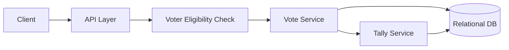

# Design a Basic Online Voting System

## Blogs and websites

## Medium

## Youtube

## Theory

### Problem Statement

Design a basic online voting system for a single election/ballot where verified users can cast exactly one vote for a candidate/option, and results are tallied after the voting window closes.

### Functional Requirements

- Register/verify eligible voters
- Cast a vote for a candidate within the voting window
- Prevent a voter from voting more than once
- Tally and publish results after the window closes

### Non-Functional Requirements

- **Scale**: Up to a few million eligible voters, bursty traffic near voting deadlines
- **Integrity**: Exactly one vote counted per eligible voter; votes must not be alterable after submission
- **Availability**: Voting must stay available under peak load near the deadline
- **Privacy**: Individual vote choice should not be linkable back to the voter in the public tally

### API Design

```
POST /elections/{electionId}/vote   { candidateId }   (auth required)
GET  /elections/{electionId}/status
GET  /elections/{electionId}/results  (available after close)
```

### Data Model

```
elections:  id (PK), title, opens_at, closes_at, status
candidates: id (PK), election_id (FK), name
voters:     id (PK), election_id (FK), user_id, has_voted (bool)
votes:      id (PK), election_id (FK), candidate_id (FK), cast_at   -- no user_id stored, for ballot secrecy
```

### High-Level Architecture



### Key Design Points

- Separate the "has this voter voted" record (`voters.has_voted`) from the anonymous `votes` table so a cast vote cannot be traced back to the voter, while still preventing double voting.
- Mark `voters.has_voted = true` and insert the vote row in a single DB transaction to avoid a race where a voter votes twice under concurrent requests.
- Only compute/expose results after `closes_at` to avoid leaking partial tallies that could influence turnout.

### Trade-offs

- Storing eligibility and vote choice separately trades a slightly more complex schema for the important guarantee of vote secrecy; a naive design that stores `(voter_id, candidate_id)` together is simpler but breaks ballot privacy.
