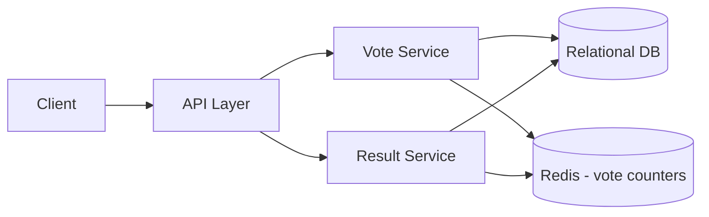

# Design a Simple Polling / Voting App

## Blogs and websites

## Medium

## Youtube

## Theory

### Problem Statement

Design a simple polling/voting application where a user can create a poll with multiple options, share it, and other users can cast one vote each. Results are shown as live counts/percentages.

### Functional Requirements

- Create a poll with a question and 2-10 options
- Vote on a poll (one vote per user per poll)
- View live/aggregated results
- Optional: poll expiry time, anonymous voting, single/multiple-choice polls

### Non-Functional Requirements

- **Scale**: Small-to-medium (thousands of polls, up to a few hundred thousand votes per popular poll)
- **Latency**: Vote submission < 200ms, result read < 100ms
- **Consistency**: Vote counts should be accurate (no double voting) and eventually consistent for display
- **Availability**: Reads (viewing results) should stay available even under heavy vote traffic

### API Design

```
POST /polls                  { question, options[], expiresAt }
GET  /polls/{pollId}
POST /polls/{pollId}/vote     { optionId }
GET  /polls/{pollId}/results
```

### Data Model

```
polls:     id (PK), question, created_by, expires_at, created_at
options:   id (PK), poll_id (FK), text, vote_count
votes:     id (PK), poll_id (FK), option_id (FK), user_id, created_at
           UNIQUE(poll_id, user_id)  -- enforces one vote per user per poll
```

### High-Level Architecture



### Key Design Points

- Enforce single-vote-per-user with a unique constraint on `(poll_id, user_id)`, or an atomic `SETNX`-style check in Redis for anonymous/high-traffic polls.
- Use an atomic counter (e.g., Redis `INCR` per option) for the vote count to avoid read-modify-write races, and periodically flush counters to the durable store.
- For very popular polls, cache aggregated results and refresh on a short TTL instead of recomputing on every read.

### Trade-offs

- Strong consistency (DB transaction per vote) is simpler but slower under high concurrency; an in-memory counter with async persistence trades a small durability window for much higher throughput.
- Anonymous voting is easier to implement but makes duplicate-vote prevention weaker (must rely on cookies/IP/device fingerprinting, which are all bypassable).
