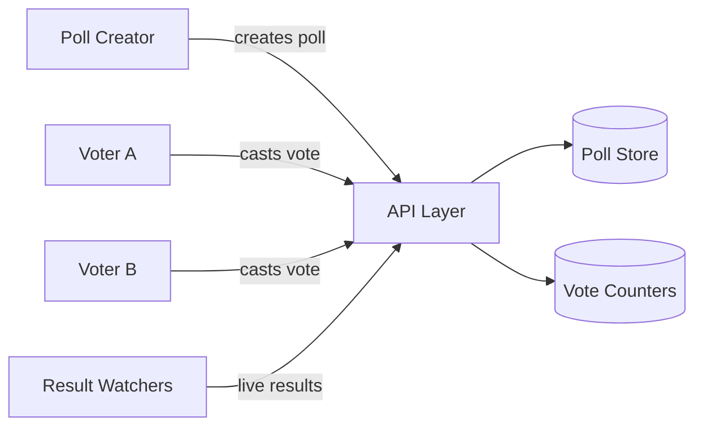
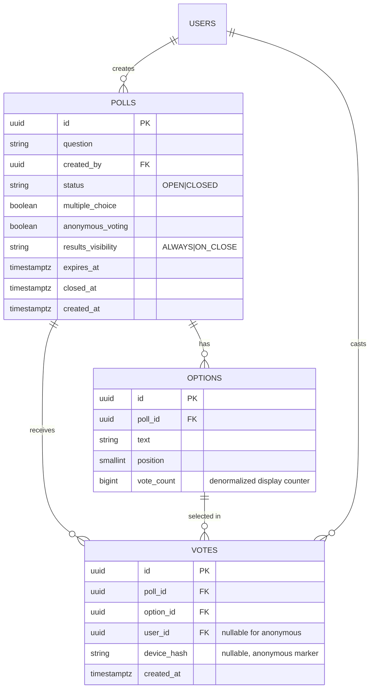
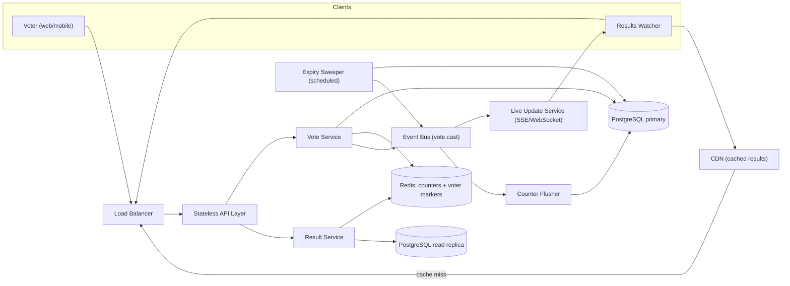
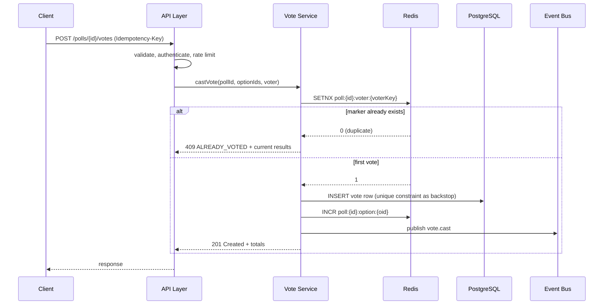

# Design a Simple Polling / Voting App

## Blogs and websites

## Medium

## Youtube

## Theory

### Topics Covered

1. [Introduction and Problem Statement](#introduction-and-problem-statement)
2. [Functional Requirements](#functional-requirements)
3. [Non-Functional Requirements](#non-functional-requirements)
4. [Capacity Estimation](#capacity-estimation)
5. [Characteristics](#characteristics)
6. [Components](#components)
7. [Patterns](#patterns)
8. [Benefits](#benefits)
9. [Pros](#pros)
10. [Cons](#cons)
11. [Challenges](#challenges)
12. [Best Practices](#best-practices)
13. [When to Use and When Not to Use](#when-to-use-and-when-not-to-use)
14. [Use Cases](#use-cases)
15. [API Design and Contract](#api-design-and-contract)
16. [Data Modeling](#data-modeling)
17. [High-Level Design](#high-level-design)
18. [Deep Dive](#deep-dive)
19. [Java and Spring Boot Implementation Guide](#java-and-spring-boot-implementation-guide)
20. [Interview Questions and Answers](#interview-questions-and-answers)

---

### Introduction and Problem Statement

Design a simple polling/voting application — think Strawpoll, Twitter/X polls, or the polls embedded in Slack and Instagram stories — where a user can create a poll with multiple options, share it via a link, and other users can cast one vote each. Results are shown as live counts and percentages.

**What problem does it solve?** Lightweight group decision-making and audience engagement. The product value is immediacy: create in seconds, vote in one tap, watch results move in real time.

**Why is it an interesting system design problem?** It looks like trivial CRUD but hides three classic distributed-systems problems:

1. **Exactly-once semantics per user** — one vote per user per poll, enforced under concurrency.
2. **Hot-key contention** — a viral poll funnels enormous write traffic onto a handful of counter rows/keys.
3. **Real-time fan-out** — thousands of clients watching the same poll expect live result updates.



The diagram shows the three traffic shapes the system must serve: rare writes (poll creation), heavy concurrent writes (votes), and very heavy reads (result viewing).

**Real-life use cases**

- **Social media polls**: Twitter/X polls, Instagram story polls — millions of votes on viral polls.
- **Team tools**: Slack/Discord polls for quick team decisions ("where for lunch?").
- **Live events**: audience voting during streams, conferences, TV shows.
- **Classroom tools**: Mentimeter/Kahoot-style live quizzes and polls.
- **Embeddable widgets**: news sites embedding a poll in an article.

---

### Functional Requirements

1. **Create a poll** with a question and 2–10 options; optional settings: expiry time, anonymous vs identified voting, single vs multiple choice, results visibility (always visible vs hidden until close).
2. **Share a poll** via a short link.
3. **Cast a vote** on an open poll — one vote per user per poll (or per option set for multiple-choice).
4. **View results** as live counts and percentages.
5. **Close/expire a poll** — voting stops at `expires_at` or when the creator closes it manually.
6. **Optional**: change vote (allowed or not is a product decision — default: not allowed), delete own poll, report abuse.

Out of scope for the basic design: formal elections (see the online voting system topic — that problem has secrecy, verifiability, and audit requirements that make it fundamentally different), ranked-choice voting, and paid promoted polls.

---

### Non-Functional Requirements

- **Scale**: small-to-medium baseline — thousands of polls, up to a few hundred thousand votes on a popular poll — but the design must survive a **viral spike**: one poll shared by a large account can jump to millions of votes in hours.
- **Latency**: vote submission < 200 ms p99; result read < 100 ms p99.
- **Consistency**: the one-vote-per-user rule must be **strongly consistent** (no double voting, ever); displayed counts may be **eventually consistent** (a few seconds of lag is invisible to users).
- **Availability**: reads (viewing results) must stay available even under heavy vote traffic — read availability matters more than write availability; a brief inability to *cast* votes is tolerable, a results page that errors is not.
- **Durability**: a confirmed vote must not be lost; a small window of counter lag before persistence is acceptable as long as the vote record itself is durable.

---

### Capacity Estimation

Back-of-envelope numbers for a moderately successful product with occasional viral polls:

**Users and polls**

- 2M monthly active users; 50K polls created/day; average 40 votes/poll.
- Votes/day baseline: 50K × 40 = **2M votes/day ≈ 23 votes/sec average**.
- Viral peak: one poll with 2M votes over 6 hours ≈ **~93 votes/sec on a single poll**, with reads at 100–1000× that rate on the same poll.

**Read traffic**

- Assume 50 result-views per vote on average (people check results repeatedly, shared links get lurkers): 2M × 50 = **100M result reads/day ≈ 1,200 reads/sec average**, 50K+ reads/sec on a viral poll at peak.

**Storage**

- Poll row: ~300 bytes (id, question, timestamps, settings). 50K/day → ~15 MB/day.
- Option rows: 5 per poll × ~100 bytes → ~25 MB/day.
- Vote rows: ~64 bytes (poll_id, option_id, user_id, created_at) × 2M/day → **~128 MB/day ≈ 47 GB/year**.
- Conclusion: storage is trivial; the design pressure is **throughput and hot keys**, not capacity.

**Bandwidth**

- Result payload ~500 bytes JSON; 100M reads/day × 500 B ≈ 50 GB/day ≈ 0.6 MB/s average — small, but a viral poll concentrates it: 50K reads/sec × 500 B = 25 MB/s on one resource, which is why result caching matters.

**Key takeaway for interviews**: state explicitly that this system is read-dominated with extreme per-entity skew — one poll can carry 1000× the average load. That observation drives the caching and counter design.

---

### Characteristics

- **Read-heavy with write bursts**
  What it means: result views outnumber votes by ~50:1, and votes arrive in bursts when a poll is shared. Why it matters: the architecture must optimize the read path (caching, CDN) while absorbing write bursts (atomic counters, queues). How it works in practice: reads are served from cache with short TTLs; writes go through atomic increments rather than row updates.

- **Strong consistency for eligibility, eventual consistency for display**
  What it means: the "has this user already voted?" check must be accurate at write time, but the displayed totals can lag by seconds. Why it matters: mixing these up in either direction is a design error — strong consistency on display counts would kill throughput; eventual consistency on eligibility allows double voting.

- **Hot-key skew**
  What it means: load concentrates on a tiny number of polls. Why it matters: naive per-row counter updates (`UPDATE options SET vote_count = vote_count + 1`) serialize on row locks and collapse under a viral poll. How it works: counters live in Redis (`INCR` is atomic and lock-free) or are sharded into sub-counters that are summed at read time.

- **Ephemeral data**
  What it means: most polls close within hours or days and are rarely read afterward. Why it matters: TTL-based cleanup and cheap cold storage keep the hot dataset small; you do not need the same durability/retention posture as, say, financial records.

- **Anonymous participation**
  What it means: many polls allow voting without an account. Why it matters: identity is the hard part — without accounts, duplicate-vote prevention degrades to cookies, IPs, and device fingerprints, all bypassable. This is a product trade-off, not just a technical one.

- **Real-time expectations**
  What it means: users watching a live poll expect the numbers to move. Why it matters: it pushes the design toward server push (WebSocket/SSE) or aggressive short-interval polling with caching.

---

### Components

- **API Layer (stateless service)**
  Purpose: terminate HTTP/WebSocket traffic, authenticate, validate, route. Responsibilities: request validation, auth token verification, rate limiting, calling the vote/result services. How it works: horizontally scaled behind a load balancer; no local state so any instance can serve any request. Real-world example: a Spring Boot service behind an ALB, or an API gateway like Kong/Envoy in front.

- **Vote Service**
  Purpose: accept and record votes. Responsibilities: enforce poll-open and one-vote-per-user rules, write the vote record, increment counters, publish vote events for live updates. How it works: a transaction (or Redis atomic check) guards eligibility; the counter increment is atomic; an event is emitted for fan-out. Relationship: writes to the poll store and counter store, publishes to the event bus.

- **Result Service**
  Purpose: serve aggregated results fast. Responsibilities: read counters, compute percentages, serve cached snapshots, push live updates to watchers. How it works: cache-aside reads against Redis counters with DB fallback; for live polls, subscribes to vote events and pushes deltas. Relationship: read-only against stores; the heaviest-traffic component.

- **Poll Store (relational DB)**
  Purpose: durable source of truth for polls, options, and vote records. Responsibilities: enforce the `UNIQUE(poll_id, user_id)` constraint, store poll lifecycle state. Real-world example: PostgreSQL with a read replica for result queries.

- **Counter Store (Redis)**
  Purpose: high-throughput atomic vote counters. Responsibilities: `INCR poll:{id}:option:{oid}` per vote; serve result reads; optionally track per-user vote markers (`SETNX poll:{id}:voter:{uid}`) for anonymous polls. Relationship: periodically reconciled/flushed to the relational store for durability.

- **Event Bus (optional at small scale, required at viral scale)**
  Purpose: decouple vote ingestion from live-result fan-out. Responsibilities: carry `vote.cast` events to the live-update service and to counter-flush workers. Real-world example: Kafka topic partitioned by `poll_id`, or Redis Pub/Sub for the simple version.

- **Live Update Service**
  Purpose: push result deltas to watching clients. Responsibilities: hold WebSocket/SSE connections, subscribe to vote events for the polls being watched, throttle/batch pushes (e.g. at most one update per poll per second). Real-world example: a Spring WebFlux/SSE endpoint or a dedicated gateway like Socket.IO clustered with a Redis adapter.

---

### Patterns

- **Cache-Aside (Lazy Loading)**
  What it is: read from cache; on miss, read the DB and populate the cache. Problem it solves: result reads would otherwise hammer the DB. How it works: `GET results:{pollId}` → miss → compute from counters/DB → `SET` with 1–5 s TTL. When to use: read-heavy workloads tolerant of brief staleness — exactly this one. When not: when reads must be strongly consistent. Advantages: simple, resilient (cache failure degrades to DB reads). Disadvantages: first-hit latency, brief staleness, stampede risk on hot keys (mitigate with request coalescing). Real-world example: how most social platforms serve like/view counts.

- **Write-Behind Counters (Buffered Writes)**
  What it is: increment in Redis, flush aggregates to the DB asynchronously. Problem it solves: per-vote DB writes cannot survive viral traffic. How it works: a flusher job periodically persists counter snapshots; the durable vote *records* still land in the DB (or an append log) so counts can be rebuilt. When to use: high-rate counters where small lag is acceptable. When not: when the counter itself must be transactional with other writes. Advantages: orders-of-magnitude write throughput. Disadvantages: a durability window, reconciliation complexity. Real-world example: view counters on YouTube-style platforms.

- **Event-Driven Fan-Out**
  What it is: vote events published to a bus; live-update and analytics consumers subscribe. Problem it solves: the vote path stays fast while many downstream reactions (push updates, abuse detection, metrics) happen asynchronously. When to use: when more than one consumer reacts to a vote, or when live push is required. When not: a tiny deployment where a direct call is simpler — do not add Kafka for 10 votes/sec. Advantages: decoupling, independent scaling, replayability. Disadvantages: operational complexity, at-least-once delivery requires idempotent consumers.

- **Idempotent Consumer / Exactly-Once Effect**
  What it is: consumers of vote events dedupe by event id. Problem it solves: at-least-once delivery would double-count. How it works: store processed event ids (or use the natural `UNIQUE(poll_id, user_id)` key) and skip duplicates. When to use: always, when consuming from a bus.

- **Circuit Breaker (on the live-update path)**
  What it is: if the push service or Redis fails, fall back to plain JSON polling responses instead of cascading failure. Problem it solves: a viral poll melting the WebSocket tier should not take down vote ingestion. Advantages: graceful degradation. Disadvantages: clients see less-live updates during degradation.

---

### Benefits

- **Instant engagement feedback**
  Live counts create the "watch it move" effect that drives sharing. In production this is why polls outperform static surveys on engagement — the system design (push updates + fast counters) is what makes the product loop possible.

- **Cheap to operate at baseline, resilient at peak**
  The average load is tiny (tens of writes/sec), so baseline cost is small. Because counters and caches absorb viral spikes, you do not need to provision for peak permanently — the same architecture idles cheaply and survives a 1000× spike.

- **Trustworthy results**
  The `UNIQUE(poll_id, user_id)` constraint plus idempotent writes means results are defensible: no duplicates, no lost confirmed votes. For a product whose entire value is "the numbers are real", this integrity is the feature.

- **Separation of concerns enables independent scaling**
  Vote ingestion (write-optimized) and result serving (read-optimized) scale independently. During a viral event you scale the result tier aggressively and the vote tier moderately — you never scale the whole monolith for one hot poll.

- **Embeddability**
  A small, cacheable results payload is trivially embeddable in third-party pages via a script tag or oEmbed, which is how polling products grow (every embedded poll is an ad for the platform).

---

### Pros

- **Simple core domain model.** Three entities (poll, option, vote) with one integrity rule. A small model means fewer consistency bugs and an API that is easy to reason about and version. The complexity lives in scale handling, not in the domain.
- **Atomic counters give O(1) vote ingestion.** Redis `INCR` is atomic, lock-free, and handles tens of thousands of ops/sec per key — exactly the shape viral polls need. No row-lock queues, no serialized transactions on the hot path.
- **Short-TTL caching makes reads nearly free.** A 1–5 second TTL on result snapshots bounds staleness to a window users cannot perceive while cutting DB reads by orders of magnitude. Combined with CDN edge caching for public polls, the origin sees a fraction of real read traffic.
- **Anonymous voting lowers friction.** Letting users vote without accounts dramatically increases participation, which is the product goal for casual polls. The design accommodates it with cookie/IP/fingerprint markers while being honest about the weaker integrity guarantee.
- **Graceful degradation paths exist at every level.** Push tier down → clients fall back to polling. Redis down → counters served from DB (slower, still correct). Cache down → DB serves reads. Each failure mode has a defined, tested fallback.

### Cons

- **Anonymous duplicate-vote prevention is fundamentally weak.** Cookies can be cleared, IPs are shared (NAT, corporate networks) and rotated (mobile carriers), fingerprints can be spoofed. You must accept either friction (require accounts) or some level of ballot stuffing — a product decision the system cannot make for you.
- **Counter/DB divergence is an operational reality.** With buffered counters, Redis and PostgreSQL will disagree transiently; if Redis loses data (failover without AOF), displayed counts can jump *backward* after reconciliation unless the durable vote log is used to rebuild. Users notice numbers going down.
- **Live push is expensive per connection.** Holding 100K WebSocket connections for a viral poll requires a dedicated tier with careful memory and kernel tuning. Many teams discover SSE/long-polling is 90% of the value at 30% of the operational cost.
- **Result staleness creates support noise.** Two users refreshing simultaneously can see different counts (different cache entries/TTL phases). Harmless technically, but it generates "your app is broken" reports.
- **Abuse is an ongoing arms race.** Vote brigading (a community coordinating to swing a poll), bot votes, and scripted option spam require rate limiting, anomaly detection, and sometimes manual intervention — none of which is ever "done".

---

### Challenges

- **Technical: exactly-once vote under retries.** Mobile clients retry on timeouts; load balancers retry on 5xx. Without a unique constraint (authenticated) or atomic `SETNX` marker (anonymous), retries double-count. The fix must be at the storage layer, not the application layer, because application-level check-then-insert races.
- **Scalability: the viral poll.** One poll can receive more traffic than the rest of the platform combined. Every per-poll resource — counter key, cache key, WebSocket channel, DB row — becomes a hotspot. Sharded sub-counters, cache coalescing, and per-poll backpressure are the standard answers.
- **Performance: result computation under load.** `SELECT COUNT(*) GROUP BY option_id` over a million-row votes table per read is not viable. Pre-aggregated counters (Redis) or materialized summaries are mandatory; the question for interviews is *how you keep them correct*, not whether to have them.
- **Reliability: counter durability.** Redis is the counter store but is not a database. AOF persistence, replica promotion testing, and a rebuild path from the durable votes table are required so a cache failure is an inconvenience, not data loss.
- **Maintainability: two sources of truth.** Votes table (durable) and counters (fast) must be reconciled. Document which is authoritative for what (votes table for integrity/audits, counters for display), and build the reconciliation job from day one, not after the first incident.
- **Operational: closing polls on time.** A poll with `expires_at` must stop accepting votes promptly. Depending on a client clock is wrong; depending only on a cron sweep adds lag; the common answer is a server-side check on every vote plus a scheduled job that flips state and notifies watchers.
- **Security: manipulation and spam.** Beyond duplicate voting: scripted mass voting, poll-option injection (XSS in option text — sanitize aggressively, results pages render arbitrary user text), and vote-selling bots. Rate limit per IP/user, monitor vote-rate anomalies per poll, and treat all user text as hostile.

---

### Best Practices

- **Enforce one-vote-per-user in the database, not in code.** A `UNIQUE(poll_id, user_id)` constraint cannot race; an application-level "check then insert" can. Code checks are still useful for friendly error messages, but the constraint is the guarantee. This is the single most important decision in the design.
- **Make vote submission idempotent.** Return the same success response for a duplicate submission instead of an error storm — the client retried because it never saw the first success. Idempotency plus the unique constraint gives exactly-once effect with at-least-once delivery.
- **Separate the eligibility write from the display count.** The vote row is the durable fact; the counter is a derived, rebuildable projection. If you conflate them (counter *is* the count, no vote rows), you lose auditability and the ability to rebuild after cache loss.
- **Cache results with short TTLs and stampede protection.** 1–5 s TTL for live polls; use request coalescing (single-flight) so 50K concurrent misses trigger one recomputation, not 50K. Why: viral polls are exactly where naive caching falls over.
- **Batch and throttle live pushes.** Push at most one update per poll per second with the latest totals. Clients cannot perceive faster updates; the push tier cannot survive unthrottled per-vote fan-out.
- **Version your API and design for poll immutability after first vote.** Editing options after votes exist invalidates results. Either forbid edits once the first vote lands (recommended) or version the poll and restart counts. Interviewers ask this specifically.
- **Sanitize and length-limit all user text server-side.** Question and option text render on every results page; stored XSS here has enormous blast radius.
- **Emit metrics per poll, not just globally.** Global vote rate looks fine while one poll is being botted. Per-poll rate and source-distribution metrics catch abuse in minutes instead of days.

---

### When to Use and When Not to Use

**This design is appropriate when:**

- Polls are casual and engagement-oriented: social features, team tools, live events, embedded widgets.
- Displayed results may lag a few seconds behind reality.
- Participation friction must be minimal (optional anonymity).
- Traffic is spiky and unpredictable, with reads dominating writes.

**This design is not appropriate when:**

- **Formal elections or legally meaningful votes** — you need voter eligibility verification, ballot secrecy, auditability, and verifiability; see the online voting system topic, which treats those as first-class requirements.
- **Ranked-choice or weighted voting** — the counter model (one increment per option) does not express rankings; you need ballot storage and a tabulation pass.
- **Votes must be revocable/editable at scale** — the idempotent, constraint-guarded model assumes votes are final; changeable votes need a different write path (upsert + decrement/increment pairs).
- **Regulated survey data (e.g. medical research)** — anonymity-by-design conflicts with consent tracking and data-subject rights.

**Alternatives to consider:** a managed live-polling vendor (Slido/Mentimeter) if this is not your core product; a pure client-side poll for zero-stakes cases; an existing platform feature (Slack/Discord native polls) when your audience already lives there.

**Decision factors:** integrity requirements, expected traffic skew, anonymity requirements, latency budget for "liveness", and whether polls are core to the product or a checkbox feature.

---

### Use Cases

#### Use Case 1: Social media poll embedded in a post

- **Problem**: a creator with 5M followers posts a poll; results must update live for everyone watching; abuse pressure is high.
- **Proposed solution**: anonymous-but-fingerprinted voting with per-IP rate limits, Redis counters with sub-counter sharding for the hot poll, CDN-cached result snapshots (2 s TTL), SSE for live updates with client-polling fallback.
- **Why suitable**: the read-heavy, hot-key, tolerate-brief-staleness profile matches exactly what this architecture is built for.
- **How it works**: votes hit the API, `SETNX poll:{id}:fp:{fingerprint}` guards duplicates, `INCR` the option counter and publish a vote event; the live-update service batches pushes; everyone else reads the cached snapshot.
- **Trade-offs**: some determined ballot-stuffing gets through (accepted — engagement product, not an election); displayed counts may lag real votes by 1–2 seconds (invisible to users).

#### Use Case 2: Live audience voting at a conference (10K people, one room)

- **Problem**: extreme simultaneity — the speaker says "vote now" and 10K votes arrive within seconds, all from the same venue network (one NAT'd IP range).
- **Proposed solution**: per-device tokens issued when attendees join the event Wi-Fi/scan a QR (solves the shared-IP problem), vote ingestion via queue with consumer-side dedupe, results projected on stage from Redis counters with 500 ms push cadence.
- **Why suitable**: the system's burst absorption and push fan-out are designed for exactly this shape; the identity solution is event-scoped rather than account-scoped.
- **How it works**: QR scan issues a signed single-use-per-poll token; the vote API validates the token claim `poll:{id}:voted` atomically; counters drive the stage display directly from Redis, no DB reads on the display path.
- **Trade-offs**: token issuance adds a join step (friction); venue Wi-Fi itself is a single point of failure outside the system's control.

#### Use Case 3: Quick team decisions inside a chat tool

- **Problem**: thousands of small private polls, a handful of votes each, inside authenticated workspaces.
- **Proposed solution**: the simplest slice of this architecture — authenticated votes with the DB unique constraint, DB-only counters (no Redis needed at this rate), results rendered in the message with no push tier; refresh on message fetch.
- **Why suitable**: per-poll traffic is tiny, identity is solved by workspace auth, and simplicity beats scale machinery. This demonstrates the key skill: **descoping** — knowing which parts of the full design are unnecessary at this scale.
- **How it works**: vote write is one transaction (insert vote, update option count) — at 5 votes/poll there is no contention to optimize away.
- **Trade-offs**: none significant; the "full" architecture would be pure over-engineering here.

---

### API Design and Contract

Base path `/api/v1`. Authenticated endpoints use `Authorization: Bearer <token>`; anonymous voting endpoints accept a signed device token or fingerprint header instead. All error responses share one envelope: `{ "code": "STRING_CODE", "message": "human readable", "details": [] }`.

**Create a poll**

```
POST /api/v1/polls
Authorization: Bearer ...
Idempotency-Key: 9f1c2a...        (client-generated UUID per user intent)
Content-Type: application/json

{
  "question": "Which framework for the new service?",
  "options": ["Spring Boot", "Quarkus", "Micronaut"],
  "settings": {
    "multipleChoice": false,
    "anonymousVoting": true,
    "expiresAt": "2026-08-22T18:00:00Z",
    "resultsVisibility": "ALWAYS"
  }
}
```

`201 Created`:

```json
{
  "pollId": "p_01J8X...",
  "shareUrl": "https://polls.example.com/p/p_01J8X...",
  "expiresAt": "2026-08-22T18:00:00Z",
  "status": "OPEN"
}
```

Validation: 2–10 options, question ≤ 280 chars, option ≤ 80 chars, `expiresAt` in the future and ≤ 30 days out. Errors: `400 VALIDATION_FAILED` (with per-field details), `401 UNAUTHENTICATED`, `429 RATE_LIMITED` (poll creation is rate-limited per user, e.g. 20/hour, because poll spam is the main abuse vector).

**Get poll (for voting page)**

```
GET /api/v1/polls/{pollId}
```

`200 OK` returns question, options (without counts if `resultsVisibility` is `ON_CLOSE`), status, expiry, and whether the current user/device has already voted. `404 POLL_NOT_FOUND`, `410 POLL_CLOSED` when expired and the creator disabled post-close viewing.

**Cast a vote**

```
POST /api/v1/polls/{pollId}/votes
Idempotency-Key: 7b3e91...
X-Device-Token: ...               (anonymous polls)

{ "optionIds": ["opt_2"] }
```

`201 Created` returns the recorded vote and current totals. `409 ALREADY_VOTED` when the unique constraint fires — the response still includes current results so a retried client lands in the same final state (idempotent effect). `410 POLL_CLOSED` after expiry. `422 INVALID_OPTION` for option ids not in the poll.

**Get results**

```
GET /api/v1/polls/{pollId}/results
```

`200 OK`:

```json
{
  "pollId": "p_01J8X...",
  "status": "OPEN",
  "totalVotes": 128402,
  "options": [
    { "optionId": "opt_1", "text": "Spring Boot", "votes": 70211, "percentage": 54.7 },
    { "optionId": "opt_2", "text": "Quarkus", "votes": 33190, "percentage": 25.8 },
    { "optionId": "opt_3", "text": "Micronaut", "votes": 25001, "percentage": 19.5 }
  ],
  "asOf": "2026-08-20T14:31:07Z"
}
```

Response headers: `Cache-Control: public, max-age=2` on open polls (enables CDN edge caching), `ETag` for conditional requests, and `X-Result-Lag-Ms` optionally exposing freshness for live UIs.

**Live updates**

```
GET /api/v1/polls/{pollId}/results/stream     (SSE: text/event-stream)
```

Server sends a `results` event at most once per second per poll while the poll is open, a final `closed` event at expiry, then closes the stream. Clients fall back to plain `GET /results` polling if SSE fails.

**Contract-wide decisions**

- **Idempotency**: `Idempotency-Key` on all POSTs; the vote endpoint additionally has the storage-level unique constraint as the real guarantee.
- **Pagination**: poll listing endpoints (`GET /api/v1/users/me/polls`) use cursor pagination (`?cursor=...&limit=20`) — offset pagination skips rows under concurrent inserts.
- **Filtering/sorting**: `?status=OPEN|CLOSED&sort=createdAt|votes&order=desc`.
- **Versioning**: path version `/v1`; breaking changes (e.g. multiple-choice vote payload) ship as `/v2` with overlap.
- **Rate limiting**: per-user on creation, per-IP+device on voting, generous on reads; `429` responses include `Retry-After` and `X-RateLimit-*` headers.

---

### Data Modeling

```
polls:     id (PK), question, created_by (FK), status, multiple_choice,
           anonymous_voting, results_visibility, expires_at, closed_at, created_at
options:   id (PK), poll_id (FK), text, position, vote_count
votes:     id (PK), poll_id (FK), option_id (FK), user_id (nullable),
           device_hash (nullable), created_at
           UNIQUE(poll_id, user_id)        -- authenticated polls
           UNIQUE(poll_id, device_hash)    -- anonymous polls
```



**Design decisions**

- **The unique constraints are the integrity model.** `UNIQUE(poll_id, user_id)` for authenticated polls and `UNIQUE(poll_id, device_hash)` for anonymous ones make double voting impossible at the storage layer regardless of application bugs or races. Exactly one of the two columns is non-null per row (enforced with a `CHECK` constraint).
- **`options.vote_count` is a denormalized display counter**, kept in sync from the Redis counters by the flusher job. The `votes` table is the source of truth; `vote_count` is a rebuildable projection (`UPDATE options o SET vote_count = (SELECT COUNT(*) FROM votes v WHERE v.option_id = o.id)`).
- **Indexes**: `votes(poll_id, user_id)` unique (doubles as the "has voted" lookup), `votes(option_id)` for rebuilds, `polls(created_by, created_at DESC)` for "my polls", partial index `polls(status) WHERE status = 'OPEN'` for the expiry sweeper.
- **Lifecycle**: closed polls and their votes are archived to cheap storage after 90 days of inactivity; Redis keys carry TTLs aligned with `expires_at` plus a grace period.
- **Partitioning**: at scale, `votes` partitions by `created_at` range (monthly) — votes are append-only and time-ordered, so range partitions give cheap archival (drop/detach old partitions) and keep hot indexes small. Sharding by `poll_id` hash is the next step if a single primary becomes the bottleneck.

---

### High-Level Design



**Component responsibilities and communication**

- **API Layer**: validation, auth, rate limiting; routes to vote/result services. Stateless — scales horizontally behind the LB.
- **Vote Service**: the only writer. Checks poll status, enforces one-vote rules, writes the vote row, increments Redis counters, publishes `vote.cast`.
- **Result Service**: the read path. Cache-aside over Redis counters; falls back to the read replica; never touches the write primary.
- **Live Update Service**: subscribes to `vote.cast`, maintains per-poll subscriber sets, pushes throttled deltas over SSE/WebSocket.
- **Counter Flusher**: periodically persists Redis counter snapshots into `options.vote_count` so the DB converges with the displayed numbers.
- **Expiry Sweeper**: scheduled job that closes polls whose `expires_at` has passed, publishes `poll.closed`, and schedules Redis key TTLs.

**Request flow — casting a vote**



The Redis `SETNX` is the fast eligibility check; the database unique constraint is the authoritative backstop (Redis can lose a marker in a failover — the constraint cannot). Both layers failing open simultaneously is the only double-vote path, which is why the durable constraint is non-negotiable.

**Scaling strategy**

- API/result tiers: horizontal, autoscaled on CPU and request rate.
- Redis: a single primary handles baseline; viral polls get **sub-counter sharding** (`poll:{id}:option:{oid}:shard{n}`, summed at read) if a single key's ops/sec becomes the limit.
- PostgreSQL: one primary (writes are small rows at moderate rate), read replicas for result fallback queries, monthly partitions on `votes`.
- Live tier: connection count is the scaling axis — scale on open connections, not CPU; shard subscribers by `poll_id` across instances via the bus.

**Failure handling**

- Redis down → vote service falls back to DB-only path (unique constraint + `UPDATE options SET vote_count = vote_count + 1`), accepting lower throughput; result service serves from replica with a "counts may be delayed" flag.
- Bus down → votes still record (bus publish is post-commit and retried via outbox); live updates degrade to client polling.
- Live tier down → clients fall back to `GET /results` on interval; CDN absorbs the extra reads.
- Sweeper down → votes after expiry are still rejected by the server-side `expires_at` check on every write; the sweep only affects state transitions and notifications, so lag is cosmetic.

---

### Deep Dive

#### Real-Time Result Delivery: WebSocket vs SSE vs Client Polling

| Approach | Latency | Server cost per watcher | Firewall/proxy friendliness | Bidirectional | Verdict here |
|---|---|---|---|---|---|
| Short polling (2–5 s) | 2–5 s | Lowest (stateless, CDN-cacheable) | Excellent | No | Baseline fallback; fine for most clients |
| SSE | ~instant | Medium (one open connection) | Good (plain HTTP) | No (server→client only) | **Best fit** — results are server→client only |
| WebSocket | ~instant | Highest (stateful, harder to scale) | Can be blocked | Yes | Only if you later need client→server realtime (e.g. live reactions) |

The deciding insight: result watching is strictly one-directional, so WebSocket's bidirectionality buys nothing while costing connection-state complexity. SSE over HTTP/2 with a throttled 1-update/sec cadence per poll is the sweet spot; short polling against a CDN-cached endpoint is the zero-infrastructure fallback.

#### Vote Counting: Redis INCR vs Database Counters

- **DB row counter** (`UPDATE options SET vote_count = vote_count + 1`): correct and simple, but every vote takes a row lock on the option row. A viral poll serializes thousands of votes/sec on a handful of rows — lock queue collapse. Fine for small polls; fatal for viral ones.
- **Redis `INCR`**: atomic, lock-free, ~100K ops/sec per key. The vote row still goes to PostgreSQL for durability; the counter is a fast projection. This split — durable record + fast counter — is the core pattern.
- **Hot-key sharding**: if one option key exceeds single-key throughput, shard it: `INCR poll:{id}:opt:{oid}:{voterHash % 16}` and `SUM` the 16 shards at read. Reads do 16 `GET`s (or one `MGET`) — still microseconds.
- **Reconciliation**: the flusher writes counter snapshots to `options.vote_count` every few seconds; a nightly job recomputes counts from `votes` and alerts on drift beyond a threshold. Drift sources: Redis failover without AOF, flusher lag, double-increment bugs — all detectable because the votes table is authoritative.

#### Duplicate-Vote Prevention: Identity Spectrum

Strongest to weakest: authenticated account (unique constraint — solid) → verified email/phone per poll → signed device token issued per session → cookie + IP + fingerprint heuristic (bypassable). The design rule: **pick the identity strength the poll's stakes justify**, and store *which* mechanism guarded each vote so results can be re-filtered later (e.g. exclude fingerprint-only votes from a "verified results" view).

#### Poll Expiry and Closing

Three mechanisms cooperate: (1) every vote write checks `expires_at > now()` server-side — the correctness guarantee; (2) the sweeper job flips `status` to `CLOSED` and publishes `poll.closed` — the UX guarantee (watchers get a final push); (3) Redis keys get TTLs at close — the cost guarantee. Never rely on client clocks or on the sweeper alone.

---

### Java and Spring Boot Implementation Guide

Production shape: thin controllers, business logic in `@Service` beans, counters in Redis via Spring Data Redis, configuration externalized with `@Value`.

#### JPA Entities

```java
@Entity
@Table(name = "polls")
public class Poll {

    @Id
    private UUID id;

    @Column(nullable = false, length = 280)
    private String question;

    @Column(name = "created_by", nullable = false)
    private UUID createdBy;

    @Enumerated(EnumType.STRING)
    @Column(nullable = false)
    private PollStatus status;            // OPEN, CLOSED

    @Column(name = "multiple_choice", nullable = false)
    private boolean multipleChoice;

    @Column(name = "anonymous_voting", nullable = false)
    private boolean anonymousVoting;

    @Column(name = "expires_at")
    private Instant expiresAt;

    @OneToMany(mappedBy = "poll", cascade = CascadeType.ALL, orphanRemoval = true)
    @OrderBy("position")
    private List<PollOption> options = new ArrayList<>();

    protected Poll() {}                   // JPA
    // getters/factory omitted
}
```

```java
@Entity
@Table(name = "votes", uniqueConstraints = {
        @UniqueConstraint(name = "uq_vote_user", columnNames = {"poll_id", "user_id"}),
        @UniqueConstraint(name = "uq_vote_device", columnNames = {"poll_id", "device_hash"})
})
public class Vote {

    @Id
    private UUID id;

    @Column(name = "poll_id", nullable = false)
    private UUID pollId;

    @Column(name = "option_id", nullable = false)
    private UUID optionId;

    @Column(name = "user_id")             // null for anonymous votes
    private UUID userId;

    @Column(name = "device_hash")         // null for authenticated votes
    private String deviceHash;

    @Column(name = "created_at", nullable = false)
    private Instant createdAt;

    protected Vote() {}
    // getters/factory omitted
}
```

The two unique constraints in the annotation mirror the DDL exactly — the database is the integrity layer, JPA just documents it.

#### Vote Service (the core write path)

```java
@Service
public class VoteService {

    private final VoteRepository votes;
    private final PollRepository polls;
    private final StringRedisTemplate redis;
    private final VoteEventPublisher events;
    private final Duration markerTtl;

    public VoteService(VoteRepository votes,
                       PollRepository polls,
                       StringRedisTemplate redis,
                       VoteEventPublisher events,
                       @Value("${app.polls.voter-marker-ttl:PT48H}") Duration markerTtl) {
        this.votes = votes;
        this.polls = polls;
        this.redis = redis;
        this.events = events;
        this.markerTtl = markerTtl;
    }

    @Transactional
    public VoteResult castVote(UUID pollId, UUID optionId, VoterIdentity voter) {
        Poll poll = polls.findById(pollId)
                .orElseThrow(() -> new PollNotFoundException(pollId));
        if (poll.getStatus() != PollStatus.OPEN
                || (poll.getExpiresAt() != null && poll.getExpiresAt().isBefore(Instant.now()))) {
            throw new PollClosedException(pollId);
        }

        // Fast eligibility check in Redis; DB unique constraint is the backstop.
        String markerKey = "poll:" + pollId + ":voter:" + voter.key();
        Boolean first = redis.opsForValue()
                .setIfAbsent(markerKey, "1", markerTtl);
        if (Boolean.FALSE.equals(first)) {
            throw new AlreadyVotedException(pollId);
        }

        try {
            votes.save(Vote.create(pollId, optionId, voter));
        } catch (DataIntegrityViolationException duplicate) {
            throw new AlreadyVotedException(pollId);   // constraint fired: same outcome
        }

        redis.opsForValue().increment("poll:" + pollId + ":option:" + optionId);
        events.publishVoteCast(pollId, optionId);      // outbox-backed, at-least-once
        return VoteResult.recorded(pollId, optionId);
    }
}
```

Why this shape: the `SETNX` gives a fast, friendly duplicate rejection; the unique constraint guarantees correctness even if Redis lost the marker; the counter increment is atomic; the event publish is outbox-backed so a bus outage cannot lose the fan-out (a relay republishes un-sent rows).

#### Result Service (cache-aside read path)

```java
@Service
public class ResultService {

    private final StringRedisTemplate redis;
    private final PollRepository polls;
    private final Cache resultsCache;          // Caffeine, short TTL
    private final Duration redisTtl;

    public ResultService(StringRedisTemplate redis,
                         PollRepository polls,
                         CacheManager cacheManager,
                         @Value("${app.polls.results-cache-ttl:PT2S}") Duration redisTtl) {
        this.redis = redis;
        this.polls = polls;
        this.resultsCache = cacheManager.getCache("poll-results");
        this.redisTtl = redisTtl;
    }

    public PollResults getResults(UUID pollId) {
        PollResults cached = resultsCache.get(pollId, PollResults.class);
        if (cached != null) {
            return cached;
        }
        // Single-flight: concurrent misses for the same poll compute once.
        synchronized (("results-" + pollId).intern()) {
            PollResults again = resultsCache.get(pollId, PollResults.class);
            if (again != null) {
                return again;
            }
            PollResults computed = computeFromCounters(pollId);
            resultsCache.put(pollId, computed);
            return computed;
        }
    }

    private PollResults computeFromCounters(UUID pollId) {
        Poll poll = polls.findById(pollId).orElseThrow(() -> new PollNotFoundException(pollId));
        List<String> keys = poll.getOptions().stream()
                .map(o -> "poll:" + pollId + ":option:" + o.getId())
                .toList();
        List<String> values = redis.opsForValue().multiGet(keys);
        // fall back to options.vote_count for any missing counter key
        return PollResults.assemble(poll, values, redisTtl);
    }
}
```

The local Caffeine layer (1–2 s TTL) absorbs the extreme read skew on viral polls; Redis counters are the shared truth across instances; the DB counter column is the fallback. Three layers, each one slower and more durable than the last.

#### SSE Endpoint for Live Results

```java
@RestController
@RequestMapping("/api/v1/polls")
public class ResultsStreamController {

    private final ResultService resultService;
    private final Duration pushInterval;

    public ResultsStreamController(ResultService resultService,
                                   @Value("${app.polls.push-interval:PT1S}") Duration pushInterval) {
        this.resultService = resultService;
        this.pushInterval = pushInterval;
    }

    @GetMapping(path = "/{pollId}/results/stream", produces = MediaType.TEXT_EVENT_STREAM_VALUE)
    public SseEmitter stream(@PathVariable UUID pollId) {
        SseEmitter emitter = new SseEmitter(Duration.ofMinutes(30).toMillis());
        ScheduledExecutorService scheduler = Executors.newSingleThreadScheduledExecutor();
        scheduler.scheduleAtFixedRate(() -> {
            try {
                PollResults results = resultService.getResults(pollId);
                emitter.send(SseEmitter.event().name("results").data(results));
                if (results.status() == PollStatus.CLOSED) {
                    emitter.send(SseEmitter.event().name("closed").data(results));
                    emitter.complete();
                    scheduler.shutdown();
                }
            } catch (Exception e) {
                emitter.completeWithError(e);
                scheduler.shutdown();
            }
        }, 0, pushInterval.toMillis(), TimeUnit.MILLISECONDS);
        emitter.onCompletion(scheduler::shutdown);
        emitter.onTimeout(scheduler::shutdown);
        return emitter;
    }
}
```

Note the throttling: one push per `pushInterval` regardless of vote rate — this is what keeps a viral poll from melting the push tier. (In a multi-instance deployment the scheduler is replaced by a bus subscription; the throttling principle is identical.)

#### Controller, Validation, and Error Handling

```java
public record CreatePollRequest(
        @NotBlank @Size(max = 280) String question,
        @NotNull @Size(min = 2, max = 10) List<@NotBlank @Size(max = 80) String> options,
        boolean multipleChoice,
        boolean anonymousVoting,
        @Future Instant expiresAt) {}

public record CastVoteRequest(@NotEmpty List<UUID> optionIds) {}
```

```java
@RestControllerAdvice
public class ApiExceptionHandler {

    @ExceptionHandler(AlreadyVotedException.class)
    public ResponseEntity<ApiError> alreadyVoted(AlreadyVotedException ex) {
        return ResponseEntity.status(HttpStatus.CONFLICT)
                .body(new ApiError("ALREADY_VOTED", "This voter has already voted on this poll", List.of()));
    }

    @ExceptionHandler(PollClosedException.class)
    public ResponseEntity<ApiError> closed(PollClosedException ex) {
        return ResponseEntity.status(HttpStatus.GONE)
                .body(new ApiError("POLL_CLOSED", "This poll is no longer accepting votes", List.of()));
    }

    @ExceptionHandler(MethodArgumentNotValidException.class)
    public ResponseEntity<ApiError> validation(MethodArgumentNotValidException ex) {
        List<String> details = ex.getBindingResult().getFieldErrors().stream()
                .map(fe -> fe.getField() + ": " + fe.getDefaultMessage()).toList();
        return ResponseEntity.badRequest()
                .body(new ApiError("VALIDATION_FAILED", "Request validation failed", details));
    }
}
```

`409` for duplicate votes (a conflict with current state) and `410 Gone` for closed polls (the resource existed but is no longer usable) are deliberate, client-actionable status codes — not generic 400s.

---

### Interview Questions and Answers

**Beginner**

- **Q: How do you prevent a user from voting twice?**
  **A:** A database unique constraint on `(poll_id, user_id)` — the insert of a second vote fails. Application-level checks are added for friendly errors, but the constraint is the guarantee because check-then-insert races under concurrency. Follow-up: *what about anonymous polls?* — a device/cookie fingerprint with a `UNIQUE(poll_id, device_hash)` constraint, acknowledging it is weaker and bypassable.

- **Q: Why not just `UPDATE options SET vote_count = vote_count + 1` per vote?**
  **A:** Every vote takes a row lock on the same option row; a viral poll serializes thousands of writes/sec into a lock queue and the database falls over. Atomic Redis `INCR` counters absorb that rate lock-free, with the DB counter updated asynchronously.

- **Q: What does the votes table give you that counters alone don't?**
  **A:** Durability, auditability, and rebuildability. Counters are a projection; if Redis loses data you recompute from vote rows. Without vote rows you also cannot answer "who voted", detect brigading after the fact, or support verified-vs-anonymous result views.

**Intermediate**

- **Q: How do you show live results to 100K watchers?**
  **A:** SSE (one-directional, so WebSocket's bidirectionality is unnecessary cost), one push per poll per second regardless of vote rate, subscribers sharded by poll across push instances, and a CDN-cached polling endpoint as fallback. Expected discussion: why not per-vote pushes (fan-out = votes × watchers, melts instantly), and why SSE over WebSocket here.

- **Q: A user votes, gets a timeout, retries. What happens?**
  **A:** The retry hits the `SETNX` marker or the unique constraint and gets `409 ALREADY_VOTED` with current results — the same end state as the original success. The vote is recorded exactly once. This is idempotency by storage design rather than by request dedup alone.

- **Q: How do you handle poll expiry?**
  **A:** Three layers: server-side `expires_at` check on every vote (correctness), a scheduled sweeper that flips status and notifies watchers (UX), Redis TTLs on poll keys (cost). Common mistake: relying on the sweeper alone — votes slip in between expiry and the next sweep — or trusting client clocks.

**Advanced**

- **Q: One poll goes viral — 100K votes/sec on one poll. Walk me through what breaks and what you do.**
  **A:** First the option-row counters (if DB-backed) — move to Redis. Then the single Redis key — shard into N sub-counters summed at read. Then result recomputation — cache-aside with single-flight coalescing and 1–2 s TTL. Then the push tier — throttle to 1 update/sec/poll and scale on connection count. Then the votes table insert rate — batch inserts or an append log with async persistence, keeping the unique constraint via a Redis marker set with a Bloom filter front. Each layer has a defined next step; the answer is the *sequence*.

- **Q: Redis fails over and loses 30 seconds of counter increments. What do users see and how do you fix it?**
  **A:** Displayed counts drop backward after reconciliation — visible and trust-destroying. Mitigations: AOF persistence to shrink the loss window, the flusher writing snapshots frequently so the DB is never far behind, and a rebuild path that recomputes from the votes table (authoritative) and only ever moves counts forward. Trade-off discussion: stronger Redis durability (AOF everysec vs always) costs write latency.

- **Q: How would you detect vote manipulation on a poll?**
  **A:** Per-poll rate anomaly detection (sudden 100× baseline), source distribution analysis (one ASN/country dominating), device-fingerprint clustering, and vote-timing entropy (bots vote at machine intervals). Responses range from per-source rate limits to flagging results as "unverified". The key interview point: detection is per-poll, because global metrics hide a single botted poll.

**Senior / System Design**

- **Q: Design the same system for a national TV vote — 50M votes in 15 minutes. What changes?**
  **A:** ~55K votes/sec sustained. The domain model survives; the plumbing changes: vote ingestion through a queue with consumer-side dedupe (the unique constraint moves to a Redis marker set + Bloom filter, DB constraint stays as backstop), counters sharded per option, results served entirely from edge caches with origin shielding, push tier replaced by CDN-cached short polling (SSE connection state at that scale is the risk), and regional API tiers with a single write region to keep the constraint check simple. Expected discussion: why a single write region (the unique constraint needs one serialization point; multi-region vote writes require per-region voter partitioning).

- **Q: The product team wants "change your vote" support. What breaks?**
  **A:** The idempotent, constraint-guarded write model. Votes become upserts: decrement the old option counter, increment the new one, update the vote row — all atomically, and the event stream now carries `vote.changed` with old/new option so downstream consumers stay correct. The unique constraint still applies (one *current* vote per user). Trade-off: counters can now go down as well as up, so reconciliation drift becomes more visible; some products instead allow change only within N minutes to bound the window.

- **Q: How is this problem different from designing an online election system?**
  **A:** Elections add ballot secrecy (the system must not be able to link voter to choice — this design deliberately *can*), eligibility verification, end-to-end verifiability, audit trails, and legal admissibility. The casual-poll architecture optimizes engagement and throughput; the election architecture optimizes trust and verifiability, usually sacrificing real-time results and anonymity-vs-integrity shortcuts. Mentioning this contrast unprompted signals seniority.

- **Q: What are the most common mistakes candidates make on this problem?**
  **A:** (1) Check-then-insert duplicate prevention without a unique constraint. (2) DB row counters on the hot path. (3) Per-vote WebSocket pushes. (4) No separation between the durable vote record and the display counter. (5) Treating anonymous voting integrity as solved by "store the IP". (6) No expiry enforcement on the write path. Each one maps to a real production incident pattern.

---
