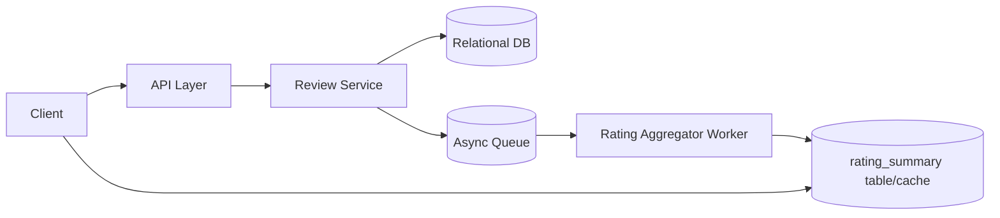

# Design a Rate-and-Review System for Products

## Blogs and websites

## Medium

## Youtube

## Theory

### Problem Statement

Design a rate-and-review system for an e-commerce catalog where users can leave a star rating and text review for a product, and shoppers can view an aggregated rating and browse reviews.

### Functional Requirements

- Submit a rating (1-5 stars) and optional review text for a product
- One review per user per product (edit allowed, no duplicates)
- View a product's average rating and rating distribution
- Browse/sort reviews (most recent, most helpful)
- Mark a review as helpful/report abuse

### Non-Functional Requirements

- **Scale**: Millions of products, read-heavy (average rating shown on every product page)
- **Latency**: Product page rating read < 100ms; submit review < 300ms
- **Consistency**: Aggregated rating should reflect submitted reviews within a short delay (eventual consistency acceptable)

### API Design

```
POST /products/{productId}/reviews    { rating, text }
GET  /products/{productId}/reviews?sort=
GET  /products/{productId}/rating-summary
POST /reviews/{reviewId}/helpful
```

### Data Model

```
reviews:         id (PK), product_id (FK), user_id, rating, text, helpful_count, created_at
                 UNIQUE(product_id, user_id)
rating_summary:  product_id (PK), avg_rating, total_reviews, rating_distribution (json)
```

### High-Level Architecture



### Key Design Points

- Enforce one review per `(product_id, user_id)` with a unique constraint, allowing edits via upsert.
- Maintain a denormalized `rating_summary` (avg rating, count, distribution) updated asynchronously on review create/update/delete, so product-page reads never need to aggregate raw reviews.
- Cache `rating_summary` per product since it's read far more often than it changes.

### Trade-offs

- Async aggregation means the displayed average rating can lag slightly behind the very latest review, which is an acceptable trade for keeping product-page reads fast and cheap at large catalog scale.
