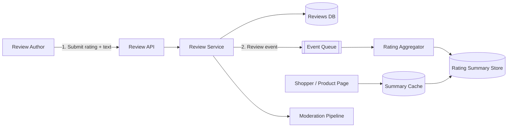
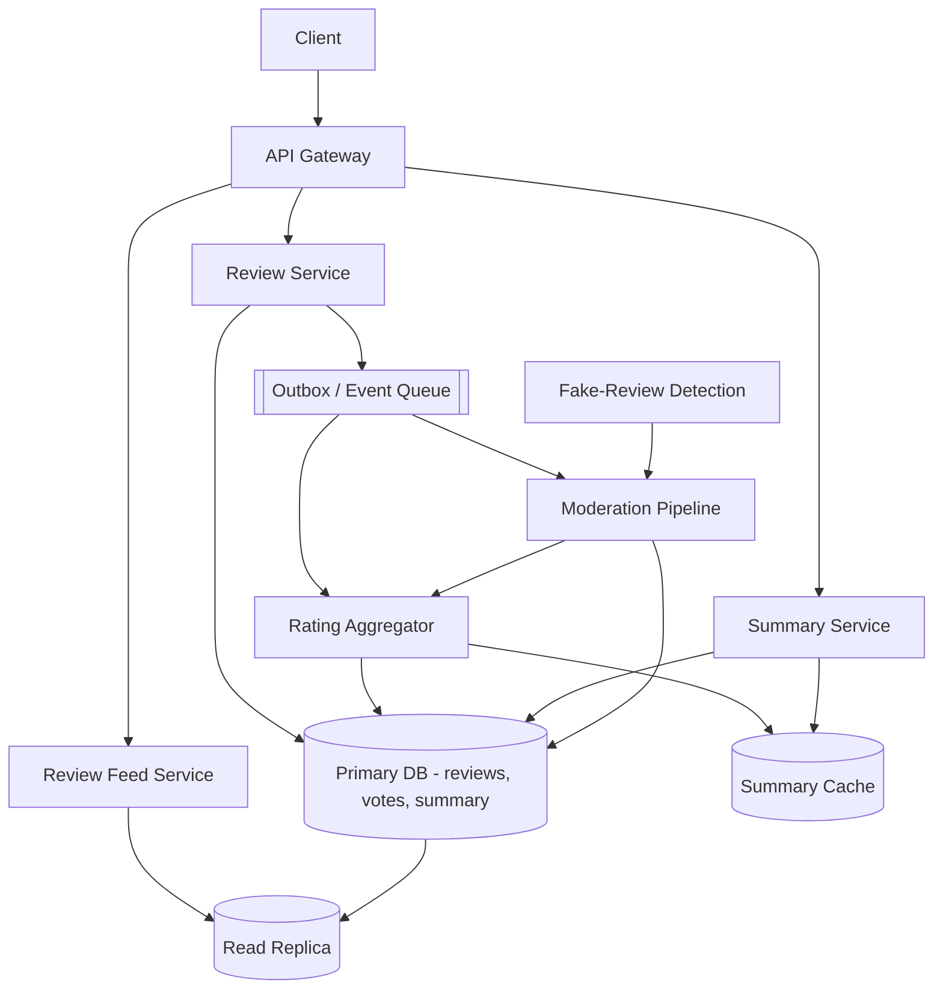
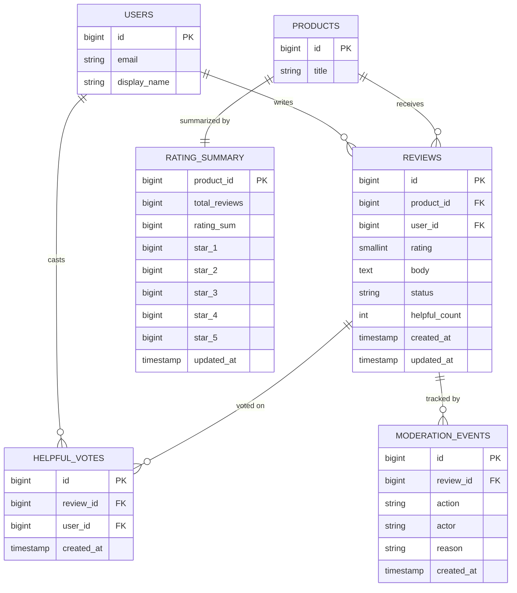
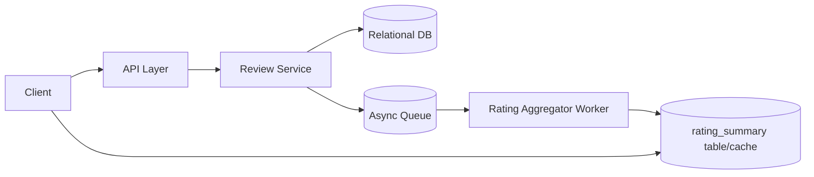
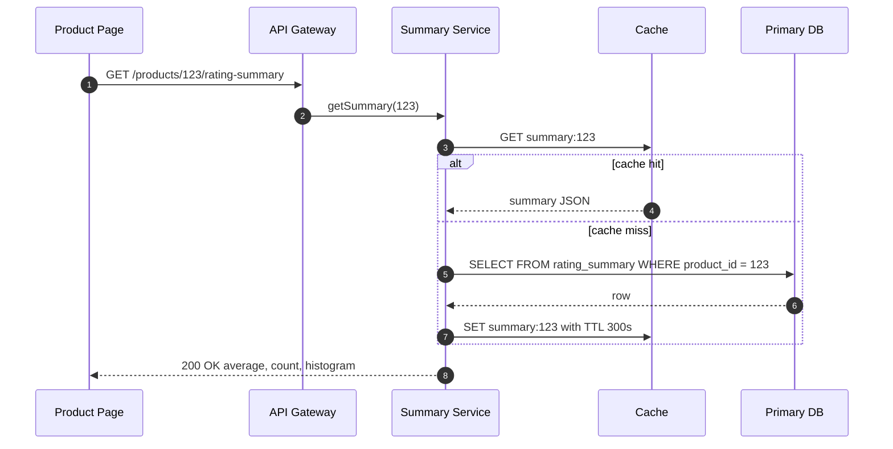

# Design a Rate-and-Review System for Products

## Blogs and websites

## Medium

## Youtube

## Theory

### Topics Covered

1. [Introduction](#introduction)
2. [Functional Requirements](#functional-requirements)
3. [Non-Functional Requirements](#non-functional-requirements)
4. [Capacity Estimation](#capacity-estimation)
5. [Characteristics](#characteristics)
6. [Components](#components)
7. [Patterns](#patterns)
8. [Benefits](#benefits)
9. [Pros](#pros)
10. [Cons](#cons)
11. [Challenges](#challenges)
12. [Best Practices](#best-practices)
13. [When to Use and When Not to Use](#when-to-use-and-when-not-to-use)
14. [Use Cases](#use-cases)
15. [API Design](#api-design)
16. [Data Modeling](#data-modeling)
17. [High-Level Design](#high-level-design)
18. [Deep Dive](#deep-dive)
19. [Java and Spring Boot Implementation Guide](#java-and-spring-boot-implementation-guide)
20. [Interview Questions and Answers](#interview-questions-and-answers)

---

### Introduction

**Problem statement.** Design a rate-and-review system for an e-commerce catalog where users can leave a star rating and text review for a product, and shoppers can view an aggregated rating and browse reviews.

A rate-and-review system is software that collects user-generated evaluations (star ratings plus free-text reviews) for catalog items and republishes them in two forms: an **aggregate** (average rating, total count, star histogram) shown on every product page, and a **review feed** (individual reviews, sortable and paginated) that shoppers read before buying. It exists because purchase decisions at distance require trust signals that the seller cannot credibly provide about their own products — the crowd's experience substitutes for physically inspecting the goods.

The problem sounds like simple CRUD — insert a row, average a column — but three properties make it a real system design topic:

- **Extreme read/write asymmetry.** The average rating is rendered on every product page view, search result, and recommendation card, while reviews are written rarely. Computing `AVG(rating)` on read would not survive; the aggregate must be precomputed and cached.
- **Correctness under concurrency.** One review per user per product must hold even when a user double-clicks, retries after a timeout, or races themselves from two devices.
- **Adversarial content.** Reviews have monetary value to sellers, so the system is a target for fake-review farms, review bombing, and self-promotion. Moderation and abuse detection are first-class parts of the design, not afterthoughts.



The diagram shows the core idea: the write path stores the raw review and emits an event; a separate aggregation path maintains a denormalized summary so the hot read path never touches raw reviews.

**Real-life use cases**

- **E-commerce marketplaces** (Amazon, Flipkart) — star ratings and reviews on every product, verified-purchase badges, helpful votes.
- **App stores** (Google Play, Apple App Store) — ratings per app version, developer replies.
- **Ride-sharing and food delivery** (Uber, DoorDash) — two-sided ratings of drivers/riders and restaurants.
- **Travel and hospitality** (Booking.com, TripAdvisor) — stay reviews with category sub-ratings.
- **Local business directories** (Yelp, Google Maps) — reviews as the primary content of the platform.

For this design we scope to the stated problem: a single-sided product review system with 1–5 stars, one review per user per product, aggregated ratings, helpful votes, and abuse reporting. The deep-dive section discusses how the design extends toward verified purchases, media attachments, and seller responses.

---

### Functional Requirements

1. **Submit a review.** An authenticated user submits a rating (1–5 stars, required) and optional review text for a product. Original requirement preserved: *submit a rating (1-5 stars) and optional review text for a product*.
2. **One review per user per product.** A user can review a given product at most once; editing an existing review (changing stars and/or text) is allowed, but creating a duplicate is not. Original requirement preserved: *one review per user per product (edit allowed, no duplicates)*.
3. **View aggregated rating.** Anyone can view a product's average rating, total review count, and the distribution of ratings across star values (the histogram). Original requirement preserved: *view a product's average rating and rating distribution*.
4. **Browse and sort reviews.** Anyone can browse a product's reviews paginated, sorted by most recent or most helpful, and filtered by star rating. Original requirement preserved: *browse/sort reviews (most recent, most helpful)*.
5. **Mark helpful / report abuse.** An authenticated user can mark a review as helpful (at most once per user per review) and can report a review for abuse. Original requirement preserved: *mark a review as helpful/report abuse*.
6. **Edit and delete own review.** The author can update or delete their review; the aggregate must reflect the change.
7. **Moderation lifecycle.** Reviews pass through a moderation state (`PUBLISHED`, `PENDING`, `REMOVED`); removed reviews are excluded from the aggregate and the public feed.
8. **Review listing for a user.** A user can see all reviews they have written (needed to render "you already reviewed this" states and profile pages).

Out of scope for the basic design (discussed as extensions): verified-purchase enforcement, photo/video attachments, seller responses, multi-criteria ratings, and review translation.

---

### Non-Functional Requirements

- **Scale.** Millions of products (assume 100 million), hundreds of millions of users, and a read-heavy workload — the average rating is shown on every product page. Original requirement preserved: *millions of products, read-heavy (average rating shown on every product page)*. Assume a read:write ratio of roughly 10,000:1 on the summary path.
- **Latency.** Product-page rating read under 100 ms at p99; review submission acknowledged under 300 ms at p99. Original requirement preserved: *product page rating read < 100ms; submit review < 300ms*.
- **Consistency.** The aggregated rating should reflect submitted reviews within a short delay; eventual consistency (a few seconds) is acceptable for the summary, while the review write itself is strongly consistent (a user who just posted must see their own review). Original requirement preserved: *aggregated rating should reflect submitted reviews within a short delay (eventual consistency acceptable)*.
- **Availability.** The read path (summary + feed) must be highly available — target 99.99% — because it sits on the revenue-critical product page. The write path can tolerate slightly lower availability (99.9%): a user who cannot post a review right now will retry later; a product page that cannot show ratings loses sales.
- **Durability.** An acknowledged review must not be lost (RPO = 0 for published reviews); reviews are user-generated content with legal and business value.
- **Integrity.** At most one review per `(product_id, user_id)`; at most one helpful vote per `(review_id, user_id)`; aggregates must be reconcilable against raw reviews.
- **Abuse resistance.** The system must withstand coordinated fake-review campaigns and review bombing without corrupting the displayed aggregate.

---

### Capacity Estimation

Back-of-envelope estimation with explicit assumptions.

**Assumptions**

- Products: **100 million**; active products with at least one review: **20 million**
- Registered users: **500 million**; daily active users: **50 million**
- Total reviews in the system: **500 million** (average 25 reviews per active product)
- New reviews: **500,000 per day**; helpful votes: **5 million per day**
- Product page views: **500 million per day** (each needs the rating summary); review-feed reads: **25 million per day**
- Sizes: review row with text and indexes ≈ 1 KB (average review text ≈ 400 bytes); rating summary row ≈ 150 bytes; helpful-vote row ≈ 50 bytes

**QPS**

1. Summary reads: `500,000,000 / 86,400 s ≈ 5,800 reads/s average`; with a peak factor of 5× → `≈ 29,000 reads/s peak`. This is the hot path and must be served from cache.
2. Review-feed reads: `25,000,000 / 86,400 ≈ 290/s average`, `≈ 1,500/s peak`.
3. Review writes: `500,000 / 86,400 ≈ 6 writes/s average`, `≈ 30/s peak` — trivial for a single primary.
4. Helpful votes: `5,000,000 / 86,400 ≈ 58/s average`, `≈ 300/s peak`.
5. Aggregator updates: one per review write plus edits/deletes → under 100/s.

The write side is tiny; the entire capacity problem is the **summary read path**, which is why the design centers on a precomputed, cached `rating_summary`.

**Storage**

1. Reviews: `500,000,000 × 1 KB ≈ 500 GB` — fits on one large database node, but partition by `product_id` for locality and archival.
2. Rating summaries: `100,000,000 × 150 B ≈ 15 GB` — small enough to cache a large fraction.
3. Helpful votes: assume 200 million total → `200,000,000 × 50 B ≈ 10 GB`.
4. **Total: well under 1 TB** — no sharding required for capacity; partitioning is for operational convenience, not survival.

**Cache sizing**

1. Hot products follow a power law: the top 1% of products (1 million) receive roughly 80% of page views.
2. Caching 5 million summaries × 150 B ≈ **750 MB of Redis** absorbs nearly all summary reads.
3. At 29,000 peak reads/s with a 99% cache hit rate, the database sees under 300 summary reads/s.

**Bandwidth**

1. Summary read: `29,000/s × 0.5 KB ≈ 15 MB/s` outbound at peak — modest.
2. Review feed: `1,500/s × 20 KB (page of 10 reviews) ≈ 30 MB/s` — CDN and pagination keep this manageable.

**Takeaway.** The system is *read-dominated and cache-friendly*; the interesting engineering is aggregate maintenance, integrity constraints, and abuse defense — not raw throughput. Saying this explicitly is a strong interview move.

---

### Characteristics

- **Read-heavy with a tiny write path.**
  What it means: summary reads outnumber review writes by roughly five orders of magnitude. Why it matters: the architecture should spend its complexity budget on the read path (precomputation, caching) and keep the write path simple and correct. Example: 29,000 summary reads/s against 30 review writes/s at peak.

- **Precomputed aggregates.**
  What it means: average rating, count, and histogram are stored denormalized, not computed on read. Why it matters: `AVG()` over millions of rows per page view is impossible at this scale. How it works: an aggregator applies each review event as an increment to the summary row. Example: a product with 2 million reviews still serves its summary in O(1).

- **Eventual consistency on the read model.**
  What it means: the displayed average can lag the newest review by seconds. Why it matters: it decouples the write path from aggregate maintenance, so a slow aggregator never blocks a review submission. Example: a user posts a 5-star review; the product page shows the updated average 2 seconds later.

- **Read-your-writes for the author.**
  What it means: the author must immediately see their own review even though the aggregate lags. Why it matters: without it, users repost and create duplicate-submission pressure. How it works: the feed query unions the author's own latest review from the primary, or the client merges the POST response into the rendered list.

- **One review per user per product.**
  What it means: the pair `(product_id, user_id)` is unique. Why it matters: it is the main defense against ballot stuffing by a single account and the anchor for idempotent retries. How it works: a database unique constraint, enforced in the storage engine, not in application code.

- **User-generated, adversarial content.**
  What it means: review text is untrusted input with monetary incentive to abuse. Why it matters: spam, fake reviews, and review bombing are steady-state, not edge cases. How it works: moderation states, abuse signals, rate limits, and fake-review detection feed the pipeline. Example: a product launch attracts 500 five-star reviews from accounts created the same day — the detector flags the burst.

- **Immutable-ish history with editable head.**
  What it means: the current review is editable, but every change is an event. Why it matters: aggregates must be correctable when a review changes (3 stars edited to 5 stars) or is removed by moderation. How it works: update events carry old and new ratings so the aggregator can apply a delta.

- **Sortable feed with two hot orderings.**
  What it means: "most recent" and "most helpful" are the dominant sorts. Why it matters: they need different indexes; "most helpful" sorts on a counter that changes constantly, so deep pagination on it is unstable. How it works: index on `(product_id, created_at DESC)` for recency; `(product_id, helpful_count DESC)` for helpfulness; cursor pagination for both.

---

### Components

- **API layer (gateway)**
  Purpose: single entry point for clients. Responsibilities: TLS termination, authentication, rate limiting (per-user write limits, per-IP read limits), request validation, routing. How it works: stateless horizontally scaled instances behind a load balancer. Relationships: fronts the review, summary, and moderation services. Real-world example: an Envoy/NGINX or cloud ALB tier in front of Spring Boot services.

- **Review service**
  Purpose: execute the submit/edit/delete review use cases. Responsibilities: validate input, enforce one-review-per-user via the database constraint, persist the review, write an outbox event in the same transaction, enforce per-user rate limits. Relationships: owns writes to `reviews`; publishes events to the queue via the outbox. Real-world example: the core transactional microservice in any UGC platform.

- **Primary database (reviews store)**
  Purpose: durable home of reviews, helpful votes, and the rating summary. Responsibilities: ACID transactions, unique constraints, replication, backups. Relationships: written by the review service and the aggregator; read by the feed and summary services. Real-world example: PostgreSQL with streaming read replicas.

- **Event queue**
  Purpose: decouple review writes from aggregate maintenance and moderation. Responsibilities: durable, ordered-per-product delivery of review events. How it works: the outbox relay publishes committed events; consumers process at their own pace. Relationships: fed by the review service outbox; consumed by the aggregator and moderation pipeline. Real-world example: Kafka with a `reviews` topic partitioned by `product_id`.

- **Rating aggregator**
  Purpose: maintain the denormalized `rating_summary`. Responsibilities: consume review events, apply increments/deltas/decrements idempotently, invalidate or update the summary cache. Relationships: reads the queue; writes the summary table and cache. Real-world example: a Kafka consumer group running the `RatingSummaryService` shown in the implementation guide.

- **Summary cache**
  Purpose: serve the hot read path in single-digit milliseconds. Responsibilities: store serialized summaries with a TTL; absorb the 29,000 reads/s peak. Relationships: read by the summary service; written/invalidated by the aggregator. Real-world example: Redis with cache-aside (`GET summary:{productId}`).

- **Review feed service**
  Purpose: serve paginated, sortable review lists. Responsibilities: cursor pagination, sorting (recent/helpful), filtering by star, excluding moderated reviews, read-your-writes merge for the author. Relationships: reads replicas of the reviews store. Real-world example: a read-only service hitting PostgreSQL replicas.

- **Moderation pipeline**
  Purpose: keep abusive content out of the public feed and the aggregate. Responsibilities: automated checks (profanity, spam classifiers, fake-review signals), human review queue for edge cases, state transitions on reviews, compensating aggregate updates on removal. Relationships: consumes review events; writes review status; emits removal events the aggregator consumes. Real-world example: Amazon's combination of ML classifiers and human moderators.

- **Abuse/fake-review detection service**
  Purpose: score reviews and accounts for authenticity. Responsibilities: compute signals (account age, review velocity, text similarity, rating bursts per product), flag or auto-hold suspicious reviews. Relationships: reads reviews and user metadata; writes flags consumed by moderation. Real-world example: the "verified purchase" and anomaly-detection systems behind marketplace review integrity teams.



---

### Patterns

- **Materialized aggregate (precomputed read model)**
  What it is: the average, count, and histogram are stored as a row updated on each review event, instead of being computed by `GROUP BY` on read. Problem it solves: the read:write ratio (~10,000:1) makes on-read aggregation impossible. How it works: the aggregator applies `total += 1; sum += rating; bucket[rating] += 1` per event; average is `sum / total` at read time. When to use: whenever an aggregate is read orders of magnitude more often than the underlying events are written. When not to use: when aggregates must be perfectly consistent with every write and the write rate is low — then compute on read or update synchronously in the same transaction. Advantages: O(1) reads, trivially cacheable. Disadvantages: drift risk if events are lost or double-applied; needs idempotent consumers and periodic reconciliation. Real-world example: YouTube view counts and like counts are precomputed counters, not `COUNT(*)` queries.

- **Outbox pattern**
  What it is: the review row and an outbox event row are written in one database transaction; a relay publishes the outbox to the queue. Problem it solves: the dual-write problem — you cannot atomically write to PostgreSQL and publish to Kafka. How it works: transaction commits review + outbox row; a CDC relay (Debezium) or poller ships events. When to use: whenever a state change must reliably produce an event. When not to use: for fire-and-forget telemetry where loss is acceptable. Advantages: no lost or phantom events. Disadvantages: at-least-once delivery, so the aggregator must be idempotent. Real-world example: standard microservices practice; Debezium feeding Kafka from a Postgres outbox table.

- **CQRS (Command Query Responsibility Segregation)**
  What it is: the write model (reviews) and read models (summary, feed) are separated and scaled independently. Problem it solves: reads and writes have different shapes, consistency needs, and volumes. How it works: commands go to the review service and primary; queries hit the cache, summary table, and read replicas. Advantages: independent scaling and schema optimization per side. Disadvantages: eventual consistency between sides; more moving parts. Real-world example: product pages served from a read-optimized store while checkout writes go to a transactional store.

- **Cache-aside (lazy loading) with TTL**
  What it is: the summary service checks the cache, falls back to the database on miss, and populates the cache. Problem it solves: the hot read path must not hit the database. How it works: `GET summary:{productId}`; on miss, `SELECT` then `SET` with a 5-minute TTL; the aggregator also invalidates/updates on change. Advantages: simple, resilient (cache failure degrades to database reads). Disadvantages: a miss storm on a hot key (cache stampede) — mitigated with request coalescing or short TTL jitter. Real-world example: the standard Redis usage pattern behind most high-traffic read endpoints.

- **Idempotent consumer**
  What it is: the aggregator records processed event ids and ignores duplicates. Problem it solves: at-least-once delivery from the outbox would otherwise double-count reviews in the summary. How it works: an `applied_events` table (or a `last_event_id` per product) with a unique constraint on `event_id`; the increment and the marker insert happen in one transaction. Advantages: exactly-once effect from at-least-once transport. Disadvantages: extra write per event; marker table growth (mitigated by retention). Real-world example: any Kafka consumer writing to a relational store.

- **State machine pattern (moderation lifecycle)**
  What it is: a review moves through `PUBLISHED → PENDING → REMOVED` (and back) via guarded transitions. Problem it solves: prevents illegal states such as a removed review still counting in the aggregate. How it works: every transition emits an event the aggregator understands (`REVIEW_REMOVED` decrements; `REVIEW_RESTORED` re-increments). Advantages: single source of truth for visibility; auditable moderation. Disadvantages: every consumer must handle every transition. Real-world example: content moderation queues at any UGC platform.

---

### Benefits

- **Product-page reads are O(1) and cacheable.** The precomputed summary turns the hottest read in the system into a single key lookup. In production this is the difference between a 15 GB Redis cluster and a database fleet melting on every sale event.
- **The write path stays simple and provably correct.** One transaction (insert review + outbox row) plus a unique constraint delivers one-review-per-user without distributed locks. In production, boring and provable beats clever and fragile — integrity bugs in reviews become public trust incidents.
- **Aggregation lag is a feature, not a bug.** Because a few seconds of staleness is acceptable, the aggregator can be restarted, rebalanced, or slowed without affecting review submission or product pages. In production this decoupling is what lets you deploy the aggregator during peak traffic.
- **Every aggregate is reconcilable.** The summary is a pure function of the review set, so a nightly job can recompute it from raw reviews and alert on drift. In production this turns "the average looks wrong" from a mystery into a diff.
- **Moderation is structurally integrated.** Because the aggregate is event-driven, removing a review automatically corrects the summary — there is no separate "recompute after moderation" step to forget. In production this closes the most common integrity hole in review systems.
- **The design degrades gracefully.** If the cache dies, reads fall back to the summary table; if the queue backs up, summaries lag but nothing is lost; if the feed service dies, the summary (the revenue-critical part) still serves. In production, each failure has a known, survivable blast radius.

---

### Pros

- **Massively scalable read path.** Cache-aside over a tiny summary table absorbs tens of thousands of reads per second with sub-10 ms latency; the advantage compounds with catalog size because summary size is per-product, not per-review.
- **Strong integrity from boring technology.** The `UNIQUE(product_id, user_id)` constraint plus one transaction gives exactly-one-review using nothing more exotic than PostgreSQL; correctness does not degrade as traffic grows because contention is per-product-user, never a global hot row.
- **Editable reviews with correct aggregates.** Delta events (`old_rating → new_rating`) let the aggregator correct the summary without recomputation, so the "edit my review" feature — a real user need — does not threaten aggregate accuracy.
- **Independent scaling of every component.** Feed, summary, write, aggregation, and moderation all scale on their own axes; a review-bombing attack on one product stresses the aggregator partition for that product, not the whole system.
- **Extensible toward richer features.** Verified-purchase badges, media attachments, and seller responses attach as new columns, new event fields, and new consumers without redesigning the core.
- **Clear failure semantics.** Duplicate submission → 409; invalid rating → 400; moderated product → feed excludes it. Deterministic, explainable failures make the system operable and the API pleasant to consume.

---

### Cons

- **The displayed aggregate can be stale.** A shopper may see an average that excludes a review posted seconds ago. The design trades freshness for read scalability; for most commerce this is free, but "live" experiences (a streamer's product drop) may need push updates or shorter lag budgets.
- **Aggregate drift is possible.** A lost event, a bug in delta application, or a double-applied event silently corrupts the summary. Mitigation (idempotent consumers, reconciliation jobs) is mandatory operational overhead, not optional polish — the trade-off for not computing on read.
- **"Most helpful" sorting is unstable under votes.** The helpful count changes constantly, so cursor pagination over it can skip or repeat items, and the sort index churns. The design accepts approximate ordering for the helpful sort; strict ordering would require snapshotting ranks periodically.
- **Abuse defense is an arms race.** Fake-review detection produces false positives (legitimate reviews held) and false negatives (sophisticated farms pass). The design includes the pipeline but cannot make detection perfect; the trade-off is ongoing investment in signals and human review.
- **One-review-per-user is a product compromise.** A user whose opinion changes must edit rather than post anew, and review history is not a timeline. Alternatives (versioned reviews, review-per-purchase) add schema and UX complexity that the basic design deliberately avoids.
- **Hot products create hot partitions.** A viral product concentrates review events, aggregator work, and cache keys on one partition. The design mitigates with per-product partitioning and cache coalescing, but a single-product traffic spike remains a shared-fate hotspot.

---

### Challenges

- **Keeping the aggregate correct at scale (technical).** Increments, deltas, decrements, and restores must all be applied exactly once per event, in an order that tolerates replays. The idempotent-consumer marker and the reconciliation job are the load-bearing mechanisms; getting delta application wrong (e.g., applying an edit as a fresh increment) is the classic bug.
- **Hot-key reads on viral products (scalability).** A product on the homepage can receive millions of summary reads per hour against one cache key. Mitigations: local in-process caching with short TTL in front of Redis, request coalescing on misses, and replicating the hot key across cache nodes.
- **Fake reviews and review bombing (security).** Adversaries are economically motivated and adaptive. Signals (account age, device fingerprint, review velocity per product, text similarity, rating distribution anomalies) must be combined; no single signal suffices, and every threshold trades false positives against false negatives.
- **Moderation latency vs. exposure (operational).** Auto-publish-then-moderate exposes abusive content briefly; hold-then-publish delays legitimate reviews. Most systems auto-publish low-risk reviews (aged accounts, verified purchases) and hold high-risk ones — a risk-tiered pipeline rather than a single gate.
- **Deep pagination on mutable sorts (performance).** `OFFSET 100000` scans and discards; sorting by a changing counter makes pages inconsistent. Cursor pagination on `(helpful_count, review_id)` or `(created_at, review_id)` keeps queries O(page size), accepting that the helpful ordering is approximate.
- **Data lifecycle and GDPR (operational/legal).** Deleting a user must remove or anonymize their reviews and correct aggregates; retention policies must archive cold reviews. Every deletion is an aggregate event — the pipeline must handle user-erasure at scale without recomputing entire products synchronously.
- **Multi-region consistency (reliability).** If reviews are written in one region and read globally, cross-region replication lag widens the staleness window; if writes are multi-region, the one-review constraint needs a global uniqueness story (route by user, or a global constraint service). The basic design assumes single-region writes.
- **Schema evolution of the summary (maintainability).** Adding a sub-rating (e.g., "value for money") changes the summary shape; the aggregator, cache entries, and reconciliation job must migrate together. Versioned summary payloads and backfill jobs are required.

---

### Best Practices

1. **Enforce one-review-per-user with a database unique constraint, not application checks.** Why: a check-then-act in code races under concurrency; `UNIQUE(product_id, user_id)` is enforced by the storage engine and cannot be bypassed by two simultaneous requests. Example: a user double-clicks "submit"; one insert wins, the other gets a constraint violation mapped to 409 — or, better, treated as an idempotent retry returning the original review.
2. **Never aggregate on the read path.** Why: `AVG()` over a product's reviews is O(reviews) per page view and collapses at scale. Maintain the summary on write events and read it in O(1). Example: the capacity estimation shows 29,000 summary reads/s against 30 writes/s — precomputation moves work from the hot path to the cold one.
3. **Make the aggregator idempotent and reconcile nightly.** Why: at-least-once delivery is the default for queues; without idempotency every retry corrupts the average, and without reconciliation small drifts accumulate into visible errors. Example: an `applied_events` marker table plus a job that recomputes `SUM/COUNT` per product and alerts on mismatch.
4. **Write the review and its event in one transaction (outbox).** Why: publishing to the queue after commit can lose events on crash; publishing before commit can emit phantom events for rolled-back reviews. The outbox makes the state change and the event atomic.
5. **Return the author's own review immediately (read-your-writes).** Why: users who do not see their review repost, creating duplicate pressure and support tickets. Example: the POST response contains the full review; the client merges it into the feed; the feed query also forces the author's row from the primary.
6. **Use cursor pagination, never OFFSET, for the feed.** Why: OFFSET scans grow linearly and pages shift as new reviews arrive. Example: `WHERE (created_at, id) < (:cursorCreatedAt, :cursorId) ORDER BY created_at DESC, id DESC LIMIT 20` is O(page size) and stable.
7. **Rate-limit writes per user and per product.** Why: review bombing and spam are write-path attacks; a per-user limit (e.g., 10 reviews/day) and a per-product velocity alarm blunt both without affecting legitimate users. Example: a product receiving 100× its normal review velocity is auto-flagged and its incoming reviews held for moderation.
8. **Treat moderation transitions as aggregate events.** Why: a removed review that still counts in the average is an integrity bug users can screenshot. Example: `REVIEW_REMOVED` decrements the summary in the same idempotent pipeline as creation increments it.
9. **Cache with TTL plus active invalidation, and coalesce misses.** Why: TTL alone leaves stale data for minutes after a change; invalidation alone leaves a stampede window on hot keys. Example: aggregator updates the cache entry on change; a 5-minute TTL bounds staleness if an invalidation is lost; single-flight coalescing prevents a miss storm.
10. **Log and audit moderation decisions.** Why: moderation is legally and reputationally sensitive; every removal needs a reason, an actor (classifier version or moderator id), and a reversible record. Example: a `moderation_events` append-only table per review.

---

### When to Use and When Not to Use

**Use this design when**

- The workload is read-dominated with a precomputable aggregate — ratings, likes, view counts, vote totals.
- One contribution per user per target is the rule, and edits replace rather than append.
- A few seconds of aggregate staleness is acceptable to users and the business.
- Content is adversarial enough to need moderation, but a risk-tiered pipeline (auto-publish low-risk, hold high-risk) is acceptable.
- The catalog is large but the summary fits in cache — the power-law read pattern does the rest.

**Do not use this design (choose an alternative) when**

- **Aggregates must be transactionally exact** (financial ledgers, inventory) → update the aggregate in the same transaction as the write, or compute on read; eventual consistency is not acceptable there.
- **Contributions are append-only events, not one-per-user** (activity feeds, comments) → the uniqueness anchor disappears and the feed becomes the primary model; see news-feed designs.
- **Real-time collaborative rating** (live polls, audience voting during a broadcast) → write rates spike to thousands per second on one key; use log-based ingestion with approximate counters instead of per-event relational updates.
- **Multi-sided or multi-criteria ratings dominate** (ride-sharing driver/rider, hotels with 6 sub-scores) → generalize the summary to a per-dimension histogram from the start; retrofitting sub-ratings into a single-average schema is painful.
- **Strong verified-purchase gating is the core requirement** → the eligibility check (did this user buy/receive the item?) becomes the centerpiece, similar to the voter-registry problem in the online voting design.

**Decision factors:** read:write ratio, staleness tolerance, uniqueness rule, adversarial pressure, need for verified eligibility, and whether the aggregate is single- or multi-dimensional.

---

### Use Cases

#### Use Case 1: E-commerce marketplace product reviews

- **Problem.** 100 million products, 500 million page views/day; the star rating must render on every page, and sellers are economically motivated to game it.
- **Proposed solution.** Exactly this design: precomputed summary in cache, event-driven aggregation, one review per user per product, risk-tiered moderation with fake-review detection.
- **Why this design is suitable.** The read:write ratio (~10,000:1) and power-law product popularity are precisely what the cache-aside summary and per-product partitioning exploit; the adversarial environment is what the moderation pipeline is for.
- **How it works.** A shopper posts a review; the review service commits it with an outbox event; the aggregator increments the summary and refreshes the cache within ~2 seconds; product pages read the cached summary; a velocity alarm watches for review bombing on trending products.
- **Trade-offs.** The average lags new reviews by seconds (invisible to shoppers); verified-purchase gating is added by joining the order service at submission time, adding latency to the write path only.

#### Use Case 2: Mobile app store ratings

- **Problem.** 5 million apps; ratings must be segmentable by app version and country; developers reply to reviews.
- **Proposed solution.** This design with the summary keyed by `(app_id, version, country)` instead of `product_id`, plus a `developer_replies` table hanging off reviews.
- **Why this design is suitable.** The aggregate-per-key pattern generalizes: each segment is just another summary row maintained by the same idempotent aggregator; the read path is unchanged.
- **How it works.** A review event carries version and country; the aggregator updates the per-segment summaries it matches; the app page reads the summary for the user's current version and locale, falling back to the all-versions summary.
- **Trade-offs.** Summary cardinality multiplies (apps × versions × countries), growing the table and cache; cold segments are evicted naturally by TTL. Version-segmented averages confuse users when an update resets the visible rating — a product decision the schema supports but does not make for you.

#### Use Case 3: Restaurant reviews for a food-delivery platform

- **Problem.** 500,000 restaurants; reviews must be recent-biased (a restaurant can change chefs), and delivery-speed ratings matter alongside food quality.
- **Proposed solution.** This design plus time-decayed aggregation: the summary stores a decayed sum and count (or a sliding-window summary recomputed nightly), and two rating dimensions (food, delivery).
- **Why this design is suitable.** The event-driven aggregator is the right place to implement decay — recompute-from-events nightly for the windowed summary while the all-time summary stays incremental.
- **How it works.** Incremental path as usual for all-time stats; a nightly batch job recomputes the 90-day windowed summary from raw reviews and swaps it in; the restaurant page shows the windowed average with the all-time count.
- **Trade-offs.** Two summaries to maintain and reconcile; nightly recompute is batch cost proportional to recent review volume, not total history — acceptable because the window is bounded.

#### Use Case 4: Internal course-evaluation system (boundary case)

- **Problem.** A university collects end-of-semester course ratings; 50,000 students, results visible only after grades are posted, and instructors must not identify reviewers.
- **Proposed solution.** The same schema, but with the summary gated on a publication state (like the voting system's delayed tally) and reviewer identity separated from the review row.
- **Why this design is suitable (as a base).** The aggregate maintenance, one-review-per-student-per-course constraint, and moderation pipeline carry over directly; what changes is visibility gating and anonymity, not the aggregation architecture.
- **How it works.** Reviews accumulate during the evaluation window with summaries maintained but unpublished; at publication, the summary cache is warmed and the feed opens; the `reviews` table stores a pseudonymous author reference.
- **Trade-offs.** Anonymity conflicts with edit-my-review (the author link must exist somewhere); resolved by keeping the author mapping in a separate, access-controlled table — the same identity/content separation as the voting design.

---

### API Design

Base path: `/api/v1`. All mutating endpoints require authentication (OIDC bearer token) and per-user rate limits at the gateway. Original endpoint set preserved and expanded:

```
POST /products/{productId}/reviews    { rating, text }
GET  /products/{productId}/reviews?sort=
GET  /products/{productId}/rating-summary
POST /reviews/{reviewId}/helpful
```

| Method | Endpoint | Purpose | Auth |
|---|---|---|---|
| POST | `/api/v1/products/{productId}/reviews` | Submit a review (one per user) | User |
| GET | `/api/v1/products/{productId}/reviews` | Browse reviews (sort, filter, paginate) | Public |
| GET | `/api/v1/products/{productId}/rating-summary` | Average, count, histogram | Public |
| PUT | `/api/v1/products/{productId}/reviews/mine` | Edit own review | User |
| DELETE | `/api/v1/products/{productId}/reviews/mine` | Delete own review | User |
| POST | `/api/v1/reviews/{reviewId}/helpful` | Mark review helpful (once per user) | User |
| DELETE | `/api/v1/reviews/{reviewId}/helpful` | Remove own helpful vote | User |
| POST | `/api/v1/reviews/{reviewId}/reports` | Report abuse | User |
| GET | `/api/v1/users/me/reviews` | List own reviews | User |

**Submit a review**

```http
POST /api/v1/products/123/reviews HTTP/1.1
Authorization: Bearer eyJhbGciOi...
Idempotency-Key: 7c9e6679-7425-40de-944b-e07fc1f90ae7
Content-Type: application/json

{ "rating": 4, "text": "Solid build quality; battery life is average." }
```

Success `201 Created`:

```json
{
  "reviewId": 987654,
  "productId": 123,
  "rating": 4,
  "text": "Solid build quality; battery life is average.",
  "status": "PUBLISHED",
  "helpfulCount": 0,
  "createdAt": "2026-05-01T10:15:30Z"
}
```

Error responses:

```json
HTTP 409 Conflict
{ "error": "REVIEW_ALREADY_EXISTS", "message": "You have already reviewed product 123. Use PUT /products/123/reviews/mine to edit it." }

HTTP 400 Bad Request
{ "error": "VALIDATION_FAILED", "message": "rating must be between 1 and 5", "fields": ["rating"] }

HTTP 404 Not Found
{ "error": "PRODUCT_NOT_FOUND", "message": "Unknown product 123." }

HTTP 429 Too Many Requests
{ "error": "RATE_LIMITED", "message": "Review submission limit exceeded. Try again later.", "retryAfterSeconds": 3600 }
```

**Browse reviews** — cursor pagination, sorting, filtering:

```http
GET /api/v1/products/123/reviews?sort=helpful&rating=5&limit=20&cursor=eyJoIjoxM30iLCJpIjo5OH0
```

```json
HTTP 200 OK
{
  "reviews": [
    {
      "reviewId": 456,
      "author": { "displayName": "Priya K." },
      "rating": 5,
      "text": "Exceeded expectations...",
      "helpfulCount": 231,
      "createdAt": "2026-04-20T08:00:00Z"
    }
  ],
  "nextCursor": "eyJoIjoxMn0iLCJpIjo3N30",
  "hasMore": true
}
```

**Rating summary** — the hot path:

```http
GET /api/v1/products/123/rating-summary
```

```json
HTTP 200 OK
{
  "productId": 123,
  "averageRating": 4.27,
  "totalReviews": 18342,
  "distribution": { "1": 512, "2": 733, "3": 1901, "4": 6200, "5": 8996 },
  "updatedAt": "2026-05-01T10:15:28Z"
}
```

**Design notes**

- **Idempotency:** the `Idempotency-Key` header plus the `(product_id, user_id)` unique constraint makes retries safe; a repeated submission returns the original review (200) instead of a duplicate or an error.
- **Pagination/filtering/sorting:** cursor pagination (`cursor` + `limit`, max 50) on both supported sorts (`recent`, `helpful`); `rating` filters by star value. OFFSET is not offered.
- **Validation:** `rating` is an integer in [1, 5]; `text` is optional, max 5,000 chars, sanitized for HTML; Bean Validation on the request record plus a database CHECK constraint as backstop.
- **Versioning:** path version `/v1`; breaking changes (e.g., multi-criteria ratings) ship as `/v2` with a different payload shape.
- **Auth:** OIDC access tokens for users; public reads need no token but are per-IP rate-limited at the edge; moderation endpoints live under `/api/v1/admin` with a separate admin realm.
- **Rate limiting:** per-user limits on POST/PUT (e.g., 10 reviews/day, 60 helpful votes/hour); per-IP limits on public reads; per-product velocity alarms feed moderation rather than hard-failing users.
- **Caching headers:** the summary endpoint returns `Cache-Control: public, max-age=5` so CDNs collapse concurrent product-page fetches.

---

### Data Modeling

**Design principle:** store raw reviews normalized and immutable-ish; store the aggregate denormalized and derived. The summary is always recomputable from the reviews. Original table sketch preserved and normalized:

```
reviews:         id (PK), product_id (FK), user_id, rating, text, helpful_count, created_at
                 UNIQUE(product_id, user_id)
rating_summary:  product_id (PK), avg_rating, total_reviews, rating_distribution (json)
```



**Keys, constraints, indexes**

- `reviews`: `UNIQUE(product_id, user_id)` — the one-review-per-user anchor and the idempotency backstop. `CHECK (rating BETWEEN 1 AND 5)`. Index on `(product_id, created_at DESC, id)` for the recent sort and `(product_id, helpful_count DESC, id)` for the helpful sort; both support cursor pagination. `status` is `PUBLISHED | PENDING | REMOVED`; feed queries filter `status = 'PUBLISHED'`.
- `rating_summary`: `product_id` is the PK. Stores `rating_sum` and per-star counts rather than a float average, so increments are exact integer arithmetic and the average (`rating_sum / total_reviews`) is computed at read time without float drift. The original sketch's `rating_distribution (json)` is normalized here into five columns — typed, indexable, and cheaper to increment than JSON mutation.
- `helpful_votes`: `UNIQUE(review_id, user_id)` — one vote per user per review; `helpful_count` on `reviews` is a denormalized counter maintained in the same transaction as the vote insert/delete.
- `moderation_events`: append-only; `actor` records the classifier version or moderator id for audit.

**Normalization vs. denormalization**

- The write model is 3NF: no counts on `products`, no duplicated user data on `reviews`.
- Two deliberate denormalizations: `rating_summary` (the whole point of the design) and `reviews.helpful_count` (avoids a `COUNT` join on the feed's hot sort). Both are derived, reconcilable, and updated transactionally or via idempotent events.

**Data lifecycle and partitioning**

- `reviews` is append-mostly (edits are in-place updates of the head row; history, if needed, goes to an audit table). Partition by hash of `product_id` for locality and archival.
- User deletion (GDPR) anonymizes `reviews.user_id` to a tombstone and emits decrement events so aggregates stay correct.
- `moderation_events` and the aggregator's `applied_events` markers have retention policies (e.g., 2 years and 30 days respectively).

---

### High-Level Design

**Component responsibilities and dependencies**

The API layer authenticates, validates, and rate-limits. The review service executes transactional writes (review + outbox). The primary database holds reviews, helpful votes, and the summary. The outbox relay publishes events to the queue. The aggregator consumes events, applies idempotent increments to the summary, and refreshes the cache. The summary service serves the hot read path from cache with database fallback. The feed service serves paginated reviews from read replicas. The moderation pipeline consumes the same events, transitions review state, and emits compensating events on removal.

Original architecture sketch preserved:



**Submit-review request flow**

```mermaid
sequenceDiagram
    autonumber
    participant C as Client
    participant GW as API Gateway
    participant RS as Review Service
    participant DB as Primary DB
    participant Q as Event Queue
    participant AG as Aggregator
    participant RC as Summary Cache

    C->>GW: POST /products/123/reviews (rating, text, Idempotency-Key)
    GW->>RS: authenticated userId
    RS->>DB: BEGIN; INSERT review; INSERT outbox event
    alt first review by this user
        DB-->>RS: COMMIT
        RS-->>C: 201 Created + review body
    else duplicate submission
        DB-->>RS: unique violation on product_id+user_id
        RS->>DB: SELECT existing review
        RS-->>C: 200 with original review (retry) or 409 REVIEW_ALREADY_EXISTS
    end
    RS->>Q: relay ships REVIEW_CREATED from outbox
    Q->>AG: REVIEW_CREATED (eventId, productId, rating)
    AG->>DB: INSERT applied_event marker; UPDATE rating_summary increment
    AG->>RC: update or invalidate summary:123
```

Under the diagram: the critical property is that the review insert and the outbox event commit in **one transaction**, so a crash can never leave a stored review with no event (aggregate would drift) or an event with no review (phantom increment). The unique constraint makes concurrent duplicates resolve to exactly one stored review, and the aggregator's marker table makes event redelivery harmless.

**Summary read flow (hot path)**



Under the diagram: the read path is a textbook cache-aside. The aggregator actively refreshes or invalidates the key on every change, so the TTL is only a backstop for lost invalidations; a single-flight lock on miss prevents a stampede when a hot product's key expires.

**Moderation and removal flow**

```mermaid
sequenceDiagram
    autonumber
    participant Q as Event Queue
    participant MD as Moderation Pipeline
    participant DB as Primary DB
    participant AG as Aggregator
    participant RC as Summary Cache

    Q->>MD: REVIEW_CREATED (text, author signals)
    MD->>MD: classifiers score spam/abuse/fake probability
    alt low risk
        MD->>DB: status stays PUBLISHED; log decision
    else high risk
        MD->>DB: status := REMOVED; INSERT moderation_event
        MD->>Q: emit REVIEW_REMOVED
        Q->>AG: REVIEW_REMOVED
        AG->>DB: decrement rating_summary (idempotent)
        AG->>RC: invalidate summary key
    end
```

Under the diagram: removal is just another event in the same idempotent pipeline, so the aggregate self-corrects. Low-risk reviews auto-publish to keep moderation latency off the write path; high-risk reviews are held or removed after the fact, trading brief exposure for write latency.

**Scaling and failure handling**

- Stateless API, summary, and feed services scale horizontally; the database primary handles the tiny write load (~30 reviews/s peak) with enormous headroom.
- The summary cache absorbs the read peak; on cache failure, reads fall back to the summary table (still O(1)) and the database sees ~300 reads/s after hot-key coalescing — survivable.
- If the queue or aggregator is down, reviews still commit; events buffer in the outbox and the summary lags until the consumer catches up. Nothing is lost.
- Aggregator partitions by `product_id`, so a review-bombed product saturates one consumer partition, not the fleet; per-product velocity alarms trigger moderation holds.
- Read replicas serve the feed; replica lag only delays new reviews appearing in the feed, never the author's own view (read-your-writes via the primary).

---

### Deep Dive

#### 1. Aggregate rating computation: incremental vs. batch recompute

Two ways to maintain `rating_summary`, and the design uses both for different purposes:

- **Incremental (online).** Each review event applies a small delta: create → `total += 1, sum += rating, bucket[rating] += 1`; edit → `sum += (new - old)`, move one count between buckets; delete/remove → reverse of create. Cost is O(1) per event and lag is seconds. The risks are drift (lost or double-applied events) and ordering (an edit event applied before its create event). Idempotent markers solve duplication; carrying the full prior state in edit events (or keying markers by `(review_id, version)`) solves ordering.
- **Batch recompute (offline).** A nightly job runs `SELECT product_id, COUNT(*), SUM(rating), ... GROUP BY product_id` over published reviews and swaps the result in. Cost is O(reviews) but runs off the hot path; it is the ground-truth correction for any drift the incremental path accumulates.

The interview answer: incremental for freshness, batch for correctness, reconciliation alerts comparing the two. Storing `rating_sum` and integer bucket counts (not a float average) keeps incremental math exact — floats would accumulate rounding error over millions of increments.

#### 2. One-review-per-user constraint

Layered defenses, weakest to strongest:

1. **Client-side hiding** of the review form — UX only.
2. **Application check** (`SELECT` then insert) — races: two concurrent requests both find nothing.
3. **Database unique constraint** on `(product_id, user_id)` — the load-bearing mechanism; the storage engine serializes concurrent inserts on the unique index.
4. **Idempotency key** — retries return the original review (200) instead of an error, turning a correctness mechanism into good UX.
5. **Upsert semantics for edits** — `PUT /reviews/mine` updates the existing row and emits a delta event carrying old and new ratings, so the aggregate corrects without a recompute.

The subtle point: the constraint also defines the *identity* of a review. "Edit" is an update of the row keyed by `(product_id, user_id)`, not a new insert — which is why the feed never shows two reviews from one user even after edits.

#### 3. Helpful votes

Helpful votes are a miniature of the whole system: one vote per `(review_id, user_id)` enforced by a unique constraint, and a denormalized `helpful_count` on the review row maintained in the same transaction as the vote insert/delete. Two design notes:

- **Sorting instability.** "Most helpful" sorts on a counter that changes with every vote, so cursor pagination must use the composite `(helpful_count, review_id)` and accept that items can shift between pages. High-traffic systems snapshot helpful ranks periodically (e.g., hourly) and paginate the snapshot for perfect stability.
- **Abuse.** Vote rings (accounts cross-voting each other's reviews) are detected with the same graph/velocity signals as fake reviews; votes from flagged accounts are excluded from `helpful_count` by a compensating decrement.

#### 4. Abuse and fake-review detection

Detection is signal fusion, not a single classifier:

- **Account signals:** account age, email/phone verification, purchase history with the product (verified purchase), historical review acceptance rate.
- **Velocity signals:** reviews per product per hour vs. baseline (review bombing), reviews per account per day (farm activity), burst correlation with product launches or news events.
- **Content signals:** text similarity across reviews (template spam), language-model-generated text detectors, sentiment vs. rating mismatch (5 stars with angry text).
- **Graph signals:** clusters of accounts reviewing the same seller's catalog, shared devices/IPs/payment instruments.

Each signal produces a score; a policy tier acts on the total: auto-publish (low risk), hold for human review (medium), auto-remove and flag the account (high). Every threshold trades false positives (legitimate reviews suppressed — a trust and legal problem) against false negatives (fake reviews shown — also a trust problem). Mature systems bias toward holding rather than deleting, because a held review can be released but a deleted legitimate review is gone.

#### 5. Moderation pipeline

The pipeline is a state machine fed by events: `PUBLISHED → PENDING → REMOVED`, with `REMOVED → PUBLISHED` for appeals. Key properties:

- **Risk-tiered gating.** Low-risk reviews (verified purchase, aged account, clean classifiers) publish immediately — moderation latency stays off the write path. High-risk reviews are held before publication or removed after.
- **Aggregate correctness on every transition.** Every state change emits an event the aggregator understands, so a removed review decrements the summary and a restored review re-increments it — both idempotently. The invariant "summary = aggregate over PUBLISHED reviews" is maintained by construction.
- **Auditability.** Every decision records the actor (classifier name + version, or moderator id), the reason code, and the prior state in an append-only `moderation_events` table — required for appeals, regulator inquiries, and classifier evaluation.
- **Human-in-the-loop.** Classifiers triage; humans decide the ambiguous middle. The queue is prioritized by exposure (reviews on high-traffic products first) because moderation capacity is finite.

#### 6. Rating histogram caching

The histogram (per-star counts) is what renders the "5★ ▓▓▓▓ 49%" bars on the product page. Caching strategy:

- **What to cache:** the serialized summary payload (average, total, five counts) under one key `summary:{productId}` — one cache read serves the whole rating widget. Do not cache the five buckets under separate keys; partial hits would render inconsistent widgets.
- **How it is maintained:** the aggregator writes through (or invalidates) on every applied event; a 5-minute TTL bounds staleness if an invalidation is lost. Write-through gives fresher data; invalidation is simpler under aggregator restarts — either is defensible if the TTL backstop exists.
- **Hot-key handling:** a viral product's key can receive tens of thousands of reads/s. Mitigations: short-TTL in-process caching in the summary service (1–2 s) in front of Redis, single-flight coalescing on misses, and `Cache-Control: max-age=5` so CDNs collapse product-page traffic.
- **Stampede protection:** on invalidation of a hot key, only one request recomputes from the database (single-flight); others serve the slightly stale value (stale-while-revalidate) or wait on the coalesced future.

---

### Java and Spring Boot Implementation Guide

Production-oriented skeleton of the core services. Spring Boot 3.x, Java 17+, Spring Data JPA, Bean Validation, Spring Cache.

#### 1. Configuration via `@Value`

```java
import org.springframework.beans.factory.annotation.Value;
import org.springframework.context.annotation.Configuration;

import java.time.Duration;

@Configuration
public class ReviewProperties {

    /** Maximum length of review text accepted by the API. */
    @Value("${reviews.max-text-length:5000}")
    private int maxTextLength;

    /** TTL for cached rating summaries; backstop for lost invalidations. */
    @Value("${reviews.summary-cache-ttl:PT5M}")
    private Duration summaryCacheTtl;

    /** Per-user daily review submission limit enforced at the service layer. */
    @Value("${reviews.max-reviews-per-user-per-day:10}")
    private int maxReviewsPerUserPerDay;

    public int maxTextLength() { return maxTextLength; }
    public Duration summaryCacheTtl() { return summaryCacheTtl; }
    public int maxReviewsPerUserPerDay() { return maxReviewsPerUserPerDay; }
}
```

Why: tunables and limits live in configuration (environment, config server), not code; defaults (`:5000`, `:PT5M`) keep local development frictionless.

#### 2. JPA entities (write model)

```java
import jakarta.persistence.*;
import java.time.Instant;

@Entity
@Table(name = "reviews",
       uniqueConstraints = @UniqueConstraint(columnNames = {"product_id", "user_id"}),
       indexes = {
           @Index(name = "idx_reviews_recent", columnList = "product_id, created_at DESC"),
           @Index(name = "idx_reviews_helpful", columnList = "product_id, helpful_count DESC")
       })
public class Review {

    public enum Status { PUBLISHED, PENDING, REMOVED }

    @Id @GeneratedValue(strategy = GenerationType.IDENTITY)
    private Long id;

    @Column(name = "product_id", nullable = false)
    private Long productId;

    @Column(name = "user_id", nullable = false)
    private Long userId;

    /** 1..5, enforced again by a database CHECK constraint. */
    @Column(name = "rating", nullable = false)
    private int rating;

    @Column(name = "body", length = 5000)
    private String body;

    @Enumerated(EnumType.STRING)
    @Column(name = "status", nullable = false, length = 16)
    private Status status;

    /** Denormalized counter maintained transactionally with helpful_votes. */
    @Column(name = "helpful_count", nullable = false)
    private int helpfulCount;

    @Column(name = "created_at", nullable = false)
    private Instant createdAt;

    @Column(name = "updated_at", nullable = false)
    private Instant updatedAt;

    protected Review() { }

    public Review(Long productId, Long userId, int rating, String body, Instant now) {
        this.productId = productId;
        this.userId = userId;
        this.rating = rating;
        this.body = body;
        this.status = Status.PUBLISHED;
        this.helpfulCount = 0;
        this.createdAt = now;
        this.updatedAt = now;
    }

    public void edit(int newRating, String newBody, Instant now) {
        this.rating = newRating;
        this.body = newBody;
        this.updatedAt = now;
    }

    public Long getId() { return id; }
    public Long getProductId() { return productId; }
    public Long getUserId() { return userId; }
    public int getRating() { return rating; }
    public Status getStatus() { return status; }
    public int getHelpfulCount() { return helpfulCount; }
}
```

```java
import jakarta.persistence.*;
import java.time.Instant;

@Entity
@Table(name = "rating_summary")
public class RatingSummary {

    @Id
    @Column(name = "product_id")
    private Long productId;

    @Column(name = "total_reviews", nullable = false)
    private long totalReviews;

    /** Integer sum of ratings; average = ratingSum / totalReviews computed at read time. */
    @Column(name = "rating_sum", nullable = false)
    private long ratingSum;

    @Column(name = "star_1", nullable = false) private long star1;
    @Column(name = "star_2", nullable = false) private long star2;
    @Column(name = "star_3", nullable = false) private long star3;
    @Column(name = "star_4", nullable = false) private long star4;
    @Column(name = "star_5", nullable = false) private long star5;

    @Column(name = "updated_at", nullable = false)
    private Instant updatedAt;

    protected RatingSummary() { }

    public Long getProductId() { return productId; }
    public long getTotalReviews() { return totalReviews; }
    public long getRatingSum() { return ratingSum; }

    public double averageRating() {
        return totalReviews == 0 ? 0.0 : (double) ratingSum / totalReviews;
    }
}
```

Note the deliberate choice: the summary stores an **integer sum and integer bucket counts**, never a float average — incremental updates stay exact, and the average is derived at read time.

#### 3. Repository with the atomic increment

```java
import org.springframework.data.jpa.repository.JpaRepository;
import org.springframework.data.jpa.repository.Modifying;
import org.springframework.data.jpa.repository.Query;
import org.springframework.data.repository.query.Param;

public interface RatingSummaryRepository extends JpaRepository<RatingSummary, Long> {

    /**
     * Applies one new rating to the summary in a single statement.
     * The row must exist (created lazily by the aggregator on first event).
     */
    @Modifying
    @Query(value = """
            UPDATE rating_summary
               SET total_reviews = total_reviews + 1,
                   rating_sum    = rating_sum + :rating,
                   star_1 = star_1 + CASE WHEN :rating = 1 THEN 1 ELSE 0 END,
                   star_2 = star_2 + CASE WHEN :rating = 2 THEN 1 ELSE 0 END,
                   star_3 = star_3 + CASE WHEN :rating = 3 THEN 1 ELSE 0 END,
                   star_4 = star_4 + CASE WHEN :rating = 4 THEN 1 ELSE 0 END,
                   star_5 = star_5 + CASE WHEN :rating = 5 THEN 1 ELSE 0 END,
                   updated_at = now()
             WHERE product_id = :productId
            """, nativeQuery = true)
    int applyNewRating(@Param("productId") Long productId, @Param("rating") int rating);

    /**
     * Applies an edit as a delta: moves one count from the old bucket to the new one.
     * No-op when oldRating == newRating.
     */
    @Modifying
    @Query(value = """
            UPDATE rating_summary
               SET rating_sum = rating_sum + (:newRating - :oldRating),
                   star_1 = star_1 + CASE :newRating WHEN 1 THEN 1 ELSE 0 END
                                   - CASE :oldRating WHEN 1 THEN 1 ELSE 0 END,
                   star_2 = star_2 + CASE :newRating WHEN 2 THEN 1 ELSE 0 END
                                   - CASE :oldRating WHEN 2 THEN 1 ELSE 0 END,
                   star_3 = star_3 + CASE :newRating WHEN 3 THEN 1 ELSE 0 END
                                   - CASE :oldRating WHEN 3 THEN 1 ELSE 0 END,
                   star_4 = star_4 + CASE :newRating WHEN 4 THEN 1 ELSE 0 END
                                   - CASE :oldRating WHEN 4 THEN 1 ELSE 0 END,
                   star_5 = star_5 + CASE :newRating WHEN 5 THEN 1 ELSE 0 END
                                   - CASE :oldRating WHEN 5 THEN 1 ELSE 0 END,
                   updated_at = now()
             WHERE product_id = :productId
            """, nativeQuery = true)
    int applyRatingChange(@Param("productId") Long productId,
                          @Param("oldRating") int oldRating,
                          @Param("newRating") int newRating);
}
```

Why single-statement updates: the database applies them under the row lock, so concurrent events for the same product serialize correctly without application-level locking.

#### 4. Review service (transactional core)

```java
import org.springframework.dao.DataIntegrityViolationException;
import org.springframework.stereotype.Service;
import org.springframework.transaction.annotation.Transactional;

import java.time.Clock;
import java.time.Instant;

@Service
public class ReviewService {

    private final ReviewRepository reviewRepository;
    private final ReviewOutboxRepository outboxRepository;
    private final Clock clock;

    public ReviewService(ReviewRepository reviewRepository,
                         ReviewOutboxRepository outboxRepository,
                         Clock clock) {
        this.reviewRepository = reviewRepository;
        this.outboxRepository = outboxRepository;
        this.clock = clock;
    }

    /**
     * Submits a review exactly once per (product, user).
     * The review row and its outbox event commit in ONE transaction:
     * a crash can never leave a review without an event or vice versa.
     */
    @Transactional
    public Review submit(Long productId, Long userId, int rating, String text) {
        Instant now = clock.instant();
        try {
            Review review = reviewRepository.saveAndFlush(
                new Review(productId, userId, rating, text, now));
            outboxRepository.append(ReviewEvent.created(review));
            return review;
        } catch (DataIntegrityViolationException duplicate) {
            // Unique constraint on (product_id, user_id): this user already reviewed.
            throw new ReviewAlreadyExistsException(productId, userId);
        }
    }

    /**
     * Edits the caller's own review and emits a delta event so the
     * aggregator can correct the summary without recomputation.
     */
    @Transactional
    public Review edit(Long productId, Long userId, int newRating, String newText) {
        Review review = reviewRepository
            .findByProductIdAndUserId(productId, userId)
            .orElseThrow(() -> new ReviewNotFoundException(productId, userId));
        int oldRating = review.getRating();
        review.edit(newRating, newText, clock.instant());
        outboxRepository.append(ReviewEvent.changed(review, oldRating, newRating));
        return review;
    }
}
```

Key points to explain in an interview: constructor injection (testable, no field injection), `@Transactional` as the integrity boundary, the unique constraint (not an application check) as the one-review guarantee, and the outbox sharing the transaction so aggregation events can never be lost or phantom.

#### 5. Aggregator consumer (idempotent)

```java
import org.springframework.cache.annotation.CacheEvict;
import org.springframework.kafka.annotation.KafkaListener;
import org.springframework.stereotype.Service;
import org.springframework.transaction.annotation.Transactional;

@Service
public class RatingAggregator {

    private final AppliedEventRepository appliedEvents;
    private final RatingSummaryRepository summaries;

    public RatingAggregator(AppliedEventRepository appliedEvents,
                            RatingSummaryRepository summaries) {
        this.appliedEvents = appliedEvents;
        this.summaries = summaries;
    }

    /**
     * At-least-once delivery is assumed: the applied_events marker makes the
     * increment exactly-once in effect. Marker insert and summary update share
     * one transaction; a duplicate event hits the marker's unique constraint
     * and is skipped. Cache eviction happens after commit via the listener.
     */
    @KafkaListener(topics = "review-events", groupId = "rating-aggregator")
    @Transactional
    @CacheEvict(cacheNames = "rating-summary", key = "#event.productId()")
    public void onEvent(ReviewEvent event) {
        if (!appliedEvents.markIfNew(event.eventId())) {
            return; // duplicate delivery; already applied
        }
        summaries.findById(event.productId())
            .orElseGet(() -> summaries.save(RatingSummary.empty(event.productId())));
        switch (event.type()) {
            case CREATED -> summaries.applyNewRating(event.productId(), event.newRating());
            case CHANGED -> summaries.applyRatingChange(
                    event.productId(), event.oldRating(), event.newRating());
            case REMOVED -> summaries.applyRemoval(event.productId(), event.oldRating());
        }
    }
}
```

#### 6. Summary read service (cache-aside)

```java
import org.springframework.cache.annotation.Cacheable;
import org.springframework.stereotype.Service;

@Service
public class RatingSummaryService {

    private final RatingSummaryRepository summaries;

    public RatingSummaryService(RatingSummaryRepository summaries) {
        this.summaries = summaries;
    }

    /**
     * Hot read path: one cache lookup per product page view.
     * On miss, loads the summary row (O(1) by PK) and populates the cache.
     * The aggregator evicts on every change; the configured TTL is the backstop.
     */
    @Cacheable(cacheNames = "rating-summary", key = "#productId")
    public SummaryView getSummary(Long productId) {
        return summaries.findById(productId)
            .map(s -> new SummaryView(s.getProductId(), s.averageRating(),
                                      s.getTotalReviews(), s.getUpdatedAt()))
            .orElse(SummaryView.empty(productId));
    }

    public record SummaryView(Long productId, double averageRating,
                              long totalReviews, java.time.Instant updatedAt) {
        static SummaryView empty(Long productId) {
            return new SummaryView(productId, 0.0, 0L, null);
        }
    }
}
```

#### 7. REST controller with validation

```java
import jakarta.validation.Valid;
import jakarta.validation.constraints.Max;
import jakarta.validation.constraints.Min;
import jakarta.validation.constraints.NotNull;
import jakarta.validation.constraints.Size;
import org.springframework.http.HttpStatus;
import org.springframework.http.ResponseEntity;
import org.springframework.web.bind.annotation.*;

@RestController
@RequestMapping("/api/v1/products/{productId}/reviews")
public class ReviewController {

    private final ReviewService reviewService;

    public ReviewController(ReviewService reviewService) {
        this.reviewService = reviewService;
    }

    public record CreateReviewRequest(
            @NotNull @Min(1) @Max(5) Integer rating,
            @Size(max = 5000) String text) { }

    @PostMapping
    public ResponseEntity<ReviewView> submit(
            @PathVariable Long productId,
            @Valid @RequestBody CreateReviewRequest request,
            @RequestHeader("X-User-Id") Long userId, // resolved from the auth token by a filter
            @RequestHeader(value = "Idempotency-Key", required = false) String idempotencyKey) {
        Review review = reviewService.submit(productId, userId, request.rating(), request.text());
        return ResponseEntity.status(HttpStatus.CREATED).body(ReviewView.of(review));
    }

    @PutMapping("/mine")
    public ReviewView editMine(@PathVariable Long productId,
                               @RequestHeader("X-User-Id") Long userId,
                               @Valid @RequestBody CreateReviewRequest request) {
        return ReviewView.of(reviewService.edit(productId, userId, request.rating(), request.text()));
    }
}
```

#### 8. Global exception handling

```java
import org.springframework.http.HttpStatus;
import org.springframework.http.ResponseEntity;
import org.springframework.web.bind.MethodArgumentNotValidException;
import org.springframework.web.bind.annotation.ControllerAdvice;
import org.springframework.web.bind.annotation.ExceptionHandler;

@ControllerAdvice
public class GlobalExceptionHandler {

    public record ApiError(String error, String message) { }

    @ExceptionHandler(ReviewAlreadyExistsException.class)
    public ResponseEntity<ApiError> alreadyExists(ReviewAlreadyExistsException ex) {
        return ResponseEntity.status(HttpStatus.CONFLICT)
            .body(new ApiError("REVIEW_ALREADY_EXISTS",
                "You have already reviewed product " + ex.productId()
                    + ". Use PUT /products/" + ex.productId() + "/reviews/mine to edit it."));
    }

    @ExceptionHandler(ReviewNotFoundException.class)
    public ResponseEntity<ApiError> notFound(ReviewNotFoundException ex) {
        return ResponseEntity.status(HttpStatus.NOT_FOUND)
            .body(new ApiError("REVIEW_NOT_FOUND", "No review by this user for product " + ex.productId() + "."));
    }

    @ExceptionHandler(MethodArgumentNotValidException.class)
    public ResponseEntity<ApiError> validation(MethodArgumentNotValidException ex) {
        String field = ex.getBindingResult().getFieldErrors().stream()
            .findFirst().map(e -> e.getField()).orElse("unknown");
        return ResponseEntity.status(HttpStatus.BAD_REQUEST)
            .body(new ApiError("VALIDATION_FAILED", "Invalid value for field: " + field));
    }
}
```

Why `@ControllerAdvice`: error-to-status mapping lives in one place, controllers stay clean, and clients can reliably distinguish "stop, you already reviewed" (409) from "fix your payload" (400) from "retry later" (429).

---

### Interview Questions and Answers

**Beginner**

- **Q: What are the core entities of a rate-and-review system?**
  **A:** Review (rating + text + status, keyed uniquely by product and user), RatingSummary (denormalized per-product aggregate: total, sum, per-star counts), HelpfulVote (one per user per review), and moderation events. The crucial design decision is that the summary is derived and recomputable, never the source of truth.

- **Q: How do you prevent a user from reviewing the same product twice?**
  **A:** With a database unique constraint on `(product_id, user_id)`, enforced in the same transaction that inserts the review. Application-level check-then-insert races under concurrency — two simultaneous requests can both pass the check. The constraint cannot be bypassed; the race loser gets a violation mapped to 409 or, with an idempotency key, the original review.
  *Follow-up: how do edits work then?* Edits are updates to the row found by `(product_id, user_id)`, emitting a delta event (old rating → new rating) so the aggregate corrects without recomputation.

- **Q: Why not compute the average rating with `AVG(rating)` when the product page loads?**
  **A:** Because the read:write ratio is roughly 10,000:1 — the capacity estimation shows ~29,000 summary reads/s at peak against ~30 writes/s. An O(reviews) aggregation per page view would require a database fleet; a precomputed summary row serves the same traffic from a small cache in O(1).

**Intermediate**

- **Q: How does the aggregate stay correct when a review is edited or deleted?**
  **A:** Every mutation emits an event carrying enough information to reverse or adjust its effect: create carries the rating (increment), edit carries old and new ratings (delta: adjust sum, move one count between buckets), delete/remove carries the rating (decrement). The aggregator applies these idempotently, and a nightly batch recompute from raw reviews corrects any residual drift.
  *Common mistake:* storing a float average and doing `avg = (avg * n + r) / (n + 1)` — this accumulates floating-point error and cannot support edits or deletes without the original values. Store integer sum and counts; divide at read time.

- **Q: How do you make review submission idempotent?**
  **A:** Clients send an `Idempotency-Key`; the server combines it with the `(product_id, user_id)` uniqueness so a retry returns the original review with 200 instead of creating a duplicate or returning a scary error. At the database level the unique constraint guarantees at-most-once even if the idempotency layer fails.

- **Q: How would you implement "most helpful" sorting, and what is the catch?**
  **A:** A denormalized `helpful_count` on the review row (maintained transactionally with vote insert/delete, uniqueness enforced by `UNIQUE(review_id, user_id)`), an index on `(product_id, helpful_count DESC, id)`, and cursor pagination on the composite `(helpful_count, id)`. The catch: the counter changes constantly, so pages can shift and items repeat or skip; high-traffic systems snapshot the ranking periodically and paginate the snapshot.

- **Q: The cache entry for a viral product expires and 10,000 concurrent requests miss simultaneously. What happens and how do you prevent it?**
  **A:** Naively, all 10,000 hit the database — a cache stampede. Prevent it with single-flight/request coalescing (one request recomputes, the rest wait on the same future or serve stale-while-revalidate), plus a short in-process cache in front of Redis and `Cache-Control: max-age=5` so CDNs collapse product-page traffic before it reaches the service.

**Advanced**

- **Q: Walk through exactly-once aggregate maintenance on top of an at-least-once queue.**
  **A:** The review and an outbox event commit in one transaction (no lost or phantom events). A relay publishes the outbox to Kafka — at-least-once. The aggregator, per event, in one transaction: inserts the event id into an `applied_events` marker table (unique constraint) and applies the summary increment; a duplicate delivery fails the marker insert and is skipped. Net effect: exactly-once application from at-least-once transport. A nightly recompute reconciles the summary against raw reviews and alerts on drift.
  *Expected discussion:* why not Kafka exactly-once semantics (it covers the broker, not the database sink — you still need the marker), and event ordering for edits (key markers by `(review_id, version)` or carry full prior state).

- **Q: How do you detect fake reviews at scale?**
  **A:** Signal fusion across four families: account signals (age, verification, verified purchase), velocity signals (per-product review bursts vs. baseline, per-account daily volume), content signals (template similarity, generated-text detectors, sentiment/rating mismatch), and graph signals (account clusters reviewing the same sellers, shared devices/IPs). Scores feed a risk-tiered policy: auto-publish low risk, hold for humans at medium, auto-remove at high. Every threshold trades false positives against false negatives; bias toward holding, because a held review can be released but a deleted legitimate review is gone.

- **Q: A product's displayed average is 4.2 but a recomputation says 4.6. Walk through your incident response.**
  **A:** The reconciliation invariant is violated — the summary drifted from the review set. Likely causes: a lost event (aggregator crash between summary update and marker insert — impossible if they share a transaction, so suspect a bug), a double-applied event (marker table bypassed), an edit applied as a create, or a moderation removal that never emitted its event. Response: freeze deploys of the aggregator, diff the summary against the batch recompute per product to find the divergence window, replay events from the outbox for affected products, fix the root cause, and backfill. Never "just patch the number" without explaining the drift.

- **Q: How do you handle a review-bombing attack on a single product?**
  **A:** Defense in depth: per-product velocity alarms compare incoming review rate to baseline and auto-hold incoming reviews for moderation when exceeded; the aggregator partitions by `product_id` so the attack saturates one consumer partition, not the fleet; the summary cache key for the product is hot but reads are absorbed by the cache and CDN; and graph/velocity signals flag the attacking accounts for bulk vote/review exclusion with compensating aggregate decrements.

**Senior / system design**

- **Q: An interviewer says "just recompute the summary synchronously in the review transaction." Critique both that and the fully-async alternative.**
  **A:** Synchronous recompute (`SUM/COUNT` per write) is O(reviews) per write and serializes on the product — fine at 100 reviews per product, fatal at 2 million. Synchronous *incremental* update in the same transaction is actually viable at moderate scale and gives perfect consistency — the honest trade-off is write latency and coupling: an aggregator bug now blocks review submission, and the summary row becomes a hot row for viral products. Fully async (this design) decouples the paths and scales, at the cost of staleness and drift risk that must be managed with idempotency and reconciliation. The senior answer names all three options and picks based on write rate, staleness tolerance, and operational maturity.
  *Trade-off to name:* if the business later demands "your review changes the average instantly," you move the increment into the write transaction for the author's product only, or accept the hot-row cost — requirements, not dogma, decide.

- **Q: Compare this design with the online voting design. What is genuinely different?**
  **A:** Both enforce one-contribution-per-user with a unique constraint and both precompute a result. The differences: voting requires secrecy (no voter reference on the ballot) and a delayed tally (results gated on election state), while reviews are public, attributable, and continuously aggregated; voting is correctness- and trust-bound with tiny traffic, reviews are read-scaling-bound with adversarial content. The schemas look similar but the invariants differ: the voting unique constraint is a legal guarantee, the review constraint is an anti-abuse and idempotency anchor.

- **Q: How would you extend this to multi-criteria ratings (e.g., food, delivery, packaging)?**
  **A:** Generalize the summary from one sum and five buckets to one sum-and-histogram per criterion, keyed by `(product_id, criterion)` or stored as parallel column sets; events carry a map of criterion → rating and the aggregator updates each dimension in the same idempotent transaction. The API versions to `/v2` because the payload shape changes. The trap to name: doing this by adding nullable columns per criterion to the existing summary works for two criteria and becomes unmaintainable at ten — a rows-per-criterion model scales with the product's dimensionality.

- **Q: What are the biggest integrity risks this architecture does *not* fully solve, and how do you say so in an interview?**
  **A:** Sophisticated fake-review farms that mimic legitimate behavior (aged accounts, real purchases via refund scams) defeat pure signal detection; the displayed aggregate is eventually consistent and can be briefly wrong during incidents; and moderation itself can be gamed or biased. Acknowledge them explicitly: good candidates bound the solution ("exactly-one review per user, self-correcting aggregates, risk-tiered moderation") and name residual risks plus mitigations (verified-purchase gating, reconciliation jobs, appeal flows, classifier audits) rather than claiming the design solves review integrity in general.
