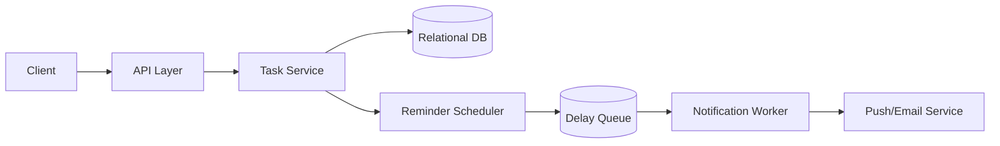

# Design a To-Do List Application with Reminders

## Blogs and websites

## Medium

## Youtube

## Theory

### Problem Statement

Design a to-do list application where users can create tasks, organize them into lists, set due dates, and receive reminders before a task is due.

### Functional Requirements

- Create/update/delete tasks and lists
- Mark tasks complete/incomplete
- Set a due date/time and an optional reminder offset
- Receive a reminder notification (push/email) before the due time

### Non-Functional Requirements

- **Scale**: Millions of users, each with a modest number of tasks; reminder delivery must be timely
- **Latency**: CRUD operations < 200ms
- **Reliability**: Reminders should not be missed even if a server restarts

### API Design

```
POST /lists                       { name }
POST /lists/{listId}/tasks        { title, dueAt, reminderOffsetMinutes }
PATCH /tasks/{taskId}             { completed, dueAt }
GET  /lists/{listId}/tasks
```

### Data Model

```
lists:  id (PK), user_id, name
tasks:  id (PK), list_id (FK), title, due_at, reminder_at, completed, created_at
```

### High-Level Architecture



### Key Design Points

- On task creation/update, compute `reminder_at = due_at - reminder_offset` and enqueue it in a delay queue (or a periodic poller that scans `tasks WHERE reminder_at <= now() AND not yet sent`).
- Make reminder delivery idempotent (track `reminder_sent` flag) so a worker crash/retry doesn't send duplicate notifications.
- Re-schedule/cancel the reminder job whenever `due_at` changes or the task is completed early.

### Trade-offs

- A simple periodic poller (scan for due reminders every minute) is easy to build and reason about but has coarser timing precision than a true delay queue; acceptable for a basic reminder feature.
