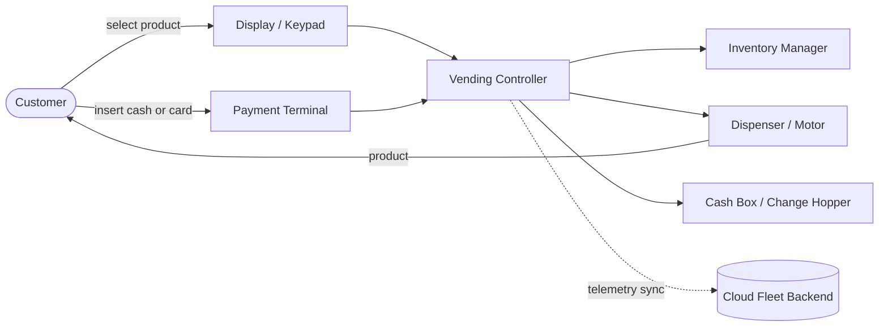
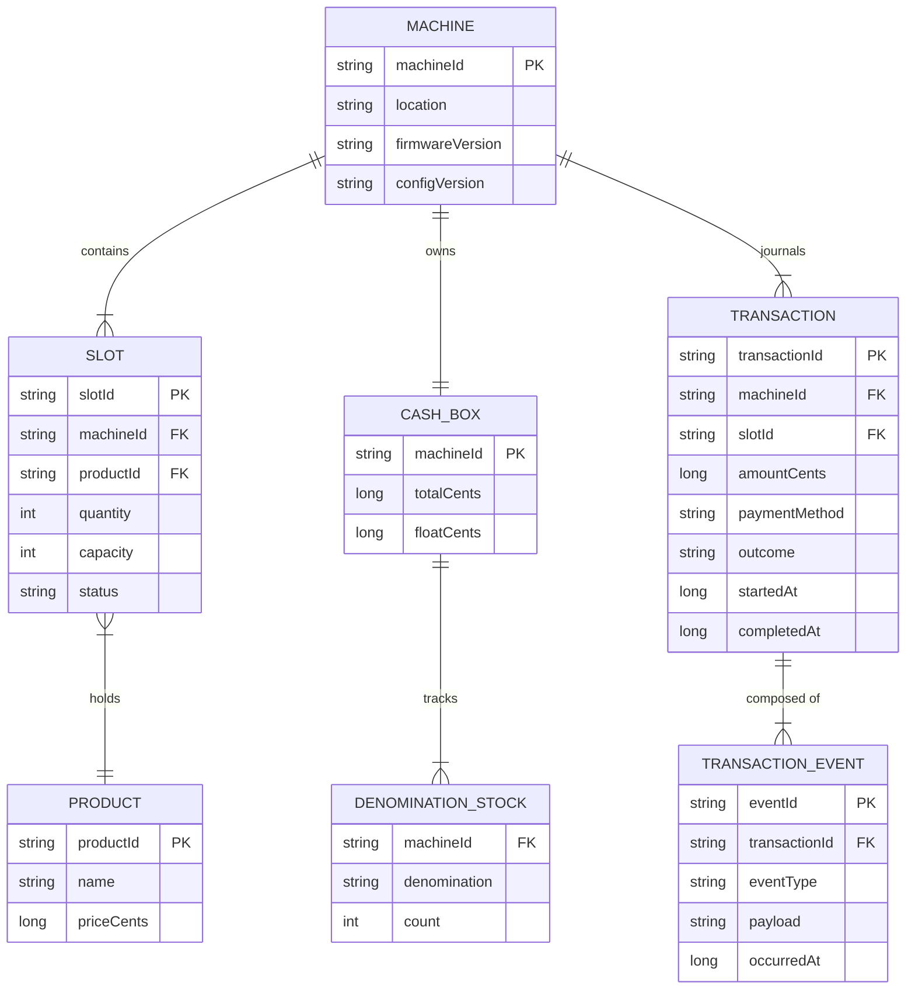
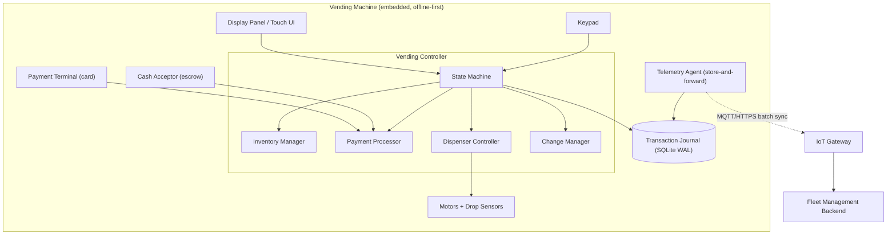
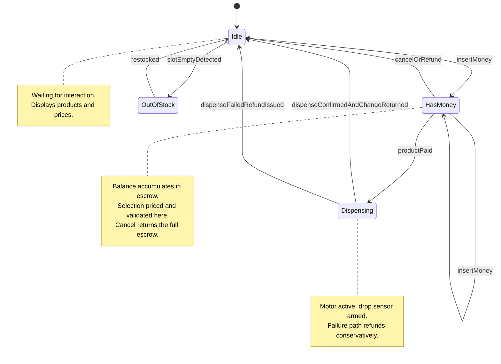
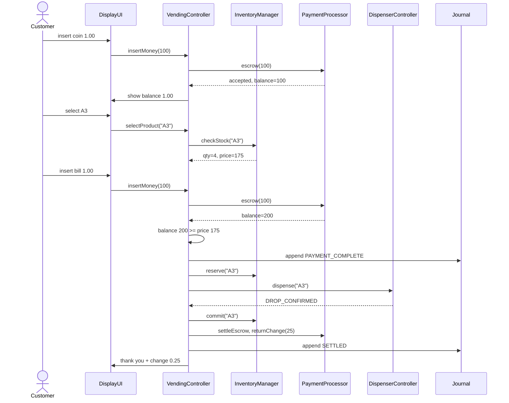
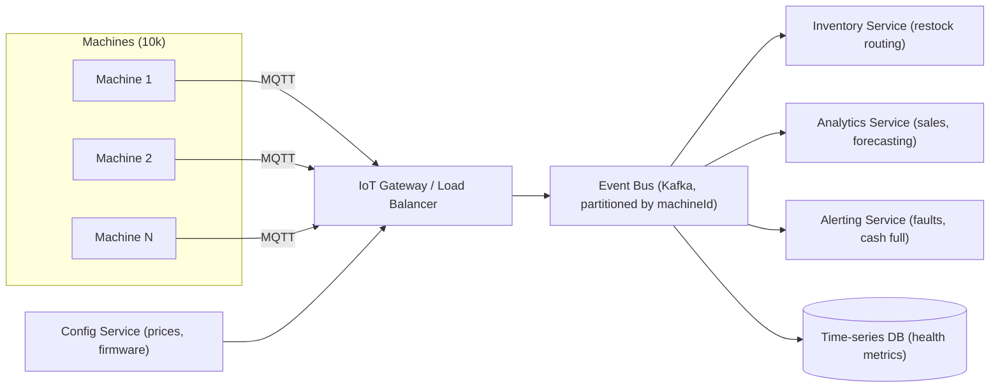

# Design Vending Machine

## Blogs and websites

## Medium

## Youtube

## Theory

### Topics Covered

1. [Introduction and Problem Statement](#introduction-and-problem-statement)
2. [Functional Requirements](#functional-requirements)
3. [Non-Functional Requirements](#non-functional-requirements)
4. [Characteristics](#characteristics)
5. [Components](#components)
6. [Design Patterns](#design-patterns)
7. [Benefits](#benefits)
8. [Pros](#pros)
9. [Cons](#cons)
10. [Challenges](#challenges)
11. [Best Practices](#best-practices)
12. [When to Use This Design](#when-to-use-this-design)
13. [Use Cases](#use-cases)
14. [Data Modeling](#data-modeling)
15. [High-Level Design](#high-level-design)
16. [Deep Dive: State Machine and Payment Flow](#deep-dive-state-machine-and-payment-flow)
17. [Concurrency and Correctness](#concurrency-and-correctness)
18. [Fleet Management: From One Machine to Thousands](#fleet-management-from-one-machine-to-thousands)
19. [Java and Spring Boot Implementation Guide](#java-and-spring-boot-implementation-guide)
20. [Interview Questions and Answers](#interview-questions-and-answers)

---

### Introduction and Problem Statement

Design a vending machine system that allows users to select products, make payments, and dispense items reliably. This is one of the most classic low-level design (LLD) / object-oriented design problems asked in interviews because it exercises almost every fundamental OOP skill in a small, well-bounded domain: modeling entities, encapsulating state, applying the State pattern, handling money safely, and reasoning about concurrency and failure.

The vending machine is a useful interview problem precisely because it is deceptively simple. A naive answer is "a map of slots plus a balance," but a senior answer covers:

- What happens when the motor fails after the user has paid (money vs product liability).
- How to model a machine that can only be in one of a small set of mutually exclusive states.
- How to give optimal change with a limited cash box.
- How one machine's design changes when it is one node in a fleet of ten thousand machines reporting telemetry to a cloud backend.

**What problem does it solve?**

A vending machine automates a retail transaction with no human cashier. It must behave like a tiny, extremely risk-averse store: it holds inventory, holds money, and must never lose either through software bugs. Every design decision is driven by the fact that the machine is unattended, so software is the only guarantee of correctness.

**Real-life use cases**

- **Snack and beverage machines** in offices, schools, and transit stations.
- **Ticket machines** for metro systems and parking garages (dispense tickets, accept cash and cards).
- **Automated retail kiosks**: electronics accessories at airports, cosmetics, pharmacy items.
- **Smart lockers / pickup stations**: the same state machine pattern appears in package lockers that "dispense" by opening a door.
- **Coffee machines** in offices: product selection, payment, and a dispensing step with mechanical failure modes.



The diagram shows the core loop: the customer interacts with the UI and payment terminal, the controller orchestrates inventory checks, payment, and dispensing, and the machine periodically synchronizes with a cloud backend for fleet monitoring. Everything inside the machine is an embedded, offline-first system; the cloud link is asynchronous and optional for a single transaction.

**Interview questions and answers (warm-up)**

- **Q: Why is the vending machine considered a low-level design problem rather than a high-level one?**
  **A:** Because the core of the problem is class design, state transitions, and in-process concurrency on a single machine. It becomes a high-level (distributed systems) problem only when you add fleet telemetry, remote monitoring, and payments at scale.

- **Q: What is the single most important correctness property?**
  **A:** Money and product conservation: the machine must never take money without either dispensing the product or refunding it, and never dispense without payment. Every state transition and every failure path is designed around this invariant.

- **Q: Why model the machine as a state machine instead of a sequence of if/else checks?**
  **A:** Because behavior like "accept coin" means completely different things in IDLE versus PAYMENT_PENDING versus DISPENSING. A state machine makes the valid transitions explicit, prevents impossible operations (dispensing while idle), and is directly testable.

---

### Functional Requirements

1. **Display products**: show available products with prices and current stock levels; clearly mark sold-out items.
2. **Product selection**: allow the user to select a product by slot code; reject invalid or out-of-stock selections with a clear message.
3. **Accept multiple payment methods**: coins and bills (with denomination validation), cards, and digital wallets (via a payment terminal).
4. **Validate payment**: accumulate inserted cash, reject counterfeit/unknown denominations, and detect when the inserted amount covers the price.
5. **Dispense the product**: only after successful payment; confirm dispensing via sensor feedback where available.
6. **Return change**: compute and return change for cash overpayment using available denominations in the cash box; support an "exact change only" degraded mode.
7. **Cancel and refund**: allow the user to cancel before dispensing and refund the full inserted amount.
8. **Handle dispensing failure**: if the mechanism fails, refund automatically and mark the slot as faulty.
9. **Admin / operator functions**: restock products, refill the cash box, collect revenue, view sales history, and configure prices — protected by authentication.
10. **Audit trail**: record every transaction (paid, dispensed, refunded, failed) for reconciliation.

### Non-Functional Requirements

1. **Reliability / safety**: never charge without dispensing or refunding immediately. The two-phase payment flow (authorize → dispense → capture) enforces this for card payments.
2. **Availability**: 99.9% uptime for the machine's core loop; critically, the machine must keep selling with cash even when the network is down (offline-first).
3. **Consistency**: inventory count and cash-box count must be accurate to the unit; a sale atomically decrements stock and increments cash held.
4. **Low latency**: a full transaction completes in under 2 seconds excluding the human time to insert money; card authorization has a bounded timeout with fallback.
5. **Durability**: transaction log survives power loss (write-ahead log on local storage), so a machine that loses power mid-transaction can recover deterministically.
6. **Security**: admin functions are authenticated; cash box contents are tracked; card data never touches the machine's own software (PCI scope stays in the certified terminal).
7. **Maintainability**: state transitions and pricing rules are configuration-driven, testable, and observable.
8. **Scalability (fleet level)**: the backend ingests telemetry from tens of thousands of machines with minimal operational cost per machine.

---

### Characteristics

- **Embedded, single-tenant device**
  What it means: one machine serves one physical user at a time, enforced by the physical world rather than by software locks alone. Why it matters: it dramatically simplifies concurrency — the "user session" is inherently serialized. How it works: a transaction context object is created on first interaction and owns the machine until completion or timeout. Example: if a second customer presses buttons mid-transaction, input is attributed to the active session, not rejected as an error.

- **Offline-first operation**
  What it means: the machine must complete cash transactions with zero network connectivity. Why it matters: basements, subway stations, and rural locations have unreliable links; revenue stops if the machine depends on the cloud. How it works: all critical state (inventory, cash box, prices) lives locally; only telemetry and card authorization need the network, and card payments degrade gracefully to "cash only" mode. Example: a machine in a parking garage keeps selling all day during an ISP outage and syncs its sales log when connectivity returns.

- **Hard real-world side effects**
  What it means: operations move physical motors and physical money, which can fail after the software thinks they succeeded. Why it matters: unlike a pure CRUD app, you cannot "roll back" a motor half-turn; you design for reconciliation instead. How it works: sensor feedback (product-drop sensor, motor encoders) confirms physical outcomes, and every ambiguous outcome generates an alert plus a refund. Example: a product drops but the sensor doesn't fire — the machine refunds conservatively and logs a sensor-fault event rather than double-dispensing.

- **Money-handling conservatism**
  What it means: on any ambiguity, the machine prefers to refund and alert rather than to keep money or guess. Why it matters: customer trust and legal exposure; keeping money for an undelivered product is far worse than losing one product. How it works: the state machine has explicit REFUND paths from every failure state. Example: if a card capture times out after authorization, the machine voids the authorization instead of retrying the charge blindly.

- **Bounded, enumerable state space**
  What it means: the machine is always in exactly one of a small set of named states. Why it matters: exhaustive testing is feasible — you can test every transition × every event. How it works: the State pattern (see below) gives each state its own class with explicit event handlers. Example: a test suite enumerates all (state, event) pairs and asserts the resulting state and side effects, achieving complete transition coverage.

- **Atomic local transactions**
  What it means: "decrement stock + increment cash + append transaction log" must succeed or fail together. Why it matters: a crash between decrementing stock and logging the sale corrupts reconciliation. How it works: a local embedded database (or append-only journal) with a transaction boundary around the commit point of the sale. Example: SQLite in WAL mode on the machine's controller stores inventory, cash counts, and a sales journal transactionally.

---

### Components

- **Display panel / Touch UI**
  Purpose: the customer-facing interface. Responsibilities: render products, prices, and stock status; show the running balance during payment; display errors and refund messages. How it works: a thin UI layer publishes user intents (SelectProduct, InsertMoney, Cancel) to the controller and renders state updates. Relationships: talks only to the vending controller, never to inventory or payment directly. Real-world example: the touchscreen on a modern airport electronics kiosk, or a simple 2-line LCD with a physical keypad on a legacy machine.

- **Payment terminal / Cash acceptor**
  Purpose: accepts and validates money. Responsibilities: validate coins and bills by denomination, escrow inserted cash (hold without committing to the cash box), drive the card reader for chip/contactless payments, eject refunds through the change hopper. How it works: hardware drivers emit validated "money received" events with denomination and amount; card payments go through a certified terminal that speaks to a payment gateway, so card numbers never enter machine software. Relationships: owned by the Payment Processor component. Real-world example: a MEI/Crane bill validator for cash plus a Verifone/Ingenico terminal for cards.

- **Vending controller (the state machine)**
  Purpose: the brain that orchestrates a transaction. Responsibilities: own the current state, route events to state handlers, enforce timeouts, coordinate payment, inventory, and dispensing, and guarantee the money/product conservation invariant. How it works: implements the State pattern — each state is a class handling events like `selectProduct`, `insertMoney`, `dispenseComplete`. Relationships: depends on Inventory Manager, Payment Processor, Dispenser Controller, and the transaction journal. Real-world example: the embedded Linux board (e.g., a Raspberry Pi-class SBC) running the vend application inside a modern smart vending machine.

- **Inventory manager**
  Purpose: source of truth for products and stock. Responsibilities: track quantity per slot, reserve stock during a transaction, decrement on dispense, flag empty/faulty slots. How it works: backed by local persistent storage; exposes atomic `reserve`/`commit`/`release` operations to the controller. Relationships: queried before payment, committed after dispense. Real-world example: the per-coil counters in a snack machine, augmented in modern machines by weight or optical sensors per shelf.

- **Dispenser controller**
  Purpose: drives the physical dispensing mechanism. Responsibilities: activate the correct motor/coil, wait for drop-sensor confirmation, report success/failure with a timeout. How it works: exposes a single async operation `dispense(slotId) -> DispenseResult`; internally handles motor retries (e.g., one extra coil turn) and sensor reads. Relationships: invoked only by the controller in the DISPENSING state. Real-world example: the spiral-coil motors in a snack machine, or the belt-and-elevator system in a machine selling fragile glass bottles.

- **Cash box / Change manager**
  Purpose: tracks physical money held by the machine. Responsibilities: maintain counts per denomination in escrow and in the box, compute optimal change, decide when change cannot be made (exact-change mode). How it works: a greedy change algorithm over available denominations, with the invariant that escrow + box equals total inserted plus float. Relationships: used by the payment processor; audited by the admin flow. Real-world example: a coin hopper with tubes for quarters/dimes/nickels that both stores and pays out change.

- **Transaction journal (local persistence)**
  Purpose: durable audit log. Responsibilities: record every transaction step with timestamps; enable crash recovery and reconciliation; feed telemetry sync. How it works: append-only writes, fsync'd at transaction commit points; replayed after power loss to resolve in-flight transactions. Relationships: written by the controller at every state transition. Real-world example: an SQLite journal or an append-only file on the machine's eMMC storage.

- **Telemetry / Fleet sync agent**
  Purpose: connects the machine to the cloud backend. Responsibilities: batch and upload sales, inventory, and health events; receive price/config updates; support remote commands (lock machine, refund a customer remotely). How it works: store-and-forward queue over MQTT or HTTPS with exponential backoff; at-least-once delivery with idempotent event IDs. Relationships: reads the journal; independent of the vend loop so sync failures never block sales. Real-world example: the cellular-connected telemetry module in Coca-Cola's Freestyle machines or Cantaloupe's ePort devices.

- **Admin / service interface**
  Purpose: operator functions. Responsibilities: restock, refill cash float, collect revenue, run diagnostics, update prices. How it works: a separate authenticated entry point (physical key + PIN, or a service app over local Bluetooth) that opens a service session distinct from the vend state machine. Relationships: manipulates inventory and cash box directly, with every action journaled. Real-world example: the route driver's service mode on a snack machine that reconciles cash collected against the sales journal.

---

### Design Patterns

- **State pattern (the heart of the design)**
  What it is: an object changes its behavior when its internal state changes; each state is a class implementing a common interface. Problem solved: without it, every method (`insertCoin`, `selectProduct`, `dispense`) becomes a switch over the current state, duplicated across methods, and new states require touching every switch. How it works: `VendingMachineContext` holds a `VendingState` reference and delegates every event to it; states transition by calling `context.setState(...)`. When to use: whenever an object has a small set of mutually exclusive modes with different behavior per event — vending machines, order lifecycles, connection protocols. When not to use: when "state" has only two trivial values or when behavior differs only in data, not in logic (a strategy or a flag is simpler). Advantages: explicit transitions, single-responsibility state classes, exhaustive testability. Disadvantages: class proliferation; transitions are spread across state classes, so a transition table in documentation is essential. Real-world example: `java.util.concurrent.Executor` lifecycles, TCP connection states, and virtually every game character AI use the same pattern.

- **Strategy pattern (payment methods and pricing)**
  What it is: a family of interchangeable algorithms behind one interface. Problem solved: cash, card, and wallet payments share a contract (authorize / capture / refund) but have wildly different implementations; pricing may vary (happy hour, promotions). How it works: `PaymentStrategy` with `CashPayment`, `CardPayment`, `WalletPayment` implementations selected at runtime from configuration. When to use: multiple payment rails, multiple change algorithms, or promotional pricing. When not to use: when there is exactly one implementation and no roadmap for more. Advantages: new payment methods are additive (open/closed). Disadvantages: indirection; each strategy must be tested against the same contract (use contract tests). Real-world example: Spring's `ResourceLoader`, Jackson's `JsonSerializer` lookups, and Stripe's unified payment-method API.

- **Observer pattern (telemetry and UI updates)**
  What it is: subjects notify registered observers of events. Problem solved: the vend loop should not know about telemetry, logging, or UI rendering — they are side concerns. How it works: the controller publishes domain events (`TransactionCompleted`, `DispenseFailed`) to listeners such as the telemetry agent and the display. When to use: decoupled side effects, audit logging, UI refresh. When not to use: when the side effect is part of the correctness invariant (e.g., journal writes) — those should be synchronous and transactional, not observational. Advantages: clean separation, easy to add listeners. Disadvantages: ordering and error handling are implicit; a failing listener must not break the core loop. Real-world example: Spring's `ApplicationEventPublisher`, GUI event buses.

- **Command pattern (admin operations)**
  What it is: encapsulate a request as an object. Problem solved: restock, cash-collection, and price-update operations need logging, authorization, and undo semantics. How it works: each admin action is a `Command` with `execute()` and a journaled payload. When to use: auditable, permissioned operations; remote commands from the fleet backend. When not to use: simple setters with no audit needs. Advantages: uniform logging/auth pipeline; commands can be queued and retried. Disadvantages: boilerplate per operation. Real-world example: job queues, IDE undo systems, smart-home command remotes.

- **Singleton / single-instance enforcement (hardware accessors)**
  What it is: exactly one instance controls a hardware resource. Problem solved: two threads opening the same serial port or stepping the same motor causes hardware corruption. How it works: in Spring Boot this is natural — hardware drivers are singleton-scoped beans with internal locking. When to use: hardware ports, the cash escrow, the dispenser. When not to use: stateless services (unnecessary restriction) or as a global variable dumping ground. Advantages: safe serialization of hardware access. Disadvantages: hidden coupling and harder testing if implemented as static singletons — prefer Spring-managed singletons with constructor injection. Real-world example: device drivers, connection pools.

- **Template method (transaction flow)**
  What it is: a skeleton algorithm with overridable steps. Problem solved: every vend transaction has the same skeleton — select → pay → dispense → settle — but card vs cash differ in the pay/settle steps. How it works: an abstract `VendTransaction` defines the flow; subclasses override `authorizePayment` and `settle`. When to use: fixed flow with variable steps. When not to use: when the flow itself varies (compose strategies instead). Advantages: invariant steps live in one place. Disadvantages: inheritance fragility; modern Java often favors composition (a pipeline of functions) over template methods.

---

### Benefits

- **Guaranteed correctness through explicit states**: because every event is handled per-state, impossible operations (dispensing without payment) are unrepresentable rather than merely guarded. This converts a class of runtime bugs into compiler-checked structure, which is exactly what you want when money and physical goods are at stake.
- **Offline revenue continuity**: the offline-first design means the machine earns money regardless of network health, and the store-and-forward telemetry queue guarantees no sales data is lost. In interviews, calling out degraded modes (cash-only when the gateway is unreachable, exact-change-only when the hopper is low) signals production maturity.
- **Testability**: the state machine can be unit-tested exhaustively (states × events), and hardware is hidden behind interfaces, so the entire transaction logic runs in CI with mocked dispensers. A full integration test can simulate a purchase end-to-end without any hardware.
- **Auditability and reconciliation**: the append-only journal gives a complete, replayable history, which makes cash-collection reconciliation (cash in box vs recorded sales) a trivial report instead of a forensic exercise.
- **Extensibility**: new payment methods, new promotions, and new telemetry listeners are additive changes behind stable interfaces, so the design survives real product evolution.

### Pros

- **Small, well-bounded domain**: the whole problem fits in a dozen classes, which makes it an ideal interview and teaching vehicle.
- **Demonstrates multiple patterns naturally**: State, Strategy, and Observer each solve a real problem here rather than being forced in for show.
- **Clear invariants**: money/product conservation gives an objective correctness criterion that is easy to state, test, and discuss in an interview.
- **Graceful degradation is built in**: the design has honest, well-defined degraded modes instead of pretending the network and hardware never fail.
- **Scales conceptually**: the same core model extends from one machine to a fleet without redesigning the vend loop — only the telemetry and management layers change.

### Cons

- **State class proliferation**: with many states and events, the number of small classes grows; without a documented transition table, the design becomes hard to navigate.
- **Hardware abstraction is unavoidable but costly**: drivers, sensor noise, and mechanical retries add real complexity that a pure-software design never faces.
- **Conservative refunds cost money**: preferring refund-and-alert on ambiguity means occasionally refunding a customer who did receive a product — a deliberate, but real, revenue leak.
- **Local persistence adds operational burden**: journaling, fsync policy, and storage wear (eMMC/SD cards) become maintenance concerns at fleet scale.
- **The two-phase payment flow adds latency**: authorize → dispense → capture is safer but slower than a single charge, and requires careful timeout handling at each phase.

---

### Challenges

- **Partial mechanical failures**: a motor can half-dispense; a sensor can miss a real drop. The design must define, per failure, whether to retry, refund, or alert — and must reconcile against physical reality (weight sensors, drop sensors) rather than trusting the motor driver.
- **Change-making with a limited float**: optimal change is a greedy algorithm only for canonical coin systems; with limited denominations the machine must detect *before* accepting more money that it cannot make change, and switch to exact-change mode or reject large bills.
- **Power loss mid-transaction**: the machine can lose power at any point — including between dispensing and settling payment. The journal must record intent before action ("write-ahead"), and on boot the recovery routine must reconcile any in-flight transaction conservatively (refund/void when in doubt).
- **Card payment PCI scope**: any software touching card data falls under PCI-DSS. The standard answer is to keep the machine out of scope: the certified terminal handles the card, and machine software only sees opaque authorization tokens and amounts.
- **Concurrency between vend loop, telemetry, and admin**: three actors (customer session, sync agent, service technician) touch shared state (inventory, cash box). All mutations must go through the controller or be serialized on a single-threaded event loop to avoid lost updates.
- **Fleet-scale telemetry cost**: ten thousand machines sending an event per sale is cheap; sending per-second health metrics is not. Batching, compression, and sampling decisions belong in the design, not as afterthoughts.

---

### Best Practices

- **Model money as integer minor units**: store all amounts as `long` cents (or `BigDecimal` where required) and never as `float`/`double`. A $1.75 product is `175` cents. This eliminates an entire class of rounding bugs in change calculation and reconciliation.
- **Authorize → dispense → capture, always**: never capture a card payment before the product is physically confirmed dispensed. If dispensing fails, void the authorization. This ordering is the difference between a refund ticket and a chargeback.
- **Write-ahead journaling for physical actions**: record the intent to dispense before powering the motor, and the outcome after the sensor reads. On boot, replay the journal and resolve any transaction whose outcome is unknown.
- **Escrow before commitment**: keep inserted cash in escrow (physically in the acceptor's escrow position) until the transaction commits, so a cancel is a mechanical "return escrow" instead of a recomputed refund.
- **Single-threaded event loop for the controller**: process all events (UI, payment, sensors, admin, telemetry-received commands) on one serialized queue. This removes data races by construction and makes the state machine deterministic.
- **Fail conservative**: any ambiguous outcome resolves in the customer's favor (refund/void) plus an operator alert. Encode this as a policy function so it is applied uniformly.
- **Make timeouts explicit and per-state**: payment pending has a 60-second timeout; card authorization has a shorter gateway timeout; dispensing has a motor timeout with one mechanical retry. Unbounded waits are how machines get stuck for hours.
- **Separate the service session from the vend session**: admin operations run in a distinct mode that blocks vending, with every action journaled and authenticated — never let service shortcuts bypass the invariant checks.
- **Design the fleet protocol idempotently**: telemetry events carry stable event IDs so the backend can deduplicate retries; config updates carry version numbers so machines apply them in order.

---

### When to Use This Design

- **Use the full state-machine design** when the problem involves money, physical actuation, or any domain where "impossible" operations must be structurally prevented: vending, ticketing, ATMs, lockers, kiosks.
- **Use a simplified version** (states as an enum with a transition table, no per-state classes) when the state space is very small and the team values compactness over extensibility — for example, a demo or a toy problem in a take-home.
- **Extend to the fleet architecture** when more than a handful of machines exist: the incremental cost of telemetry ingestion is small, and the operational value (restock routing, fault alerts, cash-forecasting) is enormous.
- **Do not use this pattern** for problems that are pure CRUD or pure streaming: the ceremony of explicit states buys nothing when there are no mutually exclusive modes or physical side effects.
- **Interview guidance**: if the interviewer asks for "a vending machine," deliver the LLD design first (classes, state machine, money handling), then proactively ask whether they want the distributed/fleet angle — that question alone signals senior-level judgment.

---

### Use Cases

- **Scenario 1: Office snack machine (single unit, cash + card)**
  Problem: a 200-person office wants an unattended snack machine with cards and cash. Solution: the full state-machine design with a card terminal, escrow cash acceptor, and nightly telemetry sync over office Wi-Fi. Suitability: perfect fit — offline-first matters little here, but the payment invariant matters a lot. Trade-offs: the card terminal adds ~$300 hardware cost and a payment-gateway dependency with its own outage mode (cash-only fallback).

- **Scenario 2: Metro ticket machines (fleet, cash-heavy, high reliability)**
  Problem: a transit authority runs 500 ticket machines that must survive network partitions and vandalism, with strict cash reconciliation. Solution: hardened single-machine design plus a fleet backend; write-ahead journal with tamper-evident storage; exact-change fallback during cash-box depletion. Suitability: the design's journaling and conservative-refund policy directly satisfy audit requirements. Trade-offs: conservative refunds mean occasionally voiding a ticket sale on sensor ambiguity — acceptable given fare-evasion and audit constraints.

- **Scenario 3: Airport electronics kiosk (high-value items, card-only)**
  Problem: selling $50–$300 headphones unattended. Solution: card-only payments (no cash box to rob or reconcile), elevator-style dispensing with dual sensors, camera-verified drop, and immediate void-on-failure. Suitability: removing cash simplifies the money side enormously and removes change-making entirely. Trade-offs: card-only excludes some customers and makes the payment gateway a hard dependency, so an aggressive authorization-timeout and clear error UX are required.

- **Scenario 4: Smart parcel lockers (dispensing = door unlock)**
  Problem: a courier locker bank must "dispense" by opening the correct door exactly once per valid code. Solution: the identical state machine — IDLE → CODE_VERIFIED → PAYMENT_PENDING (for COD) → UNLOCKING → IDLE — with door-ajar sensors as the drop-sensor equivalent. Suitability: demonstrates the pattern's reusability across domains. Trade-offs: "dispense failure" (door didn't open) has a human recovery path (courier call-out), so the refund policy can be less conservative.

- **Scenario 5: Coffee machine with peripherals**
  Problem: a bean-to-cup machine with a grinder, brewer, and milk system — dispensing is a multi-step recipe, not a single motor. Solution: the DISPENSING state becomes a sub-state-machine (GRINDING → BREWING → MILK → DONE), with per-step sensors and per-step failure refunds. Suitability: shows the pattern composes hierarchically. Trade-offs: longer dispensing time increases the window for power loss, so the journal must checkpoint each sub-step.

---

### Data Modeling

The entity model is deliberately small: the machine owns slots, slots reference products, the cash box tracks denominations, and every customer interaction becomes a journaled transaction. Keeping inventory and cash as first-class entities (not loose fields on the machine) is what makes reconciliation and audit possible.



**Explanation.** `SLOT` carries both `quantity` and `capacity` so restock logic and "percentage empty" telemetry are trivial. `DENOMINATION_STOCK` is what enables the change algorithm to know *before* accepting a $20 bill whether change is possible. `TRANSACTION`/`TRANSACTION_EVENT` form the write-ahead journal: a transaction row is created at start, and events (PRODUCT_SELECTED, PAYMENT_AUTHORIZED, DISPENSE_CONFIRMED, SETTLED, REFUNDED) are appended as the state machine advances — recovery after power loss replays the latest event to decide how to resolve the transaction.

---

### High-Level Design



**Explanation.** Everything the customer touches is a peripheral that only emits events into the controller; the controller's state machine is the single writer to inventory, cash, and the journal, which eliminates data races by construction. The telemetry agent is a *reader* of the journal — this is the key decoupling decision: sync can fail, retry, or be disabled entirely without ever affecting a sale. The cloud side only receives batched, idempotent events.

### State Machine Design

The machine is always in exactly one state. The classic interview states are **Idle, HasMoney, Dispensing, and OutOfStock**; in production we add explicit payment-processing, cancel/refund, and failure states, but the core four remain the skeleton.



**Explanation.** Three transitions carry the entire correctness story. `productPaid` fires only when `balance >= price` and the slot is non-empty, so payment-before-dispense is structural. `dispenseConfirmedAndChangeReturned` is the commit point: stock is decremented, escrow moves to the cash box, change is paid out, and the journal records SETTLED — atomically. `dispenseFailedRefundIssued` is the conservative failure path: refund the full amount, flag the slot faulty, and alert. Note that OutOfStock is entered from Idle (a sensor or restock event) rather than mid-transaction — mid-transaction stock loss is handled inside Dispensing's failure path instead, which keeps the diagram and the code honest.

### Purchase Sequence



**Explanation.** Notice the ordering discipline: the journal is written *before* the motor runs (write-ahead), stock is *reserved* before dispensing and *committed* after sensor confirmation, and change is computed only at settlement when the final paid amount is known. If power dies after `PAYMENT_COMPLETE` but before `SETTLED`, boot recovery sees a paid-but-unsettled transaction and resolves it conservatively (refund on next service, or auto-redispense if the slot sensor shows no drop).

---

### Deep Dive: State Machine and Payment Flow

**Why escrow matters.** Cash machines physically hold inserted money in an "escrow" position inside the acceptor — it has not entered the cash box yet. This makes cancel trivial (return escrow) and settlement atomic (escrow → box). Modeling this in software (`escrowCents` vs `cashBoxCents`) prevents the classic bug where a cancel refund is computed from the box and pays out wrong denominations.

**Change algorithm.** With canonical denominations (1, 5, 10, 25, 100…), a greedy largest-first algorithm is optimal. The catch is *availability*: the hopper may have zero quarters. So the algorithm is "greedy over available stock," and if it cannot reach zero remainder, the machine must either refuse the sale ("exact change only") before accepting more money, or offer the customer a choice. Checking change feasibility **before** the customer overpays is a detail that separates senior answers from junior ones.

**Card payments: two-phase.** Card flow is `authorize(amount)` → dispense → `capture(authId)`; failure at dispense means `void(authId)`. Authorization holds funds without charging; capture finalizes. Timeouts: authorization ~5s gateway timeout, capture is retried in the background with the journal as the retry queue — capture failure after confirmed dispense is recorded as a loss event, never a re-charge attempt.

**Transaction timeout.** Every state except Idle and OutOfStock carries a timeout (typically 60s for payment pending). Expiry triggers the cancel path: refund escrow, reset UI. Without this, an abandoned transaction bricks the machine for the next customer.

### Concurrency and Correctness

- **Single machine**: one physical user at a time, but multiple event producers (UI thread, payment callbacks, sensor interrupts, admin session, telemetry). The standard solution is a single-threaded event loop: all events go into one blocking queue, and the state machine processes them serially. This removes locks from the domain logic entirely — inventory and cash mutations are single-writer by construction. Hardware drivers keep their own internal locks.
- **What can still race**: sensor interrupts during dispensing vs the dispense timeout — resolved by making the sensor callback just another event on the queue, with the timeout event carrying a generation counter so a late timeout after success is ignored.
- **Fleet level**: concurrency moves to the backend — thousands of machines publishing telemetry concurrently. There the answer is boring on purpose: partitioned ingestion (Kafka/Kinesis by machineId), idempotent consumers (event IDs), and per-machine ordering guarantees.

---

### Fleet Management: From One Machine to Thousands

When the interviewer says "now you have 10,000 machines," the problem changes character completely. Nothing about the vend loop changes — but telemetry ingestion, remote monitoring, and configuration management become the actual design.



**Explanation.** Machines publish journaled events with stable IDs over MQTT with QoS 1 (at-least-once); the bus is partitioned by machineId so each machine's event order is preserved; consumers are idempotent. Key backend concerns:

- **Telemetry ingestion**: batch at the edge (the telemetry agent sends every N minutes or when the journal reaches a threshold), compress, and sample high-frequency health metrics. 10k machines × 1 sale/minute is trivial; 10k machines × 1 metric/second needs real capacity planning.
- **Remote monitoring**: per-machine dashboards (stock levels, cash-box fullness, fault flags) drive *restock routing* — the highest-value fleet feature. Route optimization (which machines to visit, in what order, with what stock) is its own optimization problem built on the inventory service's data.
- **Remote commands and config**: price changes and firmware rollouts flow the other way, versioned, with machines applying config only at transaction boundaries (never mid-sale) and rolling back on health-check failure.
- **Alerting**: `DISPENSE_FAILED`, `CASH_BOX_FULL`, `SENSOR_FAULT` events page the operator; per-machine error budgets prevent alert storms when a whole region loses connectivity.

**What does NOT change**: the vend state machine, the money invariant, and offline-first operation. A fleet outage must never stop a machine from selling — the queue just grows.

---

### Java and Spring Boot Implementation Guide

The implementation below uses Spring Boot 3 / Java 17: the orchestrating logic lives in `@Service` beans with constructor injection, money is `long` cents, DTOs are records, and external values come from `@Value`. Domain classes (states, slot, cash box) are plain objects — but they are *created and wired by* beans, never by static singletons.

**Domain: money and catalog**

```java
public record Product(String productId, String name, long priceCents) {}

public record Slot(String slotId, Product product, int quantity, int capacity, SlotStatus status) {
    public Slot {
        if (quantity < 0 || quantity > capacity) {
            throw new IllegalArgumentException("quantity out of range");
        }
    }
    public Slot decrement() {
        return new Slot(slotId, product, quantity - 1, capacity, status);
    }
    public boolean available() {
        return status == SlotStatus.OK && quantity > 0;
    }
}

public enum SlotStatus { OK, FAULTY }
```

**Domain: the State pattern.** Each state handles events; impossible operations throw `IllegalVendOperation`, which the controller maps to a user-facing "not allowed now" message.

```java
public sealed interface VendingState
        permits IdleState, HasMoneyState, DispensingState, OutOfStockState {

    default VendingState insertMoney(VendContext ctx, long cents) {
        throw new IllegalVendOperation("Cannot accept money in " + name());
    }
    default VendingState selectProduct(VendContext ctx, String slotId) {
        throw new IllegalVendOperation("Cannot select product in " + name());
    }
    default VendingState cancel(VendContext ctx) {
        throw new IllegalVendOperation("Nothing to cancel in " + name());
    }
    default VendingState dispenseOutcome(VendContext ctx, DispenseResult result) {
        throw new IllegalVendOperation("No dispense in progress in " + name());
    }
    String name();
}
```

```java
public final class IdleState implements VendingState {
    @Override
    public VendingState insertMoney(VendContext ctx, long cents) {
        ctx.payment().escrow(cents);
        return new HasMoneyState();
    }
    @Override
    public VendingState selectProduct(VendContext ctx, String slotId) {
        // Selecting with zero balance just previews price/availability.
        Slot slot = ctx.inventory().slot(slotId); // throws if unknown
        ctx.display().showPrice(slot);
        return this;
    }
    @Override
    public String name() { return "IDLE"; }
}
```

```java
public final class HasMoneyState implements VendingState {
    @Override
    public VendingState insertMoney(VendContext ctx, long cents) {
        ctx.payment().escrow(cents);
        return this;
    }
    @Override
    public VendingState selectProduct(VendContext ctx, String slotId) {
        Slot slot = ctx.inventory().slot(slotId);
        if (!slot.available()) {
            ctx.display().showUnavailable(slot);
            return this;
        }
        long balance = ctx.payment().escrowBalance();
        if (balance < slot.product().priceCents()) {
            ctx.display().showInsufficientFunds(slot, balance);
            return this;
        }
        ctx.journal().append(ctx.txId(), "PAYMENT_COMPLETE", balance);
        ctx.inventory().reserve(slotId);
        ctx.dispenser().dispenseAsync(slotId, ctx.txId()); // result arrives as event
        return new DispensingState(slotId, balance);
    }
    @Override
    public VendingState cancel(VendContext ctx) {
        ctx.payment().refundEscrow();
        ctx.journal().append(ctx.txId(), "CANCELLED_REFUNDED", 0L);
        return new IdleState();
    }
    @Override
    public String name() { return "HAS_MONEY"; }
}
```

```java
public record DispensingState(String slotId, long paidCents) implements VendingState {
    @Override
    public VendingState dispenseOutcome(VendContext ctx, DispenseResult result) {
        if (result == DispenseResult.DROP_CONFIRMED) {
            ctx.inventory().commit(slotId);
            long change = paidCents - ctx.inventory().slot(slotId).product().priceCents();
            ctx.payment().settleEscrow();
            if (change > 0) ctx.payment().returnChange(change);
            ctx.journal().append(ctx.txId(), "SETTLED", paidCents);
        } else {
            ctx.inventory().release(slotId);
            ctx.payment().refundEscrow();
            ctx.inventory().flagFaulty(slotId);
            ctx.journal().append(ctx.txId(), "DISPENSE_FAILED_REFUNDED", paidCents);
            ctx.alerts().raise("DISPENSE_FAILED", slotId);
        }
        return new IdleState();
    }
    @Override
    public String name() { return "DISPENSING"; }
}
```

**The orchestrating service bean.** All events enter through one serialized queue — the state machine itself is never touched concurrently.

```java
@Service
public class VendingMachineService {

    private final InventoryManager inventory;
    private final PaymentPort payment;
    private final DispenserPort dispenser;
    private final JournalStore journal;
    private final ApplicationEventPublisher events;
    private final BlockingQueue<VendEvent> queue = new LinkedBlockingQueue<>();
    private final long transactionTimeoutMs;

    private volatile VendingState state = new IdleState();
    private volatile UUID txId;

    public VendingMachineService(
            InventoryManager inventory,
            PaymentPort payment,
            DispenserPort dispenser,
            JournalStore journal,
            ApplicationEventPublisher events,
            @Value("${vending.transaction-timeout-ms:60000}") long transactionTimeoutMs) {
        this.inventory = inventory;
        this.payment = payment;
        this.dispenser = dispenser;
        this.journal = journal;
        this.events = events;
        this.transactionTimeoutMs = transactionTimeoutMs;
    }

    @PostConstruct
    void startEventLoop() {
        Thread loop = Thread.ofVirtual().name("vend-event-loop").unstarted(() -> {
            while (!Thread.currentThread().isInterrupted()) {
                try {
                    process(queue.take());
                } catch (InterruptedException e) {
                    Thread.currentThread().interrupt();
                }
            }
        });
        loop.start();
    }

    public void onMoneyInserted(long cents) {
        enqueue(new VendEvent.InsertMoney(cents));
    }

    public void onProductSelected(String slotId) {
        enqueue(new VendEvent.SelectProduct(slotId));
    }

    public void onCancel() {
        enqueue(new VendEvent.Cancel());
    }

    public void onDispenseOutcome(UUID tx, DispenseResult result) {
        enqueue(new VendEvent.DispenseOutcome(tx, result));
    }

    private void enqueue(VendEvent e) {
        queue.offer(e); // unbounded queue; in production use capacity + metrics
    }

    private void process(VendEvent e) {
        if (txId == null && e instanceof VendEvent.InsertMoney) {
            txId = UUID.randomUUID();
            journal.open(txId);
            scheduleTimeout(txId, transactionTimeoutMs);
        }
        state = switch (e) {
            case VendEvent.InsertMoney m   -> state.insertMoney(ctx(), m.cents());
            case VendEvent.SelectProduct s -> state.selectProduct(ctx(), s.slotId());
            case VendEvent.Cancel c        -> state.cancel(ctx());
            case VendEvent.DispenseOutcome d when d.tx().equals(txId)
                                            -> state.dispenseOutcome(ctx(), d.result());
            default                        -> state; // stale event for old tx: ignore
        };
        events.publishEvent(new VendStateChanged(txId, state.name()));
        if (state instanceof IdleState && !(e instanceof VendEvent.InsertMoney)) {
            txId = null; // transaction finished; next insertion opens a new one
        }
    }

    private VendContext ctx() {
        return new VendContext(txId, inventory, payment, dispenser, journal, display(), alerts());
    }
}
```

**Inventory with atomic reserve/commit.** In this single-writer design the methods are called only from the event loop, but they are still transactional at the store level for crash safety.

```java
@Service
public class InventoryManager {

    private final SlotRepository slots;

    public InventoryManager(SlotRepository slots) {
        this.slots = slots;
    }

    public Slot slot(String slotId) {
        return slots.findById(slotId)
                .orElseThrow(() -> new UnknownSlotException(slotId));
    }

    @Transactional
    public void reserve(String slotId) {
        int updated = slots.decrementIfAvailable(slotId);
        if (updated == 0) throw new OutOfStockException(slotId);
    }

    @Transactional
    public void commit(String slotId) {
        // Reservation already decremented; commit records the sale row.
        slots.markSold(slotId);
    }

    @Transactional
    public void release(String slotId) {
        slots.increment(slotId); // give the reserved unit back
    }

    @Transactional
    public void flagFaulty(String slotId) {
        slots.updateStatus(slotId, SlotStatus.FAULTY);
    }
}
```

**Change manager with availability-aware greedy algorithm.**

```java
@Component
public class ChangeManager {

    private final CashBoxStore cashBox;

    public ChangeManager(CashBoxStore cashBox) {
        this.cashBox = cashBox;
    }

    /** Returns denomination -> count to pay out, or empty if change cannot be made. */
    public Optional<Map<Denomination, Integer>> planChange(long changeCents) {
        Map<Denomination, Integer> plan = new EnumMap<>(Denomination.class);
        long remaining = changeCents;
        for (Denomination d : Denomination.descendingByValue()) {
            int available = cashBox.count(d);
            int needed = (int) Math.min(available, remaining / d.cents());
            if (needed > 0) {
                plan.put(d, needed);
                remaining -= (long) needed * d.cents();
            }
        }
        return remaining == 0 ? Optional.of(plan) : Optional.empty();
    }

    public boolean canAcceptBill(long billCents, long priceCents) {
        // Senior detail: check change feasibility BEFORE accepting the bill.
        return planChange(billCents - priceCents).isPresent();
    }
}
```

**REST facade (thin — all real work goes through the event queue).**

```java
@RestController
@RequestMapping("/api/v1/machine")
public class VendingMachineController {

    private final VendingMachineService machine;

    public VendingMachineController(VendingMachineService machine) {
        this.machine = machine;
    }

    public record InsertMoneyRequest(@Positive long cents) {}
    public record SelectProductRequest(@NotBlank String slotId) {}
    public record MachineStatusResponse(String state, long balanceCents) {}

    @PostMapping("/money")
    public ResponseEntity<Void> insertMoney(@Valid @RequestBody InsertMoneyRequest req) {
        machine.onMoneyInserted(req.cents());
        return ResponseEntity.accepted().build();
    }

    @PostMapping("/selection")
    public ResponseEntity<Void> select(@Valid @RequestBody SelectProductRequest req) {
        machine.onProductSelected(req.slotId());
        return ResponseEntity.accepted().build();
    }

    @PostMapping("/cancel")
    public ResponseEntity<Void> cancel() {
        machine.onCancel();
        return ResponseEntity.accepted().build();
    }
}
```

**Why this shape?** The `@Service` owns the lifecycle (event loop, timeouts, transaction id); states are small pure-ish classes that are trivially unit-testable by passing a mocked `VendContext`; hardware lives behind `PaymentPort`/`DispenserPort` interfaces so the entire purchase flow runs in CI; and every value that an operator might tune (timeouts, float levels) is externalized via `@Value` instead of being compiled in.

---

### Interview Questions and Answers

**Q1. How would you design a vending machine? Walk me through your approach.**
A: Start by pinning down scope with the interviewer: single machine vs fleet, cash-only vs cards, hardware abstraction level. Then: (1) enumerate requirements and the money-conservation invariant; (2) draw the state machine — Idle, HasMoney, Dispensing, OutOfStock — and the transition table; (3) model entities (Machine, Slot, Product, CashBox, Transaction journal); (4) define components and their interfaces (inventory reserve/commit, payment escrow/settle/refund, dispenser with sensor feedback); (5) walk the happy path and then every failure path (cancel, dispense failure, power loss, no change); (6) only then write classes. Follow-up: "what do you code first?" — the state machine and its tests, because everything else hangs off it. Common mistake: jumping to classes before the state diagram, which produces if/else spaghetti.

**Q2. Why the State pattern instead of an enum with a switch?**
A: An enum-with-switch centralizes every transition in one giant method per event; adding a state means editing every switch, and the compiler cannot help you find them all. The State pattern gives each state one class with a uniform event interface, so behavior-per-state is explicit and unit-testable in isolation. The honest trade-off: the transition *table* is no longer in one place, so you must document it (the stateDiagram serves this purpose). For a 2–3 state toy, the enum is fine; for money-handling with 5+ states and failure paths, the pattern pays for itself. Follow-up: "what about sealed interfaces?" — Java 17 sealed types give you the best of both: exhaustive switches the compiler verifies, with per-state classes.

**Q3. How do you guarantee the machine never takes money without dispensing?**
A: Four mechanisms layered: (1) escrow — cash is physically held uncommitted until the transaction commits, so cancel/refund is mechanical; (2) two-phase card payments — authorize before dispense, capture only after drop-sensor confirmation, void on any failure; (3) write-ahead journal — intent to dispense is persisted before the motor runs, so power loss is recoverable by replay; (4) a conservative resolution policy — any ambiguous outcome refunds the customer and alerts the operator. Trade-off to mention: capture-after-dispense means a small percentage of confirmed dispenses fail capture and are recorded as losses — cheaper than chargebacks.

**Q4. How does change-making work, and what are the edge cases?**
A: Model the cash box as counts per denomination, all amounts in integer cents. Greedy largest-first is optimal for canonical coin systems (US, EUR). Edge cases: (1) depleted denominations — the algorithm must be availability-aware and detect failure, in which case the machine refuses large bills *before* accepting them or enters exact-change mode; (2) non-canonical denomination sets where greedy is suboptimal — use DP if the currency requires it; (3) concurrent restock changing counts mid-transaction — impossible in the single-writer design. Common mistake: using double for money and producing $0.999999 change.

**Q5. How do you handle concurrency?**
A: Distinguish the levels. On one machine: a single-threaded event loop serializes all events (UI, payment callbacks, sensors, admin), making the domain logic lock-free; only hardware drivers lock internally. Sensor interrupts are funneled onto the same queue, and timeouts carry a transaction generation to ignore stale firings. Across a fleet: concurrency is a backend problem — partitioned event bus, idempotent consumers, per-machine ordering. Common mistake: sprinkling `synchronized` across state classes, which both serializes the wrong thing and still leaves the payment-callback path racy.

**Q6. What happens on power loss mid-transaction?**
A: The journal is write-ahead: `PAYMENT_COMPLETE` is fsync'd before the motor is powered. On boot, recovery reads the last open transaction: if it settled cleanly, nothing to do; if payment completed but no drop was confirmed, resolve conservatively — check the drop sensor and slot weight if available, otherwise refund/void and alert. The invariant is that the journal always contains enough to resolve any transaction deterministically. Follow-up: "why not dispense again automatically on boot?" — because you cannot distinguish "power died before dispensing" from "dispensed but sensor event was lost" without sensor ground truth; double-dispensing is worse than a service ticket.

**Q7. How would you support card payments without PCI scope?**
A: Use a certified payment terminal that owns the entire card interaction; the machine's software only sees an authorization token, amount, and result codes. The terminal talks to the gateway over TLS; the machine never stores, processes, or transmits cardholder data, keeping it out of PCI-DSS scope. Discuss the failure modes: gateway unreachable → cash-only degraded mode; authorization timeout → cancel with a clear message; capture failure after dispense → background retry queue fed by the journal, recorded as a loss on final failure, never a re-charge.

**Q8. How does your design change for 10,000 machines?**
A: The vend loop doesn't change at all — that's the point of offline-first. What changes is everything around it: machines publish journaled events over MQTT (QoS 1) to an IoT gateway; a partitioned bus (by machineId) preserves per-machine ordering; idempotent consumers deduplicate retries using event IDs; services on top do restock routing, sales analytics, and fault alerting; config/firmware flows down versioned, applied only at transaction boundaries. Mention capacity math: batch telemetry at the edge, sample health metrics, and size the bus for peak regional reconnect storms after an outage.

**Q9. How do you test this system?**
A: Pyramid: (1) unit tests for every (state × event) pair — the transition table is the test matrix, and sealed types let the compiler enforce exhaustiveness; (2) component tests for the change algorithm (property-based: for random cash-box states and amounts, the plan either sums exactly or is absent) and inventory reserve/commit; (3) integration tests with mocked ports driving full scenarios — happy path, cancel, dispense failure, no-change, timeout, power-loss replay; (4) hardware-in-the-loop tests for drivers and sensors; (5) fleet-level: replay production event streams against new consumer versions. Common mistake: testing only the happy path because the states are "simple."

**Q10. Why not just use a database transaction around the whole purchase?**
A: Because the transaction's commit point depends on a physical event — the drop sensor — that no database can observe, and the operation spans hardware actuation that cannot be rolled back. The right tool is a saga-like sequence: reserve stock, actuate, confirm via sensor, then commit — with compensation (release stock, refund) on failure. The local DB transaction still matters, but it protects only the *settlement* step (decrement + cash update + journal append atomically), not the whole purchase.

**Q11. How would you model pricing promotions?**
A: A `PricingPolicy` strategy resolved per product at selection time (happy-hour windows, bundle deals, loyalty discounts), with the resolved price journaled on the transaction so reconciliation is unaffected by later policy changes. Keep policy evaluation pure and deterministic (no time calls inside — inject a clock) so it is testable. Trade-off: dynamic pricing complicates the "displayed price" UX — the price shown at selection is authoritative, even if a promotion expires mid-transaction.

**Q12. What metrics and alerts would you emit?**
A: Business: sales count/revenue per machine per product, sell-out duration, refund rate, dispense-failure rate per slot (identifies faulty coils). Operational: cash-box fullness, change-hopper levels by denomination (predicts exact-change mode), telemetry lag, event-queue depth. Health: sensor faults, motor retries, boot-recovery events. Alerts page on dispense failures and cash-full; everything else is dashboard-driven. Senior touch: per-machine error budgets so a regional connectivity outage pages once, not 400 times.

**Q13. How do you handle restocking?**
A: Restock is a service-session operation: the operator authenticates, the machine blocks vending, and each restock action is journaled (slot, added quantity, new total) so inventory stays reconciled. The fleet side uses telemetry to compute optimal restock routes — which machines, which products, in what order — a vehicle-routing optimization over predicted sell-out times. Edge case: restock during an active transaction must wait for the transaction boundary.

**Q14. What are the weakest points of your design?**
A: Honest answer expected here. (1) Conservative refunds leak small revenue on sensor ambiguity; mitigated with better sensors, never fully eliminated. (2) The single event loop is a throughput ceiling — irrelevant for one physical user, but the same code cannot be reused for, say, a multi-lane self-checkout without redesign. (3) Local journaling depends on storage durability; cheap eMMC wears out, so journal compaction and storage health monitoring are required at fleet scale. (4) The fleet backend is exactly-once in effect but at-least-once in delivery — consumers must be idempotent forever, which is an ongoing discipline cost, not a one-time fix.
