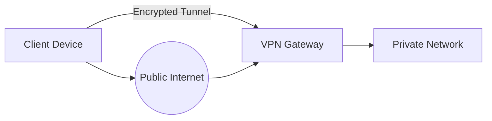
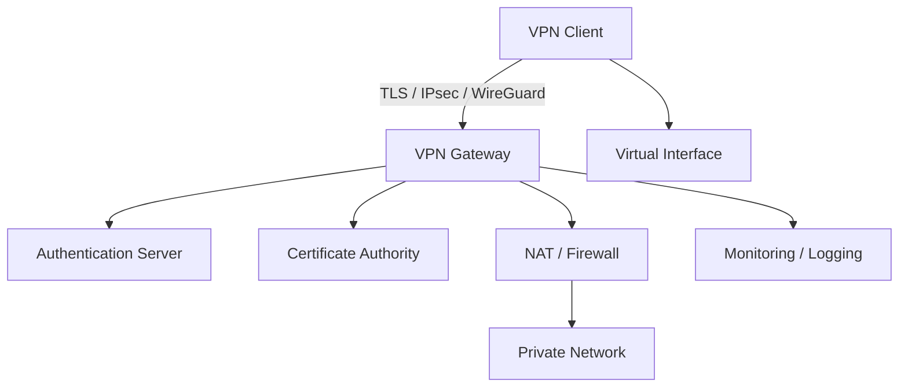
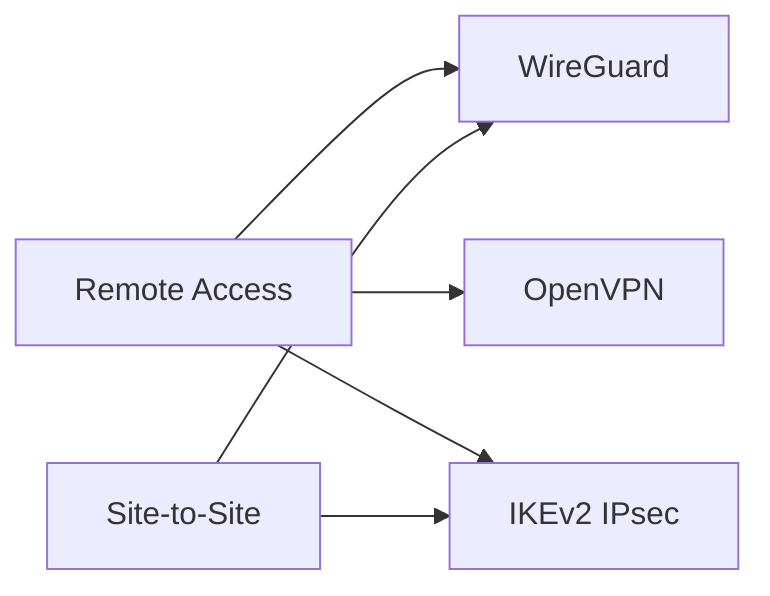
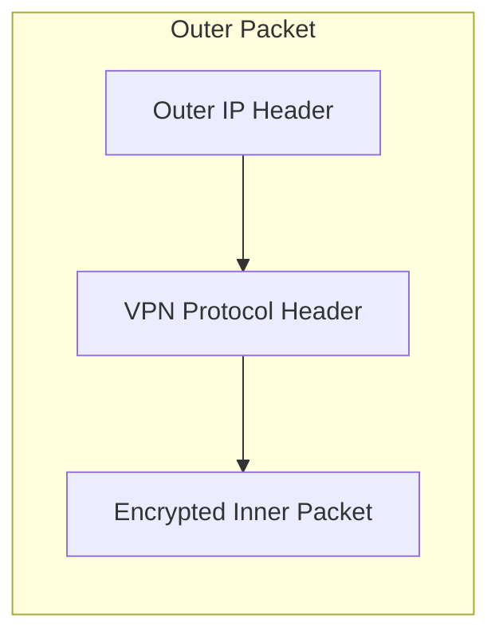
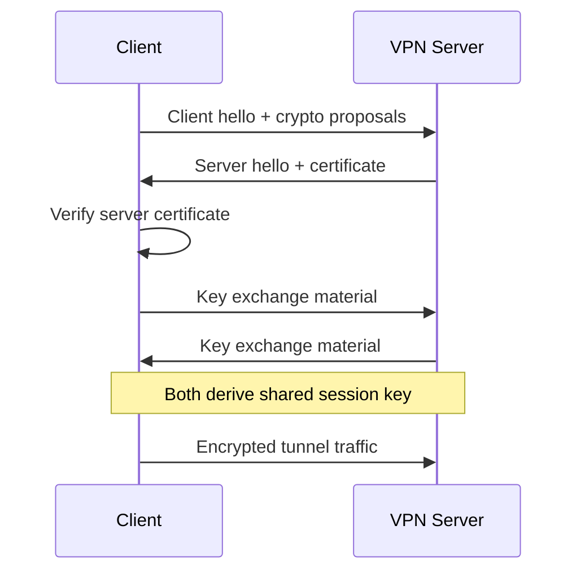
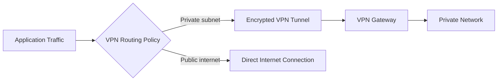
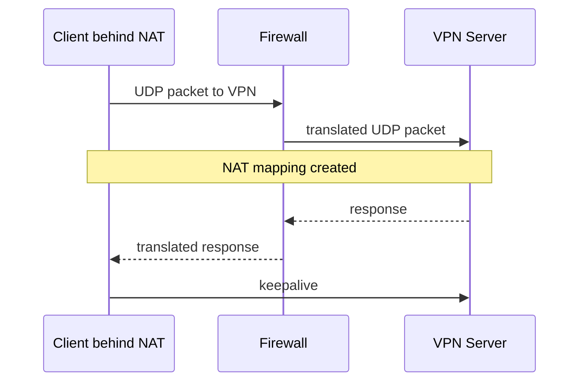
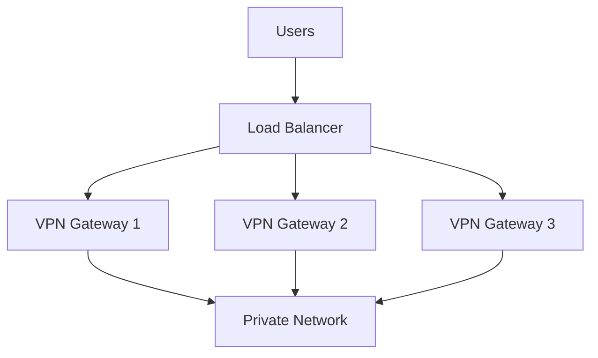

# Design a VPN

## Blogs and websites

## Medium

## Youtube

- [Build Your Own VPN | Free VPN](https://www.youtube.com/watch?v=6UIEtF-Hl2E)

## Theory

### Topics Covered

1. [Introduction to VPNs](#introduction-to-vpns)
2. [Characteristics](#characteristics)
3. [Pros](#pros)
4. [Cons](#cons)
5. [Use Cases](#use-cases)
6. [Components](#components)
7. [VPN Architectural Patterns](#vpn-architectural-patterns)
8. [Benefits](#benefits)
9. [Challenges](#challenges)
10. [Best Practices](#best-practices)
11. [When to Use a VPN](#when-to-use-a-vpn)
12. [VPN Types and Protocols](#vpn-types-and-protocols)
13. [Tunneling and Encapsulation](#tunneling-and-encapsulation)
14. [Encryption and Key Exchange](#encryption-and-key-exchange)
15. [Authentication and Authorization](#authentication-and-authorization)
16. [Routing and Split Tunneling](#routing-and-split-tunneling)
17. [NAT Traversal and Firewall Handling](#nat-traversal-and-firewall-handling)
18. [High Availability and Scalability](#high-availability-and-scalability)
19. [Performance and Optimization](#performance-and-optimization)
20. [Security Threats and Mitigations](#security-threats-and-mitigations)
21. [Observability and Logging](#observability-and-logging)
22. [Real-World VPN Implementations](#real-world-vpn-implementations)
23. [Java and Spring Boot Implementation Guide](#java-and-spring-boot-implementation-guide)

---

### Introduction to VPNs

A Virtual Private Network, or VPN, creates an encrypted tunnel between a client and a private network over a public network such as the internet. The client appears to be directly connected to the private network, and all traffic through the tunnel is protected from eavesdropping.

The primary goals of a VPN are confidentiality, integrity, authentication, and privacy. VPNs are used by remote workers, organizations connecting branch offices, and individuals seeking privacy.



**Why VPNs matter**

- They extend private network access across untrusted networks.
- They encrypt traffic, protecting sensitive data.
- They hide the client's real IP address from destinations.
- They allow geographically distributed teams to access internal resources securely.

**Real-life use cases**

- **Remote work**: employees connect to the corporate network from home.
- **Site-to-site connectivity**: branch offices connect to headquarters.
- **Public Wi-Fi protection**: travelers encrypt traffic on untrusted networks.
- **Bypassing geo-restrictions**: users appear to be in another country.
- **Cloud network access**: developers access private cloud resources through a VPN.

**Interview questions and answers**

- **Q: What is a VPN?**
  **A:** A VPN is an encrypted network connection that securely extends a private network across a public network.

- **Q: What is the difference between a VPN and a proxy?**
  **A:** A proxy only forwards application traffic and may not encrypt it, while a VPN tunnels and encrypts network traffic at a lower layer, usually protecting all traffic.

- **Q: What are the main security goals of a VPN?**
  **A:** Confidentiality through encryption, integrity through message authentication, authentication of endpoints, and availability of the tunnel.

---

### Characteristics

Each characteristic is explained in detail.

- **Encrypted tunnel**
  VPN traffic is encrypted between endpoints. Even if packets are captured on the public network, an attacker cannot read the payload.

- **Tunneling protocol**
  VPNs encapsulate one protocol inside another. The inner packet contains the private network traffic, and the outer packet carries it across the internet.

- **Authentication**
  Both endpoints verify each other's identity using certificates, pre-shared keys, or user credentials before establishing the tunnel.

- **Data integrity**
  Message authentication codes detect tampering. If a packet is modified in transit, the receiver discards it.

- **Endpoint abstraction**
  The client appears to the private network as if it were local. The VPN gateway assigns it a virtual IP address.

- **Virtual network interface**
  VPN clients typically create a virtual adapter. Applications send traffic to this adapter, and the VPN software encrypts and forwards it.

- **Mobility and remote access**
  Users can connect from anywhere with internet access, making the private network reachable across physical locations.

- **Support for multiple protocols**
  VPNs can carry IP, TCP, UDP, and sometimes non-IP traffic depending on the tunneling protocol.

- **Possible performance overhead**
  Encryption, encapsulation, and extra network hops add latency and reduce throughput compared with direct connections.

- **Potential single point of failure**
  The VPN gateway can become a bottleneck or failure point if not designed for high availability.

- **Centralized access control**
  The gateway can enforce policies on who can connect and which resources they can reach.

---

### Pros

- **Security**
  Encryption protects data from interception and tampering.

- **Privacy**
  The client's real IP address and browsing activity are hidden from the public network.

- **Remote access**
  Employees can reach internal resources from anywhere.

- **Network unification**
  Branch offices and cloud networks can communicate as if they are on the same local network.

- **Access control**
  VPN gateways centralize authentication and authorization for private resources.

- **Compatibility**
  VPNs work across many operating systems and devices.

- **Circumvention of restrictive networks**
  VPNs can bypass geo-blocks and network censorship in many cases.

- **Cost-effective site-to-site links**
  A VPN over the internet is usually cheaper than dedicated leased lines.

- **Transparent to applications**
  Once the tunnel is established, applications need no changes.

---

### Cons

- **Performance overhead**
  Encryption and encapsulation add CPU load, latency, and bandwidth overhead.

- **Complex configuration**
  Protocols, certificates, routing, and NAT can be difficult to configure correctly.

- **Potential for misconfiguration**
  Incorrect firewall or routing rules can expose private resources.

- **Gateway bottleneck**
  All traffic often passes through the VPN gateway, which can become a performance and availability bottleneck.

- **Security risks from weak configurations**
  Weak ciphers, shared passwords, or outdated protocols can compromise the tunnel.

- **VPN blocking**
  Some networks detect and block VPN protocols using deep packet inspection.

- **Trust in VPN provider**
  A third-party VPN provider can observe traffic, so the provider must be trusted.

- **Limited visibility for enterprise security tools**
  Encrypted traffic may bypass internal intrusion detection and content filtering.

- **Not a complete security solution**
  A VPN protects the tunnel but does not protect against malware, phishing, or compromised endpoints.

---

### Use Cases

Each use case is described with a real-world example.

- **Remote employee access**
  An employee connects from home to the corporate VPN, receives a virtual internal IP, and accesses file servers, internal tools, and databases.

- **Site-to-site corporate connectivity**
  Headquarters and branch offices establish a persistent VPN tunnel between their routers. Employees in each office reach resources in the other office as if local.

- **Cloud and hybrid network connectivity**
  Organizations connect on-premises data centers to AWS VPCs, Azure Virtual Networks, or Google Cloud VPCs using VPN gateways.

- **Public Wi-Fi protection**
  A traveler connects to airport Wi-Fi and enables a VPN so an attacker on the same network cannot sniff credentials or traffic.

- **Privacy and anonymity**
  Users route traffic through a privacy VPN to hide their IP address and location from websites.

- **Bypassing geographic restrictions**
  Users connect to a VPN server in another country to access region-locked streaming or web content.

- **IoT and OT device access**
  Engineers use VPNs to securely access industrial control systems and IoT gateways.

- **Development and testing**
  Developers access staging environments and internal APIs that are not exposed to the public internet.

- **Secure partner access**
  Contractors or partners receive limited VPN access to specific internal systems.

- **Emergency remote maintenance**
  Support engineers connect to customer or internal systems through a temporary VPN.

---

### Components

A VPN system consists of these components.

- **VPN client**
  Software on the user's device that creates the tunnel, encrypts traffic, and manages the virtual network interface.

- **VPN gateway / server**
  The endpoint that accepts client connections, authenticates users, decrypts traffic, and routes it to the private network.

- **Authentication server**
  Verifies user credentials, certificates, or tokens. This can be RADIUS, LDAP, Active Directory, or an identity provider.

- **Certificate authority**
  Issues and manages certificates used for mutual TLS authentication.

- **Key exchange module**
  Establishes shared session keys securely, often using Diffie-Hellman or ECDH.

- **Tunneling engine**
  Encapsulates and decapsulates packets using protocols such as IPsec, WireGuard, or OpenVPN.

- **Virtual network interface**
  The client-side adapter that receives application traffic destined for the private network.

- **Routing table / policy engine**
  Decides which traffic goes through the tunnel and which goes directly to the internet.

- **NAT and firewall module**
  Translates addresses, filters traffic, and protects the private network.

- **Configuration and policy store**
  Stores server settings, user policies, allowed networks, and split-tunnel rules.

- **Monitoring and logging**
  Records connection attempts, session duration, throughput, and security events.



---

### VPN Architectural Patterns

- **Remote access VPN**
  Individual users connect to a central gateway from their devices. This is the most common pattern for remote work.

- **Site-to-site VPN**
  Two routers or gateways maintain a persistent tunnel between networks. Users on either side do not need VPN client software.

- **Hub-and-spoke topology**
  A central headquarters gateway connects to many branch offices. All inter-branch traffic flows through the hub unless spoke-to-spoke tunnels are configured.

- **Full mesh topology**
  Every site has a direct tunnel to every other site. This reduces latency but becomes complex at scale.

- **Split tunneling**
  Only traffic destined for the private network goes through the tunnel. Other traffic uses the local internet connection directly.

- **Full tunneling**
  All client traffic is routed through the VPN gateway, providing stronger privacy and policy enforcement.

- **Cloud VPN gateway**
  Cloud providers expose managed VPN gateways that connect on-premises networks to virtual private clouds.

- **Zero-trust network access**
  A VPN-like access model where users are authenticated and authorized per application rather than granted broad network access.

- **Overlay mesh VPN**
  Peer-to-peer encrypted tunnels between nodes, often using WireGuard. Tools such as Tailscale and Nebula use this pattern.

---

### Benefits

- **Strong confidentiality**
  Encryption protects sensitive data on untrusted networks.

- **Remote workforce enablement**
  Employees can work securely from anywhere.

- **Network consolidation**
  Dispersed sites behave like a single private network.

- **Centralized security policy**
  Access rules and authentication are enforced at the gateway.

- **Lower cost than leased lines**
  Site-to-site VPNs use the public internet instead of expensive dedicated circuits.

- **Flexibility**
  VPNs work with laptops, phones, routers, and cloud networks.

- **Improved privacy**
  Clients can hide their IP address and traffic from local networks and destinations.

- **Business continuity**
  Teams can continue accessing internal systems during travel or office disruptions.

---

### Challenges

- **Performance and scalability**
  A central VPN gateway can become a bottleneck and a single point of failure.

- **Configuration complexity**
  IPsec, certificates, routing, and NAT interoperability are difficult to manage.

- **Encryption overhead**
  CPU-intensive encryption and encapsulation reduce throughput.

- **Security misconfiguration risk**
  Weak cipher suites, leaked keys, or overly broad access rules can create serious vulnerabilities.

- **VPN blocking and censorship**
  Deep packet inspection can identify and block some VPN protocols.

- **Credential and certificate management**
  Revoking users and rotating certificates at scale requires automation.

- **Lack of per-application granularity**
  Traditional VPNs often grant broad network access once a user connects.

- **Monitoring blind spots**
  Encrypted traffic can bypass intrusion detection and content filtering unless decrypted or inspected at the endpoint.

- **Dependency on endpoint security**
  A compromised device with a VPN connection can become a path into the private network.

---

### Best Practices

- **Use modern protocols**
  Prefer WireGuard or current IPsec/IKEv2 over outdated protocols such as PPTP.

- **Use strong cryptographic algorithms**
  Prefer AES-GCM or ChaCha20-Poly1305 for encryption and modern Diffie-Hellman groups for key exchange.

- **Enable mutual authentication**
  Use certificates or strong credentials on both client and server.

- **Apply least-privilege access**
  Restrict users to the specific subnets and applications they need.

- **Use split tunneling only when appropriate**
  Balance performance with security and data-loss prevention requirements.

- **Enable perfect forward secrecy**
  Ensure session keys are not recoverable if long-term keys are later compromised.

- **Keep software and certificates updated**
  Patch VPN gateways and clients and automate certificate renewal.

- **Monitor authentication and traffic**
  Log failed logins, session duration, throughput, and anomalies.

- **Implement multi-factor authentication**
  Combine passwords with certificates, tokens, or push notifications.

- **Use high availability**
  Deploy multiple gateways behind load balancers and configure failover.

- **Restrict management interfaces**
  Do not expose gateway administration panels to the public internet.

- **Test failover and recovery**
  Simulate gateway failure and verify clients reconnect cleanly.

---

### When to Use a VPN

- **Use a VPN when** remote users need secure access to private network resources.
- **Use a VPN when** multiple sites or cloud networks need private connectivity over the internet.
- **Use a VPN when** traffic must be encrypted on untrusted networks.
- **Use a VPN when** users need to hide their IP address or bypass geo-restrictions.
- **Use a VPN when** you need network-level access rather than per-application access.

**Consider alternatives when**

- Users only need access to a few web applications. A zero-trust proxy or identity-aware proxy may be simpler and more secure.
- You need very high throughput and low latency without encryption overhead.
- You can use a private network or direct interconnect instead of the public internet.
- You need fine-grained per-application authorization without broad network access.

---

### VPN Types and Protocols

#### Types

- **Remote access VPN**
  Connects individual clients to a private network.

- **Site-to-site VPN**
  Connects two networks through persistent gateways.

- **Clientless VPN**
  Access is provided through a browser using TLS without installing a traditional VPN client.

- **Cloud VPN**
  Managed VPN service connecting on-premises networks to cloud environments.

- **Overlay mesh VPN**
  Peer-to-peer encrypted tunnels between nodes.

#### Common protocols

- **WireGuard**
  Modern, fast, and simple. Uses UDP, ChaCha20-Poly1305, and Curve25519. Very small codebase.

- **IPsec**
  Suite of protocols providing encryption and authentication at the IP layer. Often used with IKEv2 for key exchange.

- **OpenVPN**
  Flexible TLS-based VPN that can use UDP or TCP. Widely supported and configurable.

- **IKEv2/IPsec**
  Strong support for mobile clients because it handles network changes well.

- **SSTP**
  Microsoft's TLS-based VPN, often used on Windows.

- **L2TP/IPsec**
  Combines L2TP tunneling with IPsec encryption.

- **PPTP**
  Legacy protocol, now considered insecure.



**Real-life use**

- WireGuard powers many modern consumer and cloud VPNs.
- IPsec is common in enterprise site-to-site tunnels.
- OpenVPN is popular in self-hosted VPN setups.

**Interview questions and answers**

- **Q: Why is WireGuard often preferred over OpenVPN?**
  **A:** WireGuard has a smaller codebase, simpler configuration, faster performance, and modern cryptography. OpenVPN offers more flexibility and broader compatibility.

- **Q: Why is PPTP not recommended?**
  **A:** PPTP uses weak cryptography and has known vulnerabilities, making it unsuitable for modern security requirements.

---

### Tunneling and Encapsulation

Tunneling wraps the original packet inside another packet. The outer header routes the encrypted inner packet across the public network.



**How it works**

1. The client creates a packet destined for a private IP.
2. The VPN client encrypts the packet.
3. The encrypted packet is placed inside a new packet addressed to the VPN gateway.
4. The gateway receives the outer packet, decrypts the inner packet, and forwards it to the private network.
5. Return traffic follows the reverse path.

**Interview questions and answers**

- **Q: What is encapsulation in VPNs?**
  **A:** It is the process of placing an entire encrypted packet inside another packet so it can traverse an untrusted network.

- **Q: Why does a VPN add header overhead?**
  **A:** The outer IP and VPN protocol headers are added to the original packet, reducing the payload space available for application data.

---

### Encryption and Key Exchange

VPN security depends on two phases: authentication/key exchange and session encryption.

**Key exchange**

Protocols such as Diffie-Hellman and ECDH allow both parties to agree on a shared secret over an untrusted channel. Certificates or pre-shared keys authenticate the endpoints.

**Session encryption**

Once a shared secret is derived, symmetric encryption protects the traffic. Common algorithms are AES-GCM and ChaCha20-Poly1305.

**Perfect forward secrecy**

Session keys are generated per session and discarded. Compromising a long-term certificate does not reveal past session keys.



**Java example: symmetric encryption**

```java
import javax.crypto.Cipher;
import javax.crypto.KeyGenerator;
import javax.crypto.SecretKey;
import javax.crypto.spec.GCMParameterSpec;
import java.security.SecureRandom;

public final class AesGcmEncryption {

    private static final int GCM_IV_LENGTH = 12;
    private static final int GCM_TAG_LENGTH = 128;

    private AesGcmEncryption() {
    }

    public static byte[] encrypt(byte[] plaintext, SecretKey key) throws Exception {
        byte[] iv = new byte[GCM_IV_LENGTH];
        new SecureRandom().nextBytes(iv);

        Cipher cipher = Cipher.getInstance("AES/GCM/NoPadding");
        cipher.init(Cipher.ENCRYPT_MODE, key, new GCMParameterSpec(GCM_TAG_LENGTH, iv));

        byte[] ciphertext = cipher.doFinal(plaintext);
        byte[] output = new byte[iv.length + ciphertext.length];
        System.arraycopy(iv, 0, output, 0, iv.length);
        System.arraycopy(ciphertext, 0, output, iv.length, ciphertext.length);
        return output;
    }

    public static byte[] decrypt(byte[] input, SecretKey key) throws Exception {
        byte[] iv = new byte[GCM_IV_LENGTH];
        byte[] ciphertext = new byte[input.length - GCM_IV_LENGTH];
        System.arraycopy(input, 0, iv, 0, GCM_IV_LENGTH);
        System.arraycopy(input, GCM_IV_LENGTH, ciphertext, 0, ciphertext.length);

        Cipher cipher = Cipher.getInstance("AES/GCM/NoPadding");
        cipher.init(Cipher.DECRYPT_MODE, key, new GCMParameterSpec(GCM_TAG_LENGTH, iv));
        return cipher.doFinal(ciphertext);
    }
}
```

**Interview questions and answers**

- **Q: Why use asymmetric key exchange followed by symmetric encryption?**
  **A:** Asymmetric cryptography securely establishes a shared key but is slow. Symmetric encryption is fast for bulk data. VPNs combine both.

- **Q: What is perfect forward secrecy?**
  **A:** Each session uses unique ephemeral keys, so past traffic cannot be decrypted even if long-term credentials are later compromised.

---

### Authentication and Authorization

VPN authentication verifies who is connecting; authorization controls what they can access.

**Authentication methods**

- Pre-shared keys
- Digital certificates
- Username and password
- Multi-factor authentication
- OAuth or SAML identity federation

**Authorization methods**

- User group policies
- Per-user routes
- Firewall rules
- Access control lists
- Role-based access control

**Java example: simple user authentication check**

```java
import org.springframework.security.crypto.bcrypt.BCryptPasswordEncoder;

public class VpnUserAuthenticator {

    private final BCryptPasswordEncoder passwordEncoder = new BCryptPasswordEncoder();

    public boolean authenticate(VpnUser user, String rawPassword) {
        return user != null
            && user.isEnabled()
            && passwordEncoder.matches(rawPassword, user.getPasswordHash());
    }

    public record VpnUser(String username, String passwordHash, boolean enabled) {
    }
}
```

**Interview questions and answers**

- **Q: Why use certificates instead of passwords for site-to-site VPNs?**
  **A:** Certificates provide stronger, automated authentication between devices and are less prone to brute-force and password reuse.

- **Q: What is the difference between authentication and authorization?**
  **A:** Authentication proves identity; authorization determines which resources and actions are allowed after authentication.

---

### Routing and Split Tunneling

VPN routing decides which packets enter the tunnel.

- **Full tunnel**
  The client sends all traffic through the VPN gateway. This maximizes privacy and enables enterprise inspection, but increases latency and gateway load.

- **Split tunnel**
  The client sends only traffic for private subnets through the tunnel. Other traffic goes directly to the internet. This reduces gateway load and improves performance but can expose corporate policy gaps.



**Java example: split-tunnel decision**

```java
import java.util.List;

public class SplitTunnelRouter {

    private final List<String> privateCidrs;

    public SplitTunnelRouter(List<String> privateCidrs) {
        this.privateCidrs = privateCidrs;
    }

    public boolean shouldTunnel(String destinationIp) {
        return privateCidrs.stream()
            .anyMatch(cidr -> isInCidr(destinationIp, cidr));
    }

    private boolean isInCidr(String ip, String cidr) {
        String[] parts = cidr.split("/");
        String network = parts[0];
        int prefix = Integer.parseInt(parts[1]);
        return toLong(ip) >>> (32 - prefix) == toLong(network) >>> (32 - prefix);
    }

    private long toLong(String ip) {
        String[] octets = ip.split("\\.");
        long result = 0;
        for (String octet : octets) {
            result = (result << 8) | Long.parseLong(octet);
        }
        return result;
    }
}
```

**Interview questions and answers**

- **Q: What are the trade-offs of split tunneling?**
  **A:** Split tunneling improves performance and reduces gateway load but may allow traffic to bypass enterprise security controls.

- **Q: When would you use full tunneling?**
  **A:** When privacy, data-loss prevention, or consistent policy enforcement is more important than latency and bandwidth efficiency.

---

### NAT Traversal and Firewall Handling

VPN tunnels often need to pass through NAT devices and firewalls.

- **NAT-T**
  IPsec uses NAT traversal by encapsulating ESP packets in UDP port 4500.

- **UDP preferred**
  WireGuard and OpenVPN commonly use UDP, but some firewalls block UDP. OpenVPN can fall back to TCP.

- **Keepalive packets**
  Periodic keepalives keep NAT mappings alive and prevent idle tunnels from being dropped.

- **Port selection**
  Using well-known ports such as TCP 443 can make VPN traffic harder to block.

- **TLS-based protocols**
  TLS VPNs look like normal HTTPS traffic and pass through most firewalls more easily.



**Interview questions and answers**

- **Q: Why do IPsec VPNs use NAT-T?**
  **A:** IPsec ESP packets are not standard TCP or UDP, so NAT devices cannot track them. NAT-T wraps ESP in UDP to allow traversal.

- **Q: How can a VPN bypass restrictive firewalls?**
  **A:** Use TLS on TCP port 443 so the traffic resembles normal HTTPS, or use a protocol that can fall back from UDP to TCP.

---

### High Availability and Scalability

A VPN gateway must remain available and scale to many concurrent users.

**High availability**

- Deploy multiple VPN gateways behind a load balancer.
- Use DNS failover or anycast addressing.
- Synchronize sessions or use stateless session designs so another gateway can take over.
- Monitor gateway health and automatically remove failed nodes.

**Scalability**

- Scale horizontally by adding gateway instances.
- Use connection-oriented protocols carefully, since TCP-in-TCP can degrade performance.
- Distribute users across gateways by region.
- Use split tunneling to reduce gateway load.
- Offload encryption to hardware accelerators where possible.



**Interview questions and answers**

- **Q: Why is a single VPN gateway a problem?**
  **A:** It is a single point of failure and can become a throughput bottleneck.

- **Q: How do you preserve active tunnels when a gateway fails?**
  **A:** Use redundant gateways with shared session state, fast failover, and clients that reconnect automatically.

---

### Performance and Optimization

VPN performance is limited by encryption, encapsulation, and network path.

**Optimization techniques**

- Use fast modern ciphers such as AES-GCM with hardware acceleration or ChaCha20-Poly1305.
- Use UDP rather than TCP-in-TCP to avoid retransmission stacking.
- Use split tunneling to reduce traffic through the tunnel.
- Compress traffic only when beneficial; compression can hurt performance on already-compressed data.
- Choose geographically close VPN servers.
- Tune MTU to avoid fragmentation.
- Scale gateway CPU and enable hardware crypto acceleration.

**Interview questions and answers**

- **Q: Why is TCP-over-TCP problematic for VPNs?**
  **A:** Outer and inner TCP layers can both retransmit and interact poorly, causing the "TCP meltdown" problem and severe performance degradation.

- **Q: What is MTU and why does it matter for VPNs?**
  **A:** MTU is the maximum packet size. VPN encapsulation adds headers, so the effective MTU must be lowered to avoid fragmentation.

---

### Security Threats and Mitigations

- **Eavesdropping**
  Mitigate with strong encryption and modern ciphers.

- **Man-in-the-middle attacks**
  Mitigate with mutual authentication and certificate validation.

- **Replay attacks**
  Mitigate with sequence numbers, timestamps, and replay windows.

- **Credential theft**
  Mitigate with multi-factor authentication and certificate revocation.

- **Weak ciphers**
  Mitigate by disabling legacy algorithms and enforcing strong cipher suites.

- **VPN blocking**
  Mitigate with TLS-based protocols or traffic obfuscation.

- **DNS leaks**
  Mitigate by routing DNS queries through the tunnel and preventing fallback to the local resolver.

- **Endpoint compromise**
  Mitigate with endpoint protection, least-privilege access, and zero-trust policies.

- **Insider abuse**
  Mitigate with role-based access and audit logging.

**Interview questions and answers**

- **Q: What is a DNS leak in a VPN?**
  **A:** DNS queries bypass the VPN tunnel and go to the local resolver, revealing the websites a user visits.

- **Q: How do you prevent replay attacks in a VPN?**
  **A:** Include sequence numbers or timestamps in packets and reject those that are old or already seen.

---

### Observability and Logging

A VPN system should log security events and expose operational metrics.

**Logs**

- Successful and failed authentication attempts
- Session start and end times
- Assigned virtual IP addresses
- Traffic volume per user
- Firewall denials
- Gateway health changes

**Metrics**

- Active sessions
- Authentication failure rate
- Throughput and packet loss
- CPU and memory usage
- Tunnel establishment latency

**Alerts**

- Alert on a spike in failed logins.
- Alert on gateway CPU saturation.
- Alert when session counts exceed capacity.
- Alert when a gateway becomes unhealthy.

**Interview questions and answers**

- **Q: Why log failed authentication attempts?**
  **A:** Repeated failures may indicate brute-force or credential-stuffing attacks.

- **Q: Which metric best reveals gateway saturation?**
  **A:** CPU usage, throughput, active sessions, and packet loss together reveal whether a gateway is reaching capacity.

---

### Real-World VPN Implementations

- **WireGuard**
  Modern kernel and userspace VPN protocol. Simple, fast, and used by many VPN providers.

- **OpenVPN**
  Popular open-source TLS-based VPN server and client.

- **IPsec**
  Standards-based VPN commonly used in enterprise routers and firewalls.

- **Tailscale**
  Peer-to-peer overlay VPN built on WireGuard with identity-based access.

- **Nebula**
  Scalable overlay mesh VPN created by Slack, using mutual TLS-like certificates.

- **AWS Site-to-Site VPN**
  Managed IPsec VPN connecting on-premises networks to AWS VPCs.

- **Azure VPN Gateway**
  Managed site-to-site and point-to-site VPN for Azure virtual networks.

- **Google Cloud VPN**
  Managed IPsec tunnels connecting on-premises networks to Google Cloud.

**Interview questions and answers**

- **Q: How does Tailscale differ from a traditional remote access VPN?**
  **A:** Tailscale creates peer-to-peer encrypted tunnels between individual devices rather than routing all traffic through a central gateway, and it uses identity-based access.

- **Q: What is a cloud-managed VPN gateway?**
  **A:** A VPN service operated by a cloud provider that securely connects customer networks to cloud resources using IPsec or another protocol.

---

### Java and Spring Boot Implementation Guide

This section shows how to build a simple VPN session management and authentication API with Spring Boot.

#### 1. VPN session model

```java
import java.time.Instant;

public class VpnSession {

    private String sessionId;
    private String username;
    private String virtualIp;
    private Instant connectedAt;

    public VpnSession(String sessionId, String username, String virtualIp, Instant connectedAt) {
        this.sessionId = sessionId;
        this.username = username;
        this.virtualIp = virtualIp;
        this.connectedAt = connectedAt;
    }

    public String getSessionId() {
        return sessionId;
    }

    public String getUsername() {
        return username;
    }

    public String getVirtualIp() {
        return virtualIp;
    }

    public Instant getConnectedAt() {
        return connectedAt;
    }
}
```

#### 2. VPN session manager

```java
import org.springframework.stereotype.Service;

import java.time.Instant;
import java.util.Collection;
import java.util.Map;
import java.util.Optional;
import java.util.UUID;
import java.util.concurrent.ConcurrentHashMap;

@Service
public class VpnSessionManager {

    private final Map<String, VpnSession> sessions = new ConcurrentHashMap<>();
    private final Map<String, String> virtualIpBySession = new ConcurrentHashMap<>();

    public VpnSession connect(String username, String virtualIp) {
        String sessionId = UUID.randomUUID().toString();
        VpnSession session = new VpnSession(sessionId, username, virtualIp, Instant.now());
        sessions.put(sessionId, session);
        virtualIpBySession.put(sessionId, virtualIp);
        return session;
    }

    public Optional<VpnSession> getSession(String sessionId) {
        return Optional.ofNullable(sessions.get(sessionId));
    }

    public void disconnect(String sessionId) {
        sessions.remove(sessionId);
        virtualIpBySession.remove(sessionId);
    }

    public Collection<VpnSession> activeSessions() {
        return sessions.values();
    }
}
```

#### 3. VPN controller

```java
import org.springframework.http.ResponseEntity;
import org.springframework.web.bind.annotation.*;

import java.util.Collection;
import java.util.Optional;

@RestController
@RequestMapping("/api/vpn")
public class VpnController {

    private final VpnSessionManager sessionManager;

    public VpnController(VpnSessionManager sessionManager) {
        this.sessionManager = sessionManager;
    }

    @PostMapping("/sessions")
    public ResponseEntity<VpnSession> connect(@RequestParam String username,
                                              @RequestParam String virtualIp) {
        return ResponseEntity.ok(sessionManager.connect(username, virtualIp));
    }

    @GetMapping("/sessions/{sessionId}")
    public ResponseEntity<VpnSession> getSession(@PathVariable String sessionId) {
        return sessionManager.getSession(sessionId)
            .map(ResponseEntity::ok)
            .orElse(ResponseEntity.notFound().build());
    }

    @GetMapping("/sessions")
    public ResponseEntity<Collection<VpnSession>> listSessions() {
        return ResponseEntity.ok(sessionManager.activeSessions());
    }

    @DeleteMapping("/sessions/{sessionId}")
    public ResponseEntity<Void> disconnect(@PathVariable String sessionId) {
        sessionManager.disconnect(sessionId);
        return ResponseEntity.noContent().build();
    }
}
```

#### 4. Password authentication service

```java
import org.springframework.security.crypto.bcrypt.BCryptPasswordEncoder;
import org.springframework.stereotype.Service;

@Service
public class VpnAuthenticationService {

    private final BCryptPasswordEncoder encoder = new BCryptPasswordEncoder();

    public boolean authenticate(String rawPassword, String storedHash) {
        return storedHash != null && encoder.matches(rawPassword, storedHash);
    }
}
```

**Interview questions and answers**

- **Q: How would you integrate this Spring Boot service with an actual VPN tunnel?**
  **A:** Use it as the control plane for authentication, session tracking, and configuration. The data plane, such as WireGuard or IPsec, would enforce the tunnel and use this service to authorize sessions.

- **Q: How do you track active VPN sessions in a distributed deployment?**
  **A:** Store session state in a shared data store such as Redis or a database rather than in local memory so multiple gateway instances can access it.

- **Q: Why keep session state outside the gateway process?**
  **A:** It enables horizontal scaling, failover, and centralized observability across gateway instances.


