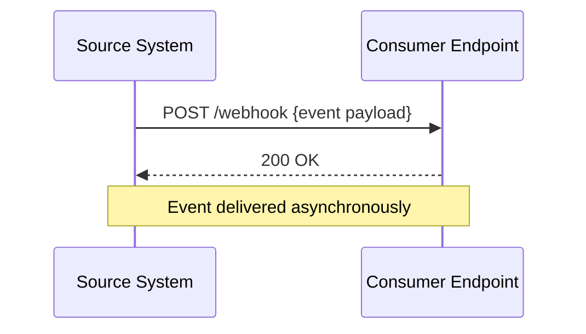
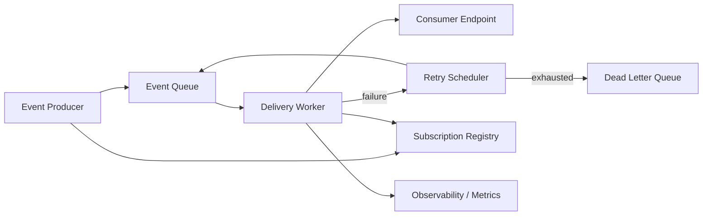
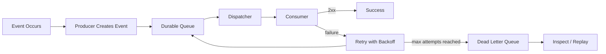
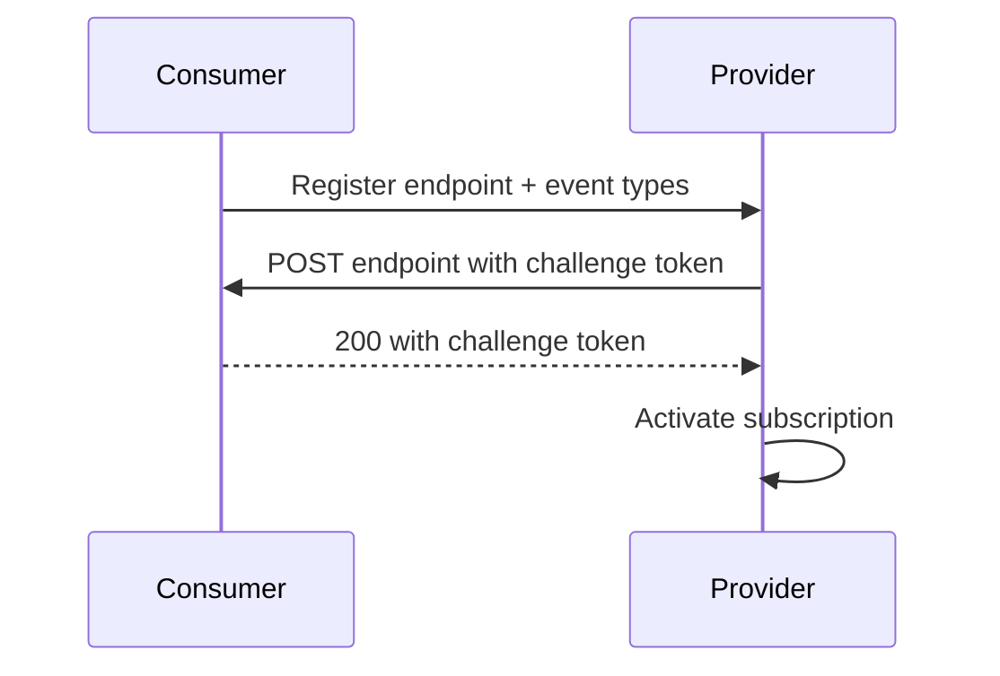
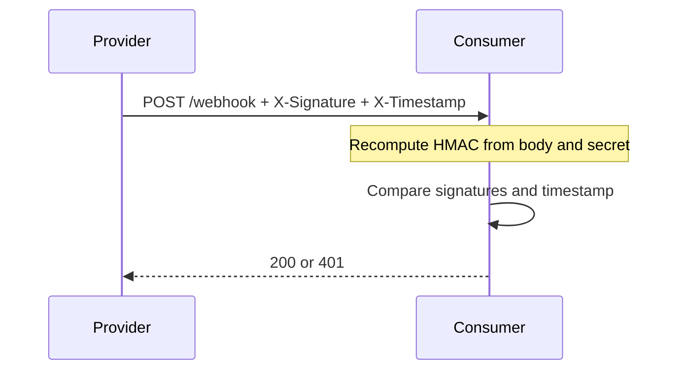
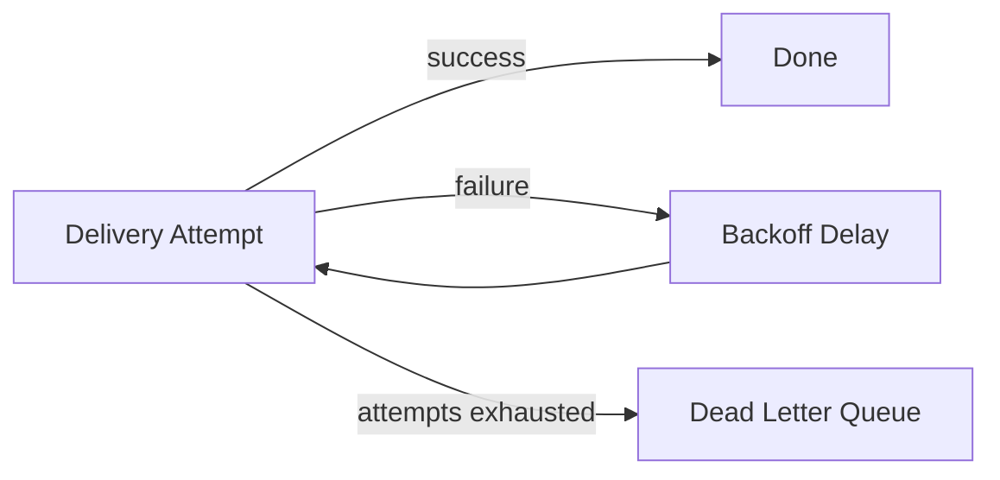
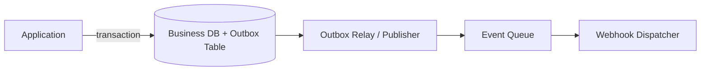
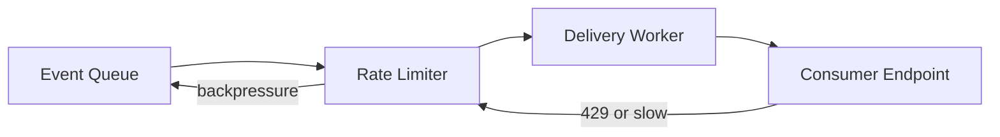
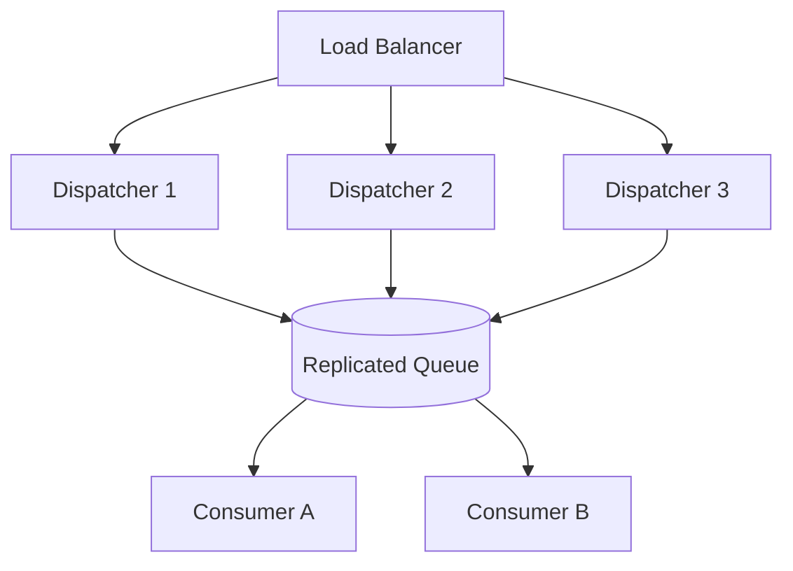

# Design Webhook

## Blogs and websites

## Medium

## Youtube

- [System Design Interview: Design a Webhook Service w/ a Google Engineer](https://www.youtube.com/watch?v=4C9SVQVmUxs)


## Theory

### Topics Covered

- [Design Webhook](#design-webhook)
  - [Blogs and websites](#blogs-and-websites)
  - [Medium](#medium)
  - [Youtube](#youtube)
  - [Theory](#theory)
    - [Topics Covered](#topics-covered)
    - [Introduction to Webhooks](#introduction-to-webhooks)
    - [Characteristics](#characteristics)
    - [Pros](#pros)
    - [Cons](#cons)
    - [Use Cases](#use-cases)
    - [Components](#components)
    - [Webhook Patterns](#webhook-patterns)
    - [Benefits](#benefits)
    - [Challenges](#challenges)
    - [Best Practices](#best-practices)
    - [When to Use Webhooks](#when-to-use-webhooks)
    - [Webhook vs Polling vs WebSocket](#webhook-vs-polling-vs-websocket)
    - [Webhook Lifecycle and Delivery Flow](#webhook-lifecycle-and-delivery-flow)
    - [Subscription and Registration Model](#subscription-and-registration-model)
    - [Event Design and Payload Format](#event-design-and-payload-format)
    - [Security: Signatures and Verification](#security-signatures-and-verification)
    - [Retries and Delivery Guarantees](#retries-and-delivery-guarantees)
    - [Ordering and Idempotency](#ordering-and-idempotency)
    - [Durability, Dead Letter Queues and Outbox Pattern](#durability-dead-letter-queues-and-outbox-pattern)
    - [Rate Limiting, Throttling and Backpressure](#rate-limiting-throttling-and-backpressure)
    - [Observability and Monitoring](#observability-and-monitoring)
    - [High Availability and Scalability](#high-availability-and-scalability)
    - [Real-World Webhook Providers](#real-world-webhook-providers)
    - [Java and Spring Boot Implementation Guide](#java-and-spring-boot-implementation-guide)
      - [1. Webhook consumer controller](#1-webhook-consumer-controller)
      - [2. Consumer service with deduplication](#2-consumer-service-with-deduplication)
      - [3. Webhook producer client](#3-webhook-producer-client)
      - [4. Asynchronous delivery with retry using Spring Retry](#4-asynchronous-delivery-with-retry-using-spring-retry)

---

### Introduction to Webhooks

A webhook is a user-defined HTTP callback. When an event occurs in a source system, the source sends an HTTP request, usually `POST`, to a URL registered by the consumer. The request payload contains details about the event.

Unlike polling, where the consumer repeatedly asks the provider "has anything changed?", a webhook reverses the direction of communication. The provider pushes the event to the consumer as soon as it happens.



**Why webhooks matter**

- They provide near-real-time event delivery without continuous polling.
- They reduce load on the provider because no polling requests are generated.
- They allow integrations to react to changes without a persistent connection.

**Real-life use cases**

- **Payment providers**: Stripe sends `payment_intent.succeeded` events to merchant endpoints.
- **CI/CD platforms**: GitHub sends `push` and `pull_request` events to Jenkins, CircleCI, or custom servers.
- **Messaging platforms**: Slack sends event notifications to app endpoints.
- **E-commerce**: Shopify sends order-created events to inventory and fulfillment systems.
- **Identity providers**: Auth0 sends signup and login events to applications.

**Interview questions and answers**

- **Q: What is a webhook?**
  **A:** A webhook is an HTTP callback that delivers event notifications from a provider to a consumer-registered URL in real time.

- **Q: How is a webhook different from an API?**
  **A:** An API is request-driven: the client pulls data by calling an endpoint. A webhook is event-driven: the provider pushes data to the client when an event occurs.

- **Q: Why use webhooks instead of polling?**
  **A:** Webhooks reduce latency, network traffic, and provider load. Polling repeatedly checks for changes even when none exist.

---

### Characteristics

Each characteristic is explained in detail.

- **Event-driven**
  Delivery is triggered by a state change or business event rather than by a client request. The producer decides when to notify the consumer.

- **Asynchronous by nature**
  The producer does not wait for the consumer to finish processing the event. It sends the HTTP request and usually only waits for a short acknowledgement.

- **HTTP-based**
  Webhooks are built on standard HTTP, usually `POST` requests with JSON payloads. This makes them compatible with almost any technology stack.

- **Consumer-registered endpoints**
  The consumer must provide a public URL where it wants to receive events. This subscription model gives the consumer control over where events go.

- **Push-based delivery**
  Data flows from producer to consumer automatically. The consumer does not need to schedule or invoke anything.

- **Single-direction communication**
  The source sends events to the target. The target's response is primarily an acknowledgement, not a full conversation.

- **Idempotency required**
  Networks can fail or time out, so providers may retry. Consumers must make event handlers idempotent to avoid processing the same event twice.

- **Usually stateless on the provider side**
  The provider may not maintain a persistent connection or session with the consumer. Each delivery is an independent HTTP request.

- **May support signing and authentication**
  Providers can sign payloads with a shared secret so consumers can verify authenticity and integrity.

- **Can deliver at least once**
  Most webhook systems offer at-least-once delivery. Exactly-once delivery is generally impossible without consumer-side deduplication.

- **Requires retry and failure handling**
  Because endpoints can be down, slow, or return errors, a reliable webhook system needs retries, backoff, and a dead-letter strategy.

---

### Pros

- **Real-time notifications**
  Events reach the consumer almost immediately after they happen.

- **Efficient**
  No polling means no wasted requests when there is no new data.

- **Simple to integrate**
  Both producer and consumer only need HTTP and JSON support.

- **Low latency compared with polling**
  Polling introduces a delay equal to the polling interval; webhooks reduce that delay.

- **Reduced provider load**
  The provider only sends data when an event occurs.

- **Loose coupling**
  The producer does not need to understand the consumer's internal implementation, only the registered URL and payload contract.

- **Widely supported**
  Payment gateways, code hosts, SaaS platforms, and internal systems commonly expose webhooks.

- **Easy horizontal scaling**
  HTTP endpoints can be scaled behind load balancers and queues.

- **Good observability**
  Delivery attempts, responses, and latency can be logged and monitored.

---

### Cons

- **No guaranteed delivery without extra work**
  A simple HTTP POST can be lost if the consumer is down. Reliable delivery requires retries and persistence.

- **Consumer endpoint must be publicly reachable**
  Local development and private networks require tunnels or ingress configuration.

- **Security risks**
  Unverified endpoints can be abused for SSRF, replay attacks, or spoofed payloads if signatures and authentication are absent.

- **Delivery failures require handling**
  Consumers must handle downtime, timeouts, malformed payloads, and duplicate events.

- **Potential for event loss**
  If the provider does not persist events or implement retries, events can be lost permanently.

- **No built-in backpressure**
  A sudden burst of events can overwhelm a slow consumer unless the system queues and throttles deliveries.

- **Ordering is not always guaranteed**
  Retries and distributed delivery can reorder events, so consumers should not assume strict ordering.

- **Harder to test locally**
  Receiving real webhooks requires a public URL or a tool such as ngrok or a local tunnel.

- **Monitoring burden**
  Consumers must track missed deliveries, failures, and duplicate events themselves.

---

### Use Cases

Each use case is described with a real-world example.

- **Payment notifications**
  Stripe and PayPal send events such as `charge.succeeded` and `refund.created`. Merchants use these events to update order status and trigger fulfillment.

- **Code repository events**
  GitHub and GitLab send `push`, `pull_request`, `issue`, and `release` events. CI/CD systems start builds, run tests, and deploy code.

- **E-commerce order and inventory updates**
  Shopify and WooCommerce notify when orders are created, paid, or cancelled. Fulfillment and accounting systems react to those events.

- **Identity and authentication events**
  Auth0, Okta, and Firebase send signup, login, and user-updated events. Applications sync user data or trigger onboarding flows.

- **Messaging and collaboration**
  Slack and Discord send bot events and app mentions. Bots respond, update channels, or notify users.

- **Subscription lifecycle**
  Billing platforms send `subscription.created`, `renewed`, `cancelled`, and `past_due` events. SaaS apps update entitlements.

- **CRM and marketing automation**
  Salesforce and HubSpot send contact and deal events. Marketing systems segment users and trigger campaigns.

- **Monitoring and incident response**
  Datadog, Grafana, and PagerDuty send alerts. Incident tools page engineers or open tickets.

- **Form and workflow automation**
  Form services send submission events. Workflow engines start approvals or create records.

- **Internal event propagation**
  A monolith or service mesh can use webhooks to notify external partners or legacy systems without sharing a message broker.

---

### Components

A complete webhook system has these components.

- **Event producer**
  The system that detects a change and creates an event. It knows which consumers are subscribed to which event types.

- **Subscription registry**
  Stores consumer endpoints, event types, secrets, and delivery settings. It determines who should receive each event.

- **Event queue**
  Buffers events between production and delivery. The queue decouples event generation from HTTP delivery and enables backpressure.

- **Delivery worker / dispatcher**
  Reads events from the queue and sends HTTP requests to consumer endpoints.

- **Retry scheduler**
  Requeues failed deliveries with exponential backoff and maximum attempt limits.

- **Dead letter queue (DLQ)**
  Holds events that cannot be delivered after all retries, allowing operators to inspect and replay them.

- **Signature / security module**
  Generates and verifies signatures, timestamps, and shared secrets.

- **Rate limiter / throttler**
  Limits deliveries per consumer to prevent overwhelming endpoints.

- **Consumer endpoint**
  The public HTTP endpoint owned by the consumer that receives and processes events.

- **Observability stack**
  Logs, metrics, tracing, and dashboards track delivery success, latency, failures, and queue depth.



---

### Webhook Patterns

- **Fire-and-forget delivery**
  The producer sends one HTTP request and considers the event delivered after a `2xx` response. Simple but less reliable.

- **Persistent queue with retry**
  Events are stored in a queue and delivered asynchronously. Failed deliveries are retried with backoff.

- **Signed webhooks**
  The producer includes a signature header computed with a shared secret. The consumer verifies it before processing.

- **At-least-once delivery with idempotent consumers**
  The provider may deliver duplicates, and the consumer deduplicates by event ID.

- **Dead letter queue pattern**
  Permanently failing events are moved to a DLQ for inspection, replay, or manual handling.

- **Outbox pattern**
  The producer writes events to a database table in the same transaction as the business change. A background process publishes them, ensuring no event is lost.

- **Webhook gateway / adapter**
  A central gateway normalizes events from multiple providers into one internal event format.

- **Fan-out delivery**
  One event is delivered to many subscribers. This is common in SaaS platforms and event buses.

- **Backpressure with queue and rate limiting**
  A queue absorbs bursts, and per-consumer rate limits protect slow endpoints.

- **Replay and reconciliation**
  The provider keeps an event history and allows consumers to replay events or re-sync missed data.

---

### Benefits

- **Real-time responsiveness**
  Systems react immediately to changes rather than waiting for the next poll.

- **Reduced infrastructure cost**
  Polling requires constant request capacity; webhooks generate traffic only when events occur.

- **Simpler consumer logic**
  Consumers only handle events they care about instead of maintaining polling state and change detection.

- **Loose coupling**
  Producers and consumers interact through a documented HTTP contract.

- **Flexible integration**
  Webhooks work across languages, clouds, and organizations because they use standard HTTP.

- **Scalability**
  Queues, workers, and stateless HTTP endpoints make webhook delivery horizontally scalable.

- **Better user experience**
  Real-time notifications enable instant payments, deployments, chat messages, and alerts.

- **Provider transparency**
  Event payloads often contain rich context, allowing consumers to react without making follow-up API calls.

---

### Challenges

- **Reliable delivery**
  Endpoints fail, networks partition, and timeouts occur. Guaranteeing delivery requires retries and persistence.

- **Duplicate events**
  Retries can create duplicates. Consumers must deduplicate by event ID.

- **Security**
  Producers must sign payloads and consumers must verify signatures, reject replays, and avoid SSRF.

- **Endpoint discovery and validation**
  Consumers must provide reachable URLs, and providers should validate ownership to prevent abuse.

- **Ordering**
  Concurrent delivery and retries can reorder events, complicating consumer processing.

- **Slow consumers**
  A consumer that cannot keep up can build queue backlogs and increase latency.

- **Payload versioning**
  Changing the event schema can break consumers. Producers need versioned, backward-compatible payloads.

- **Failure observability**
  Without delivery logs and metrics, dropped events are hard to detect.

- **Testing and local development**
  Receiving real events requires public ingress or tunnel tools.

- **Handling partial failures**
  Some subscribers may succeed while others fail, requiring per-subscriber tracking and isolation.

---

### Best Practices

- **Use HTTPS everywhere**
  Encrypt webhook traffic in transit.

- **Sign every payload**
  Include an HMAC signature and a timestamp so consumers can verify authenticity and reject stale requests.

- **Include a unique event ID**
  Consumers use the ID for idempotent processing.

- **Version the payload schema**
  Use a version field or versioned endpoint to allow backward-compatible changes.

- **Persist events before delivery**
  Write events to a durable queue or database so they survive producer restarts.

- **Retry with exponential backoff and jitter**
  Start with short delays and increase them, adding random jitter to avoid thundering herds.

- **Set a maximum retry count**
  Move events that exceed the limit to a dead letter queue.

- **Respect consumer response codes**
  Treat `2xx` as success, `4xx` as possibly permanent, and `5xx` or timeouts as retryable.

- **Rate limit per endpoint**
  Prevent a single slow consumer from affecting other subscribers.

- **Validate consumer endpoints during registration**
  Send a verification challenge to confirm the URL is controlled by the subscriber.

- **Monitor delivery metrics**
  Track queue depth, delivery latency, success rate, retries, and dead letter count.

- **Make consumers idempotent**
  Store processed event IDs and ignore duplicates.

- **Provide replay and reconciliation APIs**
  Allow consumers to fetch missed events or re-sync state after outages.

---

### When to Use Webhooks

- **Use webhooks when** you need near-real-time event delivery.
- **Use webhooks when** changes are infrequent or unpredictable, making polling wasteful.
- **Use webhooks when** you are integrating external systems over the internet.
- **Use webhooks when** the consumer has a public HTTP endpoint.
- **Use webhooks when** loose coupling and event-driven integration are preferred.
- **Use webhooks when** consumers need to react to a specific state change without continuous queries.

**Prefer polling when**

- The consumer cannot expose a public endpoint.
- Changes are frequent enough that polling overhead is acceptable.
- You need a simple, stateless integration.
- The provider does not support webhooks.

**Prefer WebSocket or streaming when**

- You need bidirectional, low-latency communication.
- Events are extremely frequent and continuous.
- A persistent connection is already available.

---

### Webhook vs Polling vs WebSocket

| Aspect | Webhook | Polling | WebSocket |
|---|---|---|---|
| Direction | Push | Pull | Bidirectional push/pull |
| Latency | Near real time | Depends on interval | Very low |
| Connection | Short-lived HTTP request | Repeated HTTP requests | Persistent TCP connection |
| Provider load | Low | High when idle | Moderate |
| Complexity | Medium | Low | Higher |
| Firewall/NAT friendliness | Good | Good | More complex |
| Use case | Event notifications | Simple checks | Live chat, streams, collaboration |

**Real-life examples**

- Webhook: Stripe sends a payment event to a merchant.
- Polling: a script checks an email inbox every minute.
- WebSocket: a collaborative editor syncs cursor positions.

**Interview questions and answers**

- **Q: When would you choose polling over webhooks?**
  **A:** When the consumer cannot expose an endpoint, when events are frequent enough that polling is simple and acceptable, or when the provider does not support webhooks.

- **Q: Why are webhooks unsuitable for continuous bidirectional communication?**
  **A:** Each webhook is a separate HTTP request, so maintaining a continuous conversation would be inefficient. WebSocket is a better fit for frequent two-way communication.

---

### Webhook Lifecycle and Delivery Flow

The lifecycle of a webhook event consists of creation, queueing, delivery, acknowledgement, retry, and final success or dead-lettering.



**Detailed steps**

1. A business action creates an event.
2. The producer enriches the event with an ID, timestamp, type, and payload.
3. The event is written to a durable queue or database transaction.
4. A dispatcher reads the event and looks up matching subscriptions.
5. The dispatcher sends a signed `POST` request to each consumer endpoint.
6. The consumer validates the signature and processes the event.
7. The consumer returns `2xx` on success.
8. On failure, the dispatcher retries with backoff.
9. After exhausting retries, the event is moved to a dead letter queue.
10. Observability systems record every attempt.

**Interview questions and answers**

- **Q: Why write the event to a queue before sending the HTTP request?**
  **A:** To make delivery durable and decouple event creation from potentially slow or failing HTTP calls. The queue survives restarts and enables retries.

- **Q: What is the difference between an acknowledgement and processing completion?**
  **A:** A `2xx` response normally means the consumer received the event, not necessarily that it finished all business processing. Consumers can process asynchronously and acknowledge after durable receipt.

---

### Subscription and Registration Model

A consumer registers one or more webhook endpoints with the provider. The subscription usually includes:

- Target URL
- Event types to receive
- Optional secret for signing
- Delivery configuration such as retries and rate limits
- Status such as active, disabled, or failing

**Registration challenge**

The provider sends a one-time verification token to the endpoint. The consumer must echo it back or respond correctly before the subscription becomes active. This proves the consumer controls the URL.



**Java example: subscription model**

```java
import java.util.Set;

public class WebhookSubscription {

    private String id;
    private String endpointUrl;
    private Set<String> eventTypes;
    private String signingSecret;
    private boolean active;

    public WebhookSubscription(String id, String endpointUrl,
                               Set<String> eventTypes, String signingSecret) {
        this.id = id;
        this.endpointUrl = endpointUrl;
        this.eventTypes = eventTypes;
        this.signingSecret = signingSecret;
    }

    public String getId() {
        return id;
    }

    public String getEndpointUrl() {
        return endpointUrl;
    }

    public Set<String> getEventTypes() {
        return eventTypes;
    }

    public String getSigningSecret() {
        return signingSecret;
    }

    public boolean isActive() {
        return active;
    }

    public void setActive(boolean active) {
        this.active = active;
    }
}
```

**Interview questions and answers**

- **Q: Why validate a webhook endpoint before enabling it?**
  **A:** To prevent sending sensitive events to arbitrary or attacker-controlled URLs and to confirm the subscriber owns the endpoint.

- **Q: What happens when a subscription repeatedly fails?**
  **A:** The provider should mark it disabled after enough failures, alert the owner, and preserve events or allow replay instead of sending indefinitely.

---

### Event Design and Payload Format

A well-designed webhook payload is structured, versioned, and self-describing.

```json
{
  "id": "evt_01HX8YQ5K2N4V",
  "type": "order.created",
  "created_at": "2026-08-19T10:30:00Z",
  "api_version": "2026-08-01",
  "data": {
    "order_id": "ord_123",
    "customer_id": "cus_456",
    "amount": 4999,
    "currency": "usd"
  }
}
```

**Design principles**

- Include a unique `id` for deduplication.
- Include an event `type` so consumers can route handlers.
- Include `created_at` or `occurred_at`.
- Include a schema or API version.
- Keep the `data` object focused on the changed resource.
- Use UTC ISO-8601 timestamps.
- Use consistent field naming across event types.
- Avoid nested objects that are unnecessarily large.

**Java example: generic event envelope**

```java
import com.fasterxml.jackson.annotation.JsonProperty;
import java.time.Instant;
import java.util.Map;

public class WebhookEvent {

    private String id;
    private String type;

    @JsonProperty("created_at")
    private Instant createdAt;

    @JsonProperty("api_version")
    private String apiVersion;

    private Map<String, Object> data;

    public WebhookEvent() {
    }

    public WebhookEvent(String id, String type, Instant createdAt,
                        String apiVersion, Map<String, Object> data) {
        this.id = id;
        this.type = type;
        this.createdAt = createdAt;
        this.apiVersion = apiVersion;
        this.data = data;
    }

    public String getId() {
        return id;
    }

    public String getType() {
        return type;
    }

    public Instant getCreatedAt() {
        return createdAt;
    }

    public String getApiVersion() {
        return apiVersion;
    }

    public Map<String, Object> getData() {
        return data;
    }
}
```

**Interview questions and answers**

- **Q: Why is event ID important?**
  **A:** It allows consumers to deduplicate retries and idempotently process events.

- **Q: Why version webhook payloads?**
  **A:** Schema changes can break consumers. Versioning lets producers evolve payloads while consumers migrate at their own pace.

---

### Security: Signatures and Verification

Webhooks must be protected from spoofing and tampering. The most common approach is HMAC signing.

**How HMAC signing works**

1. The provider and consumer share a secret.
2. The provider computes a hash over the raw request body and timestamp using the secret.
3. The provider sends the signature and timestamp in headers.
4. The consumer recomputes the signature and compares it in constant time.
5. The consumer checks that the timestamp is recent to prevent replay.



**Java example: HMAC signing and verification**

```java
import javax.crypto.Mac;
import javax.crypto.spec.SecretKeySpec;
import java.nio.charset.StandardCharsets;
import java.security.MessageDigest;
import java.util.Base64;

public final class WebhookSignature {

    private WebhookSignature() {
    }

    public static String sign(String payload, String secret) {
        try {
            Mac mac = Mac.getInstance("HmacSHA256");
            mac.init(new SecretKeySpec(secret.getBytes(StandardCharsets.UTF_8), "HmacSHA256"));
            byte[] signature = mac.doFinal(payload.getBytes(StandardCharsets.UTF_8));
            return Base64.getEncoder().encodeToString(signature);
        } catch (Exception e) {
            throw new IllegalStateException("Unable to sign payload", e);
        }
    }

    public static boolean verify(String payload, String secret, String expected) {
        String actual = sign(payload, secret);
        return MessageDigest.isEqual(
            actual.getBytes(StandardCharsets.UTF_8),
            expected.getBytes(StandardCharsets.UTF_8)
        );
    }
}
```

**Real-life use**

- Stripe uses `Stripe-Signature` with a timestamp and signed payload.
- GitHub uses `X-Hub-Signature-256`.
- Shopify uses `X-Shopify-Hmac-Sha256`.

**Interview questions and answers**

- **Q: Why include a timestamp in the signature?**
  **A:** To prevent replay attacks. The consumer can reject requests whose timestamp is outside a small allowed window.

- **Q: Why compare signatures in constant time?**
  **A:** Constant-time comparison prevents timing attacks that could help an attacker guess the correct signature.

---

### Retries and Delivery Guarantees

A webhook delivery can fail because the endpoint is unreachable, times out, or returns an error. Reliable systems retry automatically.

**Retry policy**

- Start with a short delay.
- Use exponential backoff, for example 1s, 5s, 25s, 2m, 10m.
- Add jitter to avoid synchronized retries.
- Stop after a configured maximum number of attempts.
- Move failed events to a dead letter queue.



**Delivery guarantees**

- **At-most-once**: send once, no retry. Simple but may lose events.
- **At-least-once**: retry until acknowledged. Most webhook systems use this. Consumers must handle duplicates.
- **Exactly-once**: practically impossible end to end without consumer cooperation and deduplication.

**Java example: exponential backoff calculator**

```java
public final class BackoffPolicy {

    private BackoffPolicy() {
    }

    public static long delayMillis(int attempt, long baseMillis, double maxMillis, double jitterRatio) {
        double exponential = baseMillis * Math.pow(2, attempt);
        double capped = Math.min(exponential, maxMillis);
        double jitter = capped * jitterRatio * (Math.random() * 2 - 1);
        return Math.max(0L, Math.round(capped + jitter));
    }
}
```

**Interview questions and answers**

- **Q: Which HTTP responses should be retried?**
  **A:** Generally `5xx`, network timeouts, and `429` after the retry-after interval. Most `4xx` errors indicate a bad request and should not be retried.

- **Q: Why is exactly-once delivery difficult?**
  **A:** The producer cannot know whether the consumer processed an event if the acknowledgement is lost. Consumer-side deduplication is required to achieve effective exactly-once processing.

---

### Ordering and Idempotency

Webhook systems often cannot guarantee global ordering because retries, parallel workers, and network delays can reorder events.

**Ordering strategies**

- Process events through a single queue per consumer or per aggregate to preserve order.
- Use sequence numbers in events so consumers can detect gaps.
- Accept that ordering is best-effort for independent events.

**Idempotency strategies**

- Include a unique event ID.
- Store processed IDs in a database with a unique constraint.
- Make handlers naturally idempotent, for example using `UPSERT` instead of insert.
- Use idempotency keys for downstream side effects.

**Java example: deduplicating processor**

```java
import java.util.concurrent.ConcurrentHashMap;
import java.util.concurrent.ConcurrentMap;

public class IdempotentEventProcessor {

    private final ConcurrentMap<String, Boolean> processed = new ConcurrentHashMap<>();

    public boolean process(WebhookEvent event) {
        return processed.putIfAbsent(event.getId(), Boolean.TRUE) == null;
    }
}
```

For durable deduplication, store IDs in a database with a unique index rather than in memory.

**Interview questions and answers**

- **Q: How do you handle duplicate webhook events?**
  **A:** Persist the event ID and use a unique constraint or compare-and-set to ensure the same event is processed only once.

- **Q: Can webhooks guarantee strict ordering?**
  **A:** Not inherently. Ordering requires explicit sequencing, partitioning by aggregate ID, or ordered delivery infrastructure.

---

### Durability, Dead Letter Queues and Outbox Pattern

**Durability**

The producer should persist events before attempting delivery. This prevents loss if the producer crashes. Common durable stores are databases, Kafka, Redis Streams, or a dedicated queue.

**Dead letter queue**

After retries fail, events go to a DLQ. Operators can inspect the payload and failure reason, then replay or discard it.

**Outbox pattern**

The producer writes the business change and the webhook event to the same database transaction. A background relay publishes the event. This guarantees the event is not lost and avoids dual-write problems.



**Java example: outbox publisher skeleton**

```java
import org.springframework.stereotype.Service;
import org.springframework.transaction.annotation.Transactional;
import org.springframework.jdbc.core.JdbcTemplate;

@Service
public class OrderService {

    private final JdbcTemplate jdbcTemplate;

    public OrderService(JdbcTemplate jdbcTemplate) {
        this.jdbcTemplate = jdbcTemplate;
    }

    @Transactional
    public void createOrder(String orderId, String customerId, long amountCents) {
        jdbcTemplate.update(
            "INSERT INTO orders (order_id, customer_id, amount_cents) VALUES (?, ?, ?)",
            orderId, customerId, amountCents
        );

        jdbcTemplate.update(
            "INSERT INTO outbox (event_id, event_type, payload, created_at) VALUES (?, ?, ?, now())",
            "evt_" + orderId, "order.created", "{\"order_id\":\"" + orderId + "\"}"
        );
    }
}
```

**Interview questions and answers**

- **Q: What problem does the outbox pattern solve?**
  **A:** It ensures the business change and event are written atomically, preventing a successful change with a missing event or an event for a failed change.

- **Q: What is the purpose of a dead letter queue?**
  **A:** It isolates events that cannot be delivered after all retries so they can be inspected and replayed without blocking normal delivery.

---

### Rate Limiting, Throttling and Backpressure

A burst of events can overwhelm consumers. Webhook systems need to control the delivery rate.

- **Per-consumer rate limit**
  Limit how many requests per second a single endpoint receives.

- **Token bucket algorithm**
  Allows bursts up to a bucket size while enforcing a steady average rate.

- **Leaky bucket algorithm**
  Smooths traffic by processing events at a fixed rate.

- **Concurrent delivery limit**
  Limit how many HTTP requests are in flight to a single consumer.

- **Queue-based backpressure**
  The queue absorbs bursts, and workers process events at a sustainable rate.

- **Adaptive throttling**
  Slow down when the consumer latency increases or failures rise.



**Java example: simple token bucket**

```java
public class TokenBucket {

    private final long capacity;
    private final double refillPerSecond;
    private double tokens;
    private long lastRefillNanos;

    public TokenBucket(long capacity, double refillPerSecond) {
        this.capacity = capacity;
        this.refillPerSecond = refillPerSecond;
        this.tokens = capacity;
        this.lastRefillNanos = System.nanoTime();
    }

    public synchronized boolean tryAcquire() {
        refill();
        if (tokens >= 1) {
            tokens -= 1;
            return true;
        }
        return false;
    }

    private void refill() {
        long now = System.nanoTime();
        double elapsedSeconds = (now - lastRefillNanos) / 1_000_000_000.0;
        tokens = Math.min(capacity, tokens + elapsedSeconds * refillPerSecond);
        lastRefillNanos = now;
    }
}
```

**Interview questions and answers**

- **Q: Why rate limit webhook deliveries?**
  **A:** To protect consumers from bursts, prevent connection exhaustion, and avoid triggering their own rate limits.

- **Q: How does a token bucket differ from a leaky bucket?**
  **A:** A token bucket permits bursts up to the bucket size, while a leaky bucket enforces a smooth fixed-rate outflow.

---

### Observability and Monitoring

A production webhook system must answer these questions:

- How many events were delivered successfully?
- What is the delivery latency?
- How deep is the queue?
- How many retries and dead-letter events exist?
- Which consumers are failing?

**Key metrics**

- Delivery success rate
- Delivery latency percentiles
- Queue depth and age
- Retry count
- Dead letter count
- Per-endpoint failure rate
- Consumer response time

**Logs and tracing**

- Assign each event a correlation or trace ID.
- Log every delivery attempt with endpoint, status code, and duration.
- Preserve payload hashes for debugging without exposing sensitive data.

**Dashboards and alerts**

- Alert on high failure rate or deep queues.
- Alert when a single consumer repeatedly fails.
- Provide per-subscription drill-down views.

**Interview questions and answers**

- **Q: Which metric best indicates a slow consumer?**
  **A:** Consumer response latency combined with queue depth growth and increasing retries.

- **Q: Why use correlation IDs?**
  **A:** They link an event across producer logs, queue, delivery attempts, and consumer processing for easier debugging.

---

### High Availability and Scalability

A webhook system must remain available during traffic spikes and node failures.

**High availability**

- Deploy multiple stateless dispatcher instances.
- Use a durable, replicated queue.
- Store subscriptions in a replicated database.
- Run producers and consumers in multiple availability zones.
- Use leader election or partitioned workers to avoid duplicate delivery from multiple instances.

**Scalability**

- Scale delivery workers horizontally.
- Partition the queue by consumer or event type.
- Use asynchronous non-blocking HTTP clients for high concurrency.
- Cache subscriptions locally to reduce database load.
- Use connection pooling and per-consumer limits.



**Interview questions and answers**

- **Q: How do you avoid duplicate delivery when multiple dispatcher instances read the same queue?**
  **A:** Use a queue with claim/lease semantics, partition ownership, or a lock so only one worker processes a given event at a time.

- **Q: How do you scale delivery to millions of endpoints?**
  **A:** Use partitioned queues, horizontally scaled workers, asynchronous HTTP clients, local subscription caches, and per-consumer rate limiting.

---

### Real-World Webhook Providers

- **Stripe**
  Sends payment events with signed payloads, automatic retries, and a dashboard for event inspection.

- **GitHub**
  Sends repository events with HMAC signatures and supports delivery logs, redelivery, and multiple event types.

- **Shopify**
  Provides order, product, and customer webhooks with HMAC signing and versioned payloads.

- **Slack**
  Uses webhooks both for incoming messages and outgoing bot events.

- **Twilio**
  Sends call and message events to customer endpoints.

- **Auth0**
  Sends authentication lifecycle events to logs and custom webhooks.

- **Datadog**
  Uses webhooks to send monitor alerts to chat and incident tools.

- **PagerDuty**
  Receives and sends webhook events for incident management.

**Interview questions and answers**

- **Q: What features do mature webhook providers usually include?**
  **A:** Signed payloads, retries, delivery logs, replay, endpoint validation, event filtering, and a dashboard.

- **Q: How can a consumer test Stripe webhooks locally?**
  **A:** Use the Stripe CLI to forward events to a local server, or use a tunnel such as ngrok to expose the local endpoint.

---

### Java and Spring Boot Implementation Guide

This section shows a complete Spring Boot webhook consumer and producer.

#### 1. Webhook consumer controller

```java
import org.springframework.http.HttpStatus;
import org.springframework.http.ResponseEntity;
import org.springframework.web.bind.annotation.*;

@RestController
@RequestMapping("/webhooks")
public class WebhookController {

    private final WebhookService webhookService;

    public WebhookController(WebhookService webhookService) {
        this.webhookService = webhookService;
    }

    @PostMapping("/order")
    public ResponseEntity<Void> receiveOrderEvent(
            @RequestBody String rawPayload,
            @RequestHeader("X-Signature") String signature,
            @RequestHeader("X-Timestamp") String timestamp) {

        if (!webhookService.isValidSignature(rawPayload, signature, timestamp)) {
            return ResponseEntity.status(HttpStatus.UNAUTHORIZED).build();
        }

        webhookService.process(rawPayload);
        return ResponseEntity.ok().build();
    }
}
```

#### 2. Consumer service with deduplication

```java
import com.fasterxml.jackson.databind.ObjectMapper;
import org.springframework.stereotype.Service;

import java.time.Duration;
import java.time.Instant;
import java.util.concurrent.ConcurrentHashMap;
import java.util.concurrent.ConcurrentMap;

@Service
public class WebhookService {

    private final String secret = "shared-secret";
    private final ObjectMapper objectMapper = new ObjectMapper();
    private final ConcurrentMap<String, Boolean> processedEventIds = new ConcurrentHashMap<>();

    public boolean isValidSignature(String payload, String signature, String timestamp) {
        String signedPayload = timestamp + "." + payload;
        return WebhookSignature.verify(signedPayload, secret, signature);
    }

    public void process(String rawPayload) {
        try {
            WebhookEvent event = objectMapper.readValue(rawPayload, WebhookEvent.class);

            if (processedEventIds.putIfAbsent(event.getId(), Boolean.TRUE) != null) {
                return;
            }

            handleEvent(event);
        } catch (Exception e) {
            throw new IllegalStateException("Failed to process webhook", e);
        }
    }

    private void handleEvent(WebhookEvent event) {
        System.out.println("Handling event: " + event.getType());
    }
}
```

#### 3. Webhook producer client

```java
import org.springframework.http.HttpEntity;
import org.springframework.http.HttpHeaders;
import org.springframework.http.MediaType;
import org.springframework.stereotype.Service;
import org.springframework.web.client.RestTemplate;

import java.time.Instant;
import java.util.Map;

@Service
public class WebhookProducer {

    private final RestTemplate restTemplate = new RestTemplate();
    private final String secret = "shared-secret";

    public void send(String endpointUrl, WebhookEvent event) {
        try {
            String payload = new com.fasterxml.jackson.databind.ObjectMapper()
                .writeValueAsString(event);
            String timestamp = Instant.now().toString();
            String signature = WebhookSignature.sign(timestamp + "." + payload, secret);

            HttpHeaders headers = new HttpHeaders();
            headers.setContentType(MediaType.APPLICATION_JSON);
            headers.set("X-Signature", signature);
            headers.set("X-Timestamp", timestamp);

            restTemplate.postForEntity(endpointUrl, new HttpEntity<>(payload, headers), String.class);
        } catch (Exception e) {
            throw new IllegalStateException("Failed to send webhook", e);
        }
    }
}
```

#### 4. Asynchronous delivery with retry using Spring Retry

```java
import org.springframework.retry.annotation.Backoff;
import org.springframework.retry.annotation.Retryable;
import org.springframework.stereotype.Service;
import org.springframework.web.client.RestClientException;

@Service
public class RetryableWebhookSender {

    private final WebhookProducer producer;

    public RetryableWebhookSender(WebhookProducer producer) {
        this.producer = producer;
    }

    @Retryable(
        retryFor = { RestClientException.class },
        maxAttempts = 5,
        backoff = @Backoff(delay = 1000, multiplier = 2)
    )
    public void sendWithRetry(String endpointUrl, WebhookEvent event) {
        producer.send(endpointUrl, event);
    }
}
```

**Interview questions and answers**

- **Q: How do you verify a webhook in Spring Boot?**
  **A:** Read the raw request body, recompute the HMAC signature using the shared secret, compare it to the header in constant time, and check the timestamp.

- **Q: How do you make webhook processing idempotent in Spring Boot?**
  **A:** Store the event ID in a database with a unique constraint or use an atomic in-memory check before performing side effects.

- **Q: How do you test webhooks during local development?**
  **A:** Use a tunnel tool such as ngrok or a provider CLI such as the Stripe CLI to forward events to localhost.


