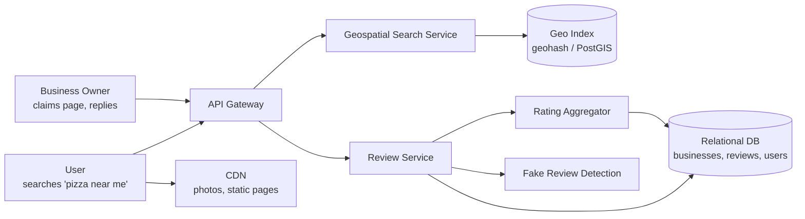
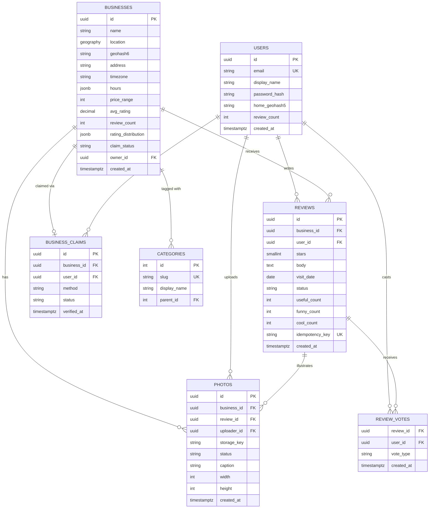
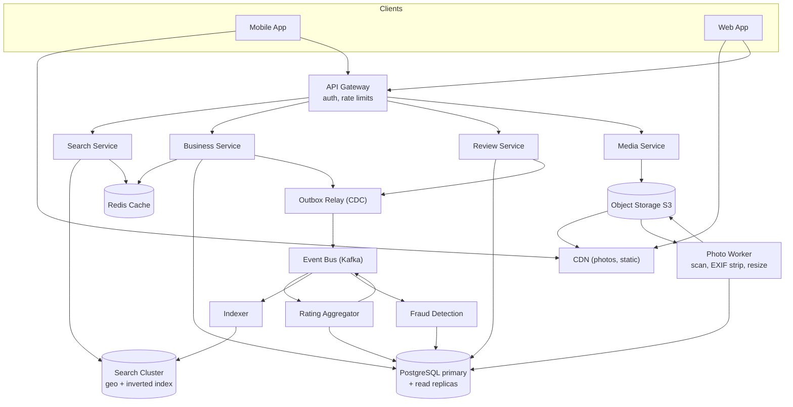

# Design Yelp

## Blogs and websites

- [Design a Local Business Review Site Like Yelp](https://www.hellointerview.com/learn/system-design/problem-breakdowns/yelp)

## Medium

## Youtube

- [FAANG System Design Interview: Design A Location Based Service (Yelp, Google Places)](https://www.youtube.com/watch?v=M4lR_Va97cQ)
- [9: Design Yelp/Google Places | Systems Design Interview Questions With Ex-Google SWE](https://www.youtube.com/watch?v=mMSJO4SrQLI)
- [Design Yelp, Meta Staff Product Architecture: Hello Interview Mock](https://www.youtube.com/watch?v=pFTyGG4mORk)

## Theory

### Topics Covered

1. [Introduction and Problem Statement](#introduction-and-problem-statement)
2. [Functional Requirements](#functional-requirements)
3. [Non-Functional Requirements](#non-functional-requirements)
4. [Capacity Estimation](#capacity-estimation)
5. [Characteristics](#characteristics)
6. [Components](#components)
7. [Design Patterns](#design-patterns)
8. [Benefits](#benefits)
9. [Pros](#pros)
10. [Cons](#cons)
11. [Challenges](#challenges)
12. [Best Practices](#best-practices)
13. [When to Use / When Not to Use](#when-to-use--when-not-to-use)
14. [Use Cases](#use-cases)
15. [API Design and Contract](#api-design-and-contract)
16. [Data Modeling](#data-modeling)
17. [High-Level Design](#high-level-design)
18. [Deep Dive](#deep-dive)
19. [Java and Spring Boot Implementation Guide](#java-and-spring-boot-implementation-guide)
20. [Interview Questions and Answers](#interview-questions-and-answers)

---

### Introduction and Problem Statement

Design a location-based business discovery and review platform — like Yelp, Google Places, or TripAdvisor — where users can search for local businesses (restaurants, plumbers, dentists) near a geographic location, filter and rank results, read and write reviews with star ratings, upload photos, and where business owners can claim and manage their business pages.

The core problem the platform solves is **information asymmetry in local commerce**: a user standing in an unfamiliar neighborhood has no reliable way to know which of the ten nearby restaurants is worth visiting. The platform aggregates the distributed experience of thousands of past customers into a searchable, ranked, trustworthy index keyed by geography.

The design has three distinctive technical tensions:

- **Geospatial search at read scale** — the dominant query is "businesses of category C within radius R of point P, sorted by relevance." This cannot be answered by a B-tree index; it requires a spatial indexing strategy (geohash, quadtree, or PostGIS `GiST` index on a geometry column).
- **Write amplification from a single review** — one review write must update the review table, the business's aggregate rating (average stars, review count), the search index document, and possibly fraud-detection pipelines. A naive synchronous design makes review posting slow and brittle.
- **Trust** — star ratings drive real revenue, so the system is under constant adversarial pressure from fake positive reviews (by owners) and fake negative reviews (by competitors). Detection must be designed in, not bolted on.



**Why this is a good interview problem**

- It combines geospatial indexing, read-heavy caching, search ranking, and eventual consistency in one familiar product.
- It has an honest scale story: read QPS dwarfs write QPS (~100:1), so the interesting work is on the read path and the integrity path, not write sharding.
- It forces a nuanced consistency discussion: ratings can be eventually consistent, but a posted review must never be lost, and a claimed business must be owned by exactly one account.

**Real-life use cases**

- **Restaurant discovery**: a user searches "ramen open now within 2 km," sorted by rating.
- **Home services**: a homeowner finds a highly rated plumber nearby and reads recent reviews.
- **Travel planning**: a tourist browses top-rated attractions near their hotel.
- **Business reputation management**: an owner claims their page, responds to reviews, and uploads photos.

---

### Functional Requirements

Actors: **users** (searchers and reviewers), **business owners** (claim and manage pages), **moderators/admins**, and platform services (search indexer, fraud detection).

1. **Add and manage businesses** — Business data is seeded from data providers/imports and enriched by owners. A business has a name, category, address, lat/long, hours, price range, and attributes (wifi, parking, outdoor seating).
2. **Search businesses by location** — Given a lat/long (or a place name resolved to lat/long), a radius, and optional filters (category, price range, "open now"), return matching businesses. This is the primary query of the system.
3. **Text search with filters** — Users search by keyword ("vegan pizza") combined with location and structured filters. Keyword matching runs against name, category, menu, and review text.
4. **Rank results** — Results are ranked by a blend of distance, average rating, review count, and recency of activity; users can re-sort by distance, rating, or review count.
5. **View a business page** — Shows business details, aggregate star rating and distribution (how many 5-star, 4-star, …), photos, and a paginated review list (sortable by newest, highest, lowest, most helpful).
6. **Write a review** — An authenticated user posts a 1–5 star rating with text and optional photos for a business. One active review per user per business (edits replace; a new review supersedes or updates the old one — pick a policy and state it).
7. **Edit and delete a review** — Users can modify or remove their own reviews; aggregates are recomputed accordingly.
8. **Upload photos** — Users and owners upload photos attached to a business or a review; photos are stored in object storage and served via CDN.
9. **Rate review helpfulness** — Users mark reviews "useful/funny/cool"; counts influence review ordering.
10. **Claim a business** — An owner verifies ownership (phone/postcard/domain verification) and gains the ability to edit business info, respond to reviews, and view analytics.
11. **Report content** — Users flag reviews/photos for moderation; flagged items enter a moderation queue.

Out of scope for the basic version (touched in [Deep Dive](#deep-dive)): reservations/waitlist, food ordering and delivery, messaging between users and owners, ads/sponsored placement.

---

### Non-Functional Requirements

Quantified targets drive every downstream design decision; state assumptions explicitly.

- **Scale**: 100 M registered users, 30 M MAU, ~5 M DAU; 150 M businesses listed globally (Yelp-scale reference: ~250 M cumulative reviews, ~6 M claimed businesses); 1 M new reviews/day; 500 K photo uploads/day.
- **Read-to-write ratio**: Search + business-page reads ≈ 500 K requests/day-peak-hour heavy; overall read:write ≈ **100:1**. The system is unambiguously read-optimized.
- **Latency**: Search p99 < 300 ms; business page p99 < 200 ms (cached); review post p99 < 500 ms acknowledged (aggregates settle asynchronously within seconds).
- **Availability**: Search and read paths target 99.95% (a user who cannot search generates zero value and zero data). Review writes target 99.9% — brief degradation acceptable, but **no acknowledged review may be lost** (durability over availability on the write path).
- **Consistency**:
  - Reviews themselves: durable immediately (committed to the primary DB before acknowledging).
  - Aggregate star rating, review counts, search-index visibility: **eventually consistent**, target staleness < 5 s (a user may not see their review reflected in the average instantly — acceptable).
  - Business claim/ownership: strongly consistent — exactly one verified owner account per business.
- **Durability**: Reviews and photos are user-generated content with legal and reputational weight — replicated storage, PITR backups; photos in object storage with 11-nines-class durability (e.g., S3 Standard).
- **Freshness**: New businesses and edits searchable within ~1 minute; new reviews visible on the business page within seconds.
- **Security and privacy**: User PII (email, location history) protected in transit (TLS) and at rest; precise user location never persisted beyond session need (store coarse geohash, not raw GPS trail); GDPR/CCPA deletion support.
- **Integrity**: Fake-review and review-bombing defenses must keep measured rating integrity high — detection latency < 1 hour for batch signals, real-time for obvious abuse (rate limits, velocity checks).

---

### Capacity Estimation

Back-of-envelope math for a Yelp-scale deployment. Round aggressively and state assumptions.

**Assumptions**

- 30 M MAU, ~5 M DAU.
- Each daily active user performs ~4 searches and ~10 business-page views → **20 M searches/day**, **50 M page views/day**.
- 1 M new reviews/day; 500 K photo uploads/day (avg 2 MB raw, ~500 KB after resizing).
- 150 M businesses; 300 M cumulative reviews; 2 B cumulative photos.

**QPS**

- Search: 20 M / 86,400 ≈ **230 QPS average**, peak (~3× average at lunch/dinner) ≈ **700 QPS**.
- Business page views: 50 M / 86,400 ≈ **580 QPS average**, peak ≈ **1,700 QPS**.
- Review writes: 1 M / 86,400 ≈ **12 QPS average**, peak ≈ **40 QPS** — trivially small for a single primary DB.
- Photo uploads: 500 K / 86,400 ≈ **6 QPS**.

Conclusion: writes are negligible; the entire design budget goes to the **read path** (geo search + page reads) and to **media storage/serving**.

**Storage**

- Business row: id (8 B) + name (~50 B) + category (8 B) + lat/long (16 B) + address (~150 B) + hours/attributes JSON (~500 B) + rating aggregates (~30 B) ≈ **~800 B/row**, ~1.2 KB with indexes.
  - 150 M × 1.2 KB ≈ **~180 GB** for businesses — fits on one beefy primary with replicas; shard only if going multi-region.
- Review row: ids (24 B) + stars (1 B) + text (~500 B avg) + metadata (~100 B) ≈ **~700 B/row**, ~1 KB with indexes.
  - Growth: 1 M/day × 365 ≈ 365 M reviews/year ≈ **~365 GB/year**; existing corpus ~300 GB. Review tables need partitioning (by created_month or business_id hash) within a few years.
- Photos: 500 K/day × 500 KB (resized) ≈ **250 GB/day ≈ 90 TB/year** new media; existing ~2 B × 500 KB ≈ **1 PB**. This mandates object storage (S3/GCS) + CDN — never store images in the relational DB, only URLs/metadata.
- User rows: 100 M × ~500 B ≈ 50 GB.

**Bandwidth**

- Search response: 20 results × 400 B ≈ 8 KB → 20 M × 8 KB ≈ **160 GB/day** API egress.
- Photo delivery dominates: assume 100 photo views per daily user × 200 KB (CDN-cached resized image) × 5 M DAU ≈ **100 TB/day** through the CDN — a CDN is not optional at this scale; origin egress is reduced ~95% by CDN cache hits.

**Memory / cache**

- Hot set: top ~1% of businesses generate most traffic (power law) → 1.5 M business pages × 2 KB rendered payload ≈ **~3 GB** — easily cached in Redis/Memcached.
- Geo index: 150 M geohash entries × ~32 B (id + geohash prefix) ≈ **~5 GB** — fits in memory on a small cluster of index nodes.

---

### Characteristics

- **Read-dominated workload (~100:1)**
  Searches and page views vastly outnumber review writes. This licenses aggressive caching, read replicas, and a denormalized search index, and it means the write path can favor correctness and simplicity over raw throughput.
- **Geography is the primary key of the product**
  Almost every meaningful query is anchored to a point and a radius. Unlike a social network (keyed by user) or a storefront (keyed by SKU), the natural partitioning dimension here is *space*, which shapes indexing (geohash/quadtree/PostGIS) and sharding (geographic cells).
- **Two audiences with conflicting incentives**
  Consumers want honest, negative-when-deserved reviews; business owners want flattering pages. The platform's asset is *trust*, so integrity systems (fraud detection, moderation) are first-class components, not afterthoughts.
- **Small strong-consistency boundary**
  Only a few invariants need strict serialization: one active review per (user, business), one verified owner per business, idempotent photo processing. Aggregates (average rating, counts) are safely eventually consistent. Recognizing this small boundary avoids over-engineering distributed transactions.
- **Perishable, time-sensitive data mixed with evergreen data**
  Reviews and photos accumulate forever, but hours, menus, and "open now" status change constantly. The index must handle both slowly changing documents and frequently refreshed fields.
- **Power-law access pattern**
  A tiny fraction of businesses (popular restaurants in big cities) receive most of the traffic. Caching the hot set is extremely effective; the tail is served from the index and DB.
- **User-generated content with legal weight**
  Reviews are speech (defamation risk), photos carry copyright, and business data carries accuracy obligations. Takedown, moderation, and audit trails are operational requirements.
- **Heavy media footprint**
  Petabyte-scale photo storage with bursty upload patterns; serving must go through object storage + CDN with on-the-fly resizing to control egress cost.
- **Adversarial environment**
  Fake reviews, review bombing, competitor sabotage, and SEO spam create an ongoing arms race; ranking and fraud models need continuous retraining and rapid re-scoring pipelines.

---

### Components

Each component is described by purpose, responsibilities, how it works, relationships, and a real-world analogue.

#### 1. API Gateway

- **Purpose**: Single entry point for all client traffic (mobile apps, web, partner APIs).
- **Responsibilities**: TLS termination, authentication token validation, rate limiting per user/IP/API key, request routing, request/response logging, and basic abuse filtering (bot heuristics, geo-IP blocks).
- **How it works**: Stateless tier behind a load balancer; validates JWTs locally (asymmetric signature check, no DB call), attaches a trusted `user-id` header to downstream requests, and enforces token-bucket rate limits backed by Redis.
- **Relationships**: Fronts every internal service; emits access logs to the observability pipeline and rate-limit signals to fraud detection.
- **Real-world example**: Yelp and Google use edge gateways (e.g., Envoy-based) similar to AWS API Gateway or Kong in smaller deployments.

#### 2. Search Service (Geospatial + Text)

- **Purpose**: Answer "businesses matching filters near point P, ranked."
- **Responsibilities**: Parse the query (location, keyword, filters, sort), resolve place names to lat/long via geocoding, execute the geo-text query against the search index, apply ranking, and return a hydrated result page.
- **How it works**: Queries a search engine cluster (Elasticsearch/OpenSearch with `geo_point` fields, or a purpose-built index over geohash cells). The engine prunes candidates by geohash prefix / geo-bounding-box, applies structured filters (category, price, open now), scores with a blended function (text relevance × rating quality × distance decay), and returns top-K business IDs. The service hydrates IDs with business fields from cache/DB.
- **Relationships**: Reads from the search index cluster and the business cache; receives index updates from the Indexer; calls the Ranking component (can be in-process scoring or a separate reranker).
- **Real-world example**: Yelp historically used a custom Lucene-based geo index; Foursquare and many clones use Elasticsearch `geo_distance` queries.

#### 3. Business Service

- **Purpose**: Source of truth for business entities.
- **Responsibilities**: CRUD for business profiles, hours and attributes, ownership claims and verification workflow, and serving hydrated business pages.
- **How it works**: Spring Boot service over PostgreSQL with read replicas; hot business pages cached in Redis with short TTL (30–120 s) plus cache-aside invalidation on writes. Claim workflow transitions `UNCLAIMED → PENDING_VERIFICATION → CLAIMED` with a verified owner FK constraint.
- **Relationships**: Owns the `businesses` and `business_claims` tables; publishes change events (create/update/hours-change) to the event bus for the Indexer; consumed by Search Service for hydration.
- **Real-world example**: Analogous to Google Business Profile management plus the Yelp owner dashboard.

#### 4. Review Service

- **Purpose**: Source of truth for reviews and ratings.
- **Responsibilities**: Create/edit/delete reviews with the one-active-review-per-(user, business) invariant, store helpfulness votes, serve paginated review lists, and enforce idempotency on submission (client-supplied idempotency keys).
- **How it works**: Writes commit to PostgreSQL in a single transaction (insert review + unique constraint on `(business_id, user_id)` active review). After commit, emits a `ReviewCreated/Updated/Deleted` event to the message queue — aggregates and the search index update asynchronously from these events.
- **Relationships**: Owns `reviews` and `review_votes` tables; publishes events consumed by Rating Aggregator, Fraud Detection, and Indexer; serves data to the business page.
- **Real-world example**: The write path mirrors how Amazon product reviews separate the review store from the aggregate rating pipeline.

#### 5. Rating Aggregator

- **Purpose**: Keep denormalized rating aggregates fresh.
- **Responsibilities**: Maintain `avg_rating`, `review_count`, and per-star distribution on the business row/document; recompute on review create/edit/delete and on fraud reclassification.
- **How it works**: Consumes review events from the queue; applies an incremental delta update (`new_sum = old_sum + stars`, `count + 1`) with idempotency via event IDs; periodically reconciles with a full recount job. Uses a weighted average (e.g., Bayesian average pulling toward the global mean) so a business with one 5-star review does not outrank one with 500 reviews at 4.6.
- **Relationships**: Writes to the businesses table and emits `RatingUpdated` for the Indexer; consumes from the Review Service's event stream.
- **Real-world example**: The same pattern as IMDb's weighted rating and Amazon's "global ratings" pipeline.

#### 6. Media Service (Photos)

- **Purpose**: Handle photo upload, processing, and serving metadata.
- **Responsibilities**: Issue pre-signed upload URLs, validate content type/size, trigger async processing (virus scan, EXIF stripping, resizing into thumbnails), store photo metadata (business_id, uploader, caption, review linkage), and manage moderation state.
- **How it works**: The client requests a pre-signed POST URL; upload goes **directly to object storage** (no proxying through app servers). An object-created event triggers a worker that scans, strips EXIF GPS data (privacy), generates 3–4 sizes, and marks the photo `ACTIVE`. Serving is via CDN URLs pointing at processed variants.
- **Relationships**: Writes photo metadata to the DB; object storage + CDN serve bytes; moderation consumes flagged-photo events.
- **Real-world example**: Standard S3 + CloudFront + Lambda resize pattern used by Yelp, Instagram, and Airbnb.

#### 7. Fraud and Moderation Service

- **Purpose**: Protect rating integrity.
- **Responsibilities**: Score new reviews for fake/spam probability in near-real-time, run batch graph analysis (review rings, coordinated bombing), manage the user-reported flag queue, and apply actions (hide review, exclude from aggregate, shadow-ban account).
- **How it works**: Two tiers — (a) synchronous cheap checks at write time (velocity limits, new-account throttles, duplicate text hash) and (b) async ML scoring consuming review events (text features, reviewer history, device/IP graph, temporal bursts). Reviews above a threshold are quarantined and excluded from aggregates via `ReviewQuarantined` events that the Aggregator also consumes.
- **Relationships**: Consumes the same event stream as the Aggregator; writes moderation state back to the review row; feeds account signals to the API Gateway's abuse rules.
- **Real-world example**: Yelp's "review recommendation software" and Amazon's verified-purchase + ML fake-review classifiers.

#### 8. Indexer (Search Index Pipeline)

- **Purpose**: Keep the search index eventually consistent with the source of truth.
- **Responsibilities**: Consume business/review/rating events, build denormalized search documents (business fields + aggregate rating + geohash), and bulk-index them; run periodic full re-indexes for schema changes and drift repair.
- **How it works**: Stream processing over the event bus with a dead-letter queue; documents are versioned so out-of-order events are dropped when stale (last-write-wins by event timestamp/version).
- **Relationships**: Consumes events from Business, Review, and Aggregator services; writes to the search cluster used by the Search Service.
- **Real-world example**: The standard CDC-based pipeline (Debezium/Kafka → Elasticsearch) used across marketplaces.

#### 9. Cache Layer

- **Purpose**: Absorb the read-heavy hot path.
- **Responsibilities**: Cache business pages, hot search queries (keyed by geohash cell + filters), aggregate ratings, and rate-limit counters.
- **How it works**: Redis cluster with cache-aside reads, short TTLs plus explicit invalidation events; search-result caching is keyed on a *coarse* geohash (precision ~5, ~5 km cell) so nearby users share cache entries.
- **Relationships**: Sits in front of Business Service, Search Service, and the Aggregator read paths.
- **Real-world example**: Yelp's heavy use of Memcached; Redis equivalent in modern stacks.

#### 10. Event Bus / Message Queue

- **Purpose**: Decouple the write path from aggregation, indexing, and fraud.
- **Responsibilities**: Durable, ordered-ish delivery of domain events with at-least-once semantics and replay capability.
- **How it works**: Kafka (or SQS/SNS at smaller scale) with topics per aggregate (`review-events`, `business-events`); consumers are idempotent by event ID.
- **Relationships**: Connects Review/Business services (producers) to Aggregator, Indexer, and Fraud (consumers).
- **Real-world example**: Kafka at Yelp (they are a well-known Kafka shop, authors of the "kafka-python" ecosystem tools).

---

### Design Patterns

Each pattern is described by what it is, the problem it solves here, how it is applied, when to use it, when not to, advantages, disadvantages, and a concrete example in this system.

#### 1. Cache-Aside (Lazy Loading)

- **What**: The application checks the cache first; on a miss it reads the database, populates the cache, and returns.
- **Problem**: 50 M business-page views/day would hammer the database, but only a power-law hot set is actually read repeatedly.
- **How applied**: Business page reads check Redis (`biz:{id}`) before hitting a read replica; writes invalidate or overwrite the key with a short TTL as a safety net.
- **When to use**: Read-heavy workloads with tolerant staleness (seconds) and a hot subset of keys.
- **When not to use**: When reads must be strongly consistent (e.g., seat inventory), or when the working set has no locality (uniform random reads cache poorly).
- **Advantages**: Simple, resilient (cache failure degrades to DB reads), only caches what is actually requested.
- **Disadvantages**: First-hit miss latency; potential stale reads between write and invalidation; cache stampedes on hot-key expiry (mitigate with request coalescing/per-key locks).
- **Example**: A viral restaurant's page is served from Redis at 1,700 QPS peak while the DB sees only misses and writes.

#### 2. Event-Driven Aggregation (CQRS-lite)

- **What**: Writes commit to the source-of-truth store; derived read models (aggregates, search documents) are updated asynchronously from domain events.
- **Problem**: One review write fans out to aggregate rating, search index, and fraud pipeline; doing all of this synchronously in the request path would make posting slow and couple availability of review writes to three other systems.
- **How applied**: Review Service commits the review row transactionally, then emits `ReviewCreated`; Aggregator, Indexer, and Fraud consume independently at their own pace.
- **When to use**: When one write feeds multiple read models, and those read models tolerate seconds of staleness.
- **When not to use**: When the read model must be consistent with the write in the same request (e.g., "decrement seats and show the new count immediately" — do that transactionally instead).
- **Advantages**: Fast, decoupled writes; independent scaling and failure isolation of consumers; replayable history for rebuilding indexes.
- **Disadvantages**: Eventual consistency (user may not see their rating reflected instantly); operational complexity of a message bus; requires idempotent consumers and ordering discipline.
- **Example**: The Aggregator consumes `ReviewCreated` and updates `avg_rating` within ~2 s; the Indexer re-indexes the business document in the same window.

#### 3. Geohash-Based Spatial Indexing

- **What**: Encode lat/long into a hierarchical string where shared prefixes encode shared geographic cells; index businesses by their geohash so "nearby" becomes a prefix/range query.
- **Problem**: B-tree indexes cannot answer 2-D proximity queries efficiently.
- **How applied**: Businesses are indexed by geohash (precision ~6, ~1 km cells) in the search engine; a radius query computes the covering cell set (target cell + neighbors) and filters precisely by haversine distance afterward.
- **When to use**: Read-heavy proximity search over mostly static points; when you want cheap cache keys per cell too.
- **When not to use**: For rapidly moving points (drivers in a ride-hailing app need different structures), or when PostGIS already covers your scale with less code.
- **Advantages**: Works on top of ordinary string/range indexes; natural cache-key structure; easy cell-based sharding.
- **Disadvantages**: Edge effects (two nearby points can fall in different cells → must query neighbor cells); unequal cell sizes across latitudes; prefix math is subtle to get right.
- **Example**: "Restaurants within 2 km" → geohash cell set of ~9 precision-5 cells → filter by category + exact distance → rank. See [Deep Dive](#deep-dive) for the geohash vs PostGIS vs quadtree comparison.

#### 4. Pre-Signed URL Upload (Direct-to-Storage)

- **What**: The server signs a short-lived URL that lets the client upload a file directly to object storage.
- **Problem**: Proxying 500 K photo uploads/day (2 MB each) through application servers wastes bandwidth, memory, and connection capacity on the app tier.
- **How applied**: `POST /photos/upload-url` returns an S3 pre-signed POST; the client uploads directly; an `ObjectCreated` event triggers the processing worker.
- **When to use**: Any sizable file upload where the server only needs to authorize and later process, not inspect bytes inline.
- **When not to use**: When you must validate file content before it lands in storage (compliance), or for tiny payloads where the extra round trip is not worth it.
- **Advantages**: App tier never touches the bytes; scales with object storage; built-in retry/resume semantics from S3 SDKs.
- **Disadvantages**: Orphaned uploads if the client never confirms (need lifecycle cleanup); processing is async so the photo is not instantly visible; slightly more complex client flow.
- **Example**: The mobile app gets an upload URL, PUTs a 2 MB JPEG to S3, and the resize worker publishes CDN URLs 3 s later.

#### 5. Circuit Breaker + Graceful Degradation

- **What**: Wrap calls to a dependency; after repeated failures, fail fast for a cooldown period instead of piling up timeouts.
- **Problem**: If the search cluster or fraud scorer degrades, the whole read path must not hang — search is 700 QPS peak and thread pools exhaust in seconds under slow dependencies.
- **How applied**: Search Service wraps ranking-model and hydration calls with Resilience4j circuit breakers; fallbacks: serve cached popular results, drop personalization, or skip photo hydration.
- **When to use**: Any synchronous cross-service call on a latency-critical path.
- **When not to use**: For cheap in-process calls, or where a fallback is worse than an error (e.g., payment authorization).
- **Advantages**: Contains cascading failures; fast failure frees resources; fallbacks preserve a degraded but useful product.
- **Disadvantages**: Tuning thresholds is empirical; fallbacks can mask real problems if not monitored; half-open probing adds complexity.
- **Example**: When the ML reranker exceeds its error budget, search falls back to the static blended score (distance × rating) with zero user-visible outage.

#### 6. Outbox Pattern

- **What**: Write the domain event to an `outbox` table in the same transaction as the entity change; a relay publishes outbox rows to the message bus.
- **Problem**: "Commit review to DB, then publish event" is not atomic — a crash between the two loses the event, and aggregates drift silently.
- **How applied**: Review insert + outbox row insert in one transaction; a CDC relay (Debezium) streams outbox rows to Kafka; consumers are idempotent by event ID.
- **When to use**: Whenever events must be reliably emitted off the back of a relational write.
- **When not to use**: For events with no consistency requirement (fire-and-forget analytics beacons can be sent inline).
- **Advantages**: At-least-once, no dual-write inconsistency; ordering per entity is easy (partition by business_id).
- **Disadvantages**: Extra table + relay infrastructure; at-least-once means consumers must dedupe; slight added write latency.
- **Example**: A review commit can never be acknowledged without its `ReviewCreated` event eventually reaching the Aggregator and Indexer.

---

### Benefits

- **Trust as a compounding asset**: Every genuine review makes the platform more useful, which attracts more users, which generates more reviews — a data network effect that is hard for competitors to bootstrap.
- **Read-path economics**: The 100:1 read ratio plus power-law hot set means ~95% of traffic is served from cache/CDN, keeping origin infrastructure small relative to audience size.
- **Decoupled write fan-out**: Event-driven aggregation lets each downstream concern (rating math, search indexing, fraud) scale, fail, and deploy independently.
- **Geographic modularity**: Geo-cell indexing doubles as a sharding and caching scheme, so regional growth maps to adding index partitions rather than redesigning.
- **Owner engagement loop**: Claimed pages, review responses, and analytics give businesses a reason to keep data (hours, menus, photos) fresh for free — crowdsourced data quality.
- **Defensible ranking**: Blending distance, rating quality (Bayesian average), review count, and recency resists both gaming (a single 5-star review cannot top the list) and staleness (dead businesses sink).

---

### Pros

- **Familiar product surface**: Users already understand search → map/list → business page → reviews; no behavior education needed.
- **Clear scaling story**: Writes are tiny (~40 QPS peak); all investment goes to read path, cache, and index — a well-understood problem.
- **Strong consistency only where cheap**: The invariants (one active review per user/business, one owner per business) are single-row constraints — trivially enforced in PostgreSQL without distributed coordination.
- **Media scale is outsourced**: Object storage + CDN absorbs the petabyte problem with commodity tooling.
- **Event stream as an asset**: The same review/business event feed powers aggregation, indexing, fraud, analytics, and future features (recommendations) without new write-path work.
- **Graceful degradation built in**: Cached pages, static fallback ranking, and CDN-served photos keep the product useful through partial outages.

---

### Cons

- **Cold-start problem**: A review platform with no reviews is useless; density matters per city, so launch must be seeded (data imports, incentives) market by market.
- **Permanent adversarial cost**: Fake-review detection is an ongoing arms race requiring ML investment, human moderation, and policy enforcement forever — it never becomes "done."
- **Eventual-consistency UX edges**: Users post a review and the average does not move for a few seconds; support and UI copy must handle "where is my review?" gracefully.
- **Index drift risk**: The denormalized search index can silently diverge from the source of truth (lost events, bugs); requires reconciliation jobs and monitoring, i.e., operational overhead.
- **Geo-edge complexity**: Geohash neighbor-cell handling, dateline/pole edge cases, and radius-vs-cell mismatches are recurring bug farms.
- **Legal and safety exposure**: Defamation claims, GDPR erasure of reviews and location history, and photo copyright takedowns require legal-grade audit trails and deletion pipelines.
- **Cache invalidation surface**: Ratings, hours, and "open now" change constantly; every cached artifact needs a TTL/invalidation policy, and misses are user-visible ("this place was marked open but is closed").

---

### Challenges

**Technical**

- Answering "within R of P" plus text relevance plus structured filters in one sub-300 ms query requires blending an inverted index with a spatial index — off-the-shelf engines each make different trade-offs (see Deep Dive).
- Review fan-out correctness: the outbox relay, idempotent consumers, and versioned documents must all be right, or ratings and the search index silently drift from truth.
- "Open now" is deceptively hard: per-business weekly hours, holidays, time zones, and DST — computing it at query time for thousands of candidates is too slow, so it must be precomputed into the index and refreshed.

**Scalability**

- Geo-cell hotspots: dense urban cores (Manhattan, central Tokyo) put orders of magnitude more businesses and queries into a few cells than rural cells — naive cell sharding creates hot partitions that need sub-cell splitting.
- Review table growth (~365 GB/year) forces partitioning and archival strategy decisions early; table bloat degrades the one latency-sensitive write path the system has.
- Cache keyspace for search results is enormous (query × location × filters); only coarse-geohash keys and short TTLs keep it tractable.

**Performance**

- Tail latency on search is set by the slowest index shard (fan-out queries) — shard sizing, replica count, and hedged requests matter more than median tuning.
- Hydration N+1: fetching 20 business docs individually per search adds latency; requires batch/multi-get from cache and denormalized index documents.
- Photo-heavy business pages need lazy loading, responsive image sizes, and CDN cache-hit ratios above ~95% to stay within egress budget.

**Reliability**

- Losing an acknowledged review is a trust-destroying event; the write path (transaction + outbox + durable queue) must survive instance and broker failures.
- A poisoned or corrupted search index must be rebuildable from the event log/DB within an RTO of ~1 hour.
- CDN or object-storage outage must degrade to lower-resolution images or text-only pages, not a dead product.

**Maintainability**

- Ranking and fraud models decay; the retraining and redeploy pipeline must be routine, not heroic.
- Multiple read models (cache, index, aggregates) each with their own staleness semantics make debugging "wrong data" reports non-trivial — requires strong correlation IDs and event tracing.
- Schema evolution across 150 M indexed documents demands dual-write or backfill re-index strategies for every field change.

**Operational**

- Moderation queues, owner disputes, legal takedowns, and GDPR erasure requests are daily operational workloads, not exceptions — they need tooling and SLAs.
- Data-provider imports (new business listings) conflict with owner-edited data; merge/precedence rules must be operable by non-engineers.
- Re-indexing 150 M documents for a schema change is a multi-hour operation that must run without search downtime (alias swapping).

**Security**

- Account takeover turns into fake-review farms and owner-impersonation; MFA for claimed businesses is effectively mandatory.
- Pre-signed upload URLs must be tightly scoped (content-type, size, expiry) to avoid becoming a malware hosting service.
- Location privacy: storing or leaking precise user location history creates severe regulatory and safety exposure.

---

### Best Practices

- **Keep the strong-consistency boundary tiny.** Enforce only single-row invariants (unique active review per user/business; unique verified owner) transactionally, and make everything else eventually consistent. *Why*: distributed transactions across aggregates, index, and fraud would collapse availability and latency for invariants that users do not actually perceive.
- **Never serve media bytes from the app tier.** Pre-signed uploads and CDN serving exist because *why* is simple: photo traffic is 100 TB/day; app servers would be 99% bandwidth infrastructure instead of business logic.
- **Cache search results on coarse geohash keys.** Two users 200 m apart should share a cache entry. *Why*: exact lat/long keys have near-zero hit rates; precision-5 cells convert the power-law of queries into a power-law of keys, which is what caches exploit.
- **Use Bayesian averaging for ratings.** `score = (v/(v+m))·R + (m/(v+m))·C` with `v` = review count, `R` = mean, `m` = prior weight, `C` = global mean. *Why*: a raw average lets a business with one 5-star review outrank a 4.6-average business with 2,000 reviews — statistically wrong and gameable.
- **Emit events through an outbox, not inline.** *Why*: "commit then publish" has a crash window that loses events; aggregates and indexes then drift from truth invisibly until a user complaint surfaces it weeks later.
- **Make every consumer idempotent by event ID.** *Why*: at-least-once delivery is the realistic guarantee; replay after failures or re-indexing would otherwise double-count ratings.
- **Strip EXIF GPS data from uploaded photos before publishing.** *Why*: phone photos routinely embed the uploader's home coordinates — publishing them is a privacy incident at scale.
- **Rate-limit by identity, IP, and device simultaneously.** *Why*: fake-review farms rotate any single signal; layered velocity checks catch bursts that no single dimension reveals.
- **Version search documents and use last-write-wins by version.** *Why*: events arrive out of order (rating update vs. hours update); without versioning, a stale document can overwrite a fresher one permanently.
- **Precompute "open now" into the index on a schedule.** *Why*: evaluating recurring hours × time zones × holidays for thousands of candidates inside a 300 ms query budget is infeasible; a 15-minute refresh job makes it a boolean filter.
- **Design for re-indexing from day one.** Keep the event log and the source DB sufficient to rebuild the entire search index. *Why*: schema changes, ranking experiments, and index corruption are certainties over a multi-year lifespan.

---

### When to Use / When Not to Use

**Use this architecture when**

- The product is fundamentally "find entities near a point, ranked by social proof" — local discovery, store locators with reviews, classifieds with location.
- Reads dominate writes by at least an order of magnitude, so cache + denormalized index investment pays off.
- Points of interest are mostly static (businesses move rarely), making geohash/PostGIS indexing effective.
- Rating aggregates may lag writes by seconds without harming the user experience.
- You can staff or outsource the ongoing trust-and-safety workload (fraud models, moderation).

**Do not use this architecture when**

- **Real-time moving targets**: tracking drivers or couriers needs streaming location pipelines (e.g., Redis GEO with frequent updates, or dedicated systems) — a re-index-per-move model collapses.
- **Strongly consistent reads of aggregates**: if a counter must be exact on every read (financial balances, inventory), event-driven aggregation is the wrong tool; compute transactionally.
- **Tiny scale**: a single-town directory with 500 businesses needs one PostgreSQL with PostGIS and a server-rendered app — the event bus, search cluster, and CDN are over-engineering; state this explicitly in interviews.
- **No moderation capability**: launching UGC reviews without fraud detection and takedown capacity is a legal and reputational liability, not an MVP.
- **Write-heavy social feeds**: if the core loop is high-frequency posting by connected users (Twitter-like), a fan-out-on-write feed architecture fits better than a geo-search-centric one.

---

### Use Cases

Each use case is described with a real-world example.

- **Nearby restaurant discovery**: A user in downtown Chicago searches "deep dish pizza" within 2 km, filtered to $$ price and "open now," sorted by rating. The Search Service resolves the query, prunes candidates by geo cells, filters, ranks with the blended score, and returns 20 hydrated results in < 300 ms. *(Yelp, Google Maps)*
- **Service professional selection**: A homeowner with a leaking water heater searches "plumber," reads recent reviews sorted by newest to detect current quality, and checks the 1-star distribution for red flags. *(Yelp home services, Angi)*
- **Travel exploration**: A tourist browses top-rated attractions near their hotel on a map view, where clustering aggregates businesses per map tile at low zoom. *(TripAdvisor, Google Places)*
- **Reputation management**: A restaurant owner claims their page via phone verification, corrects business hours (event → re-index within a minute), responds to a negative review, and uploads new menu photos via pre-signed URLs. *(Yelp for Business, Google Business Profile)*
- **Photo-first browsing**: A user opens a business page and scrolls 200 community photos served as CDN thumbnails, tapping for full size. The hot photo set is served with ~97% CDN cache-hit ratio. *(Yelp, Google Maps photo galleries)*
- **Abuse response**: A business is review-bombed after a viral news story. Fraud detection flags the burst (velocity + new-account signals), quarantines suspect reviews, the Aggregator excludes them from the average, and moderators adjudicate the queue. *(Yelp's "unusual activity alerts")*

---

### API Design and Contract

RESTful, versioned via URL prefix (`/v1`), JSON payloads, cursor-based pagination for feeds, offset-capable for small result sets. All authenticated endpoints use `Authorization: Bearer <JWT>`; write endpoints additionally require `Idempotency-Key` headers. Errors follow RFC 9457 problem-details shape.

**Common conventions**

- **Auth**: OAuth2/OIDC JWT access tokens (15 min) + refresh tokens; owner endpoints require the `business:owner:{id}` claim.
- **Rate limiting**: Token bucket per user and per IP. Defaults: search 30 req/min anonymous, 120 req/min authenticated; review writes 10/day per business per user, 50/day global. Exceeding returns `429` with `Retry-After`.
- **Pagination**: `cursor` (opaque, encodes sort key + id) for reviews; `limit` (default 20, max 50). Responses include `nextCursor` (null when exhausted) and never expose raw offsets for large feeds (offset pagination degrades and allows deep scraping).
- **Filtering/sorting**: Filters are query params; sorting via `sortBy=distance|rating|reviewCount|newest` with a defined default (`relevance`).
- **Validation**: Bean validation on every write DTO; failures return `400` with per-field errors.
- **Versioning**: URI major version (`/v1`); breaking changes ship `/v2` alongside; additive changes (new optional fields) ship in place. Deprecations announced via `Sunset` response header.

#### 1. Search businesses

```
GET /v1/businesses/search?lat=37.7749&long=-122.4194&radiusMeters=2000&category=restaurants
    &priceRange=2,3&openNow=true&query=ramen&sortBy=rating&limit=20&cursor=eyJ...
Authorization: Bearer eyJhbGciOi...
```

Response `200 OK`:

```json
{
  "results": [
    {
      "businessId": "biz_8f3k2",
      "name": "Tanaka Ramen",
      "categories": ["restaurants", "ramen"],
      "location": { "lat": 37.7755, "long": -122.4180, "address": "512 Post St, San Francisco, CA" },
      "distanceMeters": 340,
      "rating": { "average": 4.6, "weightedScore": 4.41, "count": 2314, "distribution": { "5": 1501, "4": 520, "3": 180, "2": 70, "1": 43 } },
      "priceRange": 2,
      "openNow": true,
      "photoThumbnailUrl": "https://cdn.example.com/photos/ph_91zm_320.jpg"
    }
  ],
  "nextCursor": "eyJsYXN0U2NvcmUiOjQuMzgsImxhc3RJZCI6ImJpel84ZjNrMiJ9"
}
```

Notes: `distanceMeters` computed server-side (haversine); `weightedScore` is the Bayesian score used for `sortBy=rating`; anonymous callers get a reduced `limit` max (10) and no `distribution`.

#### 2. Get business detail

```
GET /v1/businesses/biz_8f3k2
```

Response `200 OK` — full profile: hours per weekday, attributes, aggregate rating, photo count, top photos, claim status. Cached aggressively; `ETag`/`Cache-Control: public, max-age=60` headers allow client and CDN caching. `404` with `{"type":"https://api.example.com/problems/not-found","title":"Business not found"}` for unknown IDs.

#### 3. Create a review

```
POST /v1/businesses/biz_8f3k2/reviews
Authorization: Bearer eyJhbGciOi...
Idempotency-Key: 9b1d3c42-7e2f-4a1b-9c55-1a2b3c4d5e6f
Content-Type: application/json

{
  "stars": 5,
  "text": "The tonkotsu broth is outstanding. Line moves fast even at lunch rush.",
  "photoIds": ["ph_91zm", "ph_44ka"],
  "visitDate": "2026-02-14"
}
```

Response `201 Created`:

```json
{
  "reviewId": "rev_51qx",
  "businessId": "biz_8f3k2",
  "authorId": "usr_22ab",
  "stars": 5,
  "text": "The tonkotsu broth is outstanding. Line moves fast even at lunch rush.",
  "photoIds": ["ph_91zm", "ph_44ka"],
  "status": "PUBLISHED",
  "createdAt": "2026-02-15T18:42:11Z",
  "aggregateApplied": false
}
```

Validation and errors:

- `stars` required, integer 1–5; `text` required, 10–10,000 chars; `photoIds` must reference the caller's own `ACTIVE` photos → violations return `400` with field-level detail:
  ```json
  { "type": "https://api.example.com/problems/validation", "title": "Validation failed",
    "status": 400, "errors": [ { "field": "stars", "message": "must be between 1 and 5" } ] }
  ```
- Duplicate active review by the same user on the same business → `409 Conflict` with `{"title": "Active review already exists", "existingReviewId": "rev_9zz1"}` (client should call `PUT /v1/reviews/rev_9zz1` instead).
- Retried submission with the same `Idempotency-Key` → `200 OK` with the originally created review (no duplicate insert).
- `aggregateApplied: false` signals the rating average updates asynchronously (client UI should show the review under "your review" without expecting the average to move).

#### 4. List reviews for a business

```
GET /v1/businesses/biz_8f3k2/reviews?sortBy=newest&stars=5&limit=20&cursor=eyJ...
```

`sortBy` one of `newest|oldest|highest|lowest|mostHelpful`; `stars` filters by rating value. Cursor encodes `(sortKey, reviewId)` so pagination is stable under concurrent inserts — offset pagination would skip/duplicate items as new reviews land.

#### 5. Request photo upload URL

```
POST /v1/photos/upload-url
Authorization: Bearer ...
Content-Type: application/json

{ "fileName": "ramen.jpg", "contentType": "image/jpeg", "byteSize": 2048576, "businessId": "biz_8f3k2" }
```

Response `200 OK`:

```json
{
  "photoId": "ph_91zm",
  "uploadUrl": "https://s3.amazonaws.com/bucket/uploads/ph_91zm?X-Amz-Signature=...",
  "requiredHeaders": { "Content-Type": "image/jpeg" },
  "expiresAt": "2026-02-15T18:47:11Z"
}
```

Server enforces allow-listed content types (`image/jpeg|png|webp`), max 10 MB, and scopes the pre-signed policy to those constraints. A later `POST /v1/photos/ph_91zm/confirm` marks the upload complete and enqueues processing; unconfirmed photos are garbage-collected after 24 h.

#### 6. Claim a business

```
POST /v1/businesses/biz_8f3k2/claims
{ "method": "PHONE", "contactPhone": "+14155550123" }
```

`202 Accepted` — verification code dispatched; `PUT /v1/claims/{claimId}` with the code completes verification. Already-claimed business → `409`. Non-owners calling owner-only endpoints → `403`.

#### 7. Vote a review helpful

```
POST /v1/reviews/rev_51qx/votes
{ "vote": "USEFUL" }
```

Idempotent per (user, review, vote type): a second identical call returns `200` with the current counts; changing vote type replaces the previous one in one transaction.

**Status-code summary**: `200` reads/idempotent retries · `201` created · `202` async accepted (claims, processing) · `400` validation · `401` missing/expired token · `403` authenticated but not authorized (non-owner) · `404` unknown resource · `409` uniqueness conflicts · `429` rate limited (`Retry-After` header) · `5xx` server faults with correlation ID in the `traceId` field of the problem body.

---

### Data Modeling

PostgreSQL as source of truth. Spatial queries in the DB use `GEOGRAPHY(POINT)` + GiST (PostGIS); the search index holds denormalized documents built from these tables. Reviews are partitioned by `created_at` month at scale.



Key constraints and indexes:

- `UNIQUE (business_id, user_id) WHERE status = 'PUBLISHED'` (partial unique index on `REVIEWS`) — enforces one active review per user per business at the database level, race-proof.
- `REVIEW_VOTES` PK is `(review_id, user_id, vote_type)` — idempotent voting by construction.
- `BUSINESSES`: GiST index on `location`; B-tree on `geohash6` for cell lookups; index on `(claim_status)` for moderation queues.
- `REVIEWS`: indexes on `(business_id, created_at DESC)` for newest-first pages and `(business_id, stars)` for filtered views.
- `PHOTOS.status` transitions `PENDING_UPLOAD → PROCESSING → ACTIVE | REJECTED`; only `ACTIVE` photos are served.
- Denormalized columns `avg_rating`, `review_count`, `rating_distribution` on `BUSINESSES` are maintained by the Aggregator, never by the request path — the source of truth remains the `REVIEWS` table, and a reconciliation job can always recompute them.

---

### High-Level Design

#### System overview



**How to read this diagram.** The top half is the synchronous request path: clients hit the CDN for media and the API Gateway for data; the gateway fans out to four services, each owning its store. Reads lean on Redis and the search cluster; writes commit to PostgreSQL. The bottom half is the asynchronous backbone: every state change flows through the outbox relay into the event bus, where the Aggregator (ratings), Indexer (search documents), and Fraud service consume independently. Media never transits the app tier — uploads go straight to object storage, and a worker post-processes them. The critical architectural property is that the write path's availability depends only on PostgreSQL and the outbox, never on the search cluster or fraud pipeline.

#### Review submission sequence

```mermaid
sequenceDiagram
    autonumber
    participant U as User App
    participant GW as API Gateway
    participant RS as Review Service
    participant DB as PostgreSQL
    participant OB as Outbox Relay
    participant K as Event Bus
    participant AG as Rating Aggregator
    participant IX as Indexer
    participant FD as Fraud Detection
    participant SC as Search Cluster

    U->>GW: POST /v1/businesses/{id}/reviews (Idempotency-Key)
    GW->>GW: Validate JWT, rate-limit, attach user-id
    GW->>RS: Forward request
    RS->>DB: SELECT review WHERE idempotency_key = ?
    alt Duplicate submission
        DB-->>RS: existing review
        RS-->>U: 200 OK (original review)
    else New submission
        RS->>DB: BEGIN; INSERT review + outbox row; COMMIT
        Note over RS,DB: Partial unique index enforces<br/>one active review per (user, business)
        RS-->>U: 201 Created (aggregateApplied=false)
    end
    OB->>K: Publish ReviewCreated event
    par Async fan-out
        K->>AG: consume event
        AG->>DB: UPDATE businesses SET sum+=stars, count+=1 (idempotent by event id)
        K->>IX: consume event
        IX->>SC: Upsert versioned business document
        K->>FD: consume event
        FD->>DB: Quarantine review if score above threshold
    end
```

**How to read this diagram.** Steps 1–8 are the synchronous path and take well under the 500 ms budget: the only hard work is one transactional insert guarded by the idempotency-key lookup and the partial unique index. Everything after the commit (steps 9–16) is asynchronous fan-out. The parallel block shows the three independent consumers: the Aggregator updates denormalized counters, the Indexer refreshes the search document, and Fraud scores the review — each idempotent by event ID so replays are safe. Note that fraud runs *after* publication (fast UX) and can retroactively quarantine; systems that need pre-publication screening trade latency for safety.

---

### Deep Dive

#### 1. Geospatial search: geohash vs PostGIS vs quadtree

The central query — "entities of type T within radius R of point P" — has three mainstream implementations:

| Dimension | Geohash (string cells) | PostGIS (`GEOGRAPHY` + GiST) | In-memory quadtree |
|---|---|---|---|
| Data structure | Z-order curve encoded as base-32 string; shared prefix = shared cell | R-tree variant (GiST) over geometry bounding boxes | Recursive space-partitioning tree, 4 children per node |
| "Nearby" query | Compute target cell + 8 neighbors; range/prefix scan; haversine post-filter | `ST_DWithin(location, point, R)` uses the index directly | Descend tree to leaf cells covering the circle |
| Storage | Works in any DB or search engine (Lucene `geo_point` is geohash-like) | Lives inside PostgreSQL | Lives in application memory (custom service) |
| Update cost | Recompute string on move — cheap | Index update per move — moderate | Pointer surgery — cheap, but volatile |
| Scale ceiling | Billions of points (Lucene/ES clusters) | Comfortable to ~hundreds of millions of rows per table; one writer bottleneck | Limited by RAM of index nodes; needs sharding |
| Edge cases | Cell-boundary neighbors, latitude distortion, poles/dateline | Handled by the library (spherical math) | All edge cases are your problem |
| Cache synergy | Excellent — geohash prefix doubles as cache key | Poor — queries are continuous, not discrete | Moderate |
| Ops burden | Low (leverages existing index infra) | Lowest possible (one extension) | High (you own clustering, failover, rebalancing) |

**Recommendation for this system:** at interview scale, lead with **PostGIS** — one `GEOGRAPHY(POINT)` column, one GiST index, and `ST_DWithin` answer the query correctly with zero custom infrastructure, and 150 M businesses fit in a partitioned PostgreSQL table with read replicas. Graduate to **geohash-in-search-engine** (Elasticsearch `geo_point`) when you need text relevance + geo + filters in one query and horizontal index scaling — this is the production answer. Reserve **quadtrees** for the niche of frequently moving points held in memory (e.g., "available scooters right now"), where re-indexing per move is too slow and the dataset is small enough for RAM.

A common refinement is the **adaptive grid**: index dense cities at finer geohash precision (precision 7, ~150 m cells) and rural areas at coarser precision, so no single cell holds too many candidates — directly addressing the Manhattan hotspot problem.

Distance math: use the **haversine formula** for exact great-circle distance as a post-filter on candidates; for ranking at city scale, cheaper approximations (equirectangular projection) are acceptable since error is negligible under ~50 km.

#### 2. Business search with category and text filters

The production search document is denormalized:

```json
{
  "businessId": "biz_8f3k2",
  "name": "Tanaka Ramen",
  "nameSuggest": "tanaka ramen",
  "categories": ["restaurants", "ramen", "noodles"],
  "reviewText_rollup": "tonkotsu broth outstanding fast lunch",
  "location": { "lat": 37.7755, "lon": -122.4180 },
  "geohash": "9q8yykc",
  "priceRange": 2, "openNow": true, "avgRating": 4.6, "weightedScore": 4.41,
  "reviewCount": 2314, "lastReviewedAt": "2026-02-15T17:58:00Z", "docVersion": 9182
}
```

Query execution: (a) parse `query` with an analyzer chain (lowercase, ASCII-fold, synonyms: "eatery" → "restaurant"); (b) `bool` query combining `match` on name/category/rollup text with `geo_distance` filter and term filters (`categories`, `priceRange`, `openNow`); (c) score with `function_score` blending text relevance, `weightedScore`, and a Gaussian decay on distance; (d) return top-K IDs and hydrate from cache. Category hierarchies ("ramen" ⊂ "restaurants") are handled by indexing all ancestor slugs, so a filter on `restaurants` matches a ramen shop without query-time tree traversal.

#### 3. Review aggregation and star-rating computation

Two jobs, kept strictly separate:

- **Correctness job (incremental)**: on each review event, apply the delta (`sum += stars`, `count += 1`, `distribution[stars] += 1`) idempotently. Deletes and quarantines apply negative deltas. Edits apply the difference between old and new star values.
- **Quality job (scoring)**: the displayed sort key is the **Bayesian weighted score** `S = (v·R + m·C) / (v + m)` with global mean `C ≈ 4.0` and prior strength `m ≈ 50` reviews. A business with `v = 3, R = 5.0` scores ≈ 4.06; one with `v = 2000, R = 4.5` scores ≈ 4.49 — correctly ranked higher. `m` is tuned per vertical (restaurants review more than dentists).

A nightly reconciliation job recomputes aggregates from the `REVIEWS` table for a rotating slice of businesses, alerting on drift beyond a threshold — this is the safety net for the at-least-once pipeline.

#### 4. Ranking factors

Final ranking blends four families:

1. **Distance** — Gaussian decay `exp(-d²/2σ²)` with σ scaled to the query radius; beyond the radius the contribution vanishes.
2. **Rating quality** — the Bayesian `weightedScore`, not the raw average (see above).
3. **Popularity/confidence** — `log(reviewCount)` as a prior that more-reviewed businesses are safer bets; photo count and page-view velocity as secondary signals.
4. **Recency** — recent reviews weigh more (a restaurant declines); implemented as time-decayed sub-averages (`half-life ≈ 6 months`) feeding the quality term, plus `lastReviewedAt` boosts to bury dead listings.

Weights are learned offline (learning-to-rank on click/bookmark data) but shipped as an interpretable linear blend first — interpretability lets you debug ranking complaints, which is operationally mandatory for a trust product.

#### 5. Fake review detection

Layered defense, ordered cheap → expensive:

- **Write-time rules**: per-user velocity caps, new-account cooling-off periods, duplicate/near-duplicate text hashing (SimHash), IP/device reputation, one-review-per-business uniqueness.
- **Real-time ML scoring** on the event stream: text features (burst of generic superlatives, low specificity), reviewer features (account age, review graph — reviewing only one business or only competitors), temporal features (coordinated bursts within minutes).
- **Batch graph analysis** (nightly): reviewer–business bipartite graph analysis finds review rings (clusters of accounts cross-reviewing each other's businesses); PageRank-style trust propagation down-weights reviews from low-trust subgraphs.
- **Community signals**: user reports feed the moderation queue; "helpful" vote patterns corroborate genuine reviews.

Actions are graduated: exclude-from-aggregate (soft) → hide behind "not recommended" filter → remove + account sanction. All actions emit events so the Aggregator reverses their rating contribution, and every action is auditable/reversible for appeals. Yelp's real system ("review recommendation software") follows exactly this shape: algorithmic classification with an appeal path.

#### 6. Photo storage: object storage + CDN

- **Upload path**: pre-signed POST direct to S3 (`uploads/` prefix) → `ObjectCreated` event → worker: malware scan → EXIF strip (removes GPS — privacy-critical) → decode/validate → generate 4 renditions (thumbnail 160px, small 320px, medium 800px, large 1600px, WebP + JPEG fallback) → write `photos/` keys → mark `ACTIVE`.
- **Serving path**: clients always receive CDN URLs (`cdn.example.com/photos/{id}_{size}.webp`); cache-hit ratio target ≥ 95%. Signed CDN URLs are unnecessary for public business photos but used for pre-moderation previews.
- **Cost control**: lifecycle policies transition originals to infrequent-access after 90 days; renditions are derived and regenerable, so they stay in hot storage only while requested. Orphaned uploads (never confirmed) are deleted by a 24 h lifecycle rule.
- **Why not the database**: 1 PB of blobs in PostgreSQL would multiply backup time, replication lag, and restore RTO by orders of magnitude; object storage exists precisely for this workload and is ~10× cheaper per GB.

---

### Java and Spring Boot Implementation Guide

Java 17+, Spring Boot 3.x, Spring Data JPA, constructor injection, records as DTOs. Configuration externalized via `@Value` / `application.yml`.

**JPA entities** (simplified):

```java
@Entity
@Table(name = "businesses")
public class Business {
    @Id
    private UUID id;
    @Column(nullable = false)
    private String name;
    @Column(nullable = false)
    private double latitude;
    @Column(nullable = false)
    private double longitude;
    @Column(length = 6, nullable = false)
    private String geohash6;
    @Column(nullable = false)
    private double avgRating;
    @Column(nullable = false)
    private long reviewCount;
    @Enumerated(EnumType.STRING)
    private ClaimStatus claimStatus;
    private UUID ownerId;
    // getters/setters omitted
}

@Entity
@Table(name = "reviews")
public class Review {
    @Id
    private UUID id;
    @Column(nullable = false)
    private UUID businessId;
    @Column(nullable = false)
    private UUID userId;
    @Column(nullable = false)
    private int stars;
    @Column(nullable = false, length = 10_000)
    private String body;
    @Enumerated(EnumType.STRING)
    private ReviewStatus status;
    @Column(nullable = false, unique = true)
    private String idempotencyKey;
    private Instant createdAt;
    // getters/setters omitted
}
```

**DTOs as records with Bean Validation:**

```java
public record CreateReviewRequest(
        @Min(1) @Max(5) int stars,
        @NotBlank @Size(min = 10, max = 10_000) String text,
        @Size(max = 10) List<UUID> photoIds,
        @PastOrPresent LocalDate visitDate) {}

public record ReviewResponse(UUID reviewId, UUID businessId, int stars,
                             String status, Instant createdAt, boolean aggregateApplied) {}

public record BusinessSearchResult(UUID businessId, String name, List<String> categories,
                                   int distanceMeters, double average, long count,
                                   int priceRange, boolean openNow, String photoThumbnailUrl) {}
```

**Review service — the transactional core:**

```java
@Service
public class ReviewService {

    private final ReviewRepository reviewRepository;
    private final OutboxRepository outboxRepository;
    private final String reviewTopic;

    public ReviewService(ReviewRepository reviewRepository,
                         OutboxRepository outboxRepository,
                         @Value("${app.kafka.review-topic}") String reviewTopic) {
        this.reviewRepository = reviewRepository;
        this.outboxRepository = outboxRepository;
        this.reviewTopic = reviewTopic;
    }

    @Transactional
    public ReviewResponse createReview(UUID businessId, UUID userId,
                                       CreateReviewRequest request, String idempotencyKey) {
        var existing = reviewRepository.findByIdempotencyKey(idempotencyKey);
        if (existing.isPresent()) {
            return ReviewResponse.of(existing.get(), true);
        }
        if (reviewRepository.existsByBusinessIdAndUserIdAndStatus(
                businessId, userId, ReviewStatus.PUBLISHED)) {
            throw new DuplicateReviewException(businessId, userId);
        }
        var review = reviewRepository.save(Review.create(businessId, userId, request, idempotencyKey));
        outboxRepository.save(OutboxEvent.of(reviewTopic, businessId,
                "ReviewCreated", ReviewCreatedEvent.from(review)));
        return ReviewResponse.of(review, false);
    }
}
```

**Geospatial query with PostGIS (repository):**

```java
public interface BusinessRepository extends JpaRepository<Business, UUID> {

    @Query(value = """
        SELECT * FROM businesses b
        WHERE ST_DWithin(b.location, ST_MakePoint(:lon, :lat)::geography, :radiusMeters)
          AND (:category IS NULL OR b.id IN (
                SELECT bc.business_id FROM business_categories bc
                JOIN categories c ON c.id = bc.category_id WHERE c.slug = :category))
        ORDER BY b.location <-> ST_MakePoint(:lon, :lat)::geography
        LIMIT :limit
        """, nativeQuery = true)
    List<Business> findNearby(@Param("lat") double lat, @Param("lon") double lon,
                              @Param("radiusMeters") int radiusMeters,
                              @Param("category") String category, @Param("limit") int limit);
}
```

**REST controller:**

```java
@RestController
@RequestMapping("/v1/businesses")
public class ReviewController {

    private final ReviewService reviewService;

    public ReviewController(ReviewService reviewService) {
        this.reviewService = reviewService;
    }

    @PostMapping("/{businessId}/reviews")
    public ResponseEntity<ReviewResponse> create(@PathVariable UUID businessId,
            @RequestAttribute("userId") UUID userId,
            @RequestHeader("Idempotency-Key") String idempotencyKey,
            @Valid @RequestBody CreateReviewRequest request) {
        var response = reviewService.createReview(businessId, userId, request, idempotencyKey);
        return ResponseEntity.status(HttpStatus.CREATED).body(response);
    }
}
```

**Global error handling with problem details:**

```java
@RestControllerAdvice
public class GlobalExceptionHandler {

    @ExceptionHandler(MethodArgumentNotValidException.class)
    public ProblemDetail handleValidation(MethodArgumentNotValidException ex) {
        var problem = ProblemDetail.forStatusAndDetail(HttpStatus.BAD_REQUEST, "Validation failed");
        problem.setType(URI.create("https://api.example.com/problems/validation"));
        problem.setProperty("errors", ex.getBindingResult().getFieldErrors().stream()
                .map(fe -> Map.of("field", fe.getField(), "message",
                        String.valueOf(fe.getDefaultMessage())))
                .toList());
        return problem;
    }

    @ExceptionHandler(DuplicateReviewException.class)
    public ProblemDetail handleDuplicate(DuplicateReviewException ex) {
        var problem = ProblemDetail.forStatusAndDetail(HttpStatus.CONFLICT, "Active review already exists");
        problem.setType(URI.create("https://api.example.com/problems/duplicate-review"));
        return problem;
    }
}
```

**Asynchronous aggregate consumer (idempotent):**

```java
@Component
public class RatingAggregateConsumer {

    private final BusinessRepository businessRepository;
    private final ProcessedEventRepository processedEvents;
    private final double globalMean;
    private final long priorWeight;

    public RatingAggregateConsumer(BusinessRepository businessRepository,
            ProcessedEventRepository processedEvents,
            @Value("${app.rating.global-mean:4.0}") double globalMean,
            @Value("${app.rating.prior-weight:50}") long priorWeight) {
        this.businessRepository = businessRepository;
        this.processedEvents = processedEvents;
        this.globalMean = globalMean;
        this.priorWeight = priorWeight;
    }

    @KafkaListener(topics = "${app.kafka.review-topic}")
    @Transactional
    public void onReviewCreated(ReviewCreatedEvent event) {
        if (processedEvents.existsById(event.eventId())) {
            return; // at-least-once delivery: dedupe by event id
        }
        businessRepository.applyRatingDelta(event.businessId(), event.stars());
        processedEvents.save(new ProcessedEvent(event.eventId(), Instant.now()));
    }
}
```

Supporting notes: the partial unique index is created with a migration (`CREATE UNIQUE INDEX one_active_review ON reviews (business_id, user_id) WHERE status = 'PUBLISHED'`); rate limiting uses a gateway filter backed by Redis (bucket4j); pre-signed URLs use the AWS SDK `S3Presigner` in a `MediaService` `@Service` with bucket name and TTL from `@Value`.

---

### Interview Questions and Answers

- **Q: How do you answer "businesses within R of point P" efficiently?**
  **A:** With a spatial index, not a B-tree. Options: (1) PostGIS `GEOGRAPHY` column with a GiST index and `ST_DWithin` — simplest, correct, one-DB solution; (2) geohash cells — encode lat/long into hierarchical strings, query the target cell plus neighbors by prefix/range, then post-filter with haversine; (3) in-memory quadtrees for small, fast-moving datasets. At Yelp scale I would put geohash/`geo_point` fields in the search engine so geo, text relevance, and structured filters execute in one query, keeping PostGIS as the source-of-truth store.

- **Q: Geohash vs PostGIS vs quadtree — how do you choose?**
  **A:** PostGIS when correctness and operational simplicity matter and one PostgreSQL can carry the load — it handles spherical math, poles, and datelines for you. Geohash when you need horizontal scale, text+geo combined queries, and cache-key synergy (a geohash prefix doubles as a cache key) — at the cost of cell-edge handling. Quadtree when points move constantly and fit in RAM (scooters, drivers) — re-indexing per move is too expensive in a persisted index. For mostly static businesses at 100:1 read ratio, geohash-in-search-engine is the production answer.

- **Q: A user posts a review. Walk through what happens.**
  **A:** Gateway validates the JWT and rate limits; Review Service checks the idempotency key, then in one transaction inserts the review (a partial unique index guarantees one active review per user per business) plus an outbox row, commits, and returns `201`. A CDC relay publishes the event to Kafka; three idempotent consumers act: the Aggregator applies the rating delta to the business row, the Indexer upserts a versioned search document, and Fraud scores the review. The new average is visible within ~5 seconds.

- **Q: How do you keep the average rating consistent? What if events are duplicated or lost?**
  **A:** The review row is the only source of truth; aggregates are derived. Delivery is at-least-once via the outbox pattern (event written in the same transaction as the review), so events are never lost. Consumers dedupe by event ID in a processed-events table, so duplicates are harmless. A nightly reconciliation job recomputes aggregates from the reviews table for rotating slices and alerts on drift, catching any residual inconsistency.

- **Q: How do you rank search results?**
  **A:** A weighted blend of: distance (Gaussian decay scaled to the radius), rating quality (Bayesian weighted score, not raw average, so one 5-star review cannot beat 2,000 reviews at 4.6), popularity (`log(reviewCount)` as a confidence prior), and recency (time-decayed sub-averages, half-life ~6 months, so declining businesses sink). Ship an interpretable linear blend first; graduate to learning-to-rank on click data once logging exists.

- **Q: Why not sort by raw average rating?**
  **A:** Statistical confidence. A business with a single 5-star review has a higher raw average than one with 500 reviews averaging 4.7, which is wrong and gameable — owners would farm one review and top the list. The Bayesian average `(v·R + m·C)/(v + m)` shrinks low-count businesses toward the global mean `C` with prior strength `m`, producing the correct ordering.

- **Q: How do you detect fake reviews?**
  **A:** In layers. Write-time: velocity caps, new-account throttles, SimHash duplicate detection, one-review-per-business uniqueness. Near-real-time ML on the event stream: text specificity, reviewer history, IP/device reputation, burst timing. Nightly graph analysis: reviewer–business bipartite clusters expose review rings. Community reports feed a human moderation queue. Actions are graduated — exclude from aggregate, hide behind a "not recommended" filter, remove — all auditable and reversible via events so the Aggregator can reverse contributions.

- **Q: How do you store and serve billions of photos?**
  **A:** Never in the relational database — only metadata rows there. Clients upload directly to object storage via pre-signed URLs; an object-created event triggers a worker that scans for malware, strips EXIF GPS data, and generates resized renditions. Serving is exclusively through CDN URLs with a ≥95% cache-hit target; originals lifecycle-transition to infrequent-access storage after 90 days. This keeps the app tier stateless and bandwidth costs an order of magnitude lower.

- **Q: How do you handle the read load?**
  **A:** Three layers. CDN absorbs all media traffic. Redis cache-aside absorbs hot business pages and hot search queries — keyed on *coarse* geohash cells so nearby users share entries (exact-coordinate keys would never hit). Read replicas serve the misses. The power-law access pattern means the hot set is ~3 GB, so hit ratios above 95% are realistic; the search cluster handles the long tail with geo-sharded indexes.

- **Q: How do you enforce one review per user per business under concurrency?**
  **A:** At the database, not in application code: a partial unique index `UNIQUE (business_id, user_id) WHERE status = 'PUBLISHED'`. Two racing inserts both pass the application check, but the second fails on commit with a constraint violation, which is translated to `409 Conflict`. Application-level checks alone are racy; SELECT-then-INSERT under default isolation does not serialize.

- **Q: How do you make review submission idempotent?**
  **A:** The client generates an idempotency key per submission attempt and sends it as a header. The server stores it on the review row with a unique constraint; on retry it finds the existing row and returns the original response instead of inserting again. This survives client retries, network timeouts after commit, and gateway retries.

- **Q: What is the consistency model? Where do you need strong consistency?**
  **A:** Strong consistency for single-row invariants only: the unique active review, unique verified owner, and idempotency keys — all cheap, single-row constraints in PostgreSQL. Eventual consistency (target < 5 s) for aggregates, search-index visibility, and counts. The review itself is durable before acknowledgment. This is deliberately a CP write path and an AP read path — the opposite choice would sacrifice search availability for no user-perceptible benefit.

- **Q: How would you shard the data at 10× scale?**
  **A:** Geography is the natural dimension: shard businesses and their reviews by geohash prefix (adaptive depth — finer in dense cities to avoid Manhattan hotspots). Reviews can alternatively shard by `business_id` hash, which keeps a business's reviews co-located for page reads; cross-shard queries are rare because every query is geo-anchored. Users shard by `user_id`. The search index already shards by cell. The main caveat: businesses on shard boundaries are handled by querying neighbor cells across shards, which the query layer already does.

- **Q: How do you handle "open now" filtering?**
  **A:** Not at query time — evaluating weekly hours × holidays × time zones for thousands of candidates inside a 300 ms budget is infeasible. A scheduled job (every ~15 minutes) computes `openNow` per business for the current window and writes it into the search document as a boolean, turning the feature into a term filter. Business-local timezone is stored on the row; DST transitions are handled by recomputing from the IANA timezone database.

- **Q: What are the biggest failure modes and how do you mitigate them?**
  **A:** (1) Search cluster degradation → circuit breakers with fallback to cached popular results and static ranking; (2) event-lag spikes → aggregates go stale; monitor consumer lag, alert at 30 s, auto-scale consumers; (3) index drift → versioned documents plus nightly reconciliation; (4) review bombing → velocity anomaly detection auto-quarantines bursts; (5) cache stampede on a viral business → per-key request coalescing and jittered TTLs; (6) lost reviews → prevented by construction via transactional outbox and durable broker with replication factor 3.
