# Design Tiny Url or bit.ly

## Blogs and websites

- [Tiny URL (URL Shortener)](https://www.techprep.app/system-design/high-level-design/tiny-url/solution)

## Medium

## Youtube

- [System Design for Beginners (Full Guide)](https://www.youtube.com/watch?v=BAVrwcPDa-k)
- [How Does a URL Shortener Work?](https://www.youtube.com/watch?v=HHUi8F_qAXM)
- [Tiny URL - System Design Interview Question (URL shortener)](https://www.youtube.com/watch?v=Cg3XIqs_-4c)
- [System Design Interview Question: Design URL Shortener](https://www.youtube.com/watch?v=16d35un5a9Q)

- [TinyURL System Design | URL Shortner System Design Interview Question | Bitly System Design](https://www.youtube.com/watch?v=AVztRY77xxA)
- [7. Design URL Shortening Service like TinyURL | Design URL Shortener | System design interview quest](https://www.youtube.com/watch?v=C7_--hAhiaM)
- [Design a URL Shortener (Bitly) - System Design Interview](https://www.youtube.com/watch?v=qSJAvd5Mgio)


- [Design a URL Shortener (TinyURL, Bit.ly) | Systems Design Questions 3.0 With Ex-Google SWE](https://www.youtube.com/watch?v=xFeWVugaouk)
- [Beginner System Design Interview: Design Bitly w/ a Ex-Meta Staff Engineer](https://www.youtube.com/watch?v=iUU4O1sWtJA)


- [Create a Custom URL Shortener using Node.JS and MongoDB](https://www.youtube.com/watch?v=4WvX9dBjiJo)

## Theory

---

### Shared Capacity Planning

Before picking an architecture, nail the numbers. Every design decision flows from these estimates.

#### Step 1 — Traffic Volume

| Metric | Calculation | Result |
|---|---|---|
| Seconds in a year | $60 \times 60 \times 24 \times 365$ | $31.5\text{ M sec/yr}$ |
| Seconds in 10 years | $31.5\text{ M} \times 10$ | $315\text{ M seconds}$ |
| Total writes (10 yr) | $1{,}000\text{ writes/s} \times 315\text{ M s}$ | **315 Billion URLs** |
| Peak reads | $1{,}000 \times 100\text{ (read amplification)}$ | **100,000 req/s** |

The 10×–100× read/write ratio is typical: URL shorteners are write-once, read-many. A viral link can receive millions of redirects minutes after creation.

#### Step 2 — Short Code Length

The character alphabet is digits + uppercase + lowercase = **62 characters**.

$$62^n \geq 315 \times 10^9 \quad \Rightarrow \quad n = 7$$

| Length | Namespace | Covers 315 B? | Headroom |
|---|---|---|---|
| 6 chars | $62^6 \approx 56.8\text{ B}$ | No ($56.8\text{ B} < 315\text{ B}$) | — |
| **7 chars** | $62^7 \approx 3.52\text{ T}$ | **Yes** | ~11× above requirement |
| 8 chars | $62^8 \approx 218\text{ T}$ | Yes (overkill) | 692× |

**→ 7 Base62 characters** is the minimum safe length for this scale.

#### Step 3 — Storage Sizing

Per-row estimate:

| Field | Size | Notes |
|---|---|---|
| `short_code` | 7 B | Fixed-length Base62 string |
| `long_url` | ~100 B | Average URL ~75–100 chars |
| `user_id`, metadata | ~500 B | Owner info, tags, creation IP |
| Timestamps, flags | ~200 B | `created_at`, `expire_at`, `is_deleted` |
| **Row total** | **~1 KB** | Rounded for back-of-envelope |

Raw storage for 315 B rows:

$$315\text{ B} \times 1\text{ KB} = 315\text{ TB}$$

With replication:

| Approach | Replication strategy | Total disk |
|---|---|---|
| Approach 1 — Cassandra RF=3 | 3 copies of every row | $315\text{ TB} \times 3 \approx \mathbf{945\text{ TB}}$ |
| Approach 2 — PostgreSQL 1 primary + 2 replicas | 3 copies of every row | $315\text{ TB} \times 3 \approx \mathbf{945\text{ TB}}$ |

This is spread across many machines (each node typically 4–16 TB of NVMe), so the per-node count is manageable.

#### Step 4 — Bandwidth

**Write path (inbound to Write Service):**

$$1{,}000\text{ writes/s} \times 1\text{ KB/request} \approx \mathbf{1\text{ MB/s inbound}}$$

Negligible — a single 1 Gbps NIC handles this with 99% headroom.

**Read path (outbound from Redirect Service):**

A redirect response is just HTTP headers with a `Location` field — roughly 200–400 bytes:

$$100{,}000\text{ req/s} \times 400\text{ B} \approx \mathbf{40\text{ MB/s outbound}}$$

A single 1 Gbps NIC (≈125 MB/s capacity) can handle this on one server, but the load will be distributed across ~20–30 redirect nodes for fault tolerance.

#### Step 5 — Cache (Redis RAM) Sizing

URL popularity follows a **power-law (Zipf) distribution** — a tiny fraction of URLs gets the vast majority of clicks. This makes caching highly effective.

| Percentile cached | URL count | RAM needed |
|---|---|---|
| Top 1% of 315 B | 3.15 B URLs | $\approx 3\text{ TB}$ — too large for single node |
| Top 0.1% | 315 M URLs | $\approx 315\text{ GB}$ — cluster of large nodes |
| **Top 0.01% (hot tier)** | **31.5 M URLs** | $\approx \mathbf{32\text{ GB}}$ — fits in one 64 GB Redis node |

A 64 GB Redis node with **LRU eviction** naturally keeps the hottest URLs resident. With a **99% cache-hit rate**, only 1,000 of the 100,000 redirect req/s actually reach the database — a **100× reduction** in DB read load.

> **Cache stampede** — when a popular URL's cache entry expires, many concurrent threads miss simultaneously and all query the database at once. Mitigate with a short random TTL jitter (e.g. `TTL ± random(0, 60s)`) or probabilistic early recompute (recompute slightly before expiry using `SETNX` / a distributed lock).

#### Step 6 — Application Server Sizing

| Service | Traffic | Latency target | Throughput per node | Nodes |
|---|---|---|---|---|
| Write Service | 1,000 writes/s | p99 < 100 ms | ~200 writes/s | **5–10** |
| Redirect Service | 100,000 req/s | p99 < 20 ms | ~5,000 req/s (cache hit path) | **20–30** |
| ID Range Service | Peaks with writes | p99 < 5 ms | Single Redis `INCRBY` per 100 K | **2–3 (stateless)** |

Always provision 2× of the calculated minimum for burst capacity, rolling deploys, and hardware failures.

#### Core API Contract

| Endpoint | Purpose | Success | Client errors |
|---|---|---|---|
| `POST /url` | Create short URL | `201 Created` | `400 Bad Request`, `409 Conflict` |
| `GET /{shortCode}` | Redirect to long URL | `301`/`302` | `404 Not Found`, `410 Gone` |

> **301 vs 302** — 301 lets browsers cache the redirect permanently, reducing server load. 302 forces every request through the server, giving you analytics visibility. Choose based on whether analytics matter more than infrastructure cost.

---

### Approach 1: High-Scale Distributed System (Cassandra + ID Range Service)

**When to use:** sustained internet-scale traffic, hundreds of billions of rows, global user base, strong availability requirement over strict consistency.

#### System Architecture

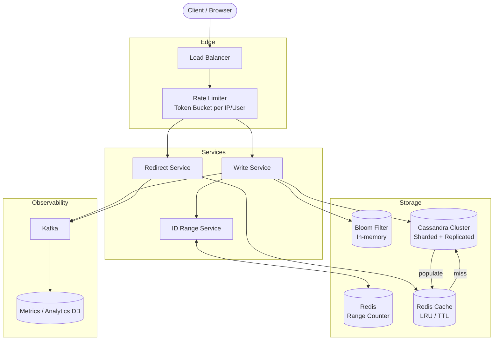

#### ID Generation: Two Strategies

The core challenge is producing a unique, non-guessable 7-character short code at high velocity.

**Strategy A — Hashing (non-deterministic)**

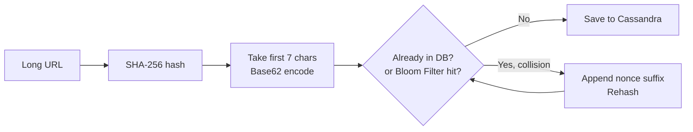

- Pros: same long URL always maps to the same short code (idempotent).
- Cons: each collision requires an extra DB/Bloom Filter lookup; under high load collisions add latency; the flow is non-deterministic.
- The Bloom Filter acts as a first gate — if the filter says "definitely not present", skip the DB read entirely. False positives cause a redundant DB check (safe); false negatives are impossible.

**Strategy B — Range Service (deterministic, preferred)**

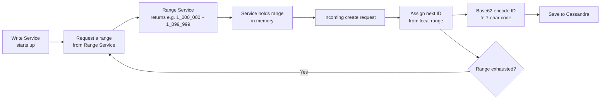

The full numeric space is $0$ to $3.52\text{ T}$ (the $62^7$ ceiling). The Range Service partitions this into chunks (e.g., 100,000 IDs per chunk). Each Write Service instance claims a chunk at startup and works through it locally, only contacting the Range Service again when the chunk runs out.

| Property | Hash Strategy | Range Strategy |
|---|---|---|
| Speed | Slower (collision retry) | Fast (no DB round-trip per ID) |
| Predictability | Non-deterministic | Deterministic / sequential |
| Collision risk | Possible | None |
| Loss on crash | None | Up to one chunk (~0.003% of capacity) |
| Recommended | Secondary / custom aliases | Primary write path |

#### Write Flow (Sequence)

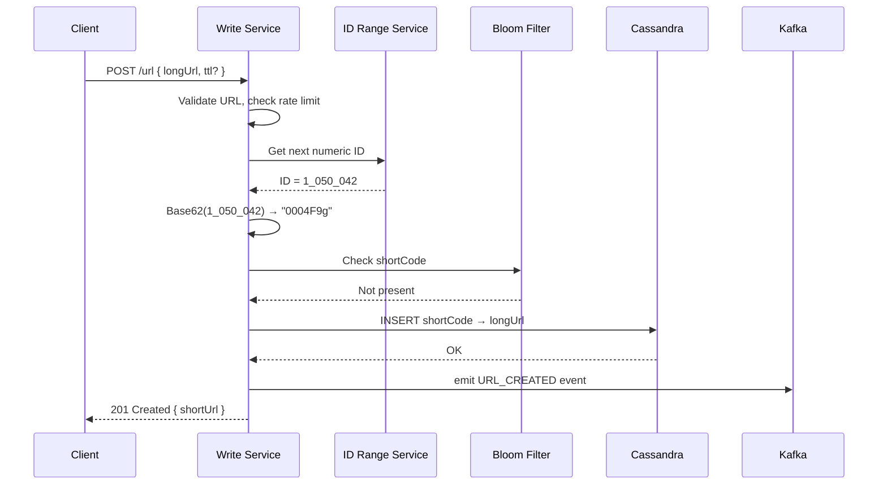

#### Redirect Flow (Sequence)

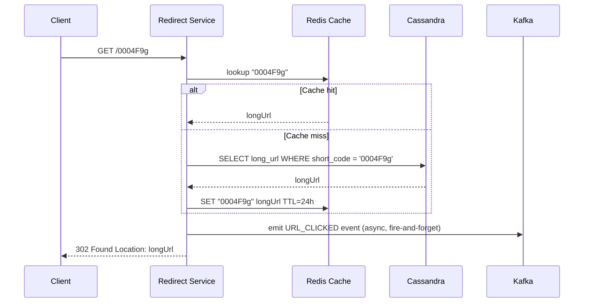

#### Database Layer (Cassandra)

Cassandra stores the data in two tables partitioned by access pattern:

- **`url_by_code`** — primary redirect lookup, partitioned by `short_code` so any node can handle any redirect.
- **`code_by_url_hash`** — reverse lookup for idempotent creates (same long URL → same short code).

Sharding is automatic in Cassandra through consistent hashing of the partition key. Replication factor of 3 across multiple data centres gives fault tolerance.

#### Observability Pipeline

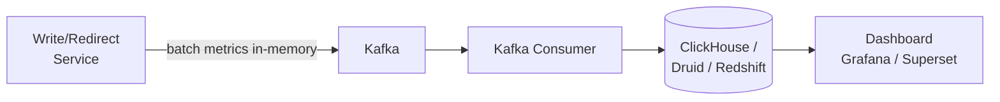

Metrics are buffered in-process to avoid per-request DB writes on the hot redirect path. A background thread flushes them to Kafka every few seconds, keeping redirect latency unaffected.

#### Additional Considerations

| Concern | Approach |
|---|---|
| Custom alias | Bloom Filter or DB lookup before insert; `409` on conflict |
| Expiration | Store `expire_at`; TTL in Cassandra or a cron soft-delete job |
| Rate limiting | Token bucket per user/IP at the API gateway |
| URL validation | Reject non-HTTP(S), oversized, or malformed URLs at ingress |
| Security | HTTPS/HSTS, WAF, abuse/phishing URL blocklist |

#### Spring Boot Implementation (Approach 1 — Cassandra + Kafka)

**Key dependencies**

```xml
<!-- pom.xml -->
<dependency>
    <groupId>org.springframework.boot</groupId>
    <artifactId>spring-boot-starter-data-cassandra</artifactId>
</dependency>
<dependency>
    <groupId>org.springframework.boot</groupId>
    <artifactId>spring-boot-starter-data-redis</artifactId>
</dependency>
<dependency>
    <groupId>org.springframework.kafka</groupId>
    <artifactId>spring-kafka</artifactId>
</dependency>
```

**`application.yml`**

```yaml
spring:
  data:
    cassandra:
      keyspace-name: url_shortener
      contact-points: cassandra1,cassandra2,cassandra3
      port: 9042
      local-datacenter: datacenter1
      request:
        consistency: LOCAL_QUORUM   # RF/2+1 nodes in local DC must agree
    redis:
      host: redis-primary
      port: 6379
  kafka:
    bootstrap-servers: kafka-broker1:9092,kafka-broker2:9092
    producer:
      acks: "1"            # leader ack — good balance of speed and durability
      linger-ms: 5         # batch up to 5 ms of events before flushing
      batch-size: 16384    # bytes per producer batch
      key-serializer: org.apache.kafka.common.serialization.StringSerializer
      value-serializer: org.springframework.kafka.support.serializer.JsonSerializer
```

**`UrlEntity.java`** — Cassandra table mapping

```java
@Table("url_by_code")
public class UrlEntity {

    @PrimaryKey                   // maps to Cassandra partition key
    private String shortCode;

    @Column("long_url")
    private String longUrl;

    @Column("created_at")
    private Instant createdAt;

    @Column("expire_at")
    private Instant expireAt;

    @Column("user_id")
    private String userId;

    @Column("is_deleted")
    private boolean deleted;

    // getters / setters omitted
}
```

**`UrlRepository.java`**

```java
@Repository
public interface UrlRepository extends CassandraRepository<UrlEntity, String> {}
```

**`Base62Encoder.java`** — shared utility (used by both approaches)

```java
public final class Base62Encoder {

    private static final String ALPHABET =
        "0123456789ABCDEFGHIJKLMNOPQRSTUVWXYZabcdefghijklmnopqrstuvwxyz";

    private Base62Encoder() {}

    public static String encode(long num) {
        if (num < 0) throw new IllegalArgumentException("num must be non-negative");
        if (num == 0) return "0000000";
        StringBuilder sb = new StringBuilder();
        while (num > 0) {
            sb.append(ALPHABET.charAt((int) (num % 62)));
            num /= 62;
        }
        String code = sb.reverse().toString();
        return "0".repeat(Math.max(0, 7 - code.length())) + code; // left-pad to 7 chars
    }
}
```

**`IdRangeService.java`** — Redis-backed range allocator

```java
@Service
public class IdRangeService {

    private static final long RANGE_SIZE = 100_000L;

    private final StringRedisTemplate redis;
    private long nextId   = 0;
    private long rangeEnd = -1;

    public IdRangeService(StringRedisTemplate redis) {
        this.redis = redis;
    }

    /**
     * Returns the next globally unique numeric ID.
     *
     * Each JVM instance claims an exclusive block via Redis INCRBY — multiple
     * Write Service replicas will never produce duplicate IDs without any
     * distributed coordination beyond the atomic Redis command.
     *
     * If a server crashes mid-range, those unused IDs are lost, but that is
     * acceptable: we need only 315 B IDs and have 3.52 T available.
     */
    public synchronized long nextId() {
        if (nextId > rangeEnd) {
            Long newTop = redis.opsForValue().increment("url:id:counter", RANGE_SIZE);
            if (newTop == null) throw new IllegalStateException("Redis unavailable");
            rangeEnd = newTop - 1;
            nextId   = newTop - RANGE_SIZE;
        }
        return nextId++;
    }
}
```

**`ClickEvent.java`** — Kafka message

```java
public record ClickEvent(
    String  shortCode,
    String  userAgent,
    String  remoteAddr,
    Instant clickedAt
) {}
```

**`UrlService.java`** — core business logic

```java
@Service
public class UrlService {

    private final UrlRepository                     urlRepo;
    private final IdRangeService                    idRangeService;
    private final StringRedisTemplate               redis;
    private final KafkaTemplate<String, ClickEvent> kafka;

    public UrlService(UrlRepository urlRepo, IdRangeService idRangeService,
                      StringRedisTemplate redis,
                      KafkaTemplate<String, ClickEvent> kafka) {
        this.urlRepo        = urlRepo;
        this.idRangeService = idRangeService;
        this.redis          = redis;
        this.kafka          = kafka;
    }

    public String create(String longUrl, String customAlias, Duration ttl) {
        String shortCode = (customAlias != null && !customAlias.isBlank())
            ? customAlias
            : Base62Encoder.encode(idRangeService.nextId());

        UrlEntity entity = new UrlEntity();
        entity.setShortCode(shortCode);
        entity.setLongUrl(longUrl);
        entity.setCreatedAt(Instant.now());
        entity.setExpireAt(ttl != null ? Instant.now().plus(ttl) : null);
        entity.setDeleted(false);
        urlRepo.save(entity);

        return shortCode;
    }

    public String resolve(String shortCode) {
        // L1: Redis cache — O(1), sub-millisecond
        String cached = redis.opsForValue().get("url:" + shortCode);
        if (cached != null) return cached;

        // L2: Cassandra — single-partition read, ~2–5 ms
        UrlEntity entity = urlRepo.findById(shortCode)
            .filter(e -> !e.isDeleted())
            .filter(e -> e.getExpireAt() == null || e.getExpireAt().isAfter(Instant.now()))
            .orElseThrow(() -> new UrlNotFoundException(shortCode));

        // Populate cache; honour the URL's own expiry as the upper bound
        Duration cacheTtl = entity.getExpireAt() != null
            ? Duration.between(Instant.now(), entity.getExpireAt())
            : Duration.ofHours(24);
        redis.opsForValue().set("url:" + shortCode, entity.getLongUrl(), cacheTtl);

        return entity.getLongUrl();
    }

    public void emitClick(String shortCode, String userAgent, String remoteAddr) {
        // Fire-and-forget: send() returns a Future; we do NOT call .get()
        // so the redirect response is never delayed by Kafka latency
        kafka.send("url.clicks", shortCode,
            new ClickEvent(shortCode, userAgent, remoteAddr, Instant.now()));
    }
}
```

**`UrlController.java`**

```java
@RestController
public class UrlController {

    private final UrlService urlService;

    public UrlController(UrlService urlService) {
        this.urlService = urlService;
    }

    @PostMapping("/url")
    public ResponseEntity<Map<String, String>> create(
            @RequestBody @Valid CreateUrlRequest request) {
        String code = urlService.create(
            request.longUrl(), request.customAlias(), request.ttl());
        return ResponseEntity.status(HttpStatus.CREATED)
                .body(Map.of("shortUrl", "https://short.ly/" + code));
    }

    // Regex in @GetMapping ensures only 7-char alphanumeric codes reach this handler;
    // anything else falls through to a 404 without entering business logic
    @GetMapping("/{shortCode:[A-Za-z0-9]{7}}")
    public ResponseEntity<Void> redirect(
            @PathVariable String shortCode,
            HttpServletRequest httpRequest) {
        String longUrl = urlService.resolve(shortCode);
        urlService.emitClick(shortCode,
            httpRequest.getHeader("User-Agent"),
            httpRequest.getRemoteAddr());
        return ResponseEntity.status(HttpStatus.FOUND)
                .location(URI.create(longUrl))
                .build();
    }
}
```

---

### Approach 2: Moderate-Scale Relational System (PostgreSQL + Replicas)

**When to use:** lower write rate (200–300/sec), total data in the tens of TB range, small team that values simplicity, strong consistency, and familiar SQL tooling.

#### System Architecture

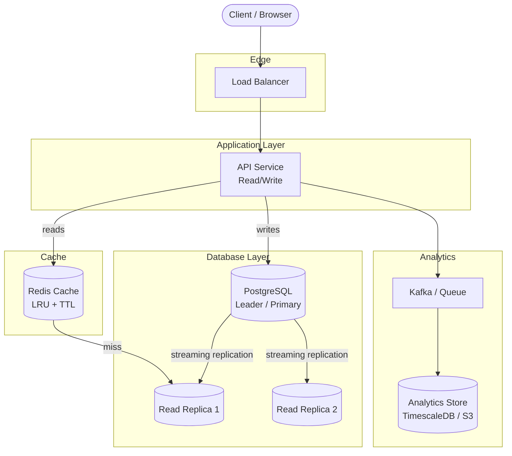

#### Why PostgreSQL works here

PostgreSQL uses a **B+ Tree** index on `short_code` (declared `UNIQUE`). Lookups on the primary key or unique index are $O(\log n)$ and very fast. A single well-tuned PostgreSQL instance on NVMe storage can serve tens of terabytes and billions of rows. Table size is capped at 32 TB per table, but multiple tables or partitioning by date/range can extend this further.

For write scale-out, **Citus** adds transparent sharding on top of standard PostgreSQL without changing application SQL. This is a safe migration path: start single-node, shard later when metrics justify it.

#### Redirect Read Path

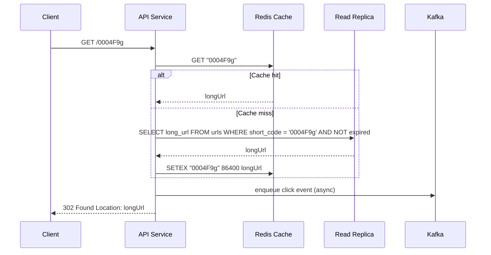

#### Write Path and ID Generation

PostgreSQL's `BIGSERIAL` (auto-increment) generates a unique integer `id` for every inserted row. The application Base62-encodes that integer to produce the 7-character short code and updates the row in the same transaction. This avoids the need for a separate Range Service — the database itself is the single source of truth for ID allocation.

For idempotency (same long URL → same short code), a `url_dedup` table keyed on `SHA-256(longUrl)` is checked before inserting.

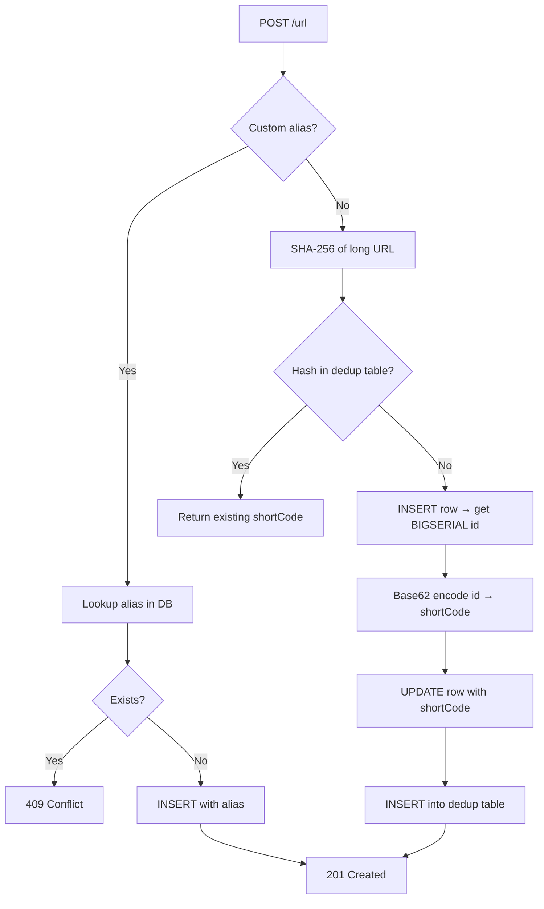

#### Database Design Comparison

| Property | Cassandra (Approach 1) | PostgreSQL (Approach 2) |
|---|---|---|
| Consistency | Eventual (tunable) | Strong (ACID) |
| Write throughput | Very high (leaderless) | High (single leader) |
| Read throughput | High (any replica) | High (read replicas + cache) |
| Sharding | Built-in (consistent hashing) | Manual / Citus extension |
| Operational complexity | Higher | Lower |
| Index type | Partition key (hash) | B+ Tree (ordered) |
| Best for | 315 TB+, global scale | Tens of TB, single region |

#### Caching Strategy

Both approaches use Redis for hot redirects. For a URL shortener, **read-through caching with LRU eviction** makes sense:

- On redirect: check cache first, fall through to DB on miss, populate cache.
- TTL set to 24 hours (or to the URL's `expire_at`, whichever is sooner).
- For Approach 2 the cache also insulates the read replicas from the ~100x read amplification.

#### Spring Boot Implementation (Approach 2 — PostgreSQL + Kafka)

**Key dependencies**

```xml
<!-- pom.xml -->
<dependency>
    <groupId>org.springframework.boot</groupId>
    <artifactId>spring-boot-starter-data-jpa</artifactId>
</dependency>
<dependency>
    <groupId>org.postgresql</groupId>
    <artifactId>postgresql</artifactId>
</dependency>
<dependency>
    <groupId>org.springframework.boot</groupId>
    <artifactId>spring-boot-starter-cache</artifactId>
</dependency>
<dependency>
    <groupId>org.springframework.boot</groupId>
    <artifactId>spring-boot-starter-data-redis</artifactId>
</dependency>
<dependency>
    <groupId>org.springframework.kafka</groupId>
    <artifactId>spring-kafka</artifactId>
</dependency>
```

**`application.yml`**

```yaml
spring:
  datasource:
    url: jdbc:postgresql://pg-primary:5432/url_shortener
    username: app
    password: ${DB_PASSWORD}
    hikari:
      maximum-pool-size: 20    # keep DB connections bounded; pair with PgBouncer
      minimum-idle: 5
  jpa:
    hibernate:
      ddl-auto: validate       # never let Hibernate auto-migrate in production
    properties:
      hibernate.dialect: org.hibernate.dialect.PostgreSQLDialect
  cache:
    type: redis                # @Cacheable annotations route through Redis
  data:
    redis:
      host: redis-primary
      port: 6379
  kafka:
    bootstrap-servers: kafka-broker1:9092,kafka-broker2:9092
    producer:
      acks: "1"
      key-serializer: org.apache.kafka.common.serialization.StringSerializer
      value-serializer: org.springframework.kafka.support.serializer.JsonSerializer
```

**`UrlEntity.java`** — JPA entity

```java
@Entity
@Table(
    name = "urls",
    indexes = @Index(name = "idx_urls_expire_at", columnList = "expire_at")
)
public class UrlEntity {

    @Id
    @GeneratedValue(strategy = GenerationType.IDENTITY)  // BIGSERIAL in PostgreSQL
    private Long id;

    @Column(name = "short_code", unique = true, nullable = false, length = 16)
    private String shortCode;

    @Column(name = "long_url", nullable = false, length = 2048)
    private String longUrl;

    @Column(name = "user_id")
    private Long userId;

    @Column(name = "created_at", nullable = false, updatable = false)
    private Instant createdAt = Instant.now();

    @Column(name = "expire_at")
    private Instant expireAt;

    @Column(name = "is_deleted", nullable = false)
    private boolean deleted = false;

    // getters / setters omitted
}
```

**`UrlRepository.java`**

```java
@Repository
public interface UrlRepository extends JpaRepository<UrlEntity, Long> {

    Optional<UrlEntity> findByShortCodeAndDeletedFalse(String shortCode);

    boolean existsByShortCode(String shortCode);
}
```

**`UrlService.java`** — with Spring Cache (`@Cacheable`) backed by Redis

```java
@Service
@Transactional
public class UrlService {

    private final UrlRepository                     urlRepo;
    private final KafkaTemplate<String, ClickEvent> kafka;

    public UrlService(UrlRepository urlRepo,
                      KafkaTemplate<String, ClickEvent> kafka) {
        this.urlRepo = urlRepo;
        this.kafka   = kafka;
    }

    /**
     * @Cacheable: on first call, Spring executes the method body, caches the
     * returned String in Redis under key "urls::{shortCode}", and returns it.
     * Subsequent calls with the same shortCode skip the method body entirely
     * and return the cached value directly from Redis.
     */
    @Transactional(readOnly = true)
    @Cacheable(value = "urls", key = "#shortCode", unless = "#result == null")
    public String resolve(String shortCode) {
        return urlRepo.findByShortCodeAndDeletedFalse(shortCode)
            .filter(e -> e.getExpireAt() == null || e.getExpireAt().isAfter(Instant.now()))
            .map(UrlEntity::getLongUrl)
            .orElseThrow(() -> new UrlNotFoundException(shortCode));
    }

    /**
     * @CacheEvict removes the cached entry when a URL is soft-deleted,
     * preventing stale cache hits after deletion.
     */
    @CacheEvict(value = "urls", key = "#shortCode")
    public void delete(String shortCode) {
        urlRepo.findByShortCodeAndDeletedFalse(shortCode).ifPresent(e -> {
            e.setDeleted(true);
            urlRepo.save(e);
        });
    }

    public String create(String longUrl, String customAlias, Duration ttl) {
        if (customAlias != null && urlRepo.existsByShortCode(customAlias)) {
            throw new AliasAlreadyTakenException(customAlias);
        }

        UrlEntity entity = new UrlEntity();
        entity.setLongUrl(longUrl);
        // Use the custom alias directly, or a temporary placeholder that will
        // be replaced once we have the auto-generated PK
        entity.setShortCode(customAlias != null ? customAlias : "TEMP_" + UUID.randomUUID());
        entity.setExpireAt(ttl != null ? Instant.now().plus(ttl) : null);

        UrlEntity saved = urlRepo.save(entity);   // triggers BIGSERIAL; saved.getId() is now set

        if (customAlias == null) {
            // Derive the short code from the auto-generated PK and update it
            String derived = Base62Encoder.encode(saved.getId());
            saved.setShortCode(derived);
            urlRepo.save(saved);                  // one extra UPDATE per create — acceptable
        }

        return saved.getShortCode();
    }

    public void emitClick(String shortCode, String userAgent, String remoteAddr) {
        kafka.send("url.clicks", shortCode,
            new ClickEvent(shortCode, userAgent, remoteAddr, Instant.now()));
    }
}
```

**`UrlController.java`** — identical REST interface to Approach 1

```java
@RestController
public class UrlController {

    private final UrlService urlService;

    public UrlController(UrlService urlService) {
        this.urlService = urlService;
    }

    @PostMapping("/url")
    public ResponseEntity<Map<String, String>> create(
            @RequestBody @Valid CreateUrlRequest request) {
        String code = urlService.create(
            request.longUrl(), request.customAlias(), request.ttl());
        return ResponseEntity.status(HttpStatus.CREATED)
                .body(Map.of("shortUrl", "https://short.ly/" + code));
    }

    @GetMapping("/{shortCode:[A-Za-z0-9]{7}}")
    public ResponseEntity<Void> redirect(
            @PathVariable String shortCode,
            HttpServletRequest httpRequest) {
        String longUrl = urlService.resolve(shortCode);
        urlService.emitClick(shortCode,
            httpRequest.getHeader("User-Agent"),
            httpRequest.getRemoteAddr());
        return ResponseEntity.status(HttpStatus.FOUND)
                .location(URI.create(longUrl))
                .build();
    }
}
```

> **Key difference from Approach 1**: in Approach 2, Spring Cache's `@Cacheable` handles Redis automatically so you don't need to manually call `redis.opsForValue().set(...)`. In Approach 1, manual cache management is used because Cassandra entities need custom TTL alignment logic that Spring Cache doesn't expose out of the box.

#### When to Evolve Approach 2 → Approach 1

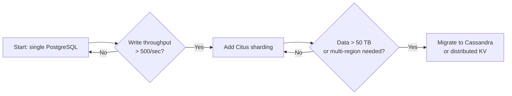

---

### Component Deep Dives

---

#### Apache Kafka

Kafka is a distributed, **append-only commit log**. Data is written sequentially to disk, making it extremely fast for high-throughput event streams.

**Core concepts**

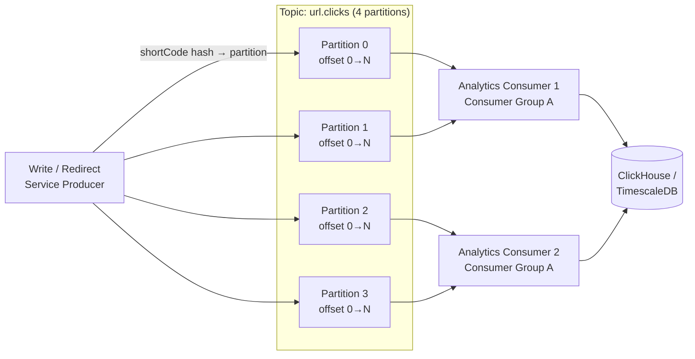

- **Topic**: a named, ordered stream of messages. Messages are never removed on read — they expire after the configured retention window (e.g. 7 days).
- **Partition**: a topic is split into partitions for parallelism. Each partition is an ordered, immutable sequence; ordering is guaranteed only within a partition.
- **Partition key**: using `shortCode` as the key means all clicks for the same URL land on the same partition — useful if consumers need per-URL aggregation in order.
- **Consumer group**: multiple consumer instances share a group name. Kafka assigns each partition to exactly one consumer in the group, giving horizontal scale without duplicate processing.
- **Offset**: each message has a numeric offset within its partition. Consumers commit their offset to Kafka, enabling restart-from-last-position after a crash.

**Producer configuration choices**

| Setting | Value | Reason |
|---|---|---|
| `acks` | `1` | Leader persists the message before acking. Fast write, acceptable risk of losing un-replicated messages on leader crash. Use `all` for stricter durability. |
| `linger.ms` | `5` | Wait up to 5 ms for more messages to batch together before sending. Greatly reduces network calls at high throughput. |
| `batch.size` | `16384` B | Max bytes per batch per partition. Tune up to 65536 for very high volume. |
| `retries` | `3` | Automatically retry transient failures (network blip, leader election). |
| `idempotence` | `true` | Enables exactly-once producer semantics — prevents duplicate messages on retry. Requires `acks=all`. |

**Why Kafka here instead of a direct DB write?**

The redirect path must respond in < 10 ms. Writing a click record synchronously to the analytics database on every redirect would add 5–50 ms of latency and create a strong coupling between the redirect hot path and the analytics store. Kafka decouples them: the producer emits a fire-and-forget event in microseconds, and the analytics consumer processes it at its own pace.

---

#### Apache Cassandra

Cassandra is a **masterless, wide-column, eventually consistent** store designed for write-heavy, globally distributed workloads.

**Ring architecture and partitioning**

```mermaid
flowchart LR
    subgraph Ring["Cassandra Ring (5 nodes, RF=3)"]
        N1((Node 1\n0–72)) --- N2((Node 2\n73–144))
        N2 --- N3((Node 3\n145–216))
        N3 --- N4((Node 4\n217–288))
        N4 --- N5((Node 5\n289–360))
        N5 --- N1
    end

    C[Client] -->|Murmur3(shortCode)| N1
    N1 -->|replicate| N2
    N1 -->|replicate| N3
```

- Every node owns a range of the hash ring. When a write arrives, the **partition key** (`short_code`) is hashed (Murmur3) and mapped to a ring position. The owning node and the next RF−1 nodes store the replicas.
- Any node can act as a **coordinator** for any request — there is no single leader. The coordinator forwards the request to the replica nodes.
- **Virtual nodes (vnodes)**: instead of one large ring segment per physical node, each node owns many small segments scattered around the ring. This ensures even data distribution as nodes are added or removed.

**Storage engine (LSM tree)**

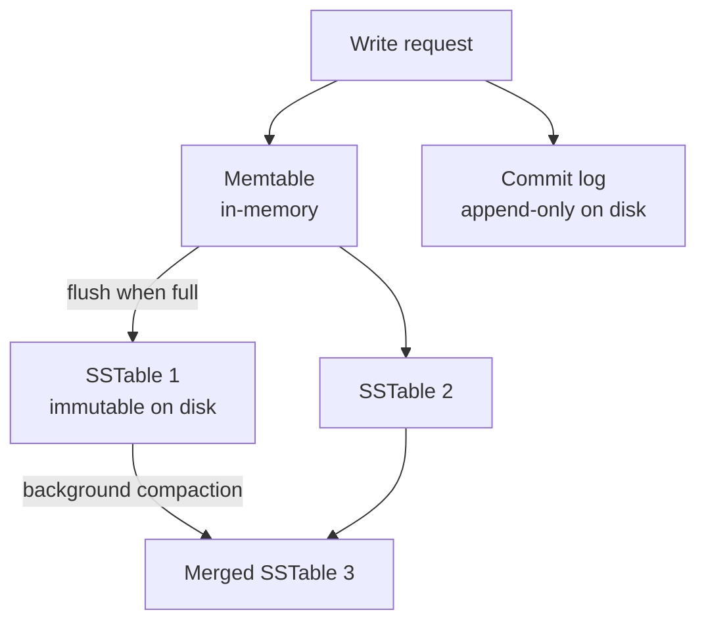

- Writes go to the in-memory **memtable** and the sequential **commit log** simultaneously. Both are sequential writes — this is why Cassandra achieves very high write throughput compared to B-Tree databases (which do random-access page updates).
- When the memtable fills, it is flushed to disk as an immutable **SSTable**.
- Background **compaction** merges SSTables, resolves conflicting versions (last-write-wins by timestamp), and reclaims space from deleted rows (tombstones).

**Consistency levels**

Cassandra lets you choose consistency per query — trading availability for consistency:

| Level | Reads/Writes | Meaning |
|---|---|---|
| `ONE` | 1 replica responds | Fastest; may read stale data |
| `QUORUM` | RF/2+1 replicas agree | Strong within a single DC |
| `LOCAL_QUORUM` | Quorum in local DC only | Best for multi-DC; avoids cross-DC latency |
| `ALL` | All replicas respond | Strongest; lowest availability |

For this system: **`LOCAL_QUORUM` writes** (ensures durability on a majority of nodes) and **`LOCAL_QUORUM` or `ONE` reads** (fast redirects, minor staleness acceptable).

**Data modelling rules**

In Cassandra you model by access pattern, not by normalised entity:

- `url_by_code` — partition key is `short_code`. The entire row lives on one partition, so any redirect lookup is a single-partition read touching at most RF nodes.
- No JOINs exist; denormalise by duplicating data into multiple tables if different access patterns are needed.
- Avoid "wide rows" (millions of clustering columns per partition key) — not an issue here since each short code has exactly one row.

---

#### PostgreSQL

PostgreSQL is an ACID-compliant relational database with a rich set of internal mechanisms that make it reliable and efficient at moderate scale.

**MVCC — Multi-Version Concurrency Control**

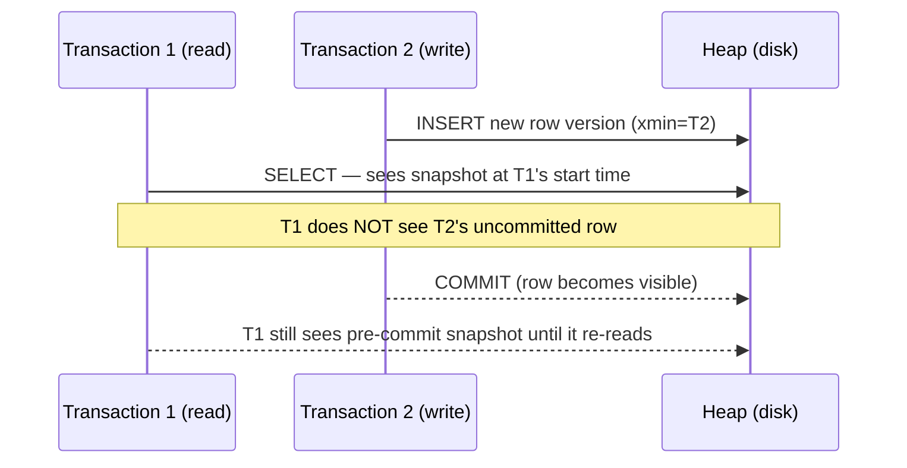

- Every write creates a **new row version** tagged with the transaction ID. Readers see a consistent snapshot of the database as it was at their transaction start — readers never block writers and writers never block readers.
- Dead row versions accumulate and must be reclaimed by **VACUUM** (`autovacuum` runs this in the background automatically).

**WAL — Write-Ahead Log**

All changes are written to the WAL (an append-only file on disk) before being applied to data pages. This gives:
- **Crash recovery**: on restart, PostgreSQL replays the WAL from the last checkpoint.
- **Streaming replication**: the primary continuously ships WAL records to standby replicas over a TCP connection. Standbys apply the WAL in order and can serve read queries.

**B+ Tree index**

The `short_code` UNIQUE index is stored as a B+ Tree:
- For 315 B rows with a fan-out of ~500 entries per page, tree height ≈ $\log_{500}(315 \times 10^9) \approx 6$ levels. A lookup touches ~6 pages.
- Leaf nodes form a doubly-linked list, making range scans efficient.
- An **index-only scan** can answer `SELECT long_url WHERE short_code = ?` purely from the index without reading the heap, if `long_url` is included as a covering column.

**Connection pooling with PgBouncer**

PostgreSQL forks one OS process per connection — 10,000 direct connections would consume enormous RAM and CPU. **PgBouncer** (transaction-mode pooling) sits in front of PostgreSQL and multiplexes many application connections onto a small pool of 20–100 actual Postgres backends, dramatically reducing overhead.

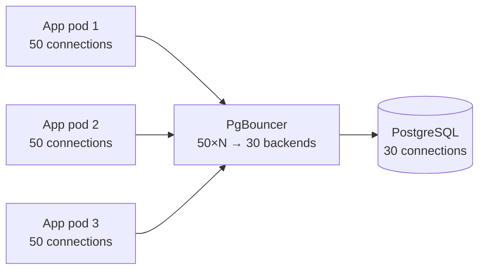

---

#### Redis

Redis is a **single-threaded, in-memory data structure server**. Its event loop processes one command at a time — there are no locks, no thread context switches, and no CPU cache misses from concurrent access. This is why it achieves sub-millisecond latency at very high QPS.

**How it is used here**

| Use case | Command | Notes |
|---|---|---|
| URL cache (Approach 1 manual) | `SET url:{code} {longUrl} EX {seconds}` | TTL aligned to URL's `expire_at` |
| URL cache (Approach 2 via Spring Cache) | Managed by `@Cacheable` / `@CacheEvict` | Spring uses `SETEX` + `GET` internally |
| ID range counter (Approach 1) | `INCRBY url:id:counter 100000` | Atomic; returns new top of range |

**Eviction policies**

When Redis reaches its `maxmemory` limit it evicts keys according to the configured policy:

| Policy | Behaviour | Best for |
|---|---|---|
| `allkeys-lru` | Evict least-recently-used key across all keys | URL cache (hot URLs stay resident) |
| `allkeys-lfu` | Evict least-frequently-used key | Workloads with a few extremely viral URLs |
| `volatile-lru` | LRU, but only among keys with a TTL set | Mixed cache + session store |
| `noeviction` | Return error when memory full | Range counter (must never lose this key) |

Use two separate Redis instances — or two logical databases — if you need different eviction policies: `allkeys-lru` for the URL cache, `noeviction` for the ID range counter.

**Persistence options**

For the URL cache you typically disable persistence (pure cache can be rebuilt from Cassandra/PostgreSQL on restart). For the ID range counter, losing the counter on restart could cause ID collisions:

| Mode | How it works | Recovery risk |
|---|---|---|
| **None** (cache only) | Data lost on restart | Acceptable for URL cache |
| **RDB** | Point-in-time snapshot every N seconds | Lose up to N seconds of increments |
| **AOF** | Append every write command to a log | Near-zero data loss; slightly slower |

For the range counter, AOF with `fsync=everysec` is a good default — at most one second of range allocation is lost on a crash, and since we have 11× headroom over requirements, skipping a small range is acceptable.

---

### Approach 3: AWS-Native Architecture

**When to use:** you want managed infrastructure with minimal operational burden, can tolerate AWS vendor lock-in, and need to match internet-scale traffic (1,000 writes/s, 100,000 redirects/s) without running your own Cassandra or Kafka clusters.

The goal is to use **well-understood managed AWS services** that each solve exactly one problem, without over-engineering.

#### AWS Service Map

| Concern | AWS Service | Why |
|---|---|---|
| DNS / global entry point | Route 53 + CloudFront | GeoDNS + edge caching for redirect responses |
| API / HTTP routing | API Gateway + ALB | Rate limiting, auth, routing to Lambda / ECS |
| Write logic | AWS Lambda (or ECS Fargate) | Serverless for low-traffic writes; Fargate for sustained 1K/s |
| Redirect logic | AWS Lambda@Edge | Runs at CloudFront edge — sub-10 ms redirects from cache |
| Short ID generation | DynamoDB atomic counter | `ADD` operation is atomic across regions |
| Primary data store | DynamoDB | Managed, serverless NoSQL; handles 315 TB with on-demand scaling |
| Redirect cache | CloudFront (CDN cache) | Free cache hit for hot URLs at edge — no Redis needed at scale |
| In-region hot cache | ElastiCache (Redis) | L2 cache for Lambda@Edge origin miss path |
| Async analytics | Amazon Kinesis Data Streams | Managed Kafka-equivalent; feeds analytics pipeline |
| Analytics store | Amazon S3 + Athena | Store raw click events cheaply; query with SQL on demand |
| Secrets | AWS Secrets Manager | Credentials for DynamoDB, ElastiCache |
| Observability | CloudWatch + X-Ray | Metrics, distributed tracing |

#### Architecture Diagram

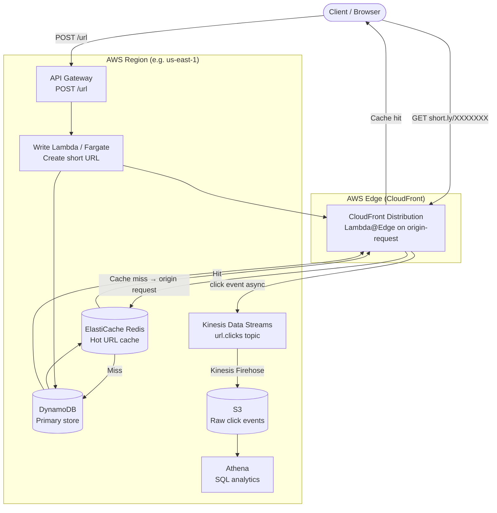

#### Data Flow

**Create (write path)**

1. Client `POST /url` hits API Gateway (rate-limited by AWS WAF rule attached to the gateway).
2. Lambda reads the request, calls DynamoDB `UpdateItem` with `ADD counter 1` to get a globally unique numeric ID.
3. Encodes the ID to Base62 → 7-char short code.
4. `PutItem` to DynamoDB with the URL mapping.
5. Returns `201 Created` with the short URL.
6. CloudFront cache is not pre-warmed; it fills naturally on first redirect.

**Redirect (read path)**

1. Client `GET short.ly/XXXXXXX` hits the nearest CloudFront PoP.
2. CloudFront checks its edge cache — **cache hit** returns `302` immediately from edge, no backend involved (sub-5 ms).
3. **Cache miss** triggers Lambda@Edge `origin-request` function:
   - Checks ElastiCache Redis (in-region).
   - On Redis miss, reads DynamoDB.
   - Returns `Location` header; CloudFront caches the response at edge for the TTL duration.
4. Lambda@Edge sends a click event to Kinesis asynchronously.

#### Sequence Diagram (redirect with cold edge cache)

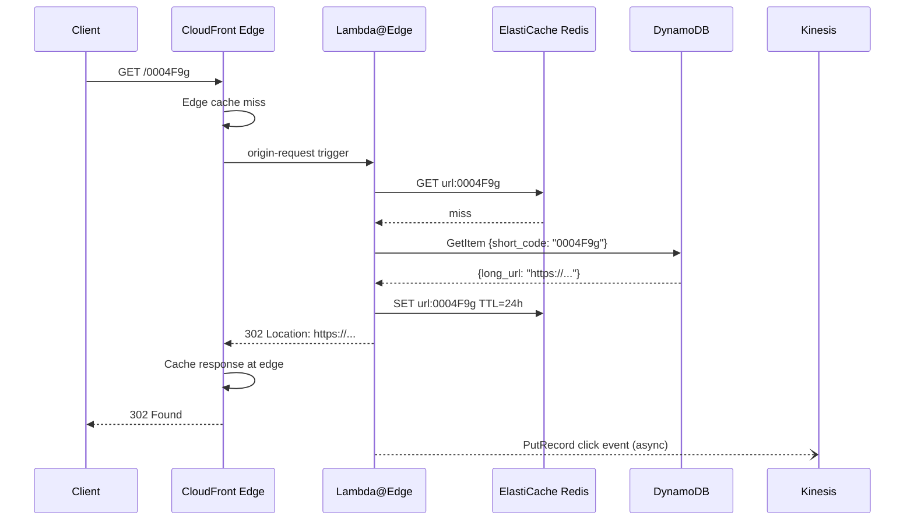

#### DynamoDB Table Design

```
Table name : url_mappings
Partition key : short_code (String)
Billing mode  : On-Demand (auto-scales to any throughput)
TTL attribute : expire_at (epoch seconds — DynamoDB deletes expired items automatically)
```

| Attribute | Type | Notes |
|---|---|---|
| `short_code` (PK) | S | 7-char Base62 string |
| `long_url` | S | Original URL |
| `user_id` | S | Owner (optional) |
| `created_at` | N | Unix epoch ms |
| `expire_at` | N | Unix epoch seconds — DynamoDB TTL field |

**Atomic ID counter** (separate table):

```
Table name : id_counter
Partition key : counter_name (String)

UpdateItem:
  Key: {counter_name: "global"}
  UpdateExpression: "ADD #v :inc"
  ExpressionAttributeNames: {"#v": "value"}
  ExpressionAttributeValues: {":inc": 1}
  ReturnValues: UPDATED_NEW
```

This is simpler than a range service: DynamoDB guarantees the `ADD` is atomic even across concurrent Lambda invocations, so no two invocations ever get the same ID.

#### CloudFront Cache Configuration

```json
{
  "DefaultCacheBehavior": {
    "ViewerProtocolPolicy": "redirect-to-https",
    "CachePolicyId": "<custom-policy-id>",
    "OriginRequestPolicyId": "<origin-request-policy-id>",
    "LambdaFunctionAssociations": [
      {
        "EventType": "origin-request",
        "LambdaFunctionARN": "arn:aws:lambda:us-east-1:ACCOUNT:function:redirect-fn:LIVE"
      }
    ]
  }
}
```

Cache policy:
- **Cache key**: path only (`/0004F9g`) — do not include headers or query strings.
- **Default TTL**: `86400` seconds (24 h). Override per URL via `Cache-Control` header from Lambda@Edge.
- **Invalidation**: call `cloudfront.createInvalidation` when a URL is deleted or updated.

#### AWS Lambda (Write) — Java / Spring Boot

The write Lambda is a standard Spring Boot app packaged with the `aws-serverless-java-container` adapter. For sustained 1,000 writes/s, consider ECS Fargate instead (avoids cold-start variability).

```java
// WriteUrlHandler.java — AWS Lambda handler (Spring Boot adapter)
@Component
public class WriteUrlHandler
    implements RequestHandler<APIGatewayProxyRequestEvent, APIGatewayProxyResponseEvent> {

    private final DynamoDbClient dynamo;
    private static final String TABLE      = "url_mappings";
    private static final String CTR_TABLE  = "id_counter";

    public WriteUrlHandler(DynamoDbClient dynamo) {
        this.dynamo = dynamo;
    }

    @Override
    public APIGatewayProxyResponseEvent handleRequest(
            APIGatewayProxyRequestEvent event, Context context) {

        CreateUrlRequest req = parse(event.getBody());
        String longUrl       = validate(req.longUrl());

        long id        = allocateId();
        String code    = Base62Encoder.encode(id);

        Map<String, AttributeValue> item = Map.of(
            "short_code",  AttributeValue.fromS(code),
            "long_url",    AttributeValue.fromS(longUrl),
            "created_at",  AttributeValue.fromN(String.valueOf(Instant.now().toEpochMilli()))
        );

        dynamo.putItem(PutItemRequest.builder()
            .tableName(TABLE)
            .item(item)
            .conditionExpression("attribute_not_exists(short_code)") // prevent overwrites
            .build());

        return response(201, Map.of("shortUrl", "https://short.ly/" + code));
    }

    private long allocateId() {
        UpdateItemResponse resp = dynamo.updateItem(UpdateItemRequest.builder()
            .tableName(CTR_TABLE)
            .key(Map.of("counter_name", AttributeValue.fromS("global")))
            .updateExpression("ADD #v :inc")
            .expressionAttributeNames(Map.of("#v", "value"))
            .expressionAttributeValues(Map.of(":inc", AttributeValue.fromN("1")))
            .returnValues(ReturnValue.UPDATED_NEW)
            .build());

        return Long.parseLong(resp.attributes().get("value").n());
    }
}
```

#### Lambda@Edge (Redirect) — Node.js

Lambda@Edge runs at CloudFront edge PoPs and must be in `us-east-1`. Node.js is preferred here because it has near-zero cold-start time compared to JVM-based runtimes.

```js
// redirect.mjs — Lambda@Edge origin-request handler
import { DynamoDBClient, GetItemCommand }   from "@aws-sdk/client-dynamodb";
import { createClient }                      from "redis";

const dynamo = new DynamoDBClient({ region: "us-east-1" });
// Redis client is initialised once per container and reused across invocations
let redis;

async function getRedis() {
  if (!redis) {
    redis = createClient({ url: process.env.REDIS_URL });
    await redis.connect();
  }
  return redis;
}

export const handler = async (event) => {
  const request   = event.Records[0].cf.request;
  const shortCode = request.uri.replace(/^\//, "");    // strip leading "/"

  // 1. Redis cache
  const rc = await getRedis();
  let longUrl = await rc.get(`url:${shortCode}`);

  if (!longUrl) {
    // 2. DynamoDB
    const result = await dynamo.send(new GetItemCommand({
      TableName: "url_mappings",
      Key: { short_code: { S: shortCode } },
      ProjectionExpression: "long_url, expire_at",
    }));

    const item = result.Item;
    if (!item || (item.expire_at && Number(item.expire_at.N) < Date.now() / 1000)) {
      return { status: "404", body: "Not found" };
    }

    longUrl = item.long_url.S;
    await rc.set(`url:${shortCode}`, longUrl, { EX: 86400 });
  }

  // 3. Emit click event (fire-and-forget — no await)
  emitClick(shortCode, request.headers).catch(() => {});

  // 4. Redirect response — CloudFront will cache this at the edge
  return {
    status: "302",
    headers: {
      location:        [{ key: "Location",        value: longUrl }],
      "cache-control": [{ key: "Cache-Control",   value: "public, max-age=86400" }],
    },
  };
};
```

#### AWS WAF Rate Limiting

Attach a WAF Web ACL to both API Gateway (writes) and CloudFront (redirects):

```json
{
  "Rules": [
    {
      "Name": "RateLimitWrites",
      "Priority": 1,
      "Action": { "Block": {} },
      "Statement": {
        "RateBasedStatement": {
          "Limit": 100,
          "AggregateKeyType": "IP"
        }
      },
      "VisibilityConfig": { "MetricName": "RateLimitWrites", "SampledRequestsEnabled": true }
    }
  ]
}
```

This blocks any single IP that sends more than 100 `POST /url` requests per 5-minute window — a practical defence against abuse without application-layer code.

#### Analytics Pipeline

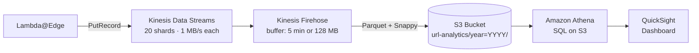

- **Kinesis shards**: at 100,000 redirects/s and ~200 bytes per click event: $100\text{K} \times 200\text{ B} = 20\text{ MB/s}$. Each shard handles 1 MB/s, so you need **20 shards**.
- **Firehose**: buffers records and writes compressed Parquet to S3, making Athena queries cheap.
- **Athena**: serverless SQL on S3 — pay per query, no cluster to manage.

#### Cost Profile (rough order of magnitude)

| Service | Assumption | Est. monthly cost |
|---|---|---|
| CloudFront | 100K redirects/s × 99% hit rate × ~$0.0085/10K req | ~$700 |
| Lambda@Edge | 1% miss × 100K/s × 2.6B invocations | ~$500 |
| DynamoDB (on-demand) | 1K writes/s + 1K reads/s (cache miss) | ~$1,200 |
| ElastiCache (cache.r7g.large) | 2-node cluster | ~$300 |
| Kinesis (20 shards) | $0.015/shard/hr | ~$220 |
| S3 + Athena | Storage + queries | ~$100 |
| **Total** | | **~$3,000–4,000/month** |

Costs drop significantly if the CloudFront cache-hit rate is high (99%+), since Lambda@Edge invocations and DynamoDB reads become rare.

---

### Recommendation Summary

| Scenario | Use |
|---|---|
| Large team, global scale, 315 TB+, 1000+ writes/sec, full control | Approach 1 (Cassandra + Range Service) |
| Small/medium team, single region, <50 TB, <500 writes/sec | Approach 2 (PostgreSQL + Replicas) |
| Managed infra, AWS ecosystem, fast time-to-market | **Approach 3 (AWS-native)** |
| Moderate scale today, expecting growth | Approach 2 now → Citus → Approach 1 later |
