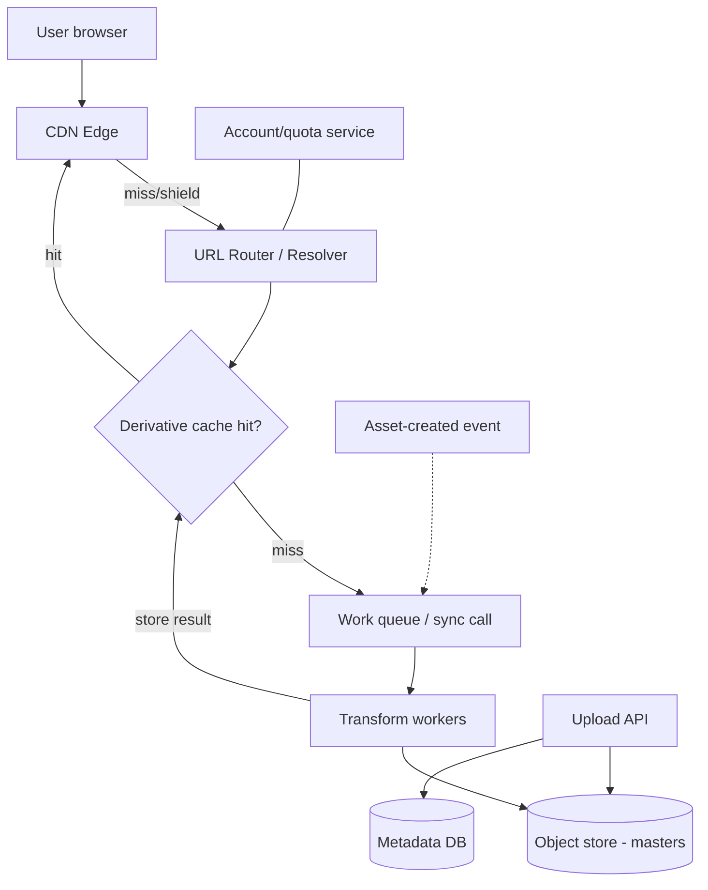
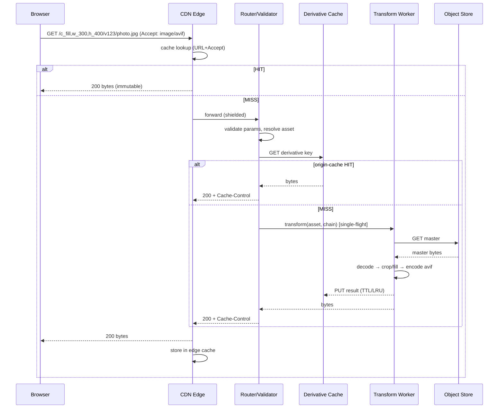
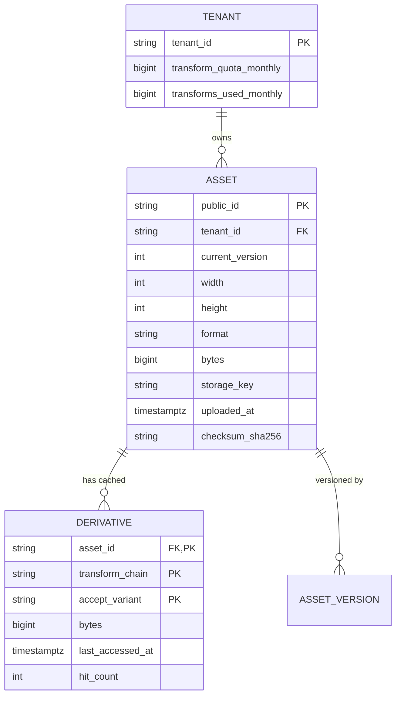
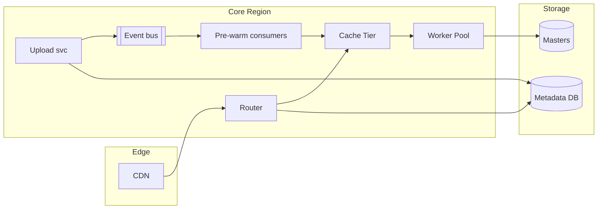

# Image Optimisation on the fly (Cloudinary)

## Blogs and websites

- [Image Optimization using Amazon CloudFront and AWS Lambda](https://aws.amazon.com/blogs/networking-and-content-delivery/image-optimization-using-amazon-cloudfront-and-aws-lambda/)
  - [aws-samples/image-optimization](https://github.com/aws-samples/image-optimization)

## Medium

## Youtube

- [Build your own Cloudinary - Image Optimisation on the fly](https://www.youtube.com/watch?v=IDy5wKpyH7Q)

---

## Theory

A dynamic image optimisation service transforms, compresses, resizes, and delivers images **on demand** — at request time — instead of pre-generating every possible variant offline. Cloudinary, imgix, and AWS's Lambda@Edge image optimisation all work this way: the client asks for `image.jpg?w=300&h=200&fit=crop&q=80&fmt=webp` and receives exactly that variant, generated on first request and cached thereafter.

### Important Subtopics

1. Why images dominate web performance
2. On-the-fly transformation vs. pre-generated variants
3. The URL-as-API contract (derivative naming)
4. Transformation operations (resize, crop, format, quality)
5. Modern image formats (WebP, AVIF, JPEG XL) and content negotiation
6. Caching layers (CDN edge cache, origin cache, derivative store)
7. Cache key design for transformed images
8. Cold-start / cache-miss path vs. warm path
9. Origin storage and master-image immutability
10. Security concerns (SSRF via fetch URLs, image bombs/decompression attacks)
11. Cost model (transform CPU vs. storage vs. bandwidth)
12. Responsive images (`srcset`, DPR variants, art direction)

### Why Images Dominate Web Performance

Images typically account for 50–70% of bytes on a web page. A single hero photo from a modern phone camera is 4000×3000 pixels and 5–8 MB as JPEG. Serving that to a phone on a 4G connection wastes:

- **Bandwidth** — the display only needs ~800px width.
- **Latency** — large files take longer to transfer; LCP (Largest Contentful Paint) is usually an image.
- **Battery/CPU** — decoding oversized images costs memory and CPU on mobile devices.

Optimisation means delivering *the smallest image that still looks correct* for each device, layout slot, and browser capability. Doing this statically is combinatorial: one master × N widths × M formats × K crop ratios = thousands of derivatives per asset. On-the-fly generation collapses this to zero storage until a variant is actually requested.

### On-the-Fly vs. Pre-Generated Variants

| Aspect | Pre-generated | On-the-fly |
|---|---|---|
| Storage | O(variants × assets) — grows unbounded | O(requested variants × assets) — only what is used |
| First-request latency | Zero transform cost (file exists) | Higher (must transform on miss) |
| New variant adoption | Requires batch re-processing job | Change the URL parameter — instant |
| Wasted work | Variants nobody requests are still stored | Only requested variants consume resources |
| Operational risk | Re-upload triggers full re-derivations | Master immutable; derivatives reproducible |

The hybrid used in practice: generate the few known-critical variants eagerly (e.g., thumbnail sizes shown in lists) and let long-tail variants materialise on demand.

### The URL-as-API Contract

The clever core idea: **the transformation spec lives in the URL**, making every variant addressable by a plain GET — cacheable by any CDN without custom logic.

```
https://res.cloudinary.com/<cloud-name>/image/upload/
  c_fill,g_face,w_300,h_400,q_auto,f_auto/          ← transformation chain
  v1690000000/photo.jpg                              ← version + public id
```

Reading it: "crop-to-fill, focus on detected face, 300×400, automatic quality and format, of version 1690000000 of photo.jpg". Because the URL fully determines the output bytes, the pair `(canonical URL, transformation chain)` is a perfect **cache key**.

### Transformation Operations

- **Resize modes** — `scale` (distort), `fit` (keep aspect, fit inside box), `fill` (cover box, crop overflow), `limit` (only shrink, never enlarge), `pad` (fit plus padding).
- **Cropping with gravity** — `g_face` (face detection), `g_faces`, `g_auto` (salient-region detection) so subject stays in frame regardless of aspect ratio. This is what makes one master usable across banner, square, and story crops.
- **Format conversion** — `f_auto` picks the best format the browser supports (via `Accept` header): AVIF → WebP → JPEG fallback.
- **Quality control** — `q_auto` uses perceptual metrics (e.g., DSSIM) per image to pick the lowest quality indistinguishable from reference; fixed `q_80` as a simpler alternative.
- **Effects/chains** — blur backgrounds, overlays, watermarks; chained transformations apply in sequence (`c_fill,w_300,h_400/watermark,...`).

### Modern Formats and Content Negotiation

| Format | Typical savings vs JPEG | Key feature |
|---|---|---|
| WebP | 25–35% smaller | Universal support now; lossy+lossless+alpha |
| AVIF | 40–50% smaller | Better compression; slow encode; HDR/alpha |
| JPEG XL | ~55% smaller | Still limited browser support |

`f_auto` inspects the request's `Accept` header and responds with the best mutually-supported format, adding `Vary: Accept` so caches store both WebP and JPEG versions under different variants.

### Caching Layers


- **Browser cache**: responses carry long `Cache-Control: max-age=31536000, immutable`; any change bumps the version segment of the URL, producing a new cache key.
- **CDN edge**: stores the rendered bytes per (URL, Accept) pair; hit rate commonly >95% after warm-up.
- **Origin derivative cache**: protects the transform workers when CDN nodes cold-start or evict; keyed identically.
- **Master storage**: originals in object storage (S3/GCS), treated as immutable.

### Cache-Miss Path (Cold) vs Warm Path

- **Warm**: CDN returns cached bytes — no compute, ~10–50 ms.
- **Cold**: edge forwards to origin → cache lookup fails → fetch master from object storage → run decode → transform → encode → write derivative to origin cache → stream response with `Cache-Control` so the edge caches it. Latency here can be 200 ms–2 s depending on source image size and operation complexity.

### Security Concerns

- **Image bombs**: a small compressed file decompressing to enormous pixel dimensions (e.g., a 30 MB PNG expanding to 100k×100k pixels = ~40 GB RAM). Mitigate with max-pixel limits and streaming decoders that abort early.
- **SSRF via remote fetch**: if the service accepts arbitrary `fetch=<url>` parameters, attackers pivot it into an internal-network scanner. Mitigate with allowlists, egress proxying, and private-CIDR blocking.
- **Zip-bomb-like chained transformations**: pathological chains designed to burn CPU — enforce chain length limits and per-account quotas.

### Cost Model

Three cost centres trade off against each other:

- **Transform compute**: paid once per unique variant, then amortised over cache hits.
- **Storage**: pre-generation pays for everything up-front; on-demand pays only for used variants.
- **Bandwidth**: identical either way, but better compression (AVIF) directly cuts the largest line item.

For catalogues with millions of assets but skewed access (80% of traffic hits 5% of assets), on-demand wins decisively.

---

## Characteristics

- **Lazy materialisation**
  *What*: Derivatives come into existence only when first requested. *Why important*: keeps storage proportional to actual usage, not to the theoretical cross-product of options. *How*: transform-on-miss plus persistent caching of results. *Example*: a product with 10,000 possible variants stores only the ~40 actually served.

- **Immutability of masters**
  *What*: Original uploads never change; every derivative derives deterministically. *Why*: correctness of caching — same URL must always yield same bytes; also enables re-derivation after cache loss. *How*: version segment in URL changes only on true re-upload.

- **Content-aware processing**
  *What*: face/saliency detection drives cropping; perceptual quality drives encoding. *Why*: naive centre-crop cuts heads off photos; fixed quality wastes bits on simple images. *How*: ML models detect regions of interest before cropping; encoders compare outputs against references.

- **Format negotiation**
  *What*: Server picks output format from browser capabilities. *Why*: automatically captures new-format savings without frontend changes. *How*: parse `Accept: image/avif,image/webp,*/*`.

- **Edge-distributed delivery**
  *What*: bytes served from POPs near users. *Why*: latency and egress cost. *How*: standard CDN behaviour driven by long cache TTLs.

- **Statelessness of transform workers**
  *What*: Workers hold no state; any worker can process any request. *Why*: horizontal scaling and failure isolation. *How*: inputs from object storage, outputs to shared caches.

- **Bounded resource consumption**
  *What*: strict limits on input size, output dimensions, transformation-chain length, and per-account rates. *Why*: the service parses attacker-controlled input (dimensions, URLs); unbounded decode is a DoS vector. *How*: validation gates before decode; quotas enforced centrally.

---

## Components

- **Ingestion/upload API**
  *Purpose*: accept master images. *Responsibilities*: validation (magic-byte sniffing, not just extension), virus scanning, metadata extraction (EXIF strip — privacy + bytes), normalise colour profiles, persist to object storage, emit asset-created event. *Relationship*: writes master store; publishes events that warm popular derivatives. *Real-world*: Cloudinary upload endpoint; Instagram's media ingestion.

- **Canonical URL router / resolver**
  *Purpose*: map incoming URL → (master asset, transformation chain). *Responsibilities*: parse transformation DSL, validate parameters, reject unknown ops, resolve public-id to storage location, short-circuit invalid requests cheaply. *Relationship*: front door for delivery path; feeds cache-key builder.

- **Derivative cache**
  *Purpose*: store rendered variants to avoid recomputation. *Responsibilities*: get/set by composite key, TTL + LRU eviction, negative-cache failed transforms briefly, track popularity for retention decisions. *Relationship*: sits between router and workers; shared by all workers. *Real-world*: Cloudinary's derived-asset layer; Facebook's "Haystack"-adjacent derivative stores.

- **Transform workers**
  *Purpose*: do decode → manipulate → encode. *Responsibilities*: run libvips/ImageMagick/Pillow pipelines, enforce pixel budgets, produce deterministic output bytes for identical input+params, report metrics. *Relationship*: pull work from queue or serve synchronously behind cache miss; read masters from object storage. *Real-world*: imgix render fleet; Lambda functions in the AWS reference architecture.

- **Object storage (master store)**
  *Purpose*: durable, cheap originals. *Responsibilities*: durability (11 nines), lifecycle tiering, versioning. *Real-world*: S3, GCS.

- **CDN**
  *Purpose*: global low-latency byte delivery and first-line caching. *Responsibilities*: honour cache headers, vary correctly on `Accept`, shield origin during stampedes. *Real-world*: CloudFront, Akamai, Fastly.

- **Metadata & account services**
  *Purpose*: asset catalogue, usage accounting, quotas, signed-URL keys. *Real-world*: Cloudinary dashboard APIs.

### Component diagram



---

## Patterns

- **Cache-aside with lazy population** (core pattern)
  *Problem*: pre-computing all variants is wasteful; computing every time is too slow. *How*: check caches in order (edge → origin); on total miss, compute and populate all layers. *When*: demand-skewed read patterns. *Not when*: every variant will definitely be needed immediately (e.g., sitemap-driven crawls — then pre-warm). *Pros*: storage/compute proportional to usage. *Cons*: cold-path latency spikes. *Example*: Cloudinary delivery.

- **Immutable content-addressed URLs (cache busting by construction)**
  *Problem*: stale images after update. *How*: version/public-id in path; changing content ⇒ changing URL ⇒ new cache entry, old entries age out. *Advantage*: no purge storms; safe infinite TTLs.

- **Request coalescing / thundering-herd protection**
  *Problem*: 1,000 simultaneous requests for a brand-new viral image's variant would trigger 1,000 transforms. *How*: only one request proceeds to transform; others wait on the result (single-flight per key). *Real-world*: Fastly request collapsing; AWS Lambda@Edge sample locks via DynamoDB.

- **Chain-of-responsibility (transformation pipeline)**
  Each transformation op is a handler applied in sequence; easy to extend with new ops. In Java, a list of `ImageOperation` implementations composed per request.

- **Strangler-style adoption**
  Existing sites keep original `` and switch hostname to the optimiser domain — no app changes; progressive rollout per page or per asset class.

- **Anti-patterns to avoid**
  Unbounded user-supplied dimensions (`w=999999`) — always clamp. Trusting file extensions — sniff magic bytes. Transforming synchronously inside the request thread pool without timeouts — one huge TIFF stalls the fleet.

---

## Benefits

- **Dramatic bandwidth and page-weight reduction** — often 60–90% smaller payloads via resize + modern formats + tuned quality. Matters because mobile users dominate traffic and LCP is a ranking signal.
- **Zero-variant-storage economics** — long-tail derivatives cost nothing until requested; catalogue growth doesn't multiply storage.
- **Instant experimentation** — marketing wants a new crop ratio for a campaign: change URL params, no batch jobs.
- **Device-adaptive UX out of the box** — retina phones get DPR 2x, watches get tiny thumbs, all from one tag attribute set (`srcset`).
- **Operational simplicity vs. DIY pipelines** — teams avoid maintaining ImageMagick fleets, security patching of native codecs, and variant-naming conventions.

---

## Pros

- Sub-second warm delivery worldwide via CDN.
- Deterministic, infinitely cacheable URLs (GET semantics).
- Automatic adoption of new codecs (AVIF) with graceful fallbacks.
- Face/salience-aware cropping removes manual art direction for routine slots.
- Centralised enforcement of security limits and per-customer quotas.
- Works as pure overlay: existing origins untouched.

## Cons

- **Cold-miss latency**: first request pays full transform cost; visible on viral spikes unless pre-warmed.
- **Compute cost at scale of uniqueness**: traffic patterns with near-zero repeat views (ephemeral content, bots, scrapers) pay transform cost repeatedly with no amortisation.
- **Native codec dependency**: image libraries carry CVE history; sandboxing and prompt patching mandatory.
- **Vendor coupling**: transformation DSL differs per provider (Cloudinary vs imgix syntax); migrating means rewriting URLs everywhere.
- **Debugging opacity**: "why does this image look soft?" requires understanding q_auto decisions; harder than inspecting a static file.
- **Cache-invalidation subtleties**: `Vary: Accept` misconfiguration silently serves WebP to non-supporting clients or fragments cache unnecessarily.

## Challenges

- **Technical**: deterministic byte-for-byte output across library upgrades (otherwise caches poison themselves); handling CMYK, 16-bit, animated GIF/WebP, corrupt EXIF; memory-bounded streaming decode of huge images.
- **Scalability**: hot-key stampedes on celebrity/viral assets; regional skew (launch markets need pre-warming); multi-PoP cold-start amplification.
- **Performance**: P99 latency dominated by largest allowed input; encoder speed vs compression ratio (AVIF encodes 10–50× slower than JPEG).
- **Reliability**: object-store brownouts degrade misses; must degrade gracefully (serve master un-resized rather than 500).
- **Security**: decompression bombs, SSRF-by-fetch, polyglot files (image+script), EXIF leaking geolocation.
- **Operational**: capacity planning for bursty transform load; monitoring hit-ratio regressions caused by URL churn; cost attribution per tenant.
- **Maintainability**: DSL evolution without breaking cached URLs — parameters are forever once issued.

---

## Best Practices

- **Clamp and validate every parameter server-side** (max width/height, whitelist of qualities/formats, chain-length cap) — because URLs are user-reachable attack surface.
- **Version your canonical URLs and mark responses immutable** — makes cache invalidation a non-issue and purges unnecessary.
- **Pre-warm predictable hot variants** (home-page heroes, top-N catalogue items) via scheduled jobs or on ingest — converts foreseeable cold misses into warm hits.
- **Use `f_auto`+`q_auto` by default** — free 20–40% savings with no visual regression; override per-slot only when QA demands exactness.
- **Strip EXIF except copyright** — privacy (geotags!) and payload size.
- **Set `Vary: Accept` correctly and test with real clients** — prevents cross-format cache contamination.
- **Single-flight every miss** — one transform per key under concurrency; queue depth alarms on coalesce waits.
- **Sandbox transform workers** (seccomp/containers, no network egress, CPU/memory caps) — codec CVEs become non-events.
- **Monitor business metrics, not just infra**: p95 delivery latency, hit ratio per POP, %AVIF adoption, bytes saved vs master baseline.
- **Serve a degraded-but-valid response on transform failure** (original bytes or nearest cached variant) rather than erroring the page.

---

## When to Use

**Appropriate when**

- Large/ever-growing image catalogue with skewed access (media, e-commerce, social).
- Many presentation contexts per asset (thumbs, cards, banners, retina).
- Traffic is cache-friendly (repeat views, crawler-tolerant).
- Teams want device/format adaptation without frontend rework per device class.

**Not appropriate when**

- Tiny fixed set of images — just export optimised statics in the build.
- Every view is unique (user-generated ephemeral canvases) — nothing to cache.
- Pixel-exact art direction required everywhere — deterministic pre-rendered assets fit better.
- Strict data-residency forbids third-party CDN processing of sensitive imagery.

**Alternatives**: build-time optimisation (`sharp` in CI), responsive `<picture>` tags with hand-exported variants, server-side middleware resizing (Next.js image optimizer), or full DAM platforms (Adobe/AWS MediaConvert style) for video-heavy pipelines.

**Decision factors**: catalogue size × variant count, access-skew shape, latency budget for cold paths, security/compliance constraints, team appetite for operating native-codec workloads.

---

## Use Cases

- **E-commerce product grid (Amazon/Flipkart style)**
  *Problem*: 500M SKUs; listing pages show 100×100, cart 200×200, detail 800×800, zoom 1600×1600; devices span watch→4K. *Solution*: on-demand derivatives with `c_fill,g_auto`. *Why suitable*: access heavily skewed to top sellers; long tail rarely viewed. *Trade-offs*: pre-warm top 10k SKUs per locale; accept cold cost for tail.

- **Social feed thumbnails (Instagram/Twitter)**
  *Problem*: billions of uploads/day; feed renders hundreds of small images per scroll session. *Solution*: aggressive small-variant caching + DPR-specific renditions; saliency crop. *Trade-offs*: storage saved is enormous, but feed scroll speed demands near-100% warm ratio — prefetch likely-next tiles.

- **Media/news CDN (BBC/Cloudinary customers)**
  *Problem*: editors upload print-resolution photography; article layouts change frequently. *Solution*: URL-parameterised renditions let designers iterate without re-uploads. *Trade-offs*: editorially critical pages pre-rendered on publish event to guarantee cold-hit performance.

- **SaaS avatar/profile service**
  *Problem*: every app needs round avatars in 5 sizes with face-centred crop. *Solution*: single master + `g_face,c_thumb` chain reused org-wide. *Trade-off*: face-detection failures on non-person logos fall back to entropy-based gravity.

---

## High-Level Design



**Scaling strategy**: transform workers scale horizontally on queue depth / CPU utilisation; CDN absorbs reads; object storage scales inherently. Multi-region: masters replicated cross-region async; derivative caches are region-local (recomputation acceptable).

**Failure handling**: transform timeout → serve master or last-good variant; object-store errors → circuit-break to cached-only mode with stale-if-error; quota exceeded → 429 with Retry-After.

---

## Deep Dive

- **Deterministic encoding**: identical (input bytes, params, library version) must yield identical output. Pin codec versions per worker generation; include a build/codec-version token in internal cache key (not public URL) so rolling upgrades don't serve mixed bytes from mixed workers while URLs stay stable.
- **Memory-bounded streaming**: decode with libvips (demand-driven, sequential) rather than whole-image-in-RAM loaders; enforce `width×height ≤ MAX_PIXELS` from header *before* allocating; abort mid-decode if actual exceeds declared.
- **Concurrency model**: workers are CPU-bound — one thread per core, no blocking I/O in transform loop; object-store fetch overlapped with header-parse of master. Queue between router and workers isolates bursts; synchronous path only for small images.
- **Cache eviction policy**: two-tier — hot tier (RAM/disk NVMe, LRU, hours-days) + warm tier (object store, weeks) for expensive-to-make variants; admission controlled by predicted re-request probability (popularity counters).
- **Observability**: trace id flows Browser→Edge→Worker; per-stage timings (fetch-master, decode, transform, encode, upload-result); histogram of transform durations per op-type; alert on hit-ratio drop >2σ (usually URL-churn regression) and on coalesce-queue growth (stampede).

---

## API Contract

Two surfaces: **delivery** (public GET, CDN-friendly) and **management** (authenticated CRUD).

Delivery examples:

```
GET https://res.example.com/image/upload/c_fill,g_face,w_300,h_400,q_auto,f_auto/v1690000000/photo.jpg
GET .../w_auto,dpr_2.0/f_auto/v1/avatar.png
```

Management API:

```
POST   /v1/assets                     # upload master (multipart or fetch-from-url)
GET    /v1/assets/{publicId}          # metadata, existing derivatives
DELETE /v1/assets/{publicId}          # tombstone; delivery starts 404ing
POST   /v1/assets/{publicId}/explicit # pre-generate named variant
GET    /v1/usage                      # transformations, bandwidth, storage
```

Sample upload request/response:

```json
POST /v1/assets
Content-Type: multipart/form-data
Authorization: Bearer <token>

file=@photo.jpg
publicId=products/sku-42-hero

HTTP/1.1 201 Created
{
  "publicId": "products/sku-42-hero",
  "version": 1690000000,
  "width": 4000, "height": 3000,
  "format": "jpg",
  "bytes": 6210886,
  "secureUrl": "https://res.example.com/image/upload/v1690000000/products/sku-42-hero.jpg"
}
```

Status codes: `201` created · `200` fetched · `400` invalid params (unknown op, dimension over limit) · `401/403` authn/authz · `404` unknown publicId or unsigned tampering (signed URLs) · `409` duplicate publicId without overwrite flag · `413` master over size cap · `422` undecodable/corrupt image · `429` quota/rate limit (+`Retry-After`).

Idempotency: upload accepts `Idempotency-Key` header — retry-safe creation. Pagination on list endpoints via cursor (`nextCursor`). Versioning: URI version `/v1/`; asset revisions expressed as `version` segment in delivery URLs. Auth: OAuth2 bearer for management; delivery optionally HMAC-signed URLs (`s--sig--/`) expiring after N seconds for private media. Rate limiting: token-bucket per cloud/account, stricter buckets on remote-fetch endpoints (SSRF surface).

---

## Data Modeling

Entities (metadata catalogue):



Key choices:

- Composite derivative key `(asset_id, transform_chain, accept_variant)` — the accept-dimension matters because `f_auto` output differs per browser family.
- `last_accessed_at` + `hit_count` drive eviction of cold derivatives; heavy tail means most rows stay cold — consider lazy deletion via background sweeper rather than online deletes.
- Denormalise `storage_key` onto asset (avoid join on delivery path); metadata DB is read-mostly — replica fan-out suffices.
- Lifecycle: masters retained per retention policy; derivatives garbage-collected after N days idle; tombstoned assets keep row (audit) but delivery resolves to 404.
- Partitioning: shard metadata by `tenant_id`; hot tenants further sharded by hash(public_id).

---

## Architecture

The system is naturally **layered at the edge** (CDN → stateless services → storage) with **event-driven pre-warming** bolted alongside:

- Request path is strictly layered: edge cache → stateless routing/validation → cache tier → stateless compute → durable storage. Each layer independently scalable; failures above storage degrade gracefully downward.
- Pre-warm path is event-driven: asset-uploaded / campaign-scheduled events push expected variants into the derivative cache, decoupling editor workflows from first-user latency.
- Multi-tenant isolation achieved at routing (quota check) + worker (per-request CPU/mem caps) layers rather than separate fleets — cheaper, adequate for trusted-ish tenants.



*Trade-offs*: layered request path adds hops (~ms) versus embedding logic in edge functions, but keeps heavy codecs off serverless runtime limits; event-driven warming adds infrastructure versus pure-lazy, justified by editorial SLAs.

**When this architecture fits**: high-traffic, multi-context image delivery with global audience. **Avoid**: forcing it for <10GB total imagery — a build script beats a distributed system.

---

## Java and Spring Boot Implementation

Basic service-layer transform orchestration (conceptual — delegates pixels to native lib):

```java
@Service
public class ImageTransformService {

    private final DerivativeCache cache;
    private final ObjectStore objectStore;
    private final ImageEncoder encoder;

    public ImageTransformService(DerivativeCache cache,
                                 ObjectStore objectStore,
                                 ImageEncoder encoder) {
        this.cache = cache;
        this.objectStore = objectStore;
        this.encoder = encoder;
    }

    public byte[] deliver(String publicId, TransformSpec spec, String acceptHeader) {
        String key = cacheKey(publicId, spec, acceptHeader);
        return cache.get(key)
                .orElseGet(() -> singleFlight(key, () -> {
                    byte[] master = objectStore.fetch(objectKey(publicId));
                    validatePixelBudget(master, spec);
                    byte[] out = encoder.encode(master, spec, acceptHeader);
                    cache.put(key, out);
                    return out;
                }));
    }

    private void validatePixelBudget(byte[] master, TransformSpec spec) {
        if ((long) spec.targetWidth() * spec.targetHeight() > MAX_PIXELS
                || spec.chainLength() > MAX_CHAIN) {
            throw new InvalidTransformException("Requested transform exceeds limits");
        }
    }
}
```

Production-oriented pieces — controller with validation, exception mapping, and HTTP cache semantics:

```java
@RestController
@RequestMapping("/image/upload")
public class DeliveryController {

    private final ImageTransformService service;

    public DeliveryController(ImageTransformService service) {
        this.service = service;
    }

    @GetMapping("/{chain}/{version}/{publicId:.+}")
    public ResponseEntity<byte[]> deliver(@PathVariable String chain,
                                          @PathVariable long version,
                                          @PathVariable String publicId,
                                          @RequestHeader(value = HttpHeaders.ACCEPT,
                                                         defaultValue = "*/*") String accept) {
        TransformSpec spec = TransformParser.parse(chain); // throws InvalidTransformException on bad ops
        byte[] body = service.deliver(publicId, spec, accept);
        String contentType = FormatNegotiator.contentType(accept);
        return ResponseEntity.ok()
                .contentType(MediaType.parseMediaType(contentType))
                .cacheControl(CacheControl.maxAge(Duration.ofDays(365)).cachePublic().immutable())
                .header(HttpHeaders.VARY, "Accept")
                .body(body);
    }

    @ExceptionHandler(InvalidTransformException.class)
    ResponseEntity<ApiError> badChain(InvalidTransformException ex) {
        return ResponseEntity.badRequest().body(new ApiError("INVALID_TRANSFORM", ex.getMessage()));
    }
}
```

Notes on the choices: `@Service` beans keep the transform orchestration injectable and mockable; the controller stays thin and only maps HTTP↔domain; `immutable()` + explicit `Vary: Accept` encode the caching contract precisely; unknown-chain failures fail fast with 400 before any storage I/O. For the pixel work itself, production systems shell out to libvips bindings (jVips) or run workers in Go/C++ beside the JVM — BufferedImage is fine for demos, not for 50MP inputs under load.

---

## Real-World Examples

- **Cloudinary** — the archetype: URL-DSL delivery, `q_auto`/`f_auto` perceptual pipeline, face-detection cropping; serves customers from indie sites to major retailers.
- **Instagram/Facebook** — multiple rendition tiers per photo (thumbnail/feed/fullscreen/DPR) with self-built Haystack-derived storage and heavy CDN caching; demonstrates the skew economics: tiny fraction of assets = most traffic.
- **Pinterest** — reported ~40%+ bandwidth cut adopting WebP fleet-wide with negotiation fallbacks; classic `f_auto` win.
- **AWS Lambda@Edge pattern** — CloudFront triggers a small function on origin-miss to resize via Sharp; shows the same architecture implemented serverlessly for teams avoiding a dedicated fleet.
- **Shopify** — CDN-hosted product media with on-the-fly sizing per theme/device; merchants get optimisation without touching code.

---

## Interview Preparation

### Interview Questions

**Beginner**

1. **Why resize images on the server instead of shipping originals?**
   Originals are far larger than any display slot needs; shipping them wastes bandwidth, slows page load, and drains mobile batteries. Resizing to the displayed dimensions delivers identical visuals at a fraction of the bytes.
2. **What does `f_auto`/format negotiation mean?**
   The server inspects the client's `Accept` header and returns the best supported modern format (AVIF → WebP → JPEG), responding with `Vary: Accept` so caches keep variants distinct.

**Intermediate**

3. **Design the cache key for an image-optimisation CDN.**
   Canonical asset id + full transformation chain + negotiated format family. Everything that changes output bytes must be in the key; anything not in the key must be constant (enforced by validation). Add an internal codec-version salt to survive library upgrades without changing public URLs.
4. **Walk through a cache miss end-to-end.**
   Edge miss → shielded forward to router → param validation → origin derivative cache probe → miss → single-flight lock → fetch master from object store → decode with pixel-budget checks → apply chain → encode for negotiated format → write back to origin cache → respond with immutable cache headers → edge populates. Follow-ups: What breaks first under viral load? (Coalesce queue depth.) How do you protect the master store? (Origin shield + edge TTLs.)
5. **Why make master images immutable and put a version in the URL?**
   Same URL ⇒ same bytes lets us set year-long immutable TTLs and never purge; updates create new URLs so old cache entries simply age out — invalidation becomes impossible-to-get-wrong.

**Advanced**

6. **How do you defend against decompression bombs and SSRF in a fetch-capable image service?**
   Bombs: parse declared dimensions from headers before allocation, enforce hard pixel/memory ceilings, stream-decode with abort-on-exceed, sandbox workers with CPU/mem cgroups. SSRF: never fetch raw user URLs from worker networks — route through an egress proxy with allowlists, DNS-pinning (block rebinding), private-CIDR denial, and scheme restrictions. Discussion point: why the network position of the worker matters more than code checks (code checks fail; topology contains them).
7. **Your hit ratio dropped from 96% to 71% overnight. Diagnose.**
   Systematic: segment by POP (global vs one region?), by URL-prefix (one tenant? one new page template generating random params?), by cache-node generation (deploy flushed tier?), by `Vary` behaviour (new header fragmenting entries). Common culprits: a template started embedding unsorted/random query params, a deploy changed canonical URL form, or a new client sends inconsistent `Accept`. Emphasise metric instrumentation that makes this answerable in minutes.

**Senior / system design**

8. **Design an image pipeline serving 2M req/s globally with P99 warm <80 ms and bounded transform spend.**
   Cover: CDN-first (target ≥95% edge hit), origin shields per region to collapse misses, stateless worker autoscaling on queue depth, single-flight everywhere, tiered derivative cache with popularity admission, pre-warm pipeline for predictable hot sets, per-tenant quotas + circuit breakers, degradation ladder (stale → master → cached-variant-nearest). Trade-offs to name: AVIF encode cost vs bandwidth savings; pre-warming spend vs cold-miss latency; multi-region master replication vs cross-region fetch on miss.
9. **When would you NOT build this, and what would you do instead?**
   Small static sets (build-time sharp), fully unique views with no reuse (resize inline at upload to a couple of fixed sizes), or extreme compliance isolation (self-host minimal resizer inside VPC). Interviewer checks judgement about not distributing a problem that a script solves.

### Common Mistakes

- Putting only part of the transform spec in the cache key (e.g., forgetting DPR or quality) → wrong bytes served from cache.
- Trusting `Content-Type`/extension over magic-byte sniffing → polyglot uploads bypass filters.
- Allowing unbounded dimensions "because clients are trusted" → trivial DoS via `w=99999`.
- Forgetting `Vary: Accept` → WebP served to Safari-era clients or cache fragmentation storms.
- Regenerating codecs in-place on workers mid-rollout without cache-key salting → mixed-version bytes under one key.

### Expected discussion points

Determinism of output, skew-driven economics (why lazy beats eager), single-flight mechanics, degradation ladders, and where the trust boundaries are (URLs are untrusted input; workers are exposed to hostile binaries).
