# Design Amazon / Flipkart

## Blogs and websites

## Medium

## Youtube

- [Amazon System Design | Flipkart System Design | System Design Interview Question](https://www.youtube.com/watch?v=EpASu_1dUdE)
- [E-Commerce Platform (Amazon, eBay) - System Design Interview Question](https://www.youtube.com/watch?v=2BWr0fsDSs0)
- [Amazon/Flipkart Ecommerce Design Deep Dive with Google SWE! | Systems Design Interview Question 18](https://www.youtube.com/watch?v=vNDz6jqtR40)
- [System Design Interview: Architecture of Amazon, Flipkart like e-commerce system with @gkcs](https://www.youtube.com/watch?v=2BWr0fsDSs0)
- [✅ System Design 3: E-Commerce Platform like Amazon / Flipkart Architecture Design | HLD / LLD](https://www.youtube.com/watch?v=-wJuExkI97s)
- [16: Amazon/Flipkart | Systems Design Interview Questions With Ex-Google SWE](https://www.youtube.com/watch?v=F9lcK1jnAcs)

## Theory

### Topics Covered

1. [Introduction / Problem Statement](#introduction--problem-statement)
2. [Characteristics](#characteristics)
3. [Pros](#pros)
4. [Cons](#cons)
5. [Use Cases](#use-cases)
6. [Components](#components)
7. [Architectural Patterns](#architectural-patterns)
8. [Benefits](#benefits)
9. [Challenges](#challenges)
10. [Best Practices](#best-practices)
11. [When to Use / When Not to Use](#when-to-use--when-not-to-use)
12. [Data Model and API](#data-model-and-api)
13. [Amazon/Flipkart Architecture Deep Dive](#amazonflipkart-architecture-deep-dive)
14. [Replication Strategies](#replication-strategies)
15. [Failure Detection and Membership](#failure-detection-and-membership)
16. [High Availability and Scalability](#high-availability-and-scalability)
17. [Performance and Optimization](#performance-and-optimization)
18. [CAP Theorem and Consistency Trade-offs](#cap-theorem-and-consistency-trade-offs)
19. [Encryption and Key Management](#encryption-and-key-management)
20. [Authentication and Authorization](#authentication-and-authorization)
21. [Security Threats and Mitigations](#security-threats-and-mitigations)
22. [Observability and Logging](#observability-and-logging)
23. [Real-World Implementations](#real-world-implementations)
24. [Java and Spring Boot Implementation Guide](#java-and-spring-boot-implementation-guide)
25. [Interview Questions and Answers](#interview-questions-and-answers)

---

### Introduction / Problem Statement

Designing an e-commerce giant like Amazon or Flipkart is a **system-of-systems** problem: a storefront that must survive traffic spikes 10–100× baseline (Big Billion Days, Prime Day), a catalog of hundreds of millions of SKUs, an inventory engine that stays correct under concurrent buying, an order pipeline with money attached, and a payments integration that cannot lose or duplicate a rupee. The interview version focuses on the core loop — *browse → search → cart → checkout → pay → fulfil → deliver* — and the trade-offs at each step.

A modern e-commerce platform must simultaneously satisfy two very different load shapes: a read flood (millions browsing product pages) and a write-correctness core (inventory decrements and payment captures that must never be wrong). Traditional monoliths fail at e-commerce scale because read/write asymmetry is extreme (browsing dwarfs buying ~1000:1), inventory must be strongly consistent under contention (oversell is a legal and financial liability), and sales events create short-lived 100× traffic bursts that idle-capacity provisioning cannot absorb. Decomposing into bounded services lets each sub-problem scale and fail independently while an event backbone keeps them coordinated.

**Problem Statement:** Design an e-commerce platform that supports product browsing and search across a catalog of 100M+ SKUs, a persistent shopping cart, inventory-aware checkout with fraud-safe payment capture, an order lifecycle with fulfilment integration, and flash-sale burst capacity that scales 100× over baseline — all with 99.95%+ availability during sale windows and zero oversell.

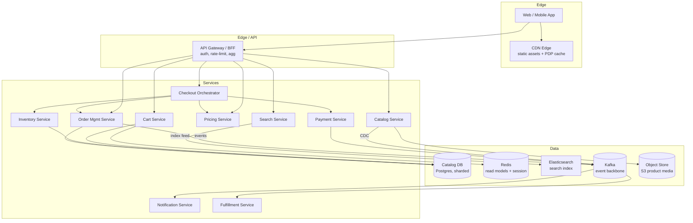

*The architecture is layered at the edge (CDN for static assets, API Gateway/BFF for auth and aggregation) and decomposed into composable services (Catalog, Search, Cart, Pricing, Inventory, Orders, Payments, Notification, Fulfillment) backed by a polyglot data layer: sharded PostgreSQL for durable truth, Redis for read models and sessions, Elasticsearch for search, Kafka as the event backbone, and S3 for media.*

**Back-of-envelope for Flipkart scale:**

- 300M monthly actives → assume 50M daily → each does ~20 product views + 5 searches/day.
- Product page reads ≈ 1B/day ≈ ~12K QPS average, but sale peaks hit 500K+ QPS.
- Orders: say 10M orders/day ≈ ~115 orders/s average, peaking near 10K/s during flash windows.
- Key insight for design: **reads outnumber writes by 1000:1** — the architecture is a caching-and-CDN problem on the read path and a correctness problem on the write path.

---

### Characteristics

| Characteristic | What it means | Why it matters |
|---|---|---|
| **Read/write asymmetry** | ~1000× more reads than writes | Drives multi-layer caching and CDN-first design |
| **Burst-driven demand** | Traffic spikes 10–100× during sales | Capacity planned for peaks, not averages |
| **Mixed consistency needs** | Product pages tolerate seconds of staleness; stock and payments must be exact | Per-subsystem consistency is a first-class decision |
| **Perishable positional inventory** | Specific SKU instances with price/availability | Oversell = legal + financial liability, not just a bug |
| **Composable microservices** | Catalog, cart, pricing, inventory, orders, payments each own data | Independent scaling and failure isolation |
| **End-to-end idempotency** | Clients retry; networks fail; money ops must dedupe | Prevents double-charges and oversells on retry |
| **Global latency & data residency** | Sub-200-ms pages vs. regional data laws (e.g., India DPDP) | Edge routing + regional data partitioning |
| **Personalization as cross-cutting** | Recommendations, ranking, offers per session | Served from precomputed features, not inline |

- **Read/write asymmetry** is the single most important number: a phone launch or flash deal turns 10K write QPS (orders) into 500K read QPS (PDPs, cart, inventory badge). The read path must be near-infinitely scalable via CDN + Redis + replicas; the write path must be correct and bounded.
- **Burst-driven demand** means idle capacity wastes money most of the year. Sale-mode engineering (cell isolation, waiting rooms, pre-warming, graceful feature shedding) converts 100× spikes into survivable load.
- **Mixed consistency** is not a compromise — it is deliberate. The catalog page can lag minutes; inventory reservations must be strongly consistent; payment webhooks are the system of record for money movement.

---

### Pros

- **Proven at planetary scale:** Both Amazon and Flipkart run variants of this design for hundreds of millions of customers and billions of SKUs.
- **Read path scales near-infinitely:** CDN + Redis read-models + database replicas turn half-a-million-QPS sale peaks into manageable origin load.
- **Write-path correctness is concentrated** in a few well-understood components (inventory reservation, payment capture, order creation) — easier to reason about than distributed across many services.
- **Graceful degradation everywhere:** Reviews down → hide them. Recommendations down → show popular. Search degraded → fall back to category browse. The "Buy" button is never hidden.
- **Rich auditability:** The event backbone gives an immutable ledger of every state change — invaluable for dispute resolution, compliance, and postmortems.
- **Two-sided marketplace fit:** Seller onboarding, offer management, and commission flows plug into the same event spine as buyer flows.

---

### Cons

- **Microservices sprawl:** Hundreds of services bring deployment, tracing, and versioning overhead — the operational tax of independent scaling.
- **Eventual consistency leaks into UX:** "Price changed at checkout" and "item just went out of stock" are inherent when catalog/cart reads are eventually consistent.
- **Distributed sagas are hard to test:** Compensation bugs cause real money leaks; refund sagas must be idempotent and observable.
- **Multi-region inventory is a split-brain minefield:** Naive active-active stock leads to oversell; most retailers run active-passive for stock until scale forces finer-grained solutions.
- **Sale-readiness costs:** Capacity sits idle most of the year (or requires aggressive autoscaling engineering) — a fixed cost of surviving flash events.
- **Complexity tax on teams:** Each bounded context needs its own data model, migrations, and contract tests — over-engineering for small catalogs.

---

### Use Cases

- **Flash-sale / sale-day burst engine (Prime Day, Big Billion Days, launches):**
  *Problem:* One hero deal sells out in seconds, generating 100× baseline traffic. *Solution:* cell-isolated inventory for deal SKUs, serialized per-SKU decrements via queues, pre-warmed caches, waiting-room admission control, and feature flags that shed non-critical services (reviews, recommendations, A/B tests). *Trade-off:* dedicated cells sit idle outside events vs. guaranteed outage if unprepared.

- **Cross-device cart continuity:**
  *Problem:* A user adds items on mobile and checks out on laptop. *Solution:* Anonymous cart keyed by a device cookie is merged into the authenticated cart at login using explicit merge semantics (union with max quantities, or explicit user choice). Price snapshots stored at add-time are revalidated at checkout. *Trade-off:* merge conflicts require clear product rules; stale prices are resolved at checkout.

- **COD-heavy markets (Cash on Delivery):**
  *Problem:* Payment settles at the doorstep, days after ordering — inventory held too long kills sellable stock. *Solution:* Shorter reservation TTLs for COD orders, risk-scored COD limits per user, and auto-cancel on failed OTP verification. *Trade-off:* Higher cancellation rates vs. market reach — COD still drives >60% of GMV in key emerging markets.

- **Catalog at 100M+ SKUs with daily price changes:**
  *Problem:* Sellers change prices thousands of times/day; every PDP must reflect the latest while serving 500K+ QPS. *Solution:* Denormalized `product_detail` read blob assembled from catalog + pricing + inventory + reviews, refreshed via CDC events and cached in Redis with short TTL + explicit invalidation. *Trade-off:* read-model rebuild latency vs. origin load.

- **User behavior tracking & personalization spine:**
  *Problem:* Recommendations, dynamic pricing, and fraud scoring need a near-real-time stream of user actions (views, cart adds, purchases). *Solution:* A session/event pipeline emits every action to Kafka; stream processors enrich and feed a feature store consumed by the recommendation and pricing engines. *Trade-off:* event-ordering correctness vs. latency; PII must be stripped before analytics.

User behavior tracking and personalization must be designed as an append-only event spine, not an afterthought bolted onto the catalog.

---

### Components

| Component | Purpose | Responsibilities | Relationship | Example |
|---|---|---|---|---|
| **API Gateway / BFF** | Single edge entry point | Authn, rate limiting, response aggregation, protocol translation, GraphQL federation | Fronts all domain services; one per client type | Flipkart's mobile BFF; Amazon's SP-API |
| **Catalog Service** | Product/SKU source of truth | CRUD for sellers, ASIN/offer model, media metadata, SEO payloads, pricing sync | CDC → event bus; queries → search index | Amazon's catalog APIs |
| **Search Service** | Query → ranked product list | Inverted index, autocomplete, typo tolerance, boosting/sponsoring | Reads from Elasticsearch; enriched by catalog events | Amazon A9/A10; Flipkart search |
| **Cart Service** | Persistent shopping carts | SKU → qty + price snapshot, guest→account merge, TTL cleanup | KV store (Redis/DynamoDB); reads from catalog for price revalidation | Amazon cart |
| **Pricing & Promotions** | Compute the price a user pays | Base price, time deals, coupons, bank offers, stacking rules | Deterministic, auditable; consulted at PDP and checkout | Flipkart's Big Billion pricing engine |
| **Inventory Service** | Stock truth + reservations | Availability, reservation/confirm/release lifecycle, oversell prevention | Strong-consistency store; hot-SKU bucketing | Amazon "available to promise" |
| **Order Management (OMS)** | Order lifecycle owner | State machine, saga orchestration, idempotent creation, history/audit | Emits order events; owns order DB | Amazon OMS |
| **Checkout Orchestrator** | Tie inventory+payment+OMS together | Reserve → create order → capture payment → confirm; coordinate sagas | Calls inventory, OMS, payment; uses idempotency keys | Flipkart checkout |
| **Payment Service** | Abstract PSPs/wallets/cards | PSP integration, retries, webhook verification, refunds | Sync to PSP; async to OMS on result | Amazon Pay / internal wallet |
| **Fulfillment Service** | Warehouse + carrier integration | Pick, pack, ship, tracking events, returns | Consumes order events; writes shipment status | Ekart (Flipkart); FBA (Amazon) |
| **Notification Service** | Order confirmations, shipping updates | Email/SMS/push fan-out | Listens to order events | — |
| **Recommendation Service** | Personalized suggestions | Candidate gen + ranking from behavioral features | Reads feature store; serves PDP/home | Amazon personalizing |

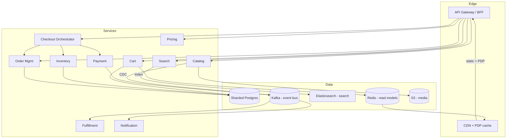

*The component topology: the edge (CDN + BFF) fronts composable services. Catalog publishes CDC events to Kafka; Search indexes them in Elasticsearch; Cart, Inventory, and Orders keep durable truth in sharded Postgres; Redis holds read models and sessions; the Checkout Orchestrator ties the money-critical path together while Fulfillment and Notification consume order events asynchronously.*

---

### Architectural Patterns

- **Saga (orchestration)** — *Problem:* placing an order spans payment + inventory + OMS without distributed transactions. *How:* a checkout orchestrator executes local transactions and compensates on failure (payment captured then inventory fails ⇒ trigger refund). *When:* any multi-service business transaction. *Not when:* a single ACID database suffices. *Pros:* no cross-service locks; fits event-driven design. *Cons:* compensation complexity; intermediate visible states need UX handling.
- **Reservation + TTL** — inventory is reserved at checkout start with a finite hold window (e.g., 10 min); payment success confirms, failure or expiry releases. Balances oversell prevention against abandoned-cart stock hogging.
- **Idempotency-key everywhere on the write path** — every mutating client call carries a client-generated key; the server stores processed keys and replays prior responses so retries collapse safely.
- **CQRS-lite for catalog reads** — catalog writes go to normalized stores; reads come from denormalized `product_detail` blobs refreshed via CDC/events so PDP rendering is one cache lookup, not N service calls.
- **Cell-based isolation for sales** — flash-sale traffic for deal SKUs is routed to dedicated cells (separate inventory partitions, checkout pools, read replicas) so mainstream traffic isn't starved.
- **Circuit breaker + fallback** — recommendations down? Render PDP without them. Reviews down? Hide the section. Spring Cloud CircuitBreaker / Resilience4j with deliberate fallback responses.
- **Optimistic concurrency for counters** — `@Version`-based optimistic locking on hot entities (cart item qty, order state) prevents lost updates; high-volume counters (view_count, like_count) use atomic DB updates or sharded counters.
- **Event sourcing at the spine** — order status transitions, payment state changes, and inventory adjustments are immutable events in the log; read models project from the log, enabling replay and audit.

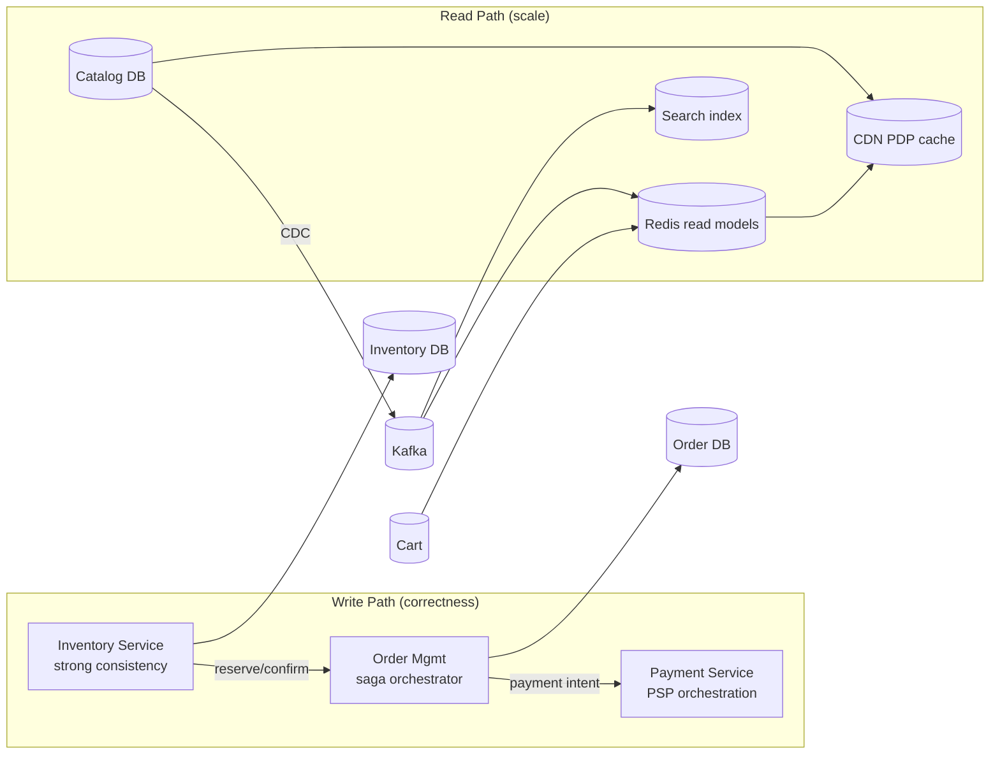

*The write path (inventory, orders, payments) is correctness-first with sagas and idempotency; the read path (catalog, search, PDP cache) is scale-first with denormalized read models refreshed from Kafka CDC events.*

---

### Benefits

- **Independent scaling** matches cost to load: 500× more catalog reads than orders means catalog scales on cheap caches while inventory runs on smaller, strongly-consistent machines.
- **Failure isolation:** A review-service outage never blocks checkout; bulkheads keep revenue flows alive.
- **Team scalability:** Two-pizza teams own bounded contexts (catalog, cart, inventory, orders, payments) — the org chart is the architecture.
- **Event backbone enables velocity:** New consumers (fraud scoring, analytics, loyalty) subscribe to order events without touching checkout code.
- **Cache economics:** 95%+ of reads served without touching origin databases makes 500K-QPS sale peaks affordable.
- **Auditability by default:** Every state change is an event — disputes, reconciliations, and postmortems become trivial.

---

### Challenges

- **Hot-SKU contention:** A viral phone launch funnels thousands of concurrent buyers onto one SKU row. Naive `UPDATE ... WHERE sku=X` causes lock saturation. Solutions: per-SKU queues, bucketed counters, or Redis Lua atomicity for the decrement with DB as durable truth.
- **Burst capacity planning:** 100× spikes demand either expensive idle capacity or aggressive autoscaling/sale-mode engineering. Both cost engineering effort.
- **Cross-region inventory consistency:** Active-active stock risks oversell; active-passive adds failover latency. Most retailers choose active-passive for stock until forced otherwise.
- **Saga correctness:** Partial failures mid-checkout (captured money, unconfirmed inventory) require precise compensation logic that is hard to test and easy to get subtly wrong.
- **Price tampering:** Client-sent totals must never be trusted; the server recomputes every price, applies every offer, and recalculates taxes/shipping server-side.
- **PDP latency under aggregation:** A product detail page aggregates catalog + pricing + inventory + reviews + recommendations. p95 < 200 ms is achieved via read-model caching, not faster RPCs.
- **Data quality & drift:** Catalog feeds from thousands of sellers contain duplicates, stale prices, broken media. Continuous validation pipelines are needed.
- **Regulatory compliance:** PCI (tokenize card data, never log full PANs), data residency (India DPDP, EU GDPR), consumer protection (price transparency, return windows).

---

### Best Practices

- **Recompute all monetary totals server-side:** Client-sent prices and totals are advisory only; the server is the source of truth for every charge.
- **Make every write endpoint idempotent:** `Idempotency-Key` on cart adds, checkout, and payment intents — retries are guaranteed in flaky mobile networks.
- **Reserve-then-confirm inventory with TTL release:** Avoids both oversell (reservation holds stock) and stock-hogging (TTL releases abandoned holds).
- **Cache aggressively, invalidate precisely:** Short TTL (seconds to minutes) for prices/stock + explicit invalidation events when sellers update; long TTL for stable content (descriptions, images).
- **Design sale mode up front:** Feature flags to shed non-essential services, static fallbacks for PDP/recommendations, waiting rooms for admission control.
- **Emit domain events for every state change:** Order created, payment captured, inventory released — all feed analytics, notifications, and ML training.
- **Reconcile daily:** Payments vs. bank files, orders vs. shipments vs. invoices; drift detection catches reconciliation bugs within hours.
- **Shard by tenant, not by entity:** Catalog sharded by `hash(seller_id)` keeps a seller's products together for query locality; orders sharded by `hash(user_id)` for "my orders" locality.
- **Pre-warm before events:** Publish capacity plans tied to the event calendar; load-test at 1.5× forecast; rehearse failover runbooks.
- **Test oversell impossibility:** Integration tests with concurrent `ExecutorService` hammering one SKU must assert exactly one winner per unit.

Every domain event recorded as an immutable, append-only fact is what lets a dispute be reconstructed from the log rather than from scattered service states.

---

### When to Use / When Not to Use

**Use when:**

- You run a two-sided marketplace with many sellers and a large, fast-changing SKU catalog.
- Traffic is read-heavy with predictable burst windows (launches, flash sales, holidays).
- Inventory correctness and payment integrity are non-negotiable (any oversell or duplicate charge is a compliance risk).
- You have a sizable engineering organization that can own a service-per-bounded-context decomposition.
- Cross-device continuity, personalization, and multi-channel fulfilment are competitive differentiators.
- Regulatory scope (PCI, data residency, consumer protection) justifies the investment.

**Avoid when:**

- Single-seller / small catalog (< 10K SKUs, < 100 orders/day) — a monolith on Postgres + a payment gateway is strictly better early on.
- Inventory is count-based and homogeneously available — a simple stock-count column suffices; no positional holds needed.
- The team lacks SRE capacity — microservice sprawl without observability becomes a reliability liability.
- The business model is subscription-only with no catalogue browsing — a CRUD app with Stripe is cheaper.

**Alternatives:**

- **Headless commerce (Shopify/Saleor/Volusion):** Trade customization for speed; own the experience, not the infra.
- **Managed marketplace-as-a-service:** For platforms where inventory comes from partners (travel, services) — a booking engine variant.
- **Monolith + ACID:** Until ~10K orders/day the simplest correct design beats a distributed saga.

**Decision factors:** SKU count, read/write ratio, traffic burstiness, seller count, payment complexity, team size, regulatory footprint. If reads outnumber writes 1000:1 and sales create 100× bursts, caching and cell isolation dominate the design.

---

### Data Model and API

The data model captures the marketplace core: sellers list products (ASIN ↔ offer), buyers fill carts and place orders, inventory is reserved and confirmed, and payments are captured and reconciled. Orders are immutable once created; reservations are ephemeral and time-bound.

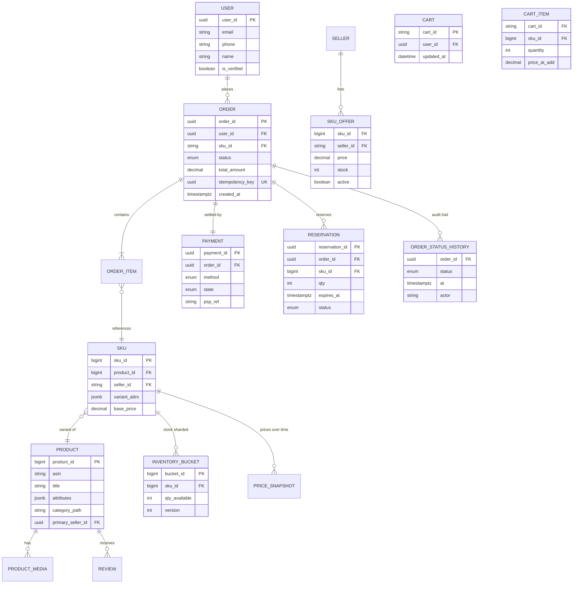

*The entity model centers on the PRODUCT/SKU/OFFER hierarchy (one product, many seller offers) with INVENTORY_BUCKET sharded to avoid hot rows. Orders carry a client-supplied `idempotency_key` (unique constraint) so retries collapse safely; an append-only ORDER_STATUS_HISTORY gives a full audit trail. Carts keep a `price_at_add` snapshot revalidated at checkout.*

**Indexing and constraints:**

- `PRODUCT.asin` — UNIQUE (merchant identifier for deduplication).
- `SKU_OFFER(sku_id, seller_id)` — composite PK; reverse index on `(seller_id, active)` for seller portal queries.
- `INVENTORY_BUCKET(sku_id, bucket_id)` — sharded counter; `version` for optimistic locking on the decrement.
- `ORDER.idempotency_key` — UNIQUE (idempotency safety).
- `ORDER_STATUS_HISTORY(order_id, at)` — index for timeline queries.
- `RESERVATION(expires_at)` — index for the TTL sweeper; `(sku_id, status)` for inventory reconciliation.

**Partitioning / Sharding:**

- **Product & SKU:** sharded by `hash(asin)` — locality for the same product across offer lookups.
- **Inventory & Reservations:** shard by `hash(sku_id)`; hot SKUs further split into `INVENTORY_BUCKET` rows summed at read time.
- **Orders:** sharded by `hash(user_id)` for "my orders"; `idempotency_key` unique globally (cross-partition lookup on retry).
- **Cart:** keyed by `cart_id`; guest carts tagged by device cookie, merged at login.

**API Contract:**

| Method | Endpoint | Purpose | Idempotency |
|---|---|---|---|
| GET | `/api/v1/products/search?q=laptop&category=electronics&page=1&size=40` | Search products | — |
| GET | `/api/v1/products/{asin}` | Product detail (cached blob) | — |
| GET | `/api/v1/products/{asin}/offers` | Seller offers for an ASIN | — |
| POST | `/api/v1/cart/items` | Add to cart | Idempotency-Key |
| GET | `/api/v1/cart` | Read cart (merged guest+account) | — |
| POST | `/api/v1/checkout` | Start checkout (reserves stock) | Idempotency-Key |
| GET | `/api/v1/orders/{orderId}` | Order status (read-your-writes) | — |
| GET | `/api/v1/orders` | Customer order history | — |
| POST | `/api/v1/payments/webhook` | PSP callback (verified) | dedup by pspRef |

**GET /api/v1/products/search Response:**

```json
{
  "results": [
    {
      "asin": "B0ABCD1234",
      "title": "MacBook Pro 14 inch",
      "images": [{"url": "https://cdn.example.com/p/B0ABCD1234.webp"}],
      "price": { "amount": 199900, "currency": "INR", "display": "₹1,99,900" },
      "rating": 4.7,
      "reviewCount": 342,
      "shippingInfo": { "deliveryDays": 2, "free": true },
      "badge": ["Deal of the Day"],
      "offerCount": 3
    }
  ],
  "filters": { "brands": ["Apple"], "priceRange": [100000, 300000] },
  "facets": { "brands": [{"name": "Apple", "count": 12}], "ratings": [] },
  "page": 1, "size": 40, "totalHits": 890, "nextCursor": "cursor-token"
}
```

**POST /api/v1/checkout Request:**

```http
POST /api/v1/checkout HTTP/1.1
Authorization: Bearer <jwt>
Idempotency-Key: 97b8c302-...
Content-Type: application/json

{
  "cartId": "cart-abc123",
  "addressId": "addr-456",
  "paymentMethod": { "type": "card", "token": "tok_xxx" },
  "appliedCoupons": ["COUPON123"]
}
```

**POST /api/v1/checkout Response** (HTTP 202 — async completion via polling/WebSocket):

```json
{
  "orderId": "ord-7d2f9c",
  "status": "PAYMENT_PENDING",
  "amount": { "amount": 199900, "currency": "INR" },
  "nextAction": "redirect_to_psp"
}
```

- `Idempotency-Key` guarantees retries collapse to the same order.
- Order history is served from a materialized view partitioned by `userId`; the revenue path uses sticky routing to the owning Kafka partition for read-after-write consistency.
- The PDP response is a single cached `product_detail` blob combining catalog + pricing + inventory + reviews — rendered from one Redis lookup instead of N service calls.

**Status codes:** `200/201` success, `202` checkout accepted (async), `400` invalid request / missing `Idempotency-Key`, `401` unauthenticated, `403` forbidden, `409` inventory insufficient or idempotency collision (returns existing), `429` rate limited, `503` sale-mode degraded (waiting room fallback).

---

### Amazon/Flipkart Architecture Deep Dive

This section is the domain-specific heart: the catalog model, search discovery, inventory under contention, the cart, the order state machine, the checkout saga, payments, sale-day engineering, and the user-behavior tracking spine. Each deep-dive subsection explains what the pattern solves and why it matters, with Spring Boot code where instructive.

#### Product Catalog — ASIN vs. Offer (Seller-Centric)

Amazon's model separates the abstract **Product (ASIN)** from the concrete **Offer/SKU** sold by a specific seller. A single ASIN ("iPhone 15") can have dozens of seller offers, each with its own price, stock, seller rating, and shipping promise. This separation is critical: the offer layer is write-hot (sellers change prices constantly), while the product layer is write-cold (rarely changes).

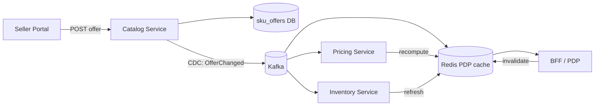

*Catalog event flow: a seller offer write lands in the sku_offers DB; a CDC event (`OfferChanged`) fans out to Pricing (recompute final price), Inventory (refresh availability), and the Redis PDP read-model cache (invalidate/recompute). The PDP read path is a single Redis lookup.*

```java
@Service
@RequiredArgsConstructor
public class PricingService {

    @Value("${app.pricing.cache-ttl-seconds:60}")
    private int cacheTtlSeconds;

    private final RedisTemplate<String, String> redis;
    private final SkuOfferRepository skuRepository;
    private final PromotionEngine promotionEngine;

    @Transactional(readOnly = true)
    public Money calculatePrice(String asin, String sessionId, List<String> coupons) {
        String cacheKey = "price:" + asin + ":" + sessionId;
        String cached = redis.opsForValue().get(cacheKey);
        if (cached != null) {
            return Money.fromJson(cached);
        }

        var offers = skuRepository.findActiveByAsin(asin);
        Money finalPrice = promotionEngine.applyBest(
                offers, coupons, sessionId);

        redis.opsForValue().set(cacheKey, finalPrice.toJson(),
                Duration.ofSeconds(cacheTtlSeconds));
        return finalPrice;
    }

    @EventListener
    public void handleOfferChanged(OfferChangedEvent event) {
        redis.delete("price:" + event.getAsin() + ":*");
    }
}
```

*The `PricingService` bean resolves the final price for an ASIN: it checks a Redis cache (keyed by ASIN + session for personalization), and on a miss queries active offers + applies promotions deterministically. The cache TTL is `@Value`-injected. An `@EventListener` invalidates all price cache entries for an ASIN when an `OfferChanged` event arrives, ensuring price staleness is bounded to the TTL. All pricing math is server-side — the client never computes a total.*

#### Search & Discovery — A9/A10-Style Ranking

Search is query → ranked product list. Unlike social feeds, search must be deterministic per query and reflect freshness (new deals, trending items) without full reindexing.

```java
@Service
@RequiredArgsConstructor
public class SearchService {

    private final ElasticsearchOperations esOperations;
    private final ProductReadModelRepository readModels;

    @Value("${app.search.default-size:40}")
    private int defaultSize;

    public SearchResponse search(String query, SearchFilters filters, int page, int size) {
        var q = QueryBuilders.multiMatchQuery(query, "title", "brand", "category", "attributes");

        var pageable = PageRequest.of(page, Math.min(size, defaultSize));
        var searchHits = esOperations.search(
                NativeSearchQueryBuilder.builder()
                        .withQuery(q)
                        .withFilter(toBooleanFilter(filters))
                        .withAggregations(AggregationBuilders.terms("brands").field("brand"))
                        .withPageable(pageable)
                        .build(),
                ProductDoc.class);

        var productIds = Arrays.stream(searchHits.getSearchHits())
                .map(hit -> ((ProductDoc) hit).getAsin()).toList();

        // Enrich with real-time pricing + inventory (batch fetch)
        var enriched = readModels.enrich(productIds);

        return toResponse(searchHits, enriched);
    }

    private BooleanBuilder toBooleanFilter(SearchFilters f) {
        var bb = new BooleanBuilder();
        if (f.category() != null) bb.and(new Criteria("category_path").is(f.category()));
        if (f.minPrice() != null) bb.and(new Criteria("price").greaterThanEqual(f.minPrice()));
        if (f.maxPrice() != null) bb.and(new Criteria("price").lessThanEqual(f.maxPrice()));
        return bb;
    }
}
```

*The `SearchService` bean uses Spring Data Elasticsearch: it builds a multi-match query over title/brand/category/attributes, applies filter aggregations (for facets), paginates, then enriches ASIN hits with real-time pricing and inventory from the read-model cache. The `@Value`-injected default size caps abuse. Filter building is factored into a helper for testability.*

#### Inventory — The Heart of Correctness

Overselling is a business failure; blocking sales unnecessarily is lost revenue. The standard pattern is **reserve → confirm → release-on-timeout**.

| Strategy | How | Trade-off |
|---|---|---|
| Synchronous decrement at order placement | `UPDATE stock SET qty = qty - ? WHERE sku=? AND qty >= ?` | Correct but hot-row contention on viral items |
| Reservation + confirmation two-phase | Hold stock for T minutes at checkout start; confirm on payment | Industry standard |
| Bucketed counters | Split stock into 8 buckets, decrement any non-empty, aggregate for display | Defeats row-lock contention; display is approximate |
| Eventual with oversell buffer | Allow slight oversell; absorb via substitution/cancellation | Only for long-tail items |

The inventory service enforces atomicity inside the service using conditional updates or Redis Lua scripts for hot keys, plus queue-based serialization for extreme contention (a single partition owning one SKU serializes its updates).

```java
@Service
@RequiredArgsConstructor
public class InventoryService {

    private final InventoryBucketRepository buckets;
    private final ReservationRepository reservations;
    private final RedisTemplate<String, String> redis;

    @Value("${app.inventory.default-hold-minutes:10}")
    private int defaultHoldMinutes;

    @Transactional
    public Reservation reserve(String skuId, int qty, Duration ttl) {
        // Fast path: Redis Lua atomic soft-hold for the hot SKU
        String holdKey = "hold:" + skuId;
        Boolean locked = redis.execute(HOLD_LUA, List.of(holdKey),
                String.valueOf(qty), String.valueOf(ttl.toMillis()));
        if (Boolean.FALSE.equals(locked)) {
            throw new OutOfStockException(skuId);
        }

        // Durable truth: decrement bucket with optimistic lock
        List<InventoryBucket> candidates =
                buckets.findWithLockingBySkuOrderByQtyDesc(skuId);
        int remaining = qty;
        for (InventoryBucket b : candidates) {
            int take = Math.min(b.getQtyAvailable(), remaining);
            if (take <= 0) continue;
            b.setQtyAvailable(b.getQtyAvailable() - take);
            remaining -= take;
            if (remaining == 0) break;
        }
        if (remaining > 0) {
            throw new OutOfStockException(skuId);
        }

        var reservation = Reservation.builder()
                .skuId(skuId).qty(qty)
                .expiresAt(Instant.now().plus(ttl))
                .status(ReservationStatus.ACTIVE)
                .build();
        return reservations.save(reservation);
    }

    @Scheduled(fixedDelay = 30_000)
    void expireStaleReservations() {
        reservations.findByStatusAndExpiresAtBefore(
                ReservationStatus.ACTIVE, Instant.now())
                .forEach(r -> {
                    r.markExpired();
                    redis.delete("hold:" + r.getSkuId());
                    buckets.release(r.getSkuId(), r.getQty());
                });
    }

    private static final DefaultRedisScript<Boolean> HOLD_LUA = new DefaultRedisScript<>(
            """
            local current = redis.call('GET', KEYS[1]) or 0
            if tonumber(current) < tonumber(ARGV[2]) then return 0 end
            redis.call('DECRBY', KEYS[1], ARGV[2])
            redis.call('PEXPIRE', KEYS[1], tonumber(ARGV[3]))
            return 1
            """, Boolean.class);
}
```

*The `InventoryService` bean implements the reserve/confirm/release lifecycle. The `reserve` method uses a Redis Lua script (atomic check-and-decrement) for the hot-SKU fast path, then records a durable reservation row with optimistic locking on bucket counters. A `@Scheduled` sweeper (every 30s) releases expired reservations and returns stock to buckets — both the Redis key and DB row are cleared. The hold TTL is `@Value`-injected. The `@Transactional` boundary keeps the DB write atomic with the reservation.*

#### Order Management — State Machine + Sagas

Orders are a **state machine**: `CREATED → PAYMENT_PENDING → CONFIRMED → PACKED → SHIPPED → DELIVERED` (+ `CANCELLED`, `RETURNED`, `REFUNDED`). Every transition is an event consumed by other systems. The OMS owns idempotent order creation (client-generated `requestId`; duplicates collapse to same order) and orchestrates the checkout saga.

The checkout saga coordinates inventory → payment → OMS. If payment succeeds but inventory confirmation fails, an automatic refund saga fires.

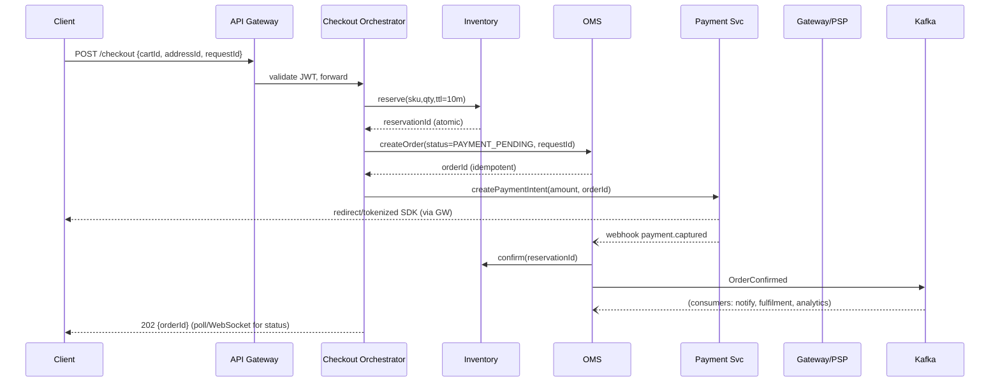

*Checkout sequence with compensation path: the client submits checkout with an idempotency key; the orchestrator reserves stock (atomic), creates an idempotent order in PAYMENT_PENDING, initiates payment via a PSP redirect, and on the payment-captured webhook confirms the reservation and emits an `OrderConfirmed` event. Compensation path: a failed payment or reservation TTL → release inventory, cancel order, notify the user.*

#### Hold Lifecycle (Amazon/Flipkart Reservation Model)

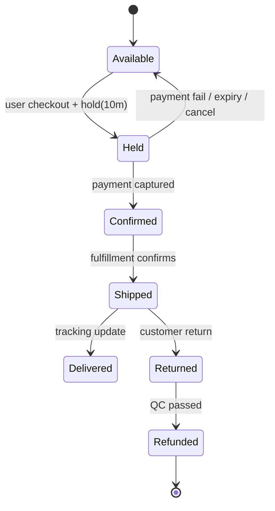

The reservation holds inventory at checkout start with a finite TTL. The state machine guarantees one buyer wins each unit — no double-sells, no deadlocks. Every transition emits an event for analytics, receipts, and seat-map refresh broadcasts.

Stock contention under a flash sale: a single phone launch can funnel 50K concurrent buyers onto one SKU. The system ladders up: (1) Redis Lua atomic decrement for the soft-hold fast path; (2) bucketed INVENTORY_BUCKET rows to avoid row-lock contention; (3) per-SKU queue serialization as the last resort. Display inventory can be soft-realtime (approximate) while checkout enforces exact truth.

The inventory decrement uses bucketed counters to defeat row-lock contention under flash-sale bursts; the per-SKU owner pattern serializes the hot path, and lazy release via a sweeper frees abandoned holds without long-lived locks.

#### Cart Service — Guest Continuity and Merge

- **Cart = map of SKU → quantity** with a `price_at_add` snapshot (revalidated at checkout).
- **Anonymous carts** are keyed by a device cookie issued at first add; at login they merge into the authenticated account cart. Merge semantics are explicit: union of items, max of conflicting quantities, with a prompt to resolve hard conflicts.
- **Storage:** Redis with AOF persistence (cart loss is annoying, not fatal); availability and cross-region replication matter more than strong consistency. Hot carts are sharded by `cart_id` hash.
- **Stale pricing:** Prices in the cart are advisory; the checkout revalidates every price server-side against the pricing engine before charging.

```java
@Service
@RequiredArgsConstructor
public class CartService {

    private final RedisTemplate<String, String> redis;
    private final PricingService pricingService;
    private final ObjectMapper objectMapper;

    @Value("${app.cart.ttl-days:7}")
    private int cartTtlDays;

    public void addItem(String cartId, String skuId, int quantity, String sessionId) {
        String cartKey = "cart:" + cartId;
        String field = "item:" + skuId;
        String price = pricingService.calculatePrice(skuId, sessionId, List.of()).toJson();
        // HSET with price snapshot; TTL keeps anonymous carts from growing forever
        redis.opsForHash().put(cartKey, field,
                objectMapper.toJson(new CartItem(skuId, quantity, price)));
        redis.expire(cartKey, Duration.ofDays(cartTtlDays));
    }

    public CartSummary getCart(String cartId) {
        String cartKey = "cart:" + cartId;
        var entries = redis.opsForHash().entries(cartKey);
        var items = entries.values().stream()
                .map(s -> objectMapper.readValue((String) s, CartItem.class))
                .toList();
        return new CartSummary(items, recalculateTotal(items));
    }

    @Transactional
    public void merge(String guestCartId, String userCartId) {
        String guestKey = "cart:" + guestCartId;
        String userKey = "cart:" + userCartId;
        var guestItems = redis.opsForHash().entries(guestKey);
        // Union with max quantities; persist merged; delete guest
        guestItems.forEach((field, value) -> {
            var current = redis.opsForHash().get(userKey, field);
            int mergedQty = mergeQuantities(value, current);
            redis.opsForHash().put(userKey, field, withQty(value, mergedQty));
        });
        redis.delete(guestKey);
    }

    record CartItem(String skuId, int quantity, String priceSnapshot) {}
    record CartSummary(List<CartItem> items, Money total) {}
}
```

*The `CartService` bean stores cart items as Redis hashes (SKU → CartItem) with a configurable TTL (`@Value`-injected) so anonymous carts don't grow unbounded. `addItem` captures a price snapshot at add time via the PricingService. `merge` unions a guest cart into a user's cart at login using max-quantity semantics, all within a `@Transactional` boundary. Prices are revalidated at checkout — the cart snapshot is advisory only.*

#### Payments — PSP Orchestration and Reconciliation

Checkout calls a PSP (or internal wallet/UPI stack) behind a Payment Service abstraction. Core rules:

1. **Never trust the client** about payment outcome — always verify via the server-to-server webhook.
2. **Reconcile** PSP settlement files daily against the internal ledger (settlement-reconciliation).
3. **Timeouts** must trigger reservation release and a clearly communicated "pending" state — never a silent failure.
4. **Idempotent webhooks** — dedup by `pspRef` and signature-verify every callback (HMAC-SHA256).

The Payment Service supports retries with alternate PSPs (circuit-breaker + fallback), and a webhook verifier that is the single source of truth for "payment captured".

```java
@RestController
@RequiredArgsConstructor
@RequestMapping("/api/v1/payments/webhook")
public class PaymentWebhookController {

    private final PaymentService paymentService;
    private final WebhookSignatureVerifier verifier;

    @PostMapping
    public ResponseEntity<Void> handle(@RequestBody String body,
                                       @RequestHeader("X-Signature") String signature) {
        if (!verifier.isValid(body, signature)) {
            return ResponseEntity.status(HttpStatus.FORBIDDEN).build();
        }
        var event = objectMapper.readValue(body, PaymentEvent.class);
        paymentService.handleWebhook(event); // idempotent by pspRef
        return ResponseEntity.ok().build();
    }
}
```

*The `PaymentWebhookController` verifies the PSP's HMAC signature (`X-Signature` header) before processing — unverified callbacks are rejected with 403. The `PaymentService.handleWebhook` method is idempotent (deduped by `pspRef`) and drives the downstream saga: a `payment.captured` event confirms the order; a `payment.failed` event releases inventory and notifies the user.*

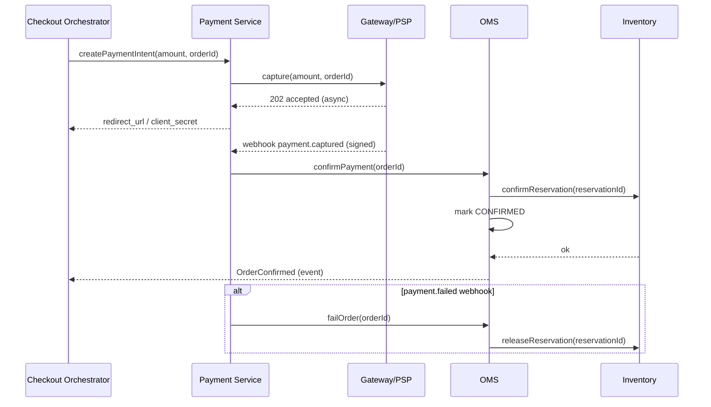

*Payment orchestration timeline with compensation: the checkout initiates a payment intent; the PSP responds asynchronously; on the signed `payment.captured` webhook the OMS confirms the reservation and marks the order CONFIRMED. If instead a `payment.failed` webhook arrives (or the hold TTL expires), the reservation is released and the order is failed — the compensation path is idempotent and observable.*

#### Flash-Sale / Sale-Day Engineering

This is where the architecture is most stressed. Traffic spikes 100× in seconds for a hero deal.

**Sale mode engineering:**

- **Cell-based isolation:** Deal SKUs are routed to dedicated cells (separate inventory partitions, checkout pools, read replicas) so mainstream traffic isn't starved. Feature flags shed non-essential services (reviews, recommendations, A/B tests) — the "Buy" button is never hidden.
- **Waiting rooms:** Edge admission control admits users into a virtual queue with honest position tracking; releases are paced at controlled rate matching system capacity × expected conversion.
- **Pre-warming:** Capacity plans tied to the event calendar; caches pre-populated with deal PDPs; connection pools primed.
- **Request coalescing / single-flight:** For cache misses on the same viral PDP, only one origin fetch is issued and the result shared.
- **Fast-fail:** Once a deal is sold out, the PDP returns a deterministic 410/409 with a retry-suggestion payload rather than hammering the inventory DB.

```java
@Service
@RequiredArgsConstructor
public class FlashSaleService {

    private final InventoryService inventory;
    private final Cache<String, Semaphore> dealSemaphores;
    private final MeterRegistry meters;

    @Value("${app.flashsale.max-concurrency-per-deal:5000}")
    private int maxConcurrency;

    @Transactional
    public Reservation reserveForDeal(String dealSku, int qty, String userId) {
        var semaphore = dealSemaphores.get(dealSku,
                () -> newSemaphore(maxConcurrency));
        if (!semaphore.tryAcquire()) {
            meters.counter("flashsale.dropped", "deal", dealSku).increment();
            throw new TooManyRequestsException("Sale admission capacity reached");
        }
        try {
            return inventory.reserve(dealSku, qty, Duration.ofMinutes(8));
        } finally {
            semaphore.release();
        }
    }

    private Semaphore newSemaphore(int permits) {
        return new Semaphore(permits, /* fair */ true);
    }
}
```

*The `FlashSaleService` bean caps concurrency per deal SKU using a fair `Semaphore` cached per deal (`@Value`-injected max permits). `tryAcquire` drops requests beyond capacity (fast-fail) while counting drops for autoscaling signals; the acquired permit is always released in `finally`. The actual reservation delegates to `InventoryService` with a shortened 8-minute TTL for sale velocity. Fairness in the semaphore prevents thundering-herd starvation of legitimate buyers.*

#### User Behavior Tracking & Personalization Spine

Recommendations, dynamic pricing, and fraud scoring need a near-real-time stream of user actions (views, cart adds, purchases, clicks). The system emits every action as an event to Kafka; stream processors enrich and feed a feature store consumed downstream.

- **Event emission:** Every service publishes to topic-per-event-type (`product.viewed`, `cart.item_added`, `order.confirmed`). Events are immutable, schema-versioned (Avro/Protobuf), and carry a trace-id for correlation.
- **Enrichment:** A Flink/Spark Streaming job joins raw events with user/profile features and computes aggregates (rolling 7-day views, 24-hour CTR, recent purchase category).
- **Feature store:** Online (Redis, 1-5s TTL for real-time aggregates) + offline (BigQuery/Hive, batch-computed for training).
- **Consumption:** The Recommendation Service reads user features at feed-generation time; the Pricing Service reads cohort-level affinity for dynamic offers; the Fraud Service scores sessions for anomaly patterns.
- **Privacy:** PII (email, phone, precise location) is stripped or token-hashed before entering the analytics pipeline; only the feature store keeps raw identifiers with strict access control.

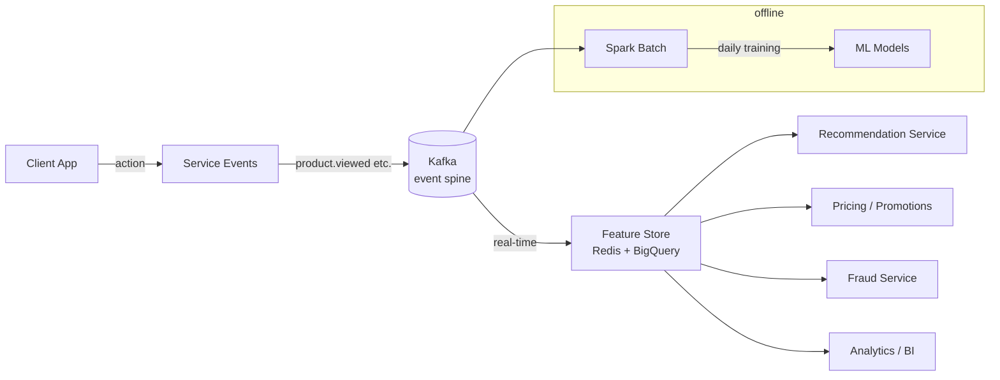

*Behavioral data flow: every user action is published to Kafka (schema-versioned, immutable); stream processors enrich and materialize into a feature store (Redis for online real-time features, BigQuery for offline batch); the Recommendation, Pricing, Fraud, and BI services consume the feature store, while a daily Spark batch retrains offline models from the same event log.*

Every flash sale lives or dies on the handoff between admission control and the reservation fast-path, so the two are tested together under simulated 100× bursts before any deal goes live.

---

### Replication Strategies

E-commerce replicates data across three axes: within a region (for availability), across regions (for global latency and DR), and across storage systems (for different access patterns).

**Catalog DB (PostgreSQL) — synchronous + async cross-region:** Writes go to the primary and stream WAL changes synchronously to in-region read replicas (strong consistency for price changes) with asynchronous cross-region replicas for disaster recovery. A quorum of `(N/2)+1` replicas confirms each write. Failover is automated via Patroni/etcd.

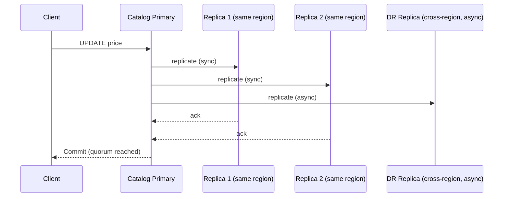

*Cross-region replication strategy for the catalog: the client writes to the primary; same-region replicas acknowledge synchronously (so the new price is immediately readable from any local replica); a cross-region DR replica receives asynchronous updates for disaster recovery. Writes are committed only after a quorum of same-region replicas acknowledge.*

**Cart (Redis) — asynchronous replication + cluster:** Carts are stored in Redis Cluster (16,384 hash slots, master/replica) with asynchronous replication. Cart loss is recoverable from a recent snapshot; availability matters more than strong consistency for the cart. Session stickiness routes a user's requests to the replica holding their cart.

**Inventory (PostgreSQL + Redis) — strong within region:** Inventory is the one system that does NOT tolerate divergence. It runs on a primary with synchronous replicas within the region; cross-region failover is active-passive with explicit handoff (a brief suspension is preferable to split-brain stock). The Redis hot-key layer is ephemeral (TTL-backed soft holds) and is always reconciled against the durable DB.

**Orders (PostgreSQL) — shard + async replica:** Orders are sharded by `hash(user_id)` for "my orders" locality; read replicas serve the order history materialized view. The `idempotency_key` unique index is global (cross-shard lookup on retry).

**Search index (Elasticsearch) — multi-AZ:** The search cluster spans 3+ availability zones with one replica per shard; new documents are visible within ~1 second. Reindexing uses blue/green deployment of indices so queries are never served from a half-rebuilt index.

**Real-world use:** DynamoDB Global Tables for user profiles (active-active multi-region), Cassandra for engagement/session data (tunable consistency), Redis Cluster for carts and read models (master/replica with failover).

---

### Failure Detection and Membership

E-commerce services must detect failed nodes, redistribute work, and continue serving with minimal disruption — especially during sale windows when every second of downtime loses revenue.

**Gossip-based membership:** Each service instance periodically exchanges health information with a random subset of peers (gossip protocol). This spreads membership changes through the cluster in O(log N) rounds without a central coordinator.

**Health checks:**

- **Liveness probes:** HTTP `/health/liveness` checked every 2 seconds by Kubernetes. If unhealthy, the pod is restarted.
- **Readiness probes:** HTTP `/health/readiness` checks DB connectivity and downstream dependencies (cache, event bus). Not-ready pods are removed from the service mesh.
- **Business health checks:** Custom checks like "Kafka consumer lag < 10,000", "inventory reservation p95 < 100 ms", and "payment webhook processing queue < 1000".

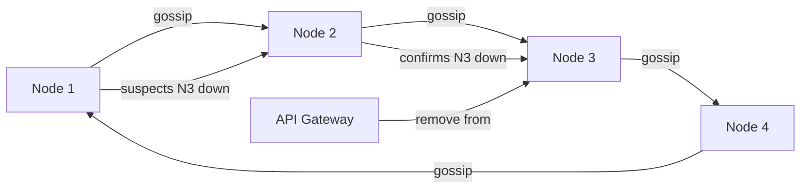

*Gossip-based failure detection: nodes exchange health state with random peers; when a node suspects a peer is down, the suspicion propagates through gossip and, once confirmed by a quorum, the peer is removed from the load balancer's pool. This keeps the failure detector decentralized and resilient to coordinator outages.*

**Failure detection timing for e-commerce:**

| Component | Check Interval | Timeout | Action |
|---|---|---|---|
| Catalog Service | 5s | 15s | Mark replica stale; serve from primary |
| Cart (Redis) | 2s | 30s | Failover to replica; fall back to session cookie |
| Inventory | 3s | 10s | Reject checkout writes; serve stale display |
| Payment Service | 5s | 30s | Queue webhooks; retry with alternate PSP |
| Checkout Orchestrator | 2s | 15s | Fail in-flight checkouts; release reservations |

**Circuit breakers:** For dependencies that are failing, a circuit breaker (Resilience4j) trips after N consecutive failures and stops sending requests for a cool-down period. This prevents cascading failures — e.g., if the Recommendation Service is slow, the PDP renders without recommendations rather than timing out the whole page.

```java
@Service
@RequiredArgsConstructor
public class CircuitBreakingCheckout {

    private final InventoryClient inventory;
    private final PaymentClient payment;

    @CircuitBreaker(name = "inventory", fallbackMethod = "inventoryFallback")
    public Reservation reserve(String skuId, int qty) {
        return inventory.reserve(skuId, qty, Duration.ofMinutes(10));
    }

    @CircuitBreaker(name = "payment", fallbackMethod = "paymentFallback")
    public PaymentIntent initiatePayment(String orderId, Money amount) {
        return payment.createIntent(orderId, amount);
    }

    private Reservation inventoryFallback(String skuId, int qty, Exception ex) {
        throw new ServiceUnavailableException("Inventory temporarily unavailable");
    }

    private PaymentIntent paymentFallback(String orderId, Money amount, Exception ex) {
        throw new PaymentRetryableException("Payment gateway unavailable; will retry");
    }
}
```

*The `CircuitBreakingCheckout` bean wraps inventory and payment calls with Resilience4j `@CircuitBreaker` annotations. Each call has a `fallbackMethod` that converts failures into controlled exceptions — inventory unavailability aborts the checkout cleanly; payment gateway failures return a retryable exception so the checkout orchestrator can queue and retry. This prevents a degraded PSP from cascading into checkout timeouts.*

---

### High Availability and Scalability

Availability is achieved through replication, multi-region deployment, and graceful degradation; scalability through partitioning, caching, and independent horizontal scaling of each service tier.

#### Multi-Region Deployment

Deploy active services in at least 3 regions (e.g., us-east, eu-west, ap-southeast). Users are routed to the nearest region via GeoDNS or a latency-based load balancer. Each region is self-sufficient for read and write operations, with asynchronous cross-region replication for durability.

- **Active-passive for inventory:** A single primary region owns stock writes; cross-region failover is explicit (brief suspension > split-brain oversell).
- **Active-active for catalog reads:** Read replicas in every region serve PDPs; writes route back to the primary.
- **Active-active for cart:** Redis Cluster with cross-region replication; cart is eventually consistent (acceptable).
- **Global CDN:** Static assets, images, and cached PDPs served at edge locations worldwide for < 50 ms page loads.

#### Auto-Scaling

- **Stateless services (BFF, Search, Cart API):** Scale horizontally on CPU + request latency via Kubernetes HPA.
- **Checkout/Inventory:** Scale on checkout RPS; inventory scaled for peak concurrent reservations, not average.
- **Flash-sale cells:** Pre-provisioned dedicated capacity that scales up to a fixed ceiling during the deal window.

#### Graceful Degradation

When a component fails, the system degrades rather than crashes:

- **Recommendations down:** PDP renders without personalized sections.
- **Search degraded:** Fall back to category browse + static sorting.
- **Inventory display stale:** Show "only a few left" using the last known good value while checkout enforces exact truth.
- **Payment PSP brownout:** Retry with an alternate PSP behind a circuit breaker; queue webhooks for async completion.
- **Catalog primary failure:** Route writes to a standby region via failover; reads from regional replicas continue.

```mermaid
graph TD
    Traffic[Global Load Balancer<br/>GeoDNS] -->|nearest| US[US-East Region]
    Traffic -->|fallback| EU[EU-West Region]
    US --> USCache[Local Redis<br/>carts + read models]
    US --> USDB[Catalog Primary<br/>(writes)]
    US --> USR[Read Replicas]
    EU --> EUCache[Local Redis]
    EU --> EUDB[Catalog Standby<br/>(standby)]
    USDB -->|async DR| EU
    US --> BFF1[BFF / APIs]
    EU --> BFF2[BFF / APIs]
    BFF1 --> CDN1[CDN Edge]
    BFF2 --> CDN2[CDN Edge]
    subgraph "Region 1 (active)"
        USCache
        USDB
        USR
        BFF1
    end
    subgraph "Region 2 (standby)"
        EUCache
        EUDB
        BFF2
    end
```

*Multi-region deployment: a global load balancer routes users to the nearest active region; each region has its own Redis cache, catalog read replicas, and BFF/API pods for low latency. The catalog primary accepts writes in one region with an asynchronous DR replica in the standby region; on failover, the standby takes over writes so no revenue path is lost.*

High availability for an e-commerce platform is ultimately about protecting the revenue path: checkout, payment, and order creation must degrade gracefully but never silently fail, so the system always returns a deterministic outcome (success, retry, or honest "sold out") to the buyer.

---

### Performance and Optimization

Performance is measured as PDP p95 < 200 ms, search p95 < 150 ms, checkout initiation p99 < 500 ms, and inventory reservation p99 < 100 ms. The read path dominates: ~1000:1 read-to-write ratio means caching is the lever.

#### Latency Optimization

- **PDP read-model caching:** A denormalized `product_detail` JSON blob (catalog + pricing + inventory + top reviews) is cached in Redis with a 30–60s TTL and explicit invalidation on `OfferChanged` / `InventoryUpdated` events. PDP rendering is one Redis GET, not five service calls.
- **Search result enrichment batching:** After Elasticsearch returns ASINs, the enrichment step batch-fetches pricing + inventory in parallel rather than per-item.
- **Connection pooling:** Persistent HTTP/gRPC connections between the BFF and backend services avoid per-request handshake overhead.
- **Lazy/non-critical loading:** Ratings, reviews, and recommendations load asynchronously after the primary PDP render, with skeleton UIs so perceived latency stays low.

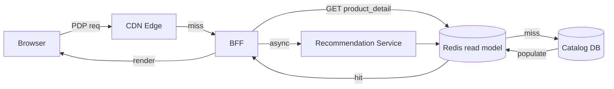

*PDP latency optimization: the browser hits the CDN edge; a miss is served by the BFF, which does a single Redis GET for the preassembled `product_detail` blob. On a Redis miss, the catalog DB populates the cache. Non-critical sections (recommendations) load asynchronously after the primary render completes.*

#### Throughput Optimization

- **Search fan-out:** Elasticsearch query is fanned out across all shards and results merged; replicas multiply read throughput.
- **Inventory bucketing:** Hot SKUs are split into N `INVENTORY_BUCKET` rows so concurrent decrements hit different rows/locks; the displayed total is the sum, recomputed via a cached aggregate that is eventually consistent.
- **Checkout autoscaling:** Checkout pods scale on checkout RPS; the inventory and payment pools carry 2× headroom above forecast.
- **Sale-mode request coalescing:** During bursts, a single-flight layer deduplicates concurrent identical PDP fetches (same ASIN), cutting origin load by 10–30× for viral products.

#### Caching Strategies

| Tier | What | TTL | Hit Target |
|---|---|---|---|
| L1 (process-local) | Hot PDP blobs in BFF heap | 10s | 60% for viral products |
| L2 (Redis) | Preassembled `product_detail`, cart, session | 30–600s | 95%+ for PDP |
| CDN | Static assets, images, cached PDP HTML | 5m–24h | 90%+ of asset requests |
| Feature store | User/recs features | 1–5s (online) | — |

#### Write Path Optimization

- **Async fan-out of order events:** Order creation returns 201 after the DB write; downstream (notifications, analytics, fulfilment) consumes the event asynchronously from Kafka — keeping checkout latency low.
- **Inventory display vs. truth split:** The PDP shows an approximate, cached inventory count (soft-realtime) while checkout enforces the exact truth via the reservation Lua script. This separates display throughput from correctness.
- **Reservation queueing for extreme contention:** Beyond bucket-level parallelism, a per-SKU queue serializes the hot path, making oversell mathematically impossible while accepting bounded queuing delay.

---

### CAP Theorem and Consistency Trade-offs

An e-commerce platform runs over networks, so partition tolerance is always required. The CAP trade-off is C-vs-A chosen **per subsystem**, based on the blast radius of inconsistency.

#### Inventory — CP (Consistency + Partition Tolerance)

Oversell is a legal and financial liability. Inventory is CP: within a region, writes go to a primary with synchronous replica acknowledgement; a reservation succeeds only if all same-region replicas confirm. Cross-region is active-passive with explicit failover (no concurrent writers). A brief unavailability is preferred over a double-sell.

#### Payments — CP (strong within region, reconciled globally)

A payment capture must never be lost or duplicated. The Payment Service treats the PSP webhook as the source of truth, dedups idempotent by `pspRef`, and reconciles with bank settlement files daily. Money movement is strongly consistent within a region and reconciled asynchronously across regions.

#### Order creation — CP (read-your-writes)

A returned `orderId` means the order exists and is retrievable immediately. Orders are written to a primary with synchronous acknowledgement; order history uses sticky routing to the owning Kafka partition for read-after-write consistency.

#### Catalog — AP (Availability + Partition Tolerance)

Product pages can tolerate seconds of staleness. The catalog is cached aggressively (CDN + Redis); a stale price is corrected at checkout. If the catalog primary is unreachable, PDPs are served from region-local replicas until failover.

#### Cart — AP with bounded staleness

Cart loss is recoverable from a recent snapshot. Redis Cluster with asynchronous replication across AZs keeps carts available; a brief staleness (merge conflicts on login) is acceptable.

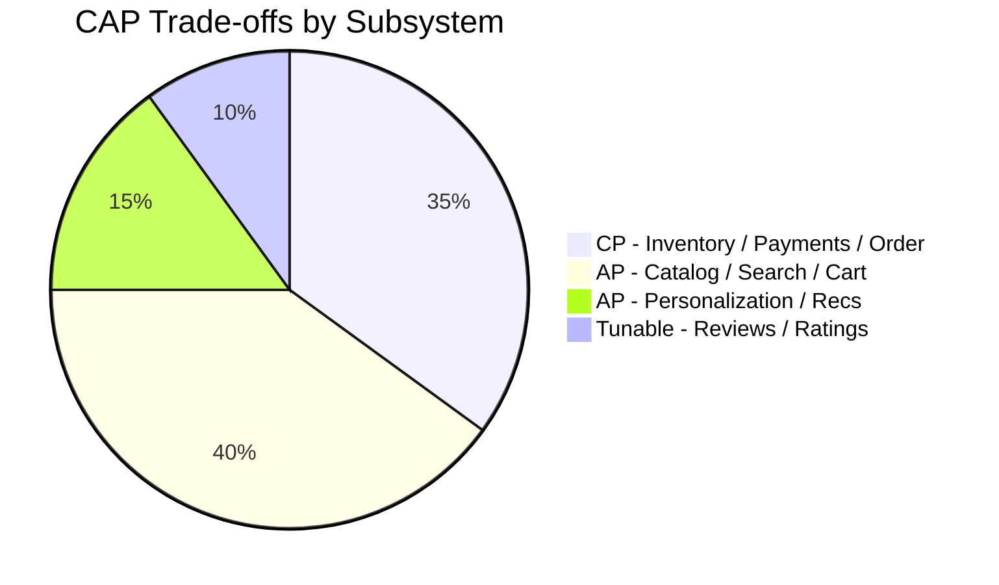

*CAP trade-offs across e-commerce subsystems: inventory, payments, and orders are CP (consistency-first — money and stock cannot diverge); catalog, search, and cart are AP (availability-first with bounded staleness); personalization/recommendations are AP; reviews and ratings use tunable consistency.*

**Interview question:** *Is e-commerce strongly consistent or eventually consistent?*
**Answer:** It is a deliberate split: strongly consistent for the money-critical path (inventory reservations, payment capture, order creation) and eventually consistent for the read-heavy discovery path (catalog, search, cart, recommendations). The principle is "match consistency level to blast radius" — a stale product description is a UX bug; a double-sold seat or a dropped charge is a business-ending event.

---

### Encryption and Key Management

E-commerce handles the most sensitive data: payment instruments, PII, order histories, and seller financials. Encryption must protect data at rest, in transit, and during processing.

#### Encryption at Rest

- **Object storage:** S3 objects encrypted with SSE-KMS using customer-managed keys; product media stored encrypted by default.
- **Databases:** PostgreSQL uses TDE (Transparent Data Encryption); payment card fingerprints are stored encrypted at the column level; the order DB uses disk-level encryption.
- **Redis:** Redis Enterprise encrypts data on disk (AES-256); for open-source Redis, filesystem-level encryption (dm-crypt) since Redis is primarily in-memory.
- **Payment data:** Card data is NEVER stored — only PANs are tokenized at the edge via a PCI-compliant vault; the vault stores only tokens, which are useless without the PSP mapping.

#### Encryption in Transit

- **TLS 1.3** terminates at the edge (ALB/CloudFront) and for all inter-service traffic.
- **Mutual TLS (mTLS)** between microservices carries service identity and encryption — managed by a service mesh (Istio).
- **Media download** uses pre-signed S3 URLs over HTTPS with short expirations.

#### Key Hierarchy

A KEK (Key Encryption Key) in an HSM-backed KMS encrypts per-service DEKs (Data Encryption Keys). Rotating the KEK requires only re-encrypting the DEKs, not the data. TikTok-style multi-region KMS keys ensure key availability across deployment regions.

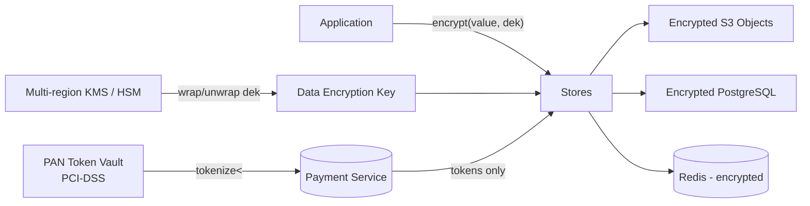

*Encryption key hierarchy: applications encrypt values with per-service data encryption keys (DEKs), which are wrapped by a KEK in a multi-region KMS/HSM; stores persist only ciphertext. Payment card data is never stored — PANs are tokenized by a PCI-DSS vault and only tokens reach the application layer.*

```java
@Service
@RequiredArgsConstructor
public class MediaEncryptionService {

    @Value("${app.encryption.media-key-id}")
    private String keyId;

    private final AwsKms kmsClient;

    /**
     * Encrypt a blob (e.g. product image metadata) with a fresh per-object DEK.
     * Returns the ciphertext plus the KMS-wrapped DEK for later decryption.
     */
    public EncryptedBlob encrypt(byte[] plaintext) throws GeneralSecurityException {
        var dek = kmsClient.generateDataKey(keyId);
        var cipher = Cipher.getInstance("AES/GCM/NoPadding");
        var iv = new byte[12];
        new SecureRandom().nextBytes(iv);
        cipher.init(Cipher.ENCRYPT_MODE,
                new SecretKeySpec(dek.plaintext(), "AES"),
                new GCMParameterSpec(128, iv));
        var ciphertext = cipher.doFinal(plaintext);
        return new EncryptedBlob(
                Base64.getEncoder().encodeToString(iv) + "." +
                Base64.getEncoder().encodeToString(ciphertext),
                Base64.getEncoder().encodeToString(dek.encryptedKey()));
    }

    record EncryptedBlob(String ciphertext, String encryptedDek) {}
}
```

*The `MediaEncryptionService` bean generates a fresh data encryption key per object via AWS KMS (key ID injected via `@Value`), encrypts the blob with AES-GCM using a random 12-byte IV (GCM provides integrity via the auth tag), and returns a record holding the IV+ciphertext and the KMS-wrapped DEK. Only authorized callers with KMS decrypt permissions can recover the DEK.*

---

### Authentication and Authorization

Every API request must be authenticated and authorized. E-commerce uses a layered approach: OAuth 2.0 + JWT for client auth, mTLS for service-to-service, and RBAC/ABAC for authorization.

#### Authentication Methods

- **OAuth 2.0 + JWT:** Customers authenticate via email/otp, phone/SMS OTP, or social login (Google, Apple). The Auth Service issues a short-lived JWT (15 min) and a refresh token (7 days, HttpOnly + Secure + SameSite=Strict).
- **OAuth 2.0 + JWT for sellers:** Sellers use enterprise SSO (SAML/OIDC) integrated with the same Auth Service; seller tokens carry `scope: seller:write`.
- **mTLS certificates:** For service-to-service communication, each microservice presents a certificate from a private CA encoding its identity and allowed scopes.
- **MFA:** Required for seller accounts with financial payouts, admin tools, and high-risk actions (changing bank details, settling payments).

#### Authorization Models

- **Scope-based (OAuth 2.0 scopes):** Each JWT carries scopes like `catalog:read`, `cart:write`, `checkout:execute`, `orders:read`, `seller:manage`. The API Gateway enforces scope checks.
- **Role-based (RBAC):** Users have roles (`customer`, `seller`, `support`, `admin`). Sellers manage their own inventory; support can read orders in their region; admins manage platform config.
- **Resource-level:** A seller can only modify their own SKUs and see their own orders; a customer can only see their own orders and cart.
- **Price/offer integrity:** No client-computed pricing reaches the charge path; the server recomputes every total. Even sellers cannot arbitrarily set a final price — offers are validated against policy rules.

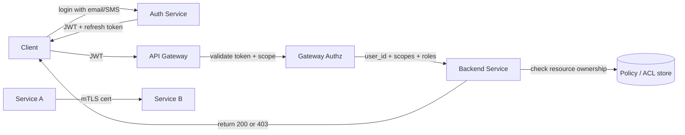

*Authentication and authorization flow: the client logs in via the Auth Service (email/SMS OTP or social), receives a JWT + refresh token; the API Gateway validates the JWT signature and checks scopes before forwarding to backend services; each service performs resource-level authorization (ownership, role) against a policy store; internal service calls use mTLS.*

```java
@Component
@RequiredArgsConstructor
public class JwtAuthenticationFilter implements Filter {

    @Value("${app.auth.jwt-public-key-uri}")
    private String jwksUri;

    private final UserDetailsService userDetailsService;

    @Override
    public void doFilter(ServletRequest request, ServletResponse response,
                         FilterChain chain) throws IOException, ServletException {
        var token = extractToken((HttpServletRequest) request);
        if (token != null && JwtUtils.isValid(token, jwksUri)) {
            var userId = JwtUtils.getUserId(token);
            var userDetails = userDetailsService.loadUserById(userId);
            var auth = new UsernamePasswordAuthenticationToken(
                    userDetails, null, userDetails.getAuthorities());
            SecurityContextHolder.getContext().setAuthentication(auth);
        }
        chain.doFilter(request, response);
    }

    private String extractToken(HttpServletRequest request) {
        var header = request.getHeader("Authorization");
        if (header != null && header.startsWith("Bearer ")) {
            return header.substring(7);
        }
        return null;
    }
}
```

*The `JwtAuthenticationFilter` bean intercepts every HTTP request, extracts the bearer token from the `Authorization` header, validates it against the JWKS endpoint (URI injected via `@Value`), loads the user details, and sets the Spring Security `Authentication` context. Requests without a valid token proceed unauthenticated and are rejected at the authorization layer.*

Every authorization decision in the platform must be re-derivable from the JWT claims and the resource's ownership policy, so a seller token can never authorize a purchase on another seller's catalog.

---

### Security Threats and Mitigations

#### Threat: Account Takeover (Customer & Seller)

- **Risk:** Credential stuffing, SIM-swap, or phishing takes over an account to place fraudulent orders or drain seller payouts.
- **Mitigation:** Rate-limit login (5 attempts/IP/hour), CAPTCHA after 3 failures, MFA required for seller accounts and payout changes, invalidate sessions on password change, anomaly detection on login (new device, new location, unusual time).

#### Threat: Price / Cart Tampering

- **Risk:** A man-in-the-middle or malicious client alters the cart total before checkout.
- **Mitigation:** Never trust client-computed totals. The server recomputes every price from the pricing engine at checkout, applies every eligible promotion, and recalculates taxes/shipping. The final charged amount is derived solely from server-side state.

#### Threat: Bot / Scalper Surge on Flash Sales

- **Risk:** Reseller bots with superior tooling buy the hero deal in milliseconds, cornering inventory.
- **Mitigation:** Waiting-room admission control at the edge with honest position tracking; device fingerprinting; identity-verification tiers (verified-fan-style presales); per-user/per-IP purchase limits; post-purchase anomaly detection that cancels confirmed-bot orders and returns stock.

#### Threat: Oversell

- **Risk:** Concurrent buyers both pass the stock check for the "last unit"; both are charged but only one can ship.
- **Mitigation:** Atomic reservation (Redis Lua check-and-decrement + DB durable truth) within a single regional primary; the reservation is the source of truth, not a read-then-decrement. Bucketed counters defeat row-level lock contention. A hold TTL releases abandoned reservations.

#### Threat: Payment Fraud / Chargebacks

- **Risk:** Stolen card data or friendly fraud generates chargebacks and lost revenue.
- **Mitigation:** Tokenize card data at the edge (never store PANs); risk-score every checkout inline; verify every PSP webhook signature and dedup by `pspRef`; reconcile with settlement files daily; maintain a chargeback representment pipeline with the event ledger as evidence.

#### Threat: Data Scraping

- **Risk:** Competitors or aggregators scrape catalog, pricing, and inventory at scale.
- **Mitigation:** Per-API-key rate limiting; require authentication for inventory/price endpoints; Bloom-filter recent-keys cache to reject repeated misses cheaply; block known scraping user agents and datacenter IPs.

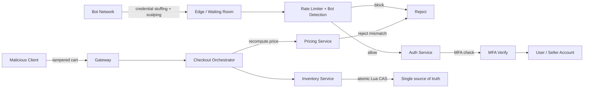

*Defense in depth for e-commerce: the edge waiting room + rate limiter + bot-detection model filters scalper bots before they reach checkout; MFA protects seller/financial accounts; the checkout orchestrator recomputes prices server-side (rejecting tampered totals) and acquires inventory through an atomic Lua compare-and-set against a single regional source of truth.*

---

### Observability and Logging

E-commerce observability must cover the revenue path (checkout funnel), flash-sale bursts, payment reconciliation, and the inventory critical section.

#### Key Metrics

| Category | Metric | Target |
|---|---|---|
| **PDP** | `pdp.render.latency` p50/p95/p99 | p95 < 200 ms, p99 < 500 ms |
| **Search** | `search.query.latency` p95 | < 150 ms |
| **Cart** | `cart.write.latency` p99 | < 100 ms |
| **Inventory** | `inventory.reserve.latency` p99 | < 100 ms |
| **Checkout** | `checkout.funnel.conversion` | Baseline; alert on >10% drop |
| **Payments** | `payment.capture.latency`, `payment.failure.rate` | Failure rate < 2%; webhook lag < 5s |
| **Sale mode** | `flashsale.dropped.rate`, `waitingroom.queue.depth` | Dropped < 1%; queue drain within 2× headroom |
| **Errors** | `api.5xx.rate` | < 0.1% |

#### Logging

- **Access logs:** Every API request with user/seller ID, endpoint, response code, latency, trace-id.
- **Event logs:** All domain events (order.created, payment.captured, inventory.reserved) as structured events with schema versions.
- **Audit logs:** All price changes, seller payout config changes, and admin actions with before/after state.
- **Security logs:** Auth successes/failures, MFA challenges, rate-limit rejections, bot-score thresholds crossed.

#### Distributed Tracing

Trace the entire checkout funnel across BFF → Checkout Orchestrator → Inventory → Payment → OMS, plus the PDP path across BFF → Redis → Catalog. Use OpenTelemetry with `traceparent` propagation. Key spans: price computation, inventory reservation (Lua), PSP capture, order state transition, and payment webhook processing.

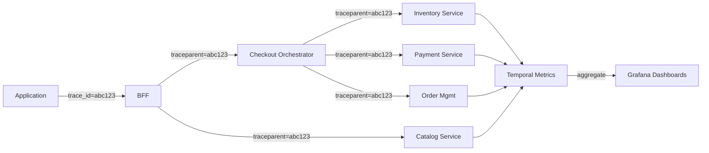

*Checkout distributed tracing: each request carries a trace ID propagated across the BFF, Checkout Orchestrator, Inventory, Payment, and Order Management. Spans aggregate in a metrics backend (Prometheus/Jaeger/Datadog) and feed Grafana dashboards, enabling end-to-end checkout-funnel latency analysis and SLO monitoring.*

#### Alerting Strategy

- **Critical (page immediately):** Checkout p99 > 1s for 2 min; inventory reservation failures > 5% for 1 min; payment webhook processing lag > 30s; PDP 5xx > 1% for 5 min.
- **Warning (Slack, no page):** PDP cache hit ratio < 90%; search p95 > 200 ms for 5 min; flash-sale drop rate > 2%; catalog replica lag > 30s.
- **Info (dashboard):** Conversion funnel deltas, search-to-detail CTR, new-seller signups, price-change frequency.

```java
@Service
@RequiredArgsConstructor
public class InstrumentedCheckoutService {

    private final CheckoutOrchestrator orchestrator;
    private final MeterRegistry meterRegistry;
    private final Timer checkoutTimer;
    private final Counter errorCounter;

    public InstrumentedCheckoutService(CheckoutOrchestrator orchestrator,
                                       MeterRegistry meterRegistry) {
        this.orchestrator = orchestrator;
        this.meterRegistry = meterRegistry;
        this.checkoutTimer = Timer.builder("checkout.attempt.latency")
                .publishPercentileHistogram()
                .tag("flow", "standard")
                .register(meterRegistry);
        this.errorCounter = Counter.builder("checkout.errors")
                .register(meterRegistry);
    }

    public OrderResult checkout(CheckoutRequest req, String userId) {
        return checkoutTimer.recordCallable(() -> {
            try {
                return orchestrator.execute(req, userId);
            } catch (Exception e) {
                errorCounter.increment();
                throw e;
            }
        });
    }
}
```

*The `InstrumentedCheckoutService` bean wraps the checkout orchestrator with Micrometer: a `Timer` with percentile histograms drives SLO monitoring for the revenue funnel, tagged by checkout flow; an error `Counter` increments on any failure. The `recordCallable` wrapper captures end-to-end latency, including every downstream dependency (inventory, payment, OMS).*

---

### Real-World Implementations

- **Amazon:** Service-oriented since the early 2000s; ASIN/offer model; DynamoDB was invented to scale the shopping cart; "available to promise" inventory with fulfillment-network integration; Prime Now leverages the same reservation engine for ultra-fast delivery slots.
- **Flipkart:** Big Billion Days engineering drove cell-based architecture, waiting rooms, and admission control at the edge; Ekart logistics integration; COD-heavy flows shaped reservation TTLs and cancel-on-failure-otp behavior.
- **Alibaba:** Singles' Day pushed the patterns further — unitized inventory deduction engines (split stock into buckets decremented independently), tens of billions GMV/day, and order-of-magnitude burst absorbers that validated bucketed counters and queue serialization at Wuhan-level traffic.

| Platform | Inventory Model | Sale Handling | Payments | Fulfillment | Notes |
|---|---|---|---|---|---|
| Amazon | Reservation + TTL, bucketed counters | Cell isolation + waiting room | Amazon Pay + PSP fallback | FBA + own logistics | DynamoDB for cart |
| Flipkart | Reservation + TTL, Redis soft-hold | Cell-based (BBD) + waiting room | Multiple PSP + UPI + wallets | Ekart integration | COD-first design |
| Alibaba | Unitized deduction engines | Tens of billions GMV (Singles' Day) | Alipay + escrow | Cainiao network | Extreme burst absorbers |

*Platform comparison: all three use reservation-with-TTL to prevent oversell, but differ in scale and regional focus — Amazon leads on fulfillment integration, Flipkart on COD and Indian market fit, Alibaba on burst absorption at Singles' Day scale.*

---

### Java and Spring Boot Implementation Guide

This section demonstrates a Spring Boot implementation of the checkout saga and inventory reservation — the money-critical paths — showcasing Spring Boot 3.x features: `@Service`, `@RestController`, `@Repository`, `@Value`, `record` DTOs with Bean Validation, `@Transactional`, `@ControllerAdvice`, `@Scheduled`, constructor injection, `@CircuitBreaker`, and `@EventListener`.

#### 1. DTO Records with Validation

```java
public record CheckoutRequest(
        @NotBlank String cartId,
        @NotBlank String addressId,
        @NotBlank String paymentMethod,
        List<String> appliedCoupons) {}

public record CheckoutResponse(
        String orderId,
        String status,
        Money amount,
        String nextAction) {}

public record HoldResult(
        String reservationId,
        Instant expiresAt,
        Money totalAmount) {}

public record Money(BigDecimal amount, String currency) {
    public static Money of(long amount, String currency) {
        return new Money(BigDecimal.valueOf(amount), currency);
    }
}
```

*Four record types form the checkout API contract: `CheckoutRequest` carries `@NotBlank`-validated fields (enforced by `@Valid`); `CheckoutResponse` returns the order id and async next action; `HoldResult` returns the reservation; `Money` wraps a `BigDecimal` for precise monetary arithmetic — never `double`.*

#### 2. Entity with Optimistic Locking

```java
@Entity
@Table(name = "reservations", indexes = {
        @Index(name = "idx_expires", columnList = "expiresAt"),
        @Index(name = "idx_sku_status", columnList = "skuId,status")
})
public class Reservation {

    @Id
    private String reservationId;

    @Column(nullable = false)
    private String skuId;

    @Column(nullable = false)
    private int quantity;

    @Column(nullable = false)
    private Instant expiresAt;

    @Enumerated(EnumType.STRING)
    private ReservationStatus status = ReservationStatus.ACTIVE;

    @Version
    private Long version;

    public enum ReservationStatus { ACTIVE, CONFIRMED, EXPIRED, RELEASED }
}
```

*The `Reservation` entity uses `@Version` for optimistic locking so concurrent confirm/expire transitions don't lose updates. The `expiresAt` and `(skuId, status)` indexes support the TTL sweeper and inventory reconciliation queries.*

#### 3. Repository Layer

```java
@Repository
public interface ReservationRepository extends JpaRepository<Reservation, String> {

    @Lock(LockModeType.OPTIMISTIC_FORCE_INCREMENT)
    Optional<Reservation> findByIdForUpdate(String reservationId);

    List<Reservation> findByStatusAndExpiresAtBefore(
            ReservationStatus status, Instant now);

    Optional<Reservation> findByOrderId(String orderId);
}
```

*The `ReservationRepository` interface extends `JpaRepository`. `findByIdForUpdate` uses `OPTIMISTIC_FORCE_INCREMENT` to lock the version on confirm; `findByStatusAndExpiresAtBefore` powers the TTL sweeper; `findByOrderId` links a reservation to its order.*

#### 4. Checkout Orchestrator (Saga Implementation)

```java
@Service
@RequiredArgsConstructor
@Slf4j
public class CheckoutOrchestrator {

    private final InventoryService inventory;
    private final PaymentService payment;
    private final OrderService orderService;
    private final EventPublisher events;

    @Value("${app.checkout.hold-minutes:10}")
    private int holdMinutes;

    @Transactional
    @Retryable(maxAttempts = 3, backoff = @Backoff(delay = 200, multiplier = 2))
    public CheckoutResponse execute(CheckoutRequest req, String userId) {
        // 1. Revalidate prices server-side (never trust the client)
        var total = orderService.calculateTotal(req.cartId(), req.appliedCoupons());

        // 2. Reserve inventory (atomic within the inventory service)
        var reservation = inventory.reserve(req.cartId(), Duration.ofMinutes(holdMinutes));
        log.info("Reserved inventory {} for user {} order cart {}", reservation.reservationId(), userId, req.cartId());

        try {
            // 3. Create order (idempotent by client key)
            var order = orderService.create(req, total, reservation.reservationId(), userId);

            // 4. Initiate payment (client completes off-site / SDK)
            var intent = payment.createIntent(order.orderId(), total, req.paymentMethod());

            events.publish(new OrderCreatedEvent(order.orderId(), userId, total));
            return new CheckoutResponse(order.orderId(), "PAYMENT_PENDING", total, intent.nextAction());
        } catch (Exception e) {
            // Compensation: release the reservation on any downstream failure
            log.error("Checkout failed after reservation; releasing {}", reservation.reservationId(), e);
            inventory.release(reservation.reservationId());
            events.publish(new CheckoutFailedEvent(reservation.reservationId(), userId, e.getMessage()));
            throw e;
        }
    }

    @EventListener
    @Retryable(maxAttempts = 3)
    public void handlePaymentCaptured(PaymentCapturedEvent event) {
        inventory.confirm(event.reservationId());
        orderService.markConfirmed(event.orderId());
        events.publish(new OrderConfirmedEvent(event.orderId(), event.orderId()));
    }

    @EventListener
    public void handlePaymentFailed(PaymentFailedEvent event) {
        inventory.release(event.reservationId());
        orderService.markCancelled(event.orderId(), "PAYMENT_FAILED");
    }
}
```

*The `CheckoutOrchestrator` bean encodes the full book-and-pay saga. `execute` is annotated `@Transactional` and `@Retryable` (Spring Retry with exponential backoff) so transient inventory/PSP failures retry safely. It recomputes the total server-side (defeating price tampering), reserves inventory, creates an idempotent order, and initiates payment. On ANY downstream failure, the `catch` block runs compensation (releases the reservation). A signed `PaymentCapturedEvent` listener confirms the reservation and marks the order CONFIRMED; a `PaymentFailedEvent` listener releases stock and cancels — both idempotent. Every step publishes a domain event.*

#### 5. REST Controller with Idempotency

```java
@RestController
@RequestMapping("/api/v1/checkout")
@RequiredArgsConstructor
public class CheckoutController {

    private final CheckoutOrchestrator orchestrator;

    @PostMapping
    public ResponseEntity<CheckoutResponse> checkout(
            @AuthenticationPrincipal JwtUser user,
            @Valid @RequestBody CheckoutRequest request,
            @RequestHeader("Idempotency-Key") String idempotencyKey) {
        // Idempotency is enforced inside the orchestrator via the client key
        var response = orchestrator.execute(request, user.userId(), idempotencyKey);
        return ResponseEntity.accepted().body(response); // async completion
    }
}
```

*The `CheckoutController` is a thin `@RestController` using constructor injection. `@Valid` enforces `@NotBlank` constraints; `@AuthenticationPrincipal` injects the buyer; `@RequestHeader("Idempotency-Key")` captures the client key. The endpoint returns `202 Accepted` because payment completes asynchronously via the PSP redirect + webhook.*

#### 6. Global Exception Handler

```java
@ControllerAdvice
public class GlobalExceptionHandler {

    @ExceptionHandler(OutOfStockException.class)
    public ResponseEntity<ApiError> handleOutOfStock(OutOfStockException ex) {
        return ResponseEntity.status(HttpStatus.CONFLICT)
                .body(new ApiError(HttpStatus.CONFLICT, ex.getMessage()));
    }

    @ExceptionHandler(MethodArgumentNotValidException.class)
    public ResponseEntity<ApiError> handleValidation(MethodArgumentNotValidException ex) {
        var messages = ex.getBindingResult().getFieldErrors().stream()
                .map(FieldError::getDefaultMessage).toList();
        return ResponseEntity.badRequest()
                .body(new ApiError(HttpStatus.BAD_REQUEST,
                        "Validation failed: " + String.join(", ", messages)));
    }

    @ExceptionHandler(OptimisticLockException.class)
    public ResponseEntity<ApiError> handleConflict(OptimisticLockException ex) {
        return ResponseEntity.status(HttpStatus.CONFLICT)
                .body(new ApiError(HttpStatus.CONFLICT,
                        "Concurrent modification detected. Please retry."));
    }

    record ApiError(HttpStatus status, String message) {}
}
```

*The `GlobalExceptionHandler` (`@ControllerAdvice`) centralizes error handling: `OutOfStockException` → 409 Conflict, `MethodArgumentNotValidException` → 400 with field messages, `OptimisticLockException` → 409 (from `@Version` on concurrent confirm/expire). A `record ApiError` carries the structured response.*

#### 7. Inventory Reservation with Redis Lua

```java
@Service
@RequiredArgsConstructor
public class InventoryService {

    private final StringRedisTemplate redis;
    private final ReservationRepository reservations;

    private static final DefaultRedisScript<Boolean> RESERVE_LUA = new DefaultRedisScript<>(
            """
            local current = redis.call('GET', KEYS[1]) or 0
            if tonumber(current) < tonumber(ARGV[1]) then return 0 end
            redis.call('DECRBY', KEYS[1], ARGV[1])
            redis.call('PEXPIRE', KEYS[1], tonumber(ARGV[2]))
            return 1
            """, Boolean.class);

    @Transactional
    public HoldResult reserve(String cartId, Duration ttl) {
        // Resolve cart → SKU + qty, then atomically check-and-decrement in Redis
        var items = cartService.getItems(cartId);
        for (var item : items) {
            String stockKey = "stock:" + item.skuId();
            Boolean ok = redis.execute(RESERVE_LUA,
                    List.of(stockKey),
                    String.valueOf(item.quantity()),
                    String.valueOf(ttl.toMillis()));
            if (Boolean.FALSE.equals(ok)) {
                throw new OutOfStockException(item.skuId());
            }
        }
        // Durable reservation row (DB is truth; Redis is the fast soft-hold)
        return reservations.save(buildReservation(items, ttl));
    }
}
```

*The `InventoryService.reserve` method uses a Redis Lua script to atomically check-and-decrement stock (the fast soft-hold layer), throwing `OutOfStockException` if insufficient. It then persists a durable `Reservation` row — the DB is the source of truth for audit/recovery; Redis accelerates the hot path. The `@Transactional` boundary keeps the reservation atomic. Production replaces the Lua counter with bucketed INVENTORY_BUCKET rows for the same atomicity without row-lock contention.*

---

### Interview Questions and Answers

A curated set of interview questions for e-commerce (Amazon/Flipkart-style) platform design, organized by four difficulty tiers.

**Beginner**

1. **What are the functional requirements for designing Amazon-like e-commerce?**
   *A:* Browse/search, product details, cart, wishlist, offers, checkout, payment, order tracking, returns; seller side lists products and manages stock. Non-functional: HA, low-latency reads (p95 < 200 ms for PDP), correctness for money/stock, 100× burst tolerance.
2. **Why cache product pages instead of reading from the DB every time?**
   *A:* Reads dominate 1000:1 and product data changes rarely relative to view frequency; caching turns 12K–500K QPS into manageable origin loads with p95 latency in double-digit milliseconds.
3. **What is the ASIN/offer model and why does it matter?**
   *A:* An ASIN is the abstract product; each seller provides an offer (SKU) with its own price/stock. Separating them lets the write-hot offer layer (price changes) from the write-cold product layer (descriptions, images), and enables seller competition on a single product page.

**Intermediate**

4. **How do you prevent two customers from buying the last unit simultaneously?**
   *A:* Serialize decrements for that SKU: either row-level locking with a conditional update (`qty >= requested`) inside a transaction, a Redis Lua check-and-decrement, or a per-SKU queue making the operation sequential. Display layer can be approximate (bucketed counters); checkout must be exact. Follow-up: what if payment then fails? → reservation released on timeout/failure event.
5. **How would you model the order lifecycle?**
   *A:* A state machine: `CREATED → PAYMENT_PENDING → CONFIRMED → PACKED → SHIPPED → DELIVERED`, plus `CANCELLED`, `REFUNDED`. Every transition is an event. The OMS owns it; downstream (fulfillment, notification) reacts to events. Idempotent creation via client `requestId`.
6. **Explain the reservation-expiry race: payment succeeds at the same moment the reservation expires.**
   *A:* Both `confirm` and `release` (on expiry) mutate reservation state; make the state-transition atomic (versioned compare-and-set on status). Define a winner rule: if `confirm` wins (reservation still ACTIVE + not expired), mark CONFIRMED; if expiry won first, payment-success handler sees released stock — trigger auto-refund or re-reserve under a grace policy. This race appears in production weekly; interviewers love it.
7. **How do you handle a flash sale where 1M users hit 'Buy' for 5,000 units within one second?**
   *A:* Layers: admission control (waiting room issuing place-in-line tokens), pre-aggregated deal page served statically, per-SKU serialization with bucketed counters, fast-fail (410) beyond capacity, post-sale telemetry. Discuss fairness (queue order), bot mitigation (verified-fan, fingerprinting), and UX for losing users (honesty beats spinner).

**Advanced**

8. **Walk through the full checkout failure modes and compensations.**
   *A:* Enumerate: (a) reservation failure → no charge, order not created; (b) payment-initiation failure → release reservation, show error; (c) payment-pending ambiguity → keep reservation till definitive webhook; (d) capture-success-but-order-create-failure → refund saga; (e) confirm failure after capture → refund + incident. Idempotency keys live on every arrow; every compensation is idempotent and retryable.
9. **How do you shard the catalog and order databases at web scale?**
   *A:* Catalog by `hash(asin)` (seller-offer locality); orders by `hash(user_id)` ("my orders" stays single-shard). The `idempotency_key` unique index is global — retries do a cross-shard lookup but are rare by design. Hot products use read replicas + Redis read models; cross-shard analytics go to a separate data warehouse fed by Kafka.
10. **How do you keep inventory consistent across multiple regions without oversell?**
    *A:* Active-passive for writes — a single region owns stock decrements; cross-region replicas are read-only until failover (which suspends writes briefly). Active-active stock requires distributed consensus (Spanner/2PC) which kills throughput; most retailers accept the failover cost. The Redis soft-hold layer is per-region and always reconciled against the durable regional truth.

**Senior / System Design**

11. **Design the pricing engine so a 1000-way promotion stack can't be gamed or cause non-deterministic prices.**
    *A:* Pricing is a pure, deterministic function of (base_price, offers, coupons, user_segment, session_context). Every price is computed server-side and cached with an invalidation key derived from its inputs. Promotions are evaluated in a fixed precedence order (percentage → fixed → shipping rules) with a max-savings cap. Unit tests assert price determinism for thousands of input combinations; the checkout recomputes and rejects any client-supplied mismatch.
12. **Your flash-sale cell is at 90% CPU 10 minutes before a hero deal drops. What are your options?**
    *A:* (1) Split the reservation partition vertically by section/SKU to spread load. (2) Raise admission pacing strictness via the waiting room to cap inflow. (3) Shed non-critical features (recs, reviews, search filters) via feature flags. (4) Pre-scale the inventory/payment pools to ceiling. (5) If all else fails, honest queue messaging + transparent post-sale order processing. The runbook is rehearsed with a load-test at 1.5× forecast.
13. **How do you migrate a monolithic commerce app to microservices without freezing features?**
    *A:* Strangler-fig: extract highest-value bounded contexts first (catalog reads → read-model cache, then cart). Use CDC for data sync during transition; contract tests enforce API compatibility; shadow traffic validates parity; cut over by route. Keep the monolith releasable throughout — each extracted service must be independently deployable before the next cut is attempted.

