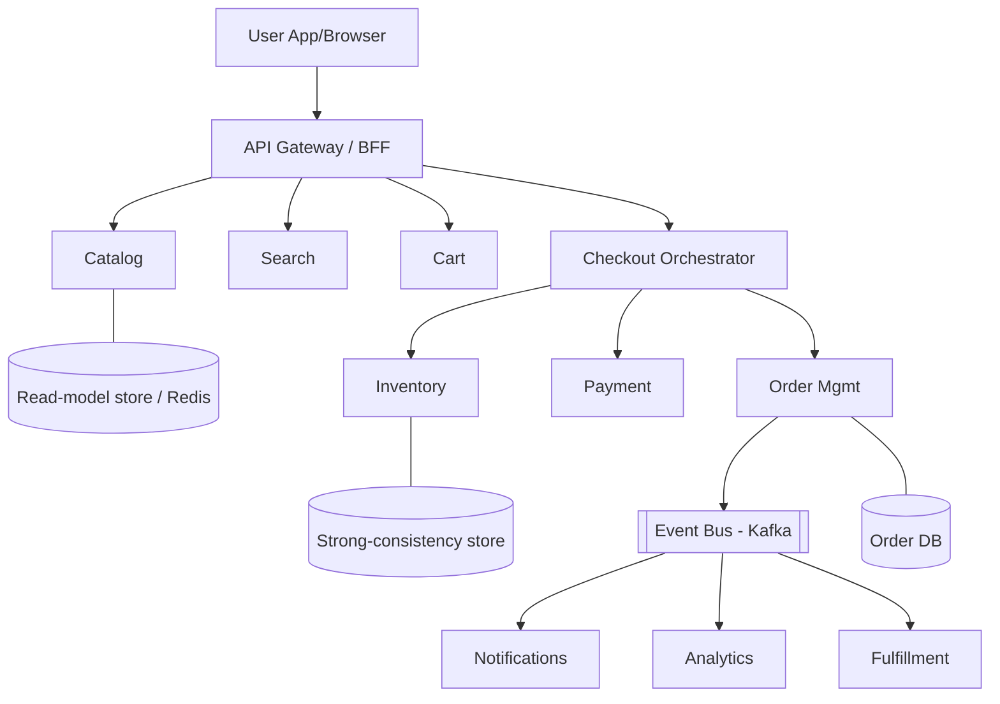
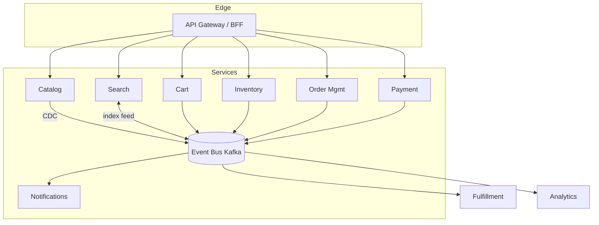
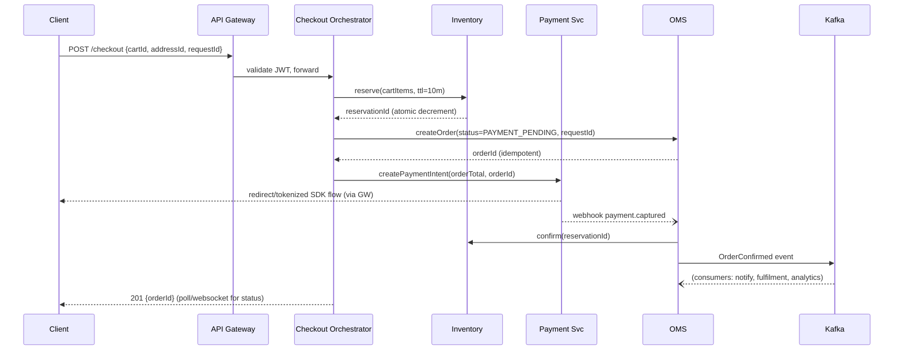
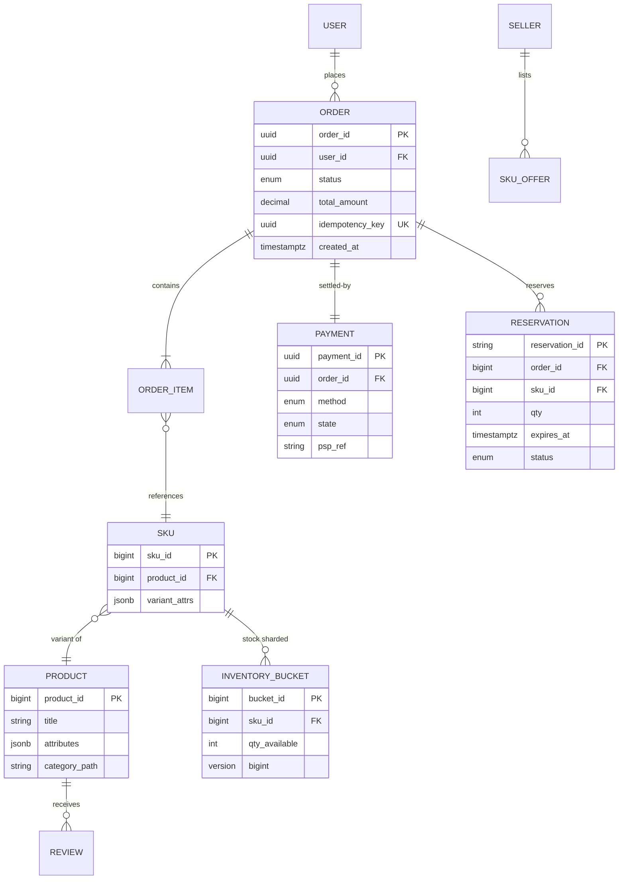

# Amazon/Flipkart System Design

## Blogs and websites

## Medium

## Youtube

- [Amazon System Design | Flipkart System Design | System Design Interview Question](https://www.youtube.com/watch?v=EpASu_1dUdE)
- [E-Commerce Platform (Amazon, eBay) - System Design Interview Question](https://www.youtube.com/watch?v=2811UT5r5Jk)
- [Amazon/Flipkart Ecommerce Design Deep Dive with Google SWE! | Systems Design Interview Question 18](https://www.youtube.com/watch?v=vNDz6jqtR40)
- [System Design Interview: Architecture of Amazon, Flipkart like e-commerce system with @gkcs](https://www.youtube.com/watch?v=2BWr0fsDSs0)
- [✅ System Design 3: E-Commerce Platform like Amazon / Flipkart Architecture Design | HLD / LLD](https://www.youtube.com/watch?v=-wJuExkI97s)
- [16: Amazon/Flipkart | Systems Design Interview Questions With Ex-Google SWE](https://www.youtube.com/watch?v=F9lcK1jnAcs)

## Theory

### What Is It?

Designing an e-commerce giant like Amazon or Flipkart is a **system-of-systems** problem: a storefront that must survive traffic spikes 10–100× baseline (Big Billion Days, Prime Day), a catalog of hundreds of millions of SKUs, an inventory engine that stays correct under concurrent buying, an order pipeline with money attached, and a payments integration that cannot lose or duplicate a rupee. The interview version focuses on the core loop — *browse → search → cart → checkout → pay → fulfil → deliver* — and the trade-offs at each step.

### Why Does It Exist?

Traditional monoliths fail at e-commerce scale because read/write asymmetry is extreme (browsing dwarfs buying ~1000:1), inventory must be strongly consistent under contention (oversell is a legal and financial liability), and sales events create short-lived 100× traffic bursts that idle-capacity provisioning cannot absorb. Decomposing into bounded services lets each sub-problem scale and fail independently while an event backbone keeps them coordinated.

### What Problem Does It Solve?

* **Read/write imbalance**: millions browse a product for every one person who buys it. A single shared database cannot serve both patterns efficiently — caching, denormalization, and CDN offload handle the read flood.
* **Oversell risk**: the "last unit" problem — two concurrent buyers both seeing stock=1. Solved with reservation/TTL and serialized decrement patterns.
* **Sale-day overload**: flash sales produce request bursts that exceed steady-state capacity by orders of magnitude. Cell-based isolation, waiting rooms, and pre-warming keep the site up.
* **Cross-system consistency**: an order touches pricing, inventory, payment, and fulfilment. Distributed sagas with idempotent compensation replace impossible distributed transactions.
* **Global latency and data residency**: customers expect sub-200-ms page loads while data laws (e.g., India's Digital Personal Data Protection Act) may require regional residency.

### Important Subtopics

1. Requirements and scale estimation (functional + non-functional, QPS math)
2. Product catalog service and the read-heavy browsing problem
3. Search and discovery (indexing, ranking)
4. Shopping cart design (guest vs logged-in, persistence)
5. Inventory management — oversell prevention under concurrency
6. Order management and the order state machine
7. Checkout orchestration and idempotency
8. Payment integration (PSP interaction, reconciliation)
9. Pricing and promotions engine
10. Reviews/ratings and user-generated content
11. Caching strategy across layers
12. Event-driven decomposition (order events fan out to fulfilment, email, analytics)
13. Flash-sale / burst-traffic engineering
14. Consistency models per subsystem (what can be eventual, what cannot)

### Requirements & Scale Estimation

**Functional**: browse/search products, view details, manage cart/wishlist, apply offers, checkout, pay, track order, return/refund; seller side lists products and manages stock.

**Non-functional**: high availability (revenue = uptime during sales), low latency for reads (p95 < 200 ms for PDP), strong consistency only where money/stock demand it, scale to ~500M users, peak 100× average QPS.

**Back-of-envelope** (Flipkart-scale):

- 300M monthly actives → assume 50M daily → each does ~20 product views + 5 searches/day.
- Product page reads ≈ 1B/day ≈ ~12K QPS average, but sale peaks hit 500K+ QPS.
- Orders: say 10M orders/day ≈ ~115 orders/s average, peaking near 10K/s during flash windows.
- Key insight for design: **reads outnumber writes by 1000:1** — the architecture is a caching-and-CDN problem on the read path and a correctness problem on the write path.

### Catalog Service

The product catalog is enormous but mostly immutable in the short term. Typical split:

- **Product** (abstract item, e.g., "iPhone 15") ↔ **SKU/seller-offer** ("iPhone 15 128GB sold by TechMart, ₹71,900"). Amazon's ASIN-vs-MerchantOffer model.
- Stored in a relational DB or document store sharded by product ID; rendered pages cached aggressively (Redis + CDN).
- Denormalized read models: a `product_detail` blob assembled from catalog + pricing + inventory + reviews services, rebuilt on events — so PDP rendering is one cache lookup, not five service calls.

### Inventory — the Heart of the Problem

Overselling is a business failure; blocking sales unnecessarily is lost revenue. Options:

| Strategy | How | Trade-off |
|---|---|---|
| Synchronous decrement at add-to-cart | Reserve units when carted | Blocks hoarding? No—needs reservation TTL; hurts conversion |
| Synchronous decrement at order placement | Check-and-decrement atomically in checkout | Correct but hot-row contention on viral items |
| Reservation + confirmation two-phase | Hold stock for T minutes at checkout start; confirm on payment | Industry standard (see below) |
| Eventual with oversell buffer | Allow slight oversell; absorb via substitution/cancellation | Used for very long-tail items |

The standard pattern: **reserve (hold) → confirm → release-on-timeout**. At checkout start the inventory service creates a reservation row with TTL (say 10 min). Payment success triggers confirm (decrement permanently). Payment failure/abandonment or TTL expiry releases stock. Atomicity inside the inventory service uses conditional updates (`UPDATE stock SET qty = qty - ? WHERE sku=? AND qty >= ?`) or Redis Lua scripts for hot keys, plus queue-based serialization for extreme contention (a single partition owning one SKU serializes its updates).

### Cart Service

- Cart = map of SKU → quantity (+ price snapshot at add time).
- Anonymous carts keyed by a device cookie; merged into the account cart at login (conflict rule: union with max quantities, or ask user).
- Storage: DynamoDB/Cassandra-style KV or Redis with AOF persistence — cart loss is annoying, not fatal; availability matters more than strict consistency.
- Price shown is revalidated at checkout — stale prices in carts are normal and resolved there.

### Order Management

Orders are a **state machine**: `CREATED → PAYMENT_PENDING → CONFIRMED → PACKED → SHIPPED → DELIVERED` (+ `CANCELLED`, `RETURNED`). Every transition is an event consumed by other systems (notifications, analytics, fraud). The OMS owns:

- Idempotent order creation (client-generated `requestId`; duplicates collapse to same order).
- Orchestration of payment → inventory-confirm → seller-notification via saga (see Deep Dive).
- History/audit — every state change persisted immutably.

### Payments

Checkout calls a PSP (or internal wallet/UPI stack). Rules: never trust the client about payment outcome — always verify via server-to-server callback/webhook; reconcile PSP settlement files daily against internal ledger (see settlement-reconciliation-system topic); payment timeouts must trigger reservation release and a clearly communicated "pending" state rather than silent failure.

### Event-Driven Decomposition

After order placement, everything downstream is asynchronous: notification emails, seller dashboards, recommendation refresh, analytics, loyalty points, invoicing. A Kafka-style log between OMS and consumers decouples them, absorbs bursts, and gives replay for recovery.

---

## Characteristics

- **Extreme read skew** (~1000:1): browsing dwarfs buying; drives multi-layer caching and CDN-first thinking.
- **Bursty, event-driven load**: sale windows create 100× spikes; capacity is provisioned for peaks, not averages (autoscaling + graceful degradation).
- **Mixed consistency requirements**: product pages may be seconds-stale; stock and payments cannot be wrong. Per-subsystem consistency choice is a first-class design decision.
- **High write-correctness demands on narrow paths**: inventory decrements and payment captures are the small, hot, strongly-consistent cores inside a mostly-eventual system.
- **Composable microservices**: catalog, cart, pricing, inventory, orders, payments each own their data and scale independently.
- **Idempotency everywhere on the write path**: clients retry; networks fail; money operations must dedupe.
- **Global/multi-region awareness**: data residency (e.g., India data laws), geo-distributed reads, region-failover for DR.
- **Personalization as a cross-cutting concern**: recommendations, ranking, offers vary per user/session — served from precomputed features, not computed inline.

---

## Components

- **API Gateway / BFF (Backend-for-Frontend)**
  *Purpose*: single entry point for web/mobile apps. *Responsibilities*: authn, rate limiting, response aggregation, protocol translation (GraphQL federation is common — Netflix DGS style). *Relationship*: fronts all domain services. *Example*: Flipkart's API gateway; Amazon's mobile BFF.

- **Catalog Service**
  *Purpose*: source of truth for products/SKUs/categories. *Responsibilities*: CRUD for sellers, denormalization into read models, media metadata, SEO payloads. *Works with*: search indexer (CDC feed), pricing, inventory.

- **Search Service**
  *Purpose*: query → ranked product list. *Responsibilities*: maintain inverted index (Solr/Elasticsearch/OpenSearch), autocomplete, typo tolerance, ranking signals (sales rank, relevance, sponsored). *Example*: Amazon's A9/A10 ranking; Flipkart's search with vernacular query understanding.

- **Cart Service**
  *Purpose*: persistent carts across devices/sessions. See Theory.

- **Pricing & Promotions Engine**
  *Purpose*: compute the price a user sees/pays. *Responsibilities*: base price, time-based deals, coupons, bank offers, stacking rules; must be deterministic and auditable (price disputes are legal issues). *Example*: Flipkart's Big Billion Days "countdown" prices computed by rules evaluated per request but heavily cached.

- **Inventory Service**
  *Purpose*: stock truth + reservations. See Theory. *Real-world*: Amazon's "availability prediction" adds ML on top of raw counts for backordered items.

- **Order Management Service (OMS)**
  *Purpose*: order lifecycle owner. Responsibilities + saga orchestration covered below.

- **Payment Service**
  *Purpose*: abstract PSPs/wallets/cards/UPI behind one interface; handle retries, webhooks, refunds. *Example*: Amazon Pay; PhonePe-as-PSP integrations.

- **Notification Service**
  *Purpose*: email/SMS/push/in-app fan-out on order events, promos. *See* dedicated notification-fanout-service topic.

- **Fulfilment/Logistics Integration**
  *Purpose*: warehouse picking, carrier allocation, tracking events inbound. *Example*: Amazon's fulfillment network APIs; Ekart for Flipkart.



---

## Patterns

- **Saga (orchestration)** — *Problem*: placing an order spans payment + inventory + OMS without distributed transactions. *How*: checkout orchestrator executes local transactions and compensates on failure (payment captured then inventory fails ⇒ refund). *When*: any multi-service business transaction. *Not when*: a single ACID database suffices. *Pros*: no locks across services; fits event-driven. *Cons*: compensation logic complexity; intermediate visible states need UX handling. *Spring example below*.
- **CQRS-lite** — catalog writes go to normalized stores; reads come from denormalized blobs refreshed via CDC/events.
- **Reservation/TTL pattern** — inventory holds with expiry (above).
- **Idempotency-key pattern** — every mutating client call carries a key; server stores processed keys and replays prior responses.
- **Cell-based isolation for sales** — route flash-sale traffic to dedicated cells (separate inventory partitions, checkout pools) so mainstream traffic isn't starved.
- **Circuit breaker + fallback** — recommendations down? Render PDP without them. Spring Cloud CircuitBreaker/Resilience4j.
- **Anti-corruption around PSPs** — normalize heterogeneous gateway callbacks into one internal `PaymentEvent`.

---

## Benefits

- **Independent scaling** matches cost to load shape: 500× more catalog reads than orders means catalog scales horizontally on cheap caches while inventory runs on smaller, stronger machines.
- **Failure isolation**: a review-service outage shouldn't stop checkout; bulkheads keep revenue paths alive.
- **Team scalability**: Amazon's famous two-pizza teams map to service ownership; the org chart *is* the architecture.
- **Event backbone enables product velocity**: new consumer (e.g., fraud scoring) subscribes to order events without touching checkout code.
- **Cache economics**: 95%+ of reads served without touching origin databases makes 500K-QPS peaks affordable.

---

## Pros

- Proven at planetary scale (both named companies run variants of this design).
- Read path is nearly infinitely scalable via CDN + Redis + replicas.
- Write-path correctness concentrated in few well-understood components (inventory, payments, OMS).
- Graceful degradation options everywhere (hide reviews, disable recs — never hide Buy Now).
- Rich auditability through event logs aids dispute resolution and compliance.

## Cons

- Microservices sprawl: hundreds of services bring deployment, tracing, and versioning overhead.
- Eventual consistency surfaces in UX ("price changed at checkout", "item just went out of stock") requiring careful product handling.
- Distributed sagas are hard to test; compensation bugs cause real money leaks.
- Multi-region inventory introduces split-brain risk if done naively active-active; most retailers run active-passive for stock.
- Operational cost of sale-readiness (idle capacity most of the year, or aggressive autoscaling engineering).

---

## Challenges

- **Technical**: atomic stock decrement under 10K concurrent buyers of one phone (hot-partition problem); exactly-once effects from at-least-once delivery; clock-skew in offer windows.
- **Scalability**: cache stampedes when a celebrity tweet nukes a product; thundering herd on sale-open countdown (mitigate with pre-warming, request coalescing, jittered expiries).
- **Performance**: PDP p95 < 200ms while aggregating 6+ services — solved with read-model caching, not faster RPCs.
- **Reliability**: payment-gateway brownouts during peak (retry with alternate PSP; queue-and-notify); partial failures mid-checkout needing precise compensation.
- **Maintainability**: schema evolution across hundreds of services; contract tests; deprecating old clients slowly.
- **Security**: card-data PCI scope minimization (tokenization), account-takeover defense, bot/scalper mitigation for flash sales, price-manipulation attempts on client-side totals (server always recomputes).
- **Fraud**: fake orders, promo abuse, reseller bots — risk scoring inline at checkout, offline clawback pipelines.

---

## Best Practices

- **Recompute all monetary totals server-side** — client-sent prices/totals are advisory only; prevents classic tampering bug.
- **Make every write endpoint idempotent** (`Idempotency-Key`) — retries are guaranteed in mobile networks.
- **Reserve-then-confirm inventory** with TTL release — balances oversell protection against checkout abandonment.
- **Cache aggressively, invalidate precisely**: short TTL + explicit invalidation events for price/stock; long TTL for stable content.
- **Design the sale mode up front**: feature flags to shed non-critical features (reviews, recs), static fallbacks, waiting-room queues for extreme drops.
- **Emit domain events for every state change** — analytics, notifications, and ML training all hang off this spine.
- **Reconcile daily**: payments vs bank files, orders vs shipments vs invoices; drift detection catches bugs early.
- **Canary + autoscale rehearsals before big sales** — load-test at 1.5× forecast, practice failover.

---

## When to Use

This full architecture suits **marketplaces at meaningful scale** (many sellers, millions of SKUs, spiky traffic). Simplify when:

- Single-seller shop → monolith + Postgres + Stripe is strictly better early on.
- Low traffic (<100 orders/day) → skip Kafka/event bus; use transactional outbox tables and cron.
- Consider managed building blocks (Shopify/Headless commerce) until differentiation requires ownership.

Decision factors: SKU count, traffic profile (spikiness), seller count, payment complexity, team size, regulatory footprint.

---

## Use Cases

- **Prime Day / Big Billion Days flash sale**
  *Problem*: 100× traffic spike; one hero deal sells out in seconds. *Solution*: cell-isolated inventory for deal SKUs, serialized decrements via per-SKU queues, pre-warmed caches, waiting room. *Trade-off*: extra infrastructure idle outside events vs certain outage otherwise.

- **Cross-device cart continuity**
  *Problem*: user adds on mobile, buys on laptop. *Solution*: anonymous-cart token merged at login with defined merge semantics. *Trade-off*: merge conflicts (same item added twice) resolved by summing quantities with cap.

- **COD (cash on delivery) heavy markets**
  *Problem*: payment happens at doorstep days after ordering — inventory held too long. *Solution*: shorter reservations for COD, risk-scored COD limits, auto-cancel on failed OTP verification. *Trade-off*: higher cancellation rates vs market reach.

---

## Architecture

### Architectural Style

This system follows a **microservice architecture** with **layered service internals** and an **event-driven backbone**:

- **Layered within a service**: each service exposes a REST/gRPC API layer → business-logic/orchestration layer → data-access layer → persistent store. This keeps responsibilities separated and makes each service independently deployable.
- **Microservices across the domain**: catalog, search, cart, pricing, inventory, order, payment, notification, fulfilment each own their data and scale independently.
- **Event-driven integration**: an append-only log (Kafka) carries domain events between services, decoupling producers from consumers and enabling replay for recovery and analytics.
- **API-gateway/BFF pattern**: a Backend-for-Frontend sits at the edge, aggregating and adapting responses per client (web, mobile) while handling cross-cutting concerns (auth, rate limiting, protocol translation).



**Trade-offs**: microservices enable independent scaling and team autonomy, but add distributed-system complexity (network failures, eventual consistency, distributed tracing). The event backbone absorbs bursts and decouples consumers, but introduces replay-ordering concerns. The layered style inside each service keeps code maintainable but adds a hop; for ultra-low-latency paths (inventory decrement) you can fuse layers or move logic into stored procedures / Redis scripts. **When to use**: marketplace with many sellers, SKU count in the millions, spiky traffic, and a team large enough to own multiple services.

### Design

### Design Considerations

- **Read vs. write asymmetry**: design the read path (CDN + Redis read-models) to be near-infinitely scalable and the write path (inventory, payments) to be correct and bounded. Most early-stage teams over-build the write path and under-build the read path.
- **Burst tolerance**: provision for 100× peaks, not average load. Use autoscaling, cell isolation for sales, and graceful degradation (drop non-essential features under load).
- **Failure isolation**: a review-service outage must not block checkout. Bulkheads and circuit breakers keep revenue-critical paths alive.
- **Monetary correctness**: every financial calculation happens server-side; client-sent totals are advisory. Idempotency keys protect against duplicate charges.

### Key Decisions

- **Event backbone over RPC orchestration**: order placement emits events that downstream consumers react to, rather than synchronous fan-out at checkout time. This bounds checkout latency and absorbs downstream failures.
- **Inventory reservation with TTL**: reserve stock at checkout start with a finite hold window; confirm on payment success, release on timeout/failure. This balances oversell prevention against abandoned-cart stock-hogging.
- **Denormalized read models**: a single `product_detail` blob assembled from catalog + pricing + inventory + reviews is cached and refreshed via CDC events. PDP rendering becomes one cache lookup instead of N service calls.
- **Idempotency on every write**: every mutating endpoint accepts a client-supplied key so retries collapse safely.

### Trade-offs

- Microservices give independent scaling but at the cost of distributed-system complexity and operational overhead.
- Eventual consistency on catalog/cart reads simplifies the read path but surfaces as "price changed at checkout" UX friction.
- Cell-based sale isolation protects mainstream traffic but adds infrastructure that is idle most of the year.

### Scalability Considerations

- Catalog: CDN + Redis read-model cluster scaled on read RPS; ~95% cache hit target.
- Cart: eventually-consistent KV store (DynamoDB/Cassandra) with per-user sharding.
- Inventory: per-SKU serialization via queue or row locking; bucketed counters for hot SKUs.
- Orders: Kafka partitions keyed by `orderId` preserve per-order ordering.
- Checkout: autoscale pods on RPS; payment/inventory pools sized for peak writes with headroom.

### Reliability Considerations

- **Degradation ladders**: drop reviews/recommendations before slowing PDPs; disable non-critical features during sales via feature flags.
- **Payment-gateway brownout**: retry with alternate PSP behind circuit breaker; queue-and-notify for async completion.
- **Saga recovery**: persistent saga-state rows allow crash recovery; compensations are idempotent and retryable.

### Performance Considerations

- PDP p95 < 200 ms achieved via read-model caching, not faster RPCs.
- Sale-open stampede mitigated with pre-warming, request coalescing, and jittered cache expiries.
- Inventory display can be soft-realtime (approximate) while checkout enforces exact truth.

### Security Considerations

- **PCI scope minimization**: tokenize card data; never log full PANs.
- **Account-takeover defense**: MFA, device fingerprinting, anomalous-login detection.
- **Bot/scalper mitigation**: CAPTCHAs, rate limiting, and waiting rooms for flash sales.
- **Price tampering**: always recompute totals server-side; treat client values as untrusted.
- **Fraud**: inline risk scoring at checkout + offline clawback pipelines.

### Maintainability Considerations

- **Schema evolution**: contract tests and backward-compatible API versions across hundreds of services.
- **Contract testing**: consumer-driven contracts prevent breaking downstream services.
- **Deprecation discipline**: sunset old clients slowly; keep monolith releasable during migration.

## High-Level Design

Request flow for checkout:



Compensation path: webhook `payment.failed` or reservation TTL expiry → release inventory, cancel order, notify user. If capture succeeded but inventory confirm failed → trigger automatic refund saga.

Scaling: CDN/static + PDP edge caching → Redis read-model cluster → service pods HPA on RPS → inventory/payment sized for peak writes with headroom; Kafka partitions keyed by orderId preserve per-order ordering.

---

## Deep Dive

- **Hot-SKU contention**: naive `UPDATE ... WHERE sku=X` funnels thousands of transactions onto one row lock. Solutions ladder: (1) batch/coalesce decrements in a queue owned by one writer per SKU; (2) shard the counter — split stock 10,000 into 10 buckets of 1,000 decremented independently, aggregate for display, rebalance when buckets drain unevenly; (3) accept soft-realtime display (counter shows approximate) while checkout enforces exact truth.
- **Saga implementation detail**: orchestrator persists saga-state rows (`orderId, step, status`) before executing each step; crash recovery resumes from last recorded step. Compensations themselves must be idempotent and retryable (refund calls deduped by refund-request-id).
- **Outbox pattern**: OMS writes order row + outbox event in one local transaction; relay publishes to Kafka. Guarantees event exists iff order committed, avoiding dual-write anomalies.
- **Consistency choices table**: catalog (eventual, minutes) · cart (eventual, session-scoped) · inventory display (approximate ok) · inventory reservation (strict, serialized) · payments (strict + external reconciliation) · order status read-your-writes via sticky routing to owning partition.
- **Observability**: distributed tracing on checkout (every ms visible), per-step saga success/failure dashboards, stock-vs-orders drift alarms, PSP latency/error burn-rate alerts tied to automated failover.

---

## API Contract

### Catalog API

```
GET    /api/v1/products/search?q=laptop&category=electronics&sort=price_asc&page=1&size=40
GET    /api/v1/products/{productId}
GET    /api/v1/products/{productId}/offers?seller=abc123
GET    /api/v1/categories/electronics/subcategories
```

**Search response**:

```json
{
  "results": [
    {
      "productId": "B0ABCD1234",
      "title": "Laptop XYZ",
      "price": { "amount": 71900, "currency": "INR", "display": "₹71,900" },
      "imageUrl": "https://cdn.example.com/products/B0ABCD1234.webp",
      "rating": 4.3,
      "reviewCount": 1284,
      "shippingInfo": { "deliveryDays": 2, "free": true },
      "badge": ["Deal of the Day"]
    }
  ],
  "filters": { "brands": [...], "priceRanges": [...] },
  "facets": { "brands": [{"name":"Dell","count":42}], "ratings": [...] },
  "page": 1, "size": 40, "totalHits": 1240, "nextCursor": "cursor-token"
}
```

- Supports pagination via cursor-based tokens, filtering on facets, and sorting by relevance/price/rating.
- PDP response is a single cached `product_detail` blob combining catalog + pricing + inventory + reviews.

### Cart API

```
GET    /api/v1/cart                       # for logged-in or guest (cookie token)
POST   /api/v1/cart/items                 # { skuId, quantity }
PUT    /api/v1/cart/items/{skuId}         # update quantity
DELETE /api/v1/cart/items/{skuId}
POST   /api/v1/cart/merge                 # merge guest cart at login
```

- Every write is idempotent within a short window; stale prices are revalidated at checkout.

### Checkout/Order API

```
POST   /api/v1/checkout                   # Idempotency-Key: <uuid>
GET    /api/v1/orders/{orderId}
GET    /api/v1/orders?cursor=...           # customer order history (read-your-writes via sticky routing)
```

**Checkout request**:

```json
POST /api/v1/checkout
Idempotency-Key: 97b8c302-...
Authorization: Bearer <jwt>

{
  "cartId": "cart-abc123",
  "addressId": "addr-456",
  "paymentMethod": { "type": "card", "token": "tok_xxx" }
}
```

**Checkout response** (HTTP 202 — async completion via polling/websocket):

```json
{
  "orderId": "ord-7d2f9c",
  "status": "PAYMENT_PENDING",
  "amount": { "amount": 71900, "currency": "INR" },
  "nextAction": "redirect_to_psp"
}
```

- `Idempotency-Key` guarantees that retries collapse to the same order.
- Order history is served from a materialized view partitioned by `userId`; critical path uses sticky routing to the owning Kafka partition for read-after-write consistency.

### Payment Webhook API

```
POST /api/v1/payments/webhook
X-Signature: sha256=<hmac>
{
  "event": "payment.captured",
  "orderId": "ord-7d2f9c",
  "pspRef": "pay_xxx",
  "amount": 71900,
  "timestamp": "2024-01-15T10:30:00Z"
}
```

- All webhook endpoints verify HMAC signatures and are idempotent (dedup by `pspRef`).

### Status Codes

* `200/201` — success (202 for async checkout)
* `400` — invalid request body / bad params (e.g., missing `Idempotency-Key`)
* `401` — unauthenticated
* `403` — authenticated but not authorized
* `409` — inventory insufficient or order already exists (idempotency collision returns existing order)
* `429` — rate limited (token-bucket per user/account)
* `503` — degraded during sale (fallback to waiting room / static page)

---

## Data Modeling

Core entities:



Key decisions: inventory sharded into buckets to avoid single-row hotspots (sum displayed; any-bucket decrement succeeds); unique constraint on `idempotency_key` makes order creation naturally idempotent; reservations carry `expires_at` indexed for the sweeper; append-only `ORDER_STATUS_HISTORY` table for audit. Partition orders by hash(user_id) (customer "my orders" queries stay single-shard); index `(status, created_at)` for ops dashboards.

---

## Java and Spring Boot Implementation

Reservation logic with optimistic concurrency (production would push this into the DB/Lua, but the pattern is instructive):

```java
@Service
public class InventoryService {

    private final InventoryBucketRepository buckets;
    private final ReservationRepository reservations;

    public InventoryService(InventoryBucketRepository buckets,
                            ReservationRepository reservations) {
        this.buckets = buckets;
        this.reservations = reservations;
    }

    @Transactional
    public Reservation reserve(String skuId, int qty, Duration ttl) {
        List<InventoryBucket> candidates =
                buckets.findWithLockingBySkuOrderByQtyDesc(skuId); // SELECT ... FOR UPDATE
        int remaining = qty;
        List<InventoryBucket> touched = new ArrayList<>();
        for (InventoryBucket b : candidates) {
            int take = Math.min(b.getQtyAvailable(), remaining);
            if (take <= 0) continue;
            b.setQtyAvailable(b.getQtyAvailable() - take);
            touched.add(b);
            remaining -= take;
            if (remaining == 0) break;
        }
        if (remaining > 0) {
            throw new OutOfStockException(skuId);
        }
        Reservation r = Reservation.newReservation(skuId, qty, Instant.now().plus(ttl));
        return reservations.save(r);
    }

    @Scheduled(fixedDelay = 30_000)
    public void expireStaleReservations() {
        reservations.findByStatusAndExpiresAtBefore(ReservationStatus.ACTIVE, Instant.now())
                .forEach(r -> {
                    r.markExpired();
                    buckets.release(r.getSkuId(), r.getQty()); // returns stock
                });
    }
}
```

Controller exposing idempotent checkout:

```java
@RestController
@RequestMapping("/api/v1/checkout")
public class CheckoutController {

    private final CheckoutOrchestrator orchestrator;

    public CheckoutController(CheckoutOrchestrator orchestrator) {
        this.orchestrator = orchestrator;
    }

    @PostMapping
    public ResponseEntity<CheckoutResponse> checkout(
            @Valid @RequestBody CheckoutRequest req,
            @RequestHeader("Idempotency-Key") String idempotencyKey,
            Authentication auth) {
        CheckoutResponse resp = orchestrator.start(req, idempotencyKey, auth.getName());
        return ResponseEntity.accepted().body(resp); // async completion via polling/websocket
    }
}
```

The orchestrator persists saga steps and invokes inventory/payment clients built on Resilience4j (`@CircuitBreaker(name="psp", fallbackMethod="...")`), with Kafka publication via spring-kafka using the transactional-outbox relay. Tests: Testcontainers Postgres verifying oversell impossibility under `ExecutorService` hammering one SKU; WireMock simulating PSP failure to exercise refund compensation.

---

## Real-World Examples

- **Amazon** — service-oriented since early 2000s; ASIN/offer split; DynamoDB was invented for cart-scale OLTP; "available to promise" inventory with fulfillment-network integration.
- **Flipkart** — Big Billion Days engineering (cell-based architecture, waiting rooms); Ekart logistics integration; COD-heavy flows shaped reservation TTLs.
- **Alibaba** — Singles' Day: similar patterns pushed further (unitized inventory deduction engines, tens of billions GMV/day), validating bucketed counters and queue serialization.

---

## Interview Preparation

### Interview Questions

**Beginner**

1. **What are the functional requirements for designing Amazon-like e-commerce?**
   Browse/search, product details, cart, wishlist, offers, checkout, payment, order tracking, returns; seller listing/stock management. Non-functional: HA, low-latency reads, correctness for money/stock, 100× burst tolerance.
2. **Why cache product pages instead of reading from the DB every time?**
   Reads dominate 1000:1 and product data changes rarely relative to view frequency; caching turns 12K–500K QPS into manageable origin loads with p95 latency in double-digit milliseconds.

**Intermediate**

3. **How do you prevent two customers from buying the last unit simultaneously?**
   Serialize decrements for that SKU: either row-level locking with conditional update (`qty >= requested`) inside a transaction, Redis Lua check-and-decrement, or a per-SKU queue making the operation sequential. Display layer can be approximate; checkout must be exact. Follow-up: what if payment then fails? → reservation released on timeout/failure event.
4. **Cart is eventually consistent — why is that acceptable here but not for inventory?**
   Wrong cart contents annoy but self-heal (user edits, checkout revalidates); wrong inventory causes oversell — contractual/financial damage. Consistency level should match blast radius.
5. **Explain the reservation-expiry race: payment succeeds at the same moment the reservation expires.**
   Confirm and expire both mutate the reservation; make the state machine transition atomic (row lock / compare-and-set on status). If confirm wins, expire is a no-op; if expire won, payment-success handler sees released stock and either re-reserves (grace policy) or auto-refunds. This exact race appears in production weekly — interviewers love it.

**Advanced**

6. **Design for a flash sale where 1M users hit 'Buy' for 5,000 units within one second.**
   Layers: admission control (waiting room/virtual queue issuing place-in-line tokens), pre-aggregated deal page served statically, per-SKU serialization with bucketed counters, fast-fail responses beyond capacity, post-sale telemetry. Discuss fairness (queue order), bot mitigation, and UX for losing users (honesty beats spinner).
7. **How would you migrate a monolithic commerce app to this microservice design without freezing features?**
   Strangler fig: extract highest-value/highest-pain bounded contexts first (catalog reads, then cart), CDC-based data sync during transition, contract tests, traffic mirroring/shadow reads to validate parity, cutover by route. Emphasize keeping the monolith releasable throughout.

**Senior / system design**

8. **Walk through full checkout failure modes and compensations.**
   Enumerate: reservation failure (no charge attempted), payment initiation failure (release reservation), payment pending ambiguity (keep reservation till definitive webhook; user sees "processing"), capture-success-but-order-create-failure (refund saga), confirm-failure-after-capture (refund + incident). Show where idempotency keys live on every arrow.
9. **Multi-region: how do you serve Indian and global users while keeping one inventory truth?**
   Options: single-region writes + regional read caches (simplest, correct); regional inventory cells with quota splits (complex, allows regional autonomy); discuss latency numbers, failover behavior, and why most retailers pick option 1 until scale forces more.

### Common Mistakes

- Decrementing inventory in the cart-add path without TTL reservations (hoarded carts kill sellable stock).
- Trusting client-computed totals → payment tampering.
- Missing idempotency on payment/order endpoints → duplicate charges during retries.
- Making everything strongly consistent "for safety" → unreadable latencies and dead throughput.
- Forgetting the reservation-expiry-vs-payment race entirely.

### Follow-ups interviewers ask

"How does the seller see accurate stock?" (eventual projection + ops reconciliation), "Where do coupons evaluate?" (pricing engine at checkout with deterministic replay), "How do returns affect inventory?" (restock event after QC gate).
