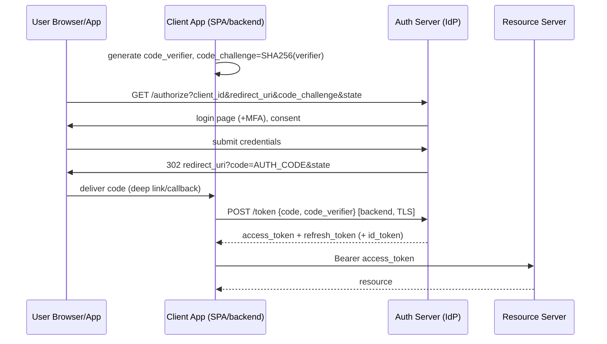
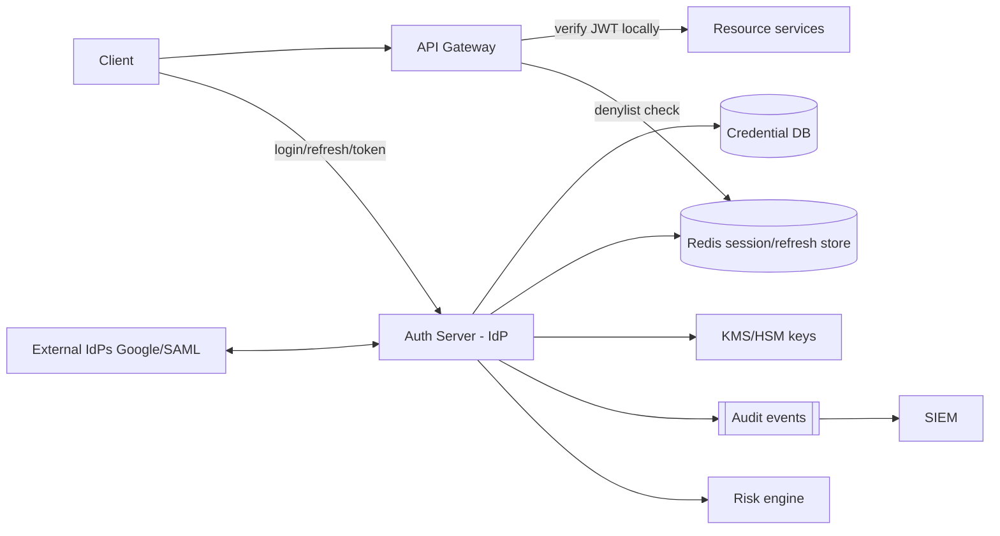
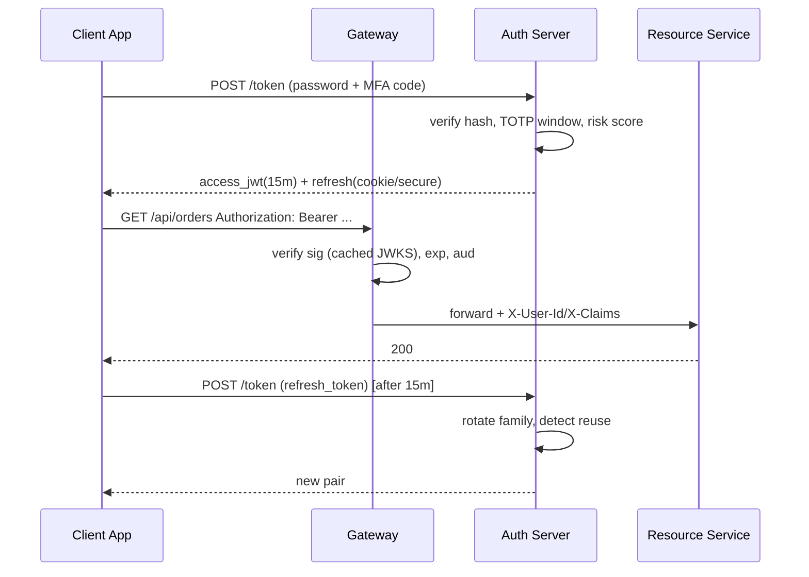
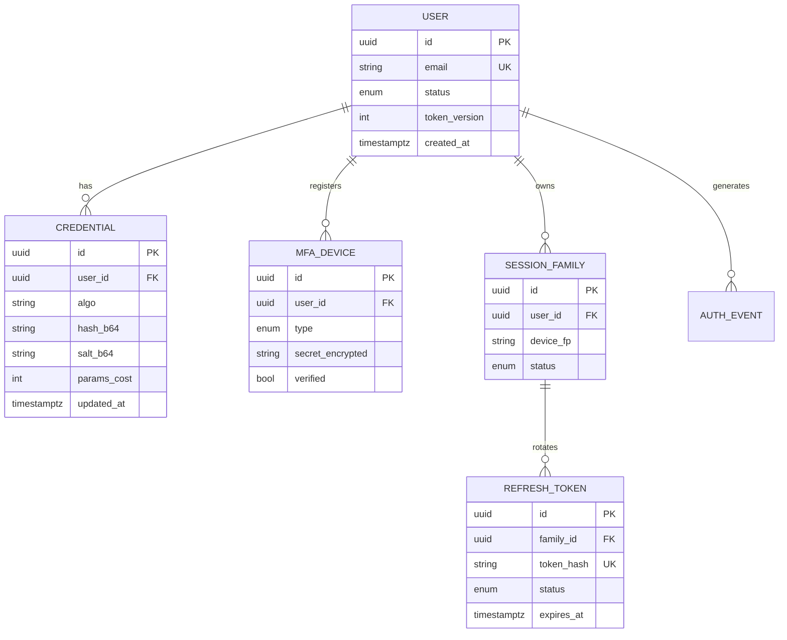

# Design An Authentication System

## Blogs and websites

## Medium

## Youtube

- [Design a Simple Authentication System | System Design Interview Prep](https://www.youtube.com/watch?v=uj_4vxm9u90)
- [10 Years of Building Auth Systems (As Senior Developer)](https://www.youtube.com/watch?v=hnfzT6d7mbo)

---

## Theory

An authentication system verifies *who* a caller is; authorization decides *what they may do* (a separate but adjacent concern). The system issues credentials, validates them on every request, manages their lifecycle (expiry, rotation, revocation), and increasingly federates identity to external providers. Nearly every backend service depends on it, so it must be the most reliable subsystem in the company — when auth is down, everything is down.

### Important Subtopics

1. Credentials and storage (hashing: bcrypt/Argon2, salts)
2. Session-based auth vs token-based auth (cookies vs JWT)
3. JWT anatomy: claims, signing (HS256 vs RS256), expiry
4. Refresh tokens and rotation
5. Token revocation strategies
6. OAuth 2.0 flows (authorization code + PKCE)
7. OpenID Connect (authentication on top of OAuth)
8. SSO and federation (SAML 2.0 basics)
9. MFA / 2FA (TOTP, WebAuthn/passkeys)
10. Password policies and reset flows
11. Machine-to-machine auth (API keys, client credentials)
12. Rate limiting & credential-stuffing defense
13. Session storage at scale (Redis clusters, sticky vs stateless)
14. Security headers and cookie flags (HttpOnly, Secure, SameSite)

### Password Storage Fundamentals

Never store passwords — store slow, salted **one-way hashes**.

- **Salting**: a unique random value per user prepended before hashing defeats rainbow tables.
- **Key stretching**: general-purpose hashes (SHA-256) are too fast; GPUs try billions/sec. Purpose-built password hashes are deliberately slow and memory-hard:
  - **bcrypt** — cost factor 10–12, ~100 ms/hash; battle-tested classic.
  - **Argon2id** — modern winner of the Password Hashing Competition; memory-hard, resists GPU/ASIC attacks. Preferred for new systems.
- Verification recomputes the hash with the stored salt and compares in constant time (`MessageDigest.isEqual`) to avoid timing leaks.
- Re-hash-on-login when you raise the cost factor — transparent parameter upgrades.

### Sessions vs Tokens

| Aspect | Server sessions | Stateless tokens (JWT) |
|---|---|---|
| Storage | Server-side (Redis/DB); cookie holds opaque ID | Claims live inside signed token held by client |
| Validation | Lookup per request (I/O) | Verify signature locally (CPU only) |
| Revocation | Delete session — instant | Hard: wait for expiry or maintain denylist |
| Size | Cookie ~32 bytes | JWT can be 1–4 KB |
| Cross-service | Shared session store needed | Any service with the public key verifies |
| Logout everywhere | Trivial | Requires token versioning/denylist |

**JWT structure**: `base64(header).base64(payload).base64(signature)`.

```json
// header                       // payload (claims)
{ "alg": "RS256", "kid": "2025-01", "typ": "JWT" }
{ "sub": "u-123", "scope": "orders.read", "iss": "auth.corp",
  "aud": "api.corp", "iat": 1690000000, "exp": 1690003600, "jti": "t-9f2" }
```

Signing: HMAC (HS256, shared secret — fine within one service boundary) vs RSA/ECDSA (RS256/ES256, private key signs, any holder of the public key verifies — right for microservices). Always validate `alg` against an allowlist (the `alg:none` and key-confusion attacks exploit naive libraries), check `exp`, `iss`, `aud`.

### Refresh Tokens & Rotation

Access tokens live minutes (5–15 min); refresh tokens live days/weeks and are exchanged at the auth server for new pairs. **Rotation**: each use invalidates the old refresh token and issues a new one; reuse of a rotated token signals theft → kill the whole family. Store refresh tokens hashed server-side, bind them to client fingerprint/device, and mark them one-time-use.

### Revocation Strategies

1. Short access-token TTL + rotation covers most cases naturally.
2. Denylist by `jti` in Redis with TTL = remaining token life (check on sensitive endpoints).
3. Per-user `token_version` claim bumped on password change/logout-all — version mismatch rejects instantly.
4. Push-based logout via distributed cache pub/sub for gateway-held session maps.

### OAuth 2.0 & OIDC

OAuth is **delegation** ("let my app act on your behalf at another service"), OIDC adds an identity layer (`id_token`). The flow that matters:

**Authorization Code + PKCE** (web & mobile):



PKCE stops interception of the code (a stolen code alone is useless without the verifier). `state` blocks CSRF on the callback. Never use implicit flow — deprecated.

**Client Credentials** flow for machine-to-machine: service posts `client_id+secret` (or private-key JWT) directly to `/token`, receives a short-lived access token — no user involved.

### MFA

- **TOTP** (Google Authenticator): shared secret generates 30-second codes; verify with ±1 window skew.
- **WebAuthn/Passkeys**: public-key cryptography bound to device/platform authenticator; phishing-resistant because the origin is part of the signing ceremony. The strategic direction of the industry.
- **SMS OTP**: weak (SIM swap) but ubiquitous fallback.
- Design: step-up authentication — require MFA only on sensitive actions (password change, payout).

---

## Characteristics

- **Correctness-critical single point**: every request depends on it; design for availability above all (cached verification paths, read replicas).
- **Security-first data model**: passwords hashed with memory-hard KDFs; secrets never logged; constant-time comparisons.
- **Stateless-friendly but revocation-aware**: JWTs give horizontal scale; production designs add cheap revocation layers rather than choosing purity.
- **Federated by default**: modern systems are both IdP (for your apps) and RP (relying party consuming Google/Apple/corporate IdPs).
- **Multi-factor capable**: MFA is table stakes for B2B and finance.
- **Auditable**: every auth event (login success/failure, token issuance, password change) is logged immutably for forensics and compliance (SOC2/ISO27001/RBI for Indian fintech).
- **Latency-sensitive on the hot path**: token verification sits in front of every API call — sub-millisecond local verification, not network round-trips.

---

## Components

- **Credential store**
  *Purpose*: users table with password hash, MFA secret, status. *Responsibilities*: Argon2/bcrypt hashing policy, lookup by username/email/phone, lockout counters. *Relationship*: used by login flow only — hot path avoids it after token issuance. *Example*: `users` table in Postgres; enterprise dirs like AD/LDAP behind adapters.

- **Auth server / Identity Provider (IdP)**
  *Purpose*: authenticate users/machines, mint tokens/sessions, run OAuth/OIDC/SAML endpoints. *Responsibilities*: `/authorize`, `/token`, `/introspect`, `/revoke`, `/jwks`, login UI, MFA challenge orchestration, account-recovery flows. *Example*: Keycloak, Okta, Auth0, AWS Cognito — or Spring Authorization Server if building in-house.

- **Token/session store**
  *Purpose*: refresh-token families, denylist, session map for cookie-based flows. *Responsibilities*: TTL management, rotation bookkeeping, O(1) revocation checks. *Example*: Redis cluster; sessions keyed `session:{id}` with idle+absolute TTLs.

- **JWKS endpoint / key management**
  *Purpose*: publish rotating public keys (`kid`-tagged) so resource servers verify offline. *Responsibilities*: scheduled key rotation (e.g., 90 days), dual-publish during overlap, HSM/KMS-backed private keys. *Example*: `https://idp.example.com/.well-known/jwks.json`.

- **Resource servers (your APIs)**
  *Responsibilities*: verify signature locally, enforce scopes/roles, propagate identity context downstream.

- **Login risk/threat engine**
  *Purpose*: credential-stuffing and anomaly defense. *Responsibilities*: velocity checks, breached-password screening, device fingerprinting, CAPTCHA/step-up triggers. *Example*: Akamai/Cloudflare bot tiers; internal risk scoring à la Google.

- **Audit/event pipeline**
  *Purpose*: immutable log of auth events → SIEM. *Example*: Kafka topic consumed by Splunk/ELK; alerts on impossible-travel logins.



---

## Patterns

- **Bearer token + JWKS verification**
  *Problem*: validating a session requires a store lookup per request — latency and coupling. *How*: IdP signs JWTs; APIs verify against cached public keys. *When*: microservices, high QPS. *Not when*: you need instant global revocation as the primary guarantee (use sessions or add denylist). *Pros*: zero I/O validation. *Cons*: clock/expiry subtleties, token size.

- **Refresh-token rotation with reuse detection**
  As described in Theory; standard in Auth0/Cognito. Detects theft automatically.

- **BFF cookie pattern for SPAs**
  *Problem*: JS-accessible tokens get XSS-exfiltrated. *How*: SPA talks to its own backend-for-frontend; tokens live only inside the BFF; browser holds HttpOnly SameSite cookies. *When*: browser clients. *Pros*: removes XSS token theft class. *Cons*: extra hop.

- **Token exchange (RFC 8693)** for service chains: edge service swaps user's token for a scoped-down downstream token — enforces least privilege per hop.

- **Gateway-centralized authn, service-local authz**: gateway authenticates once, forwards verified identity headers/JWT; services make authorization decisions from claims — avoids N× integration with the IdP.

- **Anti-patterns**: putting PII/permissions in JWTs (stale + bloat); HS256 across many services (every verifier can mint tokens — confused-deputy risk); rolling your own crypto for "simpler" flows; long-lived non-rotating API keys in mobile apps.

---

## Benefits

- **Single source of identity truth** eliminates per-app password sprawl (and the breach surface it creates).
- **Offload-once, benefit-everywhere**: central MFA, rate limiting, and anomaly detection protect all applications simultaneously.
- **Horizontal scale without shared session infrastructure** when using signed tokens — new API instances need no warm state.
- **Clean third-party delegation** through OAuth lets partners integrate without sharing your users' credentials.
- **Compliance enablement**: centralized logs and controls map directly onto SOC2/PCI/RBI requirements.
- **Better UX options**: SSO means one login for the whole product suite; passkeys remove password friction.

---

## Pros

- Stateless verification scales to extreme QPS with negligible marginal cost.
- Standard protocols (OIDC/OAuth/SAML) yield mature libraries, auditors' familiarity, and vendor portability.
- Rotation + short TTL bounds stolen-credential usefulness to minutes.
- Supports gradual modernization: legacy SAML apps and modern SPA/passkey apps coexist behind one IdP.

## Cons

- JWT revocation is inherently awkward — denylists reintroduce state and I/O.
- Misconfiguration risk concentrates: one bad JWKS/alg handling bug exposes every service.
- Token size overhead on chatty mobile APIs (KBs per request).
- Self-hosting an IdP is a serious security burden; vendor lock-in cuts both ways (egress pricing, schema lock).
- Password reset/account recovery remains the weakest link — security reduces to phone/email inbox security.

---

## Challenges

- **Technical**: clock skew between issuer and verifiers (allow small leeway); key rotation races during deploys (overlap windows); constant-time comparison discipline.
- **Scalability**: login storms post-outage; Redis hot shards for celebrity-session workloads; JWKS caching stampedes at TTL expiry (jitter + stale-while-revalidate).
- **Performance**: Argon2 parameters tuned so login p99 stays acceptable under load; hashing is intentionally expensive — capacity-plan for it.
- **Reliability**: the IdP becoming a global outage generator — mitigate with cached-JWT grace periods (verifiers keep accepting previously-valid tokens briefly if JWKS unreachable), regional IdP deployments.
- **Maintainability**: migrating hash algorithms transparently (rehash-on-login); deprecating legacy grant types without breaking old apps.
- **Operational**: 24×7 on-call for lockout storms; support tooling for account recovery that doesn't become a social-engineering hole.
- **Security**: credential stuffing (defense: breached-password lists, velocity limits, CAPTCHA escalation), session fixation, CSRF on cookie flows (SameSite=Strict/Lax + anti-forgery tokens), token leakage via logs/referers (scrub, short TTLs), phishing (passkeys, FIDO MFA).

---

## Best Practices

- **Hash with Argon2id (or bcrypt ≥12)**, unique per-user salt, rehash-on-login to lift parameters over time.
- **Short-lived access tokens (≤15 min) + rotating refresh tokens** — caps blast radius while keeping UX smooth.
- **Prefer RS256/ES256 with rotating `kid`s published over JWKS**; verifiers fetch-and-cache, never hardcode.
- **HttpOnly + Secure + SameSite=Lax/Strict cookies** for browser sessions; never localStorage for refresh tokens in SPAs.
- **Validate everything on every token**: signature, `exp` with leeway ≤60 s, `iss`, `aud`, algorithm allowlist.
- **Build revocation in early**: `jti` denylist or token-version claim — retrofitting revocation into a large fleet hurts.
- **Rate-limit and lock out intelligently**: exponential backoff per account *and* per IP/device; CAPTCHA after thresholds; alert on stuffing-pattern spikes (many accounts, few IPs — and vice versa).
- **Screen registrations against known-breached password corpora** (k-anonymity range API style).
- **Log all auth events with stable event schemas**, never secrets; retain per compliance.
- **Adopt passkeys where your user base allows**; keep TOTP as bridge; retire SMS where possible.
- **Use proven IdPs** (Keycloak/Spring Authorization Server/Auth0/Cognito) unless identity is your product.

---

## When to Use

**Choose session-cookie auth** when: classic server-rendered or BFF web apps, instant revocation priority, same-site architecture.

**Choose JWT bearer** when: microservices, mobile/native apps, cross-domain APIs, third-party developers, very high QPS where per-request lookups hurt.

**Choose hybrid** (most real systems): cookies at the edge for browsers, JWTs internally between services.

**Consider fully managed identity** (Cognito/Auth0/Firebase) when team size is small or compliance certification matters more than customization; build/self-host when you need deep customization, data residency (e.g., India RBI rules), or identity *is* the business.

Alternatives to weigh: mTLS for service-to-service inside a mesh (no tokens at all), SPIFFE/SPIRE identities in Kubernetes estates.

---

## Use Cases

- **Consumer app at 50M MAU**
  *Problem*: massive anonymous traffic + login storms during launches. *Solution*: stateless JWT verification at gateway, Redis-backed refresh families, aggressive CDN offload of static login assets, progressive CAPTCHA. *Trade-off*: denylist checks only on sensitive routes keeps hot path fast.

- **Banking platform (RBI-compliant)**
  *Problem*: regulatory mandates (factor re-auth on payments, session timeouts, data residency). *Solution*: in-region self-hosted IdP (Keycloak), step-up MFA on transactions, absolute session caps, full audit trail to WORM storage. *Trade-off*: operational burden accepted for compliance necessity.

- **SaaS B2B with enterprise customers**
  *Problem*: tenants demand SAML/SCIM; consumers want social login. *Solution*: IdP supporting per-org federation configs (SAML metadata per tenant), JIT provisioning via SCIM, OIDC for everyone else. *Trade-off*: multi-protocol complexity concentrated in one well-tested component.

---

## High-Level Design



Scaling: IdP instances are stateless (state in Postgres/Redis) → HPA; JWKS behind CDN; Redis cluster sharded by session id; credential DB rarely hit (only login/reset) — modest sizing suffices even at huge user counts.

Failure handling: JWKS unreachable → verifiers continue with cached keys up to configured max-age; Redis brownout → denylist checks fail-open for low-risk reads but fail-closed for admin/payout routes (explicit policy choice); credential DB down → login fails closed, already-issued tokens keep working (that's the point of statelessness).

---

## Deep Dive

- **Signature verification internals**: cache parsed JWKS with `kid` index; on unknown `kid`, refetch (bounded rate); pin algorithms — reject `none`, reject HS256 when expecting asymmetric; use library primitives (`NimbusJwtDecoder`, `jjwt`) not hand-rolled base64 parsing.
- **Constant-time discipline**: compare MACs/hashes via `MessageDigest.isEqual`; avoid early-return-on-prefix patterns anywhere secrets flow.
- **Rotation choreography**: generate `kid-2025Q3` keypair in KMS → publish alongside old in JWKS → wait >max token TTL → stop signing with old → remove from JWKS after overlap. Zero-downtime because verifiers accept both during overlap.
- **Reuse-detection mechanics**: refresh tokens stored as `(family_id, token_hash, status)`; presenting a `CONSUMED` token marks family `COMPROMISED` and revokes all descendants — this turns attacker mistakes into automatic incident response.
- **Observability**: metrics — login success ratio, argon2 latency histogram, refresh-rotation anomalies (spike = attack or bug), JWKS fetch failures, denylist hit-rate; traces spanning gateway→IdP on 401 bursts; synthetic login probes per region every minute.

---

## Data Modeling



Choices worth defending: refresh tokens stored **hashed** (DB leak ≠ mass hijack); `token_version` on user row gives instant global logout without touching millions of tokens; unique index on `token_hash` makes reuse detection a primary-key-style lookup; `AUTH_EVENT` append-only, partitioned by month, shipped to SIEM. Indexes: `user(email)` unique for lookup, `(family_id,status)` for rotation queries, `(expires_at)` sweeper scan.

---

## Java and Spring Boot Implementation

Spring Security 6 configuration — resource-server style JWT validation:

```java
@Configuration
@EnableWebSecurity
public class SecurityConfig {

    @Bean
    SecurityFilterChain filterChain(HttpSecurity http) throws Exception {
        http.csrf(AbstractHttpConfigurer::disable)
            .sessionManagement(s -> s.sessionCreationPolicy(SessionCreationPolicy.STATELESS))
            .authorizeHttpRequests(auth -> auth
                .requestMatchers("/public/**").permitAll()
                .requestMatchers("/admin/**").hasRole("ADMIN")
                .anyRequest().authenticated())
            .oauth2ResourceServer(o -> o.jwt(jwt -> jwt
                .decoder(jwtDecoder())
                .jwtAuthenticationConverter(new RolesClaimConverter())));
        return http.build();
    }

    JwtDecoder jwtDecoder() {
        return NimbusJwtDecoder.withJwkSetUri("https://idp.example.com/.well-known/jwks.json")
                .jwtProcessorCustomizer(p -> p.setJWSVerifierFactory(...)) // alg pinning via validator below
                .build();
    }
}
```

Issuing tokens with Spring Authorization Server is config-driven; a minimal login service with proper hashing:

```java
@Service
public class LoginService {

    private final UserRepository users;
    private final TokenService tokens;
    private final LoginAttemptService attempts;

    @Value("${auth.argon2.memory-kb:65536}")
    private int argonMemoryKb;

    public LoginResult login(String email, String rawPassword, String totpCode) {
        attempts.checkBlocked(email);
        User u = users.findByEmail(email).orElseThrow(() -> new BadCredentialsException("invalid"));
        if (!Argon2Hasher.verify(rawPassword, u.getPasswordHash(), argonMemoryKb)) {
            attempts.recordFailure(email);
            throw new BadCredentialsException("invalid");
        }
        mfaVerifier.verify(u, totpCode); // throws on bad code
        attempts.reset(email);
        return tokens.issuePair(u);      // access JWT + rotating refresh family
    }
}
```

Controller + exception mapping:

```java
@RestController
@RequestMapping("/auth")
class AuthController {
    @PostMapping("/login")
    ResponseEntity<LoginResponse> login(@Valid @RequestBody LoginRequest req) {
        return ResponseEntity.ok(loginService.login(req.email(), req.password(), req.totp()));
    }

    @ExceptionHandler(BadCredentialsException.class)
    ResponseEntity<?> badCreds() {
        // deliberately vague — no user enumeration
        return ResponseEntity.status(401).body(Map.of("error", "invalid_credentials"));
    }
}
```

Testing pattern: Testcontainers spins Postgres + Redis; integration test asserts (1) wrong password increments attempt counter and locks after threshold, (2) reused refresh token kills the whole family, (3) tampered JWT signature yields 401 without stack-trace leakage.

---

## Real-World Examples

- **Google/Microsoft SSO** — planet-scale IdPs publishing OIDC; billions rely on their JWKS endpoints; passkeys pushed at consumer scale.
- **Auth0/Okta & Keycloak** — the commercial and open-source archetypes of everything above (rotation, MFA, federation, SCIM).
- **AWS IAM roles + STS** — machine-side auth at cloud scale: temporary credentials constantly issued/rotated instead of static keys; conceptually identical to short-TTL tokens.
- **GitHub** — PATs, OAuth apps, WebAuthn rollout showing pragmatic migration of a huge legacy credential estate.

---

## Interview Preparation

### Interview Questions

**Beginner**

1. **Session vs JWT — core difference?**
   Sessions keep state server-side (cookie = pointer); JWTs carry state cryptographically signed (cookie/header = the data itself). Consequences: revocation easy vs hard, per-request lookup vs local verification.
2. **Why salted slow hashes for passwords?**
   Salt defeats precomputation/rainbow tables; slowness (Argon2/bcrypt) makes brute-force economically unviable even after a DB leak.

**Intermediate**

3. **How would you implement "logout from all devices"?**
   Options: bump `token_version` claim source so outstanding access tokens fail validation; delete all session families in Redis; denylist by user. Discuss trade-offs: version-bump needs verifiers to check a tiny DB/cache — reintroduces a lookup, so many teams accept short access TTLs and only revoke refresh families immediately.
4. **Explain the OAuth authorization-code flow and why PKCE exists.**
   Walk the sequence diagram above; PKCE binds the token exchange to the client that started the flow via a proof-of-possession secret, neutralizing code-interception on mobile/deep-link redirects.
5. **Where do you store tokens in an SPA and why?**
   Prefer HttpOnly SameSite cookies via a BFF so XSS cannot read them; if tokens must be in JS (rare), accept documented risk, minimize TTL, add CSP. Interviewers probe the XSS-vs-CSRF trade-off here.

**Advanced**

6. **Design auth for 100M DAU mobile app with instant revocation on fraud detection.**
   Hybrid: stateless JWT verification at edge for throughput + Redis denylist consulted only on sensitive ops + push-based kill switch via pub/sub to gateways; refresh-family compromise detection for automated response. Discuss numbers: 15-min access TTL caps exposure; fraud events trigger family kill within seconds.
7. **Your IdP region failed; users with valid tokens still work but nobody can log in. Explain and improve.**
   Statelessness did its job (verification is local). Improvements: multi-region active-active IdP, cached-JWT grace windows at verifiers, regional refresh-token replication with conflict-free rotation (or pinned-home regions), runbooks for degraded login mode.

**Senior / system design**

8. **Architect SSO across 12 internal products plus 3rd-party developer API access.**
   Central OIDC IdP; products as RPs sharing session via domain cookie or silent-refresh; developer console issuing OAuth clients with scopes; token exchange for internal service hops; audit spine common to all. Emphasize protocol boundaries, key governance, and tenant-level federation for acquired companies.
9. **Walk through a credential-stuffing attack end-to-end and every control that blunts it.**
   Attack: leaked combo lists sprayed at login. Controls layered: velocity/anomaly detection, breached-password blocking at registration, Argon2 cost (limits offline side), CAPTCHA escalation, device fingerprinting, breached-alert monitoring, mandatory MFA for risky logins, rate limits per IP+account+ASN. Expected depth: knowing attackers distribute sources, so pure IP limiting fails.

### Common Mistakes

- Storing JWTs in localStorage "because cookies are legacy" — hands tokens to any XSS.
- Accepting whatever `alg` the token declares (classic confusion attack) — pin allowlists.
- Long-lived access tokens with no rotation story.
- Revealing "user exists" vs "wrong password" differences (enumeration oracle).
- Forgetting `aud`/`iss` checks — tokens valid across unrelated environments (staging token works in prod).

### Expected discussion points

Revocation trade-off spectrum, key-rotation choreography, why identity is a buy-before-build component, phishing resistance trajectory toward passkeys, and how compliance regimes shape session policies.
