# Design An Authentication System

## Blogs and websites

## Medium

## Youtube

- [Design a Simple Authentication System | System Design Interview Prep](https://www.youtube.com/watch?v=uj_4vxm9u90)
- [10 Years of Building Auth Systems (As Senior Developer)](https://www.youtube.com/watch?v=hnfzT6d7mbo)

---

## Theory

### Topics Covered

1. [Introduction and Problem Statement](#introduction-and-problem-statement)
2. [Functional Requirements](#functional-requirements)
3. [Non-Functional Requirements](#non-functional-requirements)
4. [Capacity Estimation](#capacity-estimation)
5. [Password Storage Fundamentals](#password-storage-fundamentals)
6. [Sessions vs Tokens](#sessions-vs-tokens)
7. [Refresh Tokens and Rotation](#refresh-tokens-and-rotation)
8. [Revocation Strategies](#revocation-strategies)
9. [OAuth 2.0 and OpenID Connect](#oauth-20-and-openid-connect)
10. [Multi-Factor Authentication](#multi-factor-authentication)
11. [Encryption and Key Management](#encryption-and-key-management)
12. [Characteristics](#characteristics)
13. [Components](#components)
14. [Architectural Patterns](#architectural-patterns)
15. [Benefits](#benefits)
16. [Pros](#pros)
17. [Cons](#cons)
18. [Challenges](#challenges)
19. [Best Practices](#best-practices)
20. [When to Use](#when-to-use)
21. [Use Cases](#use-cases)
22. [API Design and Contract](#api-design-and-contract)
23. [Data Model and API](#data-model-and-api)
24. [High-Level Design](#high-level-design)
25. [Deep Dive](#deep-dive)
26. [Replication Strategies](#replication-strategies)
27. [Failure Detection and Membership](#failure-detection-and-membership)
28. [High Availability and Scalability](#high-availability-and-scalability)
29. [CAP Theorem and Consistency Trade-offs](#cap-theorem-and-consistency-trade-offs)
30. [Authentication and Authorization](#authentication-and-authorization)
31. [Security Threats and Mitigations](#security-threats-and-mitigations)
32. [Observability and Logging](#observability-and-logging)
33. [Real-World Implementations](#real-world-implementations)
34. [Java and Spring Boot Implementation Guide](#java-and-spring-boot-implementation-guide)
35. [Interview Questions and Answers](#interview-questions-and-answers)

---

### What Is It?

An authentication system verifies *who* a caller is; authorization decides *what they may do* (a separate but adjacent concern). The system issues credentials, validates them on every request, manages their lifecycle (expiry, rotation, revocation), and increasingly federates identity to external providers. Nearly every backend service depends on it, so it must be the most reliable subsystem in the company — when auth is down, everything is down.

### Why Does It Exist?

Modern applications serve millions of users across web, mobile, and third-party integrations, all of whom need a consistent, secure identity layer. Building auth per-application leads to credential sprawl (users reusing passwords, breach surface multiplied), inconsistent security controls, and compliance gaps. A centralised auth system provides a single source of truth for identity, a uniform security posture (MFA, rate limiting, anomaly detection), and enables SSO so users log in once for the whole product suite.

### What Problem Does It Solve?

* **Credential reuse and breach amplification**: users reuse passwords across services; a breach in one app compromises others. Central authentication with breach-password screening and MFA containment limits blast radius.
* **Oversell-equivalent for sessions**: stolen tokens grant immediate access. Short-lived access tokens + rotating refresh tokens + token-binding cap the window and detect theft.
* **Operational complexity**: every team rolling their own login UI, password hashing, MFA, and OAuth integration is duplication and risk. A central IdP removes this burden once.
* **Regulatory compliance**: immutable audit logs, encryption-at-rest, data residency, and session policies are enforced in one place rather than per-service.
* **Developer friction**: a well-documented OIDC / SCIM interface lets product teams integrate auth in minutes rather than weeks, accelerating feature velocity.

### Introduction and Problem Statement

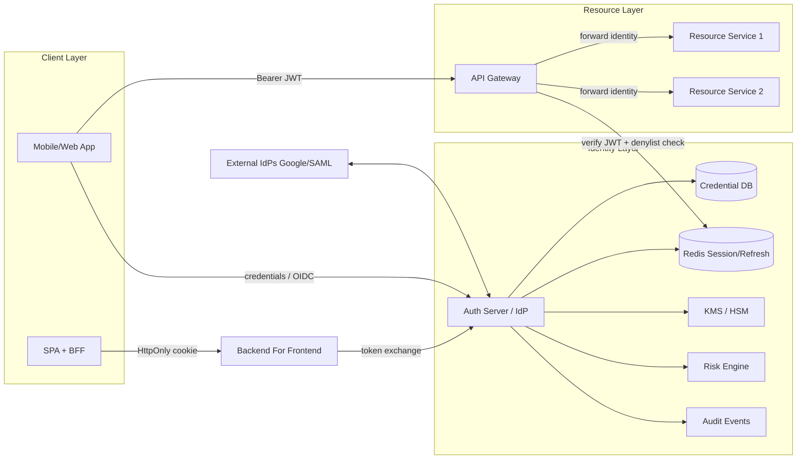

*Diagram: Authentication system architecture. The Auth Server (IdP) issues tokens after verifying credentials against the credential database and risk engine. The API Gateway verifies JWTs locally against cached keys and consults Redis for denial-list checks. External IdPs integrate via federation protocols.*

**Problem Statement:** Design a secure, scalable, and highly available authentication system that can handle millions of daily active users, protect against credential stuffing and token theft, support multi-factor authentication, federate with external identity providers (Google, SAML), and issue short-lived access tokens with rotating refresh tokens — all while maintaining sub-millisecond token verification latency on the API hot path.

**Why this problem matters:** Authentication is the front door to every application. A breach here compromises the entire system. Yet the same system must scale to millions of requests per second without becoming a bottleneck. The tension between security (strong checks, MFA, revocation) and performance (local verification, stateless tokens) defines the core design challenge.

**Real-life use cases driving the design:**

- **Session storage**: store a user session token as the key and the session data as the value.
- **Shopping cart**: Redis is often used as a fast cart store where the cart ID is the key.
- **Feature flags**: map a flag name to its configuration.
- **Distributed cache**: cache database query results or rendered pages.
- **Leader election and distributed locks**: etcd and Redis provide key-based primitives.

---

### Functional Requirements

The system must support the following capabilities:

1. **User registration**: users create an account with email/phone, password, and optional MFA enrollment.
2. **Credential storage**: passwords are hashed with Argon2id or bcrypt (memory-hard, salted) — never stored in plaintext.
3. **Login flow**: username/password verification, MFA challenge orchestration, and session/token issuance.
4. **Access token issuance**: short-lived (5–15 min) JWT signed with RS256/ES256 containing user ID, scopes, and claims.
5. **Refresh token issuance**: long-lived token for obtaining new access tokens, with rotation on each use.
6. **Token refresh**: exchange a valid refresh token for a new access+refresh pair.
7. **Token revocation**: immediately invalidate access and refresh tokens on logout, password change, or fraud detection.
8. **Password reset**: email-based one-time link with short expiry; secure token flow.
9. **MFA enrollment and verification**: TOTP (Google Authenticator), WebAuthn/passkeys, and SMS OTP as fallback.
10. **OAuth 2.0 / OIDC flows**: authorization code + PKCE for SPAs and mobile apps; client credentials for machine-to-machine.
11. **Single Sign-On (SSO)**: federation with Google, Microsoft, and SAML-based enterprise IdPs.
12. **SCIM provisioning**: automated user lifecycle management for enterprise tenants.
13. **Audit logging**: immutable log of all auth events (login success/failure, token issuance, MFA enrollment, password changes) for compliance and forensics.
14. **Risk-based authentication**: velocity checks, device fingerprinting, and anomaly detection to flag suspicious logins.
15. **Rate limiting and lockout**: per-account and per-IP rate limits with exponential backoff and CAPTCHA escalation to defend against credential stuffing.

---

### Non-Functional Requirements

| Category | Requirement |
|---|---|
| **Availability** | 99.99%+ uptime — auth downtime takes down all dependent services. |
| **Latency (hot path)** | JWT signature verification <1 ms (local, no network round-trips). |
| **Latency (login)** | Argon2id verification + MFA challenge <500 ms p99. |
| **Throughput** | 1M+ token verifications per second at the gateway layer. |
| **Security** | TLS 1.3 end-to-end; secrets never logged; constant-time comparisons; SOC 2, PCI-DSS, and GDPR compliance. |
| **Scalability** | Horizontal scale — stateless verifiers; sharded credential stores; Redis cluster for sessions. |
| **Durability** | Credential DB with multi-AZ replication; refresh-token families persisted with TTL. |
| **Recovery** | <15 min RTO / <5 min RPO for the credential store; cached-JWT grace period for IdP outages. |
| **Operability** | Full observability: metrics, traces, synthetic probes, alerting on anomaly spikes. |
| **Audit retention** | Immutable event log retained 7+ years for compliance (WORM storage where required). |

---

### Capacity Estimation

For a 100M Daily Active Users (DAU) system:

**Login rate:**
- Assume 20% of users log in per day → 20M logins/day
- Peak hour factor ~5× average → ~4M logins/hour, ~1,100 logins/sec at peak
- With MFA, each login may involve 2–3 round trips (password → MFA → token)

**Token verification rate:**
- Each user averages 100 API calls/day → 10B calls/day
- At 100K req/sec average, peaking at 300K req/sec
- Each API call requires JWT verification (CPU-bound, local)
- Gateway layer must handle 300K verifications/sec → easily 12+ stateless instances behind a load balancer

**Token refresh rate:**
- Access tokens expire in 15 min → 4 refreshes/user/day
- 100M users × 4 = 400M refreshes/day → ~4,600 refreshes/sec average, ~23K/sec peak

**Storage requirements:**
- Users table: 100M rows × ~200 bytes = ~20 GB (PostgreSQL, compressed)
- Refresh token families: 400M × ~100 bytes (hashed) = ~40 GB in Redis (with TTL-based expiry)
- Session cache: 100M active sessions × ~500 bytes = ~50 GB in Redis cluster
- Audit log: 100M logins/day × ~1 KB = ~100 GB/day → ~3.6 TB/year

**Network:**
- JWT size ~1–2 KB; 300K verifications/sec × 2 KB = ~600 MB/sec ingress at gateway
- Well within a 10 Gbps network interface capacity

**Redis sizing:**
- 100 GB for refresh tokens + sessions
- 3-node Redis cluster with replication factor 2 → ~150 GB RAM per node
- Network: 600 MB/sec throughput, well within Redis capacity (~1M ops/sec per node)

---

### Password Storage Fundamentals

Never store passwords — store slow, salted **one-way hashes**.

- **Salting**: a unique random value per user prepended before hashing defeats rainbow tables.
- **Key stretching**: general-purpose hashes (SHA-256) are too fast; GPUs try billions/sec. Purpose-built password hashes are deliberately slow and memory-hard:
  - **bcrypt** — cost factor 10–12, ~100 ms/hash; battle-tested classic.
  - **Argon2id** — modern winner of the Password Hashing Competition; memory-hard, resists GPU/ASIC attacks. Preferred for new systems.
- Verification recomputes the hash with the stored salt and compares in constant time (`MessageDigest.isEqual`) to avoid timing leaks.
- Re-hash-on-login when you raise the cost factor — transparent parameter upgrades.

**Algorithm selection:**

| Algorithm | Security | Performance | When to use |
|---|---|---|---|
| **Argon2id** | Best (memory-hard, PHC winner) | Configurable memory/time | New systems, high-security requirements |
| **bcrypt** | Strong (GPU-resistant, well-audited) | ~100 ms at cost 12 | Migrations, compatibility needs |
| **scrypt** | Strong (memory-hard) | Configurable N/r/p | When Argon2 unavailable |
| **PBKDF2** | Weak (not memory-hard) | Fast | Legacy FIPS-only environments |

**Hashing parameters for Argon2id (recommended):**
- Memory: 64 MB
- Iterations: 3
- Parallelism: 2
- Hash length: 32 bytes
- Salt length: 16 bytes

---

### Sessions vs Tokens

| Aspect | Server sessions | Stateless tokens (JWT) |
|---|---|---|
| Storage | Server-side (Redis/DB); cookie holds opaque ID | Claims live inside signed token held by client |
| Validation | Lookup per request (I/O) | Verify signature locally (CPU only) |
| Revocation | Delete session — instant | Hard: wait for expiry or maintain denylist |
| Size | Cookie ~32 bytes | JWT can be 1–4 KB |
| Cross-service | Shared session store needed | Any service with the public key verifies |
| Logout everywhere | Trivial | Requires token versioning/denylist |

**JWT structure**: `base64(header).base64(payload).base64(signature)`.

```json
// header                       // payload (claims)
{ "alg": "RS256", "kid": "2025-01", "typ": "JWT" }
{ "sub": "u-123", "scope": "orders.read", "iss": "auth.corp",
  "aud": "api.corp", "iat": 1690000000, "exp": 1690003600, "jti": "t-9f2" }
```

Signing: HMAC (HS256, shared secret — fine within one service boundary) vs RSA/ECDSA (RS256/ES256, private key signs, any holder of the public key verifies — right for microservices). Always validate `alg` against an allowlist (the `alg:none` and key-confusion attacks exploit naive libraries), check `exp`, `iss`, `aud`.

**Token binding**: For high-security environments, bind tokens to a client key (MTLS or DPoP) so a stolen token cannot be replayed from a different connection.

**Hybrid approach**: Most production systems use cookies for browser flows (with HttpOnly + SameSite) and JWTs for API/service-to-service communication. This gives the best of both worlds: secure browser session management and stateless API verification.

---

### Refresh Tokens and Rotation

Access tokens live minutes (5–15 min); refresh tokens live days/weeks and are exchanged at the auth server for new pairs. **Rotation**: each use invalidates the old refresh token and issues a new one; reuse of a rotated token signals theft → kill the whole family. Store refresh tokens hashed server-side, bind them to client fingerprint/device, and mark them one-time-use.

**Refresh token family mechanics:**

1. User authenticates → server issues `access_token` (15 min) + `refresh_token` (7 days)
2. Client calls `/token` with `grant_type=refresh_token` before access token expires
3. Server validates the refresh token, issues a NEW access token + NEW refresh token
4. Server marks the old refresh token as `CONSUMED` (one-time-use enforcement)
5. If a `CONSUMED` token is presented again → **theft detected** → revoke the entire family

**Storage:** Refresh tokens stored **hashed** (SHA-256) in the database, just like passwords. Even a database leak does not allow token replay.

**Device binding:** Each refresh token is associated with a `device_id` and `user_agent`. Suspicious device changes trigger re-authentication.

**Auto-refresh:** Clients auto-refresh 5 minutes before access token expiry. If refresh fails (family revoked), the user is logged out everywhere.

---

### Revocation Strategies

1. **Short access-token TTL + rotation** covers most cases naturally — stolen tokens expire within minutes.
2. **Denylist by `jti` in Redis** with TTL = remaining token life (check on sensitive endpoints only, to keep the hot path fast).
3. **Per-user `token_version` claim** bumped on password change/logout-all — version mismatch rejects instantly without checking a denylist.
4. **Push-based logout via distributed cache pub/sub** for gateway-held session maps — instant invalidation across all gateway instances.
5. **Certificate-bound tokens** (MTLS): revoking the client certificate invalidates all tokens issued to that client.
6. **Introspection endpoint** (RFC 7662): resource servers query the IdP to check token validity — used for high-value transactions where stale tokens must be rejected.

**Revocation latency spectrum:**

| Strategy | Latency | Cost | Use Case |
|---|---|---|---|
| Short TTL | Minutes | Free | Default everywhere |
| Denylist (Redis) | <100 ms | O(1) check | Sensitive operations |
| Token version | <100 ms | DB read | Global logout |
| Push (pub/sub) | <1 s | Network | Session management |
| Introspection | ~5 ms | Network round-trip | High-value transactions |

---

### OAuth 2.0 and OpenID Connect

OAuth is **delegation** ("let my app act on your behalf at another service"), OIDC adds an identity layer (`id_token`). The flow that matters:

**Authorization Code + PKCE** (web & mobile):

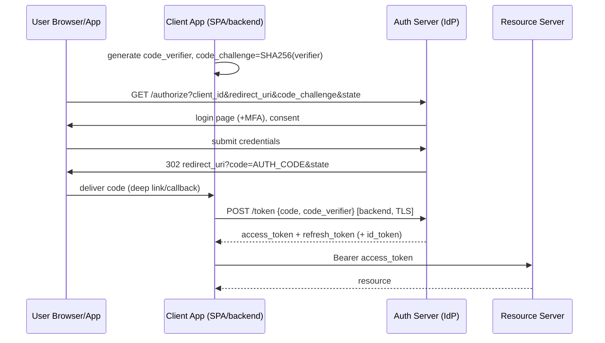

PKCE stops interception of the code (a stolen code alone is useless without the verifier). `state` blocks CSRF on the callback. Never use implicit flow — deprecated.

**Client Credentials** flow for machine-to-machine: service posts `client_id+secret` (or private-key JWT) directly to `/token`, receives a short-lived access token — no user involved.

**OIDC flows:**
- **Authorization Code + PKCE**: web apps and mobile apps (most secure)
- **Hybrid flow**: legacy web apps that need both ID token and access token upfront
- **Client Credentials**: service-to-service
- **Device Code**: IoT devices with limited input capabilities
- **Resource Owner Password Credentials**: deprecated, avoid

**Token introspection** (RFC 7662): resource servers can query the IdP's `/introspect` endpoint to check if a token is still valid — useful for high-security operations where denylist checks must be authoritative.

**Token exchange** (RFC 8693): edge service swaps the user's token for a scoped-down downstream token — enforces least privilege per hop in a service mesh.

---

### Multi-Factor Authentication

- **TOTP** (Google Authenticator): shared secret generates 30-second codes; verify with ±1 window skew.
- **WebAuthn/Passkeys**: public-key cryptography bound to device/platform authenticator; phishing-resistant because the origin is part of the signing ceremony. The strategic direction of the industry.
- **SMS OTP**: weak (SIM swap) but ubiquitous fallback.
- **Design**: step-up authentication — require MFA only on sensitive actions (password change, payout).

**MFA enrollment flow:**
1. User navigates to Security Settings → "Add Security Key"
2. System generates a random challenge and sends it to the authenticator
3. Authenticator signs the challenge with the private key (stored securely in hardware)
4. System stores the credential ID + public key (never the private key)
5. On login, system sends a new challenge; authenticator signs it → verified

**MFA verification at login:**
1. User enters username/password → password verified
2. System checks: is MFA enabled for this user?
3. If yes → prompt for TOTP code or WebAuthn assertion
4. If MFA verified → issue tokens
5. If MFA fails → increment failed attempts, potentially lock account

**Adaptive MFA:**
- Low-risk login (known device, familiar location) → skip MFA
- Medium-risk (new device, same location) → SMS OTP
- High-risk (new device, new location) → TOTP + push notification
- Very high-risk (concurrent sessions, suspicious IP ranges) → hard blocker, manual review

---

### Encryption and Key Management

Auth systems touch the most sensitive data — passwords, tokens, PII. Encryption and key management
are foundational controls, not optional add-ons.

#### Encryption at Rest

- **Password hashing**: passwords are never encrypted (reversibility), they are hashed with a
  salt using Argon2id (or bcrypt/scrypt). The salt prevents rainbow-table attacks; the slow hash
  rate-limits brute-force. Each hash stores the algorithm name, version, parameters (memory,
  iterations, parallelism), salt, and hash output.
- **User data encryption**: PII (email, phone, addresses) stored in the user database can be
  encrypted at the application level using envelope encryption — a data encryption key (DEK)
  encrypts each record, and the DEK is in turn encrypted by a key encryption key (KEK) stored in
  an HSM or KMS (AWS KMS, Google Cloud KMS, Azure Key Vault).
- **Token storage**: refresh tokens and session data stored in Redis or a database should be
  encrypted at rest. Redis supports encryption in transit (TLS) but at-rest encryption requires
  either filesystem-level encryption or application-level encryption of the token payload.

#### Encryption in Transit

- **TLS everywhere**: every hop — client → load balancer, load balancer → API gateway, gateway →
  auth service, service → user database — must use TLS. Mutual TLS (mTLS) is used for
  inter-service communication (e.g., gateway → auth service) to prevent token theft in transit.
- **Token signing keys**: JWTs are signed with an asymmetric key pair (RS256/ES256). The private
  key signs; the public key verifies. The private key must never leave the auth service or HSM.

#### Key Management

- **Key hierarchy**: root KEK (in HSM) → intermediate KEKs → DEKs. This allows rotating intermediate
  keys without re-encrypting all data.
- **Key rotation**: signing keys (for JWTs) should be rotated periodically. Use the `kid` (key
  ID) header in JWTs so verifiers know which key to use. Publish multiple active keys in the JWKS
  endpoint during rotation overlap.
- **Certificate management**: TLS certificates for the auth service must be rotated automatically
  (e.g., Let's Encrypt / cert-manager) with OCSP stapling for revocation checking.
- **KMS integration**: use managed KMS (AWS KMS, Cloud KMS) for envelope encryption. The
  application requests a DEK from KMS, uses it to encrypt data, and stores the encrypted DEK
  alongside the ciphertext. KMS never sees the plaintext data.

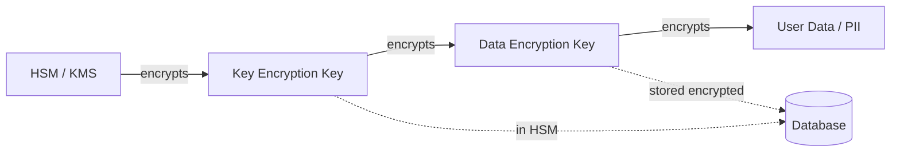
*Key hierarchy for auth system data encryption: HSM/KMS holds the root KEK, intermediate KEKs
encrypt DEKs, DEKs encrypt actual user data.*

#### Java Example: Key Management Service

```java
@Service
public class KeyManagementService {

    private final AWSKms kms;
    private final Map<String, PublicKey> signingKeys;

    @Value("${app.jwt.algorithm:RS256}")
    private String jwtAlgorithm;

    public KeyManagementService(AWSKMS kms) {
        this.kms = kms;
        this.signingKeys = new ConcurrentHashMap<>();
    }

    // Envelope encryption: encrypt data with a DEK fetched from KMS
    public EncryptedData encrypt(String plaintext) {
        // Generate a data key (plaintext + encrypted copy)
        GenerateDataKeyRequest request = new GenerateDataKeyRequest()
            .withKeyId("alias/auth-system-master")
            .withKeySpec(DataKeySpec.AES_256);
        GenerateDataKeyResult result = kms.generateDataKey(request);

        ByteBuffer plaintextKey = result.getPlaintext();
        ByteBuffer encryptedKey = result.getEncryptedDataKey();

        // Encrypt data with the plaintext DEK
        byte[] ciphertext = encryptWithKey(plaintextKey, plaintext);

        return new EncryptedData(
            Base64.getEncoder().encodeToString(encryptedKey.array()),
            Base64.getEncoder().encodeToString(ciphertext)
        );
    }

    // Return public keys for JWT verification (cached)
    public Map<String, String> getActivePublicKeys() {
        return signingKeys.entrySet().stream()
            .collect(Collectors.toMap(
                Entry::getKey,
                e -> Base64.getEncoder().encodeToString(e.getValue().getEncoded())
            ));
    }

    record EncryptedData(String encryptedKey, String ciphertext) {}
}
```

- **Q: Should password hashes be re-hashed on every login?**
  **A:** Yes — if the stored hash uses an outdated Argon2 cost parameter, re-hash with current
  parameters and update the stored hash. This is transparent to the user and keeps security current.

- **Q: What is the difference between at-rest encryption and password hashing?**
  **A:** At-rest encryption is reversible (data can be decrypted with the key). Password hashing is
  one-way — the original password cannot be recovered. Hashing protects passwords from database
  compromise because even the system cannot reverse the operation.

---

### Characteristics

- **Correctness-critical single point**: every request depends on it; design for availability above all (cached verification paths, read replicas).
- **Security-first data model**: passwords hashed with memory-hard KDFs; secrets never logged; constant-time comparisons.
- **Stateless-friendly but revocation-aware**: JWTs give horizontal scale; production designs add cheap revocation layers rather than choosing purity.
- **Federated by default**: modern systems are both IdP (for your apps) and RP (relying party consuming Google/Apple/corporate IdPs).
- **Multi-factor capable**: MFA is table stakes for B2B and finance.
- **Auditable**: every auth event (login success/failure, token issuance, password change) is logged immutably for forensics and compliance (SOC2/ISO27001/RBI for Indian fintech).
- **Latency-sensitive on the hot path**: token verification sits in front of every API call — sub-millisecond local verification, not network round-trips.

---

### Components

- **Credential store**
  *Purpose*: users table with password hash, MFA secret, status. *Responsibilities*: Argon2/bcrypt hashing policy, lookup by username/email/phone, lockout counters. *Relationship*: used by login flow only — hot path avoids it after token issuance. *Example*: `users` table in Postgres; enterprise dirs like AD/LDAP behind adapters.

- **Auth server / Identity Provider (IdP)**
  *Purpose*: authenticate users/machines, mint tokens/sessions, run OAuth/OIDC/SAML endpoints. *Responsibilities*: `/authorize`, `/token`, `/introspect`, `/revoke`, `/jwks`, login UI, MFA challenge orchestration, account-recovery flows. *Example*: Keycloak, Okta, Auth0, AWS Cognito — or Spring Authorization Server if building in-house.

- **Token/session store**
  *Purpose*: refresh-token families, denylist, session map for cookie-based flows. *Responsibilities*: TTL management, rotation bookkeeping, O(1) revocation checks. *Example*: Redis cluster; sessions keyed `session:{id}` with idle+absolute TTLs.

- **JWKS endpoint / key management**
  *Purpose*: publish rotating public keys (`kid`-tagged) so resource servers verify offline. *Responsibilities*: scheduled key rotation (e.g., 90 days), dual-publish during overlap, HSM/KMS-backed private keys. *Example*: `https://idp.example.com/.well-known/jwks.json`.

- **Resource servers (your APIs)**
  *Responsibilities*: verify signature locally, enforce scopes/roles, propagate identity context downstream.

- **Login risk/threat engine**
  *Purpose*: credential-stuffing and anomaly defense. *Responsibilities*: velocity checks, breached-password screening, device fingerprinting, CAPTCHA/step-up triggers. *Example*: Akamai/Cloudflare bot tiers; internal risk scoring à la Google.

- **Audit/event pipeline**
  *Purpose*: immutable log of auth events → SIEM. *Example*: Kafka topic consumed by Splunk/ELK; alerts on impossible-travel logins.

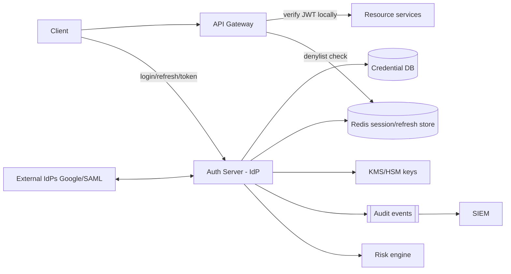

*Diagram: High-level component view. The Auth Server (IdP) is the central authority for credential verification, token issuance, and MFA orchestration. Resource servers verify JWTs independently. The gateway consults Redis for denylist checks. External IdPs integrate via federation.*

**Component interaction patterns:**
- **Synchronous**: API Gateway → JwtDecoder (local verification, no network)
- **Asynchronous**: IdP → Audit pipeline (fire-and-forget after event persistence)
- **Synchronous with fallback**: Gateway → Redis denylist (fail-open for read, fail-closed for admin operations)
- **Periodic**: KMS/HSM key rotation (scheduled jobs with overlap windows)

---

### Architectural Patterns

- **Bearer token + JWKS verification**
  *Problem*: validating a session requires a store lookup per request — latency and coupling. *How*: IdP signs JWTs; APIs verify against cached public keys. *When*: microservices, high QPS. *Not when*: you need instant global revocation as the primary guarantee (use sessions or add denylist). *Pros*: zero I/O validation. *Cons*: clock/expiry subtleties, token size.

- **Refresh-token rotation with reuse detection**
  As described in Theory; standard in Auth0/Cognito. Detects theft automatically.

- **BFF cookie pattern for SPAs**
  *Problem*: JS-accessible tokens get XSS-exfiltrated. *How*: SPA talks to its own backend-for-frontend; tokens live only inside the BFF; browser holds HttpOnly SameSite cookies. *When*: browser clients. *Pros*: removes XSS token theft class. *Cons*: extra hop.

- **Token exchange (RFC 8693)** for service chains: edge service swaps user's token for a scoped-down downstream token — enforces least privilege per hop.

- **Gateway-centralized authn, service-local authz**: gateway authenticates once, forwards verified identity headers/JWT; services make authorization decisions from claims — avoids N× integration with the IdP.

- **Anti-patterns**: putting PII/permissions in JWTs (stale + bloat); HS256 across many services (every verifier can mint tokens — confused-deputy risk); rolling your own crypto for "simpler" flows; long-lived non-rotating API keys in mobile apps.

---

### Benefits

- **Single source of identity truth** eliminates per-app password sprawl (and the breach surface it creates).
- **Offload-once, benefit-everywhere**: central MFA, rate limiting, and anomaly detection protect all applications simultaneously.
- **Horizontal scale without shared session infrastructure** when using signed tokens — new API instances need no warm state.
- **Clean third-party delegation** through OAuth lets partners integrate without sharing your users' credentials.
- **Compliance enablement**: centralized logs and controls map directly onto SOC2/PCI/RBI requirements.
- **Better UX options**: SSO means one login for the whole product suite; passkeys remove password friction.

---

### Pros

- Stateless verification scales to extreme QPS with negligible marginal cost.
- Standard protocols (OIDC/OAuth/SAML) yield mature libraries, auditors' familiarity, and vendor portability.
- Rotation + short TTL bounds stolen-credential usefulness to minutes.
- Supports gradual modernization: legacy SAML apps and modern SPA/passkey apps coexist behind one IdP.
- Centralized identity management reduces per-team operational burden.

---

### Cons

- JWT revocation is inherently awkward — denylists reintroduce state and I/O.
- Misconfiguration risk concentrates: one bad JWKS/alg handling bug exposes every service.
- Token size overhead on chatty mobile APIs (KBs per request).
- Self-hosting an IdP is a serious security burden; vendor lock-in cuts both ways (egress pricing, schema lock).
- Password reset/account recovery remains the weakest link — security reduces to phone/email inbox security.
- Cross-region consistency for global logout requires additional infrastructure (pub/sub, distributed cache).

---

### Challenges

- **Technical**: clock skew between issuer and verifiers (allow small leeway); key rotation races during deploys (overlap windows); constant-time comparison discipline.
- **Scalability**: login storms post-outage; Redis hot shards for celebrity-session workloads; JWKS caching stampedes at TTL expiry (jitter + stale-while-revalidate).
- **Performance**: Argon2 parameters tuned so login p99 stays acceptable under load; hashing is intentionally expensive — capacity-plan for it.
- **Reliability**: the IdP becoming a global outage generator — mitigate with cached-JWT grace periods (verifiers keep accepting previously-valid tokens briefly if JWKS unreachable), regional IdP deployments.
- **Maintainability**: migrating hash algorithms transparently (rehash-on-login); deprecating legacy grant types without breaking old apps.
- **Operational**: 24×7 on-call for lockout storms; support tooling for account recovery that doesn't become a social-engineering hole.
- **Security**: credential stuffing (defense: breached-password lists, velocity limits, CAPTCHA escalation), session fixation, CSRF on cookie flows (SameSite=Strict/Lax + anti-forgery tokens), token leakage via logs/referers (scrub, short TTLs), phishing (passkeys, FIDO MFA).

**Mitigation strategies mapped to challenge categories:**

| Challenge | Mitigation |
|---|---|
| Credential stuffing | Breached-password API, velocity limiting, CAPTCHA escalation, device fingerprinting |
| Token theft | HttpOnly+Secure cookies, short TTL, rotation, DPoP/MTLS binding |
| IdP outage | Multi-region deployment, cached JWKS with stale-while-revalidate, cached-JWT grace period |
| Login storms | Rate limiting, exponential backoff, progressive CAPTCHA, pre-warmed instances |
| Session fixation | Regenerate session ID on privilege change, SameSite cookies |
| Key rotation | Overlapping windows (sign + verify with both keys), automated KMS rotation |

---

### Best Practices

- **Hash with Argon2id (or bcrypt ≥12)**, unique per-user salt, rehash-on-login to lift parameters over time.
- **Short-lived access tokens (≤15 min) + rotating refresh tokens** — caps blast radius while keeping UX smooth.
- **Prefer RS256/ES256 with rotating `kid`s published over JWKS**; verifiers fetch-and-cache, never hardcode.
- **HttpOnly + Secure + SameSite=Lax/Strict cookies** for browser sessions; never localStorage for refresh tokens in SPAs.
- **Validate everything on every token**: signature, `exp` with leeway ≤60 s, `iss`, `aud`, algorithm allowlist.
- **Build revocation in early**: `jti` denylist or token-version claim — retrofitting revocation into a large fleet hurts.
- **Rate-limit and lock out intelligently**: exponential backoff per account *and* per IP/device; CAPTCHA after thresholds; alert on stuffing-pattern spikes (many accounts, few IPs — and vice versa).
- **Screen registrations against known-breached password corpora** (k-anonymity range API style).
- **Log all auth events with stable event schemas**, never secrets; retain per compliance.
- **Adopt passkeys where your user base allows**; keep TOTP as bridge; retire SMS where possible.
- **Use proven IdPs** (Keycloak/Spring Authorization Server/Auth0/Cognito) unless identity is your product.
- **Defense in depth**: combine perimeter controls (WAF), edge verification (gateway), per-service validation, and centralized monitoring — never rely on a single layer.
- **Secure the supply chain**: sign tokens with keys in HSM/KMS, rotate service-account credentials automatically, audit key access.

---

### When to Use

**Choose session-cookie auth** when: classic server-rendered or BFF web apps, instant revocation priority, same-site architecture.

**Choose JWT bearer** when: microservices, mobile/native apps, cross-domain APIs, third-party developers, very high QPS where per-request lookups hurt.

**Choose hybrid** (most real systems): cookies at the edge for browsers, JWTs internally between services.

**Consider fully managed identity** (Cognito/Auth0/Firebase) when team size is small or compliance certification matters more than customization; build/self-host when you need deep customization, data residency (e.g., India RBI rules), or identity *is* the business.

**Avoid custom auth** when: you lack dedicated security expertise, have no compliance requirements beyond standard OAuth, and team velocity is more important than control — use a managed IdP.

Alternatives to weigh: mTLS for service-to-service inside a mesh (no tokens at all), SPIFFE/SPIRE identities in Kubernetes estates.

**Decision matrix:**

| Factor | Session Cookies | JWT | Managed IdP | Custom |
|---|---|---|---|---|
| Team size small | ❌ | ⚠️ | ✅ | ❌ |
| Instant revocation | ✅ | ❌ | ✅ | ✅ |
| Microservices | ❌ | ✅ | ✅ | ⚠️ |
| Compliance needs | ⚠️ | ⚠️ | ✅ | ⚠️ |
| Cross-domain SSO | ❌ | ⚠️ | ✅ | ✅ |
| MFA built-in | ❌ | ❌ | ✅ | Build |

---

### Use Cases

- **Consumer app at 50M MAU**
  *Problem*: massive anonymous traffic + login storms during launches. *Solution*: stateless JWT verification at gateway, Redis-backed refresh families, aggressive CDN offload of static login assets, progressive CAPTCHA. *Trade-off*: denylist checks only on sensitive routes keeps hot path fast.

- **Banking platform (RBI-compliant)**
  *Problem*: regulatory mandates (factor re-auth on payments, session timeouts, data residency). *Solution*: in-region self-hosted IdP (Keycloak), step-up MFA on transactions, absolute session caps, full audit trail to WORM storage. *Trade-off*: operational burden accepted for compliance necessity.

- **SaaS B2B with enterprise customers**
  *Problem*: tenants demand SAML/SCIM; consumers want social login. *Solution*: IdP supporting per-org federation configs (SAML metadata per tenant), JIT provisioning via SCIM, OIDC for everyone else. *Trade-off*: multi-protocol complexity concentrated in one well-tested component.

- **Gaming platform with mobile-first users**
  *Problem*: short-session gameplay, high login frequency, need frictionless re-auth. *Solution*: passkey-based auth for returning users, refresh-token rotation for silent re-auth, device fingerprint for anomaly detection. *Trade-off*: passkey adoption curve for older users — TOTP fallback maintained.

---

### API Design and Contract

The authentication system exposes OAuth 2.0 / OIDC endpoints compliant with industry standards. All endpoints require HTTPS.

**Core endpoints:**

| Endpoint | Method | Purpose |
|---|---|---|
| `/oauth2/authorize` | GET | Start authorization code flow (browser redirect) |
| `/oauth2/token` | POST | Exchange code/refresh for tokens |
| `/oauth2/revoke` | POST | Revoke access or refresh token |
| `/oauth2/introspect` | POST | Check token validity (RFC 7662) |
| `/.well-known/jwks.json` | GET | Public keys for JWT verification |
| `/.well-known/openid-configuration` | GET | OIDC discovery document |
| `/userinfo` | GET | Get user profile from access token |
| `/scim/v2/users` | POST/GET/PUT/DELETE | SCIM user provisioning |

**Authentication: API Gateway**

All endpoints accept JWT bearer tokens in the `Authorization` header. The gateway verifies signatures against the JWKS endpoint before forwarding requests.

**Example: Authorization Request**

```
GET /oauth2/authorize?
  response_type=code
  &client_id=mobile_app_123
  &redirect_uri=com.example.app://callback
  &scope=openid%20profile%20email%20orders.read
  &state=a1b2c3d4
  &code_challenge=x8s9...2kLm
  &code_challenge_method=S256
```

**Example: Token Exchange (Authorization Code)**

```http
POST /oauth2/token
Content-Type: application/x-www-form-urlencoded
Authorization: Basic base64(client_id:client_secret)

grant_type=authorization_code
&code=SplxlOBeZLo.5gO3k1
&redirect_uri=com.example.app://callback
&code_verifier=x8s9...2kLm
```

**Successful token response:**

```json
{
  "access_token": "eyJhbGciOiJSUzI1NiIs...",
  "token_type": "Bearer",
  "expires_in": 900,
  "refresh_token": "dGhpcyBpcyBhIHJlZnJlc2g...",
  "id_token": "eyJhbGciOiJSUzI1NiIs...",
  "scope": "openid profile email orders.read"
}
```

**Error response:**

```json
{
  "error": "invalid_grant",
  "error_description": "Authorization code has expired or is invalid",
  "error_uri": "https://docs.example.com/errors/invalid_grant"
}
```

**HTTP status codes:**

| Code | Meaning | Scenario |
|---|---|---|
| 200 | Success | Token issued successfully |
| 400 | Bad Request | Missing required parameter |
| 401 | Unauthorized | Client authentication failed |
| 403 | Forbidden | Client not authorized for scope |
| 404 | Not Found | Unknown client or redirect URI |
| 429 | Too Many Requests | Rate limit exceeded |
| 500 | Internal Server Error | Unexpected server error |

**Validation rules:**
- All parameters validated server-side — `redirect_uri` must match the registered URI exactly
- PKCE `code_challenge` must be 43–128 characters, base64url-encoded
- `state` parameter echoed back to prevent CSRF — generated per request, never reused
- JWT `aud` claim must include the resource server's identifier
- Token introspection endpoint requires client credentials (confidential clients only)

**Rate limiting:**
- Authorization endpoint: 10 requests/minute per IP + progressive CAPTCHA
- Token endpoint: 20 requests/minute per client_id
- Introspection endpoint: 100 requests/second per client
- All rate limits returned with `Retry-After` and `X-RateLimit-Remaining` headers

**Versioning strategy:**
- Endpoint URLs versioned via path (`/oauth2/v2/authorize`) for breaking changes
- API versioning via header (`Accept-Version: 2025-01`) for non-breaking additions
- JWKS keys tagged with `kid` — verifiers fetch the key matching the `kid` in the JWT header

**Idempotency:**
- Token issuance is idempotent — the same `code` + `code_verifier` always returns the same result until the code is consumed
- Revocation is idempotent — revoking an already-revoked token returns 200
- Refresh token rotation ensures a token can only be used once (POST-once semantics)

---

### Data Model and API

The authentication system requires several interconnected data stores. Below is a comprehensive data model spanning the credential database, token store, and session management layer.

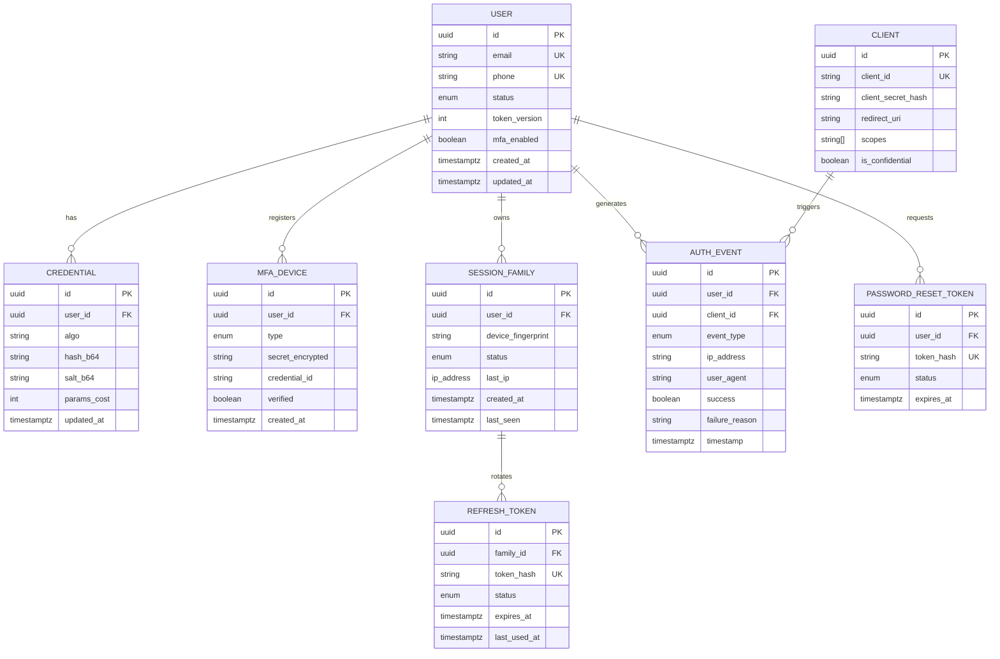

*Diagram: Entity relationship model for the authentication system. `USER` is the central entity, connected to credentials, MFA devices, session families (with rotating refresh tokens), OAuth clients, audit events, and password-reset tokens. Refresh tokens are stored hashed (even DB leaks enable no replay). The `token_version` on `USER` enables instant global logout without denylists.*

**Design choices worth defending:**

1. **Refresh tokens stored hashed** — a database leak does not enable mass token replay; each `REFRESH_TOKEN.token_hash` is a SHA-256 hash
2. **`token_version` on `USER` row** — global logout is a single atomic increment; no need to revoke millions of tokens individually
3. **Unique index on `token_hash`** — reuse detection is a primary-key-style lookup, not a scan
4. **`AUTH_EVENT` append-only**, partitioned by month, shipped to SIEM — immutability for forensics
5. **Indexes**: `USER(email)` unique for lookup, `(family_id, status)` for rotation queries, `(expires_at)` sweeper scan, `(user_id, event_type, timestamp)` for audit dashboard queries

**Partitioning strategy:**
- `AUTH_EVENT`: partitioned by month on `timestamp` — cold data archived to S3 Glacier after 2 years
- `REFRESH_TOKEN`: sharded by `user_id` hash — 16 shards for 100M users
- `USER`: single table with read replicas for lookup; write hotspots avoided by UUID primary keys (not sequential)

---

## Design

### Design Considerations

The authentication system's most consequential design decision is the split between the **control plane** (Auth Server/IdP, which issues and revokes credentials) and the **data plane** (API Gateways and Resource Servers, which verify tokens locally without calling back). This split exists because token verification must scale to millions of QPS with sub-millisecond latency, while issuance is comparatively rare and needs full fraud/risk evaluation. Secondary decisions — token TTLs, refresh-family rotation, MFA policy — are tunable knobs whose defaults are chosen for the worst case (credential stuffing, token theft) rather than the average case.

### Key Decisions

- **Short-lived access tokens (5–15 min)**: caps stolen-token blast radius to minutes. Verified locally (stateless), so no per-request round-trip to the IdP.
- **Refresh-token rotation with reuse detection**: each refresh invalidates the old token and issues a new one; presenting a previously-consumed token signals theft → the entire family is revoked.
- **RS256/ES256 asymmetric signing with kid rotation**: any service that only has the public key can verify, but only the IdP (holding the private key in KMS/HSM) can issue. JWKS publishing enables zero-downtime key rotation.
- **Denylist by jti for sensitive endpoints only**: a full denylist on every API call reintroduces per-request I/O; instead, short TTL + token-version claim handle most revocations, and Redis denylist is consulted only for high-value operations.
- **MFA gating**: TOTP/WebAuthn for routine MFA; push/U2F for step-up on sensitive actions (payments, admin access).
- **Risk engine integration**: velocity checks, device fingerprinting, breached-password screening at registration, CAPTCHA escalation on suspicious login attempts.

### Trade-offs

| Decision | Pro | Con |
|---|---|---|
| Stateless JWT verification | Scales to extreme QPS, no shared state | Hard revocation (needs denylist/version bump) |
| Refresh-token rotation | Theft auto-detected, near-instant response | Complex state management (families, statuses) |
| Argon2id hashing | Resists GPU/ASIC offline cracking | CPU/memory expensive, must capacity-plan login pools |
| Self-hosted IdP | Full control, data residency | Operational/security burden, on-call for auth |
| Managed IdP (Auth0/Cognito) | Offloads security, compliance certs | Vendor lock-in, egress pricing, schema constraints |

### Scalability Considerations

- **Verification plane**: 300K+ verifications/sec at the gateway → stateless JWT validation (local cache of JWKS keys); trivially horizontal. The IdP is not on this path.
- **Login plane**: 1.1K–23K logins/refreshes/sec peak → IdP instances stateless (state in Postgres/Redis) → HPA; Redis cluster sharded by session id; credential DB modestly sized (only hit at login/reset).
- **JWKS delivery**: behind CDN with stale-while-revalidate to prevent fetch-stampede at cache TTL expiry.
- **Redis for sessions/refresh tokens**: 3-node cluster, ~150 GB RAM per node; token_hash as primary key for O(1) lookups.

### Reliability Considerations

- **IdP regional failure**: already-issued JWTs keep working (stateless verification); new logins fail over to another region via DNS/GSLB.
- **JWKS fetch failure**: verifiers cache keys with a configurable `max-age`; previously seen keys continue verifying for the cache duration.
- **Redis brownout**: denylist checks fail-open for low-risk reads; fail-closed for admin/payout routes.
- **Recovery targets**: <15 min RTO / <5 min RPO for credential DB (multi-AZ); cached-JWT grace period for IdP outages.

### Performance Considerations

- JWT signature verification: <1 ms local check (no network).
- Login: Argon2id verification (64 MB, 3 iterations, ~250–400 ms) + MFA challenge <500 ms p99.
- Refresh: single Redis `GET` on `token_hash` + family rotation update — sub-10 ms.
- Token size: keep JWTs minimal (sub, scope, exp, iat, jti, token_version) to avoid mobile overhead.

### Security Considerations

- **Password hashing**: Argon2id with per-user salt; rehash-on-login to upgrade parameters.
- **Algorithm pinning**: reject `alg: none`; reject HS256 when asymmetric is expected (key-confusion attack).
- **Token binding**: DPoP or MTLS binds tokens to the TLS channel so replayed tokens fail.
- **CSRF/XSS**: SameSite=Strict/Lax cookies + anti-forgery tokens for browser flows; never store tokens in localStorage.
- **Credential stuffing**: breached-password API at registration, rate limiting per IP+account+ASN, CAPTCHA escalation, device fingerprinting.
- **Audit trail**: all auth events (login, logout, MFA, token issuance) to immutable log → SIEM; retention per compliance (7+ years WORM where required).

### Maintainability Considerations

- **Hash migration**: rehash-on-login means gradual algorithm upgrades without user friction.
- **Scope/client deprecation**: versioned OIDC discovery docs; clients declare supported scopes; dead scopes pruned after migration windows.
- **Key rotation automation**: KMS-scheduled rotation with overlap; automated tests verify verifiers accept both old and new keys during transition.
- **Observability-driven on-call**: synthetic login probes, JWKS fetch-failure alerts, denylist-hit-rate dashboards, Argon2 latency histograms, impossible-travel detection.

## Architecture

### Architectural Style

**Control-plane / data-plane split**: the Auth Server (control plane) handles credential verification, token issuance, MFA orchestration, and key management. The API Gateways and Resource Servers (data plane) verify JWTs locally using cached public keys — they never call back to the IdP on the request hot path. This lets the data plane scale to millions of verifications/second with sub-millisecond latency while keeping the control plane at modest size.

**Zero-trust verification**: every service validates tokens independently rather than trusting upstream claims. The gateway verifies signature, expiry, issuer, and audience; resource servers re-check scopes relevant to their endpoint. No service blindly trusts an `X-User-Id` header from an unauthenticated neighbor.

**Event-driven audit spine**: all auth events (login, logout, MFA enrollment, token issuance, revocation) are published to an append-only log consumed by SIEM and analytics — decoupling security observability from the request path.

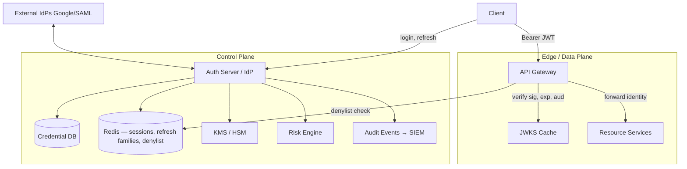

*Diagram: Authentication system architecture. The Auth Server (IdP, control plane) is the central authority for credential verification, token issuance, MFA orchestration, and key management. The data plane (Gateway + Resource Services) verifies JWTs locally against cached JWKS and consults Redis only for denylist checks on sensitive operations. External IdPs integrate via federation.*

### Component Responsibilities and Communication

| Component | Responsibility | Communication |
|---|---|---|
| Auth Server (IdP) | `/authorize`, `/token`, `/revoke`, `/introspect`, `/jwks`, login UI, MFA orchestration | Sync to CDB/Redis/KMS; async events to audit bus; sync to resource servers only at token-issuance time |
| Credential DB | Users, password hashes, MFA secrets | PostgreSQL cluster, multi-AZ; IdP reads only at login/reset |
| Redis | Refresh-token families, denylist, active session map | O(1) reads at refresh; denylist checks at sensitive endpoints |
| JWKS endpoint | Publish rotating public keys with `kid` | Behind CDN; gateways fetch-and-cache |
| Gateway | Local JWT verification + denylist check on sensitive ops | Stateless, horizontally scaled |
| Resource Services | Enforce scopes/permissions from claims | No IdP round-trips |
| Risk Engine | Velocity checks, device fingerprinting, breached-password screening | Sync call from IdP at login; feeds anomaly alerts |
| Audit bus | Immutable log of all auth events | Kafka → SIEM (Splunk/ELK) |

**Data flow**: login → IdP verifies password (Argon2) → risk engine evaluates → MFA challenged → IdP mints JWT + refresh token (refresh stored hashed in Redis with TTL) → client uses JWT at gateway → gateway verifies locally → forwards identity to resource services → refresh happens at IdP with family rotation and reuse detection.

**Scaling strategy**: IdP instances are stateless (state in Postgres/Redis) → HPA; JWKS behind CDN; Redis cluster sharded; credential DB modestly sized (only hit at login/reset). Multi-region active-active IdP deployment with eventual consistency on user data, strong consistency on credential data.

**Failure handling**: JWKS unreachable → verifiers continue with cached keys up to configured max-age; Redis brownout → denylist checks fail-open for read, fail-closed for admin routes; credential DB down → login fails closed, already-issued tokens keep working.

**Monitoring and alerting**: synthetic login probes per region, p99 latency of `/token` < 500 ms, JWKS fetch failure rate alerts, denylist hit rate (near-zero under normal conditions), impossible-travel detection.

### High-Level Design

Login flow with MFA and token issuance:

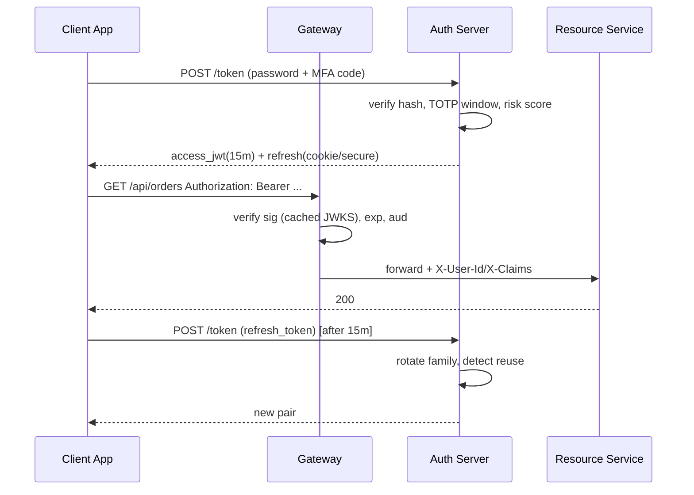

*Diagram: Authentication flow. The client authenticates directly with the Auth Server (IdP), which verifies credentials and MFA, then issues an access JWT and a refresh token. Subsequent API calls verify the JWT at the Gateway using cached JWKS keys. When the access token expires, the client uses the refresh token to obtain a new pair — each use rotates the refresh token family to detect theft.*

**Scaling strategy:** IdP instances are stateless (state in Postgres/Redis) → HPA; JWKS behind CDN; Redis cluster sharded by session id; credential DB rarely hit (only login/reset) — modest sizing suffices even at huge user counts. Multi-region active-active IdP deployment with eventual consistency on user data, strong consistency on credential data.

**Failure handling:** JWKS unreachable → verifiers continue with cached keys up to configured max-age; Redis brownout → denylist checks fail-open for low-risk reads but fail-closed for admin/payout routes (explicit policy choice); credential DB down → login fails closed, already-issued tokens keep working (that's the point of statelessness).

**Monitoring and alerting:**
- Synthetic login probes per region every minute
- p99 latency of `/token` endpoint < 500 ms
- JWKS fetch failure rate alerts
- Denylist hit rate (should be near-zero under normal conditions)
- Impossible-travel detection (consecutive logins from geographically distant IPs within minutes)

---

### Deep Dive

- **Signature verification internals**: cache parsed JWKS with `kid` index; on unknown `kid`, refetch (bounded rate); pin algorithms — reject `none`, reject HS256 when expecting asymmetric; use library primitives (`NimbusJwtDecoder`, `jjwt`) not hand-rolled base64 parsing. Always use well-maintained libraries; JWT verification bugs are common in custom implementations.
- **Constant-time discipline**: compare MACs/hashes via `MessageDigest.isEqual`; avoid early-return-on-prefix patterns anywhere secrets flow.
- **Rotation choreography**: generate `kid-2025Q3` keypair in KMS → publish alongside old in JWKS → wait >max token TTL → stop signing with old → remove from JWKS after overlap. Zero-downtime because verifiers accept both during overlap.
- **Reuse-detection mechanics**: refresh tokens stored as `(family_id, token_hash, status)`; presenting a `CONSUMED` token marks family `COMPROMISED` and revokes all descendants — this turns attacker mistakes into automatic incident response.
- **Observability**: metrics — login success ratio, argon2 latency histogram, refresh-rotation anomalies (spike = attack or bug), JWKS fetch failures, denylist hit-rate; traces spanning gateway→IdP on 401 bursts; synthetic login probes per region every minute.
- **OAuth/OIDC protocol security**: PKCE prevents authorization-code interception; `state` parameter prevents CSRF; `alg` allowlist prevents algorithm confusion attacks; validate `iss` and `aud` to prevent cross-environment token usage; use `code_challenge_method=S256` (never `plain`).
- **MFA protocol deep dive**: TOTP uses HMAC-SHA1 with 30-second time steps and ±1 step window. WebAuthn uses public-key credentials with attestation — the authenticator signs a challenge bound to the RP ID (origin), making phishing impossible. Passkeys sync via iCloud Keychain / Google Password Manager.

---

### Replication Strategies

Auth systems must replicate state across multiple nodes for availability and scalability. The
patterns differ by what is being replicated — user identity data vs. session tokens vs.
configuration.

#### User Database Replication

- **Read replicas**: the user database (PostgreSQL / MySQL) is replicated to read-only instances
  for credential verification. Writes (user creation, password changes) go to the primary; reads
  (login lookups) go to replicas.
- **Multi-region**: user records are replicated across regions for geo-distributed auth services.
  Options include managed multi-region databases (CockroachDB, Spanner, Aurora Global) or
  application-level fan-out via CDC (Debezium) to regional read stores.
- **Write conflict**: if two regions create users simultaneously with the same username/email,
  the conflict must be detected (unique constraints) and resolved (last-write-wins or manual
  review). Most auth systems route user creation to a single primary region to avoid this.

#### Token Store Replication

- **Redis cluster**: refresh tokens and session data are stored in a Redis cluster with hash-slot
  sharding across nodes. Replication factor of 3 provides durability.
- **Multi-AZ / Multi-region**: Redis replication groups with a primary in one AZ and replicas in
  others. For multi-region, use active-active Redis (Redis Enterprise, AWS Global Datastore) with
  CRDT-based conflict resolution.
- **Async vs sync**: token revocation requires sync replication (so a revoked token is immediately
  invalid everywhere). Token refresh can use async replication (a refreshed token may take seconds
  to propagate, within TTL tolerance).

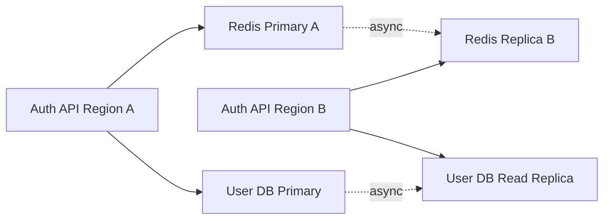
*Multi-region auth replication: user DB has async read replicas; Redis has cross-region async
replication for tokens. User creation is strong consistency (primary); token refresh reads from
local replica (eventual consistency acceptable).*

#### JWKS and Configuration Replication

- **JWKS endpoint**: serves public keys for JWT verification. Cached by clients and verifiers.
  During key rotation, new keys are published alongside old ones in a JWKS document.
- **Configuration**: auth policies, feature flags, MFA settings are stored in a strongly consistent
  store (etcd, Consul) so all auth nodes see the same configuration.
- **Cache TTL**: JWKS is cached for 5 minutes (short for security); config is cached for 60 seconds
  (longer to reduce etcd load).

#### Java Example: Cross-Region Token Store

```java
@Service
public class TokenStoreService {

    private final RedisClusterAsyncCommands<String, String> localRedis;
    @Value("${app.redis.replication-lag-tolerance-sec:5}")
    private int lagToleranceSec;

    // Store refresh token — replicated across Redis cluster
    public void storeRefreshToken(String userId, String tokenId, String tokenHash) {
        String key = "refresh:" + userId + ":" + tokenId;
        String value = Json.stringify(
            new RefreshTokenRecord(userId, Instant.now(), "ACTIVE")
        );
        localRedis.setex(key, Duration.ofDays(30), value);
    }

    // Look up token — local replica read, acceptable latency for auth
    public Optional<RefreshTokenRecord> lookupRefreshToken(String userId, String tokenId) {
        String key = "refresh:" + userId + ":" + tokenId;
        return Optional.ofNullable(localRedis.get(key))
            .map(RefreshTokenRecord::fromJson);
    }

    // Check replication lag — reject if lag exceeds tolerance
    public boolean isTooStaleForRevocation() {
        // Redis INFO replication or CLUSTER NODES shows lag
        return localRedis.info("replication")
            .contains("lag:" + lagToleranceSec);
    }
}
```

- **Q: Why is user database replication typically asynchronous?**
  **A:** Strong consistency across all regions would make writes slow and block auth during network
  partitions. Async replication lets users authenticate in their local region even if the primary
  region is unreachable — the trade-off is that a newly created user might not immediately exist in
  a read replica, which is acceptable for login flows.

---

### Failure Detection and Membership

Auth services must detect failed nodes and maintain membership in the cluster to avoid routing
traffic to unhealthy instances.

#### Health Check Types

- **Liveness probe** (`/health/live`): returns 200 if the process is running and can reach its
  dependencies (database, Redis). Kubernetes uses this to restart failed pods.
- **Readiness probe** (`/health/ready`): returns 200 only when the service is ready to serve traffic
  (JWKS cache populated, DB connection pool healthy). The load balancer stops routing to the pod
  while readiness fails.
- **Auth correctness probe** (`/health/auth`): verifies that the service can validate a test token
  — catches issues like broken signing keys or expired JWKS cache that liveness/readiness probes
  would miss.

#### Failure Detection Protocols

- **Heartbeat**: each auth node sends periodic heartbeats to a sidecar or load balancer. If
  heartbeats stop for N consecutive intervals (e.g., N=3 at 1-second intervals), the node is
  **removed from the load balancer pool**.
- **Gossip**: auth nodes exchange membership state with random peers (like Consul's Serf). Scales
  to thousands of nodes without a central registry. Information about node failures propagates
  via epidemic broadcast within seconds.
- **Phi accrual**: a more sophisticated detector that computes a suspicion level (phi) based on
  the history of heartbeat inter-arrival times. A node is declared failed when φ exceeds a
  threshold (typically 8). This adapts to network conditions unlike fixed-timeout heartbeats.

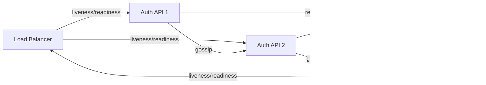
*Failure detection for auth cluster: load balancer health checks + gossip-based membership
via Consul/etcd. Each node sends heartbeats and gossips state to peers.*

#### Graceful Degradation on Failure

- If the **user database** is unreachable: allow token refresh (verify against Redis denylist) but
  reject new logins. Existing JWTs remain valid until expiry.
- If **Redis** is unreachable: allow new logins (user DB is source of truth) but warn that
  revocation may be delayed. Use short token TTLs to bound the risk window.
- If **KMS/HSM** is unreachable: use cached JWKS keys (with bounded TTL) for token verification.
  Key rotation pauses until connectivity is restored.

- **Q: How do you avoid flapping during transient network issues?**
  **A:** Use a hysteresis threshold — require N consecutive failed heartbeats before declaring a
  node down, and require M consecutive successful heartbeats before re-adding it. This prevents
  rapid flip-flopping that would cause connection failures for users.

---

### High Availability and Scalability

Auth systems are the most critical subsystem — when auth is down, everything is down.

#### High Availability Patterns

- **Active-Active Multi-Region**: auth services deployed in multiple regions; users routed to their
  nearest region via geo-DNS or anycast. Requires global user database (CockroachDB, Spanner) or
  multi-region replication with conflict resolution.
- **Active-Passive**: primary region serves all traffic; secondary is on standby. Failover takes
  seconds to minutes (DNS propagation or anycast convergence). Simpler but less resilient.
- **Stateless auth nodes**: session state stored in Redis or encoded in JWTs. Any node can serve
  any request without session stickiness. This is the most scalable pattern.

#### Scalability

- **Horizontal scaling**: add auth service instances behind a load balancer. Stateless design
  means no sticky sessions — any instance can handle any login or token refresh.
- **Rate limiting**: per-user and per-IP rate limits at the API gateway layer. Token bucket
  algorithm with Redis for distributed tracking. Per-IP: 100 login attempts/min. Per-user:
  10 login attempts/min.
- **Caching**: cache user lookups (user ID → credentials hash) and JWKS keys. Cache TTL of
  5-10 minutes for JWKS, 30 seconds for user lookups. Reduces database load during attacks.
- **Connection pooling**: HikariCP with pool size = 2 × CPU cores + 1 (I/O-bound heuristic).
  Monitor for connection exhaustion under load.

```mermaid
flowchart TB
    Client --> GeoDNS[Global DNS / Geo-Routing]
    GeoDNS -->|nearest| RegionA[N. Virginia Region]
    GeoDNS -->|nearest| RegionB[eu-west-1 Region]
    RegionA --> APIALB[API Load Balancer]
    RegionB --> APIBALB2[API Load Balancer]
    APIALB --> Auth1[Auth API 1]
    APIALB --> Auth2[Auth API 2]
    APIBALB2 --> Auth3[Auth API 3]
    APIBALB2 --> Auth4[Auth API 4]
    Auth1 --> RedisA[Redis Cluster A]
    Auth3 --> RedisB[Redis Cluster B]
    RedisA -.async. RedisB
    Auth1 --> DB[CockroachDB Multi-Region]
    Auth3 --> DB
```
*Active-active multi-region auth: geo-DNS routes users to nearest region, each region has
multiple stateless auth APIs, Redis clusters sync across regions, CockroachDB provides strong
consistency for user data.*

- **Q: Why are auth nodes designed to be stateless?**
  **A:** Stateless nodes can be added or removed without session draining. Any node can handle
  any request, so there are no hot spots. The cost is that session state must live in an external
  store (Redis), which becomes a scaling bottleneck — but Redis is easier to scale than
  application state.

---

### Performance and Optimization

Auth performance directly impacts user experience — slow logins and token verification create
friction in every downstream application.

#### Latency Optimization

- **Short-lived access tokens** (15 minutes) reduce verification cost: the token is self-contained
  (JWT) and verifiable without a database lookup. Revocation is handled by short TTL rather than
  a denylist, which avoids the O(N) check on every request.
- **JWKS caching**: public keys for JWT verification are cached for 5-10 minutes. On a cache miss,
  fetch from the JWKS endpoint and cache. This avoids KMS/HSM calls on every token verification.
- **Pre-computed password hashes**: Argon2 verification is intentionally slow. Cache the hash
  parameters for frequent users to reduce computation. During a credential-stuffing attack,
  rate-limit BEFORE performing the expensive hash check.
- **Connection pooling**: HikariCP pool size = 2 × CPU cores + 1 for I/O-bound auth workloads.
  Monitor for pool exhaustion. Use `SELECT 1` health checks on pooled connections.

#### Throughput Optimization

- **Horizontal scaling**: stateless auth nodes behind a load balancer. Add nodes linearly with load.
  Use consistent hashing on the load balancer to minimize cache misses during scaling events.
- **Redis pipelining**: when verifying multiple tokens in a single request (e.g., batch API),
  pipeline Redis lookups for denylist checks. This reduces round-trips from N to 1.
- **Token introspection batching**: instead of N individual database lookups, batch them into
  a single query using `WHERE token_id IN (...)`.
- **Async login path**: perform non-critical operations (audit logging, anomaly detection,
  metrics emission) asynchronously via `@Async` or an event queue. The critical path (password
  check → token issuance) should be as fast as possible.

#### Caching Strategy

| What to cache | TTL | Why |
|---|---|---|
| JWKS public keys | 5-10 min | avoid KMS/HSM calls on every verification |
| User credentials lookup | 30-60 sec | reduce DB load during login storms |
| Token denylist (revoked tokens) | token TTL | short enough that stale entries expire |
| Rate-limit counters | 60 sec | short TTL prevents memory growth in Redis |

#### Rate Limiting

- **Per-IP**: 100 login attempts per minute (token bucket with refill rate 100/min, burst capacity 200).
  Prevents credential-stuffing from a single source.
- **Per-user**: 10 login attempts per minute. Prevents brute-force on a specific account.
- **Global**: total login rate capped at X requests/second across all users. If exceeded, return 429.
- **Adaptive**: increase rate limits for users with good MFA signals (WebAuthn, known device).
  Decrease for users without MFA or from new locations.

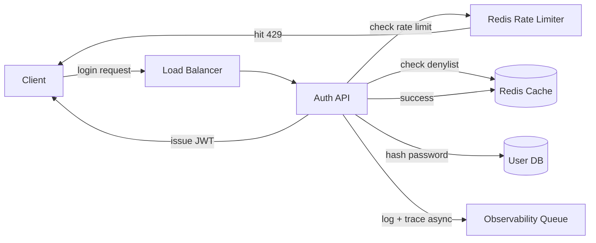
*Performance optimization flow: rate limiting short-circuits abusive requests before expensive
password hashing. JWT verification uses cached JWKS + Redis denylist. Non-critical logging is
async to keep the login path fast.*

- **Q: How do you handle login storms (e.g., after a marketing campaign goes viral)?**
  **A:** Pre-warm auth nodes (add capacity before the spike), cache user lookups aggressively,
  rate-limit per-IP to prevent abuse, and queue non-critical work (logging, metrics) asynchronously.
  The login path (password hash → JWT issue) should be under 200ms P95.

---

### CAP Theorem and Consistency Trade-offs

The CAP theorem states that during a network partition, a distributed system can guarantee at most
two of: Consistency (every read sees the latest write), Availability (every request succeeds),
or Partition tolerance (the system continues despite network failures). Partition tolerance is
mandatory for internet-scale auth systems, so the trade-off is always between C and A.

#### Applying CAP to Auth Systems

**User database — CP (Consistency + Partition tolerance):**
The user database must be strongly consistent. If a user registers in one region, an immediate
login in another region must succeed. Using AP here would allow a user to register twice (in two
regions) or fail to log in because the replica hasn't received the new user record.

**Real-life mapping:** CockroachDB, Spanner, or PostgreSQL with synchronous multi-region
replication provide strong consistency for auth user data.

**Token/Session store — AP (Availability + Partition tolerance):**
Refresh tokens and sessions can tolerate eventual consistency. If the primary Redis in one region
fails, the local replica in another region can still serve refreshes (with potentially stale
denylist data). This is acceptable because tokens have short TTLs.

**Real-life mapping:** Redis (async replication), DynamoDB (eventual consistency mode for sessions).

**JWKS (key distribution) — CP preferred but often AP with bounded risk:**
JWKS must be strongly consistent because a stale key could allow token forgery after a key
compromise. However, in practice, JWKS is cached with a short TTL (e.g., 5 minutes) — the risk
window is bounded by the cache TTL. During a key rotation, old and new keys are published
simultaneously in JWKS so verifiers always have the key they need.

#### Trade-offs in Practice

- **New user creation during partition:** With CP user store, creation fails in a partitioned
  region. This is the right trade-off — you don't want duplicate user accounts.
- **Token refresh during partition:** With AP session store, refresh succeeds using the local
  replica even if the primary is unreachable. The stale token is still valid (within TTL).
- **Key compromise during partition:** With CP JWKS, verifiers fail closed — they reject all
  tokens until the new keys propagate. This causes an availability hit but prevents forgery.
- **Logout / token revocation during partition:** With AP session store, revocation may be delayed.
  Using short token TTLs (15 min) bounds the window.

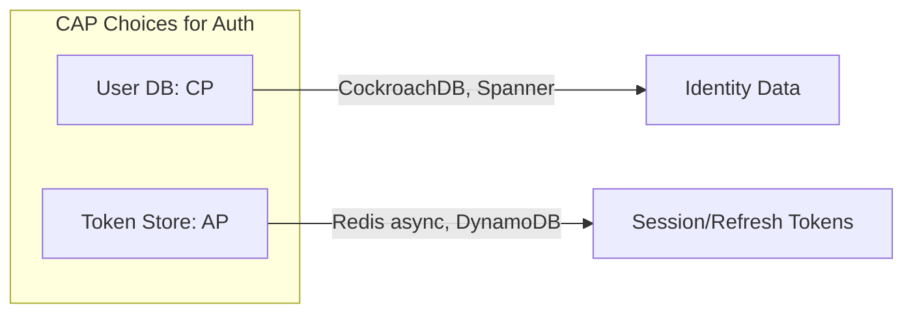
*Auth systems use CP for the user database (identity must be globally consistent) and AP for
token/session stores (short TTLs make eventual consistency acceptable).*

- **Q: Is an auth system CP or AP?**
  **A:** It depends on the component. The user database is CP — correctness is more important
  than availability for identity data. The token/session store is AP — existing sessions must
  continue working during a partition. JWKS is CP-with-cache — strong consistency with a short
   TTL cache that bounds the risk window.

---

### Authentication and Authorization

Authentication and authorization are separate but tightly coupled layers: authentication verifies *who* you are; authorization determines *what* you can do. The auth system issues verifiable credentials (tokens) after identity proof, then every service call validates that credential and checks permissions against a policy.

#### Authentication Model

- **Password-based**: User provides email/username + password. Password is hashed (Argon2id recommended, bcrypt/scrypt acceptable) and verified. MFA may be required.
- **OAuth 2.1 / OpenID Connect**: Delegated authentication via a third-party IdP (Google, Auth0, Okta). The application receives an ID token (authentication) and access token (authorization) via the authorization-code flow with PKCE.
- **WebAuthn / Passkeys**: Passwordless authentication using platform authenticators (Touch ID, Face ID, Windows Hello). The authenticator stores a private key; the server stores the public key. Resistant to phishing and credential stuffing.
- **Machine-to-machine**: Services authenticate with client credentials (OAuth 2.0 client credentials flow) or mTLS certificates.

#### Authorization Models

- **Role-Based Access Control (RBAC)**: Users are assigned roles (user, creator, moderator, admin); roles define permission sets. Simple but can lead to permission explosion as organizations grow. Example: `admin` role has `permission:user:delete`, `permission:video:moderate`.
- **Attribute-Based Access Control (ABAC)**: Access is decided by evaluating attributes (user attributes, resource attributes, action, environment) against rules. More flexible than RBAC but more complex. Example: `allow if user.department == resource.ownerDepartment && request.time < cutoff`.
- **OAuth 2.0 scopes**: Fine-grained permissions delegated to third-party applications. Scopes are embedded in the access token and checked by resource servers. Example: `read:videos`, `write:videos`, `moderate:comments`.
- **Relationship-based (ReBAC)**: Access is based on relationships between users and resources. Example: "Alice can edit Document X if Alice is a member of Team Y, and Team Y owns Document X." Used by Google Drive, Notion, and GitHub.
- **Hybrid**: Most systems combine models: RBAC for broad roles, ABAC for fine-grained rules, scopes for API-level delegation.

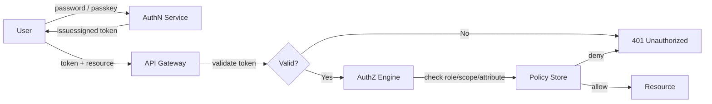

*Authentication and authorization flow: the user proves identity to the AuthN service (password, passkey, or OAuth), which issues a signed JWT; the API Gateway validates the token signature and expiry, then forwards to an AuthZ engine that checks roles, scopes, and attributes against a policy store before granting or denying access to the resource.*

#### Token-Based Authorization

- **Access tokens (JWT)**: Short-lived (15 min), stateless, self-contained. Verified by any service with the public signing key. Carries claims: `sub`, `aud`, `iss`, `exp`, `scope`, `roles`.
- **Refresh tokens**: Long-lived (7-30 days), stateful (stored in a database or Redis). Used to obtain new access tokens. Rotated on each use (rotation + reuse detection).
- **Opaque tokens**: Random strings validated by introspection against the token endpoint. Stateful but revocable immediately. Used where JWTs are too large or where immediate revocation is needed.
- **Bearer tokens**: Simple token-based auth where possession of the token grants access. Vulnerable to theft — must use TLS and short TTLs. Token binding (MTLS, DPoP) adds proof-of-possession.

#### Authorization Enforcement Points

- **API Gateway / Edge**: First line of defense. Validates JWT signatures (JWKS), checks expiry, enforces scopes. Rejects invalid tokens immediately (401).
- **Service-level**: Each service re-validates the token (defense in depth) and checks resource-specific permissions (RBAC/ABAC). The token's `roles` or `scope` claims are checked against the service's permission model.
- **Database-level**: Row-level security (RLS) in PostgreSQL ensures users only query their own data. Example: `CREATE POLICY tenant_isolation ON orders USING (tenant_id = current_setting('app.tenant_id'))`.
- **Application-level**: Fine-grained permission checks in business logic (e.g., "can this user edit this specific document?"). Implemented via ReBAC or custom permission queries.

```java
@Service
@RequiredArgsConstructor
public class AuthorizationService {

    @Value("${app.authz.default-deny:true}")
    private boolean defaultDeny;

    private final PolicyEngine policyEngine;
    private final PermissionRepository permissions;

    public boolean authorize(String userId, String resource, String action) {
        List<Permission> userPerms = permissions.findByUserId(userId);
        List<Permission> rolePerms = permissions.findByRoles(userId);
        Set<Permission> allPerms = new HashSet<>();
        allPerms.addAll(userPerms);
        allPerms.addAll(rolePerms);

        boolean allowed = policyEngine.evaluate(resource, action, allPerms);
        if (!allowed && defaultDeny) {
            AuditLogger.log(userId, resource, action, "DENIED");
        }
        return allowed;
    }
}
```

*The `AuthorizationService` bean evaluates permissions from both direct user grants and role-based grants using a `PolicyEngine`. The `defaultDeny` config (externalized via `@Value`) ensures a secure default-deny posture. Every authorization decision is logged via `AuditLogger` for compliance.*

#### Common Authorization Patterns

- **ACL (Access Control List)**: Per-resource permission lists. A resource has a set of permissions {user → role/permission}. Good for small-scale, user-managed sharing. Suffers from ACL bloat at scale.
- **Capability tokens**: Instead of checking a central ACL on each request, the authority to perform an action is delegated as a signed, unforgeable capability token. The resource server validates the token and grants access. Used in Macaroon and Biscuit tokens.
- **Session-based authorization**: The user's permissions are stored in the session (server-side). Each request checks the session's permission set. Simple but requires session affinity or distributed sessions.

#### OAuth 2.0 Scopes vs. RBAC Roles

| Dimension | OAuth 2.0 Scopes | RBAC Roles |
|---|---|---|
| Granularity | Low (per API) | Medium (per role) |
| Scope | API-level access | Application-level access |
| Management | IdP-managed | App-managed |
| Use case | Third-party app access | Internal user permissions |
| Revocation | Token expiry / revocation | Role change |
| Token size | Increases with scopes | Increases with roles |

Most systems use both: scopes control which APIs a token can access (enforced at the gateway); roles control what actions the user can perform within those APIs (enforced at the service).

---

### Security Threats and Mitigations

Auth systems are the primary attack target — they are the gateway to all other systems.

#### Threat Model

- **Threat agents**: external attackers, malicious insiders, compromised services, automated bots
- **Assets**: user credentials, active tokens, user PII, signing keys, configuration
- **Attack surface**: login endpoint, token endpoint, JWKS endpoint, admin console, user database,
  token store

#### Common Threats and Mitigations

| Threat | Description | Mitigation |
|---|---|---|
| Credential stuffing | attacker uses breached password lists against login endpoint | rate limiting per IP/user, CAPTCHA, password breach checks (HaveIBeenPwned API) |
| Brute force | attacker tries many passwords for a single account | account lockout/timeout after N failures, exponential backoff, MFA for repeated failures |
| Token theft | attacker steals JWT or refresh token from network or storage | HTTPS everywhere, short-lived access tokens (15 min), rotate refresh tokens on use, token binding |
| Session hijacking | attacker takes over an active session | short session TTL, session binding to IP/User-Agent fingerprint, re-auth for sensitive actions |
| MFA fatigue | attacker spams MFA push notifications until user approves | number-matching (user enters code shown on original device), MFA attempt rate limiting |
| OAuth abuse | attacker exploits overly broad scopes or authorization-code interception | PKCE, scope minimization, short-lived tokens, token revocation endpoint |
| Key compromise | signing key is leaked or stolen | short key TTL, automatic key rotation, HSM storage, `kid` header for key selection |
| Privilege escalation | user gains access beyond their role | RBAC/ABAC checks at every endpoint, least-privilege principle, audit logging |
| Token replay | attacker records and replays a valid token | token binding (DPoP or MTOS), short TTL, one-time-use refresh tokens |
| IDOR / enumeration | attacker guesses user IDs or enumerates valid users | UUIDs or opaque IDs (not sequential), generic error messages, rate limiting on lookup endpoints |

#### MFA Protocol Deep Dive

- **TOTP** (Time-based One-Time Password): uses HMAC-SHA1 with 30-second time steps and ±1 step
  window. Vulnerable to phishing (attacker can request the code after the user enters the password).
- **WebAuthn**: uses public-key credentials with attestation. The authenticator signs a challenge
  bound to the RP ID (origin), making phishing impossible. Passkeys sync via iCloud Keychain /
  Google Password Manager.
- **Push notification**: sends a push to a trusted device. Vulnerable to MFA fatigue (spamming
  pushes until user approves). Mitigate with number-matching and attempt rate limits.
- **SMS OTP**: least secure (SIM swap, SS7 interception). Only acceptable as a fallback, never
  as a primary MFA method for sensitive systems.

```mermaid
flowchart LR
    Attacker -->|1: steal password| Internet[Internet]
    Internet --> LB[Load Balancer]
    LB --> Auth[Auth Service]
    Auth -->|2: blocked (already logged in| DB[User DB]
    Auth -->|3: MFA required| User[User Device]
    User -->|4: approve login| Auth
    Auth -->|5: issue JWT| LB
    Detector[Anomaly Detector] -->|login from new location| Auth
    Detector -->|rate limit| Attacker
```
*Auth security flow: even after password theft, the attacker is blocked by MFA, anomaly
detection, and rate limiting. The defender's detection system monitors login patterns in real-time.*

---

### Observability and Logging

Auth systems must be fully observable — this is a security control, not just operational tooling.

#### Metrics

- **Authentication metrics**: login success ratio, login failure ratio by reason (wrong password,
  user not found, account locked, MFA failure), MFA enrollment rate, MFA success/failure rate.
- **Token metrics**: token issuance rate, token refresh rate, token validation rate, revocation
  rate, denylist hit rate.
- **Security metrics**: failed login rate per IP (anomaly detection), brute-force detection rate,
  MFA fatigue attempts, token theft indicators (concurrent sessions from distant locations),
  key rotation events.
- **Performance metrics**: P95/P99 login latency, token verification latency, database query
  latency, Redis lookup latency, JWKS fetch latency.

#### Logs

- **Audit log**: every auth event (login, logout, token refresh, revocation, MFA attempt) must be
  logged with timestamp, user ID, IP, user agent, outcome, and correlation ID. Audit logs are
  append-only and stored in WORM storage for compliance (SOC 2, HIPAA, GDPR).
- **Security event log**: suspicious activities (brute-force attempts, MFA fatigue, concurrent
  sessions, token reuse) are logged to a separate stream and forwarded to SIEM (Splunk, Datadog
  Security).
- **Debug log**: internal state (token generation, key selection, cache hits/misses). Must NEVER
  contain sensitive data (passwords, token values, PII).

#### Tracing

- Distributed tracing (OpenTelemetry) spans the full auth flow: client → load balancer → API
  gateway → auth service → database / Redis. Critical for debugging latency and failure patterns
  under load.
- Trace 401/403 bursts to identify attack patterns (e.g., one endpoint is being targeted).

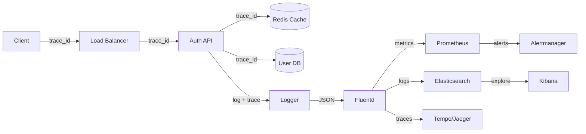
*Observability pipeline for auth: distributed tracing flows through each component, structured
logs are aggregated by Fluentd, metrics go to Prometheus + Alertmanager, traces to Jaeger, and
logs to Elasticsearch + Kibana.*

#### Alerting

- Alert on login success ratio < 95% for 5 minutes (service degradation).
- Alert on brute-force detection rate > 1000 attempts/min (attack in progress).
- Alert on JWKS fetch failures (key distribution issue).
- Alert on token verification latency P95 > 500ms (performance degradation).

---

### Real-World Implementations

Auth systems in production use various patterns and technologies:

#### Auth0
Fully managed IdP (Identity-as-a-Service). Supports OAuth 2.0, OpenID Connect, SAML, MFA, and
social logins. Custom rules ("Actions") for custom logic. Pricing: free tier up to 7k active users,
then $23/month per 1k.

#### Okta
Enterprise-grade IdP with adaptive MFA and risk-based authentication. Integration Network (OIN) for
7,000+ pre-built app integrations. API Access Management for OAuth 2.0 authorization.

#### Keycloak
Open-source Identity and Access Management. Supports OIDC, OAuth 2.0, SAML 2.0, LDAP. User
federation, identity brokering, admin console, and custom user storage providers. Deployed via
Docker, managed with Operator on Kubernetes.

#### Firebase Authentication
Mobile-first auth SDK with social, phone, and email/password auth. Integrates with Google Cloud
IAM and Firebase Security Rules. Client SDKs handle token refresh automatically.

#### AWS Cognito
Managed user pools and identity pools. Integrates with API Gateway, Lambda, and AWS IAM. Supports
OIDC, SAML, and social logins. Scales automatically with the application.

#### Spring Boot / Keycloak / Custom
Many enterprises run their own auth service using Spring Boot + Spring Security OAuth2 + Keycloak
for the IdP, or a fully custom JWT-based auth server with Argon2 password hashing and Redis for
token storage.

- **Q: When should you build your own auth system vs. using a managed service?**
  **A:** Use a managed service (Auth0, Okta, Cognito) when you need standard auth flows and want
  to focus on your product. Build your own when you need deep customization, regulatory control,
  or have a unique threat model. Building auth from scratch (login/password) is almost always a
  mistake — use a library (Spring Security, Devise, Passport.js) at minimum.

---

### Java and Spring Boot Implementation Guide

Spring Security 6 configuration — resource-server style JWT validation with algorithm pinning and JWKS fetching:

```java
@Configuration
@EnableWebSecurity
public class SecurityConfig {

    @Bean
    SecurityFilterChain filterChain(HttpSecurity http) throws Exception {
        http.csrf(AbstractHttpConfigurer::disable)
            .sessionManagement(s -> s.sessionCreationPolicy(SessionCreationPolicy.STATELESS))
            .authorizeHttpRequests(auth -> auth
                .requestMatchers("/public/**").permitAll()
                .requestMatchers("/admin/**").hasRole("ADMIN")
                .anyRequest().authenticated())
            .oauth2ResourceServer(o -> o.jwt(jwt -> jwt
                .decoder(jwtDecoder())
                .jwtAuthenticationConverter(new RolesClaimConverter())));
        return http.build();
    }

    JwtDecoder jwtDecoder() {
        return NimbusJwtDecoder.withJwkSetUri("https://idp.example.com/.well-known/jwks.json")
                .jwtProcessorCustomizer(p -> p.setJWSVerifierFactory(...)) // alg pinning via validator below
                .build();
    }
}
```

The `jwtProcessorCustomizer` ensures only `RS256` is accepted — the `alg:none` and key-confusion attacks exploit libraries that trust the token's declared algorithm. The `RolesClaimConverter` maps the `scope` or `roles` claim from the JWT into Spring `GrantedAuthority` objects.

**JPA entities for the credential data model:**

```java
@Entity
@Table(name = "users", indexes = @Index(name "uk_users_email", columnList = "email"))
public class User {
    @Id
    @GeneratedValue
    private UUID id;

    @Column(nullable = false, unique = true)
    private String email;

    @Column(name = "password_hash", nullable = false)
    private String passwordHash;

    @Column(name = "token_version")
    private int tokenVersion = 0;

    @Column(name = "mfa_enabled")
    private boolean mfaEnabled = false;

    @Version
    private Long version; // optimistic locking
}
```

```java
@Entity
@Table(name = "refresh_tokens")
public class RefreshToken {
    @Id
    @GeneratedValue
    private UUID id;

    @ManyToOne(fetch = FetchType.LAZY)
    @JoinColumn(name = "family_id", nullable = false)
    private SessionFamily family;

    @Column(name = "token_hash", nullable = false, unique = true)
    private String tokenHash;

    @Enumerated(EnumType.STRING)
    private TokenStatus status = TokenStatus.ACTIVE;

    @Column(name = "expires_at", nullable = false)
    private Instant expiresAt;

    @Version
    private Long version;
}
```

**Repositories:**

```java
public interface UserRepository extends JpaRepository<User, UUID> {
    Optional<User> findByEmail(String email);
}

public interface RefreshTokenRepository extends JpaRepository<RefreshToken, UUID> {
    Optional<RefreshToken> findByTokenHash(String tokenHash);
    void deleteByUserId(UUID userId); // for global logout
}
```

**DTOs as Java records:**

```java
public record LoginRequest(
    @NotBlank String email,
    @NotBlank String password,
    String totpCode
) {}

public record LoginResponse(
    String accessToken,
    String refreshToken,
    String tokenType,
    long expiresIn
) {}

public record SignupRequest(
    @NotBlank @Email String email,
    @NotBlank(message = "Password must be at least 12 characters")
    @Size(min = 12) String password,
    @NotBlank String name
) {}
```

**Service layer with configuration injection and rate limiting:**

```java
@Service
@RequiredArgsConstructor
public class LoginService {

    private final UserRepository users;
    private final TokenService tokens;
    private final LoginAttemptService attempts;
    private final Argon2PasswordHasher passwordHasher;
    private final MfaService mfaService;
    private final AuditEventPublisher audit;

    @Value("${auth.argon2.memory-kb:65536}")
    private int argonMemoryKb;

    @Value("${auth.login.max-attempts:5}")
    private int maxAttempts;

    @Transactional
    public LoginResponse login(String email, String rawPassword, String totpCode) {
        attempts.checkBlocked(email);
        User user = users.findByEmail(email)
                .orElseThrow(() -> new BadCredentialsException("invalid"));
        
        if (!passwordHasher.verify(rawPassword, user.getPasswordHash(), argonMemoryKb)) {
            attempts.recordFailure(email);
            audit.publish(AuditEvent.loginFailed(email, "bad_password"));
            throw new BadCredentialsException("invalid");
        }
        
        if (user.isMfaEnabled()) {
            mfaService.verify(user, totpCode); // throws on bad code
        }
        
        attempts.reset(email);
        audit.publish(AuditEvent.loginSuccess(user.getId(), email));
        return tokens.issuePair(user); // access JWT + rotating refresh family
    }

    @Transactional
    public LoginResponse signup(SignupRequest req) {
        if (users.findByEmail(req.email()).isPresent()) {
            throw new DuplicateEmailException(req.email());
        }
        User user = new User();
        user.setEmail(req.email());
        user.setPasswordHash(passwordHasher.hash(req.password()));
        user.setName(req.name());
        // Screen against breached-password APIs here
        users.save(user);
        audit.publish(AuditEvent.accountCreated(user.getId(), req.email()));
        return tokens.issuePair(user);
    }
}
```

**Controller with validation and exception handling:**

```java
@RestController
@RequestMapping("/auth")
@RequiredArgsConstructor
public class AuthController {

    private final LoginService loginService;

    @PostMapping("/login")
    public ResponseEntity<LoginResponse> login(@Valid @RequestBody LoginRequest req) {
        return ResponseEntity.ok(loginService.login(req.email(), req.password(), req.totpCode()));
    }

    @PostMapping("/signup")
    public ResponseEntity<LoginResponse> signup(@Valid @RequestBody SignupRequest req) {
        return ResponseEntity.ok(loginService.signup(req));
    }

    @PostMapping("/refresh")
    public ResponseEntity<LoginResponse> refresh(@CookieValue("refresh_token") String refreshToken) {
        return ResponseEntity.ok(loginService.refresh(refreshToken));
    }

    @ExceptionHandler(BadCredentialsException.class)
    ResponseEntity<Map<String, String>> badCredentials() {
        // deliberately vague — no user enumeration
        return ResponseEntity.status(HttpStatus.UNAUTHORIZED)
                .body(Map.of("error", "invalid_credentials"));
    }

    @ExceptionHandler(DuplicateEmailException.class)
    ResponseEntity<Map<String, String>> duplicateEmail(DuplicateEmailException ex) {
        return ResponseEntity.status(HttpStatus.CONFLICT)
                .body(Map.of("error", "email_already_registered"));
    }
}
```

**Token service with rotation and reuse detection:**

```java
@Service
@RequiredArgsConstructor
public class TokenService {

    private final UserRepository users;
    private final RefreshTokenRepository refreshTokenRepo;
    private final JwtEncoder jwtEncoder;

    @Value("${app.jwt.access-ttl-minutes:15}")
    private int accessTtlMinutes;

    @Value("${app.jwt.refresh-ttl-days:7}")
    private int refreshTtlDays;

    @Transactional
    public LoginResponse issuePair(User user) {
        String accessToken = jwtEncoder.encode(
                JwtEncoderParameters.from(JwtEncodingContext.of(
                        user.getId().toString(),
                        Set.of("openid", "profile", "email"),
                        Duration.ofMinutes(accessTtlMinutes))))
                .getTokenValue();

        String refreshToken = generateSecureToken();
        RefreshToken token = new RefreshToken();
        token.setFamily(user.getSessionFamily());
        token.setTokenHash(hashToken(refreshToken));
        token.setExpiresAt(Instant.now().plusSeconds(refreshTtlDays * 86400L));
        refreshTokenRepo.save(token);

        audit.publish(AuditEvent.tokenIssued(user.getId()));
        return new LoginResponse(accessToken, refreshToken, "Bearer", 
                Duration.ofMinutes(accessTtlMinutes).getSeconds());
    }

    @Transactional
    public LoginResponse rotate(String refreshToken) {
        String hash = hashToken(refreshToken);
        RefreshToken token = refreshTokenRepo.findByTokenHash(hash)
                .orElseThrow(() -> new InvalidTokenException("invalid_refresh_token"));

        if (token.isExpired()) {
            token.setStatus(TokenStatus.EXPIRED);
            // Mark family as compromised — theft detection
            token.getFamily().setStatus(FamilyStatus.COMPROMISED);
            throw new InvalidTokenException("refresh_token_expired");
        }

        if (token.getStatus() == TokenStatus.CONSUMED) {
            // Re-use detected — kill the whole family
            token.getFamily().setStatus(FamilyStatus.COMPROMISED);
            audit.publish(AuditEvent.refreshTokenReused(token.getFamily().getId()));
            throw new TokenCompromisedException("token_family_revoked");
        }

        token.setStatus(TokenStatus.CONSUMED);
        refreshTokenRepo.save(token);

        // Issue new pair
        return issuePair(token.getFamily().getUser());
    }

    private String hashToken(String token) {
        return DigestUtils.sha256Hex(token);
    }
}
```

**Testing pattern:** Testcontainers spins Postgres + Redis; integration test asserts (1) wrong password increments attempt counter and locks after threshold, (2) reused refresh token kills the whole family, (3) tampered JWT signature yields 401 without stack-trace leakage.

```java
@SpringBootTest
@Testcontainers
class LoginServiceTest {

    @Container
    static PostgreSQLContainer<?> db = new PostgreSQLContainer<>("postgres:16");
    @Container
    static RedisContainer redis = new RedisContainer("redis:7-alpine");

    @Autowired LoginService loginService;
    @Autowired UserRepository users;
    @MockBean RiskEngine riskEngine;

    @Test
    void shouldLockAccountAfterMaxFailedAttempts() {
        // Given
        User user = createUser("test@example.com");
        // When — attempt max+1 logins with wrong password
        for (int i = 0; i < maxAttempts; i++) {
            assertThrows(BadCredentialsException.class,
                () -> loginService.login("test@example.com", "wrong", null));
        }
        // Then — account is locked
        var ex = assertThrows(AccountLockedException.class,
            () -> loginService.login("test@example.com", "wrong", null));
    }

    @Test
    void shouldRevokeRefreshTokenFamilyOnReuse() {
        // Given
        User user = createUser("test@example.com");
        String refreshToken = loginService.login("test@example.com", "pass", "123456").refreshToken();
        // Use the token once
        loginService.refresh(refreshToken); // rotates — old token now CONSUMED
        // When — reuse the old token
        assertThrows(TokenCompromisedException.class,
            () -> loginService.refresh(refreshToken));
        // Then — all tokens in the family are revoked
    }
}
```

---

### Interview Questions and Answers

**Beginner**

1. **Session vs JWT — core difference?**
   Sessions keep state server-side (cookie = pointer); JWTs carry state cryptographically signed (cookie/header = the data itself). Consequences: revocation easy vs hard, per-request lookup vs local verification.

2. **Why salted slow hashes for passwords?**
   Salt defeats precomputation/rainbow tables; slowness (Argon2/bcrypt) makes brute-force economically unviable even after a DB leak.

3. **What is the difference between authentication and authorization?**
   Authentication verifies *who you are*; authorization determines *what you can do*. Authn comes first (prove identity), then authz (check permissions). They are separate concerns — a user can be authenticated but not authorized for a specific resource.

4. **Explain how a JWT works and its three parts.**
   A JWT has three base64url-encoded parts: header (algorithm, key ID), payload (claims like `sub`, `exp`, `iss`, `aud`), and signature (HMAC or RSA signature of the first two parts). The signature ensures integrity — any tampering invalidates the token.

**Intermediate**

5. **How would you implement "logout from all devices"?**
   Options: bump `token_version` claim source so outstanding access tokens fail validation; delete all session families in Redis; denylist by user. Discuss trade-offs: version-bump needs verifiers to check a tiny DB/cache — reintroduces a lookup, so many teams accept short access TTLs and only revoke refresh families immediately.

6. **Explain the OAuth authorization-code flow and why PKCE exists.**
   Walk the sequence diagram above; PKCE binds the token exchange to the client that started the flow via a proof-of-possession secret, neutralizing code-interception on mobile/deep-link redirects.

7. **Where do you store tokens in an SPA and why?**
   Prefer HttpOnly SameSite cookies via a BFF so XSS cannot read them; if tokens must be in JS (rare), accept documented risk, minimize TTL, add CSP. Interviewers probe the XSS-vs-CSRF trade-off here.

8. **How do you handle key rotation without downtime?**
   During rotation, the IdP publishes both old and new keys (each with a `kid`). New tokens are signed with the new key. Verifiers try the `kid` to find the matching key — both old and new tokens verify successfully during the overlap window. After max token TTL, the old key is retired.

9. **What are common JWT security pitfalls?**
   Accepting any `alg` (confusion attack), storing too much data in the payload (bloat, stale data), long expiry times, using HS256 with a shared secret across services (anyone who can verify can forge), not validating `iss`/`aud`/`exp`, storing JWTs in localStorage (XSS exposure).

**Advanced**

10. **Design auth for 100M DAU mobile app with instant revocation on fraud detection.**
    Hybrid: stateless JWT verification at edge for throughput + Redis denylist consulted only on sensitive ops + push-based kill switch via pub/sub to gateways; refresh-family compromise detection for automated response. Discuss numbers: 15-min access TTL caps exposure; fraud events trigger family kill within seconds.

11. **Your IdP region failed; users with valid tokens still work but nobody can log in. Explain and improve.**
    Statelessness did its job (verification is local). Improvements: multi-region active-active IdP, cached-JWT grace windows at verifiers, regional refresh-token replication with conflict-free rotation (or pinned-home regions), runbooks for degraded login mode.

12. **How would you store and rotate encryption keys for sensitive data like MFA secrets?**
    Use a KMS (AWS KMS, Google Cloud KMS) or HashiCorp Vault. MFA secrets are encrypted at rest with a data key that is itself wrapped by the KMS master key. Rotate data keys automatically (AWS offers automatic rotation); for manual rotation, use a dual-key approach where new and old keys are both active during a transition window.

**Senior / system design**

13. **Architect SSO across 12 internal products plus 3rd-party developer API access.**
    Central OIDC IdP; products as RPs sharing session via domain cookie or silent-refresh; developer console issuing OAuth clients with scopes; token exchange for internal service hops; audit spine common to all. Emphasize protocol boundaries, key governance, and tenant-level federation for acquired companies.

14. **Walk through a credential-stuffing attack end-to-end and every control that blunts it.**
    Attack: leaked combo lists sprayed at login. Controls layered: velocity/anomaly detection, breached-password blocking at registration, Argon2 cost (limits offline side), CAPTCHA escalation, device fingerprinting, breached-alert monitoring, mandatory MFA for risky logins, rate limits per IP+account+ASN. Expected depth: knowing attackers distribute sources, so pure IP limiting fails.

15. **How would you design a fraud detection pipeline for auth events?**
    Stream auth events to Kafka; run real-time detection rules (velocity, impossible travel, device anomalies) using a stream processor (Flink/ksqlDB); store results in Redis for fast lookup; trigger alerts for high-risk scenarios; use ML models for behavioral anomaly detection; maintain feature stores for training data; design the system to handle 100K+ events/sec with <100ms detection latency.

**Follow-up questions an interviewer may ask:**

- *What if the attacker has access to your entire database?* → Defense: per-password salts + slow hash means offline cracking is economically infeasible; still force password reset for affected users.
- *How do you handle MFA recovery?* → Backup codes (16 one-time codes), secondary email, or trusted device flow. Each recovery action is logged and requires step-up verification.
- *What happens during a JWKS endpoint outage?* → Verifiers cache keys with a configurable max-age; previously seen keys continue to verify. New tokens issued during the outage can't be verified until the endpoint recovers.
- *How do you prevent token replay?* → Short TTLs, token binding (DPoP/MTLS), nonce tracking for high-value operations.

**Common interview mistakes:**

- Storing JWTs in localStorage "because cookies are legacy" — hands tokens to any XSS.
- Accepting whatever `alg` the token declares (classic confusion attack) — pin allowlists.
- Long-lived access tokens with no rotation story.
- Revealing "user exists" vs "wrong password" differences (enumeration oracle).
- Forgetting `aud`/`iss` checks — tokens valid across unrelated environments (staging token works in prod).

**Expected discussion points:**

Revocation trade-off spectrum, key-rotation choreography, why identity is a buy-before-build component, phishing resistance trajectory toward passkeys, and how compliance regimes shape session policies.

---

## Real-World Examples

- **Google/Microsoft SSO** — planet-scale IdPs publishing OIDC; billions rely on their JWKS endpoints; passkeys pushed at consumer scale.
- **Auth0/Okta & Keycloak** — the commercial and open-source archetypes of everything above (rotation, MFA, federation, SCIM).
- **AWS IAM roles + STS** — machine-side auth at cloud scale: temporary credentials constantly issued/rotated instead of static keys; conceptually identical to short-TTL tokens.
- **GitHub** — PATs, OAuth apps, WebAuthn rollout showing pragmatic migration of a huge legacy credential estate.
- **Stripe** — uses JWT-based access tokens with short TTL and rotating refresh tokens; supports OAuth for platform users (Connect); implements step-up authentication for sensitive operations like creating new API keys.
- **Netflix** — uses client credentials flow for service-to-service authentication, with short-lived tokens and automatic rotation; handles 100M+ daily active users across global regions.

