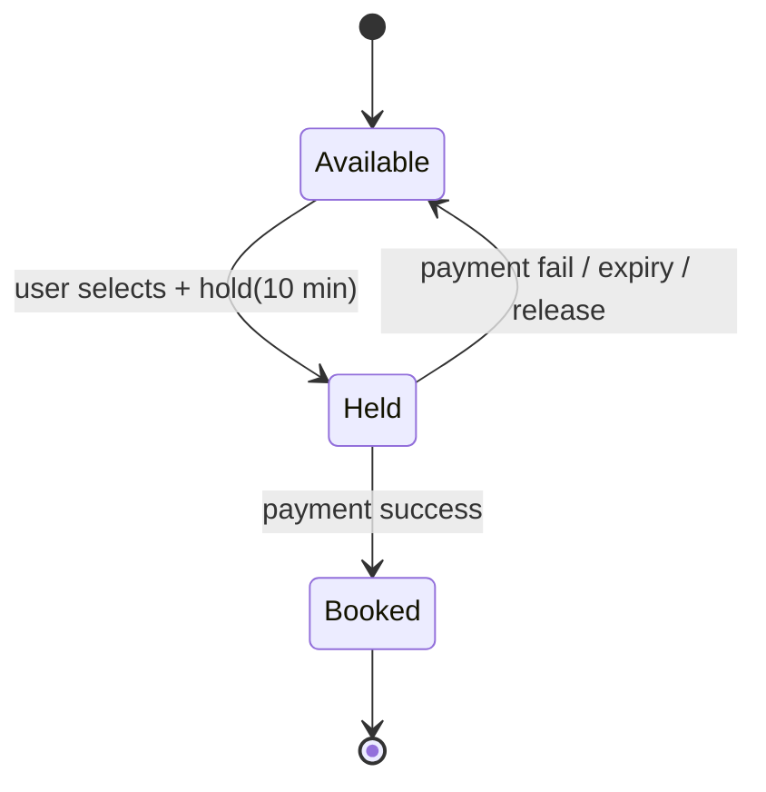
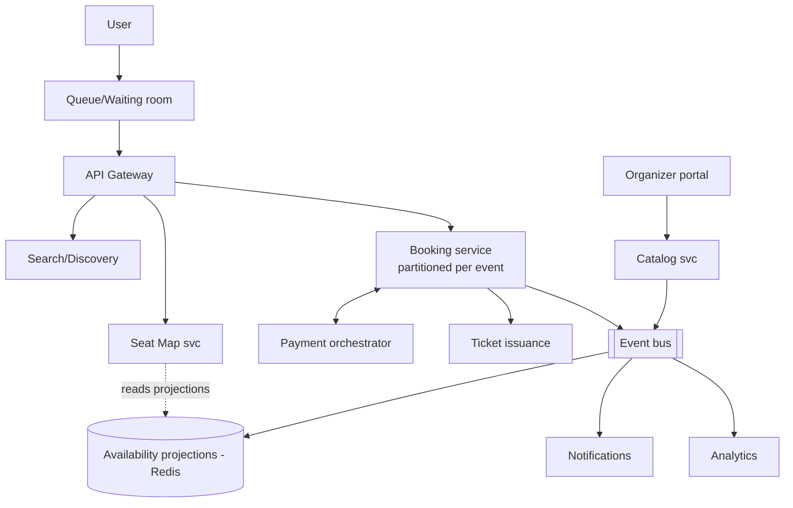
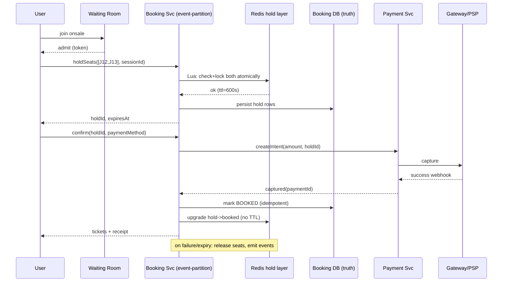
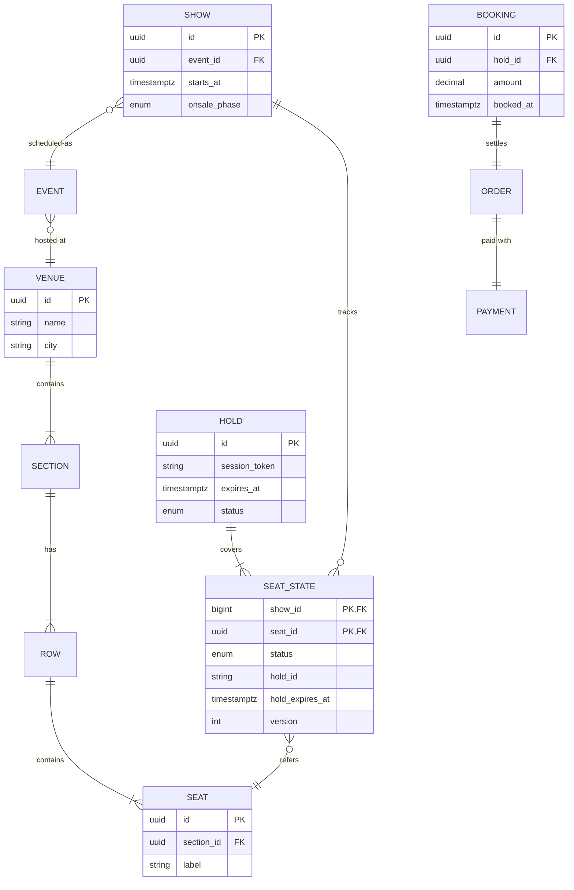

# Design Ticket master

## Blogs and websites

## Medium

## Youtube

- [BOOKMYSHOW System Design, FANDANGO System Design | Software architecture for online ticket booking](https://www.youtube.com/watch?v=lBAwJgoO3Ek)


- [11: Design TicketMaster/StubHub | Systems Design Interview Questions With Ex-Google SWE](https://www.youtube.com/watch?v=sMgxHf9AU_U)
- [System Design Interview: Design Ticketmaster w/ a Ex-Meta Staff Engineer](https://www.youtube.com/watch?v=fhdPyoO6aXI)

---

## Theory

A ticket-booking platform (BookMyShow, Ticketmaster, Fandango) sells **scarce, perishable inventory** — specific seats for specific showtimes — to a massive burst of concurrent demand the moment sales open. The defining engineering property: thousands of users want seat S12 in row J at the same second, and exactly one may win it. Everything in the design flows from that contention plus the fairness/perception requirements (nobody wants to pay for a crash, and regulators watch this industry).

### Important Subtopics

1. Requirements & scale (booking bursts, seat-level granularity)
2. Seat map modeling (venues, sections, rows, seats, hold states)
3. The reservation/hold lifecycle (soft lock → payment → confirm)
4. Contention control: optimistic vs pessimistic locking per seat
5. Queue/waiting-room systems for onsale events
6. Payment timeout handling and hold expiry
7. Inventory publication pipeline (events → onsale scheduling)
8. Anti-bot and scalping measures
9. Secondary market/transfers (Ticketmaster-specific)
10. Pricing strategies: fixed, tiered, dynamic
11. Search & discovery for events
12. Consistency model: why seat booking must be strictly serialized per seat

### Requirements

**Functional**: search events/cinemas/concerts; view seat maps; select seats; temporary hold; pay; issue tickets (QR/barcode); cancel/refund per policy; organizer tools (create venue/event/shows); transfer/resale.

**Non-functional**: correctness above all (never double-sell a seat), fairness during onsale bursts, p95 < 300 ms browsing / < 1 s seat-map interactions, availability ≥ 99.95% during sale windows, audit trail for disputes.

**Scale**: a stadium onsale = ~80K seats; 500K–1M users may hit simultaneously. Average day is modest (~1K bookings/min) — but capacity must be built for the burst, not the average.

### Why This Problem Is Special

Unlike generic e-commerce stock ("10 units left"), tickets are:

- **Positional**: seat J12 ≠ seat J13 even at equal price — users fight over *specific* units.
- **Perishable**: worthless at showtime; no restock.
- **Emotionally charged**: a crashed checkout becomes news; oversold shows become lawsuits.

So the core mechanism is a **distributed mutual exclusion with human timescales** (holds last minutes while users enter card details), not millisecond TTL locks.

### The Hold Lifecycle



Key rules: holds carry an absolute expiry; only the holder can confirm; expiry sweeps return seats to `Available` atomically; every transition emits an event (analytics, receipts, seat-map refresh broadcasts).

### Concurrency Control Options

| Approach | Mechanism | Fit |
|---|---|---|
| Pessimistic row lock | `SELECT ... FOR UPDATE` on seat row | Simple, correct; lock held through payment = unacceptable |
| Optimistic version check | Update succeeds only if `version` unchanged | Great for short transactions (the hold itself), retry storms under extreme contention |
| Partition-owner serialization | All commands for one event routed through one shard/actor | Predictable ordering; the scale-out answer |
| Redis atomic ops / Lua | `SET seat:J12 ownerId NX PX ttl` | Fast soft locks; pair with durable DB truth |

Production designs combine them: **Redis for the fast soft-hold layer, relational DB as source of truth, partitioned by event so all seat operations for one show serialize naturally**.

### Waiting Rooms (Onsale Bursts)

When 800K users arrive at 10:00:00 for 80K seats:

1. Edge admits users into a virtual queue (token + position).
2. Users are released into the actual booking flow at controlled rate matching system capacity × expected conversion.
3. Everyone else sees honest position updates — perception management is a feature.
4. Queue itself must be fair (FIFO-ish), bot-resistant, and horizontally scalable (this is its own distributed-system problem — think Cloudflare Waiting Room).

### Payments & Timeout Interplay

The hold window exists because payment takes time. On success → confirm booking idempotently. On failure/timeout → release seats immediately (someone else buys them). Edge case — payment succeeded but confirm raced with expiry: reconcile by treating captured funds as authoritative → auto-confirm or instant refund; never leave money taken without a ticket.

---

## Characteristics

- **Seat-level mutual exclusion**: the fundamental invariant — at most one active hold or booking per seat at any instant.
- **Burst-dominated traffic profile**: 99% of annual load arrives in minutes around popular onsals; architecture optimizes for the spike.
- **Human-timescale locks**: holds of 5–15 minutes dwarf typical infra TTL thinking; requires explicit expiry machinery, not just timeouts.
- **Strict consistency on a narrow hot path**: seat state transitions serialized; everything else (search, recommendations, content) eventual.
- **Fairness as requirement**: queue order should determine who gets first pick, not network luck.
- **Perishable inventory economics**: unsold inventory has zero residual value → drives dynamic pricing and last-minute discounts.
- **High-assurance payments**: refunds, chargebacks, and regulatory obligations demand complete auditability.

---

## Components

- **Event/Catalog service**
  *Purpose*: venues, events, showtimes, seating layouts. *Responsibilities*: CRUD by organizers, seat-map schema storage (sections/rows/capacity), onsale scheduling, publishing "event created" events downstream. *Example*: organizer portal creating a stadium map with 6 sections × 30 rows × 24 seats.

- **Discovery/Search service**
  *Purpose*: find events by city/date/genre. *Responsibilities*: geospatial + text search over catalog read models, personalized ranking. *Example*: Elasticsearch index refreshed via CDC from catalog.

- **Seat Map Service**
  *Purpose*: render live seat availability. *Responsibilities*: serve section-level heatmaps cheaply (cached aggregates), stream deltas via WebSocket/SSE when seats change during high contention, resolve individual-seat queries. *Relationship*: reads from booking/inventory projections, not the transactional store directly. *Example*: BookMyShow's color-coded cinema layout updating in real time.

- **Booking/Hold service**
  *Purpose*: own the seat-state machine. *Responsibilities*: acquire/release holds, enforce per-seat exclusivity, TTL sweeps, idempotent confirmation, emit transitions. *Relationship*: the serialization point; talks to payments via saga. *Example*: partition-per-event actor holding seats in memory with WAL-backed durability.

- **Ordering/Payment orchestration**
  *Purpose*: take money safely within the hold window. *Responsibilities*: PSP integration, retries, webhook verification, refund initiation on failures. *See* payment-gateway topic for PSP internals.

- **Ticket issuance service**
  *Purpose*: generate unique verifiable tickets (signed QR codes). *Responsibilities*: anti-counterfeit signing (per-ticket HMAC/Ed25519), PDF/pass delivery, offline-verifiable scanner apps syncing revocation lists. *Example*: rotating QR tokens that change periodically to block screenshot resale.

- **Queue/Admission service**
  *Purpose*: onsale fairness at the edge. *Responsibilities*: token issuance, position tracking, controlled release pacing, bot filtering. *Example*: Cloudflare Waiting Room semantics.

- **Anti-fraud/bot service**
  *Purpose*: keep inventory for humans. *Responsibilities*: device fingerprinting, purchase velocity limits per identity/payment instrument, known-reseller-network detection. 

- **Notification service**
  *Purpose*: confirmations, reminders, cancellation notices (email/push/SMS).



---

## Patterns

- **Partition-per-aggregate (event-sharded actors)**
  *Problem*: serializing seat ops across a cluster without global locks. *How*: hash(eventId) routes all seat commands to one owner instance (or shard leader); inside, single-threaded command processing gives natural mutual exclusion. *When*: strong per-entity ordering needed at scale. *Pros*: simple reasoning, no distributed locks. *Cons*: hot events need vertical headroom or intra-partition sharding by section.

- **Soft-hold with TTL + sweeper**
  *Problem*: users abandon carts mid-payment. *How*: hold entries with absolute expiry; background sweeper (or lazy expiry-on-access) releases seats; idempotency prevents double-release races. *Real-world*: universal across ticketing.

- **Saga for book-and-pay**
  *Steps*: hold → create-order → capture payment → confirm booking; compensations: release hold, refund capture. Orchestrated (not choreographed) because the flow is linear and auditability matters.

- **Optimistic UI + server truth**: clients render optimistic seat selections but every action validated server-side; conflicts surface as "seat just got taken" UX moments.

- **CQRS for availability views**: transactional booking writes produce events consumed into denormalized per-section availability counters — seat-map reads never touch the booking DB.

- **Rate limiting + admission control at edge**: protects the whole chain during drops; combine global waiting room with per-user action quotas.

---

## Benefits

- **Guaranteed uniqueness of sale** — the entire value proposition; a correct design eliminates double-sell incidents and their legal fallout.
- **Graceful behavior at extreme bursts** — queues convert crashes into controlled delays, protecting conversion and brand.
- **Operational insight from event spine** — every state change auditable, replayable for dispute resolution.
- **Independent scaling of discovery vs booking** — cheap horizontal scaling where load actually varies.
- **Extensible commerce** — dynamic pricing, resale, add-ons (parking, merch) plug into the same event backbone.

---

## Pros

- Clear bounded contexts map cleanly to teams (catalog, booking, payments).
- Redis+DB hybrid achieves both millisecond UX and durable correctness.
- WebSocket-driven seat maps give real-time feel without hammering APIs.
- Saga-based payment flow isolates PSP flakiness from seat logic.

## Cons

- Hot-event partitions can bottleneck (one mega-event saturates its owner node) — needs careful capacity pre-warming or section-splitting complexity.
- Multi-component consistency (Redis layer vs DB truth) demands disciplined invalidation; bugs manifest as phantom-available seats.
- Waiting rooms degrade UX for legitimate users by design — tuning release rates is more art than science.
- Resale/anti-bot arms race consumes continuous investment.
- Refund/chargeback flows across PSPs remain operationally painful regardless of internal design.

---

## Challenges

- **Technical**: atomic multi-seat selection (user picks 4 adjacent seats — all-or-nothing hold); expiry-vs-payment races; clock skew in TTL enforcement across nodes.
- **Scalability**: onsale spikes 1000× baseline; seat-map websocket fanout for 100K concurrent viewers of one stadium.
- **Performance**: sub-second seat-map loads despite millions of seat-state rows — solved with section-level aggregates + delta streaming, never full reloads.
- **Reliability**: zero tolerance for oversell; DR for in-flight holds (WAL/replicated partition state); PSP outages mid-onsale (queue payments, extend holds).
- **Maintainability**: venue-map schema evolution (new seat types, accessible seating, obstructed-view flags).
- **Operational**: onsale-day war rooms; rehearsed runbooks for queue misconfiguration.
- **Security/fairness**: bots buying instantly then reselling — fingerprinting, identity verification tiers, purchase limits, rotating QR tickets to kill screenshot fraud.

---

## Best Practices

- **Serialize per event (or per section for mega-events)** — contention lives within one show; don't pay cross-event coordination costs.
- **Treat payment webhooks as the only truth for capture**, verify signatures, and process idempotently.
- **Make hold expiry deterministic and observable** — log every release with reason (expiry/failure/user), alert on sweep lag.
- **Pre-warm and pre-scale before scheduled onsals** — publish capacity plans tied to the event calendar, not autoscaler reaction.
- **Design the "seat stolen" UX deliberately** — fast feedback, equivalent-seat suggestions, hold extension grace; abandoned users cost revenue too.
- **Keep an append-only ledger of every seat transition** — support disputes, audits, and postmortems come free.
- **Load-test with realistic seat-pick patterns** (adjacent groups dominate) rather than uniform random.
- **Sign tickets cryptographically and rotate QR secrets** — screenshot resale becomes detectably stale.

---

## When to Use / Not Use

This architecture (queues, event-partitioned booking, sagas) fits **high-demand reserved-seating platforms**. Simplify when:

- General-admission events (count-based inventory like any e-commerce cart).
- Low-demand cinemas — plain DB transactions with row locks suffice at small scale.
- Internal corporate tools — skip the waiting room entirely.

Decision factors: expected peak concurrency per event, positional vs count inventory, regulatory exposure, resale market importance.

Alternatives: managed ticketing SDKs, or general e-commerce frameworks adapted with seat-level inventory for smaller operators.

---

## Use Cases

- **Stadium concert onsale (Ticketmaster-style)**
  *Problem*: 1M fans, 80K seats, 10:00 drop. *Solution*: waiting-room admission → paced release → partition-per-event booking → verified fan presales to pre-filter bots. *Trade-off*: verified-fan registration adds friction but shifts the fight from bots to humans, improving fairness optics.

- **Cinema chain daily bookings (BookMyShow-style)**
  *Problem*: thousands of shows/day, moderate per-show contention, food add-ons, UPI-heavy payments. *Solution*: standard booking saga with regional caches; seat maps cached aggressively since most seats stay empty till near-showtime. *Trade-off*: simpler infra than onsale mode; focus spend on payment reliability.

- **Last-minute discounting**
  *Problem*: perishable inventory approaching zero value. *Solution*: time-tiered pricing engine reading days-to-show + sell-through curves; flash-sale windows reusing onsale machinery at small scale. *Trade-off*: cannibalization risk vs incremental revenue.

---

## High-Level Design

Booking sequence with compensation path:



Failure handling: PSP timeout → keep hold until definitive outcome arrives (webhook or reconciliation job); booking-service crash → partition fails over with WAL replay; Redis loss → rebuild holds from DB rows (DB is truth; Redis accelerates).

Scaling strategy: booking partitions scaled per forecast (mega-events get dedicated cells), seat-map projection cluster scales with viewership, queue infrastructure scales independently at the edge.

---

## Deep Dive

- **Atomic multi-seat holds**: the Lua script checks all requested seats are free and sets them in one atomic execution — no partial holds that strand users mid-selection. Fallback pattern for very large groups: two-phase (lock section briefly → evaluate adjacency → commit/reject).
- **Expiry mechanics**: prefer lazy expiry (checked on access/confirm) plus a low-frequency sweeper for display accuracy; both paths use compare-and-set so a confirm racing an expire resolves to exactly one winner deterministically.
- **Payment-confirmation race**: define total order — `confirm` executes only if hold status is HELD and now() < expires_at OR payment already captured (grace rule). Every branch idempotent; ledger records which branch won for support.
- **WebSocket fanout**: seat changes published per event topic; edge servers maintain subscriber lists per stadium; deltas throttled/coalesced (max N msgs/sec/viewer) — full refresh only on reconnect.
- **Observability**: funnel metrics (admitted→seated→held→paid), per-event hold-contention histograms, sweep-lag alerts, PSP latency burn rates; replay tooling to reconstruct any booking decision after the fact.

---

## Data Modeling



Key choices: composite PK `(show_id, seat_id)` makes the uniqueness constraint trivial (`status` transitions guarded by `version` optimistic check or upsert-with-where); `hold_expires_at` indexed for sweepers; append-only `SEAT_LEDGER` mirrors transitions for audit. Sharding: by `show_id`; mega-events optionally by `(show_id, section_id)`. Retention: shows archived post-performance; ledgers retained per financial regulation.

---

## Java and Spring Boot Implementation

Hold acquisition with atomic multi-seat semantics (Redis + Lua via Spring Data Redis):

```java
@Service
public class SeatHoldService {

    private static final String REDIS_HOST_PREFIX = "show:";

    private final StringRedisTemplate redis;
    private final SeatStateRepository seatStates;

    public SeatHoldService(StringRedisTemplate redis, SeatStateRepository seatStates) {
        this.redis = redis;
        this.seatStates = seatStates;
    }

    private static final DefaultRedisScript<String> HOLD_SCRIPT = new DefaultRedisScript<>("""
            local freed = {}
            for i, seat in ipairs(KEYS) do
                if redis.call('exists', seat) == 1 then
                    return 'SEAT_TAKEN:'..i
                end
            end
            local ttl = tonumber(ARGV[1])
            for i, seat in ipairs(KEYS) do
                redis.call('set', seat, ARGV[2], 'PX', ttl)
                table.insert(freed, seat)
            end
            return 'OK'
            """, String.class);

    public HoldResult hold(long showId, List<String> seatIds, Duration ttl, String sessionToken) {
        List<String> keys = seatIds.stream()
                .map(s -> REDIS_HOST_PREFIX + showId + ":seat:" + s)
                .toList();
        String result = redis.execute(HOLD_SCRIPT, keys,
                String.valueOf(ttl.toMillis()), sessionToken);
        if (!"OK".equals(result)) {
            throw new SeatTakenException(showId, result);
        }
        seatIds.forEach(id -> seatStates.persistHold(showId, id, sessionToken,
                Instant.now().plus(ttl)));   // durable truth, idempotent upsert
        return new HoldResult(sessionToken, Instant.now().plus(ttl));
    }
}
```

Controller with conflict mapping:

```java
@RestController
@RequestMapping("/api/v1/shows/{showId}")
public class BookingController {

    private final SeatHoldService holds;

    public BookingController(SeatHoldService holds) { this.holds = holds; }

    @PostMapping("/holds")
    ResponseEntity<?> hold(@PathVariable long showId,
                           @Valid @RequestBody HoldRequest req) {
        HoldResult r = holds.hold(showId, req.seatIds(),
                                  Duration.ofMinutes(10), UUID.randomUUID().toString());
        return ResponseEntity.ok(r);
    }

    @ExceptionHandler(SeatTakenException.class)
    ResponseEntity<?> taken(SeatTakenException ex) {
        return ResponseEntity.status(HttpStatus.CONFLICT)
                .body(Map.of("error", "SEAT_UNAVAILABLE", "detail", ex.getMessage()));
    }
}
```

Notes: the Lua script makes multi-seat checks-and-sets indivisible; the DB write after Redis success keeps durable truth aligned; production adds @Transactional boundaries around persistence, a @Scheduled sweeper releasing expired holds via the same CAS discipline, and Resilience4j-wrapped PSP calls in the confirm saga. Testing uses Testcontainers Redis + Postgres with concurrent hold attempts asserting exactly-one-winner per seat.

---

## Real-World Examples

- **Ticketmaster** — Verified Fan presales (identity-gated onsales to blunt bots), waiting rooms for stadium onsals, SafeTix rotating tickets; repeatedly in the news for onsale outages — a live demonstration of why burst architecture matters.
- **BookMyShow** — India-scale cinema booking: UPI-first payments, regional language catalogs, food upsell integration; handles Bollywood blockbuster first-day-first-show rushes with per-show contention similar to mini-onsals.
- **Fandango** — US cinema aggregation; integrates exhibitor inventory APIs — a lesson in anti-corruption layers when you don't own the seat truth.

---

## Interview Preparation

### Interview Questions

**Beginner**

1. **Why can't two users book the same seat? What enforces it?**
   Seat state transitions are serialized per show (partition owner / row locks / atomic CAS). Any acquire path checks current status and only proceeds if `Available`, making the check-and-set indivisible.
2. **What happens if a user abandons payment?**
   The hold carries a TTL (e.g., 10 min); expiry sweeper or lazy check returns seats to Available; payment webhooks racing expiry resolve via compare-and-set on hold status.

**Intermediate**

3. **Design the race between hold expiry and payment success.**
   Both compete to mutate hold state; guard with atomic status compare (`HELD→BOOKED` wins iff still HELD). If expiry won first: trigger auto-refund of the capture (money integrity preserved) and notify. If confirm won: expiry is a no-op. Emphasize: define a winner rule and make both sides idempotent.
4. **How do you show live seat availability to 100K concurrent viewers?**
   Don't stream raw seat rows. Serve cached section aggregates; broadcast deltas on change via per-show channels; coalesce/throttle updates; full sync only on connect. Read path never touches booking DB.
5. **Walk through booking 4 adjacent seats atomically.**
   Single atomic operation evaluates all four (Lua script or partition-owner loop): all free → hold all; any taken → reject whole request. Never partial holds.

**Advanced**

6. **Design the onsale event for a stadium: 1M users, 80K seats.**
   Admission queue with honest positions → paced release matched to measured booking throughput → dedicated cell for the event (own booking partitions, payment pool, seat-map projection) → pre-warmed caches → graceful shed beyond capacity with queue honesty. Discuss fairness mechanisms and bot defenses; quantify capacity from conversion funnels.
7. **How would you support secondary-market transfers securely?**
   Ticket ownership as signed claim (Ed25519-signed QR with issuer nonce); transfer = issuer-signed ownership change recorded on ledger; scanner validates against revocation list synced near-real-time. Rotating QR defeats screenshot resale; transfer fees monetize honestly.

**Senior / system design**

8. **Your booking service partition for a mega-event is at CPU 90% ten minutes before onsale. Options?**
   Split partition by section (each owns subset — adjacency within section preserved; cross-section group bookings handled by coordinator), scale read/projection tier, raise admission pacing strictness, pre-staged runbook: shed non-critical features (recommendations, upsells). Discuss trade-offs of splitting (cross-section atomicity) versus failing open.
9. **Reconcile "no oversell" with "maximize revenue" when payment failures spike.**
   Tune hold TTLs adaptively (longer during PSP brownouts to let retries land), overbook-buffer policies for GA events, waitlist automation releasing expired holds instantly to next-in-line; measure leakage at each step. Shows product-thinking beyond pure tech.

### Common Mistakes

- Holding DB row locks across the entire payment duration (connection pool death).
- Partial multi-seat holds stranding users mid-flow.
- Forgetting the expiry-vs-capture race and leaving money taken without tickets.
- Serving seat maps from the transactional DB (read storm during contention).
- No waiting room: letting the crowd decide your outage timeline.

### Follow-ups interviewers ask

"How do refunds work post-show cancellations?" (mass-refund saga from ledger), "How do you prevent organizers from fake-selling their own events?" (KYC + settlement gates), "What changes for GA floor events?" (count inventory, no seat IDs — simpler).
