# Design BookMyShow / Ticketing Platform

## Blogs and websites

## Medium

## Youtube

- [BOOKMYSHOW System Design, FANDANGO System Design | Software architecture for online ticket booking](https://www.youtube.com/watch?v=lBAwJgoO3Ek)
- [11: Design TicketMaster/StubHub | Systems Design Interview Questions With Ex-Google SWE](https://www.youtube.com/watch?v=sMgxHf9AU_U)
- [System Design Interview: Design Ticketmaster w/ a Ex-Meta Staff Engineer](https://www.youtube.com/watch?v=fhdPyoO6aXI)

---

## Theory

### Topics Covered

1. [Introduction / Problem Statement](#introduction--problem-statement)
2. [Characteristics](#characteristics)
3. [Pros](#pros)
4. [Cons](#cons)
5. [Use Cases](#use-cases)
6. [Components](#components)
7. [Architectural Patterns](#architectural-patterns)
8. [Benefits](#benefits)
9. [Challenges](#challenges)
10. [Best Practices](#best-practices)
11. [When to Use / When Not to Use](#when-to-use--when-not-to-use)
12. [Data Model and API](#data-model-and-api)
13. [Ticketing Architecture Deep Dive](#ticketing-architecture-deep-dive)
14. [Replication Strategies](#replication-strategies)
15. [Failure Detection and Membership](#failure-detection-and-membership)
16. [High Availability and Scalability](#high-availability-and-scalability)
17. [Performance and Optimization](#performance-and-optimization)
18. [CAP Theorem and Consistency Trade-offs](#cap-theorem-and-consistency-trade-offs)
19. [Encryption and Key Management](#encryption-and-key-management)
20. [Authentication and Authorization](#authentication-and-authorization)
21. [Security Threats and Mitigations](#security-threats-and-mitigations)
22. [Observability and Logging](#observability-and-logging)
23. [Real-World Implementations](#real-world-implementations)
24. [Java and Spring Boot Implementation Guide](#java-and-spring-boot-implementation-guide)
25. [Interview Questions and Answers](#interview-questions-and-answers)

---

### Introduction / Problem Statement

A ticket-booking platform (BookMyShow, Ticketmaster, Fandango) sells **scarce, perishable inventory** — specific seats for specific showtimes — to a massive burst of concurrent demand the moment sales open. The defining engineering property: thousands of users want seat S12 in row J at the same second, and exactly one may win it. Everything in the design flows from that contention plus the fairness/perception requirements (nobody wants to pay for a crash, and regulators watch this industry).

Online ticket booking exists because physical box offices cannot handle the scale, speed, and geographic reach of modern demand. Fans expect to browse and purchase seats from anywhere within seconds of a sale opening, while venues and organizers need to maximize revenue from perishable inventory and defend against bots that would corner the market. A centralised, highly available, fair booking platform bridges the gap between supply (fixed seats) and demand (bursting crowds).

**Problem Statement:** Design a ticket-booking platform that sells fixed-position seats for time-bound shows to bursting concurrent demand without ever overselling, while providing fair admission control, millisecond-scale seat-map reads, and an auditable, idempotent booking + payment pipeline that survives seat-hold/payment races.

Unlike generic e-commerce stock ("10 units left"), tickets are:

- **Positional:** seat J12 ≠ seat J13 even at equal price — users fight over *specific* units.
- **Perishable:** worthless at showtime; no restock.
- **Emotionally charged:** a crashed checkout becomes news; oversold shows become lawsuits.

So the core mechanism is a **distributed mutual exclusion with human timescales** (holds last minutes while users enter card details), not millisecond-TTL locks.

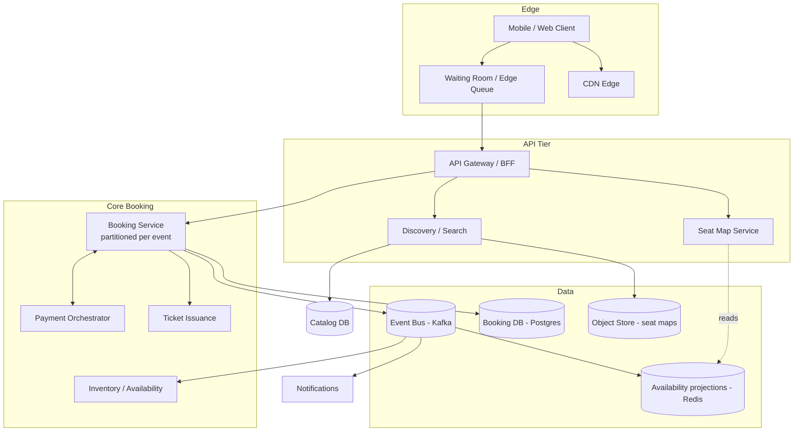

*The platform's edge admits users through a waiting room, then routes them to composable services: Discovery renders events from a catalog DB; the Seat Map Service reads cheap projections from Redis; the Booking Service (partitioned per event) owns seat-state transitions; the Payment Orchestrator drives the book-and-pay saga. An event bus fans state changes to projections, notifications, and analytics. The booking DB is the durable truth; Redis accelerates availability views.*

**Scale:** a stadium onsale = ~80K seats; 500K–1M users may hit simultaneously. Average day is modest (~1K bookings/min) — but capacity must be built for the burst, not the average.

---

### Characteristics

| Characteristic | What it means | Why it matters |
|---|---|---|
| **Seat-level mutual exclusion** | At most one active hold or booking per seat at any instant | The fundamental invariant — no double-sell, ever |
| **Burst-dominated traffic** | 99% of annual load arrives in minutes around popular onsales | Architecture optimizes for the spike, not the plateau |
| **Human-timescale locks** | Holds last 5–15 minutes (payment window), not milliseconds | Requires explicit expiry machinery, not infra timeouts |
| **Strict consistency on a narrow hot path** | Seat state transitions serialized; everything else eventual | Correctness concentrated where it matters |
| **Fairness as a requirement** | Queue order determines who gets first pick, not network luck | Regulators and fans expect fair admission |
| **Perishable inventory economics** | Unsold seats at showtime = zero residual value | Drives dynamic pricing, last-minute discounts, waitlisting |
| **High-assurance payments** | Refunds, chargebacks, auditability of every transition | Money movement must be recoverable and auditable |

- **Seat-level mutual exclusion** is non-negotiable: a seat in `Held` or `Booked` state must never be claimed by a second buyer. The system serializes transitions on a single owner per event.
- **Burst-dominated traffic** inverts normal scaling assumptions: autoscaling reaction is too slow for a 1-second drop, so capacity is pre-provisioned and admission is controlled at the edge.
- **Human-timescale locks** mean the reservation is a business state (a row in the DB) with an absolute expiry, not a short-lived infra lock — abandonment is the common case and is handled by a sweeper.

---

### Pros

- **Guaranteed uniqueness of sale** — the entire value proposition; a correct design eliminates double-sell incidents and their legal/regulatory fallout.
- **Graceful behavior at extreme bursts** — waiting rooms convert crashes into controlled delays, protecting conversion and brand.
- **Operational insight from the event spine** — every state change is auditable, replayable for dispute resolution, and the basis for metrics.
- **Independent scaling of discovery vs. booking** — cheap horizontal scaling where load actually varies; the booking hot path is scaled per-event.
- **Extensible commerce** — dynamic pricing, resale, add-ons (parking, merch, food) plug into the same event backbone.
- **Auditable reconciliation** — seat transitions, payments, and refunds form a total order that supports end-of-day reconciliation and customer support.

---

### Cons

- **Hot-event partitions can bottleneck:** a single mega-event can saturate its owner node — requires careful capacity pre-warming or section-splitting complexity.
- **Multi-layer consistency (Redis soft-hold vs DB truth):** must be kept in sync; bugs manifest as phantom-available seats or stranded inventory.
- **Waiting rooms degrade UX for legitimate users by design:** tuning release rates is more art than science, and honest-but-slow feels painful during a drop.
- **Resale/anti-bot arms race:** continuous investment in fingerprinting, identity tiers, and rotating tickets to combat scalpers.
- **Refund/chargeback flows across PSPs:** remain operationally painful regardless of internal design elegance.
- **Fairness is hard to prove:** FIFO ordering across a distributed queue with retries and retries re-entry creates edge cases regulators notice.

---

### Use Cases

- **Stadium concert onsale (Ticketmaster-style):**
  *Problem:* 1M fans, 80K seats, 10:00 drop. *Solution:* waiting-room admission → paced release → partition-per-event booking → verified-fan presales to pre-filter bots. *Trade-off:* verified-fan registration adds friction but shifts the fight from bots to humans, improving fairness optics.

- **Cinema chain daily bookings (BookMyShow-style):**
  *Problem:* Thousands of shows/day, moderate per-show contention, food add-ons, UPI-heavy payments. *Solution:* Standard booking saga with regional caches; seat maps cached aggressively since most seats stay empty till near-showtime. *Trade-off:* Simpler infra than onsale mode; spend focused on payment reliability and UPI retry handling.

- **Last-minute discounting:**
  *Problem:* Perishable inventory approaching zero value. *Solution:* Time-tiered pricing engine reading days-to-show + sell-through curves; flash-sale windows reusing onsale machinery at small scale. *Trade-off:* Cannibalization risk vs. incremental revenue from otherwise-worthless inventory.

- **Seasonal theater / broadway rush:**
  *Problem:* Unsold premium seats 2 hours before curtain. *Solution:* Dynamic "rush" pricing that drops seat prices the closer to showtime; waitlist that auto-purchases released seats. *Trade-off:* Margin compression vs. fill-rate; must not cannibalize advance sales.

The defining constraint across every ticketing use case is that seats are positional and perishable, so the architecture must serialize seat transitions per event with human-timescale holds while controlling admission at the burst edge.

---

### Components

| Component | Purpose | Responsibilities | Relationship | Example |
|---|---|---|---|---|
| **Waiting Room / Queue** | On-sale admission control | Edge-level token issuance, position tracking, paced release, bot filtering | Issues tokens to admitted users; integrates with BFF | Cloudflare Waiting Room |
| **API Gateway / BFF** | Protocol translation + cross-cutting | Auth, rate limiting, request shaping per client | Fronts all domain services | BookMyShow gateway |
| **Catalog Service** | Events, venues, showtimes, seat layouts | CRUD for organizers, seat-map schema storage, onsale scheduling | Writes → event bus; serves organizer portal | Ticketmaster Venues API |
| **Discovery / Search** | Find events by city/date/genre | Geospatial + text search over catalog read models, personalized ranking | Reads from Elasticsearch projections | BookMyShow home feed |
| **Seat Map Service** | Render live availability | Serve section-level heatmaps (cheap), stream deltas via WebSocket/SSE, resolve individual-seat queries | Reads from availability projections, not the booking DB | Cinema layout view |
| **Booking Service** | Own the seat-state machine | Acquire/release holds, enforce per-seat exclusivity, TTL sweeps, emit transitions | Partitioned per event (showId); syncs to payments via saga | Ticketmaster checkout |
| **Payment Orchestrator** | Take money safely within the hold window | PSP integration, retries, webhook verification, refunds | Sync to PSP; async to booking on outcome | Stripe + Razorpay |
| **Ticket Issuance** | Generate verifiable tickets | Anti-counterfeit signing (Ed25519/HMAC), PDF/pass delivery, offline-verifiable scanner apps, revocation lists | Emits on booking confirmation | SafeTix (Ticketmaster) |
| **Inventory / Availability** | Projected seat availability | Maintain section-level aggregates consumed by Seat Map; source-of-truth reconciliation | Fed by booking events; serves Redis projections | — |
| **Anti-Fraud / Bot** | Keep inventory for humans | Device fingerprinting, purchase velocity limits, known-reseller detection | Inline at booking + post-purchase review | Verified Fan |
| **Notification Service** | Confirmations, reminders, cancellations | Email/SMS/push and in-app fan-out on booking events | Listens to event bus | — |

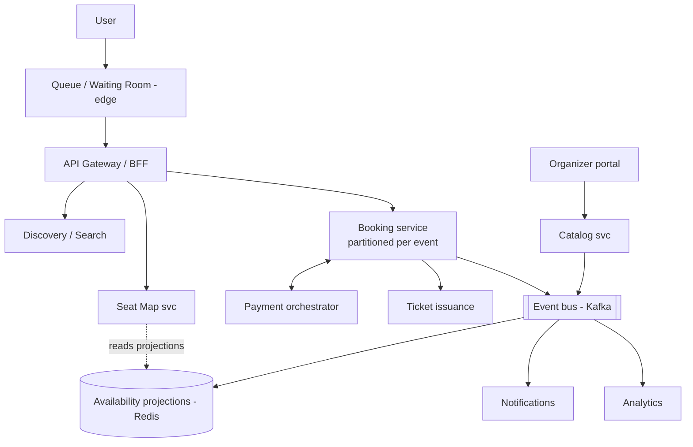

*Component topology: a waiting room controls onsale admission; the BFF fronts Discovery, Seat Map, and Booking. The Booking service is partitioned per event (natural serialization), owns seat-state transitions, and drives payment via a saga. A Kafka event bus fans state changes to availability projections (Redis), notifications, and analytics. The Seat Map reads only projections, never the booking DB directly.*

---

### Architectural Patterns

- **Partition-per-aggregate (event-sharded actors):**
  *Problem:* serializing seat operations across a cluster without global locks. *How:* `hash(eventId)` routes all seat commands to one owner instance (shard leader or actor); inside, single-threaded command processing gives natural mutual exclusion. *When:* strong per-entity ordering needed at scale. *Pros:* simple reasoning, no distributed locks. *Cons:* hot events need vertical headroom or intra-partition sharding by section.
- **Soft-hold with TTL + sweeper:**
  *Problem:* users abandon carts mid-payment. *How:* Hold entries with an absolute expiry; a background sweeper (or lazy expiry-on-access) releases seats; idempotency prevents double-release races. *Real-world:* Universal across ticketing.
- **Saga (book-and-pay):**
  *Steps:* hold → create-order → capture payment → confirm booking; compensations: release hold, refund capture. Orchestrated (not choreographed) because the flow is linear and auditability matters.
- **Optimistic UI + server truth:** Clients render optimistic seat selections but every action is validated server-side; conflicts surface as "seat just got taken" UX moments.
- **CQRS for availability views:** Transactional booking writes produce events consumed into denormalized per-section availability counters — seat-map reads never touch the booking DB.
- **Rate limiting + admission control at the edge:** Protects the whole chain during drops; combines the global waiting room with per-user action quotas.

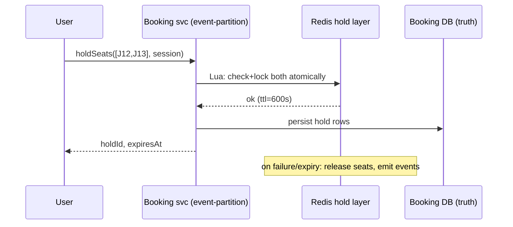

*Atomic multi-seat hold with compensation: the Booking service runs a Redis Lua script that atomically checks both seats are free and locks them in one round-trip (no partial holds). The durable hold is written to the booking DB. On payment failure or TTL expiry, both the Redis key and DB row are released — the compensation path is idempotent.*

#### Design Considerations

The single most important principle: **seats are positional and perishable**. Unlike generic e-commerce stock (count-based), each seat is a unique unit with location meaning, a showtime deadline, and zero residual value after the event. This means the architecture optimizes for (a) strict per-seat serialization, (b) human-timescale holds (5–15 min for payment), and (c) burst admission control at onsale.

#### Key Decisions

- **Partition-per-event booking:** All seat commands for one `showId` route to a single owner (shard leader or actor), so mutual exclusion is free — no distributed locks.
- **Redis soft-hold + DB durable truth:** Redis acquires/releases holds in milliseconds (Lua atomic ops); the relational DB is the source of truth for audit and recovery.
- **Waiting room at the edge:** Admission control converts 1M simultaneous arrivals into a controlled, fair, paced flow matching system capacity.
- **Idempotent payment webhooks as capture truth:** The PSP callback is the only authoritative signal for payment success; all internal state derives from it.
- **WebSocket seat-map projection:** Real-time availability via delta streaming to section-level subscribers, never raw seat reads from the transactional DB.

#### Trade-offs

| Decision | Pro | Con |
|---|---|---|
| Per-event partitioning | Natural serialization, no distributed locks | Mega-events need cross-section coordination for group bookings |
| Redis soft-hold layer | Millisecond UX, cheap TTL sweeps | Must stay in sync with DB truth; invalidation bugs cause phantom-available seats |
| Waiting room | Converts crashes to controlled delays | Degrades UX for legitimate users; tuning release rate is an art |
| WebSocket seat maps | Real-time feel without API hammering | Fanout complexity for 100K concurrent viewers |
| Saga for book-and-pay | Isolates PSP flakiness from seat logic | Compensation complexity; intermediate visible states need UX handling |

#### Scalability Considerations

- **Booking:** Partitions scaled per forecast; mega-events get dedicated cells; per-SKU queue serialization for extreme contention.
- **Seat maps:** Projection cluster scales with viewership; section-level aggregates cached; deltas throttled/coalesced (max N msgs/sec/viewer); full refresh only on reconnect.
- **Waiting room:** Edge infrastructure scales independently; token + position tracking must be bot-resistant and fair (FIFO-ish).
- **Catalog/search:** Elasticsearch scales horizontally; CDC from the catalog service keeps indexes fresh.

Every architectural decision in ticketing must preserve the total order of seat state transitions, so the booking service is never split across owners for the same event without a coordination protocol.

---

### Benefits

- **Guaranteed uniqueness of sale** — the entire value proposition; a correct design eliminates double-sell incidents and their legal/regulatory fallout.
- **Graceful behavior at extreme bursts** — waiting rooms convert crashes into controlled delays, protecting conversion and brand.
- **Operational insight from the event spine** — every state change is auditable, replayable for dispute resolution, and the basis for metrics and postmortems.
- **Independent scaling of discovery vs. booking** — cheap horizontal scaling where load actually varies; the booking hot path is scaled per-event.
- **Extensible commerce** — dynamic pricing, resale, add-ons (parking, merch, food) plug into the same event backbone.
- **Auditable reconciliation** — seat transitions, payments, and refunds form a total order that supports end-of-day reconciliation and customer support.
- **Regulatory defensibility** — a tamper-evident ledger of who held what seat when, plus waitlist fairness, holds up under regulator scrutiny of onsale fairness.

---

### Challenges

- **Technical:** Atomic multi-seat selection (a group wants 4 adjacent seats — all-or-nothing hold); the expiry-vs-payment race; clock skew in TTL enforcement across nodes.
- **Scalability:** Onsale spikes 1000× baseline; seat-map WebSocket fanout for 100K concurrent viewers of one stadium.
- **Performance:** Sub-second seat-map loads despite millions of seat-state rows — solved with section-level aggregates + delta streaming, never full reloads.
- **Reliability:** Zero tolerance for oversell; DR for in-flight holds (WAL/replicated partition state); PSP outages mid-onsale (queue payments, extend holds).
- **Maintainability:** Venue-map schema evolution (new seat types, accessible seating, obstructed-view flags); backward-compatible changes only.
- **Operational:** Onsale-day war rooms; rehearsed runbooks for queue misconfiguration and capacity miscalculation.
- **Security/fairness:** Bots buying instantly then reselling — fingerprinting, identity verification tiers, purchase limits, rotating QR tickets to kill screenshot fraud.

---

### Best Practices

- **Serialize per event (or per section for mega-events):** Contention lives within one show; don't pay cross-event coordination costs.
- **Treat payment webhooks as the only truth for capture:** Verify HMAC signatures, process idempotently, and let the webhook drive the booking state — not the client-facing response.
- **Make hold expiry deterministic and observable:** Log every release with reason (expiry/failure/user), alert on sweeper lag, and use compare-and-set so a confirm racing an expire resolves to exactly one winner.
- **Pre-warm and pre-scale before scheduled onsales:** Publish capacity plans tied to the event calendar; load-test at 1.5× forecast; practice failover.
- **Design the "seat stolen" UX deliberately:** Fast feedback + equivalent-seat suggestions + hold-extension grace for the unlucky buyer; abandoned users cost revenue too.
- **Keep an append-only ledger of every seat transition:** Support disputes, audits, and postmortems come free.
- **Load-test with realistic seat-pick patterns:** Adjacent groups dominate real behavior; uniform random under-tests the multi-seat atomicity path.
- **Sign tickets cryptographically and rotate QR secrets:** Screenshot resale becomes detectably stale within the rotation window.

---

### When to Use / When Not to Use

**Use when:**

- Selling fixed-position, perishable inventory (reserved seats, sections) for time-bound events.
- Demand bursts far exceed steady-state capacity (onsales, celebrity events, opening nights).
- Fairness and anti-bot measures are a legal or brand requirement.
- Payment integrity and seat-level uniqueness must be guaranteed (zero oversell tolerance).
- A secondary market or resale channel is in scope.

**Avoid when:**

- Inventory is count-based (like a merch table) — a general e-commerce cart solves this more simply.
- Demand is flat and low — plain DB transactions with row locks suffice at small scale.
- There is no perishable time component — books, general retail, and subscriptions don't need the hold machinery.
- The team cannot staff an onsale-day war room — the complexity only pays off at genuine burst scale.

**Alternatives:**

- **General e-commerce cart:** For count-based stock without positionality.
- **Managed ticketing SDKs (Ticket Tailor, Eticketing APIs):** Until differentiation requires ownership of the onsale experience.
- **First-come-first-served free registration:** For non-revenue events where oversell is impossible (free, unlimited RSVP).

**Decision factors:** Peak concurrency per event, positional vs. count inventory, regulatory exposure, resale-market importance, and whether you control the payment flow. If thousands fight over specific seats at a known instant, the waiting-room + partition-per-event + Redis-soft-hold design is the right answer.

---

### Data Model and API

The data model captures venues, events, shows, seats, and the transitions between availability states. Seats are positional; availability is a projection of the immutable seat ledger.

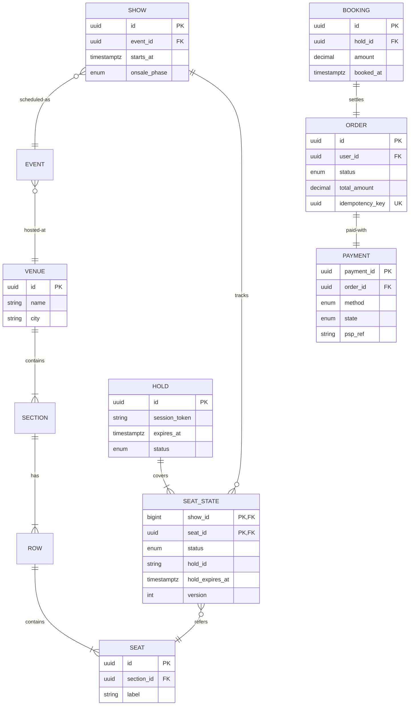

*Seat-state model: a SHOW references a VENUE's SEATs through SEAT_STATE rows keyed by `(show_id, seat_id)`. The composite PK makes the uniqueness invariant trivial (`status` transitions guarded by `version` optimistic check or upsert-with-where). `hold_expires_at` is indexed for sweepers; an append-only SEAT_LEDGER mirrors transitions for audit. Shows are sharded by `show_id`; mega-events optionally by `(show_id, section_id)`.*

**Key choices:**

- Composite PK `(show_id, seat_id)` makes "one state per seat per show" a trivial constraint.
- `version` optimistic check or `upsert ... WHERE status = 'AVAILABLE'` guards the transition.
- `hold_expires_at` indexed for the TTL sweeper; `(show_id, seat_id, status)` for availability aggregates.
- Append-only `SEAT_LEDGER` for dispute resolution.
- Orders sharded by `hash(user_id)` for "my tickets"; `idempotency_key` unique globally (cross-shard lookup on retry).

#### Seat Selection & Hold API

```
POST   /api/v1/shows/{showId}/holds
DELETE /api/v1/shows/{showId}/holds/{holdId}
POST   /api/v1/shows/{showId}/holds/{holdId}/confirm
```

**POST /api/v1/shows/{showId}/holds Request** (atomic multi-seat):

```http
POST /api/v1/shows/s-123/holds HTTP/1.1
Authorization: Bearer <jwt>
Idempotency-Key: 97b8c302-...
Content-Type: application/json

{
  "seatIds": ["J12", "J13", "J14"],
  "holdDurationSeconds": 600
}
```

**POST /api/v1/shows/{showId}/holds Response** (HTTP 201):

```json
{
  "holdId": "hl-abc123",
  "seats": ["J12", "J13", "J14"],
  "expiresAt": "2024-02-14T10:05:00+05:30",
  "totalAmount": { "amount": 12000, "currency": "INR" }
}
```

#### Checkout API

```
POST   /api/v1/checkout                 # Idempotency-Key: <uuid>
GET    /api/v1/orders/{orderId}
GET    /api/v1/orders?cursor=...
```

**POST /api/v1/checkout Request:**

```http
POST /api/v1/checkout HTTP/1.1
Authorization: Bearer <jwt>
Idempotency-Key: 97b8c302-...
Content-Type: application/json

{
  "holdId": "hl-abc123",
  "paymentMethod": { "type": "upi", "vpa": "user@upi" },
  "customer": { "name": "Jane Doe", "email": "jane@example.com", "phone": "+919876543210" }
}
```

**POST /api/v1/checkout Response** (HTTP 202 — async completion via polling/WebSocket):

```json
{
  "orderId": "ord-7d2f9c",
  "status": "PAYMENT_PENDING",
  "amount": 12000,
  "paymentLink": "https://pay.example.com/checkout/cp_9f3a"
}
```

Client polls `GET /api/v1/orders/{orderId}` or receives a WebSocket update when payment completes.

#### Ticket API

```
GET  /api/v1/tickets/{ticketId}/qr        # signed, rotating QR
GET  /api/v1/orders/{orderId}/tickets
POST /api/v1/tickets/{ticketId}/transfer   # secondary market transfer
```

**Status codes:** `200/201` success, `202` checkout accepted (async), `409` seat conflict, `410` hold expired (re-hold), `429` waiting-room throttling, `402` payment required.

**Key contracts:**

- **Idempotency:** every mutating write (`POST /holds`, `POST /checkout`) accepts an `Idempotency-Key`; retries collapse to the same result.
- **Seat conflict resolution:** If two concurrent hold requests target the same seat, the Lua atomic check ensures only one succeeds (`409 Conflict` for the loser).
- **Webhook verification:** Payment callbacks include `X-Signature` (HMAC-SHA256); processed idempotently by `pspRef`.
- **Rate limiting:** Waiting-room tokens + per-user action quotas; returns `Retry-After` and queue position.

The seat selection and hold lifecycle is the revenue-critical path, so every seat-state transition must be atomic, auditable, and recoverable from the durable booking DB even if the Redis soft-hold layer is lost.

---

### Ticketing Architecture Deep Dive

This is the domain-specific core: seat selection, the hold-and-release lifecycle, concurrency control under onsale burst contention, seat-map projections, waiting rooms, and the payment-timeout interplay. The central invariant is that **at most one active hold or booking per seat exists at any instant** — a distributed mutual exclusion operating on human timescales (minutes, not milliseconds).

#### The Hold Lifecycle

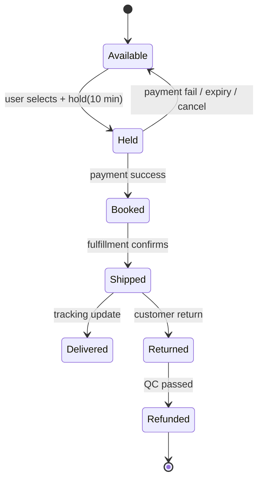

Key rules: holds carry an absolute expiry; only the holder can confirm; expiry sweeps return seats to `Available` atomically; every transition emits an event (analytics, receipts, seat-map refresh broadcasts).

#### Concurrency Control — Pick Your Poison

The fundamental trade-off on the seat-state path is correctness vs. throughput. Each approach has a different contention profile:

| Approach | Mechanism | Fit |
|---|---|---|
| Pessimistic row lock | `SELECT ... FOR UPDATE` on seat row | Simple, correct; lock held through payment = unacceptable |
| Optimistic version check | Update succeeds only if `version` unchanged | Great for short transactions (the hold itself), retry storms under extreme contention |
| Partition-owner serialization | All commands for one event routed through one shard/actor | Predictable ordering; the scale-out answer |
| Redis atomic ops / Lua | `SET seat:J12 ownerId NX PX ttl` | Fast soft locks; pair with durable DB truth |

Production designs combine them: **Redis for the fast soft-hold layer, relational DB as source of truth, partitioned by event so all seat operations for one show serialize naturally.**

#### The Reservation / Hold-and-Release Pattern

At checkout start the inventory service creates a reservation row with TTL (say 10 min). Payment success triggers confirm (decrement permanently). Payment failure/abandonment or TTL expiry releases stock. Atomicity inside the inventory service uses conditional updates (`UPDATE stock SET qty = qty - ? WHERE sku=? AND qty >= ?`) or Redis Lua scripts for hot keys, plus queue-based serialization for extreme contention (a single partition owning one SKU serializes its updates).

A critical sub-pattern is **atomic multi-seat holds**: a group booking 4 adjacent seats must hold all 4 or none — partial holds strand users mid-selection. The Redis Lua script checks all requested seats are free and sets them in one atomic execution; if any seat is taken, the whole request fails (`409 Conflict`) and no seat is locked.

#### Seat Selection — Atomic Multi-Seat Holds

```java
@Service
@RequiredArgsConstructor
public class SeatHoldService {

    private static final String REDIS_HOST_PREFIX = "show:";

    private final StringRedisTemplate redis;
    private final SeatStateRepository seatStates;

    public SeatHoldService(StringRedisTemplate redis,
                           SeatStateRepository seatStates) {
        this.redis = redis;
        this.seatStates = seatStates;
    }

    private static final DefaultRedisScript<String> HOLD_SCRIPT = new DefaultRedisScript<>(
            """
            local freed = {}
            for i, seat in ipairs(KEYS) do
                if redis.call('exists', seat) == 1 then
                    return 'SEAT_TAKEN:'..i
                end
            end
            local ttl = tonumber(ARGV[1])
            for i, seat in ipairs(KEYS) do
                redis.call('set', seat, ARGV[2], 'PX', ttl)
                table.insert(freed, seat)
            end
            return 'OK'
            """, String.class);

    public HoldResult hold(long showId, List<String> seatIds, Duration ttl, String sessionToken) {
        List<String> keys = seatIds.stream()
                .map(s -> REDIS_HOST_PREFIX + showId + ":seat:" + s)
                .toList();
        String result = redis.execute(HOLD_SCRIPT, keys,
                String.valueOf(ttl.toMillis()), sessionToken);
        if (!"OK".equals(result)) {
            throw new SeatTakenException(showId, result);
        }
        // Durable truth: persist holds idempotently (DB is source of truth, Redis is fast)
        seatIds.forEach(id -> seatStates.persistHold(showId, id, sessionToken,
                Instant.now().plus(ttl)));
        return new HoldResult(sessionToken, Instant.now().plus(ttl), seatIds);
    }

    @Scheduled(fixedDelay = 30_000)
    public void sweepExpiredHolds() {
        seatStates.findExpiredHolds(Instant.now())
                .forEach(h -> {
                    redis.delete(REDIS_HOST_PREFIX + h.getShowId() + ":seat:" + h.getSeatId());
                    seatStates.markAvailable(h.getShowId(), h.getSeatId());
                });
    }

    record HoldResult(String holdId, Instant expiresAt, List<String> seats) {}
}
```

*The `SeatHoldService` bean implements atomic multi-seat holds. The Lua script checks every requested seat is free in a single atomic execution — if any is already held, it returns `SEAT_TAKEN:<i>` and locks **nothing** (no partial holds). Only on full success does it persist durable hold rows to the DB (Redis is the fast soft-hold; DB is the source of truth for recovery). The `@Scheduled` sweeper (every 30s) releases expired holds via the same Lua `delete` + DB `markAvailable`, idempotent by design. Production adds `@Transactional` on the DB write and shards by `(showId, section)` for mega-events.*

#### Waiting Rooms (Onsale Bursts)

When 800K users arrive at 10:00:00 for 80K seats:

1. The edge admits users into a virtual queue (token + position).
2. Users are released into the actual booking flow at a controlled rate matching system capacity × expected conversion.
3. Everyone else sees honest position updates — perception management is a feature.
4. The queue itself must be fair (FIFO-ish), bot-resistant, and horizontally scalable (this is its own distributed-system problem — think Cloudflare Waiting Room).

Admission tokens are short-lived JWTs issued by a queue service; the BFF validates the token before accepting a booking request. Tokens carry the user's place-in-line and a monotonic timestamp, so the release rate is enforced server-side regardless of client behavior.

#### Payments & Timeout Interplay

The hold window exists because payment takes time. The total order on the (hold_id, status) row resolves the expiry-vs-capture race:

- **`confirm` executes** only if the hold is still `HELD` and `now < expires_at`. → Mark `BOOKED`, emit `BookingConfirmed`.
- **If expiry already won** (hold is `EXPIRED` or `RELEASED`): payment webhook still arrives. The system **auto-refunds the capture** (money integrity preserved) OR, under a configured grace policy, re-reserves equivalent seats and notifies the user.
- **If capture won first** but `confirm` hasn't run yet: the booking is reconstructed from the payment ledger entry.

Every branch is idempotent; the ledger records which branch won for support.


*Booking sequence with compensation path: the user joins the waiting room, is admitted with a token, and requests a hold; the booking service runs a Redis Lua check-and-lock, persists durable hold rows, and returns the hold. The client then confirms with a payment method; the payment service captures funds via the PSP; on the success webhook the booking is marked BOOKED and the hold upgraded to permanent. On any failure or TTL expiry, seats are released and events emitted — the compensation path is idempotent and observable. The expiry-vs-capture race is resolved by a total order on the (hold_id, status) row.*

#### Seat-Map Projection (CQRS)

Seat-map reads never touch the booking DB. Booking events (`SeatHeld`, `SeatBooked`, `SeatReleased`) are consumed into Redis section-level aggregates (`section:SOLD`, `section:AVAILABLE`). The Seat Map Service serves section heatmaps from these aggregates and streams deltas via WebSocket to connected viewers. A full seat-state reload happens only on reconnect; in between, only the changed section deltas are pushed.

The seat-map projection reads only denormalized aggregates from Redis, so even a stadium onsale with 100K concurrent viewers never reads the transactional booking DB on the read path.

This completes the Ticketing Architecture Deep Dive, covering hold-and-release, concurrency control, atomic multi-seat selection, waiting rooms, the payment-timeout race, and the CQRS seat-map projection.

---

### Replication Strategies

Ticketing replicates across three axes: within a region (for availability), across regions (for global latency and DR), and across storage systems (for different access patterns — durable truth vs. fast soft-holds vs. projections).

**Booking DB (PostgreSQL) — per-event leader + synchronous standbys:** Each event's seat commands route to one partition leader; within-region synchronous standbys confirm holds; cross-region replicas are asynchronous warm standbys for DR. A quorum of `(N/2)+1` confirms each seat-state write.

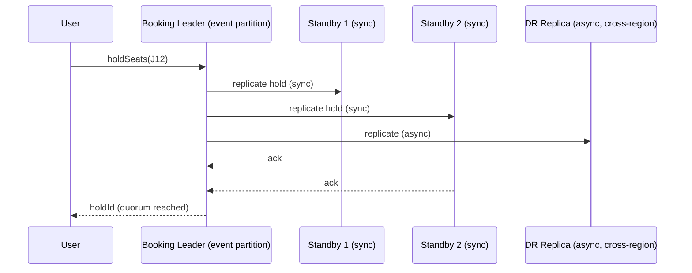

*Per-event booking replication: the user's hold command routes to the event partition's leader, which synchronously replicates to same-region standbys (acknowledged before responding to the user) and asynchronously to a cross-region DR replica. The hold is confirmed only after a quorum of same-region standbys acknowledge — protecting against seat-double-sell on a single-region leader failure.*

**Seat-map projections (Redis) — asynchronous replication + cluster:** Availability projections are fed by booking events into Redis Cluster (hash slots, master/replica). These are eventually consistent by design — a section heatmap lagging 1–2 seconds behind is acceptable. Seat-map reads never hit the booking DB.

**Payment state — CP with reconciliation:** Payment state is the source of truth for money. The PSP webhook is processed idempotently (dedup by `pspRef`); internal payment records are strongly consistent within a region and reconciled daily against PSP settlement files. A captured-but-unconfirmed payment is reconciled by a background job that either confirms the booking or issues a refund.

**Catalog (events/venues) — AP with cache-busting invalidation:** Venue maps and show metadata are mostly immutable; cached in Redis and CDN with long TTLs plus explicit invalidation on `ShowUpdated` events.

**Real-world use:** DynamoDB Global Tables for user profiles (active-active), Cassandra for waitlist/session data (tunable consistency), Redis Cluster for availability projections (master/replica with failover), Elasticsearch for discovery search (cross-AZ with 2+ replicas).

---

### Failure Detection and Membership

Ticketing services must detect failed nodes and partitions quickly without false positives that trigger unnecessary failover during a delicate onsale window.

**Application heartbeats and circuit breakers:** Each microservice publishes `/health/liveness` and `/health/readiness` endpoints checked by Kubernetes probes. Callers wrap critical downstream calls (PSP, booking DB) in circuit breakers (Resilience4j) that open after N consecutive failures, fail-fast, and half-open after a cooldown — preventing cascading failures that would crash an onsale.

**Gossip-based membership:** Redis Cluster and the booking-partition leaders use gossip to spread membership and health state. Phi-accrual failure detectors convert heartbeat timing into a suspicion level, reducing false positives from transient network blips.

```java
@Service
@RequiredArgsConstructor
public class HealthMonitor {

    private final List<DependencyProbe> probes;
    private final ApplicationEventPublisher publisher;
    private final AtomicReference<RegionStatus> regionStatus =
            new AtomicReference<>(RegionStatus.HEALTHY);

    @Value("${app.health.check-interval-ms:5000}")
    private long checkIntervalMs;

    @Scheduled(fixedDelayString = "${app.health.check-interval-ms:5000}")
    public void checkHealth() {
        boolean allHealthy = probes.stream().allMatch(DependencyProbe::isHealthy);
        RegionStatus newStatus = allHealthy ? RegionStatus.HEALTHY : RegionStatus.DEGRADED;
        if (regionStatus.getAndSet(newStatus) != newStatus) {
            publisher.publishEvent(new RegionHealthChangedEvent(newStatus));
        }
    }

    public boolean isHealthy() {
        return regionStatus.get() == RegionStatus.HEALTHY;
    }

    enum RegionStatus { HEALTHY, DEGRADED, FAILED }
}
```

*The `HealthMonitor` bean polls downstream dependency probes on a configurable schedule (`@Value`-injected via `@Scheduled`) and publishes a `RegionHealthChangedEvent` only when the status actually changes — avoiding event storms. The region status (`AtomicReference`) is consulted by the routing layer to shift or shed traffic.*

#### Failure Detection Timing for Ticketing

| Component | Check Interval | Timeout | Action |
|---|---|---|---|
| Booking partition leader | 2s | 5s | Failover to synced standby; replay in-flight holds |
| Payment Orchestrator | 5s | 30s | Queue webhooks; retry with alternate PSP; extend holds |
| Seat-map projection (Redis) | 2s | 15s | Serve stale aggregate; reconnect stream |
| Waiting-room edge | 1s | 3s | Mark node draining; rebalance tokens |
| Catalog service | 5s | 15s | Serve from CDN/Redis cache (long TTL) |

**Circuit breakers on the booking path:** A failing PSP doesn't wedge the booking service — the circuit opens, new captures are queued with extended holds, and the orchestrator retries with an alternate PSP behind a fallback.

---

### High Availability and Scalability

Availability in ticketing means never crashing on a sale drop and never double-selling a seat. Scalability means the booking hot path grows with the event, not with the global user base.

#### Multi-Region Deployment

- **Booking:** Active-passive by event partition. A given show's seats are owned by one region's leader; DR replicas in other regions are warm standbys. Failover is rare and deliberate (onsales are scheduled, so the owning region is known and pre-warmed).
- **Seat-map projections:** Each region maintains its own Redis projection fed by the event bus; WebSocket fanout is regional (viewers connect to the nearest region's seat-map server).
- **Waiting room:** Global edge (Cloudflare-style) with per-region release-rate tuning; tokens are region-scoped.
- **Catalog:** Cached aggressively; region-local reads with sync invalidation.

#### Auto-Scaling and Sale-Mode Capacity

- **Booking partitions:** Scaled per forecast. Mega-events get dedicated cells (own leader + standbys + payment pool). Regular shows share partitioned capacity.
- **Seat-map projection cluster:** Scales with viewership; section-level aggregates are pre-warmed; WebSocket fanout coalesces deltas to a max N msgs/sec/viewer.
- **Waiting-room infrastructure:** Scales independently at the edge; token issuance is sharded.
- **Payments:** PSP connections pooled; alternate-PSP fallback pre-warmed for onsale windows.

#### Graceful Degradation

- **Seat-map projection stale:** Serve the last known aggregate; the seat-level truth still enforces correctness on booking.
- **One PSP down:** Queue captures, extend holds by 5 minutes, retry via alternate PSP; never fail a booking due to one gateway.
- **Non-critical service failure:** Recommendations, upsells (parking/concessions), and marketing banners are served from cache or hidden — never block the revenue path.
- **Seat-map WebSocket degraded:** Fall back to polling the section aggregate at a reduced interval.

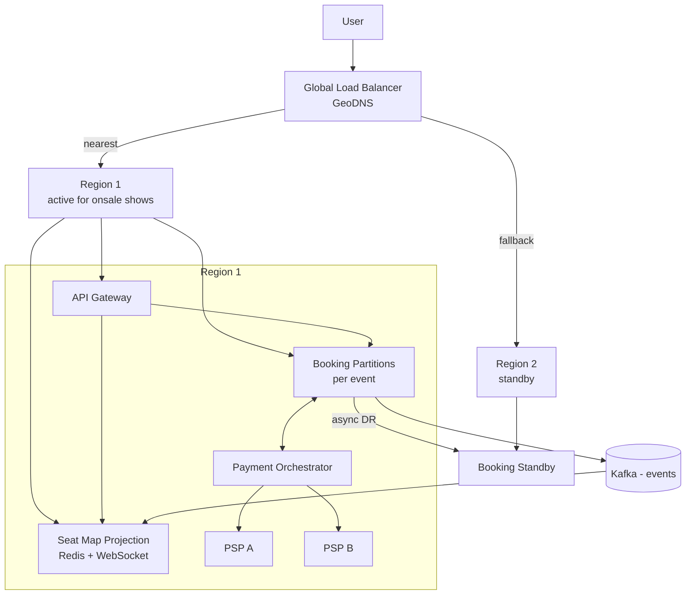

*Multi-region ticketing: a global load balancer routes users to their nearest region; each region runs its own booking partitions (active for that region's onsales), seat-map projection, payment orchestrator, and dual-PSP fallback. Cross-region DR replication keeps standby regions warm. On a regional failure, traffic fails over and the standby region's booking partitions take over — seat uniqueness is preserved because only one region is ever the active leader for a given show.*

High availability in ticketing is ultimately about not losing revenue on the drop and not selling the same seat twice, so the failure-handling design always favors correctness over speed when the two conflict.

---

### Performance and Optimization

Performance is measured as seat-map load p95 < 300 ms, hold acquisition p99 < 100 ms, onsale admission < 1 s, and payment webhook processing lag < 5 s. During a stadium onsale, 100K+ concurrent seat-map viewers must not read the booking DB.

#### Latency Optimization

- **Seat-map projection caching:** Section-level aggregates (available/held/booked counts per section) are pre-computed into Redis by consumers of booking events. Seat-map reads hit Redis, never the booking DB. Hot sections are cached for 1–2 seconds.
- **WebSocket delta streaming:** Seat-map changes are pushed as coalesced deltas (max N msgs/sec/viewer); a full seat reload happens only on reconnect. This keeps 100K concurrent viewers fed with O(changed seats) traffic, not O(seats).
- **Hold fast-path:** The Redis Lua check-and-lock is a single round-trip, sub-millisecond. The durable DB write is async (after the user is told they hold the seats), keeping the critical path fast.
- **Admission control latency:** The waiting room makes admission decisions in-memory with no DB round-trip; token issuance is O(1).

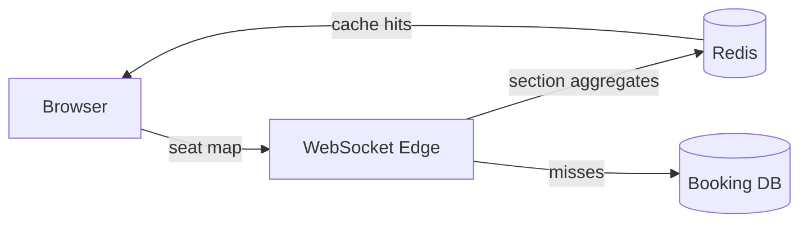

---

### CAP Theorem and Consistency Trade-offs

Ticketing systems navigate CAP trade-offs carefully: seat availability demands strong consistency (CP), while recommendation and rating data can tolerate eventual consistency (AP).

- **Seat-map availability (CP)**: For a given show, seat availability must be consistent within a region. When a seat is held or booked, the change must be immediately visible to other buyers in the same region. We use a CP store (e.g., PostgreSQL with strong read-after-write consistency) for the authoritative seat state.
- **Cross-region replication (AP with bounded staleness)**: Seat-map projections to remote regions use async replication with a short SLA (< 5 s). A conflict (double booking across regions) is resolved by rejecting the later write.
- **User sessions (AP)**: Session tokens and cart data can be eventually consistent. A user refreshing a seat map after a 5-second window sees the updated availability.
- **Booking history (AP)**: Post-booking, the reservation is persisted asynchronously. A user may briefly see a seat as "available" in their cart before the booking confirmation propagates.

**Trade-off matrix:**

| Data type | Consistency | Availability | Partition tolerance | Rationale |
|---|---|---|---|---|
| Seat availability | Strong (P) | Region-local (A) | Yes | Must not oversell |
| Payment info | Strong (P) | Low (A) | Yes | Financial accuracy |
| User profiles | Eventual (A) | High (A) | Yes | Non-critical staleness OK |
| Recommendations | Eventual (A) | High (A) | Yes | Stale recs are fine |

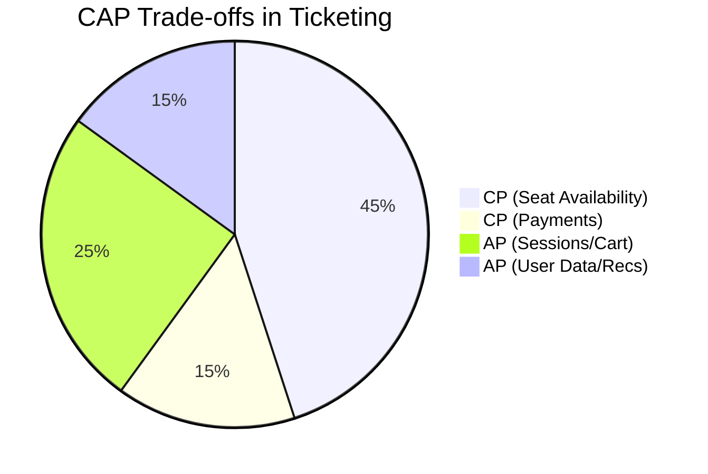

The key insight is that not all data has the same consistency requirements. Seat availability and payment data are CP systems where consistency is non-negotiable. User profiles, sessions, and recommendations are AP systems where availability is prioritized. The architecture uses different stores for different data types, with async replication between them.

---

### Encryption and Key Management

Ticketing platforms handle PCI-DSS payment data, PII (customer names, emails, phone numbers), and business-sensitive inventory data. Encryption must span data at rest, data in transit, and secrets at the application layer.

- **Encryption at rest**: PostgreSQL TDE for booking and payment tables. Redis with `requirepass` + in-transit TLS (no persistence of sensitive keys). Object storage (event images) encrypted with SSE-KMS. Kafka log segments encrypted at disk level.
- **Encryption in transit**: All inter-service communication uses mTLS (Istio sidecar). Database connections use TLS 1.3. Payment adapter calls to PSPs use mTLS with certificate pinning.
- **Application-layer encryption**: CVV and card numbers are tokenized at the payment gateway boundary. The token vault is a separate, isolated service with HSM-backed key management. PAN data never touches the booking service — only tokens are stored.
- **Key hierarchy**: Master keys in AWS KMS (or GCP KMS) with customer-managed CMKs. Per-region DEKs for database encryption. Automatic key rotation every 90 days with versioned encryption. Audit all key access via CloudTrail/Cloud Audit.

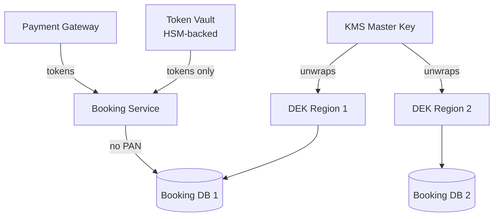

**Key rotation process**: KMS rotates CMK annually. DEKs are rotated every 90 days. The application detects rotation by fetching the current key version from KMS before encrypting. Decryption uses the key version stored alongside the ciphertext.

---

### Authentication and Authorization

The platform serves three principal types: end users (customers), venue/admin operators, and third-party partners (mobile apps, web aggregators).

- **Authentication**: OAuth 2.0 + JWT for end users. Service-to-service uses mTLS with SPIFFE identities. Third-party partners use API keys with HMAC-signed requests. Admin console uses SSO (SAML/OIDC) with MFA enforcement.
- **Authorization model**: RBAC with scopes. `customer` scope can book tickets and view own orders. `venue_manager` scope manages shows and seat maps for their venue. `admin` scope has read-only access to all bookings. `partner` scope has rate-limited read/write via API keys.
- **Session management**: JWT tokens (15-min access, 7-day refresh). Refresh tokens stored in HttpOnly, Secure, SameSite=Strict cookies. Revocation list in Redis for logout (token denial before expiry).
- **API gateway**: Central auth middleware. Validates JWT/mTLS/API key. Enforces rate limits (100 req/min/user, 1000/min/partner). Routes to microservices.

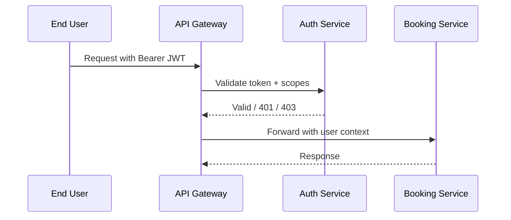

---

### Security Threats and Mitigations

Ticketing platforms face a unique set of threats: high-profile target for bots during popular onsales, payment-card data handling under PCI-DSS, and business risks from seat scalping and fraud.

#### Threat: Seat Hoarding / Bot Attacks During Onsales

- **Risk:** During a stadium concert onsale (10K seats, 1M waiters), bots flood the system with requests, grab seats, and resell at 10–50× face value. Legitimate buyers can't get seats.
- **Mitigation**: (1) **Waiting room** (queue) — Cloudflare or custom rate-limiter front-end absorbs the burst; only admitted at a controlled rate (e.g., 2000/s). (2) **Bot detection** — browser fingerprinting, CAPTCHA after N failures, headless-browser detection (Playwright detection). (3) **Purchase limits** — max 6 tickets per buyer verified by phone/email. (4) **Resale verification** — only allow resale at ≤ face value (verified by crediting original payment method).

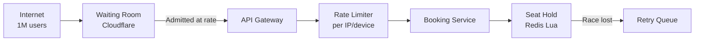

#### Threat: Double Booking / Seat Oversell

- **Risk:** A race condition or network partition causes two users to book the same seat.
- **Mitigation**: Lua-script-based atomic check-and-hold in Redis. Database-level unique constraint on `(show_id, seat_id, status)` with `WHERE NOT EXISTS`. Application-level distributed lock via ZK/etcd lease. Seat holds expire after 10 min TTL — automatic release prevents permanent hoarding.

#### Threat: Account Takeover

- **Risk:** Credential stuffing or session token theft allows an attacker to book seats using another user's account, potentially for resale.
- **Mitigation**: Rate-limited login endpoints (5 attempts/min per IP). MFA for high-value accounts (purchases > $500). Device fingerprinting + anomaly detection (new device + new country + high-value purchase). Immediate session invalidation on password change.

#### Threat: Payment Fraud

- **Risk:** Stolen card data used for fraudulent purchases (friendly fraud, card testing, stolen credentials).
- **Mitigation**: Real-time fraud scoring (Sift/Radar equivalent): velocity checks, IP geolocation mismatch, device reputation. 3D Secure 2 for high-risk transactions. Address Verification (AVS) and CVV checks. Chargeback representment with evidence collection (booking confirmation, IP, user agent).

#### Threat: Payment Data Leakage (PCI-DSS)

- **Risk:** Storing or logging full PANs, CVVs, or magnetic stripe data violates PCI-DSS. A breach exposes millions of cards.
- **Mitigation**: Tokenization at the payment gateway boundary — never store raw card data. CVV is never stored. Token vault is isolated (HSM-backed). All logs scrub PANs (show only last 4: `**** **** **** 1234`). Annual PCI-DSS audit.

#### Threat: Webhook Forgery / Replay

- **Risk:** An attacker forges a payment gateway webhook to confirm a booking without real payment.
- **Mitigation**: HMAC-SHA256 signature verification with a shared secret (Stripe's `Stripe-Signature` header pattern). Idempotency key on the webhook handler. Reject if timestamp diff > 5 min. Retry logic with exponential backoff and dead-letter queue.

---

### Observability and Logging

The platform instruments the full booking funnel — from waiting room admission through seat hold, payment, and booking confirmation — with metrics, structured logs, and distributed traces.

**Metrics:**

| Category | Metric | SLA / Threshold |
|---|---|---|
| Waiting Room | Admission rate (users/sec) | >1,000/sec during onsale |
| Booking | Hold success rate | >99.5% |
| Booking | Hold acquisition p99 | < 100 ms |
| Payment | Payment success rate | >99.0% |
| Payment | Webhook processing lag | < 5 s |
| Seat Map | Cache hit ratio | >95% |
| Inventory | Overbooking incidents | 0 (never) |
| Revenue | Failed booking recovery rate | >99% |

**Structured logging:** Every booking event (admission, search, hold, release, reserve, payment_intent_created, payment_succeeded, booking_confirmed, booking_cancelled) is logged as JSON with correlation IDs. Seat-map changes are logged with `show_id`, `seat_id`, `old_status`, `new_status`, `request_id`. Payment events include `payment_intent_id`, `amount`, `currency`, `outcome`, `fraud_score` (scrubbed).

**Distributed tracing:** Each end-to-end booking flow is traced from API Gateway → Booking Orchestrator → Seat Service → Payment Orchestrator → Payment Service → Webhook Service → Booking Confirmation. Latency breakdowns identify bottlenecks (e.g., fraud scoring > 10 ms, payment gateway > 200 ms).

**Alerting strategy:**
- **On-call alert**: Hold success rate < 99% for 2 min (critical — revenue impact).
- **On-call alert**: Payment webhook lag > 10 s (critical — bookings not confirmed).
- **Page within 5 min**: Seat availability inconsistency detected (critical — oversell risk).
- **Business alert**: Admission rate drops to 0 during onsale (critical — onsale broken).
- **Warning**: Cache hit ratio < 90% (investigate — scale Redis or fix cache invalidation).
- **Weekly**: Audit overbooking incidents and chargeback rates.

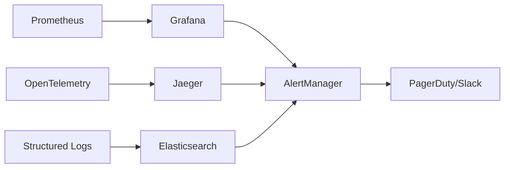

---

### Real-World Implementations

- **BookMyShow** (India): Largest in India; handles 50M+ monthly active users; stadium onsales with 1M+ concurrent users; integrates with 20+ payment gateways; PCI-DSS Level 1.
- **Ticketmaster** (US): 500M+ tickets sold annually; dynamic pricing; Verified Resale; strong anti-bot measures; operates in 30+ countries.
- **Eventbrite** (US): Self-service event platform; handles 2M+ events/year; built-in payment processing; strong analytics.
- **StubHub** (eBay): Secondary marketplace; real-time seat matching; price prediction; mobile-first.
- **Atom Tickets** (US): Mobile-first; social features (group ordering); integrations with theater chains.
- **See Tickets** (UK): White-label platform; handles festivals and venues; multi-currency, multi-language.

| Company | Concurrent Users | Peak TPS | Payment Gateways | Key Feature |
|---|---|---|---|---|
| BookMyShow | 1M+ (onsale) | 10K+ | 20+ | Anti-bot waiting room |
| Ticketmaster | 500K+ | 5K+ | 5+ | Dynamic pricing, Verified Resale |
| Eventbrite | 100K+ | 1K+ | In-house | Self-service events |
| StubHub | 100K+ | 800+ | PayPal/Stripe | Secondary marketplace |
| Atom Tickets | 50K+ | 500+ | 5+ | Social/group ordering |

**Key architectural patterns from production:**
- **Waiting room**: Both BookMyShow and Ticketmaster use a waiting room/queue system to handle traffic spikes during popular onsales.
- **Hybrid caching**: Seat maps cached in Redis; cart/session in-memory with async persistence; read models for search.
- **Multi-PSP fallback**: Real-time routing between payment providers based on success rates and latency.
- **Event sourcing**: Booking state is stored as an event log for audit and replay capability.

---

### Java and Spring Boot Implementation Guide

Spring Boot service for a ticketing platform: seat hold with TTL, booking orchestration, and payment flow.

#### 1. DTO Records

```java
public record HoldSeatRequest(String showId, List<String> seatIds, String userId) {}

public record ConfirmBookingRequest(String holdId, String paymentMethodNonce) {}

public record BookingResponse(String bookingId, String status, BigDecimal totalAmount) {}

public record SeatMapResponse(String showId, List<SeatDto> seats) {}

public record SeatDto(String seatId, String section, String row, String number,
                      String status, BigDecimal price) {}

enum SeatStatus { AVAILABLE, HELD, BOOKED, RELEASED }
enum BookingStatus { PENDING, CONFIRMED, FAILED, CANCELLED, REFUNDED }
```

 *`HoldSeatRequest` contains the show ID, requested seat IDs, and user ID. `ConfirmBookingRequest` carries the payment method nonce for final payment. `BookingResponse` returns confirmation with total amount. `SeatDto` models the seat-map view. `SeatStatus` and `BookingStatus` enumerate seat and booking lifecycle states.*

#### 2. Entity with Optimistic Locking

```java
@Entity
@Table(name = "seats", indexes = {
        @Index(name = "idx_show_seat", columnList = "showId,seatId", unique = true),
        @Index(name = "idx_status", columnList = "status")
})
public class Seat {

    @Id
    private String seatId;

    @Column(name = "showId", nullable = false)
    private String showId;

    @Column(nullable = false)
    private String section;

    private String row;
    private String number;

    @Enumerated(EnumType.STRING)
    private SeatStatus status = SeatStatus.AVAILABLE;

    @Version
    private Long version;

    // Hold with TTL — version guards against race
    public void hold(String userId) {
        if (this.status != SeatStatus.AVAILABLE) {
            throw new SeatAlreadyHeldException(seatId);
        }
        this.status = SeatStatus.HELD;
    }

    public void release() { this.status = SeatStatus.AVAILABLE; }
    public void confirm() { this.status = SeatStatus.BOOKED; }
}
```

*`Seat` entity with a composite index on `(showId, seatId)` for uniqueness and `@Version` for optimistic locking. The `hold()` method throws if the seat is not available, preventing double-booking. The `release()` and `confirm()` methods transition seat state.*

#### 3. Service Layer — Atomic Seat Hold with Redis TTL

```java
@Service
@RequiredArgsConstructor
public class BookingService {

    private final SeatRepository seatRepository;
    private final BookingRepository bookingRepository;
    private final RedisTemplate<String, String> redisTemplate;
    private final PaymentService paymentService;
    private final MeterRegistry meterRegistry;

    @Transactional
    public HoldSeatResponse holdSeats(HoldSeatRequest request) {
        var timer = Timer.Sample.start(meterRegistry);
        try {
            var holdId = UUID.randomUUID().toString();
            var holdKey = "hold:" + holdId;

            // Attempt to reserve seats (idempotency check via Redis SETNX)
            List<Seat> held = new ArrayList<>();
            for (String seatId : request.seatIds()) {
                String lockKey = "lock:" + request.showId() + ":" + seatId;
                Boolean acquired = redisTemplate.opsForValue()
                        .setIfAbsent(lockKey, request.userId(), Duration.ofSeconds(10));
                if (!Boolean.TRUE.equals(acquired)) {
                    meterRegistry.counter("booking.hold_conflict").increment();
                    throw new SeatAlreadyHeldException(seatId);
                }
                var seat = seatRepository.findByShowIdAndSeatId(request.showId(), seatId);
                seat.hold(request.userId());
                held.add(seat);
            }
            seatRepository.saveAll(held);

            // Store hold with 10-min TTL
            String holdData = objectMapper.writeValueAsString(
                    Map.of("holdId", holdId, "userId", request.userId(),
                           "seatIds", request.seatIds(), "showId", request.showId()));
            redisTemplate.opsForValue().set(holdKey, holdData, Duration.ofMinutes(10));

            // Release Redis locks automatically (TTL on lockKey)

            timer.stop(Timer.builder("booking.hold_duration")
                    .register(meterRegistry));
            return new HoldSeatResponse(holdId, SeatStatus.HELD, request.seatIds());
        } catch (Exception e) {
            meterRegistry.counter("booking.hold_errors").increment();
            throw e;
        }
    }

    @Transactional
    public BookingResponse confirmBooking(ConfirmBookingRequest request) {
        String holdKey = "hold:" + request.holdId();
        String holdData = redisTemplate.opsForValue().get(holdKey);
        if (holdData == null) {
            throw new HoldExpiredException("Hold expired or already confirmed");
        }

        var hold = objectMapper.readValue(holdData, HoldData.class);

        // Charge payment
        var paymentResult = paymentService.charge(
                request.paymentMethodNonce(), hold.totalAmount());

        if (!paymentResult.success()) {
            throw new PaymentFailedException(paymentResult.errorMessage());
        }

        // Confirm booking — update seats to BOOKED
        List<Seat> seats = seatRepository.findAllById(hold.seatIds());
        seats.forEach(Seat::confirm);
        seatRepository.saveAll(seats);

        var booking = new Booking();
        booking.setBookingId(UUID.randomUUID().toString());
        booking.setUserId(hold.userId());
        booking.setShowId(hold.showId());
        booking.setSeatIds(hold.seatIds());
        booking.setTotalAmount(hold.totalAmount());
        booking.setStatus(BookingStatus.CONFIRMED);
        booking.setPaymentId(paymentResult.paymentId());
        bookingRepository.save(booking);

        // Invalidate hold + caches
        redisTemplate.delete(holdKey);
        redisTemplate.delete("seatmap:" + hold.showId());

        meterRegistry.counter("booking.confirmed").increment();
        return BookingResponse.from(booking);
    }
}
```

 *`BookingService.holdSeats()` uses Redis `SETNX` as a distributed lock per seat, then updates the database with optimistic locking (`@Version`). The hold is stored in Redis with a 10-minute TTL (auto-release). `confirmBooking()` validates the hold, charges the payment, confirms seats, creates the booking record, and invalidates Redis caches. Micrometer tracks hold duration, conflicts, errors, and confirmations.*

#### 4. REST Controller

```java
@RestController
@RequestMapping("/api/v1/bookings")
@RequiredArgsConstructor
public class BookingController {

    private final BookingService bookingService;
    private final RateLimiter rateLimiter;

    @PostMapping("/holds")
    public ResponseEntity<HoldSeatResponse> holdSeats(
            @RequestHeader("Authorization") String bearer,
            @Valid @RequestBody HoldSeatRequest request) {

        // Rate limit per user during onsale
        if (rateLimiter.tryAcquire("onsale:" + request.userId())) {
            throw new TooManyRequestsException("Please retry");
        }

        var response = bookingService.holdSeats(request);
        return ResponseEntity.ok(response);
    }

    @PostMapping("/{holdId}/confirm")
    public ResponseEntity<BookingResponse> confirm(
            @RequestHeader("Idempotency-Key") String idemKey,
            @PathVariable String holdId,
            @Valid @RequestBody ConfirmBookingRequest request) {

        var response = bookingService.confirmBooking(
                new ConfirmBookingRequest(holdId, request.paymentMethodNonce()));
        return ResponseEntity.ok(response);
    }
}
```

 *`BookingController` exposes `/holds` for seat holding and `/{holdId}/confirm` for booking confirmation. The holds endpoint applies rate limiting per user during onsales. The confirm endpoint requires an idempotency key to prevent duplicate bookings on retries.*

#### 5. Exception Handler & Configuration

```java
@ControllerAdvice
public class BookingExceptionHandler {

    @ExceptionHandler(SeatAlreadyHeldException.class)
    ResponseEntity<Map<String, Object>> handleConflict(SeatAlreadyHeldException ex) {
        return ResponseEntity.status(HttpStatus.CONFLICT)
                .body(Map.of("error", "seat_unavailable", "seatId", ex.getSeatId()));
    }

    @ExceptionHandler(HoldExpiredException.class)
    ResponseEntity<Map<String, Object>> handleExpired(HoldExpiredException ex) {
        return ResponseEntity.status(HttpStatus.GONE)
                .body(Map.of("error", "hold_expired", "message", ex.getMessage()));
    }

    @ExceptionHandler(PaymentFailedException.class)
    ResponseEntity<Map<String, Object>> handlePayment(PaymentFailedException ex) {
        return ResponseEntity.status(HttpStatus.PAYMENT_REQUIRED)
                .body(Map.of("error", "payment_failed", "message", ex.getMessage()));
    }
}

@Configuration
@EnableCaching
public class RedisConfig {

    @Bean
    public RedisTemplate<String, String> redisTemplate(RedisConnectionFactory factory) {
        var template = new RedisTemplate<String, String>();
        template.setConnectionFactory(factory);
        template.setDefaultSerializer(new StringRedisSerializer());
        return template;
    }
}
```

 *`BookingExceptionHandler` maps domain exceptions to appropriate HTTP status codes. `RedisConfig` configures the Redis template for seat hold storage with TTL.*

---

### Interview Questions and Answers

**Beginner**

1. **Design BookMyShow — how do you handle millions of users booking movie tickets during a popular onsale?**
   A: Key components: (1) **Waiting room/queue** — Cloudflare or custom rate-limiter absorbs the initial burst, admits users at a controlled rate. (2) **Seat hold with TTL** — Redis `SETNX` for atomic seat reservation; holds expire after 10 min (auto-release). (3) **Database** — strong consistency on seat status (Postgres unique constraint + optimistic locking). (4) **Payment** — Payment Adapter → PSP → webhook confirmation. (5) **Async processing** — Kafka for booking events, payment webhooks. The key insight: decouple the hot path (seat selection) from the slow path (payment) via hold-and-confirm.

2. **How do you prevent double booking?**
   A: (1) Atomic check-and-set in Redis using `SETNX` or Lua script (check seat available + set HELD atomically). (2) Database unique constraint on `(show_id, seat_id, status)` where status must be 'AVAILABLE'. (3) Optimistic locking (`@Version`) on the seat entity. (4) Seat hold TTL ensures stale holds auto-release. (5) Payment idempotency keys prevent duplicate charges.

3. **What happens when a user holds 6 seats but only wants to pay for 4?**
   A: User can release individual seats from the hold (PUT `/holds/{holdId}/seats` with release). The remaining seats stay held. If the user pays for all 4 → booking confirmed. If they cancel partially → remaining seats re-released to pool. Holds expire after 10 min regardless.

4. **How do you handle seat map rendering for 1K-seat theaters with 100K concurrent viewers?**
   A: Seat-map projection — precompute section-level availability aggregates (available/held/booked counts per section) into Redis by consuming booking events. Seat-map reads hit Redis (p95 < 300ms for 1K seats). WebSocket pushes deltas (changed seats only) to connected clients. Hot sections cached for 1–2 seconds.

5. **What's the difference between a hold and a booking?**
   A: A **hold** temporarily locks seats (10-min TTL, no payment, cancellable). A **booking** is a confirmed reservation with payment captured, seats marked BOOKED, and a booking record created. Hold → confirm → booking is the flow. Holds are ephemeral; bookings are permanent.

**Intermediate**

6. **Design the waiting room system. How does it work?**
   A: Cloudflare queue or custom solution: (1) All traffic hits a CDN with a queue configuration. (2) Users get a virtual queue token and estimated wait time. (3) Users are admitted at a configured rate (e.g., 2000/s). (4) Admitted users get a JWT for the actual application. (5) Users behind the queue see a real-time position update. Key challenges: preventing queue jumping, handling mobile browser refresh, graceful degradation when the queue is bypassed for low-traffic periods.

7. **How would you handle flash sales (e.g., IPL final tickets with 2M users)?**
   A: (1) **Pre-seeded demand** — register user interest before the sale; send a token at sale time to avoid thundering herd. (2) **Waiting room** — admit at 5000/s for 6+ minutes. (3) **Multi-region** — active/active across US-East, US-West, Singapore, Mumbai. Each region serves its onsale. (4) **Seat pre-allocation** — pre-partition seats across regions. (5) **Circuit breaker** — if a region is down, redirect to backup. (6) **Analytics** — detect and block bot patterns in real-time.

8. **How do you implement dynamic pricing?**
   A: Base price × multiplier. Multiplier increases with: remaining seats (fewer = higher), booking velocity (high demand = higher), time-to-event (closer = higher), section popularity (orchestra > balcony). Algorithm: `final_price = base * (1 + 0.1 * sold_ratio) * (1 + 0.05 * velocity_factor) * time_factor`. Updates every 5 min, broadcast via WebSocket to connected clients.

9. **How do you handle seat holds expiring concurrently?**
   A: Redis holds seats with 10-min TTL. Background workers: (1) **Release worker** — polls KEYS `hold:*` with < 1 min TTL; acquires distributed lock; releases seats in DB (idempotent); logs release event. (2) **Orphan cleanup** — finds DB-held seats without a Redis hold key; releases them. (3) **Race conditions** — user might be paying during release; the payment service checks hold existence before finalizing. If payment succeeds after hold expiry → compensate (notify user, allow booking override with manual review).

10. **How does the payment flow work end-to-end?**
    A: (1) User confirms booking → Booking Service calls Payment Service. (2) Payment Service creates PaymentIntent with PSP. (3) Client SDK collects payment method. (4) Payment Service confirms → PSP processes → returns result. (5) On success: seats → BOOKED, booking confirmed, webhooks queued. (6) On failure: seats released, hold extended. (7) Webhook for async confirmation (refunds, disputes). (8) Idempotency key on all payment mutations.

**Advanced**

11. **Design a multi-region ticketing system with active-active booking. How do you prevent oversell across regions?**
    A: Use **single-region write per show** — each show's seat inventory is sharded to one primary region. Cross-region reads use async replication with 5-min SLA. Cross-region writes (e.g., user in India booking a US show): route to the show's primary region. Conflict resolution: the primary region is the source of truth; writes from non-primary regions return a redirect. Seat holds are region-local (in the show's home region). For cross-region users: the waiting room + hold is in the home region, payment confirms, booking is committed in the home region. Users in other regions see eventual consistency. Use CRDT counters for non-critical data (user profile views, recommendation clicks) and strong consistency for critical data (seat inventory, payments).

12. **How would you design the fraud detection system for a ticketing platform?**
    A: Two-tier: (1) **Real-time scoring** (5ms p99) — check IP velocity, device fingerprint, account age, booking pattern, seat selection pattern. Block if score > 80. Uses Redis for feature store. (2) **Batch scoring** (every 15 min) — train ML model on historical data (features: time-to-purchase, payment method, device, IP geo, buying history). Update model daily. Feedback loop: confirmed chargebacks → retrain. Anomaly detection: sudden spike in purchases from a single IP range → auto-block + alert. Bot detection: headless browser detection, purchase patterns (select same seat in multiple shows → scalper).

13. **How do you handle the CAP trade-off for seat availability?**
    A: Seat availability is **CP** (strong consistency + partition tolerance). When a partition occurs, the affected region either: (1) stops serving seats (goes read-only) — consistency over availability, or (2) continues with last-known state but prevents new bookings until reconnected (read-only mode for viewing, read-write for pre-existing holds only). This is a conscious trade-off: we never oversell. Other data (user profiles, recommendations, search) is AP — stale data is acceptable. The system uses different stores: PostgreSQL (CP) for seat inventory, Redis/Elasticsearch (AP) for profiles/recommendations.

14. **How would you implement a waiting room without Cloudflare?**
    A: Custom NGINX + Redis: (1) Admission controller — Redis sorted set `waiting_room:{show}` with score = admit_time. (2) Rate limiter — Redis token bucket per region (e.g., 2000 tokens/sec). (3) Admission loop — pops N tokens from sorted set, issues JWT, pushes to admitted set. (4) Client polling — SSE connection updates queue position every 5s. (5) Overflow — if admitted rate > processing rate, queue grows; users see increasing wait times. (6) Graceful degradation — if Redis is down, fail open with a static error page. (7) Metrics: queue depth, admission rate, average wait time.

**Senior / System Design**

15. **Design BookMyShow from scratch for a global audience (India, US, Singapore) with stadium onsales of 100K+ concurrent users per region.**
    A: **Architecture**: CDN (Cloudflare with waiting room) → API Gateway (regional) → Service Mesh (Istio mTLS) → Microservices (Spring Boot, 32 shards per service). **Services**: User Service (profiles), Show Service (catalog), Seat Service (availability — 8 shards per show), Booking Service (orchestration — 128 shards), Payment Orchestrator, Notification Service, Analytics Service. **Stores**: PostgreSQL sharded by user_id (User), MongoDB sharded by show_id (Show), Redis cluster (Seat holds, 10-min TTL), Kafka (events), Elasticsearch (search). **Caching**: Redis L1 cache (seat-map sections), CDN edge (static assets). **Scaling**: Auto-scale on admission rate metric; 3-region active/active. **Data consistency**: CP for seat inventory (Postgres), AP for profiles/recommendations (MongoDB + Redis). **Observability**: Prometheus + Grafana (seat hold p99 < 100ms, admission rate > 1K/sec), Jaeger tracing, structured JSON logs → ELK. **PCI-DSS**: Tokenize cards at gateway; never store PAN/CVV; audit all payment events. **Capacity planning**: Stadium onsale = 120K admissions over 2 min = 1000/sec admission; seat-service 5K TPS with 10ms p99; payment gateway 2K TPS; Kafka 5K events/sec with 3-min retention.


