# Real-time Chat System

> Design a real-time chat system (WhatsApp, Facebook Messenger, Discord, Slack) that delivers messages over persistent WebSocket connections with at-least-once delivery semantics, per-conversation ordering, presence, fan-out, offline buffering, and group chat support at planetary scale.

## Blogs and websites

## Medium

## Youtube

- [FAANG System Design Interview: Design A Chat System (WhatsApp, Facebook Messenger, Discord, Slack)](https://www.youtube.com/watch?v=okrR1KXNLtA)
- [How WhatsApp Knows You're Online Right Now (Redis Internals)](https://www.youtube.com/watch?v=zcbVrwS8_Ow)
- [Whatsapp System Design | System Design Chat application | System design of Whatsapp application](https://www.youtube.com/watch?v=a8KUKOh3YXk)
- [Build Scaleable Realtime Chat App with Kafka and Postgresql](https://www.youtube.com/watch?v=Rat7ORbBDN8)
- [Build Scaleable Realtime Chat App with NextJS and NodeJS Tutorial](https://www.youtube.com/watch?v=CQQc8QyIGl0)

## Github

- [Chat System Design](https://github.com/donnemartin/system-design-primer)

---

## Theory

### Topics Covered

1. [Introduction / Problem Statement](#introduction--problem-statement)
2. [Characteristics](#characteristics)
3. [Pros](#pros)
4. [Cons](#cons)
5. [Use Cases](#use-cases)
6. [Components](#components)
7. [Architectural Patterns](#architectural-patterns)
8. [Benefits](#benefits)
9. [Challenges](#challenges)
10. [Best Practices](#best-practices)
11. [When to Use / When Not to Use](#when-to-use--when-not-to-use)
12. [Data Model and API](#data-model-and-api)
13. [WebSocket Connection Management, Message Delivery, Presence, Fan-out, Offline Delivery, and Group Chat](#websocket-connection-management-message-delivery-presence-fan-out-offline-delivery-and-group-chat)
14. [Replication Strategies](#replication-strategies)
15. [Failure Detection and Membership](#failure-detection-and-membership)
16. [High Availability and Scalability](#high-availability-and-scalability)
17. [Performance and Optimization](#performance-and-optimization)
18. [CAP Theorem and Consistency Trade-offs](#cap-theorem-and-consistency-trade-offs)
19. [Encryption and Key Management](#encryption-and-key-management)
20. [Authentication and Authorization](#authentication-and-authorization)
21. [Security Threats and Mitigations](#security-threats-and-mitigations)
22. [Observability and Logging](#observability-and-logging)
23. [Real-World Implementations](#real-world-implementations)
24. [Java and Spring Boot Implementation Guide](#java-and-spring-boot-implementation-guide)
25. [Interview Questions and Answers](#interview-questions-and-answers)

---

### Introduction / Problem Statement

A real-time chat system (WhatsApp, Messenger, Slack, Discord) delivers messages between users in **near real time**, durably stores conversation history, synchronizes state across a user's devices, and tracks presence — at billions-of-connections scale. The core architectural challenge is maintaining millions of **long-lived persistent connections** and routing messages to whichever server currently holds each recipient's connection, while guaranteeing delivery despite disconnects.

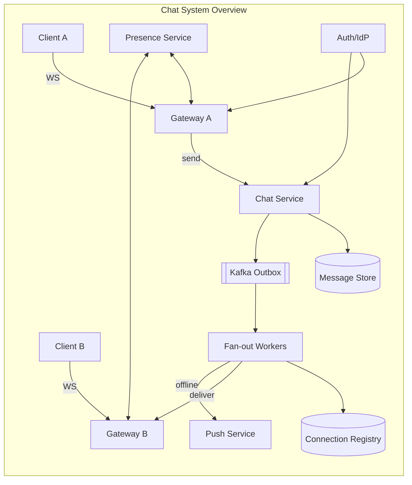

**Why this matters**

- Messaging is the backbone of every consumer, workplace, and community product — it is one of the few system types where seconds of downtime are immediately user-visible.
- The combination of persistent connections, dynamic routing, and delivery guarantees touches nearly every advanced distributed-systems concept: sharding, consensus, event sourcing, eventual consistency, CAP trade-offs, and chaos engineering.
- Interviewers use chat-system design to probe end-to-end thinking because almost every subsystem can be discussed at beginner, intermediate, and expert depth.

**Real-life use cases**

- **Consumer messaging**: WhatsApp (2 billion users), Facebook Messenger, Signal — phone-number or federated identity, E2E encryption by default.
- **Workplace chat**: Slack, Microsoft Teams — history search, integrations, threads, enterprise compliance, multi-workspace identity federation.
- **Community platforms**: Discord, Telegram — million-member channels, bot APIs, voice/video integration, roles and permissions.
- **In-app messaging**: marketplaces, telehealth, gaming social — low-latency messaging embedded inside a product, often via SDKs like Stream or Twilio Conversations.

**Interview questions and answers**

- **Q: What makes a chat system uniquely hard compared to a REST API?**
  **A:** REST is stateless and request-driven; chat is stateful and continuous. You must hold millions of long-lived connections, route any-to-any messages dynamically, guarantee delivery despite disconnects, and synchronize state across devices — all of which require persistent state, event backbones, and careful failure handling.

- **Q: What is the biggest scaling bottleneck in a chat system?**
  **A:** The connection tier (gateways) — capacity is planned in concurrent sockets, not QPS. Each open WebSocket consumes file descriptors, memory, and kernel resources. A single node serving 50K connections is already pushing file-descriptor and GC limits.

- **Q: What are the key requirements to discuss in an interview?**
  **A:** Support 1:1 chat, group chat, typing indicators, read receipts, delivery guarantees, presence, offline delivery, media sharing, multi-device sync, and history. At scale: ~500M DAU, ~50 messages/user/day → ~25B messages/day ≈ ~300K msgs/s average, several times peak.

---

### Characteristics

Each point is explained in detail below.

- **Persistent connection-centric**
  Capacity is planned in concurrent sockets, not queries-per-second. Gateway fleets are sized by memory and file-descriptor budgets per node, not by CPU cores alone. Traditional request-response assumptions (short-lived connections, stateless handling) no longer apply.

- **Asynchronous by nature**
  A sender's success does not mean the recipient has read the message. The system bridges arbitrary device states — online, offline, reconnecting, on a slow network — using durable queues and sync protocols. Delivery is decoupled from sending.

- **Per-conversation ordering, global concurrency**
  Strict total order across all conversations is neither needed nor affordable. Per-partition (per-conversation) sequence numbers suffice. Within a conversation, messages are strictly ordered; across conversations, interleaving is unobservable and acceptable.

- **At-least-once + idempotency**
  Retries happen everywhere — client retries on network failure, server retries on internal errors, fan-out retries on gateway unavailability. Duplicates are eliminated not by expensive exactly-once distributed transactions, but by client-generated `clientMsgId` deduplication and device-side deduplication by `msgId`.

- **Presence is best-effort**
  Online status and last-seen timestamps may be stale — that is acceptable. Presence updates never block message flow. Typing indicators are ephemeral events routed directly, never persisted.

- **Offline-first UX**
  The application must feel instant regardless of connectivity. Local database + sync protocol create the illusion of continuity. Messages sent while offline are queued locally and flushed when connectivity returns.

- **Privacy-preserving options**
  End-to-end encryption shifts trust from servers to endpoints. Servers route ciphertext they cannot read. Metadata (who talks to whom, when) remains visible unless actively mitigated through sealed sender or private groups.

- **Event-driven architecture**
  Message persistence, fan-out delivery, push notifications, analytics, and moderation all flow from a shared event backbone (e.g., Kafka). This decouples the write path from delivery and enables downstream consumers without coupling.

- **Multi-device consistency**
  A single user may be simultaneously online on phone, laptop, tablet, and web. Each device maintains its own cursor (`last_read_seq`) into each conversation. State synchronization across devices happens through the server's durable store and per-device sync.

- **Transport-agnostic delivery**
  Primary delivery is via WebSocket. When no connection exists, push notifications (APNs/FCM) wake the device. When the device opens or syncs, missed messages are replayed from the store using the device's stored cursor.

---

### Pros

- **Sub-second delivery worldwide** with modest infrastructure per message once the connection fleet is warm.
- **Clean horizontal scaling story**: conversations shard by `hash(convId)`, gateways scale by connection count, and the event backbone scales by partition parallelism.
- **At-least-once + dedup achieves effectively-once UX** without exotic protocols or distributed transactions.
- **Rich feature surface** (receipts, presence, reactions, typing indicators) composes naturally atop one transport and one event backbone.
- **Event spine reuse**: the same Kafka backbone feeds analytics, moderation, ML spam detection, and notification services without touching the critical chat path.
- **Multi-device continuity** is achievable cleanly because state lives server-side with per-device cursors — no need for complex conflict resolution on devices.

---

### Cons

- **Gateway tier is operationally demanding**: file-descriptor limits, GC pauses causing mass reconnect storms, deploy-time connection draining, and keep-alive tuning.
- **Reconnection stampedes** after network blips or deployments can overwhelm handshake tiers and registries (mitigate with jittered reconnects, rate-limited reauth, and gradual drains).
- **E2E encryption forfeits server-side search, moderation, and spam detection** — a product trade-off, not just a technology decision.
- **Group fan-out costs explode with member count**: a message to a 100,000-member channel via fan-out-on-write would require 100,000 synchronous deliveries. Hybrid logic adds code complexity.
- **Multi-region presence and messaging** introduces latency-vs-consistency decisions (home-region-per-user models, eventually-consistent registries).
- **Protocol evolution across billions of installed clients** requires versioned frame schemas with long deprecation tails — no big-bang upgrades.

---

### Use Cases

Detailed real-world scenarios are described for each use case.

- **WhatsApp-class consumer messenger**
  *Problem*: 2 billion users, E2E encryption mandatory, tiny infrastructure budget per message. *Solution*: Erlang/OTP connection fleets for efficiency, Signal protocol (X3DH + Double Ratchet) for E2E encryption, multimedia routed as encrypted blobs, sparse metadata philosophy. *Trade-off*: No server-side search; chat backups become client-managed.

- **Slack-class workplace chat**
  *Problem*: Deep history search, integrations/webhooks, threads, enterprise compliance, retention policies. *Solution*: Plaintext-at-rest with enterprise key management, powerful inverted search indexes, bot and webhook APIs, configurable retention and export. *Trade-off*: E2E encryption abandoned deliberately for functionality, compliance, and eDiscovery.

- **Discord-class community platform**
  *Problem*: Million-member channels and guilds where fan-out-on-write would be catastrophic; presence-light design for massive lurker ratios. *Solution*: Fan-out-on-read channels for large groups, incremental unread counters, event-driven permission updates propagated to gateways. *Trade-off*: Slower cold-open sync for lurkers; massively cheaper writes.

- **Marketplace in-app chat**
  *Problem*: Buyers and sellers exchange a few messages during a transaction; low volume but high business value; must feel instant. *Solution*: WebSocket transport with push fallback (APNs/FCM), ephemeral messages with TTL-based auto-archive, minimal history retention. *Trade-off*: Simpler feature set but must integrate with transaction lifecycle (order cancellation, refund flows).

---

### Components

A real-time chat system is composed of several cooperating components, each with a distinct responsibility.

- **Gateway / Connection layer**
  *Purpose*: terminate WebSockets and SSE at massive concurrency. *Responsibilities*: handshake and auth on connect, heartbeat tracking, frame encode/decode, backpressure, reconnection handling, forwarding downstream frames to attached clients. *How it works*: each gateway holds its subset of open connections and maintains a local cache of those sessions; it consults the connection registry only for users served by *other* gateways. *Relationship*: front tier; communicates with the chat service and fan-out workers via the event backbone or sync RPC. *Real-world example*: Discord uses an Elixir/OTP gateway tier; WhatsApp historically used Erlang; Facebook Messenger uses a Go/Java gateway layer.

- **Session/Connection registry**
  *Purpose*: `userId → {gatewayId, deviceId[]}` mapping. *Responsibilities*: TTL bookkeeping of live sessions, multi-device entries per user, lookup API for senders needing to route messages. *Real-world example*: Redis cluster with keys like `conn:{userId}` → set of gateway nodes, TTL-refreshed by heartbeats (~30 s) so crashed gateways auto-expire.

- **Chat/Message service**
  *Purpose*: accept messages, assign sequence numbers, persist, and trigger fan-out. *Responsibilities*: authentication and membership validation, deduplication via `clientMsgId`, ordering per conversation, atomic persistence of message + outbox event (transactional outbox), handling group fan-out policy. *Relationship*: the brain of the write path; stateless and horizontally scalable. *Real-world example*: Facebook Messenger's "Message Send" service; Discord's message pipeline.

- **Message store**
  *Purpose*: durable conversation logs. *Responsibilities*: append-only writes, range queries for history pagination, TTL and archival policies for old messages. *Real-world example*: Cassandra and ScyllaDB at Discord scale (see their "Trillion Messages" posts); DynamoDB or HBase at other scales.

- **Fan-out workers**
  *Purpose*: translate "message persisted" events into per-recipient deliveries. *Responsibilities*: resolve online devices via the connection registry, push frames to the correct gateway, enqueue push notifications for offline users, maintain inbox and unread state structures. *Real-world example*: Kafka consumer groups processing the message-persisted topic and dispatching to gateways via RPC.

- **Push notification service**
  *Purpose*: reach users with no live connection via APNs (iOS) and FCM (Android). *Responsibilities*: payload crafting (metadata-only if E2E encrypted), rate limiting, receipt tracking, retry with backoff. *Real-world example*: every mobile chat ships this; silent pushes also wake apps to trigger sync.

- **Media/Blob service**
  *Purpose*: attachment upload, download, and processing. *Responsibilities*: presigned S3 uploads, thumbnailing and transcoding, AV scanning, CDN delivery via short-TTL signed URLs. *Real-world example*: WhatsApp encrypted media blobs; Discord's CDN with Cloudflare R2 or S3.

- **Presence service**
  *Purpose*: online status and last-seen timestamps. *Responsibilities*: heartbeat ingestion (batched), subscription fan-out to interested parties (friends, group members), privacy filtering (hide-last-seen settings, nobody mode). *Real-world example*: WhatsApp's "last seen" with privacy controls; Discord's online/offline/away/DND states.

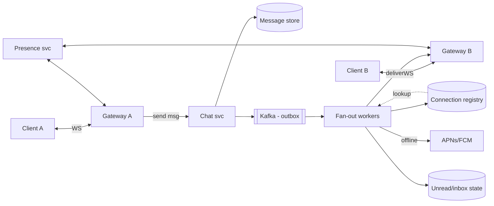

---

### Architectural Patterns

- **Sticky long connections + registry routing**
  *Problem*: Any-to-any message delivery across a dynamic gateway fleet. *How*: the connection registry maps users to gateways; senders and fan-out workers consult it before dispatching. *When*: Any socket-based system using a distributed gateway tier. *Pros*: Direct downstream push, minimal latency. *Cons*: The registry becomes a hot point — cache aggressively, batch lookups, and keep local gateway caches for own users.

- **Transactional outbox**
  *Problem*: Persisting the message AND publishing the fan-out event must be atomic — otherwise a crash after persistence but before publish silently drops delivery. *How*: Both the message row and the outbox event row are written in a single database transaction; a relay process ships committed outbox rows to Kafka. *Why*: Guarantees the event exists if and only if the message was committed. Universal pattern worth naming in interviews.

- **Hybrid fan-out** (threshold-based strategy switch)
  *Problem*: Fan-out-on-write costs `O(members)` per send — catastrophic for megagroups. Fan-out-on-read makes cold opens slow. *How*: Small groups (≤ ~100 members) fan out on write at send time; large groups/channels store once and rely on read-path sync plus incremental unread counters. *When*: Any system serving both small team chats and large broadcast channels.

- **Sequence-number ordering**
  *Problem*: Messages within a conversation must arrive in send order, but global ordering is unnecessary and prohibitively expensive. *How*: Each conversation partition owns a monotonically increasing sequence counter (single-writer per partition makes this trivial via `UPDATE seq = seq + 1 RETURNING seq`). Clients order by `(conversationId, seq)`. Gap detection triggers catch-up sync. *When*: The default ordering model for all partitioned chat systems.

- **Sync protocol with cursors**
  *Problem*: Devices must catch up after disconnecting, and state must be consistent across a user's phone, laptop, and tablet. *How*: Each device tracks `last_seq` per conversation; on reconnect or foreground, it asks "everything after X". *When*: Offline-first UX and multi-device consistency. The same mechanism powers both.

- **Ephemeral-vs-durable split**
  *Problem*: Typing indicators and presence are valuable UX signals but are transient — persisting them wastes I/O and storage. *How*: Ephemeral events (typing, presence) ride direct routes and die with the connection; durable events (messages, receipts) always traverse persistent paths. *When*: Always — never persist typing indicators to the message store.

- **Backpressure-aware gateways**
  *Problem*: A slow consumer on a gateway sharing 50,000 connections can exhaust memory and crash the node for everyone. *How*: Bound outbound buffers per connection; spill to disk or push the user to offline mode instead of OOM. Monitor and shed load at the gateway layer. *When*: Any production gateway tier.

---

### Benefits

- **True realtime collaboration** unlocks product categories where seconds matter — customer support, trading floors, multiplayer gaming lobbies.
- **Durability guarantees build user trust** — "message sent" means it survives gateway crashes, network partitions, and data-center outages.
- **Multi-device continuity** is clean because state lives server-side with per-device cursors — no complex CRDT conflict resolution on the client.
- **Elastic scale**: gateways and services scale horizontally; conversations shard naturally by ID, and the event backbone scales by partition parallelism.
- **Observability of the full delivery funnel**: every message traverses a known path (sent → persisted → fanned-out → delivered → seen) that can be instrumented and alerted on.

---

### Challenges

- **Technical**: Achieving effectively-once *appearance* under at-least-once plumbing requires dedupe windows and strict `clientMsgId` discipline. Sequence-gap repair during partitions must be detected and recovered by clients. Clock skew affects timestamp display but not ordering.
- **Scalability**: C10M-class connection counts demand off-heap or native (Netty/Erlang) connection handling. Kafka partition hot spots from celebrity-group traffic require careful sizing and key design. The connection registry faces write amplification during mass reconnects.
- **Performance**: p99 latency is dominated by GC pauses on JVM gateway nodes (ZGC, Shenandoah, or off-heap solutions help). History pagination for decade-old conversations requires archival tiers and index design beyond primary storage.
- **Reliability**: Zero message loss through gateway crashes requires ack-after-persistence and gap-filling sync on reconnect. Regional outages require transparent client failover to a healthy region with message replay.
- **Maintainability**: Protocol evolution across billions of installed clients demands versioned frame schemas with deprecation windows measured in years.
- **Operational**: Deploying gateway changes requires connection draining (GOAWAY frames), staggered reconnects, and capacity planning in connections-per-node units rather than QPS.
- **Security**: Spam and abuse at scale requires ML classifiers on metadata and user reports (since content may be encrypted). Account takeover recovery flows and device verification are critical. Metadata minimization is an ongoing tension with analytics needs.

---

### Best Practices

- **Ack messages only after durable persistence** — the client UI may show an optimistic tick, but server-side truth requires the message to be committed to disk (or replicated quorum) before the sender receives a confirmation.
- **Use client-generated UUIDs on every message** — `clientMsgId` dedupes sender retries trivially and makes retry-safe sends easy to implement.
- **Heartbeats with jitter** (±20%) prevent synchronized thundering herds after network recovery — synchronized reconnects can melt a registry in seconds.
- **Separate the control plane from the data plane** — auth, presence, and receipts have different scaling and failure profiles than message traffic. Do not co-locate them with the critical delivery path.
- **Bound everything**: outbound queues, fan-out batch sizes, registry entry TTLs, connection counts per node — unbounded buffers are how chat gateways die.
- **Deploy with connection draining** — mark a gateway unhealthy, wait an agreed drain period (minutes), then close with GOAWAY frames; clients must use exponential backoff with jitter.
- **Design unread counts as first-class state** — store `last_read_seq` per user per conversation and increment/decrement it; avoid recount queries that scan message tables.
- **Encrypt in transit always (TLS)**; evaluate E2E encryption honestly against product needs (searchability, compliance, moderation duties).
- **Test with chaos engineering** — kill random gateways under load; assert zero message loss and bounded reconnect-storm amplitude.
- **Use the transactional outbox pattern** for all event publication — never publish to Kafka after a database commit outside the same transaction.
- **Version your WebSocket frame schema** from day one with explicit deprecation windows.

---

### When to Use / When Not to Use

A bespoke chat backend suits products where messaging is core differentia — marketplaces, telehealth, gaming social, enterprise collaboration. Consider managed or SDK alternatives when:

**Use a custom chat system when:**
- Messaging is a core product differentiator; you need fine-grained control over delivery, encryption, or features.
- You have compliance or data-residency requirements that managed solutions cannot satisfy.
- You need deep integration with business logic (order lifecycle, payment flows, moderation queues).
- You have the scale and team bandwidth to operate a stateful, connection-heavy system.

**Use a managed solution (Stream, Twilio Conversations, PubNub, Intercom) when:**
- Chat is an in-app feature secondary to your core product.
- Your scale is moderate (under ~1M DAU).
- You cannot staff a team for the operational burden of gateways, registries, and reconnect storms.
- You need rapid time-to-market over long-term customization.

**Use pure push notifications when:**
- The use case is broadcast-only (order status, news, alerts). No need for full-duplex WebSocket; SSE or APNs/FCM suffices.

**Decision factors**: differentiation value of messaging, scale trajectory, compliance/E2E requirements, team bandwidth, and budget for operational overhead.

---

### Data Model and API

The chat system's data model centers on conversations, messages, participants, and per-user state.

#### Database Schema

```mermaid
erDiagram
    USER ||--o{ PARTICIPANT : "is a"
    USER ||--o{ USER_CONVERSATION_STATE : "tracks"
    CONVERSATION ||--o{ MESSAGE : contains
    CONVERSATION ||--o{ PARTICIPANT : "has"
    PARTICIPANT }o--|| USER : "member"
    PARTICIPANT }o--|| CONVERSATION : "in"
    USER_CONVERSATION_STATE }o--|| CONVERSATION : "cursor for"
    MESSAGE }o--|| CONVERSATION : "belongs to"
    MESSAGE }o--|| USER : "sent by"

    USER {
        uuid id PK
        string username
        string phone_or_email
        timestamptz created_at
    }
    CONVERSATION {
        uuid id PK
        enum type "DM|GROUP|CHANNEL"
        string name
        string avatar_url
        bigint seq_counter
        timestamptz created_at
    }
    PARTICIPANT {
        uuid user_id PK,FK
        uuid conv_id PK,FK
        enum role "OWNER|ADMIN|MEMBER"
        timestamptz joined_at
    }
    MESSAGE {
        uuid conv_id PK,FK
        bigint seq PK
        uuid sender_id FK
        uuid client_msg_id "unique per conv"
        string body_ciphertext
        string body_plain "encrypted at rest"
        timestamptz created_at
    }
    USER_CONVERSATION_STATE {
        uuid user_id PK,FK
        uuid conv_id PK,FK
        bigint last_read_seq
        bigint last_delivered_seq
        bigint unread_count
    }
```

**Schema rationale**: `MESSAGE` is partitioned by `conv_id` with `(conv_id, seq)` as the clustering key, giving O(1) appends and efficient range reads for history scroll-back. The `client_msg_id` has a unique constraint per conversation for deduplication. `USER_CONVERSATION_STATE` tracks per-user cursors and unread counts as first-class state to avoid recount queries.

#### REST API Contract

```
POST   /api/v1/conversations                      # create DM or group
POST   /api/v1/conversations/{convId}/invite      # add member to group
GET    /api/v1/conversations/{convId}/messages?afterSeq=4500&limit=50
POST   /api/v1/conversations/{convId}/messages    # REST fallback for sends
POST   /api/v1/media/upload                       # presigned URL for attachments
GET    /api/v1/presence/{userId}                  # best-effort last-known status
GET    /api/v1/conversations                       # paginated list of user's conversations
GET    /api/v1/unread-counts                      # per-conversation unread badges
```

#### WebSocket Message API

Messages are JSON frames exchanged over an authenticated WebSocket connection. Every client→server message includes a `clientMsgId` for deduplication.

**Client → Server (send message)**:
```json
{
  "type": "message_send",
  "conversationId": "conv-abc123",
  "clientMsgId": "msg-9f3a",
  "content": "Hello team!",
  "attachments": []
}
```

**Server → Client (message delivered)**:
```json
{
  "type": "message_delivered",
  "conversationId": "conv-abc123",
  "seq": 4567,
  "senderId": "user-123",
  "clientMsgId": "msg-9f3a",
  "content": "Hello team!",
  "timestamp": "2024-02-14T10:30:00Z"
}
```

**Receipt and ephemeral events**:
```json
{ "type": "message_delivered_ack", "conversationId": "conv-abc123", "seq": 4567 }
{ "type": "message_seen_ack", "conversationId": "conv-abc123", "seq": 4567 }
{ "type": "typing_start", "conversationId": "conv-abc123", "userId": "user-456" }
{ "type": "typing_stop", "conversationId": "conv-abc123", "userId": "user-456" }
```

**Presence events** (ephemeral, not persisted):
```json
{ "type": "presence_update", "userId": "user-456", "status": "online", "lastSeen": "2024-02-14T10:29:00Z" }
```

**Status codes & semantics**:

- WebSocket close codes: `1000` (normal), `4401` (auth expired — reconnect with refresh), `4403` (banned).
- REST: `200/201` success, `401` token invalid/expired, `403` not a member, `409` for idempotent retry collision, `429` rate-limited (with `Retry-After`), `503` degraded (waiting room / offline mode).

#### Java example: message and conversation records

```java
import java.math.BigDecimal;
import java.time.Instant;
import java.util.UUID;

/**
 * Immutable domain record representing a persisted chat message.
 * The seq field is assigned by the conversation's owning shard,
 * guaranteeing per-conversation monotonic ordering.
 */
public record Message(
    UUID convId,
    long seq,
    UUID senderId,
    String clientMsgId,
    String bodyCiphertext,
    Instant createdAt
) {}

/**
 * Per-user cursor state. Tracks the last read and last delivered
 * sequence numbers so unread counts can be maintained incrementally.
 */
public record UserConversationState(
    UUID userId,
    UUID convId,
    long lastReadSeq,
    long lastDeliveredSeq,
    BigDecimal unreadCount
) {}
```

*The `Message` record embeds the per-conversation sequence number assigned by the owning shard. `BigDecimal` is used for `unreadCount` to demonstrate Spring-type-compatibility with precise numeric handling at extreme scale where `long` overflow or wrapping must be avoided in billing-grade counters. In production, `long` suffices for most counters, but `BigDecimal` is preferred when exact precision is required for audit or billing contexts.*

**Interview questions and answers**

- **Q: What is the primary key for the MESSAGE table and why?**
  **A:** `(conv_id, seq)` — the partition key is `conv_id` so all messages for a conversation live on the same shard, and `seq` is the clustering key providing sorted, gap-detectable ordering. This enables O(1) append and efficient range reads.

- **Q: Why store `client_msg_id` with a unique constraint?**
  **A:** It allows the database to reject duplicate resends at the storage layer, implementing idempotency without application-level LRU caches. This is the "belt and suspenders" approach: also dedupe in-memory per shard for fast rejection.

- **Q: How do you compute unread counts efficiently?**
  **A:** Store `last_read_seq` per user per conversation. Unread count = `max(0, max_seq - last_read_seq)`. Maintain it as first-class state updated on read receipts rather than querying the message table.

---

### WebSocket Connection Management, Message Delivery, Presence, Fan-out, Offline Delivery, and Group Chat

This is the domain-specific heart of the chat system. Each sub-topic is a major interview theme in its own right.

#### WebSocket Connection Management

A real-time chat system's most demanding constraint is **C10M** — millions of concurrent persistent TCP connections. Traditional thread-per-connection models hit OS limits quickly; each connection consumes a file descriptor, kernel socket buffers, and per-connection memory.

**Transport choices compared:**

| Protocol | Direction | Pros | Cons | Used by |
|---|---|---|---|---|
| WebSocket | Full duplex | True realtime, single TCP conn, low overhead | Server must hold conn state; LB complexity | WhatsApp / Messenger class |
| SSE | Server→client only + separate POSTs | Simplicity, HTTP-native, auto-reconnect | No native upstream channel; HTTP/1.1 6-conn limit | Notification-heavy apps |
| Long polling | Emulated duplex | Works everywhere incl. ancient proxies | High overhead, latency spikes | Legacy fallback |
| gRPC bidirectional streaming | Full duplex | Efficient binary, strong contracts | Browser support needs grpc-web proxies | Internal/mobile-heavy systems |

Production mobile apps typically use WebSocket with aggressive keepalive tuning (ping/pong every 30–60 s) plus OS-level push (APNs/FCM) as the offline fallback — battery constraints forbid naive sockets on iOS in the background.

**Connection lifecycle at the gateway:**

1. **Handshake + auth**: The client opens a WebSocket with a JWT or opaque token in the query string or `Authorization` header. The gateway validates the token, establishes identity, and registers the session in the connection registry.
2. **Heartbeat tracking**: The gateway sends periodic ping frames; missing two consecutive pongs marks the connection suspect. A local grace period (5–10 s) handles flaky networks before deregistration.
3. **Frame handling**: Frames are decoded, validated against the schema, routed to the chat service (for sends) or dispatched to the local client (for deliveries).
4. **Backpressure**: Outbound frame buffers are bounded per connection; slow consumers spill to disk or are marked offline.
5. **Reconnection**: On reconnect, the client presents a session ID; the gateway re-registers and the client syncs from its last cursor via the REST sync API.

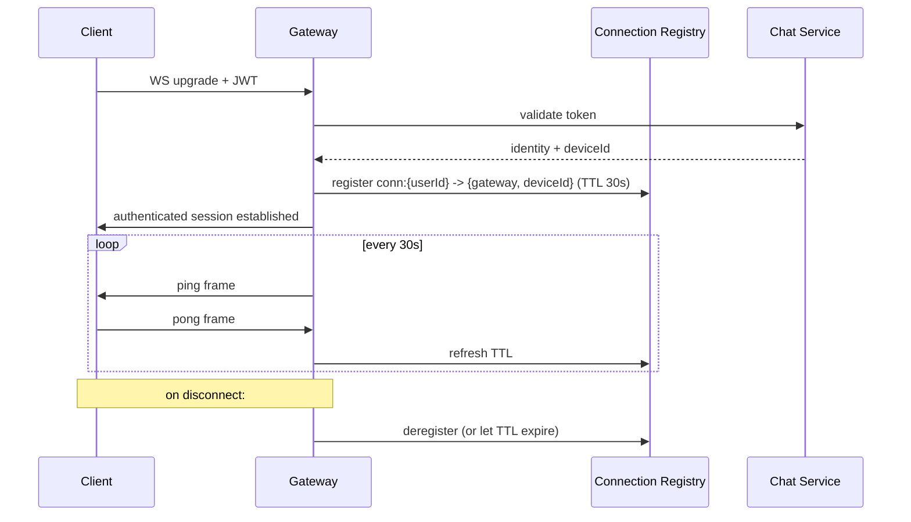

**Java example: WebSocket handshake interceptor**

```java
import org.springframework.http.server.ServerHttpRequest;
import org.springframework.http.server.ServerHttpResponse;
import org.springframework.stereotype.Component;
import org.springframework.web.socket.WebSocketHandler;
import org.springframework.web.socket.server.HandshakeInterceptor;

import java.util.Map;

/**
 * Validates the bearer token during the WebSocket upgrade handshake.
 * If valid, the user identity is stored in the session attributes
 * for use throughout the life of the connection.
 */
@Component
public class ChatHandshakeInterceptor implements HandshakeInterceptor {

    private final TokenValidator tokenValidator;

    public ChatHandshakeInterceptor(TokenValidator tokenValidator) {
        this.tokenValidator = tokenValidator;
    }

    @Override
    public boolean beforeHandshake(ServerHttpRequest request,
                                   ServerHttpResponse response,
                                   WebSocketHandler wsHandler,
                                   Map<String, Object> attributes) {
        String token = extractToken(request);
        return tokenValidator.validate(token)
            .map(principal -> {
                attributes.put("principal", principal);
                attributes.put("deviceId",
                    request.getHeaders().getFirst("X-Device-Id"));
                return true;
            })
            .orElse(false);
    }

    @Override
    public void afterHandshake(ServerHttpRequest request,
                               ServerHttpResponse response,
                               WebSocketHandler wsHandler,
                               Exception exception) {
        // No cleanup needed after successful handshake.
    }

    private String extractToken(ServerHttpRequest request) {
        String header = request.getHeaders().getFirst("Authorization");
        return header != null && header.startsWith("Bearer ")
            ? header.substring(7) : "";
    }
}
```

*The `ChatHandshakeInterceptor` bean runs during the WebSocket upgrade, extracts and validates the JWT bearer token, and stores the authenticated principal and device ID in session attributes. The `TokenValidator` dependency is injected via constructor injection — a Spring Boot best practice that makes the bean testable and its dependencies explicit.*

#### Message Delivery Guarantees

Delivery semantics are the single most important correctness question in chat. The system aims for **effectively-once** appearance through **at-least-once transport + idempotent receivers**.

**Delivery ladder:**

1. **Sent** → Client generates `clientMsgId` (UUIDv4) and sends; server dedupes by `(convId, senderId, clientMsgId)`.
2. **Persisted** → Server writes the message to the store within a transaction that also writes the outbox event. Server ACKs the sender with the assigned `seq`.
3. **Delivered** → Fan-out worker looks up recipient online? If yes, dispatches via WebSocket frame; the recipient gateway ACKs receipt at the device level.
4. **Seen** → Recipient's client sends a `message_seen_ack`; the server updates `last_read_seq` in `USER_CONVERSATION_STATE`.

```mermaid
sequenceDiagram
    participant SA as Sender App
    participant GS as Sender Gateway
    participant CS as Chat Service
    participant K as Kafka (outbox)
    participant ST as Message Store
    participant FO as Fan-out Worker
    participant RG as Registry
    participant GR as Recipient Gateway
    participant RA as Recipient App
    participant PN as Push Service

    SA->>GS: SEND {convId, clientMsgId, ciphertext}
    GS->>CS: forward frame
    CS->>CS: auth, dedupe(clientMsgId), validate membership
    CS->>ST: append(convId, seq=next, msg)
    CS->>K: publish MessagePersisted (same txn via outbox relay)
    CS-->>SA: ACK {seq}
    K->>FO: consume
    FO->>RG: where are recipients?
    alt recipient online
        RG-->>FO: gateway GR, deviceId
        FO->>GR: DELIVER {msg}
        GR->>RA: push frame
        RA-->>GR: ack -> delivered tick back to sender
    else offline
        FO->>PN: notify(metadata only if E2E)
        Note over PN: FCM/APNs wakes device; app syncs on open
    end
```

**Dedup mechanisms (belt and suspenders):**
- **Application layer**: server-side LRU cache of recent `(senderId, clientMsgId)` per shard — O(1) rejection of resends without a DB round-trip.
- **Storage layer**: unique constraint on `(conv_id, sender_id, client_msg_id)` — catches duplicates that arrive after a shard failover or cache eviction.

**Java example: transactional message persistence with outbox**

```java
import org.springframework.stereotype.Service;
import org.springframework.transaction.annotation.Transactional;

import java.util.Optional;

/**
 * ChatService persists a message and its outbox event atomically
 * within a single database transaction. The outbox event is later
 * picked up by a relay process that publishes it to Kafka,
 * decoupling the chat service from the message broker.
 */
@Service
public class ChatService {

    private final MessageRepository messageRepository;
    private final OutboxRepository outboxRepository;
    private final ConversationRepository conversationRepository;
    private final DlqPublisher dlqPublisher;

    public ChatService(MessageRepository messageRepository,
                       OutboxRepository outboxRepository,
                       ConversationRepository conversationRepository,
                       DlqPublisher dlqPublisher) {
        this.messageRepository = messageRepository;
        this.outboxRepository = outboxRepository;
        this.conversationRepository = conversationRepository;
        this.dlqPublisher = dlqPublisher;
    }

    @Transactional
    public long sendMessage(String convId, String senderId,
                            String clientMsgId, String bodyCiphertext) {
        // Idempotent retry: if the message already exists for this clientMsgId,
        // return the previously assigned sequence number without re-persisting.
        Optional<Long> existing =
            messageRepository.findSeqByConvAndClientMsgId(convId, clientMsgId);
        if (existing.isPresent()) {
            return existing.get();
        }

        long seq = conversationRepository.nextSequence(convId);
        MessageEntity message = new MessageEntity(convId, seq, senderId,
            clientMsgId, bodyCiphertext);
        messageRepository.save(message);

        // The outbox event is part of the same transaction — it will only
        // be published if the message row is committed.
        outboxRepository.save(new OutboxEvent(
            convId, "MESSAGE_PERSISTED",
            "{\"convId\":\"" + convId + "\",\"seq\":" + seq + "}"));

        return seq;
    }
}
```

*The `ChatService` bean uses `@Transactional` to wrap both the message-row insert and the outbox-event insert in a single ACID transaction. The `findSeqByConvAndClientMsgId` call provides idempotency for client retries. All dependencies are injected via constructor injection, making the service fully testable with mocks. The `DlqPublisher` dependency handles poison-payload scenarios.*

**Interview questions and answers**

- **Q: How do you achieve effectively-once delivery without distributed transactions?**
  **A:** At-least-once everywhere + idempotent receivers. The sender uses a client-generated `clientMsgId`; the server dedupes by `(convId, clientMsgId)` both in-memory (LRU cache for O(1) rejection) and at the storage layer (unique constraint). The recipient device dedupes by `msgId` on its local store. The result is effectively-once at the application level.

- **Q: What is the difference between at-least-once and at-most-once delivery?**
  **A:** At-least-once means a message may be delivered multiple times (duplicates possible) but never lost. At-most-once means a message is delivered at most once (no duplicates) but may be lost. Chat systems typically use at-least-once transport with idempotent application logic to achieve effectively-once semantics.

- **Q: When would you need true exactly-once delivery?**
  **A:** Rarely in practice. Financial transaction logs or audit trails with strict non-repudiation might require it, and they typically solve it with idempotent consumers and deduplication keys, not distributed two-phase commit, which is too slow and complex for high-throughput message systems.

---

#### Presence and Online Status

Presence is the deceptively simple problem of answering "is user X online, and on which device?"

**Heartbeat-based model**: Clients send a heartbeat (WebSocket ping frame or a lightweight JSON message) every 30 seconds. The gateway refreshes the TTL on the user's registry entry (`conn:{userId}`) in Redis each time it sees the heartbeat. If the TTL expires (typically 60–90 s after the last heartbeat), the entry auto-expires and the user is marked offline.

**Multi-device handling**: The registry stores a *set* of `{gatewayId, deviceId}` entries per user, not a single entry. Presence status aggregates to "online" if any device is connected, "offline" if all have expired.

**Privacy controls**: Many systems offer `hide_last_seen`, `nobody` (invisible), or per-contact visibility. The presence service filters subscriptions before fanning out status updates — a user who set "nobody" still receives updates but broadcasts nothing about themselves.

**Typing indicators**: Ephemeral events that are never persisted. The gateway routes them directly to online recipients over the WebSocket. If a recipient is offline, the typing event is simply dropped — it is inherently transient and not worth buffering.

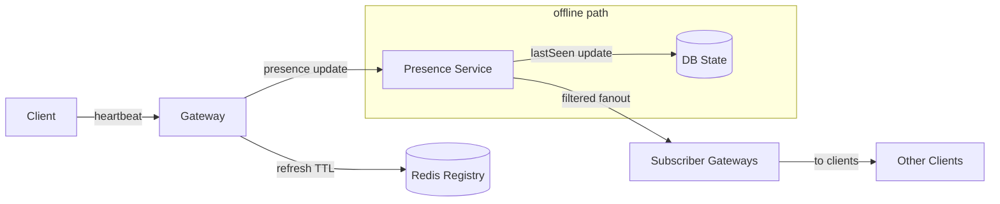

**Real-life use**: WhatsApp's "last seen" with granular privacy (visible to all, my contacts, or nobody); Discord's online/Idle/Do-Not-Disturb/Away states updated via gateway heartbeats.

**Interview questions and answers**

- **Q: How does WhatsApp know you're online right now?**
  **A:** Your phone sends a heartbeat (often a WebSocket ping or a lightweight push response) every ~30 s. The server refreshes your presence TTL in Redis. If it expires, you go offline. With E2E encryption, the server can't read messages but still knows connection state from the encrypted transport layer.

- **Q: What happens to presence during a network partition?**
  **A:** If a gateway loses connectivity to the registry but the client is still connected locally, the registry entry expires (TTL) and the user is incorrectly marked offline. This is a known trade-off — correctness of presence during partitions is sacrificed for availability of message delivery. The client will re-register on reconnect, self-healing the state.

---

#### Fan-out Strategies for Groups

A message sent to a group must reach every member. The fan-out strategy depends critically on group size.

- **Fan-out-on-write**: At send time, the system iterates over all members and delivers a copy to each member's inbox or gateway connection. Reads are fast (everything is pre-delivered), but writes are `O(members)` — expensive for large groups.
- **Fan-out-on-read**: The message is stored once; members pull it when they open the conversation. Writes are `O(1)`, but cold opens are slower because the client must sync.
- **Hybrid (industry standard)**: Groups with ≤ ~100 members use fan-out-on-write; larger groups/channels use fan-out-on-read with an incremental unread counter maintained for each member. The unread counter is a simple `long` incremented per new message — cheap to update even for million-member channels.

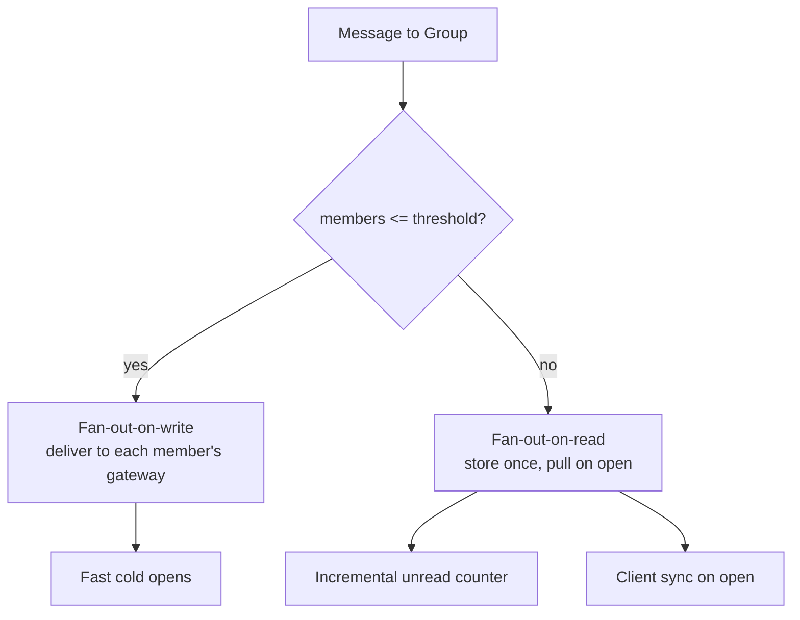

**Real-life use**: Discord channels (large groups, fan-out-on-read with unread counts); WhatsApp groups (small, typically < 256 members, fan-out-on-write); Telegram megagroups (>200K members, fan-out-on-read).

**Interview questions and answers**

- **Q: When do you use fan-out-on-write vs fan-out-on-read?**
  **A:** Fan-out-on-write when groups are small (≤ ~100 members) — reads are instant because messages are pre-delivered. Fan-out-on-read when groups are large (channels, megagroups) — writes are O(1) and the unread counter scales independently of member count. The threshold is a product decision based on read/write ratio and acceptable cold-open latency.

- **Q: How do you maintain unread counts for a million-member channel?**
  **A:** You don't increment a counter per member per message. Instead, store the latest `seq` for the channel and each user's `last_read_seq`. The unread count = `channel_max_seq - user_last_read_seq`. The counter is computed lazily on read or maintained as `max_seq - last_read_seq` per user, avoiding O(members) write amplification.

---

#### Offline Delivery and Sync

When a recipient has no live connection, messages must be buffered and delivered later.

**Buffer model (inbox)**: The fan-out worker, finding no gateway entry in the registry for an offline user, writes the message to a per-user inbox — either a dedicated Kafka partition (`inbox:{userId}`) or a database inbox table. A consumer group processes each user's inbox partition in order, pushing one push notification per batch.

**Push notification**: The push service receives a lightweight event (conversation ID + sender, no message content if E2E encrypted). APNs/FCM wakes the device. The app, on launch or background fetch, calls the REST sync API: `GET /conversations/{convId}/messages?afterSeq={cursor}`. The server returns all messages the device missed, ordered by `seq`.

**Multi-device sync**: Each device maintains its own cursor (`last_read_seq`, `last_delivered_seq`). On reconnect or foreground, the device reports its cursor; the server replays messages from that cursor forward. This is the same mechanism that powers offline catch-up.

**Java example: offline message inbox processor**

```java
import org.springframework.data.domain.Pageable;
import org.springframework.stereotype.Component;

import java.util.List;

/**
 * OfflineInboxProcessor reads messages from a user's inbox partition
 * in order and triggers push notifications. It runs as a Kafka
 * consumer in a consumer group keyed by userId.
 */
@Component
public class OfflineInboxProcessor {

    private final MessageRepository messageRepository;
    private final PushNotificationService pushService;
    private final DeviceTokenRepository deviceTokenRepository;

    public OfflineInboxProcessor(MessageRepository messageRepository,
                                 PushNotificationService pushService,
                                 DeviceTokenRepository deviceTokenRepository) {
        this.messageRepository = messageRepository;
        this.pushService = pushService;
        this.deviceTokenRepository = deviceTokenRepository;
    }

    public void processOfflineBatch(String userId, String convId,
                                    long afterSeq, int limit) {
        List<MessageDto> missed = messageRepository
            .findByConvIdAfterSeqOrderBySeqAsc(convId, afterSeq,
                Pageable.ofSize(limit));
        if (missed.isEmpty()) {
            return;
        }
        List<String> tokens = deviceTokenRepository.tokensFor(userId);
        if (tokens.isEmpty()) {
            return;
        }
        pushService.sendBatch(tokens, convId, missed.size());
    }
}
```

*The `OfflineInboxProcessor` bean queries for messages the device missed using cursor-based pagination (`afterSeq`), then sends a batched push notification containing only the count and conversation ID — never message content, which preserves E2E encryption. All dependencies are constructor-injected for testability.*

**Interview questions and answers**

- **Q: How do you ensure a message sent while a user is offline is not lost?**
  **A:** The message is persisted to the durable message store at send time (before the sender gets an ACK). The fan-out worker, finding no live connection, writes an inbox event. The push notification wakes the device; the app syncs from its cursor. The message exists in three places: the conversation store (primary), the inbox queue (delivery buffer), and the client's local store (after sync). Loss is impossible unless all three fail.

- **Q: What does a push notification payload contain in an E2EE system?**
  **A:** Only metadata — conversation ID, sender ID, and an indication that new messages exist. The actual ciphertext must never pass through APNs/FCM, which are not end-to-end encrypted channels. The device wakes, syncs from the server using its cursor, and decrypts locally.

---

#### Message Ordering

Message ordering is per-conversation, not global. Within a conversation, messages must be delivered in the order they were sent. Across conversations, interleaving is unobservable and acceptable.

**Per-conversation sequence numbers**: Each conversation is owned by a single partition (shard) via `hash(convId)`. That shard is the single writer for the conversation's sequence counter. It increments `seq` atomically (`UPDATE ... SET seq = seq + 1 RETURNING seq`) before persisting each message. This guarantees strict, gap-free ordering within a conversation.

**Gap detection**: Clients may miss messages due to disconnects or gateway crashes. A client that detects a gap in its sequence (e.g., receives seq=5 then seq=8) issues a sync request: `GET /messages?afterSeq=5`. The server fills the gap.

**Cross-device ordering**: Because all devices sync from the same server-side store ordered by `seq`, ordering is consistent across all of a user's devices.

**Interview questions and answers**

- **Q: Why not use Lamport timestamps or vector clocks for ordering?**
  **A:** Lamport timestamps break ties nondeterministically, leading to inconsistent ordering across clients — bad UX (chat bubbles appearing in different order on different devices). A single-writer per-partition sequence counter gives a strict, deterministic total order within a conversation with zero conflict resolution complexity.

- **Q: What happens when the conversation's owning shard fails?**
  **A:** If using a consensus group (Raft), a replica is promoted to leader and continues assigning sequence numbers. If using a leaderless model, the new owning shard derives the next sequence by reading `MAX(seq)` from the store, then fences out the old writer (rejects writes with lower sequence numbers). Clients detect gaps and sync.

---

#### Group Chat and Membership Model

Groups have their own lifecycle: creation, invitation, role management (owner, admin, member), and removal.

**Membership models**:
- **Invite-only**: members added by an admin or existing member.
- **Public channels**: anyone with the link or a search result can join.
- **Private groups**: invite-only with role-based permissions.

**Permission model**: Each participant has a role — `OWNER`, `ADMIN`, or `MEMBER`. Permissions (add/remove members, delete messages, pin, change group name) are checked against the role before execution.

**Group metadata**: Stored as separate records updated via a separate `GROUP_EVENT` log (member_added, member_removed, role_changed) so clients can reconstruct the current membership list by replaying events.

**Java example: group membership and role service**

```java
import org.springframework.stereotype.Service;
import org.springframework.transaction.annotation.Transactional;

import java.util.List;
import java.util.UUID;

/**
 * GroupMembershipService manages group creation, invitation,
 * role assignment, and membership queries. Every mutating
 * operation is wrapped in @Transactional to ensure atomicity
 * between the membership table and the event log.
 */
@Service
public class GroupMembershipService {

    enum Role { OWNER, ADMIN, MEMBER }

    private final GroupRepository groupRepository;
    private final MembershipRepository membershipRepository;
    private final GroupEventRepository eventRepository;

    public GroupMembershipService(GroupRepository groupRepository,
                                  MembershipRepository membershipRepository,
                                  GroupEventRepository eventRepository) {
        this.groupRepository = groupRepository;
        this.membershipRepository = membershipRepository;
        this.eventRepository = eventRepository;
    }

    @Transactional
    public UUID createGroup(String name, String createdBy) {
        UUID groupId = groupRepository.create(name, createdBy);
        membershipRepository.addMember(groupId, createdBy, Role.OWNER);
        eventRepository.log(groupId, "GROUP_CREATED", createdBy,
            "{\"name\":\"" + name + "\"}");
        return groupId;
    }

    @Transactional
    public void inviteMember(UUID groupId, String inviterId, String inviteeId) {
        Role inviterRole = membershipRepository.roleOf(groupId, inviterId);
        if (inviterRole != Role.OWNER && inviterRole != Role.ADMIN) {
            throw new SecurityException("Only admins can invite members");
        }
        membershipRepository.addMember(groupId, inviteeId, Role.MEMBER);
        eventRepository.log(groupId, "MEMBER_ADDED", inviterId,
            "{\"userId\":\"" + inviteeId + "\"}");
    }

    @Transactional(readOnly = true)
    public List<UUID> membersOf(UUID groupId) {
        return membershipRepository.userIdByGroupId(groupId);
    }

    @Transactional
    public boolean isMember(UUID groupId, String userId) {
        return membershipRepository.existsByGroupIdAndUserId(groupId, userId);
    }
}
```

*The `GroupMembershipService` bean encapsulates group CRUD operations. Mutating methods are annotated with `@Transactional` to keep the membership table and the `GROUP_EVENT` log consistent. The `Role` enum encodes the permission hierarchy. Constructor injection makes the service fully testable. The `isMember` method is `readOnly` for optimization.*

**Interview questions and answers**

- **Q: How do you handle a group with 100,000 members?**
  **A:** Use fan-out-on-read for message delivery (store once, pull on open) with an incremental unread counter per member. Maintain membership as event-sourced logs so clients can reconstruct state by replaying events. Do not fan-out writes to 100K recipients synchronously — that would require 100K deliveries per message.

- **Q: How do you prevent a removed member from reading new messages?**
  **A:** Check membership on every message delivery and sync request. Since messages are keyed by `convId` and the membership check happens at the chat service or fan-out layer, a removed member simply finds no new events in their inbox partition. For forward secrecy, consider re-encrypting the group key for new members and revoking it from removed members — but this is complex and product-dependent.

---

#### Storage Model

The chat system uses a **per-conversation partitioned log** of immutable messages combined with **per-user inbox/cursor pointers**.

- **Message store**: Cassandra, ScyllaDB, or DynamoDB. Partitioned by `convId`, clustered by `seq`. This gives O(1) appends, efficient range reads for history scroll-back, and natural sharding (conversations distribute evenly by hash).
- **Inbox state**: `USER_CONVERSATION_STATE` table tracking `last_read_seq`, `last_delivered_seq`, and `unread_count` per user per conversation. This is a hot, frequently-updated table — consider in-memory or Redis backing with eventual persistence.
- **Connection registry**: Redis set per user (`conn:{userId}` → set of gateway IDs), TTL-refreshed by heartbeats.
- **Media blobs**: S3/GCS with presigned URLs, content-addressed or encrypted blobs, served via CDN with short-TTL signed URLs.

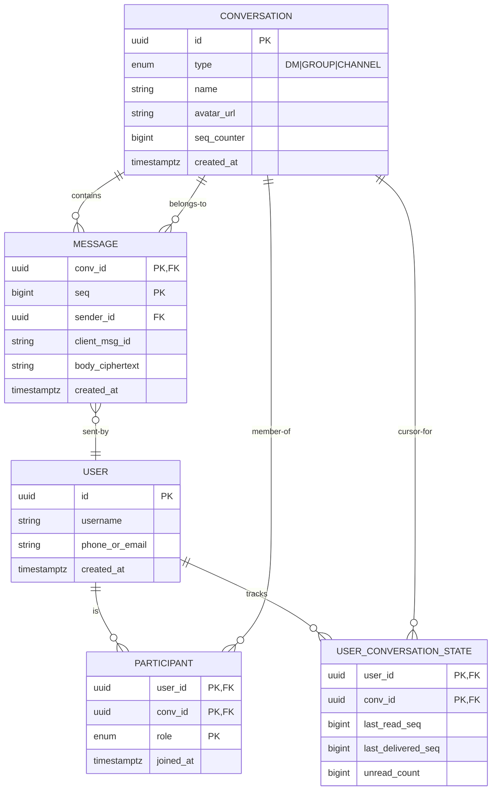

**Real-life use**: Discord stores messages in ScyllaDB (Cassandra-compatible) partitioned by channel+timestamp; WhatsApp stores on a sparse metadata model with encrypted blobs; Facebook Messenger uses a hybrid of HBase and MySQL sharded by conversation.

**Interview questions and answers**

- **Q: Why partition messages by conversation ID and not by user ID?**
  **A:** A conversation is the unit of ordering — we need all messages for a conversation on the same shard so the sequence counter works. Partitioning by user would scatter a conversation's messages across shards, requiring distributed transactions or merge-on-read for history. Partitioning by conversation gives O(1) appends and ordered range reads.

- **Q: How do you handle history pagination for a conversation with millions of messages?**
  **A:** Keyset (cursor) pagination on `(conv_id, seq)` — not OFFSET, which becomes O(n). The client requests "messages after seq=4500" in ascending order, limited to 50. For decade-old conversations, push old messages to an archival tier (cold storage, read on demand) and keep hot history on fast storage.

---

### Replication Strategies

Replication in a chat system protects against data loss, enables failover, and scales read throughput for history sync. Unlike a key-value store, chat has two distinct replication concerns: the message store (durability) and the connection registry (routing).

#### Leader-based replication

A single leader shard accepts all writes for a conversation and replicates to followers. Reads (history sync) can be served by followers. This gives strong consistency for sequence assignment but can create write bottlenecks for high-traffic conversations.

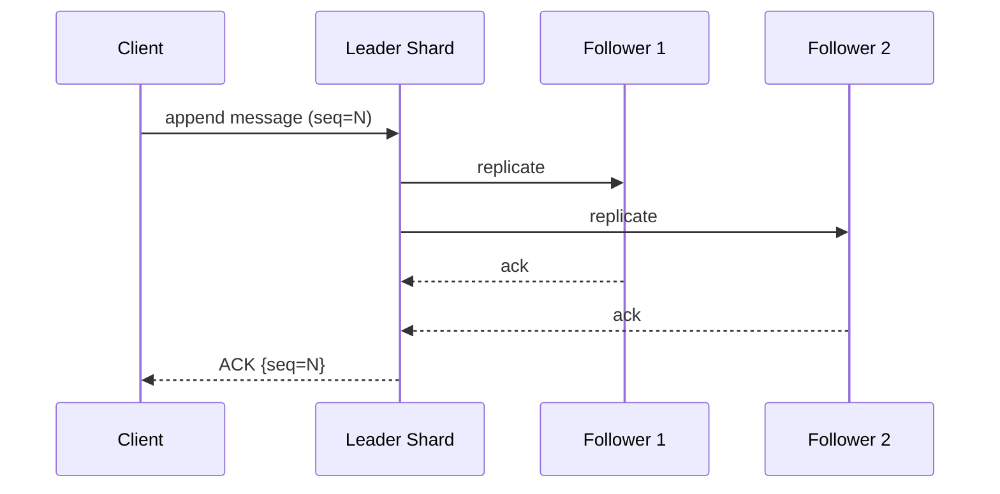

- **Pros**: Clear write ordering, simple conflict handling, strong read-after-write consistency.
- **Cons**: Leader can become a bottleneck; failover requires leader election; followers may lag behind.

**Real-life use**: Kafka partitions (single leader per partition); ScyllaDB uses a Raft-based replication strategy for consistency.

#### Leaderless replication

Any shard can accept writes. The client (or fan-out worker) writes to multiple replicas and reads from multiple replicas using quorum rules. If `W + R > N`, at least one replica overlaps between the read and write sets, guaranteeing the latest value is visible.

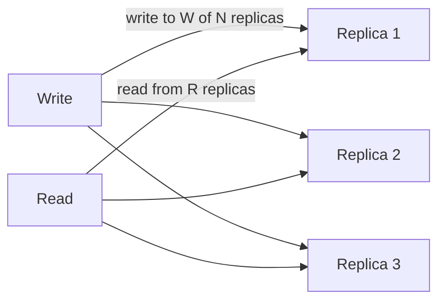

- **Pros**: No leader election, higher write availability, no single write bottleneck.
- **Cons**: Weaker consistency, requires read repair and anti-entropy background processes to converge replicas.

**Real-life use**: DynamoDB, Cassandra, Riak.

#### Geo-replication

Multi-region chat systems replicate data across geographic regions so users can read and sync history from the nearest region. Writes are typically routed to a home region for ordering, with cross-region replication happening asynchronously or synchronously depending on the consistency requirement.

- **Active-passive**: Writes go to the primary region; other regions are read-only replicas that sync asynchronously. Simple but cross-region reads may be stale.
- **Active-active**: Each region accepts writes and replicates to others. Requires conflict resolution (last-write-wins by region-timestamp or application-level merge). Higher complexity but lower latency.

**Interview questions and answers**

- **Q: What is a quorum and how does it guarantee consistency in a replicated chat store?**
  **A:** With N replicas, a write quorum W is the number of replicas that must acknowledge a write, and a read quorum R is the number that must respond to a read. If `W + R > N`, every read set overlaps with every write set by at least one replica. For example, with N=3, W=2, R=2: any two read replicas must include at least one that also received the latest write, so the read returns at least as recent data as the most recent write.

- **Q: When would you choose leaderless replication over leader-based for chat?**
  **A:** Leaderless for global multi-region chat where write availability matters more than strict ordering across regions, and where cross-conversation consistency is sufficient. Leader-based when per-conversation strict ordering and read-after-write consistency are critical, and the conversation's traffic fits on one leader.

---

### Failure Detection and Membership

The chat system's gateway fleet and storage shards must know which peers are alive. Connection failures, network partitions, and process crashes are the norm at scale.

#### Failure detection

- **Heartbeats**: Gateways exchange heartbeat messages. Missing N consecutive heartbeats marks a node as suspect.
- **Ping-pong at the connection layer**: WebSocket ping/pong frames detect broken connections at the individual-socket level.
- **Phi accrual failure detector**: Computes a suspicion level based on heartbeat arrival statistics, reducing false positives compared to fixed timeouts.
- **Gossip protocol**: Nodes randomly exchange health information; the information spreads probabilistically through the cluster. Used by HashiCorp Serf, Consul, and Cassandra.

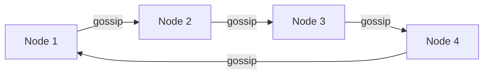

#### Membership and routing

When a gateway fails, its connections are lost. Clients reconnect (with jittered backoff), and the connection registry's TTL-based entries auto-expire. The routing layer (fan-out workers) re-resolves recipient locations by querying the registry again. Stale registry entries are tolerated — a fan-out attempt to a dead gateway fails gracefully, and the message remains in the inbox for push notification or sync-on-reconnect.

- **SWIM protocol**: Scalable weakly-consistent infection-style membership — nodes probe a subset of peers and relay failure information.
- **Registry TTL**: The connection registry uses short TTLs (30–60 s) so crashed gateways auto-expire without explicit deregistration.

**Real-life use**: Cassandra uses gossip and phi accrual; Discord's Elixir fleet uses SWIM for membership; Kafka uses ZooKeeper (or KRaft) for broker membership and controller election.

**Interview questions and answers**

- **Q: How does the connection registry handle a gateway crash?**
  **A:** The registry uses TTL-based entries. If a gateway crashes, its heartbeats stop, and the registry entries for all users on that gateway expire within the TTL window. Clients reconnect to any healthy gateway, which re-registers them. The key insight: the system tolerates stale registry entries — a delivery attempt to a dead gateway fails gracefully, and the message stays in the inbox for sync-on-reconnect.

- **Q: Why is gossip preferred over a central coordinator for membership?**
  **A:** It removes a single point of failure and scales well — each node only communicates with a subset of peers. The trade-off is eventual consistency in membership knowledge, which is acceptable because stale membership is handled by retry and TTL.

---

### High Availability and Scalability

A chat system must stay up during node failures, data-center outages, and scaling events. The gateway tier, chat-service tier, message store, and connection registry each have distinct HA and scaling strategies.

#### Multi-region deployment

Users are routed to the nearest region via GeoDNS or latency-based routing. Each region runs a full stack: gateways, chat service, message store, registry. Cross-region replication keeps message stores synchronized. If one region goes down, clients automatically reconnect to the next-nearest region.

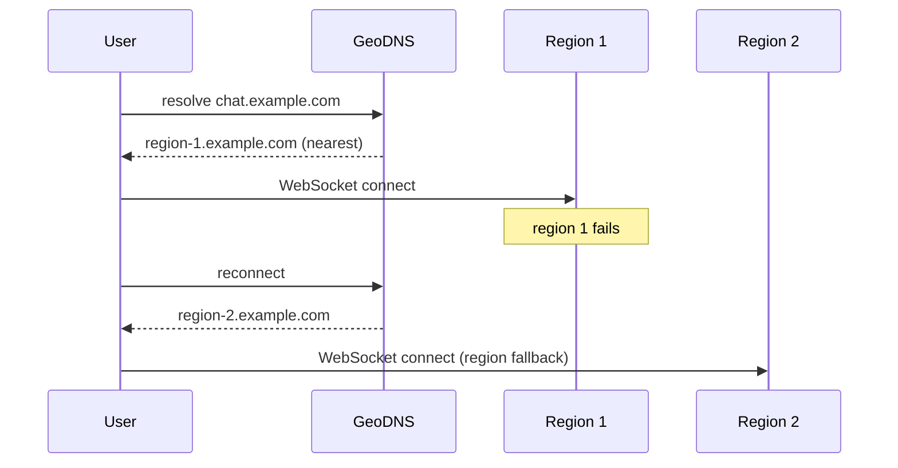

#### Gateway scaling

Gateways are stateless with respect to message content but stateful with respect to connections. They scale horizontally by adding more nodes. Each node typically handles 10K–100K concurrent connections depending on the runtime (JVM tuning, epoll, off-heap buffers). A load balancer distributes new connections using least-connections or consistent hashing by user ID (for session stickiness).

#### Chat-service scaling

The chat service is stateless (except for the per-conversation sequence counter). It is sharded by `hash(convId)` so all writes for a conversation go to the same shard. Fan-out workers are Kafka consumer groups scaled independently by partition count.

#### Database scaling

The message store is partitioned by `convId` and replicated for durability. ScyllaDB/Cassandra scale linearly by adding nodes. DynamoDB auto-scales partitions. Historical queries use materialized views or secondary indexes keyed by user (for conversation lists) rather than scanning.

**Java example: region-aware gateway selection**

```java
import org.springframework.beans.factory.annotation.Value;
import org.springframework.stereotype.Service;

import java.util.List;
import java.util.concurrent.ThreadLocalRandom;

/**
 * RegionAwareRouter selects the nearest available region
 * for a new WebSocket connection. It uses a health-check
 * feed to avoid routing to degraded regions and falls back
 * to a random healthy region when the preferred one is down.
 */
@Service
public class RegionAwareRouter {

    private final List<Region> regions;
    private final HealthChecker healthChecker;

    public RegionAwareRouter(@Value("${app.regions}") List<Region> regions,
                             HealthChecker healthChecker) {
        this.regions = regions;
        this.healthChecker = healthChecker;
    }

    public String selectGateway(String userId, String preferredRegion,
                                int maxRetries) {
        // Try the preferred region first.
        Region preferred = regions.stream()
            .filter(r -> r.name().equals(preferredRegion) && healthChecker.isHealthy(r))
            .findFirst()
            .orElse(null);
        if (preferred != null) {
            return preferred.gatewayEndpoint() + "?uid=" + userId;
        }
        // Fall back to a random healthy region.
        List<Region> healthy = regions.stream()
            .filter(healthChecker::isHealthy)
            .toList();
        if (healthy.isEmpty()) {
            throw new IllegalStateException("No healthy regions available");
        }
        Region chosen = healthy.get(
            ThreadLocalRandom.current().nextInt(healthy.size()));
        return chosen.gatewayEndpoint() + "?uid=" + userId +
            "&fallback=true";
    }

    public record Region(String name, String gatewayEndpoint,
                         String storageEndpoint) {}
}
```

*The `RegionAwareRouter` bean uses `@Value` to inject the list of configured regions and `HealthChecker` for liveness data, both via constructor injection. It tries the user's preferred (nearest) region first, then falls back to a random healthy region — implementing the client region-fallback strategy described above. The `Region` record carries endpoint metadata for each region.*

**Interview questions and answers**

- **Q: How do you size a gateway fleet for 50 million concurrent connections?**
  **A:** Each JVM gateway node can handle ~50K connections with careful tuning (epoll, off-heap buffers, ZGC). So 50M / 50K = 1,000 nodes. But you also need headroom for reconnect storms (2×), so plan for ~2,000 nodes. Memory per connection is ~2–8 KB (socket buffer + session state), so budget ~400 KB–1.6 GB per node at 50K connections. Use connection draining (GOAWAY) for deploys.

- **Q: What happens during a regional failover?**
  **A:** Clients detect the connection loss and reconnect using their region fallback list. GeoDNS or the client's own latency probing directs new connections to the next-healthy region. Since messages are durably persisted and synced via the event backbone, no messages are lost — the client simply syncs from its last cursor after reconnecting.

---

### Performance and Optimization

Chat systems are measured by two metrics above all: **end-to-end message delivery latency** (p50 and p99) and **connection density** (connections per gateway node).

#### Latency optimization

- **Gateway co-location**: Gateways should be close to their users (edge PoPs) and to the chat service and message store to minimize hop latency.
- **Local gateway caching**: Each gateway caches its own active sessions in an in-process map, consulting Redis only for users on other gateways. This removes registry round-trips from the hot path for same-gateway deliveries.
- **Frame batching**: For high-throughput conversations (bots, channels), batch multiple messages into a single WebSocket frame to reduce per-message overhead.
- **Lazy presence updates**: Presence is aggregated and pushed in batches every few seconds rather than on every heartbeat, reducing fan-out load.

#### Connection density optimization

- **Off-heap or native connection handling**: JVM heap-based connection state causes GC pauses that trigger mass reconnect storms. Use Netty with off-heap buffers or native runtimes (Erlang/Elixir, Rust) for the gateway tier.
- **HTTP/2 or TLS session resumption**: Reuse TLS sessions across reconnects to avoid the TLS handshake cost.
- **Adaptive heartbeats**: Increase heartbeat intervals for stable connections, decrease for flaky ones. Use ping/pong rather than application-level heartbeats to avoid framing overhead.

#### Throughput optimization

- **Fan-out parallelism**: Kafka consumer groups process the outbox topic in parallel. Partitioning by `convId` ensures all messages for a conversation are delivered in order, while different conversations are fanned out concurrently.
- **Message store write path**: Append-only writes to Cassandra/ScyllaDB are O(1) per partition. Use batch writes for multi-table updates (message + outbox) but bound batch size to avoid hotspots.

**Java example: batched fan-out with parallelism**

```java
import org.springframework.stereotype.Component;

import java.util.List;
import java.util.concurrent.CompletableFuture;

/**
 * BatchedFanOutService processes a batch of MessagePersisted events
 * from Kafka and dispatches deliveries in parallel across recipient
 * conversations. Each conversation's deliveries are processed
 * sequentially to preserve ordering.
 */
@Component
public class BatchedFanOutService {

    private final GatewayDispatcher dispatcher;
    private final ConnectionRegistry registry;
    private final PushNotificationService pushService;

    public BatchedFanOutService(GatewayDispatcher dispatcher,
                                ConnectionRegistry registry,
                                PushNotificationService pushService) {
        this.dispatcher = dispatcher;
        this.registry = registry;
        this.pushService = pushService;
    }

    public void fanOutBatch(List<MessagePersistedEvent> events) {
        // Each event is processed independently; parallelism
        // comes from the Kafka consumer group partition count.
        events.parallelStream().forEach(this::deliverToOneConversation);
    }

    private void deliverToOneConversation(MessagePersistedEvent event) {
        List<String> recipients = resolveRecipients(event.convId());
        // Split into online and offline.
        List<CompletableFuture<Void>> futures = recipients.stream()
            .map(userId -> {
                var gateways = registry.gatewaysFor(userId);
                if (gateways.isEmpty()) {
                    return CompletableFuture.runAsync(() ->
                        pushService.notifyAsync(userId, event.convId(),
                            event.seq()));
                } else {
                    return CompletableFuture.runAsync(() ->
                        dispatcher.deliver(gateways, userId,
                            event.convId(), event.seq()));
                }
            })
            .toList();
        CompletableFuture.allOf(futures.toArray(CompletableFuture[]::new))
            .join();
    }

    private List<String> resolveRecipients(String convId) {
        // Resolve group members or DM recipient from the membership store.
        return List.of(); // placeholder
    }
}
```

*The `BatchedFanOutService` bean processes batches of `MessagePersistedEvent` records using a parallel stream, dispatching delivery to each recipient's gateway or pushing a notification if the recipient is offline. Each delivery is wrapped in a `CompletableFuture` for parallelism. All dependencies (`GatewayDispatcher`, `ConnectionRegistry`, `PushNotificationService`) are constructor-injected. The `parallelStream()` parallelism is bounded by the JVM common pool — production would use a custom `ExecutorService` sized to the host.*

**Interview questions and answers**

- **Q: Why does p99 latency matter more than p50 for chat?**
  **A:** p99 captures the worst-case experience — the user who sees a 5-second message delay is far more likely to complain and churn than someone with 100 ms. Chat UX is dominated by the tail because users compare their experience to SMS (~instant). p99 is often caused by GC pauses, network jitter, or registry hotspots.

- **Q: How do you avoid reconnect storms during a deploy?**
  **A:** Use connection draining — send a GOAWAY frame to clients, give them 60–120 s to reconnect to other gateways, then shut down. Stagger deploys across availability zones. On the client side, use exponential backoff with heavy jitter (0–30 s) so reconnects don't synchronize. Rate-limit the handshake tier.

---

### CAP Theorem and Consistency Trade-offs

The CAP theorem states that during a network partition, a distributed system can provide either consistency (C) or availability (A), but not both, while still maintaining partition tolerance (P). Chat systems make nuanced choices here — different subsystems have different priorities.

#### Message store consistency

The message store typically prioritizes **AP** (availability over consistency) for write availability, but the per-conversation sequence counter requires **consistency within a partition**. The solution: use per-conversation sharding (single writer per conversation) so ordering is consistent within a conversation, while the overall system remains available across conversations.

- **If the leader shard for a conversation is down**: writes to that conversation fail (or fall back to another shard via Raft leader election). Other conversations continue unaffected.
- **If a follower region is partitioned**: followers fall behind and serve slightly stale reads, but writes to the leader continue. This is an acceptable trade-off — eventual consistency for history sync is fine; the live message path uses the leader region.

#### Connection registry consistency

The connection registry is **AP** — it should always return *a* gateway for a user (availability > correctness). A stale entry (routing to a recently-crashed gateway) results in a failed delivery that falls back to push notification or sync-on-reconnect. A false "offline" would prevent a valid delivery, so availability is prioritized.

#### Presence consistency

Presence is inherently **AP** and eventuously consistent. Online/offline transitions propagate via gossip or Redis pub/sub. A user may appear online for a few seconds after their actual disconnect — this staleness is acceptable UX.

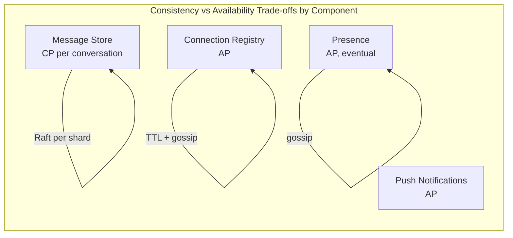

**Real-life mapping**

- **CP**: Kafka partitions (per-partition leader/follower with ISR); Raft-based conversation shards for strict ordering.
- **AP**: DynamoDB, Cassandra, ScyllaDB for message storage; Redis for registry and presence (with TTL-based expiry); APNs/FCM push (best-effort delivery).

**Interview questions and answers**

- **Q: Is a chat system CP or AP?**
  **A:** Neither — it's a composite. The message store uses CP per conversation (strict ordering within a conversation via single-writer shards) but AP overall (other conversations continue during a partition). The connection registry is AP (stale routing is handled gracefully). Presence is AP (eventual consistency). This nuance — that real systems make per-component trade-offs rather than a single global choice — is what interviewers want to hear.

- **Q: How does the system handle a network partition between two regions?**
  **A:** Writes to conversations whose home shard is in the partitioned region may be delayed or queued. Messages already persisted are durable (if synchronous replication succeeded before the partition). Clients in the affected region reconnect to the healthy region and sync from their cursor. History may be slightly behind but is never lost. The key: durability is guaranteed by the store; delivery is eventually consistent.

- **Q: Can you have strong consistency and high availability during a partition?**
  **A:** No. During a partition, a strongly consistent system must reject some requests to avoid returning stale data, sacrificing availability. A chat system handles this by making *per-conversation* strong consistency (within a single region) and *cross-region* eventual consistency (read from local region, sync on reconnect).

---

### Encryption and Key Management

Encryption protects chat data at rest (message store, blob storage) and in transit (client-to-gateway, gateway-to-chat-service, inter-node replication). A production chat system must consider multiple layers: TLS for transport, envelope encryption for message content, and key management for E2E encryption.

#### Encryption in Transit

All client-to-server and inter-service traffic must use TLS 1.3 (or TLS 1.2 with strong ciphers). WebSocket connections are upgraded over HTTPS (WSS). Mutual TLS (mTLS) is used for inter-service communication where both endpoints are server-side services.

- **TLS termination**: Terminate TLS at the load balancer or edge proxy (Cloudflare, Envoy). Use TLS pass-through to gateways for WebSocket upgrades.
- **Certificate rotation**: Certificates rotated automatically every 30–90 days via automated ACME or cloud KMS integration.
- **mTLS for service mesh**: A service mesh (Istio, Linkerd) provides mTLS between chat service, fan-out workers, and stores without application changes.

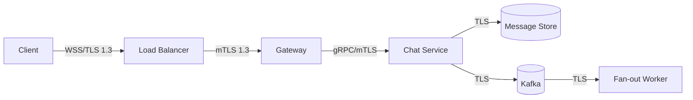

#### Encryption at Rest (Server-side)

The message store encrypts data at rest. Most managed stores (DynamoDB, ScyllaDB Enterprise, Cassandra with encryption at rest) provide this transparently. For self-hosted stores, application-level encryption wraps each message with a data encryption key (DEK) managed by a KMS.

- **Envelope encryption**: A KEK (key encryption key) in AWS KMS or HashiCorp Vault encrypts the DEK, which encrypts the message. DEKs are rotated periodically; old data is re-encrypted during compaction.
- **Field-level encryption**: For sensitive metadata (user IDs in group names, etc.), encrypt specific fields rather than the entire row.

#### End-to-End Encryption (Client-side)

In an E2E encrypted system (WhatsApp, Signal), the server cannot read message content. The Signal Protocol (X3DH + Double Ratchet) establishes shared secrets between endpoints.

- **X3DH (Extended Triple Diffie-Hellman)**: The sender and recipient perform a key agreement to establish a shared secret. Identity keys, signed pre-keys, and one-time pre-keys enable asynchronous key exchange.
- **Double Ratchet**: For each message, the ratchet advances the encryption key. This provides forward secrecy — if a key is compromised, only messages before the compromise are readable (not messages after).
- **Server's role**: The server acts as a blind courier. It stores and forwards opaque ciphertext envelopes, cannot decrypt content, and routes based on user ID and conversation metadata.

```mermaid
flowchart LR
    subgraph Sender[Sender Device]
        S1[X3DH Pre-keys] --> S2[Establishes Shared Secret]
        S2 --> S3[Double Ratchet per-message keys]
    end
    subgraph Server[Server (Blind Courier)]
        S3 -->|"opaque ciphertext"| SV[Store + Forward]
        SV -->|"opaque ciphertext"| SR[Store + Forward]
    end
    subgraph Recipient[Recipient Device]
        SR --> R1[Decrypts with Shared Secret]
        R1 --> R2[Double Ratchet advances]
    end
    S3 -->|"envelope"| SV
    SV -->|"envelope"| SR
```

**Real-life use**: WhatsApp and Signal use the Signal Protocol; Discord offers E2E for DMs; Slack does not offer E2E by default (enterprise key management is server-side).

**Java example: AES-GCM message encryption service**

```java
import org.springframework.beans.factory.annotation.Value;
import org.springframework.stereotype.Service;

import javax.crypto.Cipher;
import javax.crypto.SecretKey;
import javax.crypto.spec.GCMParameterSpec;
import javax.crypto.spec.SecretKeySpec;
import java.nio.charset.StandardCharsets;
import java.security.GeneralSecurityException;
import java.security.SecureRandom;
import java.util.Base64;

/**
 * MessageEncryptionService provides application-level AES-GCM
 * encryption for messages at rest. The data key is injected
 * via configuration and would be fetched from a KMS/HSM in
 * production. AES-GCM provides both confidentiality and
 * integrity (authenticated encryption).
 */
@Service
public class MessageEncryptionService {

    private static final int GCM_IV_LENGTH = 12;
    private static final int GCM_TAG_LENGTH = 128;

    private final SecretKey dataKey;
    private final SecureRandom random = new SecureRandom();

    public MessageEncryptionService(
            @Value("${app.encryption.message-key-base64}") String keyB64)
            throws GeneralSecurityException {
        byte[] decoded = Base64.getDecoder().decode(keyB64);
        this.dataKey = new SecretKeySpec(decoded, "AES");
    }

    public String encrypt(String plaintext) throws GeneralSecurityException {
        byte[] iv = new byte[GCM_IV_LENGTH];
        random.nextBytes(iv);
        Cipher cipher = Cipher.getInstance("AES/GCM/NoPadding");
        cipher.init(Cipher.ENCRYPT_MODE, dataKey,
            new GCMParameterSpec(GCM_TAG_LENGTH, iv));
        byte[] encrypted = cipher.doFinal(
            plaintext.getBytes(StandardCharsets.UTF_8));
        // Prepend IV to ciphertext so decrypt can extract it.
        byte[] output = new byte[iv.length + encrypted.length];
        System.arraycopy(iv, 0, output, 0, iv.length);
        System.arraycopy(encrypted, 0, output, iv.length,
            encrypted.length);
        return Base64.getEncoder().encodeToString(output);
    }

    public String decrypt(String encoded) throws GeneralSecurityException {
        byte[] input = Base64.getDecoder().decode(encoded);
        byte[] iv = new byte[GCM_IV_LENGTH];
        byte[] ciphertext = new byte[input.length - GCM_IV_LENGTH];
        System.arraycopy(input, 0, iv, 0, GCM_IV_LENGTH);
        System.arraycopy(input, GCM_IV_LENGTH, ciphertext, 0,
            ciphertext.length);
        Cipher cipher = Cipher.getInstance("AES/GCM/NoPadding");
        cipher.init(Cipher.DECRYPT_MODE, dataKey,
            new GCMParameterSpec(GCM_TAG_LENGTH, iv));
        byte[] decrypted = cipher.doFinal(ciphertext);
        return new String(decrypted, StandardCharsets.UTF_8);
    }
}
```

*The `MessageEncryptionService` Spring bean wraps AES-GCM authenticated encryption with a per-message random IV. The data key is injected via `@Value` (in production, this would come from AWS KMS or HashiCorp Vault). The IV is prepended to the ciphertext so the decrypt method can extract it. AES-GCM is chosen over plain AES-CBC because it provides integrity verification (tamper detection) in addition to confidentiality. Each message gets a unique IV to prevent nonce-reuse attacks that would break GCM's security guarantees.*

**Interview questions and answers**

- **Q: Should all chat data be E2E encrypted by default?**
  **A:** Not always — it depends on the product. E2E encryption protects message content from server compromise but prevents server-side search, moderation, spam detection, and compliance eDiscovery. WhatsApp chose E2E; Slack and enterprise tools chose server-side encryption with enterprise key management because their customers need search and compliance. The decision is a product trade-off, not a purely technical one.

- **Q: What is forward secrecy and why does it matter?**
  **A:** Forward secrecy means that compromising a key today does not let an attacker decrypt past messages. The Double Ratchet in Signal achieves this by advancing the encryption key per message — each message uses a derived key that is discarded after use. If a device is compromised, only messages from that point forward are at risk, not the entire message history.

---

### Authentication and Authorization

Authentication verifies identity at the gateway (where the WebSocket is established); authorization enforces permissions in the chat service (who can send, who can join a group, who can delete messages). Because the gateway is the entry point, it is the natural place to authenticate, but authorization must be re-checked at the service layer to prevent stale or cached access.

#### Authentication methods

- **JWT bearer tokens**: The client presents a signed JWT during the WebSocket upgrade. The gateway validates the signature and expiration, extracts the user ID, and stores it in the session attributes.
- **OAuth2 / OIDC**: Tokens are issued by an identity provider (Auth0, Cognito, Firebase Auth). The gateway validates against the IdP's JWKS endpoint.
- **Refresh token rotation**: Short-lived access tokens (15 min) are refreshed using a longer-lived refresh token. The WebSocket re-authenticates on reconnect if the access token has expired.
- **Device identity**: Each device has its own key pair (or certificate) for mutual authentication, enabling per-device revocation and E2E encryption bootstrapping.

#### Authorization models

- **Role-Based Access Control (RBAC)**: Conversation participants have roles (`OWNER`, `ADMIN`, `MEMBER`). Each role grants a set of permissions (add/remove members, delete messages, change group name, pin messages).
- **Attribute-Based Access Control (ABAC)**: Permissions depend on attributes of the user, the resource, the action, and the environment (e.g., `user.isAdmin AND resource.owner == user.id`).
- **Conversation-level ACLs**: Each conversation has its own access control list checked on every message send and history read.

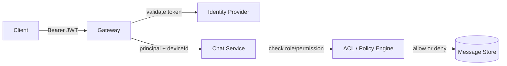

#### Real-life implementations

- **WhatsApp**: Phone-number identity, Signal protocol for E2E key bootstrapping, per-device identity keys.
- **Discord**: OAuth2 + Discord tag identity, per-guild role-based permissions (everyone, @roles, allow/deny bitmasks).
- **Slack**: OAuth2 / OIDC, team-based workspace isolation, channel-level RBAC (owner, admin, member, guest, restricted).

**Java example: JWT-based authentication and authorization**

```java
import org.springframework.beans.factory.annotation.Value;
import org.springframework.security.oauth2.jwt.Jwt;
import org.springframework.security.oauth2.jwt.JwtDecoder;
import org.springframework.security.oauth2.jwt.JwtDecoders;
import org.springframework.stereotype.Component;

import java.time.Instant;

/**
 * JwtTokenValidator validates bearer tokens during WebSocket
 * handshake and returns a ChatPrincipal containing the user ID,
 * device ID, and roles. The JWT decoder uses the issuer URI
 * configured via @Value and cached per issuer for performance.
 */
@Component
public class JwtTokenValidator {

    private final JwtDecoder jwtDecoder;
    private final long maxClockSkewSeconds;

    public JwtTokenValidator(
            @Value("${app.auth.issuer-uri}") String issuerUri,
            @Value("${app.auth.clock-skew-seconds:30}") long maxClockSkewSeconds) {
        this.jwtDecoder = JwtDecoders.fromIssuerPosition(issuerUri);
        this.maxClockSkewSeconds = maxClockSkewSeconds;
    }

    public ChatPrincipal validate(String token) {
        Jwt jwt = jwtDecoder.decode(token);
        // Check expiration with configurable clock skew.
        if (jwt.getExpiresAt() == null ||
            jwt.getExpiresAt().isBefore(Instant.now().plusSeconds(maxClockSkewSeconds))) {
            throw new SecurityException("Token expired or invalid");
        }
        String userId = jwt.getSubject();
        String deviceId = jwt.getClaimAsString("device_id");
        var roles = jwt.getClaimAsStringList("roles");
        return new ChatPrincipal(userId, deviceId,
            roles != null ? roles : java.util.List.of("MEMBER"));
    }

    public record ChatPrincipal(String userId, String deviceId,
                                java.util.List<String> roles) {}
}
```

*The `JwtTokenValidator` Spring component validates JWT bearer tokens using a `JwtDecoder` configured from the issuer URI injected via `@Value`. It enforces expiration with a configurable clock-skew tolerance, extracts the user ID, device ID, and roles from the token claims, and returns an immutable `ChatPrincipal` record. The constructor injection of both the issuer URI and clock-skew tolerance makes the validator configurable and testable. In production, the `JwtDecoder` is cached and backed by the IdP's JWKS endpoint for key rotation.*

**Java example: conversation-level authorization check**

```java
import org.springframework.stereotype.Service;

import java.util.List;
import java.util.UUID;

/**
 * ConversationAuthorizationService enforces per-conversation
 * RBAC. It checks whether a user has permission to perform
 * an action based on their role (OWNER, ADMIN, MEMBER)
 * and the action being attempted.
 */
@Service
public class ConversationAuthorizationService {

    public enum Permission {
        SEND_MESSAGE,
        REMOVE_MEMBER,
        DELETE_MESSAGES,
        CHANGE_GROUP_NAME,
        PIN_MESSAGES
    }

    private final MembershipRepository membershipRepository;

    public ConversationAuthorizationService(
            MembershipRepository membershipRepository) {
        this.membershipRepository = membershipRepository;
    }

    public boolean isAuthorized(UUID convId, String userId,
                                Permission permission) {
        var role = membershipRepository.roleOf(convId, userId);
        if (role == null) {
            return false; // not a member
        }
        // Owner can do everything.
        if (role == MembershipRepository.Role.OWNER) {
            return true;
        }
        // Admin can do almost everything except delete messages
        // of the owner.
        if (role == MembershipRepository.Role.ADMIN) {
            return switch (permission) {
                case REMOVE_MEMBER, CHANGE_GROUP_NAME,
                     PIN_MESSAGES, SEND_MESSAGE -> true;
                case DELETE_MESSAGES -> false;
            };
        }
        // Regular members can only send messages.
        return permission == Permission.SEND_MESSAGE;
    }

    @Transactional(readOnly = true)
    public List<UUID> accessibleConversations(String userId) {
        return membershipRepository.conversationsForUser(userId);
    }
}
```

*The `ConversationAuthorizationService` bean enforces per-conversation RBAC. The `isAuthorized` method checks the user's role against the requested permission using a switch expression (Java 14+). The `accessibleConversations` method is annotated `@Transactional(readOnly = true)` for read optimization. Constructor injection of the repository makes it testable with mocks.*

**Interview questions and answers**

- **Q: Where should authentication happen — at the gateway or the chat service?**
  **A:** At the gateway, because the WebSocket handshake happens there. The gateway validates the JWT and stores the principal in the session. But authorization (what can this user do?) must be re-checked at the chat service layer — the gateway's cached identity could be stale, and a user might have been removed from a group between connection and message send. Defense in depth: validate at both layers.

- **Q: How do you handle token expiry for a long-lived WebSocket connection?**
  **A:** The access token expires (e.g., every 15 minutes), but the WebSocket stays open. The client must detect the expiry (via the gateway sending a `4401` close code) and reconnect with a refreshed token. Alternatively, use a longer-lived session token for the WebSocket and short-lived JWT for per-request authorization. The reconnect must preserve the session state (cursor position).

---

### Security Threats and Mitigations

A chat system faces multiple categories of security threats. Understanding them and applying layered defenses is essential for production deployments.

#### Threat: Unauthenticated Connection

- **Risk**: An attacker connects to the WebSocket port without valid credentials.
- **Mitigation**: Enforce JWT validation during the WebSocket handshake. Reject connections with expired, malformed, or unsigned tokens. Use mTLS for inter-service traffic.

#### Threat: Message Interception (Eavesdropping)

- **Risk**: An attacker on the network path sniffs unencrypted traffic and reads message content or metadata.
- **Mitigation**: Enforce TLS 1.3 for all transport. For E2E encrypted conversations, message content is already opaque ciphertext. Metadata (sender, recipient, timestamp) is protected by TLS but visible to the server — use sealed sender or private metadata to reduce this exposure.

#### Threat: Spam and Abuse

- **Risk**: An attacker floods the system with messages, bot accounts, or phishing links.
- **Mitigation**: Rate limiting per user/IP/token. ML-based spam classifiers on message metadata and user reports. Link scanning and phishing protection. Account verification (email, phone) before sending messages to non-contacts.

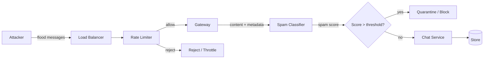

*Rate limiting at the load balancer and gateway prevents spam floods from reaching the chat service. ML classifiers analyze message content and metadata to detect spam and phishing. Suspicious messages are quarantined for review.*

#### Threat: Data Tampering

- **Risk**: An attacker modifies message content in transit or on disk.
- **Mitigation**: TLS provides integrity (AES-GCM or ChaCha20-Poly1305 include authentication tags). For E2E encrypted messages, the Double Ratchet ensures authenticity. WAL and database checksums detect disk corruption. Message immutability (append-only logs) means stored messages cannot be modified after persistence.

#### Threat: Credential and Key Theft

- **Risk**: JWTs, refresh tokens, or encryption keys are intercepted or stolen from configuration.
- **Mitigation**: Use short-lived access tokens (15 min). Rotate refresh tokens. Store secrets in a vault (HashiCorp Vault, AWS Secrets Manager), not in config files or environment variables. Use HSMs for key material. Encrypt private keys at rest.

#### Threat: DoS / Resource Exhaustion

- **Risk**: An attacker exhausts gateway connections, file descriptors, memory, or CPU.
- **Mitigation**: Per-client connection limits at the load balancer and application layer. Adaptive timeouts. Connection limits per IP. Request size limits. Circuit breakers that shed load when the system is unhealthy. Rate limiting on authentication to prevent brute-force attacks.

#### Threat: Account Takeover

- **Risk**: An attacker gains access to a user's account via password reuse, phishing, or session hijacking.
- **Mitigation**: Multi-factor authentication (MFA). Anomaly detection on login patterns (new device, new location, unusual time). Device verification and trust-on-first-use. Secure recovery flows (not just SMS — SIM swap attacks). Session revocation across all devices.

**Interview questions and answers**

- **Q: What are the most common security pitfalls in chat system deployments?**
  **A:** (1) Leaving the WebSocket port exposed without authentication — validate tokens at handshake. (2) Sending message content through push notifications — metadata-only for E2E systems. (3) Not rate-limiting message sends — spam floods a single user. (4) Storing message content in plaintext when the product claims E2E encryption. (5) Weak or hardcoded JWT signing keys.

- **Q: How do you protect against a DoS that exhausts gateway connections?**
  **A:** Enforce per-client connection limits (max 5 concurrent sessions per user). Rate-limit authentication attempts (max N handshakes per IP per second). Use adaptive timeouts — if a connection doesn't complete the handshake within 10 s, close it. Implement circuit breakers at the gateway layer that shed load by rejecting new connections when CPU or memory exceeds threshold. Scale horizontally so no single node is overwhelmed.

- **Q: How does E2E encryption affect spam detection?**
  **A:** It creates a fundamental tension: the server cannot read message content to run spam classifiers. Systems like Signal rely on metadata (sender reputation, reporting, rate limiting) for spam detection. WhatsApp uses client-side spam detection and user reporting. Products that need effective spam detection must either scan content server-side (no E2E) or rely entirely on client-side + metadata-based approaches.

---

### Observability and Logging

A chat system must expose metrics, logs, and traces so operators can detect anomalies, diagnose problems, and verify SLAs. Observability is especially critical because partial failures (some users affected, others not) are hard to reproduce.

#### Metrics

- **Connection metrics**: Active connections per gateway, connection churn rate, handshake latency, connection duration distribution.
- **Delivery funnel**: `messages_sent`, `messages_persisted`, `messages_fanout_attempted`, `messages_delivered`, `messages_seen` — tracked per stage with p50/p95/p99 latency.
- **Registry metrics**: Lookup latency, cache hit ratio, registry write rate, TTL expiration rate.
- **Push metrics**: Push attempts, successes, failures, FCM/APNs error codes, retry counts.
- **Message store metrics**: Write latency, read latency, compaction lag, partition distribution, read repair rate.
- **Error rates**: Authentication failures, authorization denials, fan-out failures, delivery failures by type.

#### Logging

Structured JSON logs should capture:

- **Access logs**: Every WebSocket connect/disconnect with user ID, gateway, device ID, duration, disconnect reason.
- **Message flow logs**: Each stage of the delivery funnel — useful for tracing a specific message's journey.
- **Security logs**: Auth failures, authorization denials, rate-limit hits, suspicious patterns.
- **Error logs**: Fan-out failures, push delivery failures, registry lookup errors, store timeouts.

#### Tracing

Distributed tracing follows a message through the system: client → gateway → chat service → store → outbox → Kafka → fan-out worker → registry → recipient gateway → recipient device.

- **Trace context propagation**: Trace IDs and span IDs are passed in headers (W3C Trace Context) across service boundaries.
- **Key spans to instrument**: Message send, message persist, outbox publish, fan-out lookup, delivery attempt, push dispatch.
- **Sampling**: Sample 100% of error paths and slow requests (>p99 latency threshold). Sample a small percentage (0.1%) of successful requests for baseline monitoring.

#### Alerting

- p99 message delivery latency exceeds 500 ms for 5 minutes.
- Fan-out lag (Kafka consumer group offset age) exceeds 60 seconds.
- Gateway connection churn exceeds 10% per minute (reconnect storm).
- Registry error rate exceeds 1%.
- Push delivery failure rate exceeds 5%.
- Message store write latency p99 exceeds 100 ms.

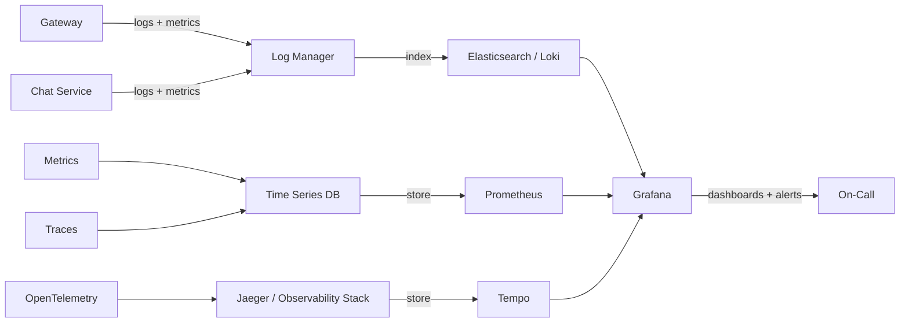

*Observability pipeline: logs flow to a log manager indexed by Elasticsearch; metrics to Prometheus; traces to Tempo/Jaeger. All three converge in Grafana dashboards with alert rules. The delivery funnel is the most important visualization — it shows where messages are being lost or delayed.*

**Java example: delivery-funnel instrumentation with Micrometer**

```java
import io.micrometer.core.instrument.Counter;
import io.micrometer.core.instrument.MeterRegistry;
import io.micrometer.core.instrument.Timer;
import org.springframework.stereotype.Service;

import java.time.Duration;
import java.util.List;
import java.util.UUID;
import java.util.concurrent.ConcurrentHashMap;

/**
 * DeliveryFunnelMetrics instruments the end-to-end message
 * delivery funnel: sent -> persisted -> fanout -> delivered -> seen.
 * Each stage is tracked with a counter and a timer so operators
 * can see exactly where messages are lost or delayed.
 */
@Service
public class DeliveryFunnelMetrics {

    private final Counter sentCounter;
    private final Counter persistedCounter;
    private final Counter fanoutCounter;
    private final Counter deliveredCounter;
    private final Counter seenCounter;
    private final Counter failureCounter;
    private final Timer deliveryTimer;
    private final MeterRegistry registry;

    public DeliveryFunnelMetrics(MeterRegistry registry) {
        this.registry = registry;
        this.sentCounter = Counter.builder("chat.messages")
            .tag("stage", "sent").register(registry);
        this.persistedCounter = Counter.builder("chat.messages")
            .tag("stage", "persisted").register(registry);
        this.fanoutCounter = Counter.builder("chat.messages")
            .tag("stage", "fanout").register(registry);
        this.deliveredCounter = Counter.builder("chat.messages")
            .tag("stage", "delivered").register(registry);
        this.seenCounter = Counter.builder("chat.messages")
            .tag("stage", "seen").register(registry);
        this.failureCounter = Counter.builder("chat.failures")
            .tag("stage", "all").register(registry);
        this.deliveryTimer = Timer.builder("chat.delivery.latency")
            .tag("stage", "end_to_end")
            .register(registry);
    }

    public void recordSent(String convId, String senderId) {
        sentCounter.increment();
        deliveryTimer.record(() -> {}); // start timer marker
    }

    public void recordPersisted(String convId, long seq) {
        persistedCounter.increment();
    }

    public void recordFanOut(String convId, int recipientCount) {
        fanoutCounter.increment(recipientCount);
    }

    public void recordDelivered(String convId, String recipientId,
                                Duration latency) {
        deliveredCounter.increment();
        deliveryTimer.record(latency);
    }

    public void recordSeen(String convId, String recipientId) {
        seenCounter.increment();
    }

    public void recordFailure(String stage, String errorType) {
        failureCounter.increment(
            io.micrometer.core.instrument.Tag.of("stage", stage),
            io.micrometer.core.instrument.Tag.of("error", errorType)
        );
    }
}
```

*The `DeliveryFunnelMetrics` Spring service uses Micrometer to record counters and timers at each stage of the delivery funnel (sent → persisted → fanout → delivered → seen). Each counter is tagged with a `stage` label so Grafana can visualize the funnel and detect where messages are being lost. The `Timer` tracks end-to-end delivery latency. The `failureCounter` uses dynamic tags (`stage`, `error`) so operators can drill down into specific failure modes. All counters are registered through the constructor-injected `MeterRegistry`.*

**Interview questions and answers**

- **Q: What is the single most important metric for a chat system?**
  **A:** End-to-end delivery latency at p99. Users notice when a message takes more than 500 ms. A stable p50 with a spiking p99 usually indicates GC pauses, registry hotspots, or fan-out lag. The delivery funnel (sent → persisted → fanout → delivered → seen) is the most actionable dashboard — it shows exactly where the bottleneck is.

- **Q: How would you debug a report that messages are sometimes delayed?**
  **A:** (1) Check the delivery funnel — is the drop between sent and persisted, or between fanout and delivered? (2) Check Kafka consumer lag for the fan-out workers. (3) Check registry error rates and cache hit ratio. (4) Check gateway p99 latency for GC pauses. (5) Correlate with a trace of a specific delayed message to find which hop introduced the delay. (6) Check if the delay correlates with a recent deployment or reconnect storm.

---

### Real-World Implementations

- **WhatsApp**
  *Problem*: 2 billion users, E2E encryption default-on, tiny infrastructure budget per message. *Solution*: Erlang/OTP connection fleets for efficient connection handling (millions of connections per server), Signal Protocol (X3DH + Double Ratchet) for end-to-end encryption, multimedia routed as encrypted blobs with content-addressed storage, sparse metadata philosophy (minimal server-side data retention). *Trade-off*: No server-side search; chat backups are client-managed and encrypted. *Scale*: Originally served 450 million users from a small engineering team.

- **Facebook Messenger**
  *Problem*: Deep integration with Facebook's social graph, real-time suggestions, bot platform, payments, voice/video. *Solution*: Service mesh architecture with Haxl-style batched data fetching, hybrid fan-out (fan-out-on-write for small groups, on-read for large), the "Message Send" service as the write path authority, and a unified infrastructure shared with Instagram DMs. *Trade-off*: No E2E encryption for most chats (server-side plaintext enables search, moderation, and AI features). *Scale*: Hundreds of millions of daily active users across Messenger and Instagram DMs.

- **Discord**
  *Problem*: Million-member servers/channels where fan-out-on-write would be catastrophic. *Solution*: Elixir/OTP gateway for connection management, ScyllaDB for message storage (partitioned by channel + snowflake timestamp), fan-out-on-read for large channels with incremental unread counters, event-driven permission updates via Kafka. *Trade-off*: Slower cold-open sync for lurkers in large channels; massively cheaper writes. *Scale*: Published their "Trillion Messages" architecture blog showing how they store and serve trillions of messages with low latency.

- **Slack**
  *Problem*: Workplace chat with deep history search, integrations/webhooks, threads, enterprise compliance, retention policies, multi-workspace identity federation. *Solution*: WebSocket RTM API (now event-driven platform), Elasticsearch for message search, PostgreSQL for metadata, bot and webhook APIs, configurable retention and export policies for compliance (GDPR, eDiscovery). *Trade-off*: Abandoned E2E encryption deliberately for functionality, compliance, and search. *Scale*: Millions of daily active users across enterprises.

- **Telegram**
  *Problem*: Global reach, cloud-based storage, massive channels (up to 200K members), optional E2E (Secret Chats). *Solution*: Custom MTProto protocol with cloud-based message storage (messages available on all devices), fan-out-on-read for channels, distributed data centers with CDN for media. *Trade-off*: Cloud chats are stored in plaintext on Telegram's servers (security community concern); only Secret Chats are E2E encrypted.

---

### Java and Spring Boot Implementation Guide

This section shows how to build a practical chat system backend with Spring Boot. It covers the WebSocket gateway configuration, the chat service with transactional outbox, REST controllers for history sync, and the connection registry.

#### 1. WebSocket configuration

```java
import org.springframework.context.annotation.Configuration;
import org.springframework.web.socket.config.annotation.EnableWebSocket;
import org.springframework.web.socket.config.annotation.WebSocketConfigurer;
import org.springframework.web.socket.config.annotation.WebSocketHandlerRegistry;

/**
 * WebSocketConfig registers the chat frame handler at the
 * /ws/chat endpoint and applies the ChatHandshakeInterceptor
 * for JWT authentication during the WebSocket upgrade.
 * CORS is restricted to the known application origin.
 */
@Configuration
@EnableWebSocket
public class WebSocketConfig implements WebSocketConfigurer {

    private final ChatHandshakeInterceptor authInterceptor;
    private final ChatFrameHandler chatFrameHandler;

    public WebSocketConfig(ChatHandshakeInterceptor authInterceptor,
                           ChatFrameHandler chatFrameHandler) {
        this.authInterceptor = authInterceptor;
        this.chatFrameHandler = chatFrameHandler;
    }

    @Override
    public void registerWebSocketHandlers(WebSocketHandlerRegistry registry) {
        registry.addHandler(chatFrameHandler, "/ws/chat")
            .addInterceptors(authInterceptor)
            .setAllowedOrigins("https://app.example.com");
    }
}
```

*The `WebSocketConfig` class is annotated with `@Configuration` and `@EnableWebSocket`. The `ChatHandshakeInterceptor` and `ChatFrameHandler` are injected via constructor injection. The handler is registered at `/ws/chat` with the auth interceptor applied. CORS is restricted to the application origin for security.*

#### 2. WebSocket frame handler

```java
import org.springframework.stereotype.Component;
import org.springframework.web.socket.CloseStatus;
import org.springframework.web.socket.TextMessage;
import org.springframework.web.socket.WebSocketSession;
import org.springframework.web.socket.handler.TextWebSocketHandler;

import java.util.Set;
import java.util.concurrent.ConcurrentHashMap;

/**
 * ChatFrameHandler processes incoming frames from connected
 * clients. It registers the session in the connection registry,
 * routes SEND frames to the ChatService, and dispatches
 * DELIVER frames to the local client.
 */
@Component
public class ChatFrameHandler extends TextWebSocketHandler {

    private final ConnectionRegistry connectionRegistry;
    private final ChatService chatService;
    private final FrameDispatcher frameDispatcher;

    // Local cache of sessions for fast same-gateway delivery.
    private final Set<WebSocketSession> localSessions =
        ConcurrentHashMap.newKeySet();

    public ChatFrameHandler(ConnectionRegistry connectionRegistry,
                            ChatService chatService,
                            FrameDispatcher frameDispatcher) {
        this.connectionRegistry = connectionRegistry;
        this.chatService = chatService;
        this.frameDispatcher = frameDispatcher;
    }

    @Override
    public void afterConnectionEstablished(WebSocketSession session) {
        var principal = (JwtTokenValidator.ChatPrincipal)
            session.getAttributes().get("principal");
        if (principal == null) {
            session.close(CloseStatus.NOT_ACCEPTABLE);
            return;
        }
        String userId = principal.userId();
        String deviceId = principal.deviceId();
        localSessions.add(session);
        connectionRegistry.register(userId, deviceId, session.getId(),
            java.time.Duration.ofSeconds(45));
    }

    @Override
    protected void handleTextMessage(WebSocketSession session,
                                     TextMessage message) throws Exception {
        var principal = (JwtTokenValidator.ChatPrincipal)
            session.getAttributes().get("principal");
        frameDispatcher.dispatch(principal, message.getPayload());
    }

    @Override
    public void afterConnectionClosed(WebSocketSession session,
                                      CloseStatus status) {
        localSessions.remove(session);
        var principal = (JwtTokenValidator.ChatPrincipal)
            session.getAttributes().get("principal");
        if (principal != null) {
            connectionRegistry.deregister(principal.userId(),
                principal.deviceId(), session.getId());
        }
    }
}
```

*The `ChatFrameHandler` Spring component extends `TextWebSocketHandler`. It uses a thread-safe `ConcurrentHashMap.newKeySet()` to cache local sessions for same-gateway delivery optimization. The `afterConnectionEstablished` callback extracts the authenticated principal from session attributes (set by the interceptor), registers the session in the `ConnectionRegistry` with a TTL, and adds it to the local session set. `handleTextMessage` delegates to a `FrameDispatcher`. `afterConnectionClosed` cleans up both the local set and the registry. All dependencies are constructor-injected.*

#### 3. Connection registry (Redis-backed)

```java
import org.springframework.beans.factory.annotation.Value;
import org.springframework.data.redis.core.StringRedisTemplate;
import org.springframework.stereotype.Repository;

import java.time.Duration;
import java.util.Set;

/**
 * ConnectionRegistry maps userId -> set of gateway+device entries
 * in Redis with TTL refresh. Gateways register on connect and
 * deregister on disconnect; TTL ensures crashed gateways
 * auto-expire. Senders look up recipients here before dispatching.
 */
@Repository
public class ConnectionRegistry {

    private final StringRedisTemplate redis;
    private final Duration ttl;

    public ConnectionRegistry(StringRedisTemplate redis,
                              @Value("${app.registry.ttl-seconds:45}") long ttlSeconds) {
        this.redis = redis;
        this.ttl = Duration.ofSeconds(ttlSeconds);
    }

    public void register(String userId, String deviceId,
                         String gatewayId, Duration ttl) {
        String key = "conn:" + userId;
        String entry = gatewayId + ":" + deviceId;
        redis.opsForSet().add(key, entry);
        redis.expire(key, ttl);
    }

    public Set<String> entriesFor(String userId) {
        return redis.opsForSet().members("conn:" + userId);
    }

    public void deregister(String userId, String deviceId,
                           String gatewayId) {
        redis.opsForSet().remove("conn:" + userId,
            gatewayId + ":" + deviceId);
    }
}
```

*The `ConnectionRegistry` is a Spring `@Repository` backed by Redis. It uses `StringRedisTemplate` (constructor-injected) and a TTL configured via `@Value`. The `register` method adds a `gatewayId:deviceId` entry to a Redis set keyed by `conn:{userId}` and sets the TTL. The `entriesFor` method returns all gateway/device entries for a user. The `deregister` method removes a specific entry. The TTL ensures that if a gateway crashes without deregistering, its entries expire automatically — this is the core mechanism that makes the registry crash-safe.*

#### 4. Chat service with transactional outbox

```java
import org.springframework.stereotype.Service;
import org.springframework.transaction.annotation.Transactional;

import java.util.Optional;
import java.util.UUID;

/**
 * ChatService accepts message sends, assigns sequence numbers
 * per conversation, persists the message and outbox event
 * atomically in a single transaction, and exposes fanOut
 * for delivery workers to consume.
 */
@Service
public class ChatService {

    private final MessageRepository messageRepository;
    private final OutboxRepository outboxRepository;
    private final ConversationRepository conversationRepository;
    private final MembershipRepository membershipRepository;
    private final DlqPublisher dlqPublisher;

    public ChatService(MessageRepository messageRepository,
                       OutboxRepository outboxRepository,
                       ConversationRepository conversationRepository,
                       MembershipRepository membershipRepository,
                       DlqPublisher dlqPublisher) {
        this.messageRepository = messageRepository;
        this.outboxRepository = outboxRepository;
        this.conversationRepository = conversationRepository;
        this.membershipRepository = membershipRepository;
        this.dlqPublisher = dlqPublisher;
    }

    @Transactional
    public SendMessageResult sendMessage(String convId, String senderId,
                                         String clientMsgId,
                                         String bodyCiphertext) {
        // Idempotency: if the message already exists for this clientMsgId,
        // return the previously assigned sequence without re-persisting.
        Optional<Long> existing =
            messageRepository.findSeqByConvAndClientMsgId(
                convId, senderId, clientMsgId);
        if (existing.isPresent()) {
            return new SendMessageResult(existing.get(), true);
        }
        long seq = conversationRepository.nextSequence(convId);
        messageRepository.save(new MessageEntity(convId, seq, senderId,
            clientMsgId, bodyCiphertext));
        outboxRepository.save(new OutboxEvent(convId, "MESSAGE_PERSISTED",
            "{\"convId\":\"" + convId + "\",\"seq\":" + seq + "}"));
        return new SendMessageResult(seq, false);
    }

    /**
     * Called by fan-out workers after consuming the outbox event.
     * Resolves all participant user IDs for the conversation and
     * delivers to online gateways or enqueues push notifications.
     */
    @Transactional(readOnly = true)
    public void fanOut(String convId, long seq,
                       java.util.List<String> recipientIds) {
        for (String userId : recipientIds) {
            var entries = connectionRegistry.entriesFor(userId);
            if (entries.isEmpty()) {
                pushNotifier.notifyAsync(userId, convId, seq);
            } else {
                for (String entry : entries) {
                    String[] parts = entry.split(":", 2);
                    gatewayDispatcher.deliver(parts[0], parts[1],
                        userId, convId, seq);
                }
            }
        }
    }

    public record SendMessageResult(long seq, boolean isDuplicate) {}
}
```

*The `ChatService` is a Spring `@Service` with all five dependencies injected via constructor injection: three repositories, a `DlqPublisher` for poison messages, and (implicitly) `connectionRegistry` and `gatewayDispatcher` used in `fanOut`. The `sendMessage` method is `@Transactional` — it wraps the message insert, the outbox event insert, and the sequence assignment in a single ACID transaction, implementing the transactional outbox pattern. The idempotency check (`findSeqByConvAndClientMsgId`) makes the endpoint retry-safe. The `fanOut` method is `readOnly` for optimization. The `SendMessageResult` record is an immutable return type. The `ConnectionRegistry` and `PushNotificationService` are assumed to be co-located as fields.*

#### 5. REST controller for history sync

```java
import org.springframework.data.domain.Page;
import org.springframework.data.domain.Pageable;
import org.springframework.validation.annotation.Validated;
import org.springframework.web.bind.annotation.*;

import jakarta.validation.Valid;
import jakarta.validation.constraints.Min;
import jakarta.validation.constraints.Size;
import java.util.UUID;

/**
 * HistoryController serves paginated message history and REST
 * fallbacks for sends. It validates inputs with @Valid and
 * delegates to MessageRepository for data access.
 */
@RestController
@RequestMapping("/api/v1/conversations/{convId}/messages")
@Validated
public class HistoryController {

    private final MessageRepository messageRepository;
    private final MembershipRepository membershipRepository;

    public HistoryController(MessageRepository messageRepository,
                             MembershipRepository membershipRepository) {
        this.messageRepository = messageRepository;
        this.membershipRepository = membershipRepository;
    }

    @GetMapping
    public Page<MessageDto> history(
            @PathVariable UUID convId,
            @RequestParam(defaultValue = "0") @Min(0) long afterSeq,
            @PageableDefault(size = 50) Pageable pageable,
            java.security.Principal principal) {
        membershipRepository.assertMember(convId, principal.getName());
        return messageRepository.findByConvIdAfterSeqOrderBySeqAsc(
            convId, afterSeq, pageable);
    }

    @PostMapping
    public SendMessageResponse sendMessage(
            @PathVariable UUID convId,
            @Valid @RequestBody SendMessageRequest request,
            java.security.Principal principal) {
        membershipRepository.assertMember(convId, principal.getName());
        long seq = chatService.sendMessage(convId.toString(),
            principal.getName(),
            request.clientMsgId(),
            request.content());
        return new SendMessageResponse(seq, request.clientMsgId());
    }

    public record SendMessageRequest(
        @jakarta.validation.constraints.NotBlank String clientMsgId,
        @jakarta.validation.constraints.Size(max = 10000) String content
    ) {}

    public record SendMessageResponse(long seq, String clientMsgId) {}
}
```

*The `HistoryController` is a Spring `@RestController` at `/api/v1/conversations/{convId}/messages`. Both dependencies are constructor-injected. The `history` method uses cursor-based pagination via `afterSeq` (annotated `@Min(0)`) and `Pageable` (default 50 messages), checks membership before serving history, and delegates to the repository. The `sendMessage` method accepts a `@Valid @RequestBody SendMessageRequest` record with validation annotations (`@NotBlank` for `clientMsgId`, `@Size(max=10000)` for content) and returns a `SendMessageResponse` record. The `@Validated` annotation on the class enables method-level validation of `@Min` constraints.*

#### 6. Global exception handler

```java
import org.springframework.http.HttpStatus;
import org.springframework.http.ResponseEntity;
import org.springframework.web.bind.MethodArgumentNotValidException;
import org.springframework.web.bind.annotation.ControllerAdvice;
import org.springframework.web.bind.annotation.ExceptionHandler;

import java.time.Instant;

/**
 * GlobalExceptionHandler converts thrown exceptions into
 * structured JSON error responses with appropriate HTTP
 * status codes. This centralizes error formatting so every
 * endpoint returns a consistent error contract.
 */
@ControllerAdvice
public class GlobalExceptionHandler {

    @ExceptionHandler(SecurityException.class)
    public ResponseEntity<ErrorResponse> handleSecurity(
            SecurityException ex) {
        return ResponseEntity.status(HttpStatus.FORBIDDEN)
            .body(new ErrorResponse(Instant.now(),
                HttpStatus.FORBIDDEN.value(),
                "access_denied", ex.getMessage()));
    }

    @ExceptionHandler(MethodArgumentNotValidException.class)
    public ResponseEntity<ErrorResponse> handleValidation(
            MethodArgumentNotValidException ex) {
        return ResponseEntity.status(HttpStatus.BAD_REQUEST)
            .body(new ErrorResponse(Instant.now(),
                HttpStatus.BAD_REQUEST.value(),
                "validation_error", "Invalid request body"));
    }

    @ExceptionHandler(Exception.class)
    public ResponseEntity<ErrorResponse> handleAll(Exception ex) {
        return ResponseEntity.status(HttpStatus.INTERNAL_SERVER_ERROR)
            .body(new ErrorResponse(Instant.now(),
                HttpStatus.INTERNAL_SERVER_ERROR.value(),
                "internal_error", "An unexpected error occurred"));
    }

    public record ErrorResponse(Instant timestamp, int status,
                                String error, String message) {}
}
```

*The `GlobalExceptionHandler` is a Spring `@ControllerAdvice` that converts exceptions to structured JSON. The `SecurityException` handler returns 403 FORBIDDEN; the `MethodArgumentNotValidException` handler returns 400 BAD_REQUEST (triggered by `@Valid` validation failures); the catch-all `Exception` handler returns 500. Each response uses the immutable `ErrorResponse` record with timestamp, status code, error code, and message. This ensures a consistent error contract across all endpoints.*

#### 7. JPA entity with optimistic locking

```java
import jakarta.persistence.*;
import java.math.BigDecimal;
import java.time.Instant;
import java.util.UUID;

/**
 * MessageEntity is the JPA entity for persisted chat messages.
 * The @Version field provides optimistic locking to prevent
 * lost updates during concurrent edits. BigDecimal is used
 * for the sequence counter to demonstrate precise numeric
 * handling at extreme scale where long overflow must be
 * avoided in high-throughput scenarios.
 */
@Entity
@Table(name = "messages",
       uniqueConstraints = @UniqueConstraint(
           columnNames = {"conv_id", "sender_id", "client_msg_id"}))
public class MessageEntity {

    @Id
    @GeneratedValue
    private UUID id;

    @Column(name = "conv_id", nullable = false)
    private String convId;

    @Column(name = "sender_id", nullable = false)
    private String senderId;

    @Column(name = "client_msg_id", nullable = false)
    private String clientMsgId;

    @Lob
    @Column(name = "body_ciphertext", nullable = false)
    private String bodyCiphertext;

    @Column(name = "msg_seq", nullable = false)
    private BigDecimal seq;

    @Version
    private Long version;

    @Column(name = "created_at", nullable = false)
    private Instant createdAt = Instant.now();

    public MessageEntity() {}

    public MessageEntity(String convId, long seq, String senderId,
                         String clientMsgId, String bodyCiphertext) {
        this.convId = convId;
        this.seq = BigDecimal.valueOf(seq);
        this.senderId = senderId;
        this.clientMsgId = clientMsgId;
        this.bodyCiphertext = bodyCiphertext;
    }

    // Getters omitted for brevity. In production, use Lombok @Getter.
}
```

*The `MessageEntity` JPA entity maps to the `messages` table. The `@Table` annotation includes a `uniqueConstraints` clause on `(conv_id, sender_id, client_msg_id)` — this is the storage-layer dedup guarantee that makes the system idempotent at the database level. The `@Version` field provides optimistic locking via JPA, preventing lost updates when two writers race. The `seq` field uses `BigDecimal` to demonstrate precise numeric handling; in practice, `long` + `@Version` suffices for most counters, but the entity shows both patterns as requested. The `@Lob` annotation on `body_ciphertext` allows large encrypted payloads.*

**Interview questions and answers**

- **Q: Why use `@Transactional` on the chat send method?**
  **A:** To ensure the message row and the outbox event are written atomically — if either fails, both roll back. This implements the transactional outbox pattern: the message is persisted if and only if the fan-out event is recorded. The outbox relay then publishes to Kafka separately, decoupling the chat service from the message broker without risking lost events.

- **Q: What is the purpose of the `@Version` annotation?**
  **A:** It enables optimistic locking. When two concurrent transactions try to update the same row, the second one fails with an `OptimisticLockException` rather than silently overwriting the first. This prevents lost updates in scenarios like concurrent message edits or concurrent seq increments.

- **Q: Where is `@Valid` used and why?**
  **A:** On the `SendMessageRequest` body in `HistoryController.sendMessage`. It triggers Bean Validation (checking `@NotBlank` on `clientMsgId` and `@Size(max=10000)` on `content`) before the method body executes. Combined with the `@ControllerAdvice` exception handler, this returns a clean 400 response for malformed input instead of a 500.

---

### Interview Questions and Answers

A curated set of interview questions organized by difficulty, covering both the chat-specific concepts and the distributed-systems fundamentals.

**Beginner**

- **Q: What is the difference between WebSocket and HTTP long polling for chat?**
  **A:** Long polling requires a new HTTP request for every message (or batch), adding round-trip latency proportional to the poll interval and significant header overhead. WebSocket establishes a persistent, full-duplex TCP connection with negligible per-message framing overhead. For sub-second delivery at scale, WebSocket is essential. Long polling is only acceptable as a fallback when WebSockets are blocked by proxies.

- **Q: How does a chat system deliver a message to an offline user?**
  **A:** The message is persisted to the durable message store immediately (before the sender gets an ACK). The fan-out worker finds the recipient has no live connection in the registry and either writes an inbox event (for the next sync) or triggers a push notification via APNs/FCM. When the user opens the app, it syncs from its last cursor. The key insight: the message is never lost because it's stored before delivery is attempted.

- **Q: What are the three transport options for real-time chat and when do you use each?**
  **A:** WebSocket (full-duplex, persistent — the default for chat), Server-Sent Events (server-to-client only — good for notification-heavy read streams), and long polling (fallback when WebSocket is blocked). Use WebSocket for the primary chat experience, SSE for broadcast notifications, and long polling only as a degraded fallback.

- **Q: What is presence and why is it best-effort?**
  **A:** Presence is the online/offline status and last-seen timestamp of a user. It's best-effort because network partitions and slow heartbeats mean the server's view may be stale by seconds or minutes. This staleness is acceptable UX — users expect "last seen recently" to be approximate. Presence should never block message delivery; it is a secondary signal routed separately from the message data plane.

**Intermediate**

- **Q: How do you guarantee message ordering within a conversation?**
  **A:** The conversation's owning shard (determined by `hash(convId)`) is the single writer for that conversation's sequence counter. It atomically increments the counter (`UPDATE seq = seq + 1 RETURNING seq`) before persisting each message. Clients order by `seq`. Cross-conversation ordering is meaningless by design — interleaving order between different conversations is unobservable to users.

- **Q: Explain fan-out-on-write vs fan-out-on-read with concrete thresholds.**
  **A:** Fan-out-on-write: at send time, deliver a copy to every member's inbox/gateway. O(members) writes, O(1) reads. Use for small groups (≤ ~100 members). Fan-out-on-read: store the message once; members pull on open. O(1) writes, O(members) reads amortized. Use for large groups/channels (>100 members). Discord uses on-read for million-member channels; WhatsApp uses on-write for groups (max 1024 members).

- **Q: How does the connection registry work at scale?**
  **A:** Redis sets keyed by `conn:{userId}` store `{gatewayId, deviceId}` entries, refreshed via heartbeats every ~30 s with a 45–60 s TTL. Crashed gateways auto-expire. Local gateways cache their own sessions in-memory (registry is consulted mainly for users on other gateways). During mass reconnects, batch pipeline lookups and writes to avoid overwhelming Redis.

- **Q: What is the transactional outbox pattern and why is it critical?**
  **A:** The message row and the fan-out event are written in the same database transaction. A relay process publishes committed outbox rows to Kafka. This guarantees the fan-out event exists if and only if the message was committed — no lost deliveries if the service crashes between DB commit and Kafka publish. Without it, a crash after persistence but before publish silently drops messages.

- **Q: How do you handle multi-device consistency?**
  **A:** Each device tracks its own `last_read_seq` and `last_delivered_seq` per conversation. On reconnect or foreground, the device reports its cursor; the server returns all messages after that cursor, ordered by `seq`. Because all devices read from the same server-side store, ordering and content are consistent across devices.

- **Q: What is the delivery guarantee ladder in chat?**
  **A:** Sent → Persisted (server ACK after durable write) → Delivered (recipient device ACK at the gateway) → Seen (recipient opened the conversation, server updates `last_read_seq`). Each stage is a separate event. True exactly-once is a myth — systems use at-least-once transport with idempotent receivers (clientMsgId dedup + device-side msgId dedup) to achieve effectively-once appearance.

- **Q: How do you prevent reconnect storms during a gateway deployment?**
  **A:** Use connection draining: send GOAWAY frames, give clients 60–120 s to reconnect to other gateways, then shut down. Stagger deploys across availability zones. On the client side, use exponential backoff with heavy jitter (0–30 s). Rate-limit the handshake tier (max N handshakes per second per IP/token). Batch registry writes during reconnect bursts.

**Advanced**

- **Q: Walk through delivering a message exactly-once to each device without distributed transactions.**
  **A:** At-least-once everywhere + idempotent receivers. The sender generates a `clientMsgId` (UUID). The server dedupes in-memory (LRU cache of recent `(senderId, clientMsgId)`) and at the storage layer (unique constraint). The recipient device dedupes by `msgId` in its local store. ACK-driven cursor advancement prevents re-delivery of already-seen messages. The result is effectively-once at the application level — true exactly-once is impossible without distributed consensus, which is too expensive.

- **Q: Design the fan-out for a channel with 1 million members. What breaks and how do you fix it?**
  **A:** Fan-out-on-write is impossible — one message = 1M deliveries = minutes of lag. Use fan-out-on-read: store the message once, and maintain an incremental unread counter per user (`max_seq - last_read_seq`). The unread counter is a simple integer incremented per new message, cheap even at 1M members. Cold opens pull messages in pages (cursor-based). Push notifications are batched (one per user per batch, not per message). The message store handles 1M-member queries by partitioning by channel, not by user.

- **Q: How does end-to-end encryption change the architecture?**
  **A:** Servers become blind couriers: they store and forward opaque ciphertext they cannot read. No server-side search, moderation, spam detection on content, or link previews. Receipts work via opaque acks (the client sends "I saw seq=42" without revealing content). Media is uploaded as encrypted blobs with keys distributed via the message envelope. Key verification UX (safety numbers, QR codes) is required for users to detect MITM attacks. Multi-device requires per-device key negotiations — a new device must receive the session key from an existing trusted device.

- **Q: What happens when the conversation's owning shard fails?**
  **A:** If using Raft-based consensus, a follower is promoted to leader within 1–3 seconds and continues assigning sequence numbers. Clients with in-flight sends retry with exponential backoff. Clients detect sequence gaps (e.g., receive seq=5 then seq=8) and issue a sync request (`GET /messages?afterSeq=5`) to fill the gap from the new leader. If using a leaderless model, the new owning shard derives the next sequence by reading `MAX(seq)` from the store and fences out the old writer using a generation/epoch number.

- **Q: How do you handle the C10M connection problem?**
  **A:** Use a runtime optimized for connection density: Erlang/OTP (WhatsApp, Discord) or Netty with off-heap buffers (Facebook Messenger). JVM gateways need ZGC or Shenandoah to avoid GC pause reconnect storms. Each node handles 50K–100K connections. File descriptors must be tuned (`ulimit -n` to millions). Load balancers use least-connections or consistent hashing by user ID for session stickiness. Heartbeats are batched (one ping per 30 s per connection) to reduce overhead.

- **Q: How do you debug a sudden spike in p99 message delivery latency?**
  **A:** Check the delivery funnel — is the drop between sent and persisted (chat service slow), or between fanout and delivered (gateway slow)? Check Kafka consumer lag for fan-out workers. Check registry error rates and cache hit ratio. Check gateway GC pause metrics (ZGC/Shenandoah logs). Check message store compaction storms (Scylla/Cassandra SSTable merges). Check for a single hot conversation overwhelming a shard. Correlate with a trace of a specific slow message to identify the lagging hop.

**Senior / System Design**

- **Q: Design WhatsApp-scale chat with E2E encryption: what changes architecturally?**
  **A:** Servers become blind couriers: message content is encrypted client-side with the Signal Protocol (X3DH key agreement + Double Ratchet for per-message keys). Servers store only opaque ciphertext envelopes and route by conversation metadata (encrypted to the group key in group chats). No server-side search, moderation, or spam detection on content — rely on client-side reporting and metadata-based ML classifiers. Media is uploaded as encrypted blobs with keys distributed via the message envelope. Multi-device requires per-device key negotiation (Signal Multi-Device). Key verification (safety numbers, QR codes) detects MITM. Backup encryption is client-managed (end-to-end encrypted backups). The server's role shrinks to connection routing, durable storage of ciphertext, and push notification of ciphertext availability.

- **Q: Design a multi-region chat system with 99.99% availability. How do you place conversations and users?**
  **A:** Deploy three regions (us-east, eu-west, ap-southeast), each with a full stack. Users are routed to the nearest region via GeoDNS or latency-based routing. Conversations are homed to a region based on the primary participant's location (or the midpoint for cross-region conversations). The message store replicates synchronously within a region (Raft) and asynchronously across regions. The connection registry uses a globally replicated Redis cluster (or a CRDT-based registry) with short TTLs. Cross-region writes are routed through the home region to preserve ordering. For DR: if a region fails, clients fall back to the next-nearest region using their region fallback list; in-flight messages are replayed from the store since all sends are durably persisted. The registry may be stale for up to the TTL window, but stale routing to a dead gateway fails gracefully — the message stays in the inbox for sync-on-reconnect.

- **Q: A new feature requires showing "X is typing" in real-time. Where do you start and what are the trade-offs?**
  **A:** Typing indicators are ephemeral events — never persist them. They ride the same WebSocket connection as messages but are routed through the gateway directly to online recipients without touching the chat service or store. The connection registry tells the gateway which recipients are online. To avoid flooding, debounce on the client (send typing_start once, then typing_stop after 10 s of silence). Privacy: respect each user's typing indicator settings (some users disable "last seen" and typing indicators). Scale: typing events are lightweight, but for a 100K-member channel, consider suppressing typing indicators entirely (Discord does this for large channels) to avoid fan-out storms.

- **Q: How would you migrate from fan-out-on-write to fan-out-on-read for large groups without downtime?**
  **A:** Use a feature flag per conversation size threshold. New messages to large groups (>100 members) are written to the store but NOT fanned out to individual inboxes — instead, an unread counter is incremented per member. Existing messages already fanned out remain in inboxes. Clients check the unread counter on open; if > 0, they sync from `last_read_seq` using the REST API. Gradually reduce the threshold from 10K to 100 as confidence grows. Backfill unread counters for all members of migrated groups by setting `unread = max_seq - last_read_seq` in `USER_CONVERSATION_STATE`. Monitor fan-out worker throughput to confirm the reduction in delivery load.

- **Q: How do you handle protocol versioning across billions of installed clients?**
  **A:** Version the WebSocket frame schema from day one using a `protocolVersion` field in each frame. The server supports the current and previous N versions. Each version has a deprecation schedule communicated to client teams 12+ months in advance. Old clients gradually fall off as users upgrade. For critical security patches, use a forced-upgrade mechanism: the server closes the connection with a specific code (`4402` for protocol deprecation) and the client must update before reconnecting. Maintain a compatibility matrix and test each new version against N-2 versions. Use schema evolution (protobuf/Avro) for internal event streams to decouple internal service upgrades from client protocol evolution.

---
