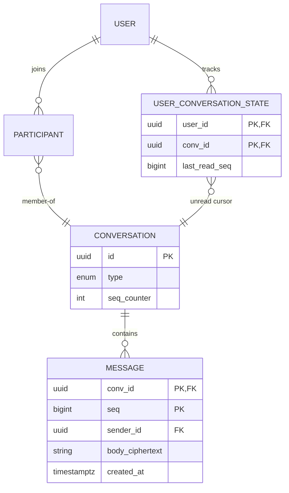
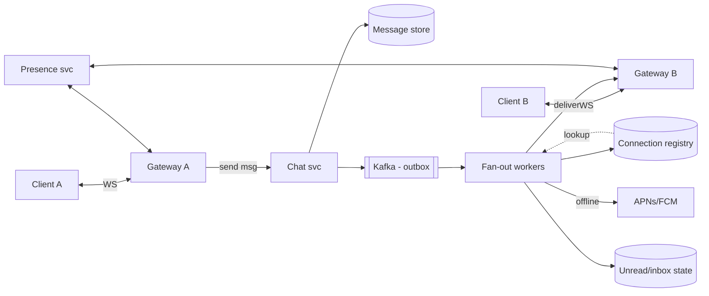
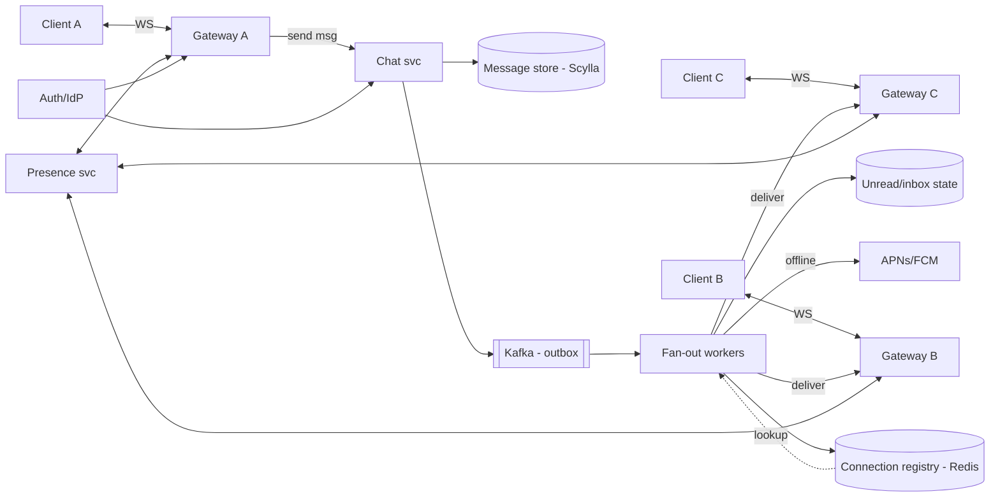

# Design a Chat System

## Blogs and websites

## Medium

## Youtube

- [Build Scaleable Realtime Chat App with NextJS and NodeJS Tutorial](https://www.youtube.com/watch?v=CQQc8QyIGl0)
- [Build Scaleable Realtime Chat App with Kafka and Postgresql](https://www.youtube.com/watch?v=Rat7ORbBDN8)

- [FAANG System Design Interview: Design A Chat System (WhatsApp, Facebook Messenger, Discord, Slack)](https://www.youtube.com/watch?v=okrR1KXNLtA)


- [How WhatsApp Knows You're Online Right Now (Redis Internals)](https://www.youtube.com/watch?v=zcbVrwS8_Ow)

### Whatspp

- [Whatsapp System Design | System Design Chat application | System design of Whatsapp application](https://www.youtube.com/watch?v=a8KUKOh3YXk)

---

## Theory

### What Is It?

A chat system (WhatsApp, Messenger, Slack, Discord) delivers messages between users in **near real time**, durably stores conversation history, synchronizes state across a user's devices, and tracks presence — at billions-of-connections scale. The core architectural challenge is maintaining millions of **long-lived persistent connections** and routing messages to whichever server currently holds each recipient's connection, while guaranteeing delivery despite disconnects.

### Why Does It Exist?

Human communication is increasingly digital and real-time. People expect messages to appear instantly across devices, to see who is available, and to share media seamlessly. A chat system exists to bridge the gap between asynchronous communication (email) and synchronous communication (phone calls) — providing a medium where conversations feel immediate yet persist for later reference, across any device and any network condition.

### What Problem Does It Solve?

* **Persistent connection scale (C10M)**: millions of users maintain open TCP/WebSocket connections simultaneously. Most systems cannot handle this — each connection consumes file descriptors, memory, and kernel resources. The system must efficiently manage these connections at planetary scale.
* **Message routing across a dynamic fleet**: when User A sends to User B, the system must know which server currently holds User B's connection. As users reconnect, switch networks, or go offline, this mapping is in constant flux.
* **Delivery guarantees despite network failures**: messages must survive sender retries, network partitions, and recipient disconnections without loss or duplication. At-least-once semantics plus idempotent receivers achieve effective exactly-once UX.
* **Offline message buffering and sync**: when recipients are offline, messages must be durably stored and delivered upon reconnect, with per-device cursors to maintain consistent state across a user's phone, laptop, and tablet.
* **Presence and ephemeral events**: typing indicators and online status are valuable UX signals but must not compromise durability or overwhelm the system with transient updates.
* **Group fan-out cost**: a message to a 100,000-member channel must not trigger 100,000 synchronous deliveries. The system must choose fan-out-on-write vs on-read based on group size.
* **End-to-end encryption vs. functionality**: E2E encryption protects message content from the server but prevents server-side search, moderation, and spam detection — a fundamental product trade-off.

### Important Subtopics

1. Requirements: 1:1 chat, group chat, online/offline/typing indicators, read receipts, delivery guarantees
2. Transport choices: WebSocket vs SSE vs long polling vs gRPC streams
3. Connection management at scale (C10M problem)
4. Message routing: session service / connection registry
5. Message fan-out for groups (fan-out-on-write vs on-read)
6. Delivery semantics: at-least-once, deduplication, ordering per conversation
7. Offline storage and sync (inbox model, cursors)
8. Presence tracking (heartbeat-based, privacy controls)
9. Message store selection (wide-column vs KV vs relational)
10. End-to-end encryption basics (Signal protocol concepts)
11. Push notifications when disconnected
12. Media attachments pipeline
13. Group membership & permission models
14. Multi-device consistency

### Requirements & Scale Estimation

**Functional**: 1:1 text chat; group chats; media sharing; delivery/read receipts; typing indicator; online presence; message history; search (nice-to-have); push when offline.

**Non-functional**: end-to-end latency < 500 ms; ordering guaranteed *per conversation* (not globally); availability > 99.99%; durability — a sent message must never be lost; scale ~500M DAU, ~50 msg/user/day → ~25B msgs/day ≈ ~300K msgs/s average, several × peak.

**Key insight**: the connection tier (long-lived sockets) is the hardest scaling problem — each server holds tens of thousands of open connections; routing requires knowing which server holds whom.

### Transport Options

| Protocol | Direction | Pros | Cons | Used by |
|---|---|---|---|---|
| WebSocket | Full duplex | True realtime, single TCP conn, low overhead | Server must hold conn state; LB complexity | WhatsApp/Messenger class |
| SSE | Server→client only + separate POSTs | Simplicity, HTTP-native, auto-reconnect | No native upstream channel; HTTP/1.1 6-conn limit | Notification-heavy apps |
| Long polling | Emulated duplex | Works everywhere incl. ancient proxies | High overhead, latency spikes | Legacy fallback |
| gRPC bidirectional streaming | Full duplex | Efficient binary, strong contracts | Browser support needs grpc-web proxies | Internal/mobile heavy systems |

Production mobile apps typically use WebSocket with aggressive keepalive tuning plus OS-level push (APNs/FCM) as the offline fallback — battery constraints forbid naive sockets on iOS background.

### Connection Registry (Who Is Where)

The heart of routing: a mapping `userId → {serverId, deviceId[]}` updated as clients connect/disconnect.

- Redis cluster keyed `conn:{userId}` → set of gateway nodes serving that user's devices, TTL-refreshed by heartbeats (~30 s) so crashed gateways auto-expire.
- Gateways register on connect, deregister (or let TTL lapse) on disconnect.
- Senders look up recipients here before dispatching downstream frames.

### Fan-Out Strategies for Groups

For a message to group G:

- **Fan-out-on-write**: deliver copies to every member's inbox/connection at send time. Fast reads (everything pre-delivered); expensive for celebrity-sized groups (one message = 100K deliveries).
- **Fan-out-on-read**: store once; members pull when they open the app. Cheap writes; slow cold opens; needed for very large groups/channels (Discord channels, Telegram megagroups).
- Hybrid (industry standard): small groups (<~100) fan out on write; large groups/channels mark the message available and rely on read-path sync + unread counters.

### Delivery Semantics

- Sender → server: client retries with client-generated `msgId` (UUID); server dedupes.
- Server → recipient: at-least-once over the socket; client dedupes by `msgId`.
- Ordering: monotonic per-conversation sequence number assigned by the conversation's home partition — clients order by `(conversationId, seq)`; cross-conversation ordering is meaningless by design.
- Acknowledgment ladder: `sent → delivered (device acked) → seen (user-visible)` — receipts are themselves lightweight messages.

### Presence

Heartbeats update `presence:{userId}` (online/last-seen). Typing indicators are ephemeral events — never persisted, routed directly over active connections, dropped silently if recipient offline.

### Storage Model

Per-conversation partitioned log of immutable messages + per-user inbox pointers:



Wide-column/Cassandra-style storage fits naturally (partition = conversation, clustering = seq), giving O(1) appends and efficient range reads for history scroll-back.

---

## Characteristics

- **Persistent connection-centric**: capacity planned in concurrent sockets, not QPS; gateway fleet sized by memory/file-descriptor budgets per node.
- **Asynchronous by nature**: sender success ≠ receiver read; the system bridges arbitrary device states via durable queues.
- **Per-conversation ordering, global concurrency**: strict total order across all conversations is neither needed nor affordable; per-partition sequences suffice.
- **At-least-once + idempotency**: retries everywhere; duplicates eliminated by client-generated IDs rather than expensive exactly-once machinery.
- **Presence is best-effort**: staleness acceptable (last-seen timestamps); never block message flow on presence accuracy.
- **Offline-first UX**: the app must feel instant regardless of connectivity; local DB + sync protocol do the illusion work.
- **Privacy-preserving options**: E2E encryption shifts trust from servers to endpoints; servers route ciphertext they cannot read (metadata remains visible unless mitigated).

---

## Components

- **Gateway / Connection layer**
  *Purpose*: terminate WebSockets/SSE at massive concurrency. *Responsibilities*: handshake/auth on connect, heartbeat tracking, frame encode/decode, backpressure, reconnection handling, forwarding downstream frames to its attached clients. *Relationship*: front tier; talks to routers/services via internal bus or RPC. *Example*: Netty/Erlang-based fleets; Discord's Elixir/gateway architecture.

- **Session/Connection registry**
  *Purpose*: userId → gateway map. *Responsibilities*: TTL bookkeeping, multi-device entries, lookup API for senders. *Example*: Redis cluster with heartbeat refresh (see Theory).

- **Chat/message service**
  *Purpose*: accept messages, assign sequence numbers, persist, trigger fan-out. *Responsibilities*: validation, dedupe, ordering per conversation, write to store + event bus atomically (outbox), handle group fan-out policy. *Relationship*: brain of the write path.

- **Message store**
  *Purpose*: durable conversation logs. *Responsibilities*: append-only writes, range queries for history, TTL/archival policies. *Example*: Cassandra/DynamoDB/HBase; ScyllaDB at Discord scale (see their Trillion Messages posts).

- **Fan-out workers**
  *Purpose*: translate "message persisted" events into per-recipient deliveries. *Responsibilities*: resolve online devices via registry, push frames to gateways, enqueue pushes for offline users, maintain inbox/unread structures. *Example*: Kafka consumers doing the write-side fan-out.

- **Push notification service**
  *Purpose*: reach users with no live connection via APNs/FCM. *Responsibilities*: payload crafting (metadata-only if E2E), rate limiting, receipt tracking. *Example*: every mobile chat ships this; silent pushes also wake apps to sync.

- **Media/blob service**
  *Purpose*: attachment upload/download. *Responsibilities*: presigned uploads, thumbnailing, AV scanning, CDN delivery. *Example*: S3 + CloudFront behind short-TTL signed URLs.

- **Presence service**
  *Purpose*: online status + last-seen. *Responsibilities*: heartbeat ingestion (batched), subscription fanout to interested parties, privacy filtering (nobody/hide-last-seen settings).



---

## Patterns

- **Sticky long connections + registry routing**
  *Problem*: any-to-any message delivery across a dynamic fleet. *How*: registry maps users→gateways; senders/routers consult it. *When*: any socket-based system. *Pros*: direct downstream push, minimal latency. *Cons*: registry is hot — cache aggressively, batch lookups.

- **Transactional outbox**
  *Problem*: persisting the message AND publishing the fan-out event must be atomic. *How*: both written in one DB transaction; relay ships rows to Kafka. *Why*: avoids lost fan-outs on partial failure. Universal pattern worth naming in interviews.

- **Hybrid fan-out** (described above): threshold-based strategy switch.

- **Sequence-number ordering**: conversation partitions own monotonically increasing seq (single-writer per partition makes this trivial); clients detect gaps and issue catch-up sync requests.

- **Sync protocol with cursors**: each device tracks `last_seq` per conversation; on reconnect asks "everything after X" — the same mechanism powers multi-device consistency and offline catch-up.

- **Ephemeral-vs-durable split**: typing/presence events ride direct routes and die with the connection; messages always traverse durable paths. Mixing these up causes either data loss or pointless persistence costs.

- **Backpressure-aware gateways**: bounded outbound buffers; slow consumers get queued to disk or pushed to offline mode instead of OOM-ing the gateway — classic production hardening detail interviewers love.

---

## Benefits

- **True realtime collaboration** unlocks product categories (support, gaming, trading floors).
- **Durability guarantees build trust** — "message sent" means it survives anything except user deletion.
- **Multi-device continuity** is achievable cleanly because state lives server-side with per-device cursors.
- **Elastic scale**: gateways and services scale horizontally; conversations shard naturally.
- **Event spine reuse**: the same Kafka backbone feeds analytics, moderation, ML features (spam detection) without touching the chat path.

---

## Pros

- Sub-second delivery worldwide with modest infra per message.
- Clean horizontal scaling story: shards by conversation, gateways by connections.
- At-least-once + dedup achieves effectively-once UX without exotic protocols.
- Rich feature surface (receipts, presence, reactions) composes atop one transport.

## Cons

- Gateway tier is operationally demanding: file-descriptor limits, GC pauses causing mass reconnect storms, deploy-time connection draining.
- Reconnection stampedes after network blips or deployments can melt registries (mitigate with jittered reconnects, rate-limited reauth).
- E2E encryption forfeits server-side search/moderation capabilities — product trade-off, not just tech.
- Group fan-out costs explode with size; hybrid logic adds code complexity.
- Multi-region presence/messaging introduces latency-vs-consistency decisions (home-region-per-user models).

---

## Challenges

- **Technical**: exactly-once *appearance* under at-least-once plumbing (dedupe windows, ID discipline); sequence-gap repair during partitions; clock skew affecting timestamps display.
- **Scalability**: C10M-class connection counts; Kafka partition hot spots from celebrity group traffic; registry write amplification during mass reconnects.
- **Performance**: p99 latency tail from GC pauses on gateway nodes (ZGC/Shenandoah or off-heap solutions); history pagination for decade-old conversations (index design + archival tiers).
- **Reliability**: regional failover for connections (clients auto-reconnect to healthy region; in-flight messages replayed from store); zero message loss through gateway crashes (ack only after durable persist).
- **Maintainability**: protocol evolution across billions of installed clients — versioned frame schemas, long deprecation tails.
- **Operational**: draining connections during deploys gracefully (send GOAWAY, stagger reconnects); capacity dashboards in connections-per-node terms.
- **Security**: spam/abuse at scale (ML classifiers on metadata+reports since content may be encrypted), phishing link protection, account takeover recovery flows, metadata minimization debates.

---

## Best Practices

- **Ack messages only after durable persistence** — client UI may show optimistic ticks but truth lives server-side.
- **Client-generated UUIDs on every message** — dedupe becomes trivial and retry-safe.
- **Heartbeats with jitter** (±20%) prevent synchronized thundering herds after network recovery.
- **Separate control plane (auth/presence/receipts) from data plane (messages)** — different scaling and failure profiles.
- **Bound everything**: outbound queues, fan-out batch sizes, registry entry TTLs — unbounded buffers are how chat gateways die.
- **Deploy with connection draining**: mark gateway unhealthy → wait N minutes → close with reconnect hints; combined with client exponential backoff+jitter.
- **Design unread counts as first-class state** (`USER_CONVERSATION_STATE.last_read_seq`) — cheap increments beat recount queries.
- **Encrypt in transit always (TLS); evaluate E2E honestly against product needs** (searchability, compliance, moderation duties).
- **Test with chaos**: kill random gateways under load; assert zero message loss and bounded reconnect storm amplitude.

---

## When to Use / Not Use

A bespoke chat backend suits products where messaging is core (marketplaces, telehealth, gaming social). Consider alternatives when:

- Standard business chat → embed Intercom/Stream/Twilio Conversations; building this is weeks of undifferentiated work.
- In-app community features → SDKs (Stream, PubNub) cover 90%.
- Pure broadcast updates → push notifications or SSE suffice; no need for full duplex.

Decision factors: differentiation value of messaging, scale trajectory, compliance/E2E requirements, team bandwidth, budget for the operational burden described above.

---

## Use Cases

- **WhatsApp-class consumer messenger**
  *Problem*: 2B users, E2EE, tiny per-message infrastructure budget. *Solution*: Erlang/OTP-ish connection fleets, Signal-protocol E2EE, sparse metadata storage, phone-number identity. *Trade-off*: no server-side search; backups become client-managed.

- **Slack-class workplace chat**
  *Problem*: deep history search, integrations, threads, enterprise compliance. *Solution*: plaintext-at-rest (with enterprise key management), powerful search indexes, webhook/bot APIs, retention policies. *Trade-off*: E2EE abandoned deliberately for functionality/compliance.

- **Discord-class community platform**
  *Problem*: million-member channels where fan-out-on-write would explode. *Solution*: fan-out-on-read channels + presence-light design + event-driven permission updates. *Trade-off*: slower cold-open sync for lurkers; massively cheaper writes.

---

## Architecture

### Architectural Style

**Stateful connection layer + stateless service layer + durable event-backed storage**: chat is one of the few systems where you cannot avoid holding per-connection state (the open WebSocket), so the gateway tier is inherently stateful while the chat/service tier is stateless and horizontally scalable. A Kafka-style event backbone decouples message persistence from fan-out delivery, and Cassandra/ScyllaDB provides the wide-column store for conversation logs keyed by `(conv_id, seq)`.



**Data flow**: client → gateway (auth + frame) → chat service (validate + persist + emit event) → outbox → fan-out workers (lookup recipients in registry) → deliver to online gateways or enqueue push for offline.

**Scaling strategy**: gateways scale on concurrent connections (memory + file descriptors); chat-service shards by `hash(convId)` for per-conversation sequencing; fan-out workers scale on consumer-group parallelism; message store partitions by `convId`; Redis cluster shards registry by `userId`.

**Failure handling**: gateway crash → clients reconnect with backoff+jitter, registry TTLs expire stale entries, undelivered persisted messages synced on reconnect. Regional outage → DNS/anycast shift + client region fallback. Kafka lag → deliveries delayed but never lost (store already committed).

### Component Responsibilities and Communication

| Component | Responsibility | Communication |
|---|---|---|
| Gateway / Connection layer | Terminate WebSockets, auth on connect, heartbeat tracking, frame encode/decode, backpressure, reconnection handling | WS to clients; sync RPC or event bus to chat service |
| Session/Connection registry | userId → gateway mapping with TTL | Redis cluster, heartbeat-refresh, batched lookups |
| Chat/Message service | Accept messages, assign seq numbers, persist, emit events | Sync to message store + outbox; calls to registry |
| Message store | Durable conversation logs | ScyllaDB/Cassandra, partitioned by convId |
| Fan-out workers | Deliver persisted messages to recipients | Kafka consumers; calls to registry + gateways/push |
| Push notification service | Offline delivery via APNs/FCM | Async; idempotent; rate-limited |
| Presence service | Online status + last-seen | Heartbeat ingestion, subscription fanout |
| Media/Blob service | Attachment upload/download, thumbnailing, AV scanning | S3 presigned URLs + CDN |

## Design

### Design Considerations

The central tension in chat design is **connection state vs. horizontal scalability**. The gateway tier must hold millions of open sockets (inherently stateful), while the chat-service tier must remain stateless to scale independently. Bridging these requires a connection registry that can efficiently answer "which gateway serves user X?" without itself becoming a bottleneck. Secondary considerations: at-least-once delivery is achievable but effectively-once requires application-level idempotency; presence is best-effort (staleness is acceptable); and E2E encryption is a product decision (it disables server-side search/moderation).

### Key Decisions

- **Per-conversation sequence numbers assigned by a single-writer shard**: `hash(convId)` routes all writes for a conversation to one chat-service instance, so ordering is trivial via `UPDATE seq + 1 RETURNING seq`.
- **Transactional outbox**: message-row + event-row persisted in one transaction; relay publishes to Kafka — guarantees the event exists iff the message was committed.
- **Hybrid fan-out threshold**: groups ≤ ~100 members use fan-out-on-write (fast reads); larger groups use fan-out-on-read with incremental unread counters.
- **Client-generated `clientMsgId` on every message**: dedupe is trivial and retry-safe.
- **Acknowledgment-after-persistence**: the sender only sees "sent" ticks after the message is durably stored — prevents loss on crash after socket write but before disk write.

### Trade-offs

| Decision | Pro | Con |
|---|---|---|
| Stateful gateways | Direct push, low latency | Reattach complexity, file-descriptor limits, GC pause reconnect storms |
| Stateless chat service | Easy horizontal scale | Per-conversation ordering requires sharding discipline |
| At-least-once + dedupe | No distributed transactions | Client must be idempotent; storage cost for dedupe window |
| E2E encryption | Content confidentiality | No server-side search/moderation; key verification UX needed |
| Fan-out-on-write | Fast opens (everything pre-delivered) | Cost explodes with group size |
| Fan-out-on-read | Cheap writes for large groups | Slow cold opens; unread counters add complexity |

### Scalability Considerations

- **C10M connections**: gateways sized by memory/file-descriptor budget; use off-heap or native (Netty/Erlang) connection handling; batch heartbeats; local gateway caching of own sessions (registry mainly for *other* users).
- **Registry write amplification**: during mass reconnects, batch pipeline lookups and writes; local gateway caches reduce external registry pressure.
- **Kafka hot spots**: key topics by `convId`; celebrity group traffic needs careful partition sizing.
- **Message store**: ScyllaDB/Cassandra per-conversation partitioning; range queries on `seq`; TTL/archival for old history.

### Reliability Considerations

- **Zero message loss through gateway crashes**: ack only after durable persist; reconnection replay from store sync fills gaps.
- **Reconnect storm mitigation**: rolling drains with GOAWAY, client backoff with heavy jitter (0–30 s), handshake rate-limiting/admission queues.
- **Regional failover**: clients have a region fallback list; anycast/DNS shift routes new connections; in-flight messages replayed from store.
- **Gap detection and repair**: clients detect missing sequence numbers and issue sync requests (`after=seq`).

### Performance Considerations

- Gateway p99 dominated by GC pauses — use ZGC/Shenandoah or off-heap solutions to minimize reconnect storms.
- History pagination for decade-old conversations requires careful index design + archival tiers (cold storage for old messages).
- Presence updates must be cheap — batched heartbeats, deferred fanout, staleness acceptable.
- WebSocket frame overhead is minimal but connection-establishment cost is not — amortize with connection reuse and keepalive tuning.

### Security Considerations

- **Spam/abuse at scale**: ML classifiers on metadata + reports (content may be encrypted); phishing link protection; reputation scoring per sender.
- **E2E encryption**: Signal protocol for content confidentiality; servers become blind couriers — no content indexing/search/moderation server-side.
- **Metadata exposure**: even with E2E encryption, metadata (who talks to whom, when) remains visible unless actively minimized (sealed sender, private groups).
- **Account takeover**: secure recovery flows, device verification, anomaly detection on login patterns.
- **Push notification payload**: send metadata-only when E2E encrypted (actual content never touches push channels).

### Maintainability Considerations

- **Protocol evolution**: versioned frame schemas with long deprecation tails — billions of installed clients can't upgrade overnight.
- **Connection draining**: deploy with GOAWAY frames, staggered reconnect windows, and client-side backoff.
- **Chaos testing**: kill random gateways under load; assert zero message loss and bounded reconnect-storm amplitude.
- **Observability**: delivery funnel metrics (sent→persisted→fanned→delivered→seen) with per-stage histograms; alert on fan-out lag, registry error rates, per-gateway connection churn.

## API Contract

### WebSocket Message API

Messages are JSON frames exchanged over an authenticated WebSocket connection. Every message includes a client-generated `clientMsgId` for dedupe.

**Client → Server (send message)**:

```json
{
  "type": "message_send",
  "conversationId": "conv-abc123",
  "clientMsgId": "msg-9f3a",
  "content": "Hello team!",
  "attachments": []
}
```

**Server → Client (message delivered)**:

```json
{
  "type": "message_delivered",
  "conversationId": "conv-abc123",
  "seq": 4567,
  "senderId": "user-123",
  "clientMsgId": "msg-9f3a",
  "content": "Hello team!",
  "timestamp": "2024-02-14T10:30:00Z"
}
```

**Receipt events**:

```json
{ "type": "message_delivered_ack", "conversationId": "conv-abc123", "seq": 4567 }
{ "type": "message_seen_ack", "conversationId": "conv-abc123", "seq": 4567 }
{ "type": "typing_start", "conversationId": "conv-abc123", "userId": "user-456" }
```

**Presence events** (ephemeral, not persisted):

```json
{ "type": "presence_update", "userId": "user-456", "status": "online", "lastSeen": "2024-02-14T10:29:00Z" }
```

### REST API (history, media, presence)

```
GET  /api/v1/conversations/{convId}/messages?afterSeq=4500&limit=50
POST /api/v1/conversations/{convId}/messages         # REST fallback for sends
POST /api/v1/media/upload                             # presigned URL for attachments
GET  /api/v1/presence/{userId}
GET  /api/v1/conversations                            # paginated list of user's conversations
```

**History request** supports cursor-based pagination via `afterSeq` and `limit`, ordering by `seq` ascending. Presence endpoint returns best-effort last-known status (may be stale by design).

### Status Codes & Semantics

* WebSocket close codes: `1000` (normal), `4401` (auth expired — reconnect with refresh), `4403` (banned).
* REST: `200/201` success, `401` token invalid/expired, `403` not a member, `409` for idempotent retry collision, `429` rate-limited (with `Retry-After`), `503` degraded (waiting room / offline mode).

## High-Level Design

End-to-end message journey:

```mermaid
sequenceDiagram
    participant SA as Sender App
    participant GS as Sender Gateway
    participant CS as Chat Service
    participant K as Kafka (outbox)
    participant ST as Message Store
    participant FO as Fan-out Worker
    participant RG as Registry
    participant GR as Recipient Gateway
    participant RA as Recipient App
    participant PN as Push Svc

    SA->>GS: SEND {convId, clientMsgId, ciphertext}
    GS->>CS: forward frame
    CS->>CS: auth, dedupe(clientMsgId), validate membership
    CS->>ST: append(convId, seq=next, msg)
    CS->>K: publish MessagePersisted (same txn via outbox relay)
    CS-->>SA: ACK {seq}  → sender shows single tick
    K->>FO: consume
    FO->>RG: where are recipients?
    alt recipient online
        RG-->>FO: gateway GR, deviceId
        FO->>GR: DELIVER {msg}
        GR->>RA: push frame
        RA-->>GR: ack → delivered tick propagates back
    else offline
        FO->>PN: notify(metadata)
        Note over PN: FCM/APNs wakes device; app syncs on open
    end
```

Scaling notes: chat-service stateless per request but owns per-conversation sequencing via partitioned writers (hash(convId)); Kafka partitions keyed convId preserve ordering into fan-out; gateways autoscale on connection count; registry = Redis Cluster sharded by userId.

Failure handling: gateway crash → clients reconnect (backoff+jitter), registry TTL expires ghost entries, undelivered-but-persisted messages picked up by device sync on reconnect; regional outage → DNS/anycast shift + clients' region fallback list; Kafka lag → deliveries delayed but never lost (store already committed).

---

## Deep Dive

- **Sequencing internals**: conversation hash → owning chat-service shard keeps `next_seq` in memory with WAL/fenced writes; replicas take over via Raft-group or by re-deriving from store max(seq) during failover fencing. Gap detection on clients triggers `/sync?after=seq`.
- **Dedupe window**: server keeps recent `(senderId, clientMsgId)` LRU per shard; older dupes rejected naturally by unique constraint `(conv_id, sender_id, client_msg_id)` in store — belt and suspenders.
- **Reconnect storm math**: 50K connections/node × 200-node fleet redeployed naively = 10M reconnect burst; fix = rolling drain (5% batches), client jitter 0–30 s, admission-rate-limited handshake tier. This arithmetic impresses interviewers more than any diagram.
- **E2EE overview (Signal-style)**: X3DH key agreement establishes shared secret; Double Ratchet advances keys per message (forward secrecy); servers relay opaque ciphertexts + minimal envelope. Implications: no server dedupe/ordering visibility beyond envelopes, receipts still possible via opaque acks.
- **Observability**: track delivery funnel (sent→persisted→fanned→delivered→seen) with per-stage histograms; alert on fan-out lag (Kafka offset age), registry error rates, per-gateway connection churn; synthetic 1:1 loops probing e2e latency per region continuously.

---

## Java and Spring Boot Implementation

Spring Boot supports WebSockets natively (STOMP) — below, a simplified gateway + service sketch showing the patterns in Java terms:

```java
@Configuration
@EnableWebSocket
public class WebSocketConfig implements WebSocketConfigurer {

    private final ChatHandshakeInterceptor authInterceptor;
    private final ChatFrameHandler chatFrameHandler;

    public WebSocketConfig(ChatHandshakeInterceptor authInterceptor,
                           ChatFrameHandler chatFrameHandler) {
        this.authInterceptor = authInterceptor;
        this.chatFrameHandler = chatFrameHandler;
    }

    @Override
    public void registerWebSocketHandlers(WebSocketHandlerRegistry registry) {
        registry.addHandler(chatFrameHandler, "/ws/chat")
                .addInterceptors(authInterceptor)   // JWT validated at upgrade time
                .setAllowedOrigins("https://app.example.com");
    }
}
```

Connection registry + routing service:

```java
@Service
public class ConnectionRegistry {

    private final StringRedisTemplate redis;

    public ConnectionRegistry(StringRedisTemplate redis) { this.redis = redis; }

    public void register(String userId, String gatewayId, Duration ttl) {
        redis.opsForSet().add("conn:" + userId, gatewayId);
        redis.expire("conn:" + userId, ttl);
    }

    public Set<String> gatewaysFor(String userId) {
        return redis.opsForSet().members("conn:" + userId);
    }

    public void deregister(String userId, String gatewayId) {
        redis.opsForSet().remove("conn:" + userId, gatewayId);
    }
}

@Service
public class ChatService {

    private final ConversationRepository conversations;
    private final MessageRepository messages;
    private final ConnectionRegistry registry;
    private final GatewayDispatcher dispatcher;
    private final OutboxWriter outbox;

    @Transactional
    public long send(String convId, String senderId, String clientMsgId, String body) {
        if (messages.existsByConvIdAndSenderAndClientMsgId(convId, senderId, clientMsgId)) {
            return messages.findSeq(convId, senderId, clientMsgId); // idempotent retry
        }
        long seq = conversations.nextSeq(convId);   // row lock / atomic UPDATE
        messages.persist(new Message(convId, seq, senderId, clientMsgId, body));
        outbox.write(new MessagePersisted(convId, seq, senderId));
        return seq;
    }

    /** Called by fan-out workers after consuming the outbox stream. */
    public void fanOut(String convId, long seq, List<String> recipientIds) {
        for (String userId : recipientIds) {
            var gateways = registry.gatewaysFor(userId);
            if (gateways.isEmpty()) {
                pushNotifier.notifyAsync(userId, convId, seq);
            } else {
                dispatcher.deliver(gateways, userId, convId, seq);
            }
        }
    }
}
```

Controller for REST fallback (media, history):

```java
@RestController
@RequestMapping("/api/v1/conversations/{convId}/messages")
public class HistoryController {

    private final MessageRepository messages;

    @GetMapping
    Page<MessageDto> history(@PathVariable String convId,
                             @RequestParam(defaultValue = "0") long afterSeq,
                             @PageableDefault(size = 50) Pageable page,
                             Authentication who) {
        membershipChecker.assertMember(convId, who.getName());
        return messages.findByConvIdAfterSeqOrderBySeqAsc(convId, afterSeq, page);
    }
}
```

Notes: `@Transactional` covers message-row + outbox-row atomically (the relay publishes to Kafka separately — transactional outbox pattern); `nextSeq` uses `UPDATE ... SET seq = seq + 1 RETURNING seq` for atomic per-conversation ordering; production adds Netty-backed gateways (or spring-websocket with tuned containers), Resilience4j around push calls, and Testcontainers integration tests asserting dedupe + ordering under concurrent sends.

---

## Real-World Examples

- **WhatsApp** — famously ~450+ engineer team supporting billions: Erlang connection efficiency, Signal E2EE default-on, multimedia via encrypted blobs, minimal server metadata philosophy.
- **Facebook Messenger** — Haxl/Orc-style service mesh, hybrid fan-out, AI features (suggestions) riding the message pipe; documented their move to a unified infra with Instagram DMs.
- **Discord** — published extensively: Elixir gateway, ScyllaDB trillion-message storage, their 2023 outage postmortems teaching fan-out and data-tier lessons; Jitsi integration for voice.
- **Slack** — WebSocket RTM API evolution toward event-driven platform; enterprise grid multi-workspace identity federation.

---

## Interview Preparation

### Interview Questions

**Beginner**

1. **WebSocket vs HTTP polling for chat?**
   Polling wastes round-trips and adds latency proportional to poll interval; WebSocket gives persistent full-duplex channel with negligible per-message overhead — necessary for sub-second delivery at scale.
2. **How does a message reach an offline user?**
   Persist immediately (it's durable), then fire a push notification via APNs/FCM; when the user opens the app, the device syncs missed messages using its stored cursor.

**Intermediate**

3. **How do you guarantee message ordering?**
   Per-conversation sequence numbers assigned by the conversation's owning shard; clients order by that. Explicitly reject global ordering as unnecessary — cross-conversation interleaving is unobservable to users. Follow-up: what about ordering between two people typing simultaneously in a group? Same mechanism — server assigns final order at persist time.
4. **Design the connection registry. What breaks first at scale?**
   Redis set-per-user with heartbeat TTLs. First bottleneck: write amplification during mass reconnects — mitigate with batching pipelines, local gateway caching of its own sessions (registry consulted mainly for *other* users), longer TTLs with faster liveness checks done gateway-internally.
5. **Explain fan-out-on-write vs on-read with concrete thresholds.**
   ≤ ~100 members: on-write (precompute deliveries, fast opens). Beyond: on-read (single write, members pull + unread badges maintained incrementally). Numbers vary by product; the reasoning (write cost ∝ members vs read cost amortized) is what matters.

**Advanced**

6. **Walk through delivering a message exactly once to each device without distributed transactions.**
   At-least-once everywhere + idempotent receivers: clientMsgId dedupes sender retries; device-side dedup by msgId; ack-driven cursor advancement for redelivery suppression. Show awareness that true exactly-once delivery semantics is a myth without application-level idempotency — say it explicitly.
7. **A gateway deployment just disconnected 800K users. What happens and how do you survive it?**
   Storm anatomy: simultaneous reconnects overwhelm handshakes and registry writes. Survivors: rolling drains with GOAWAY + drain periods, client backoff with heavy jitter, handshake rate limiting/admission queues, registry batch pipelines, presence updates deferred until stable. Postmortem framing: measure storm half-life, tune constants empirically.

**Senior / system design**

8. **Design WhatsApp-scale chat with E2EE: what changes architecturally?**
   Servers become blind couriers: no content indexing/search/moderation server-side, receipts via opaque acks, media as encrypted blobs with content-addressed keys distributed via the message envelope, key verification UX, multi-device requires per-device curve negotiations. Metadata minimization choices (hide group membership? sealed sender?) discussed as product-policy trade-offs.
9. **Multi-region chat: how do you place conversations and users?**
   Home-region-per-conversation (latency follows geography of participants; cross-region convos pick midpoint or primary-participant home), registry globally replicated (eventually consistent OK — stale gateway hits fall back to store-sync path), DR posture: region loss = conversations homed there temporarily degraded, clients transparently sync from replicas. Trade-offs: cross-region writes for scattered groups vs pinning.

### Common Mistakes

- Global message ordering attempts (pointless, kills throughput).
- Persisting typing indicators or presence as durable events.
- Trusting TCP delivery — process crash after socket write but before disk write loses messages; ack-after-persist fixes it.
- Unbounded gateway buffers letting one slow client OOM a node serving 50K others.
- Forgetting dedupe and double-rendering messages after client retries.

### Expected discussion points

Delivery-semantics vocabulary precision (at-least-once vs effective-once), the economics of connection density (why Erlang/Netty dominate), fan-out threshold reasoning, reconnect-storm arithmetic, and honest E2EE trade-off analysis.
