# Design Data Warehouse

## Blogs and websites

## Medium

## Youtube

- [Design a Data Warehouse | System Design](https://www.youtube.com/watch?v=NZ_-2RB-NU0)

---

## Theory

### Topics Covered

1. [Introduction / Problem Statement](#introduction--problem-statement)
2. [Characteristics](#characteristics)
3. [Pros](#pros)
4. [Cons](#cons)
5. [Use Cases](#use-cases)
6. [Components](#components)
7. [Architectural Patterns](#architectural-patterns)
8. [Benefits](#benefits)
9. [Challenges](#challenges)
10. [Best Practices](#best-practices)
11. [When to Use / When Not to Use](#when-to-use--when-not-to-use)
12. [Data Model and API](#data-model-and-api)
13. [Domain-Specific Deep Dive](#domain-specific-deep-dive)
14. [Replication Strategies](#replication-strategies)
15. [Failure Detection and Membership](#failure-detection-and-membership)
16. [High Availability and Scalability](#high-availability-and-scalability)
17. [Performance and Optimization](#performance-and-optimization)
18. [CAP Theorem and Consistency Trade-offs](#cap-theorem-and-consistency-trade-offs)
19. [Encryption and Key Management](#encryption-and-key-management)
20. [Authentication and Authorization](#authentication-and-authorization)
21. [Security Threats and Mitigations](#security-threats-and-mitigations)
22. [Observability and Logging](#observability-and-logging)
23. [Real-World Implementations](#real-world-implementations)
24. [Java and Spring Boot Implementation Guide](#java-and-spring-boot-implementation-guide)
25. [Interview Questions and Answers](#interview-questions-and-answers)

---

### Introduction / Problem Statement

A **data warehouse (DW)** is a centralized analytical store that integrates data from many operational systems (OLTP) into a form optimized for **analytics (OLAP)**: complex aggregations, historical trend analysis, and decision support — not transactional throughput. The classic definition (Bill Inmon) is that a warehouse is **subject-oriented, integrated, time-variant, and non-volatile**. Modern cloud warehouses (Snowflake, BigQuery, Redshift, Databricks) separate compute from storage, run on object stores with columnar file formats, and scale elastically on demand.

Transactional applications are optimized for single-row inserts, updates, and point reads at high QPS. Running analytics on them — full-table scans and heavy aggregations over billions of rows — locks tables, bloats row stores, and degrades user-facing performance. A data warehouse cleanly separates these two workloads: operational systems stay fast for transactions, while analytics run against a purpose-built, columnar, denormalized, massively parallel store.

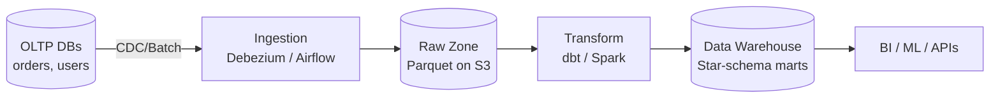

*The diagram shows the canonical data flow from operational sources through ingestion, a raw landing zone, transformation, and into a curated warehouse consumed by analytics, ML, and downstream APIs.*

---

### Characteristics

- **Subject-oriented**: organized around business entities (customers, orders, products) rather than applications; CRM, billing, and web logs converge into a unified customer view.
- **Integrated**: a single, consistent encoding across sources — one "country" taxonomy, one currency policy, deduplicated identities.
- **Time-variant**: every fact is anchored in time; history is preserved so "as-of" and trend queries are always answerable (SCD Type 2).
- **Non-volatile**: append-mostly; historical facts are not updated in place — corrections arrive as new rows or retractions, preserving auditability.
- **Read-optimized denormalization**: wide dimension tables and star schemas deliberately trade normalization for scan speed on columnar engines.
- **Separation of storage and compute**: multiple isolated compute clusters (virtual warehouses) share one governed dataset, so teams scale independently.
- **Schema-on-write (warehouse) vs schema-on-read (lake)**: warehouses enforce structure at ingest; data lakes defer it; lakehouses blend both with ACID on object storage.

---

### Pros

- **SQL as a universal interface** — a massive talent pool and tool ecosystem (Tableau, Power BI, Superset, notebooks).
- **Elastic economics** — cloud warehouses convert capex to opex; idle compute scales to zero or pauses (BigQuery slots, Snowflake auto-suspend).
- **Mature optimization stack** — partition pruning, columnar layouts, zone maps, and vectorized MPP deliver second-level queries over petabyte-scale data.
- **Strong governance** — column masking, row-access policies, data lineage, and fine-grained ACLs are built-in.
- **Workload isolation** — separate compute pools for BI dashboards, batch ETL, ad-hoc analysis, and ML training prevent noisy neighbors.
- **Reproducible analytics** — immutable, versioned marts mean a report run today matches one run a year ago.

---

### Cons

- **Cost surprises** — per-scan pricing punishes unpartitioned tables (BigQuery bytes scanned); Snowflake bills per-second-per-warehouse, so a forgotten always-running cluster burns money.
- **Freshness floor without CDC** — most warehouses refresh on batch intervals; true real-time needs extra streaming/CDC investment and a serving layer.
- **Modeling rigidity** — changing fact granularity after the fact forces painful migrations and backfills.
- **Vendor coupling** — proprietary SQL dialects and features complicate migration between Snowflake, BigQuery, and Redshift.
- **Pipeline sprawl** — hundreds of dbt models need real software practices (CI, testing, ownership) or they decay quickly.

---

### Use Cases

- **Enterprise analytics and KPI dashboards** — finance, sales, and product teams converge on one governed copy of revenue, retention, and inventory so "whose number is right?" never arises.
- **Cross-source correlation and funnel analysis** — joining clickstream, orders, and support tickets reveals conversion drop-off and customer-journey insights no single source system can produce.
- **Historical forecasting and cohort analysis** — years of consolidated history power seasonality modeling and cohort retention curves that live OLTP systems (which keep only current state) cannot answer.
- **ML training and feature engineering** — the warehouse's time-variant, audited history is the source of truth for reproducible model training and SCD-correct feature extraction.

---

### Components

A data warehouse is a system of cooperating components rather than a single box.

- **Source systems** — *Purpose*: OLTP databases, SaaS APIs, event streams, files/logs. *Relationship*: they are the origin of truth whose schema churn drives pipeline maintenance. *Example*: a Postgres order DB, the Shopify API, and an application clickstream.
- **Ingestion layer** — *Purpose*: move data reliably. *Responsibilities*: batch loaders (Snowflake COPY, Fivetran, Airbyte), CDC connectors (Debezium), streaming producers; schema-drift detection; idempotent/exactly-once loads. *Example*: Debezium reading the MySQL binlog into Kafka, then a sink connector landing Parquet in S3.
- **Staging / raw zone** — *Purpose*: immutable landing area preserving source fidelity. *Responsibilities*: append-only, cheap object storage, full replay. *Example*: an S3 bucket laid out `dt=/source=/hour=`; the "bronze" layer in the medallion architecture.
- **Transformation layer** — *Purpose*: cleanse, conform, model. *Responsibilities*: dbt/SQL models building staging → marts, SCD2 logic, surrogate-key generation, and tests (uniqueness, not-null, freshness). *Example*: a dbt project where `dim_customer.sql` materializes SCD2 history.
- **Warehouse core** — *Purpose*: columnar MPP storage + SQL engine. *Responsibilities*: query planning/execution, partition pruning, result caching, concurrency scaling. *Examples*: Snowflake virtual warehouses, BigQuery slots, Redshift RA3.
- **Orchestration** — *Purpose*: schedule dependencies, retries, backfills. *Responsibilities*: DAGs (Airflow, Dagster, Prefect), SLA monitoring, idempotent task design.
- **Semantic/metrics layer** — *Purpose*: single definitions for "active user", "GMV". *Responsibilities*: a metric DSL consumed by BI tools and APIs so two dashboards cannot disagree. *Examples*: Cube, the dbt Semantic Layer, LookML.
- **BI / consumption tools** — *Examples*: Looker, Tableau, Superset, notebooks for data science.
- **Governance stack** — *Catalog* (DataHub, OpenMetadata, Unity Catalog), *lineage*, *access control* (row/column policies), *quality monitors* (Great Expectations, Soda).

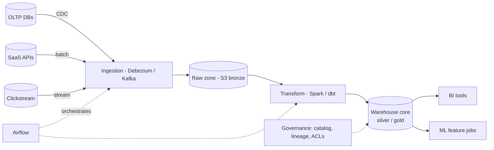

*The warehouse component diagram: sources feed ingestion (CDC + batch) into a bronze raw zone; transforms (Spark/dbt) clean into silver, then curate into gold star-schema marts consumed by BI and ML, all under a governing metadata catalog.*

---

### Architectural Patterns

- **Star schema dimensional modeling** — *Problem*: analysts need predictable, fast joins. *How*: facts (events with measures) surrounded by conformed, denormalized dimensions. *When*: reporting and analytics marts. *Not when*: exploratory data science on raw events (wide tables and data lakes fit better). *Pros*: simple mental model, optimizer-friendly. *Cons*: upfront design effort; schema changes ripple.
- **Snowflake schema** — normalized dimensions (e.g., `dim_product → dim_subcategory → dim_category`) reduce storage but add joins; modern columnar engines usually prefer flat stars because storage is cheap and joins are the dominant cost.
- **Medallion architecture (bronze / silver / gold)** — layered refinement: raw → cleansed/conformed → aggregated marts. Brings software-engineering discipline (staging layers, tests, contracts) to data.
- **Lambda vs Kappa architectures** — Lambda splits batch and speed layers (two codebases — costly); Kappa treats everything as streams with reprocessing via log replay. Choose Kappa when the infra supports stream-first; Lambda when deep batch backfills dominate.
- **Incremental processing with watermarks** — process only new/changed data (`WHERE updated_at > last_watermark`), with grace windows for late arrivals or retractions. Cuts compute dramatically versus daily full rebuilds.
- **SCD Type 2 for historical truth** — new dimension rows with validity ranges so point-in-time queries and trend analysis are always correct.
- **Elastically separated compute pools** — per-workload virtual warehouses (ETL pool ≠ BI pool ≠ ad-hoc pool) prevent a runaway notebook from starving payroll reports.
- **Data-vault modeling** — hubs (unique keys), links (relationships), and satellites (descriptive history) enable agile, audit-friendly modeling where new sources attach without refactoring the whole schema.

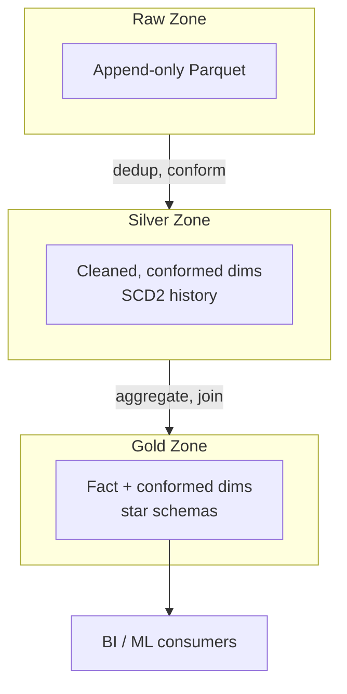

*Medallion refinement flow: raw append-only files are cleansed and conformed into silver (with SCD2 history), then aggregated into gold star-schema marts for analytics consumers.*

---

### Benefits

- **Single source of truth** ends "whose dashboard is right?" wars — one governed copy of revenue.
- **Historical intelligence** enables trends, forecasting, and cohort analyses impossible on live OLTP (which keeps only current state).
- **OLTP protection**: heavy analytics lifted off production databases — checkout latency no longer suffers because someone ran a quarterly report.
- **Cross-source joins**: click behavior × purchases × support tickets — the joins that create business insight literally cannot happen inside any single source system.
- **Governed self-service**: analysts query safely without engineering tickets, within access controls.
- **ML enablement**: warehouses double as a feature store's source; training-data reproducibility depends on DW history.

---

### Challenges

- **Technical** — late and out-of-order data (watermarks, restatements); "slowly-changing everything" as sources silently alter schemas; deduplicating CDC update streams; timezone hell (UTC internally, presentation-layer conversion).
- **Scalability** — the small-files problem on object stores (compaction jobs needed); Monday-morning dashboard storms overwhelming concurrency.
- **Performance** — unpartitioned multi-TB scans from careless queries; skewed joins on celebrity customers.
- **Reliability** — silent corruption from bad transforms propagates to every downstream dashboard — automated tests plus anomaly detection are mandatory; orchestrator outages halt freshness.
- **Operational** — cost observability per team/query; capacity planning for seasonal peaks (Black Friday analytics surge).
- **Security** — PII minimization (tokenize emails before landing) vs. utility; GDPR erasure vs. immutability (crypto-shredding or reprocessing patterns); fine-grained row/column ACLs; audit trails.

---

### Best Practices

- **Declare grain explicitly for every fact table** — undocumented grain is the root cause of most wrong-number incidents (double counting).
- **Partition by date, cluster by high-filter keys** — turns petabyte scans into gigabyte pruned ones; enforce via CI checks on table DDL.
- **Prefer ELT with dbt-style modularity**: staging (1:1 with sources) → intermediate → marts; test each layer; document lineage.
- **Idempotent, incremental pipelines**: deterministic outputs given the same input; watermark-based increments with explicit late-data windows.
- **Automate data tests like code tests**: uniqueness of keys, accepted-value ranges, freshness SLAs, row-count anomaly alarms; block deploys on failures.
- **Conform dimensions across the org**: shared `dim_customer` / `dim_date` reused by all marts so cross-fact joins align correctly.
- **Track cost per query/team** from day one; tag warehouses per workload; alert on burn anomalies.
- **Version-control everything** (SQL, DAGs, configs); PR reviews apply to data code too.
- **Plan PII strategy pre-ingest**: hashing/tokenizing identifiers, column-level masking roles, retention schedules enforced mechanically.

---

### When to Use / When Not to Use

**Use a data warehouse when**: multiple source systems need unified analysis; leadership demands trustworthy KPIs; ML needs years of historical training data; compliance requires an auditable, governed history; analytics queries are ad hoc and unpredictable.

**Skip or right-size when**: a single startup app under 10 GB of data — direct SQL replicas plus a BI tool suffice; real-time operational dashboards needing millisecond freshness — build a dedicated serving store instead (the warehouse complements, not replaces, a serving layer); the team lacks SQL skills and the workload is purely exploratory (a data lake or lakehouse may fit better).

**Alternatives and complements**: a **data lake** (raw, cheap exploration, schema-on-read), a **lakehouse** (Iceberg/Delta/Hudi bringing ACID and schema onto object storage — increasingly converging with warehouses), and **embedded OLAP engines** (ClickHouse, Druid, Pinot) for user-facing sub-second aggregation at high concurrency.

**Decision factors**: data volume and variety, freshness requirements, query concurrency, team skills (SQL-heavy vs. Spark-heavy), compliance posture, and budget predictability needs.

---

### Data Model and API

A data warehouse stores data as **fact tables** (business events with numeric measures) related to **dimension tables** (descriptive context). Facts carry foreign keys to dimensions plus additive or semi-additive measures, typically `decimal`/`BigDecimal` for monetary accuracy. Surrogate integer/UUID keys decouple warehouse identity from source primary keys, enabling SCD versioning and cross-system identity resolution.

Core entities and keys:

- **DIM_DATE** (`date_key` PK, `calendar_date`, `month`, `quarter`, `year`, `is_holiday`)
- **DIM_PRODUCT** (`product_key` PK, `sku`, `category`, `brand`)
- **DIM_CUSTOMER** (`customer_key` PK, `customer_id` BK, `name`, `city`, `segment`, `valid_from`, `valid_to`, `is_current`) — SCD Type 2
- **DIM_STORE** (`store_key` PK, `store_id` BK, `region`, `country`)
- **FACT_ORDER_LINE** (`order_line_id` SK PK, `date_key` FK→DIM_DATE, `product_key` FK→DIM_PRODUCT, `customer_key` FK→DIM_CUSTOMER, `store_key` FK→DIM_STORE, `quantity` decimal, `net_amount` decimal, `tax_amount` decimal)

```mermaid
erDiagram
    FACT_ORDER_LINE }o--|| DIM_DATE : "date_key"
    FACT_ORDER_LINE }o--|| DIM_PRODUCT : "product_key"
    FACT_ORDER_LINE }o--|| DIM_CUSTOMER : "customer_key"
    FACT_ORDER_LINE }o--|| DIM_STORE : "store_key"

    FACT_ORDER_LINE {
        bigint order_line_id PK
        bigint date_key FK
        bigint product_key FK
        bigint customer_key FK
        int store_key FK
        decimal quantity
        decimal net_amount
        decimal tax_amount
    }
    DIM_PRODUCT {
        bigint product_key PK
        string sku
        string category
        string brand
    }
    DIM_CUSTOMER {
        bigint customer_key PK
        string customer_id BK
        string name
        string city
        string segment
        date valid_from
        date valid_to
        boolean is_current
    }
    DIM_DATE {
        int date_key PK
        date calendar_date
        int month
        int quarter
        int year
        boolean is_holiday
    }
    DIM_STORE {
        int store_key PK
        string store_id BK
        string region
        string country
    }
```

*The star-schema entity-relationship diagram shows the fact table referencing four conformed dimension tables through foreign keys; surrogate keys keep warehouse identity independent of source systems while SCD2 attributes on the customer dimension enable point-in-time analysis.*

**API contract** — modern warehouses expose ANSI SQL over standard JDBC/ODBC as the primary consumer interface.

| Endpoint | Protocol | Purpose | Typical consumer |
|---|---|---|---|
| JDBC / ODBC driver | SQL-over-TCP | Interactive BI and ad-hoc queries | Tableau, Power BI, Looker |
| REST / SQL API | HTTP/JSON | Programmatic batch queries and result download | Python/R notebooks, service backends |
| Native connector | Language SDK | Embedded analytics and feature extraction | Data-science notebooks, ML pipelines |

**SQL semantics for analytics (OLAP)** — a representative star-schema aggregation:

```sql
SELECT d.date_month, p.category, c.region,
       SUM(f.net_amount) AS revenue,
       COUNT(*)           AS orders,
       AVG(f.net_amount)  AS avg_order_value
FROM   fact_order_line f
JOIN   dim_date    d ON f.date_key    = d.date_key
JOIN   dim_product p ON f.product_key = p.product_key
JOIN   dim_customer c ON f.customer_key = c.customer_key
JOIN   dim_store   s ON f.store_key   = s.store_key
WHERE  d.date_year = 2024
  AND  c.is_current              -- use the active SCD2 row
GROUP  BY d.date_month, p.category, c.region
ORDER  BY d.date_month
```

*The query joins a fact table to four conformed dimensions, filters to the current SCD2 customer rows, and aggregates revenue, order count, and average order value by month, product category, and customer region — the canonical OLAP star-schema pattern.*

Standard status semantics: `200` (results returned), `400` (invalid query — syntax/semantics), `401` (auth required), `403` (access denied), `429` (rate/concurrency limit), `503` (warehouse overloaded, retry with backoff).

---

### Domain-Specific Deep Dive

#### ETL vs ELT Pipeline Design

- **ETL (classic)**: transform in an external engine (Spark/Informatica) before loading ready-made tables; requires heavy cluster capacity before the warehouse is touched. Best when sensitive transforms must run outside the warehouse (e.g., PII scrubbing under strict data-residency rules).
- **ELT (modern)**: land raw data cheaply in object storage, then transform *inside* the warehouse using elastic SQL (dbt-style). Faster iteration, raw data retained for replay, and the warehouse's massively parallel compute handles the transformation cost.
- **CDC streaming**: log-based capture (Debezium → Kafka) keeps the warehouse near-real-time instead of overnight; enables operational analytics such as fraud dashboards over fresh data.

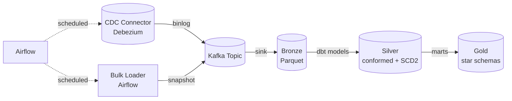

*The ingestion pipeline diagram shows both CDC streaming and batch loading feeding a shared Kafka staging area, which lands in the bronze raw zone, then flows through dbt transformations into silver (conformed + SCD2) and finally into gold star-schema marts.*

#### Schema Design: Star vs Snowflake

The **star schema** places a central fact table of business events at the center of conformed, denormalized dimension tables (date, product, customer, store). Because storage is cheap on columnar engines and joins are the dominant cost, flat stars are usually preferred.

The **snowflake schema** normalizes dimensions (e.g., `dim_product → dim_subcategory → dim_category`), saving space at the cost of extra joins. Modern warehouses rarely need snowflaking — but normalizing very large, high-cardinality dimensions reused across fact tables can reduce compute when the dimension is joined many times.

| Decision | When it wins | Cost |
|---|---|---|
| Star schema | Most analytics; analysts expect flat dimensions; fast BI | Dimension maintenance when source attributes change |
| Snowflake | Very large normalized lookup tables shared across facts | Extra joins on every query |
| Data Vault | Agile, audit-friendly; new sources attach without refactoring | More tables, more joins until modeled into marts |

**Grain declaration** is the single most important modeling step — "one row = one order line item" determines everything downstream. Undocumented grain causes double-counting bugs that surface as CFO-level incidents.

#### Columnar Storage and Compression

Analytics reads few columns across billions of rows ("SUM(amount) GROUP BY region"). A columnar layout delivers three wins:

- **I/O reduction** — only touched columns are read from disk (10–100× less I/O than row stores).
- **Compression** — homogeneous values compress superbly (dictionary encoding for low-cardinality strings, run-length encoding for sorted runs, delta encoding for monotonic integers).
- **Vectorized execution** — processing values in batches per CPU core keeps SIMD units busy.

Files are organized as **Parquet/ORC** with internal block statistics (min/max per block) enabling **zone maps** and **partition pruning** — queries skip blocks outside the predicate range.

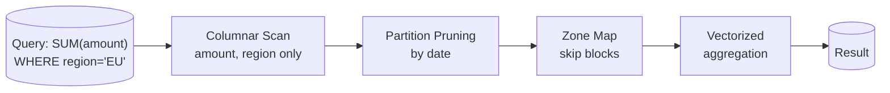

*Columnar query execution: a region-filtered aggregation reads only the `amount` and `region` columns, prunes partitions by date, skips blocks via zone maps, and runs a vectorized aggregation — minimizing I/O and CPU versus a row-store scan.*

#### Data Partitioning and Clustering

- **Partitioning** (typically by ingestion date) co-locates a time slice into a single file/directory so partition pruning removes whole chunks from the scan.
- **Clustering / sorting** (by frequently filtered columns like `customer_id` or `order_status`) brings predicate-hit rows physically adjacent, enabling range pruning within a partition.
- **Bucketing** hashes a column into N buckets, guaranteeing even distribution and enabling map-side joins on bucketed keys.

| Layout | Query pattern | Effect |
|---|---|---|
| Date partition | `WHERE date_key BETWEEN ...` | Scan pruned to relevant days |
| Customer-clustered | `WHERE customer_id = ?` | Within-partition range seek |
| Status-bucketed | join on `order_status` | map-side join, no shuffle |

#### Data Lake vs Warehouse vs Lakehouse

| Aspect | Data Lake | Data Warehouse | Lakehouse |
|---|---|---|---|
| Storage | Raw files (Parquet/ORC/JSON) on S3 | Proprietary or columnar MPP tables | Open file formats on object storage |
| Schema | Schema-on-read | Schema-on-write (enforced at load) | Schema-on-write with evolution |
| ACID | No (historically) | Yes | Yes (via Delta/Iceberg/Hudi) |
| Cost | Very cheap | Storage + compute | Cheap storage, pay-per-query compute |
| Query performance | Variable; engine-dependent | Optimized for SQL analytics | Near-warehouse speed with open formats |
| Ideal for | Exploration, ML feature stores | Governed BI & reporting | Both BI governance and data-science flexibility |

Modern lakehouses (Databricks Unity Catalog, Iceberg, Delta Lake) bring ACID transactions, schema enforcement, and row/column-level access control to data lakes, blurring the line with warehouses. Warehouse-native engines like Snowflake's support for external tables over Parquet and BigQuery's Omni let you query lake data with warehouse SQL, further converging the two.

---

### Replication Strategies

A data warehouse replicates data across regions and availability zones for durability, low-latency reads, and disaster recovery — but unlike a key-value store's per-key quorum replication, warehouse replication operates at the dataset and metadata level.

- **Cross-region snapshot replication** — Snowflake database replication and BigQuery cross-region datasets copy snapshots to a secondary region, enabling DR and geo-local reads with RPO/RTO trade-offs managed by the provider.
- **Multi-AZ zone-redundant storage** — object stores (S3, GCS, Azure Blob) replicate each object across AZs within a region; the warehouse computes off this durable store so a single-AZ node loss never loses data.
- **Read-replica virtual warehouses** — multiple compute clusters (read-only or read-write) attach to shared storage; hot replicas serve BI dashboards close to the user while write heads stay in the primary region.
- **CDC to multiple sinks** — a single Debezium pipeline fans out change events to both a warehouse (for analytics) and a search index or cache (for serving), keeping analytical and operational copies in sync.

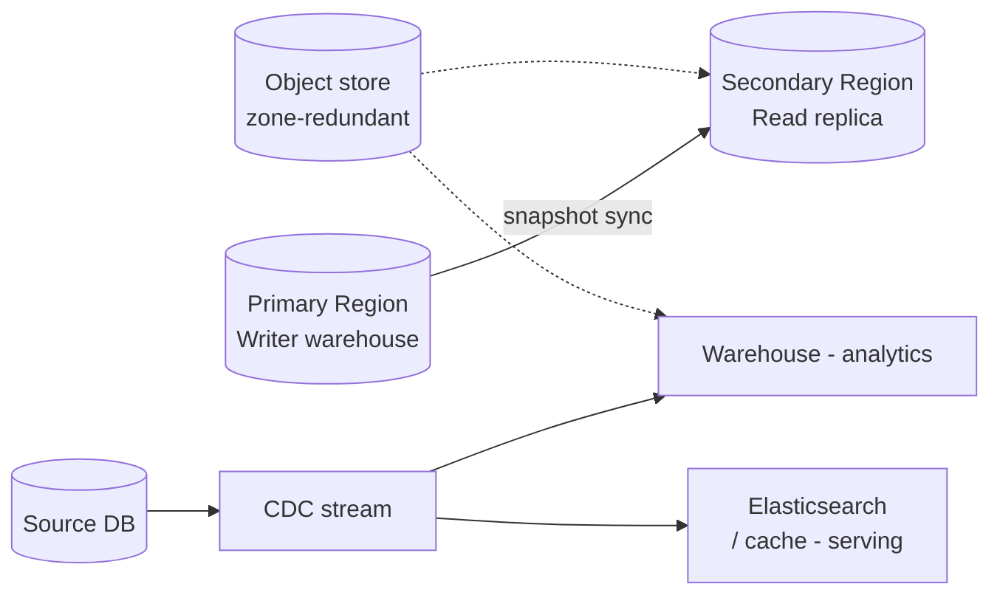

*Warehouse replication diagram: a primary-region writer syncs snapshots to a secondary-region read replica, while a CDC stream fans out to both the analytical warehouse and an operational serving store (search/cache); both compute tiers read from zone-redundant object storage.*

---

### Failure Detection and Membership

Where a distributed database peers gossip health among storage nodes, a warehouse's "membership" problem is really **pipeline and data freshness** — detecting when ingestion stalls, CDC falls behind, or a transform job fails so SLAs are enforced.

- **CDC heartbeat tables and gap detection** — a CDC connector writes a monotonic heartbeat row (or Kafka uses a control topic); the pipeline compares the latest captured offset/timestamp against the source's current log position and flags gaps for targeted re-snapshot of the affected range.
- **Pipeline-level failure detection** — Airflow / Dagster detect stalled tasks, missing upstream partitions, or schema-drift failures; a freshness monitor asserts that each table's `max(source_timestamp)` advances within the SLA window.
- **Compute node membership** — cloud warehouses manage virtual-warehouse node membership transparently, but customers still monitor per-cluster queue depth and eviction of idle warehouses.
- **Data-loss prevention** — idempotent sinks keyed by `(source, partition, offset)` and dedup windows ensure a retry never duplicates or drops a row.

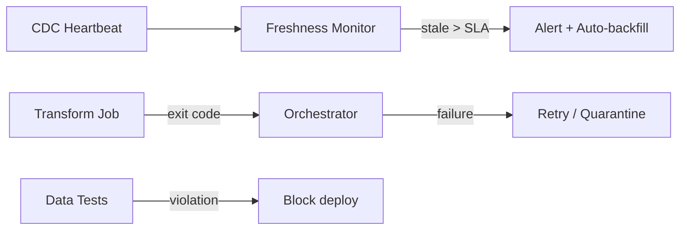

*The warehouse failure-detection pipeline: a CDC heartbeat feeds a freshness monitor that alerts and triggers backfill when SLA is breached; transform jobs report exit codes to the orchestrator, which retries or quarantines bad data, and data tests can block a deploy on quality violations.*

---

### High Availability and Scalability

Modern cloud warehouses achieve HA by **separating storage from compute** and **replicating storage** across zones, while autoscaling compute handles elastic concurrency.

- **Shared, zone-redundant storage** — the data layer (object store + metadata service) is replicated across AZs, so losing a compute node never loses data and another node can resume instantly.
- **Virtual-warehouse HA** — in Snowflake, a warehouse is a pool of compute nodes; if a node fails, queries are re-scheduled onto healthy nodes in the same warehouse. Multi-cluster warehouses serve multi-AZ and multi-region reads.
- **Concurrency scaling** — BigQuery slots and Redshift Concurrency Scaling spin up ephemeral compute clusters to absorb dashboard storms, then release them.
- **Auto-scaling compute** — warehouses grow/shrink cluster size based on queue depth and query-cost estimates, and they can **pause** when idle (Snowflake auto-suspend) to cut non-production costs to near zero.
- **Horizontal partitioning of source ingestion** — Kafka partitions and parallel Spark executors scale ingestion throughput; the warehouse's shard count is managed by the engine, not the customer.

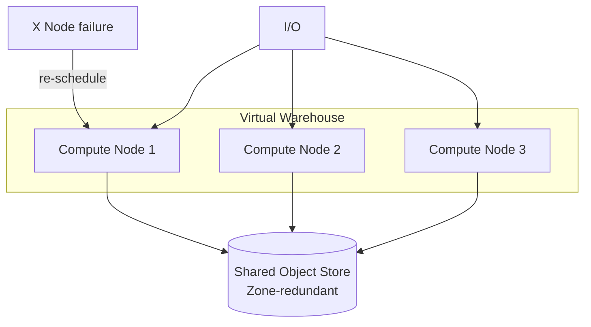

*Warehouse high-availability: queries are distributed across a pool of compute nodes that all read from a shared, zone-redundant object store; if a node fails, the scheduler re-launches its slices on healthy peers with no data loss.*

---

### Performance and Optimization

Warehouse performance is dominated by **bytes scanned** and **compute scheduling**, not single-request latency. Optimizations target reducing the scan footprint and keeping compute saturated.

- **Partition pruning** — partitioning tables by date (the canonical warehouse key) lets the engine skip whole file groups for time-range predicates. A `WHERE date BETWEEN ...` over a partitioned table reads only the needed days instead of everything.
- **Clustering and z-ordering** — clustering (BigQuery) or `CLUSTER BY` (Redshift) / clustering keys (Snowflake) co-locate rows on similar values, so within-partition range seeks replace full scans. Z-ordering multi-dimensional keys (date + customer_id + region) compacts related rows for multi-column filters.
- **Zone maps and min/max pruning** — every column chunk stores min/max statistics; the planner skips chunks that cannot satisfy the predicate (e.g., `region = 'EU'` skips chunks where the max is below 'EU').
- **Materialized views** — pre-computed aggregations refreshed on schedule or incrementally (Snowflake materialized view, BigQuery materialized view) serve repeated dashboard queries from cache.
- **Result caching** — BigQuery caches query results for 24 h; Snowflake caches per virtual warehouse for the cluster lifetime. Repeat queries return instantly.
- **Vectorized, compiled execution** — modern engines compile SQL to native code and process values in batches (AVX-512), so a `GROUP BY` over billions of rows finishes in seconds.
- **Star-join optimization** — the optimizer picks broadcast joins for small dimensions (ship the dim to every node) vs. shuffle joins for large ones, driven by statistics; stale statistics cause catastrophic plan flips.

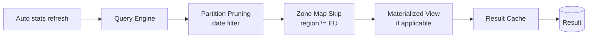

*Warehouse performance pipeline: the query planner prunes partitions by date, skips chunks via zone maps for the region filter, consults materialized views and the result cache, and keeps statistics fresh to drive good join plans.*

---

### CAP Theorem and Consistency Trade-offs

The CAP theorem says that during a network partition a distributed system can offer at most two of **Consistency**, **Availability**, and **Partition tolerance**. A data warehouse is rarely a single CP or AP system — instead it layers different consistency guarantees across the load, the storage, and the serving path.

- **Strong read-after-write** — within a single region, an insert into a gold mart is immediately visible to subsequent queries on the same warehouse (Snowflake and BigQuery provide read-after-write within a cluster). This is the consistency guarantee analysts expect from "fresh" data.
- **Eventual consistency across regions** — cross-region snapshot replication (Snowflake database replication, BigQuery cross-region datasets) converges asynchronously; a read from the secondary region may lag the primary by minutes. The SLA is an RPO (recovery point objective) window, not zero.
- **Batch vs streaming freshness** — a nightly batch load is strongly consistent once committed but has a bounded lag (the batch interval). CDC streaming narrows that window to seconds but introduces eventual-consistency semantics: a consumer may read a source row before its corresponding dimension is conformed.
- **Stale reads from replicas** — serving dashboards from read-replica warehouses improves availability and latency but can return yesterday's numbers; BI tools must decide whether to read from the primary (consistent, slower) or a replica (fast, possibly stale) per query semantics.

```mermaid
flowchart LR
    subgraph CAP [CAP Trade-offs in a Warehouse]
        P [Partition Tolerance<br/>required for geo-replication]
        C [Consistency<br/>read-after-write in-region]
        A [Availability<br/>geo-stale reads + cached results]
    end
    P --> C
    P --> A
    C -.-> |regional| STRONG[("Strong local")]
    A -.-> |cross-region| EVENTUAL[("Eventual global")]
```

*Warehouse CAP trade-offs: partition tolerance is non-negotiable for geo-replication; within a region the warehouse offers read-after-write consistency, while cross-region replicas trade some consistency for global availability and latency.*

---

### Encryption and Key Management

Encryption protects a warehouse's data at rest and in transit. A production-grade deployment considers multiple layers: object-store encryption, application-level column encryption for sensitive fields, and TLS across every hop.

#### Encryption at Rest

- **Server-side encryption (SSE-KMS / SSE-S3)** — the cloud object store encrypts objects with a service key, or with a customer-managed KMS key (SSE-KMS). Transparent but the provider holds the key-encryption key unless you bring your own.
- **Customer-supplied keys (SSE-C / CMK)** — you provide the data key; the object store cannot decrypt without it, even if compromised.
- **Application/column-level encryption** — the ingestion service encrypts PII columns (emails, credit-card numbers) with its own data key before the warehouse stores them. This protects against a database-level compromise and supports GDPR erasure via crypto-shredding (delete the key, data is unrecoverable).
- **Key rotation during re-encryption** — when a key is rotated, old files still hold data encrypted with the previous key; lazy re-encryption runs on read or during the next compaction, and the key registry tracks which version encrypted which object.

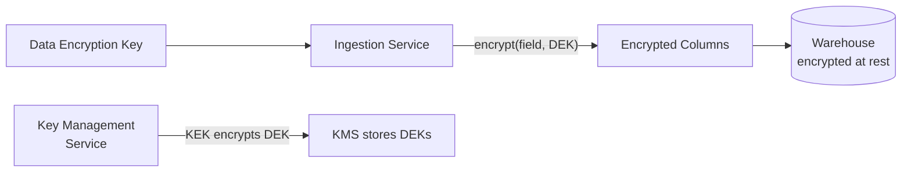

*Encryption layer: the ingestion service encrypts PII columns with a data key (DEK) whose lifecycle is managed by a key-management service. The warehouse stores encrypted data at rest; rotating the key-encryption key (KEK) re-wraps only the DEKs, not the data.*

#### Encryption in Transit

All client-to-warehouse and inter-system traffic must use TLS to protect data from eavesdropping and tampering.

- **TLS between BI tools and the warehouse** — JDBC/ODBC drivers negotiate TLS to the warehouse endpoint; private endpoints keep traffic off the public internet.
- **mTLS for ingestion pipelines** — CDC connectors and loaders authenticate with certificates when writing to the warehouse.
- **Certificate rotation** — managed automatically by cloud warehouses; customers pin to the provider CA.

#### Key Management

Key management is the foundation of encryption. Poor key management negates the benefit of encryption entirely.

- **Key hierarchy** — a key-encryption key (KEK) wraps data-encryption keys (DEKs), which encrypt actual data. Rotating the KEK re-wraps only the DEKs, not the whole dataset.
- **Managed KMS / HSM** — AWS KMS, GCP Cloud KMS, Azure Key Vault, or an HSM-backed key store hold the KEK in tamper-resistant hardware.
- **Key rotation policy** — KEKs rotate every 6–12 months; DEKs rotate per-object or per-load more frequently.
- **Multi-region key availability** — for cross-region warehouses, keys must be available in each region; cloud KMS replicates keys automatically.

**Java example: a Spring `@Service` bean that column-encrypts PII fields before ingestion using AES-GCM**

```java
@Service
public class ColumnEncryptionService {

    private static final int GCM_IV_LENGTH = 12;
    private static final int GCM_TAG_LENGTH = 128;
    private final SecretKey columnKey;
    private final SecureRandom random = new SecureRandom();

    public ColumnEncryptionService(
            @Value("${warehouse.encryption.key-base64}") String keyB64) {
        byte[] decoded = Base64.getDecoder().decode(keyB64);
        this.columnKey = new SecretKeySpec(decoded, "AES");
    }

    public Optional<String> encryptColumn(String plaintext) {
        if (plaintext == null) {
            return Optional.empty();
        }
        try {
            byte[] iv = new byte[GCM_IV_LENGTH];
            random.nextBytes(iv);
            Cipher cipher = Cipher.getInstance("AES/GCM/NoPadding");
            cipher.init(Cipher.ENCRYPT_MODE, columnKey, new GCMParameterSpec(GCM_TAG_LENGTH, iv));
            byte[] encrypted = cipher.doFinal(plaintext.getBytes(StandardCharsets.UTF_8));
            byte[] output = new byte[iv.length + encrypted.length];
            System.arraycopy(iv, 0, output, 0, iv.length);
            System.arraycopy(encrypted, 0, output, iv.length, encrypted.length);
            return Optional.of(Base64.getEncoder().encodeToString(output));
        } catch (GeneralSecurityException e) {
            throw new IllegalStateException("Failed to encrypt column value", e);
        }
    }
}
```

*The `ColumnEncryptionService` bean wraps AES-GCM encryption with a per-field random IV and a base64-encoded key injected via `@Value`. In production the key is fetched from a KMS (or HSM) and rotated automatically; the service only ever holds the in-memory DEK, enabling crypto-shredding for GDPR erasure.*

---

### Authentication and Authorization

A warehouse must verify who is connecting (authentication) and what they can do (authorization). In cloud warehouses, authentication is federated identity (cloud IAM / SSO) and authorization is enforced at the account, database, schema, table, column, and row level.

#### Authentication Methods

- **Cloud IAM / SSO** — users authenticate with the cloud provider's identity (AWS IAM, GCP Cloud Identity, Azure AD); the warehouse trusts the issued OIDC/JWT token. Single sign-on across the stack.
- **Service accounts** — machines and pipelines present a service-account key or workload identity (e.g., GKE Workload Identity, AWS IRSA) rather than human credentials.
- **OAuth / OpenID Connect** — BI tools obtain a delegated token scoped to a warehouse role.
- **Native user/password** — the warehouse maintains its own user store; password hashes are rotated and MFA enforced for admins.

#### Authorization Models

- **Role-Based Access Control (RBAC)** — grants attach to roles (`ANALYST`, `DATA_ENGINEER`, `ADMIN`), and users are assigned roles; e.g., `ANALYST` can `SELECT` on the `analytics` schema but not `CREATE TABLE`.
- **Attribute-Based Access Control (ABAC)** — policies reference user/session attributes (department, region) and resource tags; e.g., `ALLOW if user.region == row.region`.
- **Access Control Lists (ACLs)** — fine-grained `GRANT`/`REVOKE` on objects plus **row-access policies** (filter rows by `region = current_user.region`) and **column masking policies** (mask PII for non-privileged roles).

| Principal | Role | Scope | Permission |
|---|---|---|---|
| `analyst@acme` | ANALYST | `analytics` schema | SELECT |
| `etl@acme` | DATA_ENGINEER | `raw`, `staging` | USAGE, INSERT, TRUNCATE |
| `admin@acme` | OWNER | account | ALL |

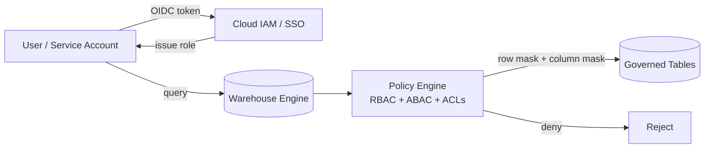

*Authorization flow: a user authenticates via cloud IAM/SSO, receives a warehouse role, and every query is evaluated against a policy engine combining RBAC, ABAC, and row/column ACLs before the governed tables are read.*

**Java example: a Spring `@Service` bean that enforces row-level ABAC filters for a warehouse query service**

```java
@Service
public class DataAccessPolicyEnforcer {

    private final Set<String> admins;
    private final Map<String, String> regionByUser;

    public DataAccessPolicyEnforcer(
            @Value("${warehouse.admins:#{T(java.util.Collections).emptySet()}}") Set<String> admins,
            @Value("${warehouse.default-region-by-user:#{T(java.util.Collections).emptyMap()}}")
            Map<String, String> regionByUser) {
        this.admins = Set.copyOf(admins);
        this.regionByUser = Map.copyOf(regionByUser);
    }

    public boolean isAdmin(String principal) {
        return admins.contains(principal);
    }

    public String rowFilterFor(String principal) {
        if (isAdmin(principal)) {
            return "TRUE";                          // admins bypass region filter (RBAC)
        }
        String region = regionByUser.getOrDefault(principal, "RESTRICTED");
        return "region = '" + region + "'";          // ABAC: row filtered by user.region
    }
}
```

*The `DataAccessPolicyEnforcer` bean injects an admin set and a user→region map via `@Value`. `rowFilterFor` produces a SQL predicate string that the query layer appends as a `WHERE` clause, so a non-admin analyst always sees only their region's rows; admins see everything. Column masks are applied separately at the warehouse engine level.*

---

### Security Threats and Mitigations

#### Threat: Unauthenticated / Over-Privileged Access

- **Risk**: a service account with broad `ACCOUNTADMIN` or `SELECT` privileges exfiltrates an entire table.
- **Mitigation**: enforce least privilege — separate roles per workload, MFA for human admins, short-lived tokens for services, and regular access reviews.

#### Threat: PII Exposure at Rest

- **Risk**: raw emails, credit-card numbers, or SSNs land in the bronze layer unencrypted and are queryable by BI tools.
- **Mitigation**: tokenize or hash PII at ingestion, apply column masking policies, and keep raw PII out of shared datasets.

#### Threat: Data Interception

- **Risk**: an analyst queries the warehouse over an unencrypted or downgraded connection; cross-region replication is sniffed.
- **Mitigation**: enforce TLS 1.2+ for all endpoints, use private endpoints or VPC Service Controls to avoid the public internet, and use mTLS for inter-service pipelines.

#### Threat: Cross-Tenant Data Leakage

- **Risk**: a shared warehouse serves multiple tenants and a misconfigured view or RLS policy exposes another tenant's rows.
- **Mitigation**: separate accounts/databases per tenant, mandatory row-access policies, and automated policy-audit tests in CI.

#### Threat: Query Abuse / Cost Attack

- **Risk**: a single runaway query (cartesian join, missing partition filter) scans terabytes and triggers a massive bill.
- **Mitigation**: per-role query quotas, result-set size limits, mandatory partition filters enforced as a policy, query timeouts, and cost attribution dashboards that alert on burn anomalies.

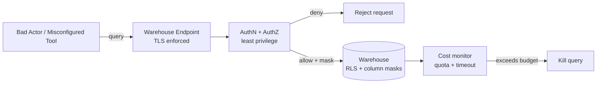

*Defense-in-depth for a data warehouse: TLS and least-privilege authn/authz sit in front of the engine which applies row-level and column-masking security; a cost monitor enforces quotas, timeouts, and query kills to prevent bill-shock attacks.*

---

### Observability and Logging

A data warehouse must expose metrics, logs, and traces so operators can detect anomalies, diagnose problems, and verify SLAs. Unlike a live service whose SLA is latency, a warehouse's SLA is **freshness** (data is within N minutes of the source) and **quality** (no broken contracts).

#### Metrics

Key metrics to monitor at the pipeline and warehouse level:

- **Freshness** — `max(source_timestamp)` per table vs. wall clock; a table is "late" if `now() - max(source_ts) > SLA`.
- **Volume** — row counts and bytes ingested per source; deviations signal backfills or data loss.
- **Data-quality violations** — null-rate, uniqueness failures, accepted-value range breaches emitted as counters.
- **Query cost & concurrency** — bytes scanned per query, queued vs. running, and per-warehouse utilization to catch bill-shock and dashboard storms.
- **Pipeline health** — DAG success rate, task retry counts, and CDC lag (Kafka consumer offset lag).

#### Logging

Structured logs should capture:

- **Access logs** — who queried which tables with what cost and duration.
- **Ingestion logs** — source offsets committed, rows written per partition, schema-drift events.
- **Transform logs** — dbt run results, test failures, model version compiled.
- **Slow-query logs** — queries exceeding a cost or duration threshold.

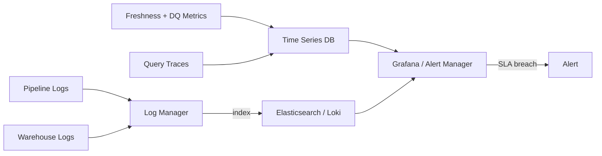

*Observability pipeline for a data warehouse: pipeline and warehouse logs flow to a log manager; freshness and data-quality metrics go to a time-series database; all are visualized and alerted on — with freshness SLA breaches as the primary alert signal.*

**Java example: a Spring `@Service` bean using Micrometer to track freshness and data-quality metrics**

```java
@Service
public class WarehouseMetricsService {

    private final MeterRegistry registry;
    private final Counter freshnessBreaches;
    private final Counter dqViolations;
    private final Counter ingestedRows;
    private final Timer loadTimer;

    public WarehouseMetricsService(MeterRegistry registry) {
        this.registry = registry;
        this.freshnessBreaches = Counter.builder("dw.freshness.breaches")
                .description("Tables whose freshness SLA was breached")
                .register(registry);
        this.dqViolations = Counter.builder("dw.dataquality.violations")
                .description("Data-quality rule violations")
                .register(registry);
        this.ingestedRows = Counter.builder("dw.ingested.rows")
                .description("Rows ingested into the warehouse")
                .register(registry);
        this.loadTimer = Timer.builder("dw.pipeline.load.duration")
                .description("End-to-end load duration")
                .register(registry);
    }

    public void recordIngestion(String table, long rowCount) {
        ingestedRows.increment(rowCount, Tags.of("table", table));
    }

    public void recordFreshness(String table, Duration lag, Duration sla) {
        registry.gauge("dw.freshness.lag.seconds", Tags.of("table", table), lag.getSeconds());
        if (lag.compareTo(sla) > 0) {
            freshnessBreaches.increment(Tags.of("table", table));
        }
    }

    public void recordQualityViolation(String rule, String table) {
        dqViolations.increment(Tags.of("rule", rule, "table", table));
    }

    public <T> T timeLoad(Supplier<T> op) {
        return loadTimer.record(op);
    }
}
```

*The `WarehouseMetricsService` bean registers Micrometer counters and timers for ingestion volume, freshness lag versus SLA, data-quality violations, and load duration. Freshness breaches and quality violations are tagged by table and rule so Grafana dashboards and Alert Manager can fire on them — turning SLA compliance into a measurable signal that feeds the same observability pipeline shown above.*

---

### Real-World Implementations

- **Snowflake**: Cloud-native with compute-storage separation and per-second billing. Uses Snowflake Virtual Warehouses for compute clusters; automatic clustering; zero-copy cloning. Designed for ad-hoc analytics at any scale.
- **BigQuery**: Serverless, fully-managed on Google's infrastructure. Uses Dremel for columnar storage; supports SQL and ML (BigQuery ML); automatic scaling. Pay-per-query pricing model.
- **Redshift**: AWS data warehouse with massively parallel processing (MPP). Uses columnar storage and zone maps for compression; Spectrum for S3 federated queries; RA3 nodes with managed storage.
- **Databricks**: Lakehouse platform combining data lake and data warehouse. Uses Delta Lake for ACID transactions on S3; Spark for distributed processing; Unity Catalog for governance.
- **ClickHouse**: Open-source analytical DB. Uses columnar storage, vector engines, and merge tree architecture. Designed for real-time analytics with sub-second query latency.

| Platform | Storage | Compute Model | Query Engine | Pricing |
|---|---|---|---|---|
| Snowflake | S3 / Blob | Virtual Warehouses (elastic) | Snowflake engine | Per-credit (compute) + storage |
| BigQuery | Colossus (Google FS) | Serverless (auto-scaling) | Dremel (MPP) | Per-TB processed + storage |
| Redshift | Redshift storage | MPP clusters (RA3/RA3+) | Redshift engine | Per-node-hour + storage |
| Databricks | S3 / Blob (Delta Lake) | Serverless / job clusters | Spark | Per-DBU (compute) + storage |
| ClickHouse | Local / S3 | Shared-nothing nodes | Vector engine | Per-node-hour |

**Architecture patterns used in production:**
- **Snowflake**: Shared-disk at the compute layer (all warehouses share the same storage service); MPP within each virtual warehouse.
- **BigQuery**: Colossus distributed filesystem + Jupiter network; Dremel uses tree architecture (scanning, filtering, aggregation in a tree of servers).
- **Redshift**: Shared-nothing MPP; data distribution via sort keys and distribution styles (ALL, EVEN, KEY, AUTO).

---

### Java and Spring Boot Implementation Guide

Spring Boot service for the ingestion layer of a data warehouse: reads from change-data-capture (CDC) events, applies schema validation, deduplicates, and loads into the warehouse via JDBC batch-upserts with exactly-once semantics enforced by idempotency keys.

#### 1. DTO Records with Validation

```java
public record IngestRequest(
        @NotBlank String eventId,
        @NotBlank String sourceTable,
        @NotBlank String operation,
        @NotEmpty Map<String, Object> data,
        @NotNull Instant eventTime) {}

public record IngestResult(
        String eventId,
        String status,
        Instant processedAt,
        String errorMessage) {}

enum Operation { INSERT, UPDATE, DELETE, UPSERT }
```

*`IngestRequest` carries the CDC event with an idempotency `eventId`. `IngestResult` reports the outcome. `@Valid` annotations enforce constraints at the API boundary. `Operation` enumerates the CDC event types.*

#### 2. Entity with Idempotency Guard

```java
@Entity
@Table(name = "processed_events", indexes = {
        @Index(name = "idx_event_id", columnList = "eventId"),
        @Index(name = "idx_created", columnList = "processedAt")
})
public class ProcessedEvent {

    @Id
    private String eventId;

    @Column(nullable = false)
    private String sourceTable;

    @Enumerated(EnumType.STRING)
    @Column(nullable = false)
    private Operation operation;

    @Column(nullable = false)
    private Instant processedAt;

    @Column(length = 4000)
    private String errorMessage;

    @Version
    private Long version;
}
```

*The `ProcessedEvent` entity records every CDC event processed. The `eventId` column has a unique constraint — any duplicate event (same ID) is rejected by the database, enforcing exactly-once ingestion. `@Version` guards against concurrent updates.*

#### 3. Repository with Idempotency Check

```java
@Repository
public interface ProcessedEventRepository extends JpaRepository<ProcessedEvent, String> {

    @Lock(LockModeType.OPTIMISTIC_FORCE_INCREMENT)
    Optional<ProcessedEvent> findByEventId(String eventId);

    boolean existsByEventId(String eventId);

    @Modifying(clearAutomatically = true)
    @Query("UPDATE ProcessedEvent p SET p.errorMessage = :error, p.processedAt = :now WHERE p.eventId = :eventId")
    void recordError(@Param("eventId") String eventId,
                     @Param("error") String error,
                     @Param("now") Instant now);
}
```

*`ProcessedEventRepository` provides existence checks (`findByEventId`, `existsByEventId`) for idempotency, and an atomic error-recording update. The `@Lock(OPTIMISTIC_FORCE_INCREMENT)` ensures concurrent processors don't double-process the same event.*

#### 4. Ingestion Service with Batch Upsert

```java
@Service
@RequiredArgsConstructor
@Slf4j
public class IngestionService {

    @Value("${dw.ingest.batch-size:5000}")
    private int batchSize;

    @Value("${dw.ingest.max-retries:3}")
    private int maxRetries;

    private final ProcessedEventRepository eventRepo;
    private final JdbcTemplate jdbcTemplate;
    private final MeterRegistry meterRegistry;

    @Transactional
    public IngestResult ingest(IngestRequest request) {
        var timer = Timer.Sample.start(meterRegistry);
        try {
            // Idempotency check
            if (eventRepo.existsByEventId(request.eventId())) {
                log.debug("Skipping duplicate event {}", request.eventId());
                meterRegistry.counter("dw.ingest.duplicates").increment();
                return new IngestResult(request.eventId(), "DUPLICATE", Instant.now(), null);
            }

            // Apply schema validation
            validateSchema(request);

            // Batch upsert into warehouse
            upsertData(request);

            // Record processed event
            var processed = new ProcessedEvent();
            processed.setEventId(request.eventId());
            processed.setSourceTable(request.sourceTable());
            processed.setOperation(Operation.valueOf(request.operation()));
            processed.setProcessedAt(Instant.now());
            eventRepo.save(processed);

            meterRegistry.counter("dw.ingest.success").increment();
            return new IngestResult(request.eventId(), "SUCCESS", Instant.now(), null);
        } catch (Exception e) {
            meterRegistry.counter("dw.ingest.failures").increment();
            log.error("Ingestion failed for event {}", request.eventId(), e);
            // Record error without committing the upsert
            eventRepo.recordError(request.eventId(), e.getMessage(), Instant.now());
            return new IngestResult(request.eventId(), "FAILED", Instant.now(), e.getMessage());
        } finally {
            timer.stop(Timer.builder("dw.ingest.duration")
                    .register(meterRegistry));
        }
    }

    @Transactional
    public void upsertData(IngestRequest request) {
        var batch = request.data().entrySet().stream()
                .map(entry -> Map.entry(entry.getKey(), entry.getValue()))
                .toList();

        String sql = "INSERT INTO " + request.sourceTable() +
                " (id, data, updated_at) VALUES (?, ?, ?) " +
                "ON CONFLICT (id) DO UPDATE SET data = EXCLUDED.data, updated_at = EXCLUDED.updated_at";

        jdbcTemplate.batchUpdate(sql, batch, batchSize,
                (ps, item) -> {
                    ps.setString(1, item.getKey());
                    ps.setString(2, item.getValue().toString());
                    ps.setTimestamp(3, Timestamp.from(request.eventTime()));
                });
    }

    private void validateSchema(IngestRequest request) {
        if (!SUPPORTED_TABLES.contains(request.sourceTable())) {
            throw new IllegalArgumentException("Unsupported table: " + request.sourceTable());
        }
        // Validate required columns exist in data
        // ...
    }
}
```

*The `IngestionService` bean implements exactly-once ingestion: an idempotency check prevents duplicate processing; `@Transactional` ensures the upsert and event-record are atomic; `JdbcTemplate.batchUpdate` performs the upsert with conflict resolution (`ON CONFLICT DO UPDATE`); `@Value`-injected config controls batch size and retry count. Micrometer tracks throughput, duplicates, and duration.*

#### 5. REST Controller with Dead-Letter Handling

```java
@RestController
@RequestMapping("/api/v1/warehouse")
@RequiredArgsConstructor
public class IngestionController {

    private final IngestionService ingestionService;

    @PostMapping("/ingest")
    @Async
    public CompletableFuture<ResponseEntity<IngestResult>> ingest(
            @Valid @RequestBody IngestRequest request) {
        var result = ingestionService.ingest(request);
        return CompletableFuture.completedFuture(ResponseEntity.ok(result));
    }

    @ExceptionHandler(SQLException.class)
    public ResponseEntity<IngestResult> handleSqlError(SQLException ex) {
        return ResponseEntity.status(HttpStatus.SERVICE_UNAVAILABLE)
                .body(new IngestResult(null, "FAILED", Instant.now(), ex.getMessage()));
    }
}
```

*The `IngestionController` bean is a thin `@RestController`. The `/ingest` endpoint is `@Async` — returns immediately with `CompletableFuture`. SQL exceptions (transient warehouse errors) return `503 Service Unavailable` so the CDC connector can retry with backoff.*

#### 6. Configuration Class for Batch Properties

```java
@Configuration
@ConfigurationProperties(prefix = "dw.ingest")
public record IngestionProperties(
        int batchSize,
        int maxRetries,
        String deadLetterTopic
) {}
```

*`IngestionProperties` is a `@ConfigurationProperties` bean binding `dw.ingest.*` config keys to a typed record. Constructor binding requires `@ConstructorBinding` on the class — Spring Boot 3.x auto-detects this for records.*

---

### Interview Questions and Answers

**Beginner**

1. **What is the difference between OLTP and OLAP?**
   A: OLTP (online transaction processing) is for transactional systems — many short, write-heavy operations (inserts, updates, point reads). Optimized for single-row access. Examples: order processing, user auth. OLAP (online analytical processing) is for analytics — complex queries over large datasets (aggregations, joins, scans). Optimized for throughput and columnarity. Examples: data warehouses, BI dashboards.

2. **What is the star schema?**
   A: A star schema has a central fact table (events, transactions) surrounded by dimension tables (users, time, products, locations). The fact table has foreign keys to dimension tables. This denormalized structure optimizes for analytical queries — joins are simple (one level) and dimensions provide rich context for slicing.

3. **Why use columnar storage for analytics?**
   A: Analytical queries typically scan specific columns (e.g., "sum of revenue" needs only date, product, revenue columns). Columnar storage reads only the needed columns from disk, reducing I/O by 10x–100x. It also enables better compression (similar data types in a column) and vectorized processing (SIMD operations on column batches).

4. **What is data partitioning and why is it used?**
   A: Partitioning splits a large table into smaller, manageable pieces. Types: range (dates), hash (by user_id hash), list (by country). Partitioning enables partition pruning — queries on `WHERE date = '2024-01'` scan only the relevant partition, not the entire table.

5. **What is the difference between a data lake and a data warehouse?**
   A: A data warehouse stores structured, transformed data in a schema-on-write model optimized for analytics (Snowflake, BigQuery, Redshift). A data lake stores raw data (structured, semi-structured, unstructured) in a schema-on-read model (S3, HDFS). Lakes are cheaper and support raw/varied data; warehouses are optimized for SQL analytics and performance.

**Intermediate**

6. **Explain the data ingestion pipeline for a data warehouse.**
   A: (1) Extract from OLTP databases via CDC (Debezium) or batch dumps. (2) Land raw data in a data lake (S3/GCS) as Parquet/Avro. (3) Transform via dbt (SQL models) or Spark — clean, deduplicate, enrich, apply schemas. (4) Load into the warehouse (Snowflake, BigQuery) as star-schema tables. (5) Orchestrate with Airflow — DAG defines dependencies and schedules. (6) Monitor for freshness (how stale is the warehouse?) and data quality (nulls, anomalies).

7. **How do you handle slowly-changing dimensions (SCDs)?**
   A: Type 1 (overwrite): the dimension row is updated with new values — no history preserved. Type 2 (historical): a new row is added with a version effective date and an expiry date; the old row's expiry is set. Type 3 (current + previous): store only the current and previous value in the same row. Most data warehouses use Type 2 for auditability but Type 1 for non-historical attributes.

8. **What is data deduplication and why is it important?**
   A: Deduplication removes duplicate records that arise from multiple ingestion paths, retries, or late-arriving data. Without deduplication, aggregations are incorrect (double-counting). Techniques: idempotent ingestion keys, deduplication windows in Spark/Flink, `INSERT ... ON CONFLICT DO NOTHING / DO UPDATE` in the warehouse.

9. **How would you optimize a slow analytical query?**
   A: (1) Partition pruning — ensure the query filters on partitioned columns. (2) Clustering/sorting — sort data by frequently-filtered columns so zones/maps can skip blocks. (3) Materialized views — precompute and cache frequent aggregations. (4) Column pruning — avoid SELECT * (only read needed columns). (5) Predicate pushdown — push filters to the storage layer. (6) Result caching — cache query results for repeated identical queries.

10. **What is the difference between batch and stream processing?**
    A: Batch processes data in finite, bounded chunks (daily/hourly ETL jobs). Stream processing processes data continuously as it arrives (real-time event processing). Trade-offs: batch is simpler, supports exactly-once, and is cheaper for non-urgent data; stream is lower latency but harder (windowing, watermarking, exactly-once). Lambda architecture uses both: batch for accuracy, speed layer for real-time.

**Advanced**

11. **How would you handle late-arriving data in a streaming pipeline feeding a data warehouse?**
    A: Late data (events arriving hours after they occurred) breaks time-based partitioning. Solution: use event-time processing (not processing-time) in Flink/Spark Structured Streaming. Watermarks track the progress of event time; events behind the watermark are dropped. For the data warehouse side, use upserts with primary keys (not append-only) so late data updates the correct records. For batch corrections, run a reprocessing pipeline that backfills the warehouse with late-corrected data (idempotent via the same primary keys).

12. **How does query federation work across data sources?**
    A: A federated query engine (Trino, Presto, BigQuery Omni) pushes query execution to multiple data sources (S3, MySQL, PostgreSQL, MongoDB) and combines results. The query planner decomposes the SQL into stages, pushes down filters/projections to each source, and ships the minimal data over the network. Challenges: type mapping, schema evolution, source-specific optimizations, and avoiding data movement for expensive operations.

13. **Design a data quality framework for a data warehouse.**
    A: (1) Define quality rules as SQL assertions on each table (e.g., `NOT NULL`, `UNIQUE`, `CHECK (revenue >= 0)`, freshness `max(created_at) > now() - interval '1 hour'`). (2) Run checks as dbt tests or Great Expectations suites after each ELT run. (3) Store results in a quality-results table with pass/fail per rule per table. (4) Alert on regressions (rule went from PASS to FAIL). (5) Quarantine failed data — don't load it into the warehouse; route to a dead-letter table for investigation. (6) Track quality trends over time and surface in a data-quality dashboard.

14. **How would you minimize data warehouse costs?**
    A: (1) Right-size clusters — auto-pause and auto-resume during off-hours. (2) Avoid expensive JOINs — denormalize where possible; pre-join in the ELT. (3) Partition and cluster — reduces bytes scanned (BigQuery, Snowflake credits). (4) Use materialized views for recurring aggregations. (5) Avoid SELECT * — scan fewer columns. (6) Use columnar formats (Parquet over CSV). (7) Cache results — reuse query outputs. (8) Right-size result caching — BigQuery caches results for 24h by default.

15. **How do you handle schema evolution in a data warehouse?**
    A: Schema evolution handles backward/forward/incompatible changes. (1) Backward-compatible (add column): add as nullable, default NULL. Existing pipelines unaffected. (2) Forward-compatible (drop column): mark deprecated in the schema, keep in storage, remove from consumers gradually. (3) Incompatible (change type): use schema migration scripts in the ELT layer; create a new table or column with the correct type and backfill. (4) Use a schema registry (Avro/Protobuf/Parquet with schema) to enforce compatibility checks at ingestion time.

**Senior / System Design**

16. **Design a data platform supporting 1B+ events/day, sub-hour analytics, and 100+ data scientists writing concurrent queries.**
    A: Lambda/Kappa hybrid: (1) Real-time: Kafka + Flink processes events with 1-minute windows → writes to a serving layer (Druid or Cassandra for hot data, < 1 hour latency). (2) Batch: nightly Spark job loads S3 raw zone → transforms → warehouse (BigQuery or Snowflake) for deep analysis. (3) Query isolation: BigQuery concurrent scalar capacity or Snowflake multi-cluster warehouses auto-scale; per-user resource monitors cap consumption. (4) Feature store: Feast on top of the warehouse — data scientists query materialized features, not raw tables. (5) Governance: tag-based access control, lineage tracking, audit logs. (6) Cost: tiered storage (hot/warm/cold), auto-suspend clusters, materialized views for recurring dashboards.

17. **How would you design an end-to-end data lineage and observability system?**
    A: Capture lineage at each layer: (1) Ingestion — each CDC event has a unique correlation ID; Debezium logs source offset and timestamp. (2) Transform — dbt manifest.json records model dependencies, column-level lineage, and run metadata (duration, rows affected, errors). (3) Load — JDBC batch logs which source rows landed in which warehouse tables and partitions. (4) Query — warehouse query logs record user, SQL, bytes scanned, execution time. (5) Visualization — store all in a graph database (Neo4j) or openlineage; render as a DAG showing upstream/downstream impact of failures. (6) Metrics — freshness SLA (max event_time lag per table), data quality (null rates, schema drift), and cost (bytes scanned per dashboard). Alert on freshness breaches and quality regressions.

